This document describes how a product page is displayed when accessed using a reference and a friendly URL. The process ensures the correct product is identified and all relevant details, such as attributes, related products, and reviews, are prepared for a complete and user-friendly product page.

# Routing product requests by reference

This section ensures that product requests made using a reference and a friendly URL are routed to the correct product display logic, enabling users to view product details through SEO-friendly URLs.

| Category        | Rule Name                                  | Description                                                                                                                      |
| --------------- | ------------------------------------------ | -------------------------------------------------------------------------------------------------------------------------------- |
| Data validation | Friendly URL validation                    | The friendly URL provided in the request must correspond to the product's configured SEO-friendly URL.                           |
| Business logic  | Unique product identification by reference | A product must be uniquely identified by its reference value when routing a request.                                             |
| Business logic  | Accurate product detail display            | Product details displayed must match the product identified by the reference and friendly URL, ensuring accuracy of information. |

<SwmSnippet path="/shopizer/sm-shop/src/main/java/com/salesmanager/web/shop/controller/product/ShopProductController.java" line="115">

---

DisplayProductWithReference just hands off to display, so all the real work happens there.

```java
	public String displayProductWithReference(@PathVariable final String friendlyUrl, @PathVariable final String ref, Model model, HttpServletRequest request, HttpServletResponse response, Locale locale) throws Exception {
		return display(ref, friendlyUrl, model, request, response, locale);
	}
```

---

</SwmSnippet>

# Preparing product details for rendering

```mermaid
%%{init: {"flowchart": {"defaultRenderer": "elk"}} }%%
flowchart TD
  node1["Lookup product by URL and locale"]
  click node1 openCode "shopizer/sm-shop/src/main/java/com/salesmanager/web/shop/controller/product/ShopProductController.java:142:146"
  node1 --> node2{"Is product found?"}
  click node2 openCode "shopizer/sm-shop/src/main/java/com/salesmanager/web/shop/controller/product/ShopProductController.java:144:146"
  node2 -->|"No"| node3["Return 404 page"]
  click node3 openCode "shopizer/sm-shop/src/main/java/com/salesmanager/web/shop/controller/product/ShopProductController.java:145:146"
  node2 -->|"Yes"| node4["Populate product details and metadata"]
  click node4 openCode "shopizer/sm-shop/src/main/java/com/salesmanager/web/shop/controller/product/ShopProductController.java:148:159"
  node4 --> node5{"Is store using cache?"}
  click node5 openCode "shopizer/sm-shop/src/main/java/com/salesmanager/web/shop/controller/product/ShopProductController.java:184:205"
  node5 -->|"Yes"| node6["Try to get related products from cache"]
  click node6 openCode "shopizer/sm-shop/src/main/java/com/salesmanager/web/shop/controller/product/ShopProductController.java:187:204"
  node5 -->|"No"| node7["Generate related products"]
  click node7 openCode "shopizer/sm-shop/src/main/java/com/salesmanager/web/shop/controller/product/ShopProductController.java:206:207"
  node6 --> node8{"Are related products in cache?"}
  click node8 openCode "shopizer/sm-shop/src/main/java/com/salesmanager/web/shop/controller/product/ShopProductController.java:188:204"
  node8 -->|"Yes"| node9["Use cached related products"]
  click node9 openCode "shopizer/sm-shop/src/main/java/com/salesmanager/web/shop/controller/product/ShopProductController.java:203:204"
  node8 -->|"No"| node7
  node7 --> node10["Add related products to model"]
  click node10 openCode "shopizer/sm-shop/src/main/java/com/salesmanager/web/shop/controller/product/ShopProductController.java:209:209"
  node9 --> node10
  node10 --> node11{"Are product attributes present?"}
  click node11 openCode "shopizer/sm-shop/src/main/java/com/salesmanager/web/shop/controller/product/ShopProductController.java:216:282"
  node11 -->|"No"| node14["Skip attribute processing"]
  click node14 openCode "shopizer/sm-shop/src/main/java/com/salesmanager/web/shop/controller/product/ShopProductController.java:297:300"
  node11 -->|"Yes"| node12["Process product attributes"]
  click node12 openCode "shopizer/sm-shop/src/main/java/com/salesmanager/web/shop/controller/product/ShopProductController.java:217:282"
  subgraph loop1["For each product attribute"]
    node12 --> node21{"Is attribute read-only?"}
    click node21 openCode "shopizer/sm-shop/src/main/java/com/salesmanager/web/shop/controller/product/ShopProductController.java:222:234"
    node21 -->|"Yes"| node22["Add to read-only attributes"]
    click node22 openCode "shopizer/sm-shop/src/main/java/com/salesmanager/web/shop/controller/product/ShopProductController.java:223:233"
    node21 -->|"No"| node23["Add to selectable options"]
    click node23 openCode "shopizer/sm-shop/src/main/java/com/salesmanager/web/shop/controller/product/ShopProductController.java:235:244"
    node22 --> node24["Populate attribute value"]
    click node24 openCode "shopizer/sm-shop/src/main/java/com/salesmanager/web/shop/controller/product/ShopProductController.java:249:281"
    node23 --> node24
    node24 --> node12
  end
  node12 --> node15{"Are product reviews present?"}
  click node15 openCode "shopizer/sm-shop/src/main/java/com/salesmanager/web/shop/controller/product/ShopProductController.java:286:295"
  node15 -->|"No"| node18["Skip review processing"]
  click node18 openCode "shopizer/sm-shop/src/main/java/com/salesmanager/web/shop/controller/product/ShopProductController.java:295:295"
  node15 -->|"Yes"| node16["Process product reviews"]
  click node16 openCode "shopizer/sm-shop/src/main/java/com/salesmanager/web/shop/controller/product/ShopProductController.java:289:293"
  subgraph loop2["For each product review"]
    node16 --> node25["Populate readable review"]
    click node25 openCode "shopizer/sm-shop/src/main/java/com/salesmanager/web/shop/controller/product/ShopProductController.java:291:292"
    node25 --> node26["Add review to review list"]
    click node26 openCode "shopizer/sm-shop/src/main/java/com/salesmanager/web/shop/controller/product/ShopProductController.java:293:293"
    node26 --> node16
  end
  node16 --> node17["Add reviews to model"]
  click node17 openCode "shopizer/sm-shop/src/main/java/com/salesmanager/web/shop/controller/product/ShopProductController.java:294:294"
  node18 --> node19["Add product and metadata to model"]
  node17 --> node19
  click node19 openCode "shopizer/sm-shop/src/main/java/com/salesmanager/web/shop/controller/product/ShopProductController.java:307:310"
  node19 --> node20["Return product page template"]
  click node20 openCode "shopizer/sm-shop/src/main/java/com/salesmanager/web/shop/controller/product/ShopProductController.java:314:316"
classDef HeadingStyle fill:#777777,stroke:#333,stroke-width:2px;

%% Swimm:
%% %%{init: {"flowchart": {"defaultRenderer": "elk"}} }%%
%% flowchart TD
%%   node1["Lookup product by URL and locale"]
%%   click node1 openCode "<SwmPath>[shopizer/…/product/ShopProductController.java](shopizer/sm-shop/src/main/java/com/salesmanager/web/shop/controller/product/ShopProductController.java)</SwmPath>:142:146"
%%   node1 --> node2{"Is product found?"}
%%   click node2 openCode "<SwmPath>[shopizer/…/product/ShopProductController.java](shopizer/sm-shop/src/main/java/com/salesmanager/web/shop/controller/product/ShopProductController.java)</SwmPath>:144:146"
%%   node2 -->|"No"| node3["Return 404 page"]
%%   click node3 openCode "<SwmPath>[shopizer/…/product/ShopProductController.java](shopizer/sm-shop/src/main/java/com/salesmanager/web/shop/controller/product/ShopProductController.java)</SwmPath>:145:146"
%%   node2 -->|"Yes"| node4["Populate product details and metadata"]
%%   click node4 openCode "<SwmPath>[shopizer/…/product/ShopProductController.java](shopizer/sm-shop/src/main/java/com/salesmanager/web/shop/controller/product/ShopProductController.java)</SwmPath>:148:159"
%%   node4 --> node5{"Is store using cache?"}
%%   click node5 openCode "<SwmPath>[shopizer/…/product/ShopProductController.java](shopizer/sm-shop/src/main/java/com/salesmanager/web/shop/controller/product/ShopProductController.java)</SwmPath>:184:205"
%%   node5 -->|"Yes"| node6["Try to get related products from cache"]
%%   click node6 openCode "<SwmPath>[shopizer/…/product/ShopProductController.java](shopizer/sm-shop/src/main/java/com/salesmanager/web/shop/controller/product/ShopProductController.java)</SwmPath>:187:204"
%%   node5 -->|"No"| node7["Generate related products"]
%%   click node7 openCode "<SwmPath>[shopizer/…/product/ShopProductController.java](shopizer/sm-shop/src/main/java/com/salesmanager/web/shop/controller/product/ShopProductController.java)</SwmPath>:206:207"
%%   node6 --> node8{"Are related products in cache?"}
%%   click node8 openCode "<SwmPath>[shopizer/…/product/ShopProductController.java](shopizer/sm-shop/src/main/java/com/salesmanager/web/shop/controller/product/ShopProductController.java)</SwmPath>:188:204"
%%   node8 -->|"Yes"| node9["Use cached related products"]
%%   click node9 openCode "<SwmPath>[shopizer/…/product/ShopProductController.java](shopizer/sm-shop/src/main/java/com/salesmanager/web/shop/controller/product/ShopProductController.java)</SwmPath>:203:204"
%%   node8 -->|"No"| node7
%%   node7 --> node10["Add related products to model"]
%%   click node10 openCode "<SwmPath>[shopizer/…/product/ShopProductController.java](shopizer/sm-shop/src/main/java/com/salesmanager/web/shop/controller/product/ShopProductController.java)</SwmPath>:209:209"
%%   node9 --> node10
%%   node10 --> node11{"Are product attributes present?"}
%%   click node11 openCode "<SwmPath>[shopizer/…/product/ShopProductController.java](shopizer/sm-shop/src/main/java/com/salesmanager/web/shop/controller/product/ShopProductController.java)</SwmPath>:216:282"
%%   node11 -->|"No"| node14["Skip attribute processing"]
%%   click node14 openCode "<SwmPath>[shopizer/…/product/ShopProductController.java](shopizer/sm-shop/src/main/java/com/salesmanager/web/shop/controller/product/ShopProductController.java)</SwmPath>:297:300"
%%   node11 -->|"Yes"| node12["Process product attributes"]
%%   click node12 openCode "<SwmPath>[shopizer/…/product/ShopProductController.java](shopizer/sm-shop/src/main/java/com/salesmanager/web/shop/controller/product/ShopProductController.java)</SwmPath>:217:282"
%%   subgraph loop1["For each product attribute"]
%%     node12 --> node21{"Is attribute read-only?"}
%%     click node21 openCode "<SwmPath>[shopizer/…/product/ShopProductController.java](shopizer/sm-shop/src/main/java/com/salesmanager/web/shop/controller/product/ShopProductController.java)</SwmPath>:222:234"
%%     node21 -->|"Yes"| node22["Add to read-only attributes"]
%%     click node22 openCode "<SwmPath>[shopizer/…/product/ShopProductController.java](shopizer/sm-shop/src/main/java/com/salesmanager/web/shop/controller/product/ShopProductController.java)</SwmPath>:223:233"
%%     node21 -->|"No"| node23["Add to selectable options"]
%%     click node23 openCode "<SwmPath>[shopizer/…/product/ShopProductController.java](shopizer/sm-shop/src/main/java/com/salesmanager/web/shop/controller/product/ShopProductController.java)</SwmPath>:235:244"
%%     node22 --> node24["Populate attribute value"]
%%     click node24 openCode "<SwmPath>[shopizer/…/product/ShopProductController.java](shopizer/sm-shop/src/main/java/com/salesmanager/web/shop/controller/product/ShopProductController.java)</SwmPath>:249:281"
%%     node23 --> node24
%%     node24 --> node12
%%   end
%%   node12 --> node15{"Are product reviews present?"}
%%   click node15 openCode "<SwmPath>[shopizer/…/product/ShopProductController.java](shopizer/sm-shop/src/main/java/com/salesmanager/web/shop/controller/product/ShopProductController.java)</SwmPath>:286:295"
%%   node15 -->|"No"| node18["Skip review processing"]
%%   click node18 openCode "<SwmPath>[shopizer/…/product/ShopProductController.java](shopizer/sm-shop/src/main/java/com/salesmanager/web/shop/controller/product/ShopProductController.java)</SwmPath>:295:295"
%%   node15 -->|"Yes"| node16["Process product reviews"]
%%   click node16 openCode "<SwmPath>[shopizer/…/product/ShopProductController.java](shopizer/sm-shop/src/main/java/com/salesmanager/web/shop/controller/product/ShopProductController.java)</SwmPath>:289:293"
%%   subgraph loop2["For each product review"]
%%     node16 --> node25["Populate readable review"]
%%     click node25 openCode "<SwmPath>[shopizer/…/product/ShopProductController.java](shopizer/sm-shop/src/main/java/com/salesmanager/web/shop/controller/product/ShopProductController.java)</SwmPath>:291:292"
%%     node25 --> node26["Add review to review list"]
%%     click node26 openCode "<SwmPath>[shopizer/…/product/ShopProductController.java](shopizer/sm-shop/src/main/java/com/salesmanager/web/shop/controller/product/ShopProductController.java)</SwmPath>:293:293"
%%     node26 --> node16
%%   end
%%   node16 --> node17["Add reviews to model"]
%%   click node17 openCode "<SwmPath>[shopizer/…/product/ShopProductController.java](shopizer/sm-shop/src/main/java/com/salesmanager/web/shop/controller/product/ShopProductController.java)</SwmPath>:294:294"
%%   node18 --> node19["Add product and metadata to model"]
%%   node17 --> node19
%%   click node19 openCode "<SwmPath>[shopizer/…/product/ShopProductController.java](shopizer/sm-shop/src/main/java/com/salesmanager/web/shop/controller/product/ShopProductController.java)</SwmPath>:307:310"
%%   node19 --> node20["Return product page template"]
%%   click node20 openCode "<SwmPath>[shopizer/…/product/ShopProductController.java](shopizer/sm-shop/src/main/java/com/salesmanager/web/shop/controller/product/ShopProductController.java)</SwmPath>:314:316"
%% classDef HeadingStyle fill:#777777,stroke:#333,stroke-width:2px;
```



This section ensures that all relevant product information is collected and organized for display on the product page, providing a complete and user-friendly view for customers.

| Category        | Rule Name                                   | Description                                                                                                                                                                                        |
| --------------- | ------------------------------------------- | -------------------------------------------------------------------------------------------------------------------------------------------------------------------------------------------------- |
| Data validation | Conditional attribute and review processing | If no product attributes or reviews are present, their respective processing steps must be skipped to avoid displaying empty sections.                                                             |
| Data validation | Model completeness                          | The final output must include all collected product data, attributes, options, related products, reviews, and metadata in the model, ready for rendering by the appropriate product page template. |
| Business logic  | Meta information setup                      | Meta information such as page title, description, keywords, and URL must be set based on the product's details for SEO and navigation purposes.                                                    |
| Business logic  | Breadcrumb generation                       | Breadcrumbs must be generated and added to the session and request to support user navigation and context within the store.                                                                        |
| Business logic  | Related products caching                    | Related products must be retrieved using a cache-first strategy if the store is configured to use caching; otherwise, they are generated dynamically.                                              |
| Business logic  | Attribute categorization                    | Product attributes must be split into read-only attributes and selectable options for display, ensuring users can distinguish between informational and interactive elements.                      |
| Business logic  | Attribute detail display                    | Each product attribute must display its name, description, image (if available), and price (if applicable), ensuring all relevant information is visible to the user.                              |
| Business logic  | Review presentation                         | Product reviews must be retrieved and converted into a readable format for display, ensuring consistency and clarity in how reviews are presented.                                                 |

<SwmSnippet path="/shopizer/sm-shop/src/main/java/com/salesmanager/web/shop/controller/product/ShopProductController.java" line="136">

---

In display, we grab store and language from the request (assumes they're set upstream), fetch the product, and bail out with a 404 if it's missing. Then we set up meta info and breadcrumbs for the view, handle related products with a cache-first strategy, and split product attributes into read-only and selectable options for rendering.

```java
	public String display(final String reference, final String friendlyUrl, Model model, HttpServletRequest request, HttpServletResponse response, Locale locale) throws Exception {
		

		MerchantStore store = (MerchantStore)request.getAttribute(Constants.MERCHANT_STORE);
		Language language = (Language)request.getAttribute("LANGUAGE");
		
		Product product = productService.getBySeUrl(store, friendlyUrl, locale);
				
		if(product==null) {
			return PageBuilderUtils.build404(store);
		}
		
		ReadableProductPopulator populator = new ReadableProductPopulator();
		populator.setPricingService(pricingService);
		
		ReadableProduct productProxy = populator.populate(product, new ReadableProduct(), store, language);

		//meta information
		PageInformation pageInformation = new PageInformation();
		pageInformation.setPageDescription(productProxy.getDescription().getMetaDescription());
		pageInformation.setPageKeywords(productProxy.getDescription().getKeyWords());
		pageInformation.setPageTitle(productProxy.getDescription().getTitle());
		pageInformation.setPageUrl(productProxy.getDescription().getFriendlyUrl());
		
		request.setAttribute(Constants.REQUEST_PAGE_INFORMATION, pageInformation);
		
		Breadcrumb breadCrumb = breadcrumbsUtils.buildProductBreadcrumb(reference, productProxy, store, language, request.getContextPath());
		request.getSession().setAttribute(Constants.BREADCRUMB, breadCrumb);
		request.setAttribute(Constants.BREADCRUMB, breadCrumb);
		

		
		StringBuilder relatedItemsCacheKey = new StringBuilder();
		relatedItemsCacheKey
		.append(store.getId())
		.append("_")
		.append(Constants.RELATEDITEMS_CACHE_KEY)
		.append("-")
		.append(language.getCode());
		
		StringBuilder relatedItemsMissed = new StringBuilder();
		relatedItemsMissed
		.append(relatedItemsCacheKey.toString())
		.append(Constants.MISSED_CACHE_KEY);
		
		Map<Long,List<ReadableProduct>> relatedItemsMap = null;
		List<ReadableProduct> relatedItems = null;
		
		if(store.isUseCache()) {

			//get from the cache
			relatedItemsMap = (Map<Long,List<ReadableProduct>>) cache.getFromCache(relatedItemsCacheKey.toString());
			if(relatedItemsMap==null) {
				//get from missed cache
				//Boolean missedContent = (Boolean)cache.getFromCache(relatedItemsMissed.toString());

				//if(missedContent==null) {
					relatedItems = relatedItems(store, product, language);
					if(relatedItems!=null) {
						relatedItemsMap = new HashMap<Long,List<ReadableProduct>>();
						relatedItemsMap.put(product.getId(), relatedItems);
						cache.putInCache(relatedItemsMap, relatedItemsCacheKey.toString());
					} else {
						//cache.putInCache(new Boolean(true), relatedItemsMissed.toString());
					}
				//}
			} else {
				relatedItems = relatedItemsMap.get(product.getId());
			}
		} else {
			relatedItems = relatedItems(store, product, language);
		}
		
		model.addAttribute("relatedProducts",relatedItems);	
		Set<ProductAttribute> attributes = product.getAttributes();
		
		//split read only and options
		Map<Long,Attribute> readOnlyAttributes = null;
		Map<Long,Attribute> selectableOptions = null;
		
		if(!CollectionUtils.isEmpty(attributes)) {
			for(ProductAttribute attribute : attributes) {
				Attribute attr = null;
				AttributeValue attrValue = new AttributeValue();
				ProductOptionValue optionValue = attribute.getProductOptionValue();
				
				if(attribute.getAttributeDisplayOnly()==true) {//read only attribute
					if(readOnlyAttributes==null) {
						readOnlyAttributes = new TreeMap<Long,Attribute>();
					}
					attr = readOnlyAttributes.get(attribute.getProductOption().getId());
					if(attr==null) {
						attr = createAttribute(attribute, language);
					}
					if(attr!=null) {
						readOnlyAttributes.put(attribute.getProductOption().getId(), attr);
						attr.setReadOnlyValue(attrValue);
					}
				} else {//selectable option
					if(selectableOptions==null) {
						selectableOptions = new TreeMap<Long,Attribute>();
					}
					attr = selectableOptions.get(attribute.getProductOption().getId());
					if(attr==null) {
						attr = createAttribute(attribute, language);
					}
					if(attr!=null) {
						selectableOptions.put(attribute.getProductOption().getId(), attr);
					}
				}
				
				
				
				attrValue.setDefaultAttribute(attribute.getAttributeDefault());
				attrValue.setId(attribute.getId());//id of the attribute
				attrValue.setLanguage(language.getCode());
				if(attribute.getProductAttributePrice()!=null && attribute.getProductAttributePrice().doubleValue()>0) {
					String formatedPrice = pricingService.getDisplayAmount(attribute.getProductAttributePrice(), store);
					attrValue.setPrice(formatedPrice);
				}
				
				if(!StringUtils.isBlank(attribute.getProductOptionValue().getProductOptionValueImage())) {
					attrValue.setImage(ImageFilePathUtils.buildProductPropertyImageFilePath(store, attribute.getProductOptionValue().getProductOptionValueImage()));
				}
				
				List<ProductOptionValueDescription> descriptions = optionValue.getDescriptionsSettoList();
				ProductOptionValueDescription description = null;
				if(descriptions!=null && descriptions.size()>0) {
					description = descriptions.get(0);
					if(descriptions.size()>1) {
						for(ProductOptionValueDescription optionValueDescription : descriptions) {
							if(optionValueDescription.getLanguage().getId().intValue()==language.getId().intValue()) {
								description = optionValueDescription;
								break;
							}
						}
					}
				}
				attrValue.setName(description.getName());
				attrValue.setDescription(description.getDescription());
				List<AttributeValue> attrs = attr.getValues();
				if(attrs==null) {
					attrs = new ArrayList<AttributeValue>();
					attr.setValues(attrs);
				}
				attrs.add(attrValue);
			}
```

---

</SwmSnippet>

<SwmSnippet path="/shopizer/sm-shop/src/main/java/com/salesmanager/web/shop/controller/product/ShopProductController.java" line="285">

---

Here we fetch product reviews and use a populator to convert them into DTOs for the view. This keeps the review data presentation-friendly and consistent with how other product info is handled.

```java
		List<ProductReview> reviews = productReviewService.getByProduct(product, language);
		if(!CollectionUtils.isEmpty(reviews)) {
			List<ReadableProductReview> revs = new ArrayList<ReadableProductReview>();
			ReadableProductReviewPopulator reviewPopulator = new ReadableProductReviewPopulator();
			for(ProductReview review : reviews) {
				ReadableProductReview rev = new ReadableProductReview();
				reviewPopulator.populate(review, rev, store, language);
				revs.add(rev);
			}
```

---

</SwmSnippet>

<SwmSnippet path="/shopizer/sm-shop/src/main/java/com/salesmanager/web/shop/controller/product/ShopProductController.java" line="294">

---

Finally, we add attributes, options, product info, and reviews to the model, then return the template string for the product page, which is built to match the store's theme.

```java
			model.addAttribute("reviews", revs);
		}
		
		List<Attribute> attributesList = null;
		if(readOnlyAttributes!=null) {
			attributesList = new ArrayList<Attribute>(readOnlyAttributes.values());
		}
		
		List<Attribute> optionsList = null;
		if(selectableOptions!=null) {
			optionsList = new ArrayList<Attribute>(selectableOptions.values());
		}
		
		model.addAttribute("attributes", attributesList);
		model.addAttribute("options", optionsList);
			
		model.addAttribute("product", productProxy);

		
		/** template **/
		StringBuilder template = new StringBuilder().append(ControllerConstants.Tiles.Product.product).append(".").append(store.getStoreTemplate());

		return template.toString();
	}
```

---

</SwmSnippet>

&nbsp;

*This is an auto-generated document by Swimm 🌊 and has not yet been verified by a human*

<SwmMeta version="3.0.0" repo-id="Z2l0aHViJTNBJTNBU2hvcGl6ZXIlM0ElM0F1bWFsaW5nYXN3YW1p" repo-name="Shopizer"><sup>Powered by [Swimm](https://app.swimm.io/)</sup></SwmMeta>
