This document describes how product page requests are routed and processed when both a product reference and a friendly URL are provided. The flow ensures users are shown the correct product details page, complete with all relevant information and assembled using a store-specific template. This supports SEO-friendly navigation and deep linking for efficient access to individual products.

# Routing Product Requests by Reference

This section governs how product page requests are routed when both a product reference and a friendly URL are provided. It ensures that users are shown the correct product details page based on these identifiers.

| Category        | Rule Name                          | Description                                                                                                                              |
| --------------- | ---------------------------------- | ---------------------------------------------------------------------------------------------------------------------------------------- |
| Data validation | Product Reference and URL Required | A product page request must include both a valid product reference and a friendly URL to be routed for display.                          |
| Business logic  | Correct Product Display            | The product details displayed must match the product identified by the reference and friendly URL provided in the request.               |
| Business logic  | SEO-Friendly Routing               | Requests using a product reference and friendly URL should support SEO-friendly navigation and deep linking to individual product pages. |

<SwmSnippet path="/shopizer/sm-shop/src/main/java/com/salesmanager/web/shop/controller/product/ShopProductController.java" line="115">

---

DisplayProductWithReference is the entry point for product page requests using a reference and a friendly URL. It just hands off all the work to display, swapping the order of ref and <SwmToken path="shopizer/sm-shop/src/main/java/com/salesmanager/web/shop/controller/product/ShopProductController.java" pos="115:14:14" line-data="	public String displayProductWithReference(@PathVariable final String friendlyUrl, @PathVariable final String ref, Model model, HttpServletRequest request, HttpServletResponse response, Locale locale) throws Exception {">`friendlyUrl`</SwmToken> to match what display expects. This keeps the controller thin and lets display handle the actual logic.

```java
	public String displayProductWithReference(@PathVariable final String friendlyUrl, @PathVariable final String ref, Model model, HttpServletRequest request, HttpServletResponse response, Locale locale) throws Exception {
		return display(ref, friendlyUrl, model, request, response, locale);
	}
```

---

</SwmSnippet>

# Preparing Product Data and Related Items

```mermaid
%%{init: {"flowchart": {"defaultRenderer": "elk"}} }%%
flowchart TD
  node1["Lookup product by URL"] --> node2{"Is product found?"}
  click node1 openCode "shopizer/sm-shop/src/main/java/com/salesmanager/web/shop/controller/product/ShopProductController.java:142:143"
  node2 -->|"No"| node3["Return 404 page"]
  click node2 openCode "shopizer/sm-shop/src/main/java/com/salesmanager/web/shop/controller/product/ShopProductController.java:144:146"
  node2 -->|"Yes"| node4["Populate product metadata and breadcrumb"]
  click node4 openCode "shopizer/sm-shop/src/main/java/com/salesmanager/web/shop/controller/product/ShopProductController.java:148:164"
  node4 --> node5{"Is store using cache?"}
  click node5 openCode "shopizer/sm-shop/src/main/java/com/salesmanager/web/shop/controller/product/ShopProductController.java:184:185"
  node5 -->|"Yes"| node6{"Are related products in cache?"}
  click node6 openCode "shopizer/sm-shop/src/main/java/com/salesmanager/web/shop/controller/product/ShopProductController.java:187:188"
  node6 -->|"Yes"| node7["Load related products from cache"]
  click node7 openCode "shopizer/sm-shop/src/main/java/com/salesmanager/web/shop/controller/product/ShopProductController.java:187:203"
  node6 -->|"No"| node8["Generate related products and cache them"]
  click node8 openCode "shopizer/sm-shop/src/main/java/com/salesmanager/web/shop/controller/product/ShopProductController.java:193:198"
  node5 -->|"No"| node8
  node7 --> node9["Process product attributes"]
  node8 --> node9
  subgraph loop1["For each product attribute"]
    node9 --> node10{"Is attribute read-only?"}
    click node10 openCode "shopizer/sm-shop/src/main/java/com/salesmanager/web/shop/controller/product/ShopProductController.java:222:234"
    node10 -->|"Yes"| node11["Add to read-only attributes"]
    click node11 openCode "shopizer/sm-shop/src/main/java/com/salesmanager/web/shop/controller/product/ShopProductController.java:223:233"
    node10 -->|"No"| node12["Add to selectable options"]
    click node12 openCode "shopizer/sm-shop/src/main/java/com/salesmanager/web/shop/controller/product/ShopProductController.java:235:244"
    node11 --> node13["Enrich attribute value"]
    click node13 openCode "shopizer/sm-shop/src/main/java/com/salesmanager/web/shop/controller/product/ShopProductController.java:249:281"
    node12 --> node13
    node13 --> node9
  end
  node9 --> node14{"Are there reviews?"}
  click node14 openCode "shopizer/sm-shop/src/main/java/com/salesmanager/web/shop/controller/product/ShopProductController.java:286:295"
  node14 -->|"Yes"| node15["Process reviews"]
  click node15 openCode "shopizer/sm-shop/src/main/java/com/salesmanager/web/shop/controller/product/ShopProductController.java:288:293"
  subgraph loop2["For each product review"]
    node15 --> node16["Populate readable review"]
    click node16 openCode "shopizer/sm-shop/src/main/java/com/salesmanager/web/shop/controller/product/ShopProductController.java:291:292"
    node16 --> node15
  end
  node15 --> node17["Assemble product page"]
  click node17 openCode "shopizer/sm-shop/src/main/java/com/salesmanager/web/shop/controller/product/ShopProductController.java:297:316"
  node14 -->|"No"| node17
  node17 --> node18["Return product page"]
  click node18 openCode "shopizer/sm-shop/src/main/java/com/salesmanager/web/shop/controller/product/ShopProductController.java:316:317"

classDef HeadingStyle fill:#777777,stroke:#333,stroke-width:2px;

%% Swimm:
%% %%{init: {"flowchart": {"defaultRenderer": "elk"}} }%%
%% flowchart TD
%%   node1["Lookup product by URL"] --> node2{"Is product found?"}
%%   click node1 openCode "<SwmPath>[shopizer/…/product/ShopProductController.java](shopizer/sm-shop/src/main/java/com/salesmanager/web/shop/controller/product/ShopProductController.java)</SwmPath>:142:143"
%%   node2 -->|"No"| node3["Return 404 page"]
%%   click node2 openCode "<SwmPath>[shopizer/…/product/ShopProductController.java](shopizer/sm-shop/src/main/java/com/salesmanager/web/shop/controller/product/ShopProductController.java)</SwmPath>:144:146"
%%   node2 -->|"Yes"| node4["Populate product metadata and breadcrumb"]
%%   click node4 openCode "<SwmPath>[shopizer/…/product/ShopProductController.java](shopizer/sm-shop/src/main/java/com/salesmanager/web/shop/controller/product/ShopProductController.java)</SwmPath>:148:164"
%%   node4 --> node5{"Is store using cache?"}
%%   click node5 openCode "<SwmPath>[shopizer/…/product/ShopProductController.java](shopizer/sm-shop/src/main/java/com/salesmanager/web/shop/controller/product/ShopProductController.java)</SwmPath>:184:185"
%%   node5 -->|"Yes"| node6{"Are related products in cache?"}
%%   click node6 openCode "<SwmPath>[shopizer/…/product/ShopProductController.java](shopizer/sm-shop/src/main/java/com/salesmanager/web/shop/controller/product/ShopProductController.java)</SwmPath>:187:188"
%%   node6 -->|"Yes"| node7["Load related products from cache"]
%%   click node7 openCode "<SwmPath>[shopizer/…/product/ShopProductController.java](shopizer/sm-shop/src/main/java/com/salesmanager/web/shop/controller/product/ShopProductController.java)</SwmPath>:187:203"
%%   node6 -->|"No"| node8["Generate related products and cache them"]
%%   click node8 openCode "<SwmPath>[shopizer/…/product/ShopProductController.java](shopizer/sm-shop/src/main/java/com/salesmanager/web/shop/controller/product/ShopProductController.java)</SwmPath>:193:198"
%%   node5 -->|"No"| node8
%%   node7 --> node9["Process product attributes"]
%%   node8 --> node9
%%   subgraph loop1["For each product attribute"]
%%     node9 --> node10{"Is attribute read-only?"}
%%     click node10 openCode "<SwmPath>[shopizer/…/product/ShopProductController.java](shopizer/sm-shop/src/main/java/com/salesmanager/web/shop/controller/product/ShopProductController.java)</SwmPath>:222:234"
%%     node10 -->|"Yes"| node11["Add to read-only attributes"]
%%     click node11 openCode "<SwmPath>[shopizer/…/product/ShopProductController.java](shopizer/sm-shop/src/main/java/com/salesmanager/web/shop/controller/product/ShopProductController.java)</SwmPath>:223:233"
%%     node10 -->|"No"| node12["Add to selectable options"]
%%     click node12 openCode "<SwmPath>[shopizer/…/product/ShopProductController.java](shopizer/sm-shop/src/main/java/com/salesmanager/web/shop/controller/product/ShopProductController.java)</SwmPath>:235:244"
%%     node11 --> node13["Enrich attribute value"]
%%     click node13 openCode "<SwmPath>[shopizer/…/product/ShopProductController.java](shopizer/sm-shop/src/main/java/com/salesmanager/web/shop/controller/product/ShopProductController.java)</SwmPath>:249:281"
%%     node12 --> node13
%%     node13 --> node9
%%   end
%%   node9 --> node14{"Are there reviews?"}
%%   click node14 openCode "<SwmPath>[shopizer/…/product/ShopProductController.java](shopizer/sm-shop/src/main/java/com/salesmanager/web/shop/controller/product/ShopProductController.java)</SwmPath>:286:295"
%%   node14 -->|"Yes"| node15["Process reviews"]
%%   click node15 openCode "<SwmPath>[shopizer/…/product/ShopProductController.java](shopizer/sm-shop/src/main/java/com/salesmanager/web/shop/controller/product/ShopProductController.java)</SwmPath>:288:293"
%%   subgraph loop2["For each product review"]
%%     node15 --> node16["Populate readable review"]
%%     click node16 openCode "<SwmPath>[shopizer/…/product/ShopProductController.java](shopizer/sm-shop/src/main/java/com/salesmanager/web/shop/controller/product/ShopProductController.java)</SwmPath>:291:292"
%%     node16 --> node15
%%   end
%%   node15 --> node17["Assemble product page"]
%%   click node17 openCode "<SwmPath>[shopizer/…/product/ShopProductController.java](shopizer/sm-shop/src/main/java/com/salesmanager/web/shop/controller/product/ShopProductController.java)</SwmPath>:297:316"
%%   node14 -->|"No"| node17
%%   node17 --> node18["Return product page"]
%%   click node18 openCode "<SwmPath>[shopizer/…/product/ShopProductController.java](shopizer/sm-shop/src/main/java/com/salesmanager/web/shop/controller/product/ShopProductController.java)</SwmPath>:316:317"
%% 
%% classDef HeadingStyle fill:#777777,stroke:#333,stroke-width:2px;
```



This section governs how product data and related items are prepared for display on the product page. It ensures that the correct product is retrieved, relevant metadata and breadcrumbs are set, related products are fetched and cached, product attributes are organized, reviews are processed, and all necessary data is assembled for rendering the product page.

| Category       | Rule Name                  | Description                                                                                                                                                                                |
| -------------- | -------------------------- | ------------------------------------------------------------------------------------------------------------------------------------------------------------------------------------------ |
| Business logic | Product metadata setup     | Product metadata, including meta description, keywords, title, and URL, must be set for each product page to support SEO and navigation.                                                   |
| Business logic | Breadcrumb generation      | Breadcrumb navigation must be generated and attached to the session and request for every product page to support user navigation.                                                         |
| Business logic | Related products caching   | Related products must be fetched for each product. If the store uses caching and related products are cached, use the cached data; otherwise, generate and cache them for future requests. |
| Business logic | Attribute categorization   | All product attributes must be split into read-only attributes and selectable options, so that static and configurable product features are displayed distinctly.                          |
| Business logic | Attribute type assignment  | For each product attribute, if the attribute is read-only, it must be added to the read-only attributes map; otherwise, it must be added to the selectable options map.                    |
| Business logic | Attribute value enrichment | Each product attribute value must include its default status, ID, language, price (if applicable), image (if available), and localized name and description.                               |
| Business logic | Review processing          | If product reviews exist for the current product and language, each review must be converted to a readable format and attached to the product page model.                                  |
| Business logic | Product page assembly      | The product page must be assembled with all relevant data: product proxy, attributes, options, related products, reviews, and the correct store-specific template.                         |

<SwmSnippet path="/shopizer/sm-shop/src/main/java/com/salesmanager/web/shop/controller/product/ShopProductController.java" line="136">

---

In display, we grab the store and language, fetch the product by its friendly URL, and bail out with a 404 if it's missing. Then we build a readable product proxy, set up meta info and breadcrumbs for the page, and prep cache keys for related items. If the cache doesn't have what we need, we call <SwmToken path="shopizer/sm-shop/src/main/java/com/salesmanager/web/shop/controller/product/ShopProductController.java" pos="182:6:6" line-data="		List&lt;ReadableProduct&gt; relatedItems = null;">`relatedItems`</SwmToken> to fetch and cache them; otherwise, we use what's already cached. This keeps things fast and avoids hitting the DB every time.

```java
	public String display(final String reference, final String friendlyUrl, Model model, HttpServletRequest request, HttpServletResponse response, Locale locale) throws Exception {
		

		MerchantStore store = (MerchantStore)request.getAttribute(Constants.MERCHANT_STORE);
		Language language = (Language)request.getAttribute("LANGUAGE");
		
		Product product = productService.getBySeUrl(store, friendlyUrl, locale);
				
		if(product==null) {
			return PageBuilderUtils.build404(store);
		}
		
		ReadableProductPopulator populator = new ReadableProductPopulator();
		populator.setPricingService(pricingService);
		
		ReadableProduct productProxy = populator.populate(product, new ReadableProduct(), store, language);

		//meta information
		PageInformation pageInformation = new PageInformation();
		pageInformation.setPageDescription(productProxy.getDescription().getMetaDescription());
		pageInformation.setPageKeywords(productProxy.getDescription().getKeyWords());
		pageInformation.setPageTitle(productProxy.getDescription().getTitle());
		pageInformation.setPageUrl(productProxy.getDescription().getFriendlyUrl());
		
		request.setAttribute(Constants.REQUEST_PAGE_INFORMATION, pageInformation);
		
		Breadcrumb breadCrumb = breadcrumbsUtils.buildProductBreadcrumb(reference, productProxy, store, language, request.getContextPath());
		request.getSession().setAttribute(Constants.BREADCRUMB, breadCrumb);
		request.setAttribute(Constants.BREADCRUMB, breadCrumb);
		

		
		StringBuilder relatedItemsCacheKey = new StringBuilder();
		relatedItemsCacheKey
		.append(store.getId())
		.append("_")
		.append(Constants.RELATEDITEMS_CACHE_KEY)
		.append("-")
		.append(language.getCode());
		
		StringBuilder relatedItemsMissed = new StringBuilder();
		relatedItemsMissed
		.append(relatedItemsCacheKey.toString())
		.append(Constants.MISSED_CACHE_KEY);
		
		Map<Long,List<ReadableProduct>> relatedItemsMap = null;
		List<ReadableProduct> relatedItems = null;
		
		if(store.isUseCache()) {

			//get from the cache
			relatedItemsMap = (Map<Long,List<ReadableProduct>>) cache.getFromCache(relatedItemsCacheKey.toString());
			if(relatedItemsMap==null) {
				//get from missed cache
				//Boolean missedContent = (Boolean)cache.getFromCache(relatedItemsMissed.toString());

				//if(missedContent==null) {
					relatedItems = relatedItems(store, product, language);
					if(relatedItems!=null) {
						relatedItemsMap = new HashMap<Long,List<ReadableProduct>>();
						relatedItemsMap.put(product.getId(), relatedItems);
						cache.putInCache(relatedItemsMap, relatedItemsCacheKey.toString());
					} else {
						//cache.putInCache(new Boolean(true), relatedItemsMissed.toString());
					}
				//}
			} else {
				relatedItems = relatedItemsMap.get(product.getId());
			}
		} else {
			relatedItems = relatedItems(store, product, language);
		}
		
```

---

</SwmSnippet>

<SwmSnippet path="/shopizer/sm-shop/src/main/java/com/salesmanager/web/shop/controller/product/ShopProductController.java" line="381">

---

RelatedItems fetches all <SwmToken path="shopizer/sm-shop/src/main/java/com/salesmanager/web/shop/controller/product/ShopProductController.java" pos="387:22:22" line-data="		List&lt;ProductRelationship&gt; relatedItems = productRelationshipService.getByType(store, product, ProductRelationshipType.RELATED_ITEM);">`RELATED_ITEM`</SwmToken> relationships for the product and store, then loops through each, converting the related Product entity into a <SwmToken path="shopizer/sm-shop/src/main/java/com/salesmanager/web/shop/controller/product/ShopProductController.java" pos="381:5:5" line-data="	private List&lt;ReadableProduct&gt; relatedItems(MerchantStore store, Product product, Language language) throws Exception {">`ReadableProduct`</SwmToken> using the populator. If there are no relationships, it returns null; otherwise, it returns the list of DTOs for display.

```java
	private List<ReadableProduct> relatedItems(MerchantStore store, Product product, Language language) throws Exception {
		
		
		ReadableProductPopulator populator = new ReadableProductPopulator();
		populator.setPricingService(pricingService);
		
		List<ProductRelationship> relatedItems = productRelationshipService.getByType(store, product, ProductRelationshipType.RELATED_ITEM);
		if(relatedItems!=null && relatedItems.size()>0) {
			List<ReadableProduct> items = new ArrayList<ReadableProduct>();
			for(ProductRelationship relationship : relatedItems) {
				Product relatedProduct = relationship.getRelatedProduct();
				ReadableProduct proxyProduct = populator.populate(relatedProduct, new ReadableProduct(), store, language);
				items.add(proxyProduct);
			}
```

---

</SwmSnippet>

<SwmSnippet path="/shopizer/sm-shop/src/main/java/com/salesmanager/web/shop/controller/product/ShopProductController.java" line="209">

---

Back in display, after getting related items, we process product attributes. Each attribute is sorted into either read-only or selectable options, building up maps for each type. This lets the view layer render static attributes and selectable options distinctly, improving the product page layout.

```java
		model.addAttribute("relatedProducts",relatedItems);	
		Set<ProductAttribute> attributes = product.getAttributes();
		
		//split read only and options
		Map<Long,Attribute> readOnlyAttributes = null;
		Map<Long,Attribute> selectableOptions = null;
		
		if(!CollectionUtils.isEmpty(attributes)) {
			for(ProductAttribute attribute : attributes) {
				Attribute attr = null;
				AttributeValue attrValue = new AttributeValue();
				ProductOptionValue optionValue = attribute.getProductOptionValue();
				
				if(attribute.getAttributeDisplayOnly()==true) {//read only attribute
					if(readOnlyAttributes==null) {
						readOnlyAttributes = new TreeMap<Long,Attribute>();
					}
					attr = readOnlyAttributes.get(attribute.getProductOption().getId());
					if(attr==null) {
						attr = createAttribute(attribute, language);
					}
					if(attr!=null) {
						readOnlyAttributes.put(attribute.getProductOption().getId(), attr);
						attr.setReadOnlyValue(attrValue);
					}
				} else {//selectable option
					if(selectableOptions==null) {
						selectableOptions = new TreeMap<Long,Attribute>();
					}
					attr = selectableOptions.get(attribute.getProductOption().getId());
					if(attr==null) {
						attr = createAttribute(attribute, language);
					}
					if(attr!=null) {
						selectableOptions.put(attribute.getProductOption().getId(), attr);
					}
				}
				
				
				
				attrValue.setDefaultAttribute(attribute.getAttributeDefault());
				attrValue.setId(attribute.getId());//id of the attribute
				attrValue.setLanguage(language.getCode());
				if(attribute.getProductAttributePrice()!=null && attribute.getProductAttributePrice().doubleValue()>0) {
					String formatedPrice = pricingService.getDisplayAmount(attribute.getProductAttributePrice(), store);
					attrValue.setPrice(formatedPrice);
				}
				
				if(!StringUtils.isBlank(attribute.getProductOptionValue().getProductOptionValueImage())) {
					attrValue.setImage(ImageFilePathUtils.buildProductPropertyImageFilePath(store, attribute.getProductOptionValue().getProductOptionValueImage()));
				}
				
				List<ProductOptionValueDescription> descriptions = optionValue.getDescriptionsSettoList();
				ProductOptionValueDescription description = null;
				if(descriptions!=null && descriptions.size()>0) {
					description = descriptions.get(0);
					if(descriptions.size()>1) {
						for(ProductOptionValueDescription optionValueDescription : descriptions) {
							if(optionValueDescription.getLanguage().getId().intValue()==language.getId().intValue()) {
								description = optionValueDescription;
								break;
							}
						}
					}
				}
				attrValue.setName(description.getName());
				attrValue.setDescription(description.getDescription());
				List<AttributeValue> attrs = attr.getValues();
				if(attrs==null) {
					attrs = new ArrayList<AttributeValue>();
					attr.setValues(attrs);
				}
				attrs.add(attrValue);
			}
```

---

</SwmSnippet>

<SwmSnippet path="/shopizer/sm-shop/src/main/java/com/salesmanager/web/shop/controller/product/ShopProductController.java" line="285">

---

After splitting attributes, display fetches product reviews for the current product and language. Each review is converted to a <SwmToken path="shopizer/sm-shop/src/main/java/com/salesmanager/web/shop/controller/product/ShopProductController.java" pos="287:3:3" line-data="			List&lt;ReadableProductReview&gt; revs = new ArrayList&lt;ReadableProductReview&gt;();">`ReadableProductReview`</SwmToken> DTO and added to a list, which gets attached to the model for rendering. This keeps review data clean and ready for the UI.

```java
		List<ProductReview> reviews = productReviewService.getByProduct(product, language);
		if(!CollectionUtils.isEmpty(reviews)) {
			List<ReadableProductReview> revs = new ArrayList<ReadableProductReview>();
			ReadableProductReviewPopulator reviewPopulator = new ReadableProductReviewPopulator();
			for(ProductReview review : reviews) {
				ReadableProductReview rev = new ReadableProductReview();
				reviewPopulator.populate(review, rev, store, language);
				revs.add(rev);
			}
```

---

</SwmSnippet>

<SwmSnippet path="/shopizer/sm-shop/src/main/java/com/salesmanager/web/shop/controller/product/ShopProductController.java" line="294">

---

Finally, display adds attributes, options, the product proxy, and reviews to the model, then returns the template string for the product page. The template is store-specific, so each store can customize its product view.

```java
			model.addAttribute("reviews", revs);
		}
		
		List<Attribute> attributesList = null;
		if(readOnlyAttributes!=null) {
			attributesList = new ArrayList<Attribute>(readOnlyAttributes.values());
		}
		
		List<Attribute> optionsList = null;
		if(selectableOptions!=null) {
			optionsList = new ArrayList<Attribute>(selectableOptions.values());
		}
		
		model.addAttribute("attributes", attributesList);
		model.addAttribute("options", optionsList);
			
		model.addAttribute("product", productProxy);

		
		/** template **/
		StringBuilder template = new StringBuilder().append(ControllerConstants.Tiles.Product.product).append(".").append(store.getStoreTemplate());

		return template.toString();
	}
```

---

</SwmSnippet>

&nbsp;

*This is an auto-generated document by Swimm 🌊 and has not yet been verified by a human*

<SwmMeta version="3.0.0" repo-id="Z2l0aHViJTNBJTNBU2hvcGl6ZXIlM0ElM0F1bWFsaW5nYXN3YW1p" repo-name="Shopizer"><sup>Powered by [Swimm](https://app.swimm.io/)</sup></SwmMeta>
