This document describes how product requests are routed and processed to display a product page. By supporting flexible URL patterns, users can access product pages using either a reference or a friendly URL. The flow ensures that the correct product is found and all relevant information—such as related items, attributes, options, and reviews—is included in the page presented to the user.

# Routing product requests by reference

<SwmSnippet path="/shopizer/sm-shop/src/main/java/com/salesmanager/web/shop/controller/product/ShopProductController.java" line="115">

---

<SwmToken path="shopizer/sm-shop/src/main/java/com/salesmanager/web/shop/controller/product/ShopProductController.java" pos="115:5:5" line-data="	public String displayProductWithReference(@PathVariable final String friendlyUrl, @PathVariable final String ref, Model model, HttpServletRequest request, HttpServletResponse response, Locale locale) throws Exception {">`displayProductWithReference`</SwmToken> just hands off the request to <SwmToken path="shopizer/sm-shop/src/main/java/com/salesmanager/web/shop/controller/product/ShopProductController.java" pos="116:3:3" line-data="		return display(ref, friendlyUrl, model, request, response, locale);">`display`</SwmToken>, flipping the order of reference and <SwmToken path="shopizer/sm-shop/src/main/java/com/salesmanager/web/shop/controller/product/ShopProductController.java" pos="115:14:14" line-data="	public String displayProductWithReference(@PathVariable final String friendlyUrl, @PathVariable final String ref, Model model, HttpServletRequest request, HttpServletResponse response, Locale locale) throws Exception {">`friendlyUrl`</SwmToken>. This lets us support different URL patterns without duplicating logic. We call <SwmToken path="shopizer/sm-shop/src/main/java/com/salesmanager/web/shop/controller/product/ShopProductController.java" pos="116:3:3" line-data="		return display(ref, friendlyUrl, model, request, response, locale);">`display`</SwmToken> next because that's where all the actual product lookup and page building happens.

```java
	public String displayProductWithReference(@PathVariable final String friendlyUrl, @PathVariable final String ref, Model model, HttpServletRequest request, HttpServletResponse response, Locale locale) throws Exception {
		return display(ref, friendlyUrl, model, request, response, locale);
	}
```

---

</SwmSnippet>

# Building the product page and fetching related items

```mermaid
%%{init: {"flowchart": {"defaultRenderer": "elk"}} }%%
flowchart TD
    node1["Receive product URL and shopizer/…/reference/language context"]
    click node1 openCode "shopizer/sm-shop/src/main/java/com/salesmanager/web/shop/controller/product/ShopProductController.java:136:139"
    node1 --> node2["Find product by URL"]
    click node2 openCode "shopizer/sm-shop/src/main/java/com/salesmanager/web/shop/controller/product/ShopProductController.java:142:142"
    node2 --> node3{"Is product found?"}
    click node3 openCode "shopizer/sm-shop/src/main/java/com/salesmanager/web/shop/controller/product/ShopProductController.java:144:146"
    node3 -->|"No"| node4["Show 404 page"]
    click node4 openCode "shopizer/sm-shop/src/main/java/com/salesmanager/web/shop/controller/product/ShopProductController.java:145:145"
    node3 -->|"Yes"| node5["Populate readable product details"]
    click node5 openCode "shopizer/sm-shop/src/main/java/com/salesmanager/web/shop/controller/product/ShopProductController.java:148:151"
    node5 --> node6["Build page metadata"]
    click node6 openCode "shopizer/sm-shop/src/main/java/com/salesmanager/web/shop/controller/product/ShopProductController.java:154:160"
    node6 --> node7["Build breadcrumb navigation"]
    click node7 openCode "shopizer/sm-shop/src/main/java/com/salesmanager/web/shop/controller/product/ShopProductController.java:162:164"
    node7 --> node8{"Is store using cache for related products?"}
    click node8 openCode "shopizer/sm-shop/src/main/java/com/salesmanager/web/shop/controller/product/ShopProductController.java:184:207"
    node8 -->|"Yes"| node9["Load related products from cache"]
    click node9 openCode "shopizer/sm-shop/src/main/java/com/salesmanager/web/shop/controller/product/ShopProductController.java:187:204"
    node8 -->|"No"| node10["Generate related products"]
    click node10 openCode "shopizer/sm-shop/src/main/java/com/salesmanager/web/shop/controller/product/ShopProductController.java:206:206"
    node9 --> node11["Show related products"]
    click node11 openCode "shopizer/sm-shop/src/main/java/com/salesmanager/web/shop/controller/product/ShopProductController.java:209:209"
    node10 --> node11
    node11 --> node12{"Are product attributes empty?"}
    click node12 openCode "shopizer/sm-shop/src/main/java/com/salesmanager/web/shop/controller/product/ShopProductController.java:216:282"
    node12 -->|"No"| node13
    node12 -->|"Yes"| node18
    subgraph loop1["For each product attribute"]
      node13 --> node14{"Is attribute read-only?"}
      click node14 openCode "shopizer/sm-shop/src/main/java/com/salesmanager/web/shop/controller/product/ShopProductController.java:222:234"
      node14 -->|"Yes"| node15["Add to read-only attributes and populate value (shopizer/…/model/image if present)"]
      click node15 openCode "shopizer/sm-shop/src/main/java/com/salesmanager/web/shop/controller/product/ShopProductController.java:223:233"
      node14 -->|"No"| node16["Add to selectable options and populate value (shopizer/…/model/image if present)"]
      click node16 openCode "shopizer/sm-shop/src/main/java/com/salesmanager/web/shop/controller/product/ShopProductController.java:235:245"
      node15 --> node17["Continue to next attribute"]
      node16 --> node17
      node17 --> node13
    end
    node13 --> node18{"Are there reviews?"}
    click node18 openCode "shopizer/sm-shop/src/main/java/com/salesmanager/web/shop/controller/product/ShopProductController.java:285:295"
    node18 -->|"Yes"| node19
    node18 -->|"No"| node21
    subgraph loop2["For each product review"]
      node19["Populate readable review and add to display list"]
      click node19 openCode "shopizer/sm-shop/src/main/java/com/salesmanager/web/shop/controller/product/ShopProductController.java:288:292"
      node19 --> node20["Continue to next review"]
      node20 --> node19
    end
    node19 --> node21["Render product page"]
    node21["Render product page"]
    click node21 openCode "shopizer/sm-shop/src/main/java/com/salesmanager/web/shop/controller/product/ShopProductController.java:310:316"
classDef HeadingStyle fill:#777777,stroke:#333,stroke-width:2px;

%% Swimm:
%% %%{init: {"flowchart": {"defaultRenderer": "elk"}} }%%
%% flowchart TD
%%     node1["Receive product URL and <SwmPath>[shopizer/…/reference/language/](shopizer/sm-core-model/src/main/java/com/salesmanager/core/business/reference/language/)</SwmPath> context"]
%%     click node1 openCode "<SwmPath>[shopizer/…/product/ShopProductController.java](shopizer/sm-shop/src/main/java/com/salesmanager/web/shop/controller/product/ShopProductController.java)</SwmPath>:136:139"
%%     node1 --> node2["Find product by URL"]
%%     click node2 openCode "<SwmPath>[shopizer/…/product/ShopProductController.java](shopizer/sm-shop/src/main/java/com/salesmanager/web/shop/controller/product/ShopProductController.java)</SwmPath>:142:142"
%%     node2 --> node3{"Is product found?"}
%%     click node3 openCode "<SwmPath>[shopizer/…/product/ShopProductController.java](shopizer/sm-shop/src/main/java/com/salesmanager/web/shop/controller/product/ShopProductController.java)</SwmPath>:144:146"
%%     node3 -->|"No"| node4["Show 404 page"]
%%     click node4 openCode "<SwmPath>[shopizer/…/product/ShopProductController.java](shopizer/sm-shop/src/main/java/com/salesmanager/web/shop/controller/product/ShopProductController.java)</SwmPath>:145:145"
%%     node3 -->|"Yes"| node5["Populate readable product details"]
%%     click node5 openCode "<SwmPath>[shopizer/…/product/ShopProductController.java](shopizer/sm-shop/src/main/java/com/salesmanager/web/shop/controller/product/ShopProductController.java)</SwmPath>:148:151"
%%     node5 --> node6["Build page metadata"]
%%     click node6 openCode "<SwmPath>[shopizer/…/product/ShopProductController.java](shopizer/sm-shop/src/main/java/com/salesmanager/web/shop/controller/product/ShopProductController.java)</SwmPath>:154:160"
%%     node6 --> node7["Build breadcrumb navigation"]
%%     click node7 openCode "<SwmPath>[shopizer/…/product/ShopProductController.java](shopizer/sm-shop/src/main/java/com/salesmanager/web/shop/controller/product/ShopProductController.java)</SwmPath>:162:164"
%%     node7 --> node8{"Is store using cache for related products?"}
%%     click node8 openCode "<SwmPath>[shopizer/…/product/ShopProductController.java](shopizer/sm-shop/src/main/java/com/salesmanager/web/shop/controller/product/ShopProductController.java)</SwmPath>:184:207"
%%     node8 -->|"Yes"| node9["Load related products from cache"]
%%     click node9 openCode "<SwmPath>[shopizer/…/product/ShopProductController.java](shopizer/sm-shop/src/main/java/com/salesmanager/web/shop/controller/product/ShopProductController.java)</SwmPath>:187:204"
%%     node8 -->|"No"| node10["Generate related products"]
%%     click node10 openCode "<SwmPath>[shopizer/…/product/ShopProductController.java](shopizer/sm-shop/src/main/java/com/salesmanager/web/shop/controller/product/ShopProductController.java)</SwmPath>:206:206"
%%     node9 --> node11["Show related products"]
%%     click node11 openCode "<SwmPath>[shopizer/…/product/ShopProductController.java](shopizer/sm-shop/src/main/java/com/salesmanager/web/shop/controller/product/ShopProductController.java)</SwmPath>:209:209"
%%     node10 --> node11
%%     node11 --> node12{"Are product attributes empty?"}
%%     click node12 openCode "<SwmPath>[shopizer/…/product/ShopProductController.java](shopizer/sm-shop/src/main/java/com/salesmanager/web/shop/controller/product/ShopProductController.java)</SwmPath>:216:282"
%%     node12 -->|"No"| node13
%%     node12 -->|"Yes"| node18
%%     subgraph loop1["For each product attribute"]
%%       node13 --> node14{"Is attribute read-only?"}
%%       click node14 openCode "<SwmPath>[shopizer/…/product/ShopProductController.java](shopizer/sm-shop/src/main/java/com/salesmanager/web/shop/controller/product/ShopProductController.java)</SwmPath>:222:234"
%%       node14 -->|"Yes"| node15["Add to read-only attributes and populate value (<SwmPath>[shopizer/…/model/image/](shopizer/sm-core-model/src/main/java/com/salesmanager/core/business/catalog/product/model/image/)</SwmPath> if present)"]
%%       click node15 openCode "<SwmPath>[shopizer/…/product/ShopProductController.java](shopizer/sm-shop/src/main/java/com/salesmanager/web/shop/controller/product/ShopProductController.java)</SwmPath>:223:233"
%%       node14 -->|"No"| node16["Add to selectable options and populate value (<SwmPath>[shopizer/…/model/image/](shopizer/sm-core-model/src/main/java/com/salesmanager/core/business/catalog/product/model/image/)</SwmPath> if present)"]
%%       click node16 openCode "<SwmPath>[shopizer/…/product/ShopProductController.java](shopizer/sm-shop/src/main/java/com/salesmanager/web/shop/controller/product/ShopProductController.java)</SwmPath>:235:245"
%%       node15 --> node17["Continue to next attribute"]
%%       node16 --> node17
%%       node17 --> node13
%%     end
%%     node13 --> node18{"Are there reviews?"}
%%     click node18 openCode "<SwmPath>[shopizer/…/product/ShopProductController.java](shopizer/sm-shop/src/main/java/com/salesmanager/web/shop/controller/product/ShopProductController.java)</SwmPath>:285:295"
%%     node18 -->|"Yes"| node19
%%     node18 -->|"No"| node21
%%     subgraph loop2["For each product review"]
%%       node19["Populate readable review and add to display list"]
%%       click node19 openCode "<SwmPath>[shopizer/…/product/ShopProductController.java](shopizer/sm-shop/src/main/java/com/salesmanager/web/shop/controller/product/ShopProductController.java)</SwmPath>:288:292"
%%       node19 --> node20["Continue to next review"]
%%       node20 --> node19
%%     end
%%     node19 --> node21["Render product page"]
%%     node21["Render product page"]
%%     click node21 openCode "<SwmPath>[shopizer/…/product/ShopProductController.java](shopizer/sm-shop/src/main/java/com/salesmanager/web/shop/controller/product/ShopProductController.java)</SwmPath>:310:316"
%% classDef HeadingStyle fill:#777777,stroke:#333,stroke-width:2px;
```



<SwmSnippet path="/shopizer/sm-shop/src/main/java/com/salesmanager/web/shop/controller/product/ShopProductController.java" line="136">

---

In <SwmToken path="shopizer/sm-shop/src/main/java/com/salesmanager/web/shop/controller/product/ShopProductController.java" pos="136:5:5" line-data="	public String display(final String reference, final String friendlyUrl, Model model, HttpServletRequest request, HttpServletResponse response, Locale locale) throws Exception {">`display`</SwmToken>, we grab the store and language from the request context, look up the product, and set up page metadata and breadcrumbs. Next, we need to call <SwmToken path="shopizer/sm-shop/src/main/java/com/salesmanager/web/shop/controller/product/ShopProductController.java" pos="182:6:6" line-data="		List&lt;ReadableProduct&gt; relatedItems = null;">`relatedItems`</SwmToken> to fetch related products, either from cache or the service, so we can show them on the product page and avoid extra DB hits.

```java
	public String display(final String reference, final String friendlyUrl, Model model, HttpServletRequest request, HttpServletResponse response, Locale locale) throws Exception {
		

		MerchantStore store = (MerchantStore)request.getAttribute(Constants.MERCHANT_STORE);
		Language language = (Language)request.getAttribute("LANGUAGE");
		
		Product product = productService.getBySeUrl(store, friendlyUrl, locale);
				
		if(product==null) {
			return PageBuilderUtils.build404(store);
		}
		
		ReadableProductPopulator populator = new ReadableProductPopulator();
		populator.setPricingService(pricingService);
		
		ReadableProduct productProxy = populator.populate(product, new ReadableProduct(), store, language);

		//meta information
		PageInformation pageInformation = new PageInformation();
		pageInformation.setPageDescription(productProxy.getDescription().getMetaDescription());
		pageInformation.setPageKeywords(productProxy.getDescription().getKeyWords());
		pageInformation.setPageTitle(productProxy.getDescription().getTitle());
		pageInformation.setPageUrl(productProxy.getDescription().getFriendlyUrl());
		
		request.setAttribute(Constants.REQUEST_PAGE_INFORMATION, pageInformation);
		
		Breadcrumb breadCrumb = breadcrumbsUtils.buildProductBreadcrumb(reference, productProxy, store, language, request.getContextPath());
		request.getSession().setAttribute(Constants.BREADCRUMB, breadCrumb);
		request.setAttribute(Constants.BREADCRUMB, breadCrumb);
		

		
		StringBuilder relatedItemsCacheKey = new StringBuilder();
		relatedItemsCacheKey
		.append(store.getId())
		.append("_")
		.append(Constants.RELATEDITEMS_CACHE_KEY)
		.append("-")
		.append(language.getCode());
		
		StringBuilder relatedItemsMissed = new StringBuilder();
		relatedItemsMissed
		.append(relatedItemsCacheKey.toString())
		.append(Constants.MISSED_CACHE_KEY);
		
		Map<Long,List<ReadableProduct>> relatedItemsMap = null;
		List<ReadableProduct> relatedItems = null;
		
		if(store.isUseCache()) {

			//get from the cache
			relatedItemsMap = (Map<Long,List<ReadableProduct>>) cache.getFromCache(relatedItemsCacheKey.toString());
			if(relatedItemsMap==null) {
				//get from missed cache
				//Boolean missedContent = (Boolean)cache.getFromCache(relatedItemsMissed.toString());

				//if(missedContent==null) {
					relatedItems = relatedItems(store, product, language);
					if(relatedItems!=null) {
						relatedItemsMap = new HashMap<Long,List<ReadableProduct>>();
						relatedItemsMap.put(product.getId(), relatedItems);
						cache.putInCache(relatedItemsMap, relatedItemsCacheKey.toString());
					} else {
						//cache.putInCache(new Boolean(true), relatedItemsMissed.toString());
					}
				//}
			} else {
				relatedItems = relatedItemsMap.get(product.getId());
			}
		} else {
			relatedItems = relatedItems(store, product, language);
		}
		
```

---

</SwmSnippet>

<SwmSnippet path="/shopizer/sm-shop/src/main/java/com/salesmanager/web/shop/controller/product/ShopProductController.java" line="381">

---

<SwmToken path="shopizer/sm-shop/src/main/java/com/salesmanager/web/shop/controller/product/ShopProductController.java" pos="381:8:8" line-data="	private List&lt;ReadableProduct&gt; relatedItems(MerchantStore store, Product product, Language language) throws Exception {">`relatedItems`</SwmToken> fetches product relationships of type <SwmToken path="shopizer/sm-shop/src/main/java/com/salesmanager/web/shop/controller/product/ShopProductController.java" pos="387:22:22" line-data="		List&lt;ProductRelationship&gt; relatedItems = productRelationshipService.getByType(store, product, ProductRelationshipType.RELATED_ITEM);">`RELATED_ITEM`</SwmToken> for the given product and store, then converts each related product into a <SwmToken path="shopizer/sm-shop/src/main/java/com/salesmanager/web/shop/controller/product/ShopProductController.java" pos="381:5:5" line-data="	private List&lt;ReadableProduct&gt; relatedItems(MerchantStore store, Product product, Language language) throws Exception {">`ReadableProduct`</SwmToken> for display. If there are no related items, it returns null so the caller can skip rendering that section.

```java
	private List<ReadableProduct> relatedItems(MerchantStore store, Product product, Language language) throws Exception {
		
		
		ReadableProductPopulator populator = new ReadableProductPopulator();
		populator.setPricingService(pricingService);
		
		List<ProductRelationship> relatedItems = productRelationshipService.getByType(store, product, ProductRelationshipType.RELATED_ITEM);
		if(relatedItems!=null && relatedItems.size()>0) {
			List<ReadableProduct> items = new ArrayList<ReadableProduct>();
			for(ProductRelationship relationship : relatedItems) {
				Product relatedProduct = relationship.getRelatedProduct();
				ReadableProduct proxyProduct = populator.populate(relatedProduct, new ReadableProduct(), store, language);
				items.add(proxyProduct);
			}
```

---

</SwmSnippet>

<SwmSnippet path="/shopizer/sm-shop/src/main/java/com/salesmanager/web/shop/controller/product/ShopProductController.java" line="209">

---

Back in <SwmToken path="shopizer/sm-shop/src/main/java/com/salesmanager/web/shop/controller/product/ShopProductController.java" pos="116:3:3" line-data="		return display(ref, friendlyUrl, model, request, response, locale);">`display`</SwmToken>, after getting related items, we split product attributes into read-only and selectable maps. This lets us show static info and user-selectable options separately on the product page.

```java
		model.addAttribute("relatedProducts",relatedItems);	
		Set<ProductAttribute> attributes = product.getAttributes();
		
		//split read only and options
		Map<Long,Attribute> readOnlyAttributes = null;
		Map<Long,Attribute> selectableOptions = null;
		
		if(!CollectionUtils.isEmpty(attributes)) {
			for(ProductAttribute attribute : attributes) {
				Attribute attr = null;
				AttributeValue attrValue = new AttributeValue();
				ProductOptionValue optionValue = attribute.getProductOptionValue();
				
				if(attribute.getAttributeDisplayOnly()==true) {//read only attribute
					if(readOnlyAttributes==null) {
						readOnlyAttributes = new TreeMap<Long,Attribute>();
					}
					attr = readOnlyAttributes.get(attribute.getProductOption().getId());
					if(attr==null) {
						attr = createAttribute(attribute, language);
					}
					if(attr!=null) {
						readOnlyAttributes.put(attribute.getProductOption().getId(), attr);
						attr.setReadOnlyValue(attrValue);
					}
				} else {//selectable option
					if(selectableOptions==null) {
						selectableOptions = new TreeMap<Long,Attribute>();
					}
					attr = selectableOptions.get(attribute.getProductOption().getId());
					if(attr==null) {
						attr = createAttribute(attribute, language);
					}
					if(attr!=null) {
						selectableOptions.put(attribute.getProductOption().getId(), attr);
					}
				}
				
				
				
				attrValue.setDefaultAttribute(attribute.getAttributeDefault());
				attrValue.setId(attribute.getId());//id of the attribute
				attrValue.setLanguage(language.getCode());
				if(attribute.getProductAttributePrice()!=null && attribute.getProductAttributePrice().doubleValue()>0) {
					String formatedPrice = pricingService.getDisplayAmount(attribute.getProductAttributePrice(), store);
					attrValue.setPrice(formatedPrice);
				}
				
				if(!StringUtils.isBlank(attribute.getProductOptionValue().getProductOptionValueImage())) {
					attrValue.setImage(ImageFilePathUtils.buildProductPropertyImageFilePath(store, attribute.getProductOptionValue().getProductOptionValueImage()));
				}
				
				List<ProductOptionValueDescription> descriptions = optionValue.getDescriptionsSettoList();
				ProductOptionValueDescription description = null;
				if(descriptions!=null && descriptions.size()>0) {
					description = descriptions.get(0);
					if(descriptions.size()>1) {
						for(ProductOptionValueDescription optionValueDescription : descriptions) {
							if(optionValueDescription.getLanguage().getId().intValue()==language.getId().intValue()) {
								description = optionValueDescription;
								break;
							}
						}
					}
				}
				attrValue.setName(description.getName());
				attrValue.setDescription(description.getDescription());
				List<AttributeValue> attrs = attr.getValues();
				if(attrs==null) {
					attrs = new ArrayList<AttributeValue>();
					attr.setValues(attrs);
				}
				attrs.add(attrValue);
			}
```

---

</SwmSnippet>

<SwmSnippet path="/shopizer/sm-shop/src/main/java/com/salesmanager/web/shop/controller/product/ShopProductController.java" line="285">

---

After splitting attributes, we fetch product reviews and convert them to <SwmToken path="shopizer/sm-shop/src/main/java/com/salesmanager/web/shop/controller/product/ShopProductController.java" pos="287:3:3" line-data="			List&lt;ReadableProductReview&gt; revs = new ArrayList&lt;ReadableProductReview&gt;();">`ReadableProductReview`</SwmToken> objects so they're ready for the UI. This keeps the view layer clean and consistent.

```java
		List<ProductReview> reviews = productReviewService.getByProduct(product, language);
		if(!CollectionUtils.isEmpty(reviews)) {
			List<ReadableProductReview> revs = new ArrayList<ReadableProductReview>();
			ReadableProductReviewPopulator reviewPopulator = new ReadableProductReviewPopulator();
			for(ProductReview review : reviews) {
				ReadableProductReview rev = new ReadableProductReview();
				reviewPopulator.populate(review, rev, store, language);
				revs.add(rev);
			}
```

---

</SwmSnippet>

<SwmSnippet path="/shopizer/sm-shop/src/main/java/com/salesmanager/web/shop/controller/product/ShopProductController.java" line="294">

---

Finally, we add attributes, options, the product, and reviews to the model, then return the template string based on the store's settings. This hands off everything to the view layer for rendering.

```java
			model.addAttribute("reviews", revs);
		}
		
		List<Attribute> attributesList = null;
		if(readOnlyAttributes!=null) {
			attributesList = new ArrayList<Attribute>(readOnlyAttributes.values());
		}
		
		List<Attribute> optionsList = null;
		if(selectableOptions!=null) {
			optionsList = new ArrayList<Attribute>(selectableOptions.values());
		}
		
		model.addAttribute("attributes", attributesList);
		model.addAttribute("options", optionsList);
			
		model.addAttribute("product", productProxy);

		
		/** template **/
		StringBuilder template = new StringBuilder().append(ControllerConstants.Tiles.Product.product).append(".").append(store.getStoreTemplate());

		return template.toString();
	}
```

---

</SwmSnippet>

&nbsp;

*This is an auto-generated document by Swimm 🌊 and has not yet been verified by a human*

<SwmMeta version="3.0.0" repo-id="Z2l0aHViJTNBJTNBU2hvcGl6ZXIlM0ElM0F1bWFsaW5nYXN3YW1p" repo-name="Shopizer"><sup>Powered by [Swimm](https://app.swimm.io/)</sup></SwmMeta>
