This document describes the flow for displaying a product page to the user. When a product page is requested with a friendly URL and locale, the system retrieves the product, prepares all relevant details including related items, attributes, options, and reviews, and renders the page with localized content.

# Routing product page requests

This section governs how product page requests are routed and ensures that the correct product information is displayed to the user based on the friendly URL provided in the request.

| Category        | Rule Name                 | Description                                                                                                                                 |
| --------------- | ------------------------- | ------------------------------------------------------------------------------------------------------------------------------------------- |
| Data validation | Friendly URL required     | A product page request must include a valid friendly URL that uniquely identifies a product in the catalog.                                 |
| Business logic  | Display product details   | The product page must display all relevant product information, including name, description, images, price, and availability status.        |
| Business logic  | Locale-specific rendering | The product page must be rendered in the locale specified by the request, showing translated content and localized pricing where available. |

<SwmSnippet path="/shopizer/sm-shop/src/main/java/com/salesmanager/web/shop/controller/product/ShopProductController.java" line="131">

---

DisplayProduct just forwards the request to display, so all the actual logic happens there.

```java
	public String displayProduct(@PathVariable final String friendlyUrl, Model model, HttpServletRequest request, HttpServletResponse response, Locale locale) throws Exception {
		return display(null, friendlyUrl, model, request, response, locale);
	}
```

---

</SwmSnippet>

# Preparing product details and related items

```mermaid
%%{init: {"flowchart": {"defaultRenderer": "elk"}} }%%
flowchart TD
    node1["Lookup product by URL"] --> node2{"Is product found?"}
    click node1 openCode "shopizer/sm-shop/src/main/java/com/salesmanager/web/shop/controller/product/ShopProductController.java:142:146"
    node2 -->|"No"| node3["Show 404 page"]
    click node2 openCode "shopizer/sm-shop/src/main/java/com/salesmanager/web/shop/controller/product/ShopProductController.java:144:146"
    node2 -->|"Yes"| node4["Prepare product details and meta info"]
    click node4 openCode "shopizer/sm-shop/src/main/java/com/salesmanager/web/shop/controller/product/ShopProductController.java:148:158"
    node4 --> node5{"Does store use cache?"}
    click node5 openCode "shopizer/sm-shop/src/main/java/com/salesmanager/web/shop/controller/product/ShopProductController.java:184:205"
    node5 -->|"Yes"| node6["Try to get related products from cache"]
    click node6 openCode "shopizer/sm-shop/src/main/java/com/salesmanager/web/shop/controller/product/ShopProductController.java:187:204"
    node5 -->|"No"| node7["Generate related products"]
    click node7 openCode "shopizer/sm-shop/src/main/java/com/salesmanager/web/shop/controller/product/ShopProductController.java:206:207"
    node6 --> node8{"Related products found in cache?"}
    click node8 openCode "shopizer/sm-shop/src/main/java/com/salesmanager/web/shop/controller/product/ShopProductController.java:188:204"
    node8 -->|"No"| node7
    node8 -->|"Yes"| node9["Use cached related products"]
    click node9 openCode "shopizer/sm-shop/src/main/java/com/salesmanager/web/shop/controller/product/ShopProductController.java:203:204"
    node7 --> node9
    node9 --> node10{"Are product attributes present?"}
    click node10 openCode "shopizer/sm-shop/src/main/java/com/salesmanager/web/shop/controller/product/ShopProductController.java:216:282"
    node10 -->|"Yes"| node11["Categorize attributes"]
    node10 -->|"No"| node13{"Are product reviews present?"}
    subgraph loop1["For each product attribute"]
        node11 --> node12["Split into read-only or selectable option and populate values"]
        click node12 openCode "shopizer/sm-shop/src/main/java/com/salesmanager/web/shop/controller/product/ShopProductController.java:217:282"
        node12 --> node13
    end
    node13{"Are product reviews present?"} -->|"Yes"| node14["Populate reviews"]
    click node13 openCode "shopizer/sm-shop/src/main/java/com/salesmanager/web/shop/controller/product/ShopProductController.java:285:295"
    node13 -->|"No"| node17["Assemble product page"]
    subgraph loop2["For each product review"]
        node14 --> node15["Create readable review object"]
        click node15 openCode "shopizer/sm-shop/src/main/java/com/salesmanager/web/shop/controller/product/ShopProductController.java:289:293"
        node15 --> node16["Add to review list"]
        click node16 openCode "shopizer/sm-shop/src/main/java/com/salesmanager/web/shop/controller/product/ShopProductController.java:292:293"
        node16 --> node17["Assemble product page"]
        click node17 openCode "shopizer/sm-shop/src/main/java/com/salesmanager/web/shop/controller/product/ShopProductController.java:310:316"
    end
    node17 --> node18["Return product page"]
    click node18 openCode "shopizer/sm-shop/src/main/java/com/salesmanager/web/shop/controller/product/ShopProductController.java:316:317"

classDef HeadingStyle fill:#777777,stroke:#333,stroke-width:2px;

%% Swimm:
%% %%{init: {"flowchart": {"defaultRenderer": "elk"}} }%%
%% flowchart TD
%%     node1["Lookup product by URL"] --> node2{"Is product found?"}
%%     click node1 openCode "<SwmPath>[shopizer/…/product/ShopProductController.java](shopizer/sm-shop/src/main/java/com/salesmanager/web/shop/controller/product/ShopProductController.java)</SwmPath>:142:146"
%%     node2 -->|"No"| node3["Show 404 page"]
%%     click node2 openCode "<SwmPath>[shopizer/…/product/ShopProductController.java](shopizer/sm-shop/src/main/java/com/salesmanager/web/shop/controller/product/ShopProductController.java)</SwmPath>:144:146"
%%     node2 -->|"Yes"| node4["Prepare product details and meta info"]
%%     click node4 openCode "<SwmPath>[shopizer/…/product/ShopProductController.java](shopizer/sm-shop/src/main/java/com/salesmanager/web/shop/controller/product/ShopProductController.java)</SwmPath>:148:158"
%%     node4 --> node5{"Does store use cache?"}
%%     click node5 openCode "<SwmPath>[shopizer/…/product/ShopProductController.java](shopizer/sm-shop/src/main/java/com/salesmanager/web/shop/controller/product/ShopProductController.java)</SwmPath>:184:205"
%%     node5 -->|"Yes"| node6["Try to get related products from cache"]
%%     click node6 openCode "<SwmPath>[shopizer/…/product/ShopProductController.java](shopizer/sm-shop/src/main/java/com/salesmanager/web/shop/controller/product/ShopProductController.java)</SwmPath>:187:204"
%%     node5 -->|"No"| node7["Generate related products"]
%%     click node7 openCode "<SwmPath>[shopizer/…/product/ShopProductController.java](shopizer/sm-shop/src/main/java/com/salesmanager/web/shop/controller/product/ShopProductController.java)</SwmPath>:206:207"
%%     node6 --> node8{"Related products found in cache?"}
%%     click node8 openCode "<SwmPath>[shopizer/…/product/ShopProductController.java](shopizer/sm-shop/src/main/java/com/salesmanager/web/shop/controller/product/ShopProductController.java)</SwmPath>:188:204"
%%     node8 -->|"No"| node7
%%     node8 -->|"Yes"| node9["Use cached related products"]
%%     click node9 openCode "<SwmPath>[shopizer/…/product/ShopProductController.java](shopizer/sm-shop/src/main/java/com/salesmanager/web/shop/controller/product/ShopProductController.java)</SwmPath>:203:204"
%%     node7 --> node9
%%     node9 --> node10{"Are product attributes present?"}
%%     click node10 openCode "<SwmPath>[shopizer/…/product/ShopProductController.java](shopizer/sm-shop/src/main/java/com/salesmanager/web/shop/controller/product/ShopProductController.java)</SwmPath>:216:282"
%%     node10 -->|"Yes"| node11["Categorize attributes"]
%%     node10 -->|"No"| node13{"Are product reviews present?"}
%%     subgraph loop1["For each product attribute"]
%%         node11 --> node12["Split into read-only or selectable option and populate values"]
%%         click node12 openCode "<SwmPath>[shopizer/…/product/ShopProductController.java](shopizer/sm-shop/src/main/java/com/salesmanager/web/shop/controller/product/ShopProductController.java)</SwmPath>:217:282"
%%         node12 --> node13
%%     end
%%     node13{"Are product reviews present?"} -->|"Yes"| node14["Populate reviews"]
%%     click node13 openCode "<SwmPath>[shopizer/…/product/ShopProductController.java](shopizer/sm-shop/src/main/java/com/salesmanager/web/shop/controller/product/ShopProductController.java)</SwmPath>:285:295"
%%     node13 -->|"No"| node17["Assemble product page"]
%%     subgraph loop2["For each product review"]
%%         node14 --> node15["Create readable review object"]
%%         click node15 openCode "<SwmPath>[shopizer/…/product/ShopProductController.java](shopizer/sm-shop/src/main/java/com/salesmanager/web/shop/controller/product/ShopProductController.java)</SwmPath>:289:293"
%%         node15 --> node16["Add to review list"]
%%         click node16 openCode "<SwmPath>[shopizer/…/product/ShopProductController.java](shopizer/sm-shop/src/main/java/com/salesmanager/web/shop/controller/product/ShopProductController.java)</SwmPath>:292:293"
%%         node16 --> node17["Assemble product page"]
%%         click node17 openCode "<SwmPath>[shopizer/…/product/ShopProductController.java](shopizer/sm-shop/src/main/java/com/salesmanager/web/shop/controller/product/ShopProductController.java)</SwmPath>:310:316"
%%     end
%%     node17 --> node18["Return product page"]
%%     click node18 openCode "<SwmPath>[shopizer/…/product/ShopProductController.java](shopizer/sm-shop/src/main/java/com/salesmanager/web/shop/controller/product/ShopProductController.java)</SwmPath>:316:317"
%% 
%% classDef HeadingStyle fill:#777777,stroke:#333,stroke-width:2px;
```



This section governs the preparation of all product details and related items for display on the product page. It ensures that the correct product is shown, relevant relationships and attributes are presented, and the user experience is optimized with caching and categorization.

| Category       | Rule Name                   | Description                                                                                                                                                                                                                                                                                                                                                                                                                            |
| -------------- | --------------------------- | -------------------------------------------------------------------------------------------------------------------------------------------------------------------------------------------------------------------------------------------------------------------------------------------------------------------------------------------------------------------------------------------------------------------------------------- |
| Business logic | Meta info population        | Meta information for the product page (title, description, keywords, URL) must be set using the product's description data to optimize SEO and user navigation.                                                                                                                                                                                                                                                                        |
| Business logic | Breadcrumb generation       | Breadcrumbs must be generated for the product page to provide users with navigational context and improve usability.                                                                                                                                                                                                                                                                                                                   |
| Business logic | Related products caching    | If the store is configured to use caching, related products must be retrieved from cache if available; otherwise, they must be generated and stored in cache for future requests.                                                                                                                                                                                                                                                      |
| Business logic | Related items determination | Related products must be determined based on product relationships of type <SwmToken path="shopizer/sm-shop/src/main/java/com/salesmanager/web/shop/controller/product/ShopProductController.java" pos="387:22:22" line-data="		List&lt;ProductRelationship&gt; relatedItems = productRelationshipService.getByType(store, product, ProductRelationshipType.RELATED_ITEM);">`RELATED_ITEM`</SwmToken> for the current product and store. |
| Business logic | Attribute categorization    | Product attributes must be categorized into read-only attributes and selectable options, so that static information and user-selectable options are displayed appropriately.                                                                                                                                                                                                                                                           |
| Business logic | Attribute value population  | Each product attribute must be processed to populate its values, including price, image, name, and description, according to the current language and store context.                                                                                                                                                                                                                                                                   |
| Business logic | Review population           | If product reviews exist, each review must be converted into a readable format and included in the product page model for display.                                                                                                                                                                                                                                                                                                     |
| Business logic | Product page assembly       | The product page must be assembled with all relevant data (product details, meta info, breadcrumbs, related products, attributes, options, reviews) and rendered using the store's configured template.                                                                                                                                                                                                                                |

<SwmSnippet path="/shopizer/sm-shop/src/main/java/com/salesmanager/web/shop/controller/product/ShopProductController.java" line="136">

---

In display, we grab the product by its friendly URL, bail out with a 404 if it's missing, and then build a <SwmToken path="shopizer/sm-shop/src/main/java/com/salesmanager/web/shop/controller/product/ShopProductController.java" pos="151:1:1" line-data="		ReadableProduct productProxy = populator.populate(product, new ReadableProduct(), store, language);">`ReadableProduct`</SwmToken> for the view. We set up meta info and breadcrumbs for the page, then handle caching for related items. If the cache misses, we call <SwmToken path="shopizer/sm-shop/src/main/java/com/salesmanager/web/shop/controller/product/ShopProductController.java" pos="182:6:6" line-data="		List&lt;ReadableProduct&gt; relatedItems = null;">`relatedItems`</SwmToken> to fetch and cache them. This keeps things fast and avoids extra DB hits.

```java
	public String display(final String reference, final String friendlyUrl, Model model, HttpServletRequest request, HttpServletResponse response, Locale locale) throws Exception {
		

		MerchantStore store = (MerchantStore)request.getAttribute(Constants.MERCHANT_STORE);
		Language language = (Language)request.getAttribute("LANGUAGE");
		
		Product product = productService.getBySeUrl(store, friendlyUrl, locale);
				
		if(product==null) {
			return PageBuilderUtils.build404(store);
		}
		
		ReadableProductPopulator populator = new ReadableProductPopulator();
		populator.setPricingService(pricingService);
		
		ReadableProduct productProxy = populator.populate(product, new ReadableProduct(), store, language);

		//meta information
		PageInformation pageInformation = new PageInformation();
		pageInformation.setPageDescription(productProxy.getDescription().getMetaDescription());
		pageInformation.setPageKeywords(productProxy.getDescription().getKeyWords());
		pageInformation.setPageTitle(productProxy.getDescription().getTitle());
		pageInformation.setPageUrl(productProxy.getDescription().getFriendlyUrl());
		
		request.setAttribute(Constants.REQUEST_PAGE_INFORMATION, pageInformation);
		
		Breadcrumb breadCrumb = breadcrumbsUtils.buildProductBreadcrumb(reference, productProxy, store, language, request.getContextPath());
		request.getSession().setAttribute(Constants.BREADCRUMB, breadCrumb);
		request.setAttribute(Constants.BREADCRUMB, breadCrumb);
		

		
		StringBuilder relatedItemsCacheKey = new StringBuilder();
		relatedItemsCacheKey
		.append(store.getId())
		.append("_")
		.append(Constants.RELATEDITEMS_CACHE_KEY)
		.append("-")
		.append(language.getCode());
		
		StringBuilder relatedItemsMissed = new StringBuilder();
		relatedItemsMissed
		.append(relatedItemsCacheKey.toString())
		.append(Constants.MISSED_CACHE_KEY);
		
		Map<Long,List<ReadableProduct>> relatedItemsMap = null;
		List<ReadableProduct> relatedItems = null;
		
		if(store.isUseCache()) {

			//get from the cache
			relatedItemsMap = (Map<Long,List<ReadableProduct>>) cache.getFromCache(relatedItemsCacheKey.toString());
			if(relatedItemsMap==null) {
				//get from missed cache
				//Boolean missedContent = (Boolean)cache.getFromCache(relatedItemsMissed.toString());

				//if(missedContent==null) {
					relatedItems = relatedItems(store, product, language);
					if(relatedItems!=null) {
						relatedItemsMap = new HashMap<Long,List<ReadableProduct>>();
						relatedItemsMap.put(product.getId(), relatedItems);
						cache.putInCache(relatedItemsMap, relatedItemsCacheKey.toString());
					} else {
						//cache.putInCache(new Boolean(true), relatedItemsMissed.toString());
					}
				//}
			} else {
				relatedItems = relatedItemsMap.get(product.getId());
			}
		} else {
			relatedItems = relatedItems(store, product, language);
		}
		
```

---

</SwmSnippet>

<SwmSnippet path="/shopizer/sm-shop/src/main/java/com/salesmanager/web/shop/controller/product/ShopProductController.java" line="381">

---

RelatedItems fetches product relationships of type <SwmToken path="shopizer/sm-shop/src/main/java/com/salesmanager/web/shop/controller/product/ShopProductController.java" pos="387:22:22" line-data="		List&lt;ProductRelationship&gt; relatedItems = productRelationshipService.getByType(store, product, ProductRelationshipType.RELATED_ITEM);">`RELATED_ITEM`</SwmToken> for the given product and store, then converts each related product to a <SwmToken path="shopizer/sm-shop/src/main/java/com/salesmanager/web/shop/controller/product/ShopProductController.java" pos="381:5:5" line-data="	private List&lt;ReadableProduct&gt; relatedItems(MerchantStore store, Product product, Language language) throws Exception {">`ReadableProduct`</SwmToken> using a populator. If there are no relationships, it returns null.

```java
	private List<ReadableProduct> relatedItems(MerchantStore store, Product product, Language language) throws Exception {
		
		
		ReadableProductPopulator populator = new ReadableProductPopulator();
		populator.setPricingService(pricingService);
		
		List<ProductRelationship> relatedItems = productRelationshipService.getByType(store, product, ProductRelationshipType.RELATED_ITEM);
		if(relatedItems!=null && relatedItems.size()>0) {
			List<ReadableProduct> items = new ArrayList<ReadableProduct>();
			for(ProductRelationship relationship : relatedItems) {
				Product relatedProduct = relationship.getRelatedProduct();
				ReadableProduct proxyProduct = populator.populate(relatedProduct, new ReadableProduct(), store, language);
				items.add(proxyProduct);
			}
```

---

</SwmSnippet>

<SwmSnippet path="/shopizer/sm-shop/src/main/java/com/salesmanager/web/shop/controller/product/ShopProductController.java" line="209">

---

Back in display, after getting related items, we split product attributes into read-only and selectable maps. Each attribute is processed and added to the right map, so the view can show static info separately from options the user can pick.

```java
		model.addAttribute("relatedProducts",relatedItems);	
		Set<ProductAttribute> attributes = product.getAttributes();
		
		//split read only and options
		Map<Long,Attribute> readOnlyAttributes = null;
		Map<Long,Attribute> selectableOptions = null;
		
		if(!CollectionUtils.isEmpty(attributes)) {
			for(ProductAttribute attribute : attributes) {
				Attribute attr = null;
				AttributeValue attrValue = new AttributeValue();
				ProductOptionValue optionValue = attribute.getProductOptionValue();
				
				if(attribute.getAttributeDisplayOnly()==true) {//read only attribute
					if(readOnlyAttributes==null) {
						readOnlyAttributes = new TreeMap<Long,Attribute>();
					}
					attr = readOnlyAttributes.get(attribute.getProductOption().getId());
					if(attr==null) {
						attr = createAttribute(attribute, language);
					}
					if(attr!=null) {
						readOnlyAttributes.put(attribute.getProductOption().getId(), attr);
						attr.setReadOnlyValue(attrValue);
					}
				} else {//selectable option
					if(selectableOptions==null) {
						selectableOptions = new TreeMap<Long,Attribute>();
					}
					attr = selectableOptions.get(attribute.getProductOption().getId());
					if(attr==null) {
						attr = createAttribute(attribute, language);
					}
					if(attr!=null) {
						selectableOptions.put(attribute.getProductOption().getId(), attr);
					}
				}
				
				
				
				attrValue.setDefaultAttribute(attribute.getAttributeDefault());
				attrValue.setId(attribute.getId());//id of the attribute
				attrValue.setLanguage(language.getCode());
				if(attribute.getProductAttributePrice()!=null && attribute.getProductAttributePrice().doubleValue()>0) {
					String formatedPrice = pricingService.getDisplayAmount(attribute.getProductAttributePrice(), store);
					attrValue.setPrice(formatedPrice);
				}
				
				if(!StringUtils.isBlank(attribute.getProductOptionValue().getProductOptionValueImage())) {
					attrValue.setImage(ImageFilePathUtils.buildProductPropertyImageFilePath(store, attribute.getProductOptionValue().getProductOptionValueImage()));
				}
				
				List<ProductOptionValueDescription> descriptions = optionValue.getDescriptionsSettoList();
				ProductOptionValueDescription description = null;
				if(descriptions!=null && descriptions.size()>0) {
					description = descriptions.get(0);
					if(descriptions.size()>1) {
						for(ProductOptionValueDescription optionValueDescription : descriptions) {
							if(optionValueDescription.getLanguage().getId().intValue()==language.getId().intValue()) {
								description = optionValueDescription;
								break;
							}
						}
					}
				}
				attrValue.setName(description.getName());
				attrValue.setDescription(description.getDescription());
				List<AttributeValue> attrs = attr.getValues();
				if(attrs==null) {
					attrs = new ArrayList<AttributeValue>();
					attr.setValues(attrs);
				}
				attrs.add(attrValue);
			}
```

---

</SwmSnippet>

<SwmSnippet path="/shopizer/sm-shop/src/main/java/com/salesmanager/web/shop/controller/product/ShopProductController.java" line="285">

---

After handling attributes in display, we fetch product reviews, convert each to a <SwmToken path="shopizer/sm-shop/src/main/java/com/salesmanager/web/shop/controller/product/ShopProductController.java" pos="287:3:3" line-data="			List&lt;ReadableProductReview&gt; revs = new ArrayList&lt;ReadableProductReview&gt;();">`ReadableProductReview`</SwmToken>, and add them to the model for rendering in the UI.

```java
		List<ProductReview> reviews = productReviewService.getByProduct(product, language);
		if(!CollectionUtils.isEmpty(reviews)) {
			List<ReadableProductReview> revs = new ArrayList<ReadableProductReview>();
			ReadableProductReviewPopulator reviewPopulator = new ReadableProductReviewPopulator();
			for(ProductReview review : reviews) {
				ReadableProductReview rev = new ReadableProductReview();
				reviewPopulator.populate(review, rev, store, language);
				revs.add(rev);
			}
```

---

</SwmSnippet>

<SwmSnippet path="/shopizer/sm-shop/src/main/java/com/salesmanager/web/shop/controller/product/ShopProductController.java" line="294">

---

Finally in display, we add reviews, attributes, options, and the product proxy to the model, then return the view template name based on the store's template for rendering.

```java
			model.addAttribute("reviews", revs);
		}
		
		List<Attribute> attributesList = null;
		if(readOnlyAttributes!=null) {
			attributesList = new ArrayList<Attribute>(readOnlyAttributes.values());
		}
		
		List<Attribute> optionsList = null;
		if(selectableOptions!=null) {
			optionsList = new ArrayList<Attribute>(selectableOptions.values());
		}
		
		model.addAttribute("attributes", attributesList);
		model.addAttribute("options", optionsList);
			
		model.addAttribute("product", productProxy);

		
		/** template **/
		StringBuilder template = new StringBuilder().append(ControllerConstants.Tiles.Product.product).append(".").append(store.getStoreTemplate());

		return template.toString();
	}
```

---

</SwmSnippet>

&nbsp;

*This is an auto-generated document by Swimm 🌊 and has not yet been verified by a human*

<SwmMeta version="3.0.0" repo-id="Z2l0aHViJTNBJTNBU2hvcGl6ZXIlM0ElM0F1bWFsaW5nYXN3YW1p" repo-name="Shopizer"><sup>Powered by [Swimm](https://app.swimm.io/)</sup></SwmMeta>
