This document describes the flow for displaying a product page. When a user requests to view a product, the system looks up the product by its URL, prepares all necessary information including attributes, related products, and reviews, and returns a fully assembled product page for rendering. The flow ensures that product details are tailored to the store and language, supports navigation through breadcrumbs, and leverages caching for related products when available.

# Entry Point: Handling Product Display Requests

<SwmSnippet path="/shopizer/sm-shop/src/main/java/com/salesmanager/web/shop/controller/product/ShopProductController.java" line="131">

---

DisplayProduct just forwards the request to display, keeping all the logic in one place.

```java
	public String displayProduct(@PathVariable final String friendlyUrl, Model model, HttpServletRequest request, HttpServletResponse response, Locale locale) throws Exception {
		return display(null, friendlyUrl, model, request, response, locale);
	}
```

---

</SwmSnippet>

# Main Product Data Preparation and Caching

```mermaid
%%{init: {"flowchart": {"defaultRenderer": "elk"}} }%%
flowchart TD
    node1["Lookup product by URL"] --> node2{"Is product found?"}
    click node1 openCode "shopizer/sm-shop/src/main/java/com/salesmanager/web/shop/controller/product/ShopProductController.java:142:146"
    node2 -->|"No"| node3["Return 404 page"]
    click node2 openCode "shopizer/sm-shop/src/main/java/com/salesmanager/web/shop/controller/product/ShopProductController.java:144:146"
    node2 -->|"Yes"| node4["Setup meta info and product proxy"]
    click node4 openCode "shopizer/sm-shop/src/main/java/com/salesmanager/web/shop/controller/product/ShopProductController.java:148:161"
    node4 --> node5{"Is store using cache?"}
    click node5 openCode "shopizer/sm-shop/src/main/java/com/salesmanager/web/shop/controller/product/ShopProductController.java:184:205"
    node5 -->|"Yes"| node6["Try to load related products from cache"]
    click node6 openCode "shopizer/sm-shop/src/main/java/com/salesmanager/web/shop/controller/product/ShopProductController.java:187:204"
    node6 --> node7{"Related products in cache?"}
    click node7 openCode "shopizer/sm-shop/src/main/java/com/salesmanager/web/shop/controller/product/ShopProductController.java:188:204"
    node7 -->|"Yes"| node8["Use cached related products"]
    click node8 openCode "shopizer/sm-shop/src/main/java/com/salesmanager/web/shop/controller/product/ShopProductController.java:203:204"
    node7 -->|"No"| node9["Generate related products and cache them"]
    click node9 openCode "shopizer/sm-shop/src/main/java/com/salesmanager/web/shop/controller/product/ShopProductController.java:193:197"
    node5 -->|"No"| node9
    node8 --> node10["Process product attributes"]
    node9 --> node10
    subgraph loop1["For each product attribute"]
        node10 --> node11{"Is attribute read-only?"}
        click node11 openCode "shopizer/sm-shop/src/main/java/com/salesmanager/web/shop/controller/product/ShopProductController.java:222:234"
        node11 -->|"Yes"| node12["Add to read-only attributes"]
        click node12 openCode "shopizer/sm-shop/src/main/java/com/salesmanager/web/shop/controller/product/ShopProductController.java:223:233"
        node11 -->|"No"| node13["Add to selectable options"]
        click node13 openCode "shopizer/sm-shop/src/main/java/com/salesmanager/web/shop/controller/product/ShopProductController.java:235:244"
        node12 --> node14["Enrich attribute with display data"]
        node13 --> node14
        click node14 openCode "shopizer/sm-shop/src/main/java/com/salesmanager/web/shop/controller/product/ShopProductController.java:249:281"
        node14 --> node10
    end
    node10 --> node15["Process product reviews"]
    subgraph loop2["For each product review"]
        node15 --> node16["Populate readable review"]
        click node16 openCode "shopizer/sm-shop/src/main/java/com/salesmanager/web/shop/controller/product/ShopProductController.java:289:292"
        node16 --> node17["Add review to display list"]
        click node17 openCode "shopizer/sm-shop/src/main/java/com/salesmanager/web/shop/controller/product/ShopProductController.java:293:294"
        node17 --> node15
    end
    node15 --> node18["Assemble product page"]
    click node18 openCode "shopizer/sm-shop/src/main/java/com/salesmanager/web/shop/controller/product/ShopProductController.java:307:316"
    node18 --> node19["Return product page"]
    click node19 openCode "shopizer/sm-shop/src/main/java/com/salesmanager/web/shop/controller/product/ShopProductController.java:316:317"
classDef HeadingStyle fill:#777777,stroke:#333,stroke-width:2px;

%% Swimm:
%% %%{init: {"flowchart": {"defaultRenderer": "elk"}} }%%
%% flowchart TD
%%     node1["Lookup product by URL"] --> node2{"Is product found?"}
%%     click node1 openCode "<SwmPath>[shopizer/…/product/ShopProductController.java](shopizer/sm-shop/src/main/java/com/salesmanager/web/shop/controller/product/ShopProductController.java)</SwmPath>:142:146"
%%     node2 -->|"No"| node3["Return 404 page"]
%%     click node2 openCode "<SwmPath>[shopizer/…/product/ShopProductController.java](shopizer/sm-shop/src/main/java/com/salesmanager/web/shop/controller/product/ShopProductController.java)</SwmPath>:144:146"
%%     node2 -->|"Yes"| node4["Setup meta info and product proxy"]
%%     click node4 openCode "<SwmPath>[shopizer/…/product/ShopProductController.java](shopizer/sm-shop/src/main/java/com/salesmanager/web/shop/controller/product/ShopProductController.java)</SwmPath>:148:161"
%%     node4 --> node5{"Is store using cache?"}
%%     click node5 openCode "<SwmPath>[shopizer/…/product/ShopProductController.java](shopizer/sm-shop/src/main/java/com/salesmanager/web/shop/controller/product/ShopProductController.java)</SwmPath>:184:205"
%%     node5 -->|"Yes"| node6["Try to load related products from cache"]
%%     click node6 openCode "<SwmPath>[shopizer/…/product/ShopProductController.java](shopizer/sm-shop/src/main/java/com/salesmanager/web/shop/controller/product/ShopProductController.java)</SwmPath>:187:204"
%%     node6 --> node7{"Related products in cache?"}
%%     click node7 openCode "<SwmPath>[shopizer/…/product/ShopProductController.java](shopizer/sm-shop/src/main/java/com/salesmanager/web/shop/controller/product/ShopProductController.java)</SwmPath>:188:204"
%%     node7 -->|"Yes"| node8["Use cached related products"]
%%     click node8 openCode "<SwmPath>[shopizer/…/product/ShopProductController.java](shopizer/sm-shop/src/main/java/com/salesmanager/web/shop/controller/product/ShopProductController.java)</SwmPath>:203:204"
%%     node7 -->|"No"| node9["Generate related products and cache them"]
%%     click node9 openCode "<SwmPath>[shopizer/…/product/ShopProductController.java](shopizer/sm-shop/src/main/java/com/salesmanager/web/shop/controller/product/ShopProductController.java)</SwmPath>:193:197"
%%     node5 -->|"No"| node9
%%     node8 --> node10["Process product attributes"]
%%     node9 --> node10
%%     subgraph loop1["For each product attribute"]
%%         node10 --> node11{"Is attribute read-only?"}
%%         click node11 openCode "<SwmPath>[shopizer/…/product/ShopProductController.java](shopizer/sm-shop/src/main/java/com/salesmanager/web/shop/controller/product/ShopProductController.java)</SwmPath>:222:234"
%%         node11 -->|"Yes"| node12["Add to read-only attributes"]
%%         click node12 openCode "<SwmPath>[shopizer/…/product/ShopProductController.java](shopizer/sm-shop/src/main/java/com/salesmanager/web/shop/controller/product/ShopProductController.java)</SwmPath>:223:233"
%%         node11 -->|"No"| node13["Add to selectable options"]
%%         click node13 openCode "<SwmPath>[shopizer/…/product/ShopProductController.java](shopizer/sm-shop/src/main/java/com/salesmanager/web/shop/controller/product/ShopProductController.java)</SwmPath>:235:244"
%%         node12 --> node14["Enrich attribute with display data"]
%%         node13 --> node14
%%         click node14 openCode "<SwmPath>[shopizer/…/product/ShopProductController.java](shopizer/sm-shop/src/main/java/com/salesmanager/web/shop/controller/product/ShopProductController.java)</SwmPath>:249:281"
%%         node14 --> node10
%%     end
%%     node10 --> node15["Process product reviews"]
%%     subgraph loop2["For each product review"]
%%         node15 --> node16["Populate readable review"]
%%         click node16 openCode "<SwmPath>[shopizer/…/product/ShopProductController.java](shopizer/sm-shop/src/main/java/com/salesmanager/web/shop/controller/product/ShopProductController.java)</SwmPath>:289:292"
%%         node16 --> node17["Add review to display list"]
%%         click node17 openCode "<SwmPath>[shopizer/…/product/ShopProductController.java](shopizer/sm-shop/src/main/java/com/salesmanager/web/shop/controller/product/ShopProductController.java)</SwmPath>:293:294"
%%         node17 --> node15
%%     end
%%     node15 --> node18["Assemble product page"]
%%     click node18 openCode "<SwmPath>[shopizer/…/product/ShopProductController.java](shopizer/sm-shop/src/main/java/com/salesmanager/web/shop/controller/product/ShopProductController.java)</SwmPath>:307:316"
%%     node18 --> node19["Return product page"]
%%     click node19 openCode "<SwmPath>[shopizer/…/product/ShopProductController.java](shopizer/sm-shop/src/main/java/com/salesmanager/web/shop/controller/product/ShopProductController.java)</SwmPath>:316:317"
%% classDef HeadingStyle fill:#777777,stroke:#333,stroke-width:2px;
```



<SwmSnippet path="/shopizer/sm-shop/src/main/java/com/salesmanager/web/shop/controller/product/ShopProductController.java" line="136">

---

In display, we grab the store and language from the request, fetch the product by its URL, and bail out with a 404 if it's missing. Then we populate the product proxy, set up meta info, and build breadcrumbs. For related items, we build a cache key using store ID and language, try to get related products from cache, and if not found, fetch and cache them. Product attributes are split into read-only and selectable options, organized for the view. Constants drive cache keys and template selection, but their values aren't obvious from the method signature.

```java
	public String display(final String reference, final String friendlyUrl, Model model, HttpServletRequest request, HttpServletResponse response, Locale locale) throws Exception {
		

		MerchantStore store = (MerchantStore)request.getAttribute(Constants.MERCHANT_STORE);
		Language language = (Language)request.getAttribute("LANGUAGE");
		
		Product product = productService.getBySeUrl(store, friendlyUrl, locale);
				
		if(product==null) {
			return PageBuilderUtils.build404(store);
		}
		
		ReadableProductPopulator populator = new ReadableProductPopulator();
		populator.setPricingService(pricingService);
		
		ReadableProduct productProxy = populator.populate(product, new ReadableProduct(), store, language);

		//meta information
		PageInformation pageInformation = new PageInformation();
		pageInformation.setPageDescription(productProxy.getDescription().getMetaDescription());
		pageInformation.setPageKeywords(productProxy.getDescription().getKeyWords());
		pageInformation.setPageTitle(productProxy.getDescription().getTitle());
		pageInformation.setPageUrl(productProxy.getDescription().getFriendlyUrl());
		
		request.setAttribute(Constants.REQUEST_PAGE_INFORMATION, pageInformation);
		
		Breadcrumb breadCrumb = breadcrumbsUtils.buildProductBreadcrumb(reference, productProxy, store, language, request.getContextPath());
		request.getSession().setAttribute(Constants.BREADCRUMB, breadCrumb);
		request.setAttribute(Constants.BREADCRUMB, breadCrumb);
		

		
		StringBuilder relatedItemsCacheKey = new StringBuilder();
		relatedItemsCacheKey
		.append(store.getId())
		.append("_")
		.append(Constants.RELATEDITEMS_CACHE_KEY)
		.append("-")
		.append(language.getCode());
		
		StringBuilder relatedItemsMissed = new StringBuilder();
		relatedItemsMissed
		.append(relatedItemsCacheKey.toString())
		.append(Constants.MISSED_CACHE_KEY);
		
		Map<Long,List<ReadableProduct>> relatedItemsMap = null;
		List<ReadableProduct> relatedItems = null;
		
		if(store.isUseCache()) {

			//get from the cache
			relatedItemsMap = (Map<Long,List<ReadableProduct>>) cache.getFromCache(relatedItemsCacheKey.toString());
			if(relatedItemsMap==null) {
				//get from missed cache
				//Boolean missedContent = (Boolean)cache.getFromCache(relatedItemsMissed.toString());

				//if(missedContent==null) {
					relatedItems = relatedItems(store, product, language);
					if(relatedItems!=null) {
						relatedItemsMap = new HashMap<Long,List<ReadableProduct>>();
						relatedItemsMap.put(product.getId(), relatedItems);
						cache.putInCache(relatedItemsMap, relatedItemsCacheKey.toString());
					} else {
						//cache.putInCache(new Boolean(true), relatedItemsMissed.toString());
					}
				//}
			} else {
				relatedItems = relatedItemsMap.get(product.getId());
			}
		} else {
			relatedItems = relatedItems(store, product, language);
		}
		
		model.addAttribute("relatedProducts",relatedItems);	
		Set<ProductAttribute> attributes = product.getAttributes();
		
		//split read only and options
		Map<Long,Attribute> readOnlyAttributes = null;
		Map<Long,Attribute> selectableOptions = null;
		
		if(!CollectionUtils.isEmpty(attributes)) {
			for(ProductAttribute attribute : attributes) {
				Attribute attr = null;
				AttributeValue attrValue = new AttributeValue();
				ProductOptionValue optionValue = attribute.getProductOptionValue();
				
				if(attribute.getAttributeDisplayOnly()==true) {//read only attribute
					if(readOnlyAttributes==null) {
						readOnlyAttributes = new TreeMap<Long,Attribute>();
					}
					attr = readOnlyAttributes.get(attribute.getProductOption().getId());
					if(attr==null) {
						attr = createAttribute(attribute, language);
					}
					if(attr!=null) {
						readOnlyAttributes.put(attribute.getProductOption().getId(), attr);
						attr.setReadOnlyValue(attrValue);
					}
				} else {//selectable option
					if(selectableOptions==null) {
						selectableOptions = new TreeMap<Long,Attribute>();
					}
					attr = selectableOptions.get(attribute.getProductOption().getId());
					if(attr==null) {
						attr = createAttribute(attribute, language);
					}
					if(attr!=null) {
						selectableOptions.put(attribute.getProductOption().getId(), attr);
					}
				}
				
				
				
				attrValue.setDefaultAttribute(attribute.getAttributeDefault());
				attrValue.setId(attribute.getId());//id of the attribute
				attrValue.setLanguage(language.getCode());
				if(attribute.getProductAttributePrice()!=null && attribute.getProductAttributePrice().doubleValue()>0) {
					String formatedPrice = pricingService.getDisplayAmount(attribute.getProductAttributePrice(), store);
					attrValue.setPrice(formatedPrice);
				}
				
				if(!StringUtils.isBlank(attribute.getProductOptionValue().getProductOptionValueImage())) {
					attrValue.setImage(ImageFilePathUtils.buildProductPropertyImageFilePath(store, attribute.getProductOptionValue().getProductOptionValueImage()));
				}
				
				List<ProductOptionValueDescription> descriptions = optionValue.getDescriptionsSettoList();
				ProductOptionValueDescription description = null;
				if(descriptions!=null && descriptions.size()>0) {
					description = descriptions.get(0);
					if(descriptions.size()>1) {
						for(ProductOptionValueDescription optionValueDescription : descriptions) {
							if(optionValueDescription.getLanguage().getId().intValue()==language.getId().intValue()) {
								description = optionValueDescription;
								break;
							}
						}
					}
				}
				attrValue.setName(description.getName());
				attrValue.setDescription(description.getDescription());
				List<AttributeValue> attrs = attr.getValues();
				if(attrs==null) {
					attrs = new ArrayList<AttributeValue>();
					attr.setValues(attrs);
				}
				attrs.add(attrValue);
			}
```

---

</SwmSnippet>

<SwmSnippet path="/shopizer/sm-shop/src/main/java/com/salesmanager/web/shop/controller/product/ShopProductController.java" line="285">

---

After setting up product attributes and related items, we fetch product reviews and convert them into a format suitable for the UI. This prepares review data to be added to the model for rendering.

```java
		List<ProductReview> reviews = productReviewService.getByProduct(product, language);
		if(!CollectionUtils.isEmpty(reviews)) {
			List<ReadableProductReview> revs = new ArrayList<ReadableProductReview>();
			ReadableProductReviewPopulator reviewPopulator = new ReadableProductReviewPopulator();
			for(ProductReview review : reviews) {
				ReadableProductReview rev = new ReadableProductReview();
				reviewPopulator.populate(review, rev, store, language);
				revs.add(rev);
			}
```

---

</SwmSnippet>

<SwmSnippet path="/shopizer/sm-shop/src/main/java/com/salesmanager/web/shop/controller/product/ShopProductController.java" line="294">

---

Finally, we add all the prepared data—attributes, options, product proxy, and reviews—to the model, then return the template name for rendering. The template is chosen based on the store's configuration.

```java
			model.addAttribute("reviews", revs);
		}
		
		List<Attribute> attributesList = null;
		if(readOnlyAttributes!=null) {
			attributesList = new ArrayList<Attribute>(readOnlyAttributes.values());
		}
		
		List<Attribute> optionsList = null;
		if(selectableOptions!=null) {
			optionsList = new ArrayList<Attribute>(selectableOptions.values());
		}
		
		model.addAttribute("attributes", attributesList);
		model.addAttribute("options", optionsList);
			
		model.addAttribute("product", productProxy);

		
		/** template **/
		StringBuilder template = new StringBuilder().append(ControllerConstants.Tiles.Product.product).append(".").append(store.getStoreTemplate());

		return template.toString();
	}
```

---

</SwmSnippet>

&nbsp;

*This is an auto-generated document by Swimm 🌊 and has not yet been verified by a human*

<SwmMeta version="3.0.0" repo-id="Z2l0aHViJTNBJTNBU2hvcGl6ZXIlM0ElM0F1bWFsaW5nYXN3YW1p" repo-name="Shopizer"><sup>Powered by [Swimm](https://app.swimm.io/)</sup></SwmMeta>
