This document describes the flow for displaying a product page. When a user requests a product using a friendly URL and locale, the system retrieves the product and store context, prepares localized details, attributes, related products, reviews, and navigation, and renders the page using the store's template.

# Entry Point: Handling Product Display Requests

This section governs how product display requests are handled, ensuring that users are shown the correct product information based on the friendly URL provided in their request.

| Category       | Rule Name                       | Description                                                                                                                    |
| -------------- | ------------------------------- | ------------------------------------------------------------------------------------------------------------------------------ |
| Business logic | Display by Friendly URL         | When a product display request is received, the product corresponding to the provided friendly URL must be shown to the user.  |
| Business logic | Locale-Specific Product Display | The product details displayed must be localized according to the user's locale provided in the request.                        |
| Technical step | Centralized Display Logic       | All product display requests must be forwarded to a centralized display logic to ensure consistency in how products are shown. |

<SwmSnippet path="/shopizer/sm-shop/src/main/java/com/salesmanager/web/shop/controller/product/ShopProductController.java" line="131">

---

DisplayProduct just forwards the request to display, so all the logic stays centralized.

```java
	public String displayProduct(@PathVariable final String friendlyUrl, Model model, HttpServletRequest request, HttpServletResponse response, Locale locale) throws Exception {
		return display(null, friendlyUrl, model, request, response, locale);
	}
```

---

</SwmSnippet>

# Processing Product Data and Preparing the Model

```mermaid
%%{init: {"flowchart": {"defaultRenderer": "elk"}} }%%
flowchart TD
  node1["Receive product URL"] --> node2{"Is product found?"}
  click node1 openCode "shopizer/sm-shop/src/main/java/com/salesmanager/web/shop/controller/product/ShopProductController.java:136:142"
  node2 -->|"No"| node3["Show 404 page"]
  click node2 openCode "shopizer/sm-shop/src/main/java/com/salesmanager/web/shop/controller/product/ShopProductController.java:144:146"
  node2 -->|"Yes"| node4["Prepare product details"]
  click node3 openCode "shopizer/sm-shop/src/main/java/com/salesmanager/web/shop/controller/product/ShopProductController.java:145:146"
  click node4 openCode "shopizer/sm-shop/src/main/java/com/salesmanager/web/shop/controller/product/ShopProductController.java:148:151"
  node4 --> node5["Build breadcrumb navigation"]
  click node5 openCode "shopizer/sm-shop/src/main/java/com/salesmanager/web/shop/controller/product/ShopProductController.java:162:164"
  node5 --> node6{"Is store using cache?"}
  click node6 openCode "shopizer/sm-shop/src/main/java/com/salesmanager/web/shop/controller/product/ShopProductController.java:184:205"
  node6 -->|"Yes"| node7["Load related products from cache"]
  node6 -->|"No"| node8["Generate related products"]
  click node7 openCode "shopizer/sm-shop/src/main/java/com/salesmanager/web/shop/controller/product/ShopProductController.java:187:204"
  click node8 openCode "shopizer/sm-shop/src/main/java/com/salesmanager/web/shop/controller/product/ShopProductController.java:206:207"
  node7 --> node9["Split product attributes"]
  node8 --> node9
  subgraph loop1["For each product attribute"]
    node9 --> node10{"Is attribute read-only?"}
    click node10 openCode "shopizer/sm-shop/src/main/java/com/salesmanager/web/shop/controller/product/ShopProductController.java:222:234"
    node10 -->|"Yes"| node11["Add to read-only attributes"]
    node10 -->|"No"| node12["Add to selectable options"]
    node11 --> node13["Populate attribute value (price, image, description)"]
    node12 --> node13
    node13 --> node9
  end
  node9 --> node14{"Are product reviews present?"}
  click node14 openCode "shopizer/sm-shop/src/main/java/com/salesmanager/web/shop/controller/product/ShopProductController.java:286:295"
  node14 -->|"Yes"| node15["Populate reviews"]
  node14 -->|"No"| node16["Skip reviews"]
  subgraph loop2["For each product review"]
    node15 --> node17["Populate review details"]
    node17 --> node15
  end
  node15 --> node18["Prepare page metadata and model"]
  node16 --> node18
  click node18 openCode "shopizer/sm-shop/src/main/java/com/salesmanager/web/shop/controller/product/ShopProductController.java:297:316"
  node18 --> node19["Return product page"]
  click node19 openCode "shopizer/sm-shop/src/main/java/com/salesmanager/web/shop/controller/product/ShopProductController.java:316:317"
classDef HeadingStyle fill:#777777,stroke:#333,stroke-width:2px;

%% Swimm:
%% %%{init: {"flowchart": {"defaultRenderer": "elk"}} }%%
%% flowchart TD
%%   node1["Receive product URL"] --> node2{"Is product found?"}
%%   click node1 openCode "<SwmPath>[shopizer/…/product/ShopProductController.java](shopizer/sm-shop/src/main/java/com/salesmanager/web/shop/controller/product/ShopProductController.java)</SwmPath>:136:142"
%%   node2 -->|"No"| node3["Show 404 page"]
%%   click node2 openCode "<SwmPath>[shopizer/…/product/ShopProductController.java](shopizer/sm-shop/src/main/java/com/salesmanager/web/shop/controller/product/ShopProductController.java)</SwmPath>:144:146"
%%   node2 -->|"Yes"| node4["Prepare product details"]
%%   click node3 openCode "<SwmPath>[shopizer/…/product/ShopProductController.java](shopizer/sm-shop/src/main/java/com/salesmanager/web/shop/controller/product/ShopProductController.java)</SwmPath>:145:146"
%%   click node4 openCode "<SwmPath>[shopizer/…/product/ShopProductController.java](shopizer/sm-shop/src/main/java/com/salesmanager/web/shop/controller/product/ShopProductController.java)</SwmPath>:148:151"
%%   node4 --> node5["Build breadcrumb navigation"]
%%   click node5 openCode "<SwmPath>[shopizer/…/product/ShopProductController.java](shopizer/sm-shop/src/main/java/com/salesmanager/web/shop/controller/product/ShopProductController.java)</SwmPath>:162:164"
%%   node5 --> node6{"Is store using cache?"}
%%   click node6 openCode "<SwmPath>[shopizer/…/product/ShopProductController.java](shopizer/sm-shop/src/main/java/com/salesmanager/web/shop/controller/product/ShopProductController.java)</SwmPath>:184:205"
%%   node6 -->|"Yes"| node7["Load related products from cache"]
%%   node6 -->|"No"| node8["Generate related products"]
%%   click node7 openCode "<SwmPath>[shopizer/…/product/ShopProductController.java](shopizer/sm-shop/src/main/java/com/salesmanager/web/shop/controller/product/ShopProductController.java)</SwmPath>:187:204"
%%   click node8 openCode "<SwmPath>[shopizer/…/product/ShopProductController.java](shopizer/sm-shop/src/main/java/com/salesmanager/web/shop/controller/product/ShopProductController.java)</SwmPath>:206:207"
%%   node7 --> node9["Split product attributes"]
%%   node8 --> node9
%%   subgraph loop1["For each product attribute"]
%%     node9 --> node10{"Is attribute read-only?"}
%%     click node10 openCode "<SwmPath>[shopizer/…/product/ShopProductController.java](shopizer/sm-shop/src/main/java/com/salesmanager/web/shop/controller/product/ShopProductController.java)</SwmPath>:222:234"
%%     node10 -->|"Yes"| node11["Add to read-only attributes"]
%%     node10 -->|"No"| node12["Add to selectable options"]
%%     node11 --> node13["Populate attribute value (price, image, description)"]
%%     node12 --> node13
%%     node13 --> node9
%%   end
%%   node9 --> node14{"Are product reviews present?"}
%%   click node14 openCode "<SwmPath>[shopizer/…/product/ShopProductController.java](shopizer/sm-shop/src/main/java/com/salesmanager/web/shop/controller/product/ShopProductController.java)</SwmPath>:286:295"
%%   node14 -->|"Yes"| node15["Populate reviews"]
%%   node14 -->|"No"| node16["Skip reviews"]
%%   subgraph loop2["For each product review"]
%%     node15 --> node17["Populate review details"]
%%     node17 --> node15
%%   end
%%   node15 --> node18["Prepare page metadata and model"]
%%   node16 --> node18
%%   click node18 openCode "<SwmPath>[shopizer/…/product/ShopProductController.java](shopizer/sm-shop/src/main/java/com/salesmanager/web/shop/controller/product/ShopProductController.java)</SwmPath>:297:316"
%%   node18 --> node19["Return product page"]
%%   click node19 openCode "<SwmPath>[shopizer/…/product/ShopProductController.java](shopizer/sm-shop/src/main/java/com/salesmanager/web/shop/controller/product/ShopProductController.java)</SwmPath>:316:317"
%% classDef HeadingStyle fill:#777777,stroke:#333,stroke-width:2px;
```



This section governs the business logic for displaying a product page, ensuring that all relevant product data, attributes, related products, reviews, and navigation elements are correctly prepared and presented to the user.

| Category       | Rule Name                       | Description                                                                                                                                                   |
| -------------- | ------------------------------- | ------------------------------------------------------------------------------------------------------------------------------------------------------------- |
| Business logic | Contextual Product Presentation | Product details must be presented in the language and store context of the current request, not from user-supplied parameters.                                |
| Business logic | Breadcrumb Navigation           | Breadcrumb navigation must be generated for every product page to help users understand their location within the store.                                      |
| Business logic | Related Products Display        | Related products must be displayed on the product page, sourced from cache if available, or generated if not.                                                 |
| Business logic | Attribute Grouping              | Product attributes must be split into read-only attributes and selectable options, with each group prepared for display.                                      |
| Business logic | Attribute Display Logic         | For each product attribute, if the attribute is read-only, it must be displayed as informational; if not, it must be presented as a selectable option.        |
| Business logic | Attribute Value Enrichment      | Attribute values must include price (if applicable), image, name, and description, and be localized to the current language.                                  |
| Business logic | Review Display Logic            | If product reviews exist for the current language, they must be displayed; otherwise, reviews are omitted from the page.                                      |
| Business logic | Model Preparation               | All prepared data (product, attributes, options, related products, reviews, breadcrumbs, metadata) must be added to the model for rendering the product page. |
| Business logic | Template Selection              | The product page must be rendered using the template specified by the store's configuration.                                                                  |

<SwmSnippet path="/shopizer/sm-shop/src/main/java/com/salesmanager/web/shop/controller/product/ShopProductController.java" line="136">

---

In display, we grab the store and language from the request (not from parameters), fetch the product by its friendly URL, and bail out with a 404 if it's missing. Then we use a populator to convert the product to a readable format, set up meta info, breadcrumbs, and prep the cache keys for related products. We also split product attributes into read-only and selectable options, prepping them for the view.

```java
	public String display(final String reference, final String friendlyUrl, Model model, HttpServletRequest request, HttpServletResponse response, Locale locale) throws Exception {
		

		MerchantStore store = (MerchantStore)request.getAttribute(Constants.MERCHANT_STORE);
		Language language = (Language)request.getAttribute("LANGUAGE");
		
		Product product = productService.getBySeUrl(store, friendlyUrl, locale);
				
		if(product==null) {
			return PageBuilderUtils.build404(store);
		}
		
		ReadableProductPopulator populator = new ReadableProductPopulator();
		populator.setPricingService(pricingService);
		
		ReadableProduct productProxy = populator.populate(product, new ReadableProduct(), store, language);

		//meta information
		PageInformation pageInformation = new PageInformation();
		pageInformation.setPageDescription(productProxy.getDescription().getMetaDescription());
		pageInformation.setPageKeywords(productProxy.getDescription().getKeyWords());
		pageInformation.setPageTitle(productProxy.getDescription().getTitle());
		pageInformation.setPageUrl(productProxy.getDescription().getFriendlyUrl());
		
		request.setAttribute(Constants.REQUEST_PAGE_INFORMATION, pageInformation);
		
		Breadcrumb breadCrumb = breadcrumbsUtils.buildProductBreadcrumb(reference, productProxy, store, language, request.getContextPath());
		request.getSession().setAttribute(Constants.BREADCRUMB, breadCrumb);
		request.setAttribute(Constants.BREADCRUMB, breadCrumb);
		

		
		StringBuilder relatedItemsCacheKey = new StringBuilder();
		relatedItemsCacheKey
		.append(store.getId())
		.append("_")
		.append(Constants.RELATEDITEMS_CACHE_KEY)
		.append("-")
		.append(language.getCode());
		
		StringBuilder relatedItemsMissed = new StringBuilder();
		relatedItemsMissed
		.append(relatedItemsCacheKey.toString())
		.append(Constants.MISSED_CACHE_KEY);
		
		Map<Long,List<ReadableProduct>> relatedItemsMap = null;
		List<ReadableProduct> relatedItems = null;
		
		if(store.isUseCache()) {

			//get from the cache
			relatedItemsMap = (Map<Long,List<ReadableProduct>>) cache.getFromCache(relatedItemsCacheKey.toString());
			if(relatedItemsMap==null) {
				//get from missed cache
				//Boolean missedContent = (Boolean)cache.getFromCache(relatedItemsMissed.toString());

				//if(missedContent==null) {
					relatedItems = relatedItems(store, product, language);
					if(relatedItems!=null) {
						relatedItemsMap = new HashMap<Long,List<ReadableProduct>>();
						relatedItemsMap.put(product.getId(), relatedItems);
						cache.putInCache(relatedItemsMap, relatedItemsCacheKey.toString());
					} else {
						//cache.putInCache(new Boolean(true), relatedItemsMissed.toString());
					}
				//}
			} else {
				relatedItems = relatedItemsMap.get(product.getId());
			}
		} else {
			relatedItems = relatedItems(store, product, language);
		}
		
		model.addAttribute("relatedProducts",relatedItems);	
		Set<ProductAttribute> attributes = product.getAttributes();
		
		//split read only and options
		Map<Long,Attribute> readOnlyAttributes = null;
		Map<Long,Attribute> selectableOptions = null;
		
		if(!CollectionUtils.isEmpty(attributes)) {
			for(ProductAttribute attribute : attributes) {
				Attribute attr = null;
				AttributeValue attrValue = new AttributeValue();
				ProductOptionValue optionValue = attribute.getProductOptionValue();
				
				if(attribute.getAttributeDisplayOnly()==true) {//read only attribute
					if(readOnlyAttributes==null) {
						readOnlyAttributes = new TreeMap<Long,Attribute>();
					}
					attr = readOnlyAttributes.get(attribute.getProductOption().getId());
					if(attr==null) {
						attr = createAttribute(attribute, language);
					}
					if(attr!=null) {
						readOnlyAttributes.put(attribute.getProductOption().getId(), attr);
						attr.setReadOnlyValue(attrValue);
					}
				} else {//selectable option
					if(selectableOptions==null) {
						selectableOptions = new TreeMap<Long,Attribute>();
					}
					attr = selectableOptions.get(attribute.getProductOption().getId());
					if(attr==null) {
						attr = createAttribute(attribute, language);
					}
					if(attr!=null) {
						selectableOptions.put(attribute.getProductOption().getId(), attr);
					}
				}
				
				
				
				attrValue.setDefaultAttribute(attribute.getAttributeDefault());
				attrValue.setId(attribute.getId());//id of the attribute
				attrValue.setLanguage(language.getCode());
				if(attribute.getProductAttributePrice()!=null && attribute.getProductAttributePrice().doubleValue()>0) {
					String formatedPrice = pricingService.getDisplayAmount(attribute.getProductAttributePrice(), store);
					attrValue.setPrice(formatedPrice);
				}
				
				if(!StringUtils.isBlank(attribute.getProductOptionValue().getProductOptionValueImage())) {
					attrValue.setImage(ImageFilePathUtils.buildProductPropertyImageFilePath(store, attribute.getProductOptionValue().getProductOptionValueImage()));
				}
				
				List<ProductOptionValueDescription> descriptions = optionValue.getDescriptionsSettoList();
				ProductOptionValueDescription description = null;
				if(descriptions!=null && descriptions.size()>0) {
					description = descriptions.get(0);
					if(descriptions.size()>1) {
						for(ProductOptionValueDescription optionValueDescription : descriptions) {
							if(optionValueDescription.getLanguage().getId().intValue()==language.getId().intValue()) {
								description = optionValueDescription;
								break;
							}
						}
					}
				}
				attrValue.setName(description.getName());
				attrValue.setDescription(description.getDescription());
				List<AttributeValue> attrs = attr.getValues();
				if(attrs==null) {
					attrs = new ArrayList<AttributeValue>();
					attr.setValues(attrs);
				}
				attrs.add(attrValue);
			}
```

---

</SwmSnippet>

<SwmSnippet path="/shopizer/sm-shop/src/main/java/com/salesmanager/web/shop/controller/product/ShopProductController.java" line="285">

---

After prepping attributes, we fetch product reviews for the current language, convert them to a readable format, and get them ready for the view. This comes right before finalizing the model for rendering.

```java
		List<ProductReview> reviews = productReviewService.getByProduct(product, language);
		if(!CollectionUtils.isEmpty(reviews)) {
			List<ReadableProductReview> revs = new ArrayList<ReadableProductReview>();
			ReadableProductReviewPopulator reviewPopulator = new ReadableProductReviewPopulator();
			for(ProductReview review : reviews) {
				ReadableProductReview rev = new ReadableProductReview();
				reviewPopulator.populate(review, rev, store, language);
				revs.add(rev);
			}
```

---

</SwmSnippet>

<SwmSnippet path="/shopizer/sm-shop/src/main/java/com/salesmanager/web/shop/controller/product/ShopProductController.java" line="294">

---

Finally, we add all the prepped data (attributes, options, product, reviews) to the model and return the template name for rendering, which is built based on the store's template setting.

```java
			model.addAttribute("reviews", revs);
		}
		
		List<Attribute> attributesList = null;
		if(readOnlyAttributes!=null) {
			attributesList = new ArrayList<Attribute>(readOnlyAttributes.values());
		}
		
		List<Attribute> optionsList = null;
		if(selectableOptions!=null) {
			optionsList = new ArrayList<Attribute>(selectableOptions.values());
		}
		
		model.addAttribute("attributes", attributesList);
		model.addAttribute("options", optionsList);
			
		model.addAttribute("product", productProxy);

		
		/** template **/
		StringBuilder template = new StringBuilder().append(ControllerConstants.Tiles.Product.product).append(".").append(store.getStoreTemplate());

		return template.toString();
	}
```

---

</SwmSnippet>

&nbsp;

*This is an auto-generated document by Swimm 🌊 and has not yet been verified by a human*

<SwmMeta version="3.0.0" repo-id="Z2l0aHViJTNBJTNBU2hvcGl6ZXIlM0ElM0F1bWFsaW5nYXN3YW1p" repo-name="Shopizer"><sup>Powered by [Swimm](https://app.swimm.io/)</sup></SwmMeta>
