This document describes how a product page is displayed to the customer. When a user requests a product page using a friendly URL, the system routes the request and assembles all relevant product information, including details, related items, attributes, and reviews. The completed product page is rendered using the store's template.

# Routing product page requests

This section is responsible for routing product page requests based on a friendly URL, ensuring that users are directed to the correct product details page.

| Category        | Rule Name              | Description                                                                                                                |
| --------------- | ---------------------- | -------------------------------------------------------------------------------------------------------------------------- |
| Data validation | Friendly URL required  | A product page request must include a valid friendly URL that uniquely identifies the product to be displayed.             |
| Business logic  | Single product display | The product page must display information for only one product, corresponding to the friendly URL provided in the request. |

<SwmSnippet path="/shopizer/sm-shop/src/main/java/com/salesmanager/web/shop/controller/product/ShopProductController.java" line="131">

---

DisplayProduct just forwards the request to display, keeping routing and logic separate.

```java
	public String displayProduct(@PathVariable final String friendlyUrl, Model model, HttpServletRequest request, HttpServletResponse response, Locale locale) throws Exception {
		return display(null, friendlyUrl, model, request, response, locale);
	}
```

---

</SwmSnippet>

# Building product page data and caching related items

```mermaid
%%{init: {"flowchart": {"defaultRenderer": "elk"}} }%%
flowchart TD
    node1["Start: Display product page"] --> node2{"Is product found?"}
    click node1 openCode "shopizer/sm-shop/src/main/java/com/salesmanager/web/shop/controller/product/ShopProductController.java:136:137"
    node2 -->|"No"| node3["Show 404 page"]
    click node2 openCode "shopizer/sm-shop/src/main/java/com/salesmanager/web/shop/controller/product/ShopProductController.java:144:146"
    click node3 openCode "shopizer/sm-shop/src/main/java/com/salesmanager/web/shop/controller/product/ShopProductController.java:145:146"
    node2 -->|"Yes"| node4["Set up product details, meta info, and breadcrumb"]
    click node4 openCode "shopizer/sm-shop/src/main/java/com/salesmanager/web/shop/controller/product/ShopProductController.java:148:164"
    node4 --> node5{"Is store using cache?"}
    click node5 openCode "shopizer/sm-shop/src/main/java/com/salesmanager/web/shop/controller/product/ShopProductController.java:184:205"
    node5 -->|"Yes"| node6["Load related products from cache or generate if missing"]
    click node6 openCode "shopizer/sm-shop/src/main/java/com/salesmanager/web/shop/controller/product/ShopProductController.java:187:204"
    node5 -->|"No"| node7["Generate related products"]
    click node7 openCode "shopizer/sm-shop/src/main/java/com/salesmanager/web/shop/controller/product/ShopProductController.java:206:207"
    node6 --> node8{"Are product attributes present?"}
    node7 --> node8
    node8 -->|"No"| node13{"Are product reviews present?"}
    node8 -->|"Yes"| loop1
    subgraph loop1["For each product attribute"]
        node9{"Is attribute read-only?"}
        click node9 openCode "shopizer/sm-shop/src/main/java/com/salesmanager/web/shop/controller/product/ShopProductController.java:222:234"
        node9 -->|"Yes"| node10["Add to read-only attributes"]
        click node10 openCode "shopizer/sm-shop/src/main/java/com/salesmanager/web/shop/controller/product/ShopProductController.java:223:233"
        node9 -->|"No"| node11["Add to selectable options"]
        click node11 openCode "shopizer/sm-shop/src/main/java/com/salesmanager/web/shop/controller/product/ShopProductController.java:235:245"
        node10 --> node12["Populate attribute value details"]
        node11 --> node12
        click node12 openCode "shopizer/sm-shop/src/main/java/com/salesmanager/web/shop/controller/product/ShopProductController.java:249:281"
    end
    loop1 --> node13{"Are product reviews present?"}
    node13 -->|"No"| node15["Assemble product page and return"]
    node13 -->|"Yes"| loop2
    subgraph loop2["For each product review"]
        node14["Populate readable review"]
        click node14 openCode "shopizer/sm-shop/src/main/java/com/salesmanager/web/shop/controller/product/ShopProductController.java:289:292"
    end
    loop2 --> node15["Assemble product page and return"]
    click node15 openCode "shopizer/sm-shop/src/main/java/com/salesmanager/web/shop/controller/product/ShopProductController.java:310:316"
classDef HeadingStyle fill:#777777,stroke:#333,stroke-width:2px;

%% Swimm:
%% %%{init: {"flowchart": {"defaultRenderer": "elk"}} }%%
%% flowchart TD
%%     node1["Start: Display product page"] --> node2{"Is product found?"}
%%     click node1 openCode "<SwmPath>[shopizer/…/product/ShopProductController.java](shopizer/sm-shop/src/main/java/com/salesmanager/web/shop/controller/product/ShopProductController.java)</SwmPath>:136:137"
%%     node2 -->|"No"| node3["Show 404 page"]
%%     click node2 openCode "<SwmPath>[shopizer/…/product/ShopProductController.java](shopizer/sm-shop/src/main/java/com/salesmanager/web/shop/controller/product/ShopProductController.java)</SwmPath>:144:146"
%%     click node3 openCode "<SwmPath>[shopizer/…/product/ShopProductController.java](shopizer/sm-shop/src/main/java/com/salesmanager/web/shop/controller/product/ShopProductController.java)</SwmPath>:145:146"
%%     node2 -->|"Yes"| node4["Set up product details, meta info, and breadcrumb"]
%%     click node4 openCode "<SwmPath>[shopizer/…/product/ShopProductController.java](shopizer/sm-shop/src/main/java/com/salesmanager/web/shop/controller/product/ShopProductController.java)</SwmPath>:148:164"
%%     node4 --> node5{"Is store using cache?"}
%%     click node5 openCode "<SwmPath>[shopizer/…/product/ShopProductController.java](shopizer/sm-shop/src/main/java/com/salesmanager/web/shop/controller/product/ShopProductController.java)</SwmPath>:184:205"
%%     node5 -->|"Yes"| node6["Load related products from cache or generate if missing"]
%%     click node6 openCode "<SwmPath>[shopizer/…/product/ShopProductController.java](shopizer/sm-shop/src/main/java/com/salesmanager/web/shop/controller/product/ShopProductController.java)</SwmPath>:187:204"
%%     node5 -->|"No"| node7["Generate related products"]
%%     click node7 openCode "<SwmPath>[shopizer/…/product/ShopProductController.java](shopizer/sm-shop/src/main/java/com/salesmanager/web/shop/controller/product/ShopProductController.java)</SwmPath>:206:207"
%%     node6 --> node8{"Are product attributes present?"}
%%     node7 --> node8
%%     node8 -->|"No"| node13{"Are product reviews present?"}
%%     node8 -->|"Yes"| loop1
%%     subgraph loop1["For each product attribute"]
%%         node9{"Is attribute read-only?"}
%%         click node9 openCode "<SwmPath>[shopizer/…/product/ShopProductController.java](shopizer/sm-shop/src/main/java/com/salesmanager/web/shop/controller/product/ShopProductController.java)</SwmPath>:222:234"
%%         node9 -->|"Yes"| node10["Add to read-only attributes"]
%%         click node10 openCode "<SwmPath>[shopizer/…/product/ShopProductController.java](shopizer/sm-shop/src/main/java/com/salesmanager/web/shop/controller/product/ShopProductController.java)</SwmPath>:223:233"
%%         node9 -->|"No"| node11["Add to selectable options"]
%%         click node11 openCode "<SwmPath>[shopizer/…/product/ShopProductController.java](shopizer/sm-shop/src/main/java/com/salesmanager/web/shop/controller/product/ShopProductController.java)</SwmPath>:235:245"
%%         node10 --> node12["Populate attribute value details"]
%%         node11 --> node12
%%         click node12 openCode "<SwmPath>[shopizer/…/product/ShopProductController.java](shopizer/sm-shop/src/main/java/com/salesmanager/web/shop/controller/product/ShopProductController.java)</SwmPath>:249:281"
%%     end
%%     loop1 --> node13{"Are product reviews present?"}
%%     node13 -->|"No"| node15["Assemble product page and return"]
%%     node13 -->|"Yes"| loop2
%%     subgraph loop2["For each product review"]
%%         node14["Populate readable review"]
%%         click node14 openCode "<SwmPath>[shopizer/…/product/ShopProductController.java](shopizer/sm-shop/src/main/java/com/salesmanager/web/shop/controller/product/ShopProductController.java)</SwmPath>:289:292"
%%     end
%%     loop2 --> node15["Assemble product page and return"]
%%     click node15 openCode "<SwmPath>[shopizer/…/product/ShopProductController.java](shopizer/sm-shop/src/main/java/com/salesmanager/web/shop/controller/product/ShopProductController.java)</SwmPath>:310:316"
%% classDef HeadingStyle fill:#777777,stroke:#333,stroke-width:2px;
```



This section governs how the product page is assembled for display to the customer, ensuring all relevant product information, related items, attributes, and reviews are included and optimized for performance (e.g., via caching).

| Category       | Rule Name                  | Description                                                                                                                                                                                                                                                                                                                                                                                                                                                                                 |
| -------------- | -------------------------- | ------------------------------------------------------------------------------------------------------------------------------------------------------------------------------------------------------------------------------------------------------------------------------------------------------------------------------------------------------------------------------------------------------------------------------------------------------------------------------------------- |
| Business logic | Product meta information   | The product page must include meta information (title, description, keywords, and URL) based on the product's localized description for SEO and navigation purposes.                                                                                                                                                                                                                                                                                                                        |
| Business logic | Breadcrumb navigation      | Breadcrumb navigation must be generated and displayed for the product page, reflecting the product's position within the store's catalog structure.                                                                                                                                                                                                                                                                                                                                         |
| Business logic | Related products selection | Related products must be determined based on product relationships of type <SwmToken path="shopizer/sm-shop/src/main/java/com/salesmanager/web/shop/controller/product/ShopProductController.java" pos="387:22:22" line-data="		List&lt;ProductRelationship&gt; relatedItems = productRelationshipService.getByType(store, product, ProductRelationshipType.RELATED_ITEM);">`RELATED_ITEM`</SwmToken> for the current product and store, and only these should be displayed as related items. |
| Business logic | Attribute grouping         | Product attributes must be split into two groups: read-only attributes (display-only) and selectable options (user-selectable), and each group must be displayed appropriately on the product page.                                                                                                                                                                                                                                                                                         |
| Business logic | Attribute value details    | Each product attribute value must include its localized name, description, price (if applicable), and image (if available), ensuring all relevant information is shown to the user.                                                                                                                                                                                                                                                                                                         |
| Business logic | Product reviews display    | If product reviews exist for the current product and language, they must be included on the product page; otherwise, the reviews section should be omitted.                                                                                                                                                                                                                                                                                                                                 |
| Business logic | Store template rendering   | The product page must be rendered using the store's configured template, ensuring consistency with the store's branding and layout.                                                                                                                                                                                                                                                                                                                                                         |

<SwmSnippet path="/shopizer/sm-shop/src/main/java/com/salesmanager/web/shop/controller/product/ShopProductController.java" line="136">

---

In display, we fetch the product by its friendly URL, handle 404s if it's missing, and convert it to a <SwmToken path="shopizer/sm-shop/src/main/java/com/salesmanager/web/shop/controller/product/ShopProductController.java" pos="151:1:1" line-data="		ReadableProduct productProxy = populator.populate(product, new ReadableProduct(), store, language);">`ReadableProduct`</SwmToken> for the view. Meta info and breadcrumbs are set up for the page. For related products, we check the cache first; if not found, we call <SwmToken path="shopizer/sm-shop/src/main/java/com/salesmanager/web/shop/controller/product/ShopProductController.java" pos="182:6:6" line-data="		List&lt;ReadableProduct&gt; relatedItems = null;">`relatedItems`</SwmToken> to fetch and cache them, keeping things fast for repeat visits.

```java
	public String display(final String reference, final String friendlyUrl, Model model, HttpServletRequest request, HttpServletResponse response, Locale locale) throws Exception {
		

		MerchantStore store = (MerchantStore)request.getAttribute(Constants.MERCHANT_STORE);
		Language language = (Language)request.getAttribute("LANGUAGE");
		
		Product product = productService.getBySeUrl(store, friendlyUrl, locale);
				
		if(product==null) {
			return PageBuilderUtils.build404(store);
		}
		
		ReadableProductPopulator populator = new ReadableProductPopulator();
		populator.setPricingService(pricingService);
		
		ReadableProduct productProxy = populator.populate(product, new ReadableProduct(), store, language);

		//meta information
		PageInformation pageInformation = new PageInformation();
		pageInformation.setPageDescription(productProxy.getDescription().getMetaDescription());
		pageInformation.setPageKeywords(productProxy.getDescription().getKeyWords());
		pageInformation.setPageTitle(productProxy.getDescription().getTitle());
		pageInformation.setPageUrl(productProxy.getDescription().getFriendlyUrl());
		
		request.setAttribute(Constants.REQUEST_PAGE_INFORMATION, pageInformation);
		
		Breadcrumb breadCrumb = breadcrumbsUtils.buildProductBreadcrumb(reference, productProxy, store, language, request.getContextPath());
		request.getSession().setAttribute(Constants.BREADCRUMB, breadCrumb);
		request.setAttribute(Constants.BREADCRUMB, breadCrumb);
		

		
		StringBuilder relatedItemsCacheKey = new StringBuilder();
		relatedItemsCacheKey
		.append(store.getId())
		.append("_")
		.append(Constants.RELATEDITEMS_CACHE_KEY)
		.append("-")
		.append(language.getCode());
		
		StringBuilder relatedItemsMissed = new StringBuilder();
		relatedItemsMissed
		.append(relatedItemsCacheKey.toString())
		.append(Constants.MISSED_CACHE_KEY);
		
		Map<Long,List<ReadableProduct>> relatedItemsMap = null;
		List<ReadableProduct> relatedItems = null;
		
		if(store.isUseCache()) {

			//get from the cache
			relatedItemsMap = (Map<Long,List<ReadableProduct>>) cache.getFromCache(relatedItemsCacheKey.toString());
			if(relatedItemsMap==null) {
				//get from missed cache
				//Boolean missedContent = (Boolean)cache.getFromCache(relatedItemsMissed.toString());

				//if(missedContent==null) {
					relatedItems = relatedItems(store, product, language);
					if(relatedItems!=null) {
						relatedItemsMap = new HashMap<Long,List<ReadableProduct>>();
						relatedItemsMap.put(product.getId(), relatedItems);
						cache.putInCache(relatedItemsMap, relatedItemsCacheKey.toString());
					} else {
						//cache.putInCache(new Boolean(true), relatedItemsMissed.toString());
					}
				//}
			} else {
				relatedItems = relatedItemsMap.get(product.getId());
			}
		} else {
			relatedItems = relatedItems(store, product, language);
		}
		
```

---

</SwmSnippet>

<SwmSnippet path="/shopizer/sm-shop/src/main/java/com/salesmanager/web/shop/controller/product/ShopProductController.java" line="381">

---

RelatedItems gets related product relationships of type <SwmToken path="shopizer/sm-shop/src/main/java/com/salesmanager/web/shop/controller/product/ShopProductController.java" pos="387:22:22" line-data="		List&lt;ProductRelationship&gt; relatedItems = productRelationshipService.getByType(store, product, ProductRelationshipType.RELATED_ITEM);">`RELATED_ITEM`</SwmToken> for the current product and store, then transforms each related product into a <SwmToken path="shopizer/sm-shop/src/main/java/com/salesmanager/web/shop/controller/product/ShopProductController.java" pos="381:5:5" line-data="	private List&lt;ReadableProduct&gt; relatedItems(MerchantStore store, Product product, Language language) throws Exception {">`ReadableProduct`</SwmToken> for display. If there are no related items, it returns null.

```java
	private List<ReadableProduct> relatedItems(MerchantStore store, Product product, Language language) throws Exception {
		
		
		ReadableProductPopulator populator = new ReadableProductPopulator();
		populator.setPricingService(pricingService);
		
		List<ProductRelationship> relatedItems = productRelationshipService.getByType(store, product, ProductRelationshipType.RELATED_ITEM);
		if(relatedItems!=null && relatedItems.size()>0) {
			List<ReadableProduct> items = new ArrayList<ReadableProduct>();
			for(ProductRelationship relationship : relatedItems) {
				Product relatedProduct = relationship.getRelatedProduct();
				ReadableProduct proxyProduct = populator.populate(relatedProduct, new ReadableProduct(), store, language);
				items.add(proxyProduct);
			}
```

---

</SwmSnippet>

<SwmSnippet path="/shopizer/sm-shop/src/main/java/com/salesmanager/web/shop/controller/product/ShopProductController.java" line="209">

---

Back in display, after getting related items, we process product attributes by splitting them into read-only and selectable options. Each attribute is grouped and its values are set up for the UI, so static info and choices are handled cleanly.

```java
		model.addAttribute("relatedProducts",relatedItems);	
		Set<ProductAttribute> attributes = product.getAttributes();
		
		//split read only and options
		Map<Long,Attribute> readOnlyAttributes = null;
		Map<Long,Attribute> selectableOptions = null;
		
		if(!CollectionUtils.isEmpty(attributes)) {
			for(ProductAttribute attribute : attributes) {
				Attribute attr = null;
				AttributeValue attrValue = new AttributeValue();
				ProductOptionValue optionValue = attribute.getProductOptionValue();
				
				if(attribute.getAttributeDisplayOnly()==true) {//read only attribute
					if(readOnlyAttributes==null) {
						readOnlyAttributes = new TreeMap<Long,Attribute>();
					}
					attr = readOnlyAttributes.get(attribute.getProductOption().getId());
					if(attr==null) {
						attr = createAttribute(attribute, language);
					}
					if(attr!=null) {
						readOnlyAttributes.put(attribute.getProductOption().getId(), attr);
						attr.setReadOnlyValue(attrValue);
					}
				} else {//selectable option
					if(selectableOptions==null) {
						selectableOptions = new TreeMap<Long,Attribute>();
					}
					attr = selectableOptions.get(attribute.getProductOption().getId());
					if(attr==null) {
						attr = createAttribute(attribute, language);
					}
					if(attr!=null) {
						selectableOptions.put(attribute.getProductOption().getId(), attr);
					}
				}
				
				
				
				attrValue.setDefaultAttribute(attribute.getAttributeDefault());
				attrValue.setId(attribute.getId());//id of the attribute
				attrValue.setLanguage(language.getCode());
				if(attribute.getProductAttributePrice()!=null && attribute.getProductAttributePrice().doubleValue()>0) {
					String formatedPrice = pricingService.getDisplayAmount(attribute.getProductAttributePrice(), store);
					attrValue.setPrice(formatedPrice);
				}
				
				if(!StringUtils.isBlank(attribute.getProductOptionValue().getProductOptionValueImage())) {
					attrValue.setImage(ImageFilePathUtils.buildProductPropertyImageFilePath(store, attribute.getProductOptionValue().getProductOptionValueImage()));
				}
				
				List<ProductOptionValueDescription> descriptions = optionValue.getDescriptionsSettoList();
				ProductOptionValueDescription description = null;
				if(descriptions!=null && descriptions.size()>0) {
					description = descriptions.get(0);
					if(descriptions.size()>1) {
						for(ProductOptionValueDescription optionValueDescription : descriptions) {
							if(optionValueDescription.getLanguage().getId().intValue()==language.getId().intValue()) {
								description = optionValueDescription;
								break;
							}
						}
					}
				}
				attrValue.setName(description.getName());
				attrValue.setDescription(description.getDescription());
				List<AttributeValue> attrs = attr.getValues();
				if(attrs==null) {
					attrs = new ArrayList<AttributeValue>();
					attr.setValues(attrs);
				}
				attrs.add(attrValue);
			}
```

---

</SwmSnippet>

<SwmSnippet path="/shopizer/sm-shop/src/main/java/com/salesmanager/web/shop/controller/product/ShopProductController.java" line="285">

---

After setting up attributes, we fetch product reviews and convert them for the UI. If there are any, they're added to the model so the product page can show them.

```java
		List<ProductReview> reviews = productReviewService.getByProduct(product, language);
		if(!CollectionUtils.isEmpty(reviews)) {
			List<ReadableProductReview> revs = new ArrayList<ReadableProductReview>();
			ReadableProductReviewPopulator reviewPopulator = new ReadableProductReviewPopulator();
			for(ProductReview review : reviews) {
				ReadableProductReview rev = new ReadableProductReview();
				reviewPopulator.populate(review, rev, store, language);
				revs.add(rev);
			}
```

---

</SwmSnippet>

<SwmSnippet path="/shopizer/sm-shop/src/main/java/com/salesmanager/web/shop/controller/product/ShopProductController.java" line="294">

---

Finally, display adds all the product data, attributes, options, and reviews to the model, then returns the view template name based on the store's configuration so the right product page gets rendered.

```java
			model.addAttribute("reviews", revs);
		}
		
		List<Attribute> attributesList = null;
		if(readOnlyAttributes!=null) {
			attributesList = new ArrayList<Attribute>(readOnlyAttributes.values());
		}
		
		List<Attribute> optionsList = null;
		if(selectableOptions!=null) {
			optionsList = new ArrayList<Attribute>(selectableOptions.values());
		}
		
		model.addAttribute("attributes", attributesList);
		model.addAttribute("options", optionsList);
			
		model.addAttribute("product", productProxy);

		
		/** template **/
		StringBuilder template = new StringBuilder().append(ControllerConstants.Tiles.Product.product).append(".").append(store.getStoreTemplate());

		return template.toString();
	}
```

---

</SwmSnippet>

&nbsp;

*This is an auto-generated document by Swimm 🌊 and has not yet been verified by a human*

<SwmMeta version="3.0.0" repo-id="Z2l0aHViJTNBJTNBU2hvcGl6ZXIlM0ElM0F1bWFsaW5nYXN3YW1p" repo-name="Shopizer"><sup>Powered by [Swimm](https://app.swimm.io/)</sup></SwmMeta>
