This document describes how requests for category pages without a parent reference are processed. When a user accesses a category directly, the system validates its existence and displays it as a standalone category, including all relevant details, subcategories, and manufacturers.

# Routing category requests without reference

This section ensures that when a user requests a category page without specifying a parent category, the system correctly identifies and displays the requested category as a standalone entity.

| Category        | Rule Name                     | Description                                                                                                                                                                |
| --------------- | ----------------------------- | -------------------------------------------------------------------------------------------------------------------------------------------------------------------------- |
| Data validation | Category existence validation | If the requested category does not exist or cannot be found using the provided friendly URL, the system must return an appropriate error or not found message to the user. |
| Business logic  | Standalone category display   | When a category is accessed via its friendly URL without a parent reference, the system must display the category as a top-level or standalone category.                   |
| Business logic  | No parent context enforcement | The system must not attempt to resolve or display any parent category context when handling requests routed through this flow.                                             |

<SwmSnippet path="/shopizer/sm-shop/src/main/java/com/salesmanager/web/shop/controller/category/ShoppingCategoryController.java" line="130">

---

<SwmToken path="shopizer/sm-shop/src/main/java/com/salesmanager/web/shop/controller/category/ShoppingCategoryController.java" pos="130:5:5" line-data="	public String displayCategoryNoReference(@PathVariable final String friendlyUrl, Model model, HttpServletRequest request, HttpServletResponse response, Locale locale) throws Exception {">`displayCategoryNoReference`</SwmToken> just kicks off the flow by routing requests for a category URL without any parent reference. It hands off all the work to <SwmToken path="shopizer/sm-shop/src/main/java/com/salesmanager/web/shop/controller/category/ShoppingCategoryController.java" pos="132:5:5" line-data="		return this.displayCategory(friendlyUrl,null,model,request,response,locale);">`displayCategory`</SwmToken>, passing null for the 'ref' parameter so the next function knows there's no parent context to consider.

```java
	public String displayCategoryNoReference(@PathVariable final String friendlyUrl, Model model, HttpServletRequest request, HttpServletResponse response, Locale locale) throws Exception {

		return this.displayCategory(friendlyUrl,null,model,request,response,locale);
	}
```

---

</SwmSnippet>

# Loading category details and related data

```mermaid
%%{init: {"flowchart": {"defaultRenderer": "elk"}} }%%
flowchart TD
    node1["Lookup category by URL"]
    click node1 openCode "shopizer/sm-shop/src/main/java/com/salesmanager/web/shop/controller/category/ShoppingCategoryController.java:144:145"
    node1 --> node2{"Is category found?"}
    click node2 openCode "shopizer/sm-shop/src/main/java/com/salesmanager/web/shop/controller/category/ShoppingCategoryController.java:148:153"
    node2 -->|"No"| node3["Return 404 page"]
    click node3 openCode "shopizer/sm-shop/src/main/java/com/salesmanager/web/shop/controller/category/ShoppingCategoryController.java:151:151"
    node2 -->|"Yes"| node4["Populate category details and breadcrumbs"]
    click node4 openCode "shopizer/sm-shop/src/main/java/com/salesmanager/web/shop/controller/category/ShoppingCategoryController.java:155:160"
    node4 --> node5["Set page metadata"]
    click node5 openCode "shopizer/sm-shop/src/main/java/com/salesmanager/web/shop/controller/category/ShoppingCategoryController.java:164:168"
    node5 --> node6["Collect subcategory IDs"]
    click node6 openCode "shopizer/sm-shop/src/main/java/com/salesmanager/web/shop/controller/category/ShoppingCategoryController.java:178:185"
    subgraph loop1["For each subcategory"]
        node6 --> node7["Add subcategory ID to list"]
        click node7 openCode "shopizer/sm-shop/src/main/java/com/salesmanager/web/shop/controller/category/ShoppingCategoryController.java:181:183"
        node7 --> node6
    end
    node6 --> node8{"Is caching enabled?"}
    click node8 openCode "shopizer/sm-shop/src/main/java/com/salesmanager/web/shop/controller/category/ShoppingCategoryController.java:207:226"
    node8 -->|"Yes"| node9["Retrieve subcategories and manufacturers from cache or generate if missing"]
    click node9 openCode "shopizer/sm-shop/src/main/java/com/salesmanager/web/shop/controller/category/ShoppingCategoryController.java:210:225"
    node8 -->|"No"| node10["Generate subcategories and manufacturers"]
    click node10 openCode "shopizer/sm-shop/src/main/java/com/salesmanager/web/shop/controller/category/ShoppingCategoryController.java:227:229"
    node9 --> node11{"Is parent category referenced?"}
    node10 --> node11
    click node11 openCode "shopizer/sm-shop/src/main/java/com/salesmanager/web/shop/controller/category/ShoppingCategoryController.java:233:245"
    node11 -->|"Yes"| node12["Get parent category"]
    click node12 openCode "shopizer/sm-shop/src/main/java/com/salesmanager/web/shop/controller/category/ShoppingCategoryController.java:240:241"
    node11 -->|"No"| node13["Skip parent category"]
    node12 --> node14["Prepare model and return template"]
    node13 --> node14
    click node14 openCode "shopizer/sm-shop/src/main/java/com/salesmanager/web/shop/controller/category/ShoppingCategoryController.java:251:264"
classDef HeadingStyle fill:#777777,stroke:#333,stroke-width:2px;

%% Swimm:
%% %%{init: {"flowchart": {"defaultRenderer": "elk"}} }%%
%% flowchart TD
%%     node1["Lookup category by URL"]
%%     click node1 openCode "<SwmPath>[shopizer/…/category/ShoppingCategoryController.java](shopizer/sm-shop/src/main/java/com/salesmanager/web/shop/controller/category/ShoppingCategoryController.java)</SwmPath>:144:145"
%%     node1 --> node2{"Is category found?"}
%%     click node2 openCode "<SwmPath>[shopizer/…/category/ShoppingCategoryController.java](shopizer/sm-shop/src/main/java/com/salesmanager/web/shop/controller/category/ShoppingCategoryController.java)</SwmPath>:148:153"
%%     node2 -->|"No"| node3["Return 404 page"]
%%     click node3 openCode "<SwmPath>[shopizer/…/category/ShoppingCategoryController.java](shopizer/sm-shop/src/main/java/com/salesmanager/web/shop/controller/category/ShoppingCategoryController.java)</SwmPath>:151:151"
%%     node2 -->|"Yes"| node4["Populate category details and breadcrumbs"]
%%     click node4 openCode "<SwmPath>[shopizer/…/category/ShoppingCategoryController.java](shopizer/sm-shop/src/main/java/com/salesmanager/web/shop/controller/category/ShoppingCategoryController.java)</SwmPath>:155:160"
%%     node4 --> node5["Set page metadata"]
%%     click node5 openCode "<SwmPath>[shopizer/…/category/ShoppingCategoryController.java](shopizer/sm-shop/src/main/java/com/salesmanager/web/shop/controller/category/ShoppingCategoryController.java)</SwmPath>:164:168"
%%     node5 --> node6["Collect subcategory IDs"]
%%     click node6 openCode "<SwmPath>[shopizer/…/category/ShoppingCategoryController.java](shopizer/sm-shop/src/main/java/com/salesmanager/web/shop/controller/category/ShoppingCategoryController.java)</SwmPath>:178:185"
%%     subgraph loop1["For each subcategory"]
%%         node6 --> node7["Add subcategory ID to list"]
%%         click node7 openCode "<SwmPath>[shopizer/…/category/ShoppingCategoryController.java](shopizer/sm-shop/src/main/java/com/salesmanager/web/shop/controller/category/ShoppingCategoryController.java)</SwmPath>:181:183"
%%         node7 --> node6
%%     end
%%     node6 --> node8{"Is caching enabled?"}
%%     click node8 openCode "<SwmPath>[shopizer/…/category/ShoppingCategoryController.java](shopizer/sm-shop/src/main/java/com/salesmanager/web/shop/controller/category/ShoppingCategoryController.java)</SwmPath>:207:226"
%%     node8 -->|"Yes"| node9["Retrieve subcategories and manufacturers from cache or generate if missing"]
%%     click node9 openCode "<SwmPath>[shopizer/…/category/ShoppingCategoryController.java](shopizer/sm-shop/src/main/java/com/salesmanager/web/shop/controller/category/ShoppingCategoryController.java)</SwmPath>:210:225"
%%     node8 -->|"No"| node10["Generate subcategories and manufacturers"]
%%     click node10 openCode "<SwmPath>[shopizer/…/category/ShoppingCategoryController.java](shopizer/sm-shop/src/main/java/com/salesmanager/web/shop/controller/category/ShoppingCategoryController.java)</SwmPath>:227:229"
%%     node9 --> node11{"Is parent category referenced?"}
%%     node10 --> node11
%%     click node11 openCode "<SwmPath>[shopizer/…/category/ShoppingCategoryController.java](shopizer/sm-shop/src/main/java/com/salesmanager/web/shop/controller/category/ShoppingCategoryController.java)</SwmPath>:233:245"
%%     node11 -->|"Yes"| node12["Get parent category"]
%%     click node12 openCode "<SwmPath>[shopizer/…/category/ShoppingCategoryController.java](shopizer/sm-shop/src/main/java/com/salesmanager/web/shop/controller/category/ShoppingCategoryController.java)</SwmPath>:240:241"
%%     node11 -->|"No"| node13["Skip parent category"]
%%     node12 --> node14["Prepare model and return template"]
%%     node13 --> node14
%%     click node14 openCode "<SwmPath>[shopizer/…/category/ShoppingCategoryController.java](shopizer/sm-shop/src/main/java/com/salesmanager/web/shop/controller/category/ShoppingCategoryController.java)</SwmPath>:251:264"
%% classDef HeadingStyle fill:#777777,stroke:#333,stroke-width:2px;
```



This section governs how category details and related data (such as subcategories, parent category, and manufacturers) are loaded and prepared for display when a user navigates to a category page in the storefront. It ensures that the correct category context, navigation, and supporting data are presented to the user, or an appropriate error is shown if the category does not exist.

| Category        | Rule Name                    | Description                                                                                                                                                                        |
| --------------- | ---------------------------- | ---------------------------------------------------------------------------------------------------------------------------------------------------------------------------------- |
| Data validation | Category existence check     | If a category cannot be found for the provided URL, the system must return a 404 Not Found page to the user.                                                                       |
| Business logic  | Category detail completeness | The system must always display the full details of the selected category, including its metadata (title, description, keywords, and friendly URL) for SEO and navigation purposes. |
| Business logic  | Breadcrumb navigation        | Breadcrumb navigation must be generated and displayed for the current category, reflecting its position within the category hierarchy.                                             |
| Business logic  | Subcategory inclusion        | All subcategories within the current category's lineage must be identified and included for drill-down navigation and product filtering.                                           |
| Business logic  | Parent category display      | If a parent category reference is provided, the system must retrieve and display the parent category's details; if not, the parent category section is omitted.                    |
| Business logic  | Manufacturer list inclusion  | The list of manufacturers relevant to the current category and its subcategories must be displayed, supporting product filtering and brand navigation.                             |

<SwmSnippet path="/shopizer/sm-shop/src/main/java/com/salesmanager/web/shop/controller/category/ShoppingCategoryController.java" line="136">

---

In <SwmToken path="shopizer/sm-shop/src/main/java/com/salesmanager/web/shop/controller/category/ShoppingCategoryController.java" pos="136:5:5" line-data="	private String displayCategory(final String friendlyUrl, final String ref, Model model, HttpServletRequest request, HttpServletResponse response, Locale locale) throws Exception {">`displayCategory`</SwmToken>, we grab the store and language, fetch the category by its URL, and bail out with a 404 if it's missing. Then we build a proxy object for the category, set up breadcrumbs, and prep meta info. The key part here is constructing the lineage string, which lets us pull all subcategories in the current category's hierarchy for drill-down navigation.

```java
	private String displayCategory(final String friendlyUrl, final String ref, Model model, HttpServletRequest request, HttpServletResponse response, Locale locale) throws Exception {

		MerchantStore store = (MerchantStore)request.getAttribute(Constants.MERCHANT_STORE);
		
		
		
		
		//get category
		Category category = categoryService.getBySeUrl(store, friendlyUrl);
		
		Language language = (Language)request.getAttribute("LANGUAGE");
		
		if(category==null) {
			LOGGER.error("No category found for friendlyUrl " + friendlyUrl);
			//redirect on page not found
			return PageBuilderUtils.build404(store);
			
		}
		
		ReadableCategoryPopulator populator = new ReadableCategoryPopulator();
		ReadableCategory categoryProxy = populator.populate(category, new ReadableCategory(), store, language);

		Breadcrumb breadCrumb = breadcrumbsUtils.buildCategoryBreadcrumb(categoryProxy, store, language, request.getContextPath());
		request.getSession().setAttribute(Constants.BREADCRUMB, breadCrumb);
		request.setAttribute(Constants.BREADCRUMB, breadCrumb);
		
		
		//meta information
		PageInformation pageInformation = new PageInformation();
		pageInformation.setPageDescription(categoryProxy.getDescription().getMetaDescription());
		pageInformation.setPageKeywords(categoryProxy.getDescription().getKeyWords());
		pageInformation.setPageTitle(categoryProxy.getDescription().getTitle());
		pageInformation.setPageUrl(categoryProxy.getDescription().getFriendlyUrl());
		
		//** retrieves category id drill down**//
		String lineage = new StringBuilder().append(category.getLineage()).append(category.getId()).append(Constants.CATEGORY_LINEAGE_DELIMITER).toString();

		
		
		request.setAttribute(Constants.REQUEST_PAGE_INFORMATION, pageInformation);
		
		//TODO add to caching
		List<Category> subCategs = categoryService.listByLineage(store, lineage);
		List<Long> subIds = new ArrayList<Long>();
		if(subCategs!=null && subCategs.size()>0) {
			for(Category c : subCategs) {
				subIds.add(c.getId());
			}
```

---

</SwmSnippet>

<SwmSnippet path="/shopizer/sm-shop/src/main/java/com/salesmanager/web/shop/controller/category/ShoppingCategoryController.java" line="185">

---

Here we build cache keys for subcategories and try to load them from cache, falling back to DB if needed. We also parse the parent category from the 'ref' string if present, using a custom delimiter format. After setting up all category context, we call <SwmToken path="shopizer/sm-shop/src/main/java/com/salesmanager/web/shop/controller/category/ShoppingCategoryController.java" pos="249:10:10" line-data="		List&lt;ReadableManufacturer&gt; manufacturerList = getManufacturersByProductAndCategory(store,category,subIds,language);">`getManufacturersByProductAndCategory`</SwmToken> to fetch manufacturers relevant to the current category and its subcategories.

```java
		subIds.add(category.getId());


		StringBuilder subCategoriesCacheKey = new StringBuilder();
		subCategoriesCacheKey
		.append(store.getId())
		.append("_")
		.append(category.getId())
		.append("_")
		.append(Constants.SUBCATEGORIES_CACHE_KEY)
		.append("-")
		.append(language.getCode());
		
		StringBuilder subCategoriesMissed = new StringBuilder();
		subCategoriesMissed
		.append(subCategoriesCacheKey.toString())
		.append(Constants.MISSED_CACHE_KEY);
		
		List<BigDecimal> prices = new ArrayList<BigDecimal>();
		List<ReadableCategory> subCategories = null;
		Map<Long,Long> countProductsByCategories = null;

		if(store.isUseCache()) {

			//get from the cache
			subCategories = (List<ReadableCategory>) cache.getFromCache(subCategoriesCacheKey.toString());
			if(subCategories==null) {
				//get from missed cache
				//Boolean missedContent = (Boolean)cache.getFromCache(subCategoriesMissed.toString());

				//if(missedContent==null) {
					countProductsByCategories = getProductsByCategory(store, category, lineage, subCategs);
					subCategories = getSubCategories(store,category,countProductsByCategories,language,locale);
					
					if(subCategories!=null) {
						cache.putInCache(subCategories, subCategoriesCacheKey.toString());
					} else {
						//cache.putInCache(new Boolean(true), subCategoriesCacheKey.toString());
					}
				//}
			}
		} else {
			countProductsByCategories = getProductsByCategory(store, category, lineage, subCategs);
			subCategories = getSubCategories(store,category,countProductsByCategories,language,locale);
		}

		//Parent category
		ReadableCategory parentProxy  = null;
		if(!StringUtils.isBlank(ref) && ref.contains("c")) {
			try {
				//get preceding id from the reference chain
				String categoryChain = ref.substring(ref.indexOf(Constants.REF_SPLITTER)+1);
				int categoryPosition = categoryChain.indexOf(String.valueOf(category.getId()));
				String sCategoryId = categoryChain.substring(categoryPosition++,categoryPosition++);
				Long parentId = Long.parseLong(sCategoryId);
				Category parent = categoryService.getById(parentId);
				parentProxy = populator.populate(parent, new ReadableCategory(), store, language);
			} catch(Exception e) {
				LOGGER.error("Cannot parse category id to Long ",ref );
			}
		}
		
		
		//** List of manufacturers **//
		List<ReadableManufacturer> manufacturerList = getManufacturersByProductAndCategory(store,category,subIds,language);

```

---

</SwmSnippet>

<SwmSnippet path="/shopizer/sm-shop/src/main/java/com/salesmanager/web/shop/controller/category/ShoppingCategoryController.java" line="268">

---

<SwmToken path="shopizer/sm-shop/src/main/java/com/salesmanager/web/shop/controller/category/ShoppingCategoryController.java" pos="268:8:8" line-data="	private List&lt;ReadableManufacturer&gt; getManufacturersByProductAndCategory(MerchantStore store, Category category, List&lt;Long&gt; subCategoryIds, Language language) throws Exception {">`getManufacturersByProductAndCategory`</SwmToken> checks if there are subcategory IDs, builds a composite cache key, and tries to load manufacturers from cache. If the cache misses, it fetches from the data source and caches a Boolean true if the result is empty, so we don't keep hitting the DB for nothing. The actual caching of manufacturer lists is commented out, so only missed entries are cached.

```java
	private List<ReadableManufacturer> getManufacturersByProductAndCategory(MerchantStore store, Category category, List<Long> subCategoryIds, Language language) throws Exception {

		List<ReadableManufacturer> manufacturerList = null;
		/** List of manufacturers **/
		if(subCategoryIds!=null && subCategoryIds.size()>0) {
			
			StringBuilder manufacturersKey = new StringBuilder();
			manufacturersKey
			.append(store.getId())
			.append("_")
			.append(Constants.MANUFACTURERS_BY_PRODUCTS_CACHE_KEY)
			.append("-")
			.append(language.getCode());
			
			StringBuilder manufacturersKeyMissed = new StringBuilder();
			manufacturersKeyMissed
			.append(manufacturersKey.toString())
			.append(Constants.MISSED_CACHE_KEY);

			if(store.isUseCache()) {

				//get from the cache
				 
				manufacturerList = (List<ReadableManufacturer>) cache.getFromCache(manufacturersKey.toString());
				

				if(manufacturerList==null) {
					//get from missed cache
					//Boolean missedContent = (Boolean)cache.getFromCache(manufacturersKeyMissed.toString());
					//if(missedContent==null) {
						manufacturerList = this.getManufacturers(store, subCategoryIds, language);
						if(CollectionUtils.isEmpty(manufacturerList)) {
							cache.putInCache(new Boolean(true), manufacturersKeyMissed.toString());
						} else {
							//cache.putInCache(manufacturerList, manufacturersKey.toString());
						}
					//}
				}
			} else {
				manufacturerList  = this.getManufacturers(store, subCategoryIds, language);
			}
		}
		return manufacturerList;
	}
```

---

</SwmSnippet>

<SwmSnippet path="/shopizer/sm-shop/src/main/java/com/salesmanager/web/shop/controller/category/ShoppingCategoryController.java" line="251">

---

Back in <SwmToken path="shopizer/sm-shop/src/main/java/com/salesmanager/web/shop/controller/category/ShoppingCategoryController.java" pos="132:5:5" line-data="		return this.displayCategory(friendlyUrl,null,model,request,response,locale);">`displayCategory`</SwmToken>, we just got the manufacturer list from <SwmToken path="shopizer/sm-shop/src/main/java/com/salesmanager/web/shop/controller/category/ShoppingCategoryController.java" pos="249:10:10" line-data="		List&lt;ReadableManufacturer&gt; manufacturerList = getManufacturersByProductAndCategory(store,category,subIds,language);">`getManufacturersByProductAndCategory`</SwmToken>. Now we add it, along with parent, category, and subcategories, to the model for rendering. The template name is built based on the store's template, and that's what gets returned for the view.

```java
		model.addAttribute("manufacturers", manufacturerList);
		model.addAttribute("parent", parentProxy);
		model.addAttribute("category", categoryProxy);
		model.addAttribute("subCategories", subCategories);
		
		if(parentProxy!=null) {
			request.setAttribute(Constants.LINK_CODE, parentProxy.getDescription().getFriendlyUrl());
		}
		
		
		/** template **/
		StringBuilder template = new StringBuilder().append(ControllerConstants.Tiles.Category.category).append(".").append(store.getStoreTemplate());

		return template.toString();
	}
```

---

</SwmSnippet>

&nbsp;

*This is an auto-generated document by Swimm 🌊 and has not yet been verified by a human*

<SwmMeta version="3.0.0" repo-id="Z2l0aHViJTNBJTNBU2hvcGl6ZXIlM0ElM0F1bWFsaW5nYXN3YW1p" repo-name="Shopizer"><sup>Powered by [Swimm](https://app.swimm.io/)</sup></SwmMeta>
