This document describes how the entity management interface presents an entity and its related data. The flow receives an entity tree and displays the main entity editor, then shows related entities as editors or grids based on their type, allowing users to manage both the main entity and its relations.

# Where is this flow used?

This flow is used multiple times in the codebase as represented in the following diagram:

```mermaid
graph TD;
      26984b7cff22d447b5c1a65310569a9db52312aaa779cd1eea0c26e9396fc312(shopizer/…/modules/ISC_Forms.js::fetchDataReply) --> 625052a5e29738ee73da1c3bae37e6561b541b0cfd716cd77dc2e8819443199e(shopizer/…/modules/ISC_Forms.js::showEntity):::mainFlowStyle

4aff1405ccfef561ef3890bce55dffd81e34bc44844a5af5c8a1272527676c87(shopizer/…/modules/ISC_Forms.js::fetchDataByPK) --> 26984b7cff22d447b5c1a65310569a9db52312aaa779cd1eea0c26e9396fc312(shopizer/…/modules/ISC_Forms.js::fetchDataReply)

e173c4418689507f175bef89043a373a64a0deec51f3b9a269e43034024d56dd(shopizer/…/modules/ISC_Forms.js::isc_EntityEditor_fetchDataByPK) --> 26984b7cff22d447b5c1a65310569a9db52312aaa779cd1eea0c26e9396fc312(shopizer/…/modules/ISC_Forms.js::fetchDataReply)

883b783e62d9d880dd505c43c4d1987052cf58df4cfc2acbbe31a9256ac5addb(shopizer/…/modules/ISC_Forms.js::isc_EntityEditor_fetchDataReply) --> 625052a5e29738ee73da1c3bae37e6561b541b0cfd716cd77dc2e8819443199e(shopizer/…/modules/ISC_Forms.js::showEntity):::mainFlowStyle


classDef mainFlowStyle color:#000000,fill:#7CB9F4
classDef rootsStyle color:#000000,fill:#00FFF4
classDef Style1 color:#000000,fill:#00FFAA
classDef Style2 color:#000000,fill:#FFFF00
classDef Style3 color:#000000,fill:#AA7CB9

%% Swimm:
%% graph TD;
%%       26984b7cff22d447b5c1a65310569a9db52312aaa779cd1eea0c26e9396fc312(<SwmPath>[shopizer/…/modules/ISC_Forms.js](shopizer/sm-shop/src/main/webapp/resources/smart-client/system/modules/ISC_Forms.js)</SwmPath>::<SwmToken path="shopizer/sm-shop/src/main/webapp/resources/smart-client/system/modules/ISC_Forms.js" pos="3672:46:46" line-data=",isc.A.fetchDataByPK=function isc_EntityEditor_fetchDataByPK(_1){if(!this.dataSource)return;var _2=this;this.dataSource.fetchData(_1,function(_3,_4){_2.fetchDataReply(_4)})}">`fetchDataReply`</SwmToken>) --> 625052a5e29738ee73da1c3bae37e6561b541b0cfd716cd77dc2e8819443199e(<SwmPath>[shopizer/…/modules/ISC_Forms.js](shopizer/sm-shop/src/main/webapp/resources/smart-client/system/modules/ISC_Forms.js)</SwmPath>::<SwmToken path="shopizer/sm-shop/src/main/webapp/resources/smart-client/system/modules/ISC_Forms.js" pos="3676:5:5" line-data=",isc.A.showEntity=function isc_EntityEditor_showEntity(){var _1=this.entityTree;if(!this.entities)this.entities=[];if(!this.entityTree)return;this.addEditor(_1);this.topLevelComponent=this.entities[0];if(_1&amp;&amp;_1.relations&amp;&amp;_1.relations.length&gt;0){for(var i=0;i&lt;_1.relations.length;i++){var _3=_1.relations[i];if(this.shouldShowEntity(_3.baseDS)){if(_3.relationArity==&quot;one&quot;){this.addEditor(_3)}else{this.addGrid(_3)}}}}}">`showEntity`</SwmToken>):::mainFlowStyle
%% 
%% 4aff1405ccfef561ef3890bce55dffd81e34bc44844a5af5c8a1272527676c87(<SwmPath>[shopizer/…/modules/ISC_Forms.js](shopizer/sm-shop/src/main/webapp/resources/smart-client/system/modules/ISC_Forms.js)</SwmPath>::<SwmToken path="shopizer/sm-shop/src/main/webapp/resources/smart-client/system/modules/ISC_Forms.js" pos="3672:5:5" line-data=",isc.A.fetchDataByPK=function isc_EntityEditor_fetchDataByPK(_1){if(!this.dataSource)return;var _2=this;this.dataSource.fetchData(_1,function(_3,_4){_2.fetchDataReply(_4)})}">`fetchDataByPK`</SwmToken>) --> 26984b7cff22d447b5c1a65310569a9db52312aaa779cd1eea0c26e9396fc312(<SwmPath>[shopizer/…/modules/ISC_Forms.js](shopizer/sm-shop/src/main/webapp/resources/smart-client/system/modules/ISC_Forms.js)</SwmPath>::<SwmToken path="shopizer/sm-shop/src/main/webapp/resources/smart-client/system/modules/ISC_Forms.js" pos="3672:46:46" line-data=",isc.A.fetchDataByPK=function isc_EntityEditor_fetchDataByPK(_1){if(!this.dataSource)return;var _2=this;this.dataSource.fetchData(_1,function(_3,_4){_2.fetchDataReply(_4)})}">`fetchDataReply`</SwmToken>)
%% 
%% e173c4418689507f175bef89043a373a64a0deec51f3b9a269e43034024d56dd(<SwmPath>[shopizer/…/modules/ISC_Forms.js](shopizer/sm-shop/src/main/webapp/resources/smart-client/system/modules/ISC_Forms.js)</SwmPath>::<SwmToken path="shopizer/sm-shop/src/main/webapp/resources/smart-client/system/modules/ISC_Forms.js" pos="3672:9:9" line-data=",isc.A.fetchDataByPK=function isc_EntityEditor_fetchDataByPK(_1){if(!this.dataSource)return;var _2=this;this.dataSource.fetchData(_1,function(_3,_4){_2.fetchDataReply(_4)})}">`isc_EntityEditor_fetchDataByPK`</SwmToken>) --> 26984b7cff22d447b5c1a65310569a9db52312aaa779cd1eea0c26e9396fc312(<SwmPath>[shopizer/…/modules/ISC_Forms.js](shopizer/sm-shop/src/main/webapp/resources/smart-client/system/modules/ISC_Forms.js)</SwmPath>::<SwmToken path="shopizer/sm-shop/src/main/webapp/resources/smart-client/system/modules/ISC_Forms.js" pos="3672:46:46" line-data=",isc.A.fetchDataByPK=function isc_EntityEditor_fetchDataByPK(_1){if(!this.dataSource)return;var _2=this;this.dataSource.fetchData(_1,function(_3,_4){_2.fetchDataReply(_4)})}">`fetchDataReply`</SwmToken>)
%% 
%% 883b783e62d9d880dd505c43c4d1987052cf58df4cfc2acbbe31a9256ac5addb(<SwmPath>[shopizer/…/modules/ISC_Forms.js](shopizer/sm-shop/src/main/webapp/resources/smart-client/system/modules/ISC_Forms.js)</SwmPath>::<SwmToken path="shopizer/sm-shop/src/main/webapp/resources/smart-client/system/modules/ISC_Forms.js" pos="3673:9:9" line-data=",isc.A.fetchDataReply=function isc_EntityEditor_fetchDataReply(_1){this.clearEntity();this.record=_1[0];this.showEntity()}">`isc_EntityEditor_fetchDataReply`</SwmToken>) --> 625052a5e29738ee73da1c3bae37e6561b541b0cfd716cd77dc2e8819443199e(<SwmPath>[shopizer/…/modules/ISC_Forms.js](shopizer/sm-shop/src/main/webapp/resources/smart-client/system/modules/ISC_Forms.js)</SwmPath>::<SwmToken path="shopizer/sm-shop/src/main/webapp/resources/smart-client/system/modules/ISC_Forms.js" pos="3676:5:5" line-data=",isc.A.showEntity=function isc_EntityEditor_showEntity(){var _1=this.entityTree;if(!this.entities)this.entities=[];if(!this.entityTree)return;this.addEditor(_1);this.topLevelComponent=this.entities[0];if(_1&amp;&amp;_1.relations&amp;&amp;_1.relations.length&gt;0){for(var i=0;i&lt;_1.relations.length;i++){var _3=_1.relations[i];if(this.shouldShowEntity(_3.baseDS)){if(_3.relationArity==&quot;one&quot;){this.addEditor(_3)}else{this.addGrid(_3)}}}}}">`showEntity`</SwmToken>):::mainFlowStyle
%% 
%% 
%% classDef mainFlowStyle color:#000000,fill:#7CB9F4
%% classDef rootsStyle color:#000000,fill:#00FFF4
%% classDef Style1 color:#000000,fill:#00FFAA
%% classDef Style2 color:#000000,fill:#<SwmToken path="shopizer/sm-shop/src/main/webapp/resources/smart-client/system/modules/ISC_Forms.js" pos="3320:326:326" line-data="this.creator.hide()}};isc.A.showCancelButton=true;isc.A.cancelButtonConstructor=isc.IButton;isc.A.cancelButtonDefaults={title:&quot;Cancel&quot;,width:80,autoParent:&quot;buttonLayout&quot;,click:function(){this.creator.hide()}};isc.A.showModeToggleButton=true;isc.A.modeToggleButtonConstructor=isc.IButton;isc.A.modeToggleButtonDefaults={title:isc.ColorPicker.MORE_BUTTON_TITLE,width:80,autoParent:&quot;buttonLayout&quot;,click:function(){this.creator.$56e()}};isc.A.showButtonLayout=true;isc.A.buttonLayoutConstructor=&quot;HLayout&quot;;isc.A.buttonLayoutDefaults={autoParent:&quot;contentLayout&quot;};isc.A.defaultColor=&quot;#808080&quot;;isc.A.colorButtonSize=20;isc.A.colorButtonBaseStyle=&quot;colorChooserCell&quot;;isc.A.colorArray=[&quot;#000000&quot;,&quot;#996100&quot;,&quot;#636300&quot;,&quot;#006300&quot;,&quot;#006366&quot;,&quot;#000080&quot;,&quot;#636399&quot;,&quot;#636363&quot;,&quot;#800000&quot;,&quot;#FF6600&quot;,&quot;#808000&quot;,&quot;#8000FF&quot;,&quot;#008080&quot;,&quot;#0000FF&quot;,&quot;#666699&quot;,&quot;#808080&quot;,&quot;#FF0000&quot;,&quot;#FF9900&quot;,&quot;#99CC00&quot;,&quot;#639966&quot;,&quot;#63CCCC&quot;,&quot;#6366FF&quot;,&quot;#800080&quot;,&quot;#999999&quot;,&quot;#FF00FF&quot;,&quot;#FFCC00&quot;,&quot;#FFFF00&quot;,&quot;#00FF00&quot;,&quot;#00FFFF&quot;,&quot;#00CCFF&quot;,&quot;#996366&quot;,&quot;#C0C0C0&quot;,&quot;#FF99CC&quot;,&quot;#FFCC99&quot;,&quot;#FFFF99&quot;,&quot;#CCFFCC&quot;,&quot;#CCFFFF&quot;,&quot;#99CCFF&quot;,&quot;#CC99FF&quot;,&quot;#FFFFFF&quot;];isc.A.swatchWidth=170;isc.A.swatchHeight=170;isc.A.lumStep=4;isc.A.lumWidth=15;isc.A.supportsTransparency=true;isc.A.opacityText=&quot;Lorem ipsum dolor sit amet, consectetuer adipiscing elit.&quot;;isc.A.swatchImageURL=&quot;[SKIN]ColorPicker/spectrum.png&quot;;isc.A.crosshairImageURL=&quot;[SKIN]ColorPicker/crosshair.png&quot;;isc.A.basicColorLabel=&quot;Basic Colors:&quot;;isc.A.selectedColorLabel=&quot;Selected Color:&quot;;isc.A.opacitySliderLabel=&quot;Opacity:&quot;;isc.A.defaultOpacity=100;isc.A.autoPosition=true;isc.A.autoCenterOnShow=true;isc.A.defaultPickMode=&quot;simple&quot;;isc.A.allowComplexMode=true;isc.A.$56f=true;isc.B.push(isc.A.closeClick=function isc_ColorPicker_closeClick(){this.hide()}">`FFFF00`</SwmToken>
%% classDef Style3 color:#000000,fill:#AA7CB9
```



# Starting the entity display

<SwmSnippet path="/shopizer/sm-shop/src/main/webapp/resources/smart-client/system/modules/ISC_Forms.js" line="3676">

---

In <SwmToken path="shopizer/sm-shop/src/main/webapp/resources/smart-client/system/modules/ISC_Forms.js" pos="3676:5:5" line-data=",isc.A.showEntity=function isc_EntityEditor_showEntity(){var _1=this.entityTree;if(!this.entities)this.entities=[];if(!this.entityTree)return;this.addEditor(_1);this.topLevelComponent=this.entities[0];if(_1&amp;&amp;_1.relations&amp;&amp;_1.relations.length&gt;0){for(var i=0;i&lt;_1.relations.length;i++){var _3=_1.relations[i];if(this.shouldShowEntity(_3.baseDS)){if(_3.relationArity==&quot;one&quot;){this.addEditor(_3)}else{this.addGrid(_3)}}}}}">`showEntity`</SwmToken>, we start by displaying the main entity editor, then set up the top-level reference, and finally decide for each relation whether to show it as a single editor or a grid, depending on its arity.

```javascript
,isc.A.showEntity=function isc_EntityEditor_showEntity(){var _1=this.entityTree;if(!this.entities)this.entities=[];if(!this.entityTree)return;this.addEditor(_1);this.topLevelComponent=this.entities[0];if(_1&&_1.relations&&_1.relations.length>0){for(var i=0;i<_1.relations.length;i++){var _3=_1.relations[i];if(this.shouldShowEntity(_3.baseDS)){if(_3.relationArity=="one"){this.addEditor(_3)}else{this.addGrid(_3)}}}}}
```

---

</SwmSnippet>

## Adding the main entity editor

<SwmSnippet path="/shopizer/sm-shop/src/main/webapp/resources/smart-client/system/modules/ISC_Forms.js" line="3684">

---

<SwmToken path="shopizer/sm-shop/src/main/webapp/resources/smart-client/system/modules/ISC_Forms.js" pos="3684:5:5" line-data=",isc.A.addEditor=function isc_EntityEditor_addEditor(_1){var _2=this.createAutoChild(&quot;formEntity&quot;,{height:&quot;100%&quot;,width:&quot;100%&quot;,dataSource:_1.baseDS,title:this.getEntityTitle(_1),record:this.record,relation:_1,formProperties:this.getRelatedEditorProperties(_1.baseDS,_1.relatedFieldName)});this.addEntityLink(_2);this.logWarn(&quot;adding linked single-record entity&quot;)}">`addEditor`</SwmToken> sets up the editor for the entity and links it into the UI and entities array by calling <SwmToken path="shopizer/sm-shop/src/main/webapp/resources/smart-client/system/modules/ISC_Forms.js" pos="3684:85:85" line-data=",isc.A.addEditor=function isc_EntityEditor_addEditor(_1){var _2=this.createAutoChild(&quot;formEntity&quot;,{height:&quot;100%&quot;,width:&quot;100%&quot;,dataSource:_1.baseDS,title:this.getEntityTitle(_1),record:this.record,relation:_1,formProperties:this.getRelatedEditorProperties(_1.baseDS,_1.relatedFieldName)});this.addEntityLink(_2);this.logWarn(&quot;adding linked single-record entity&quot;)}">`addEntityLink`</SwmToken>.

```javascript
,isc.A.addEditor=function isc_EntityEditor_addEditor(_1){var _2=this.createAutoChild("formEntity",{height:"100%",width:"100%",dataSource:_1.baseDS,title:this.getEntityTitle(_1),record:this.record,relation:_1,formProperties:this.getRelatedEditorProperties(_1.baseDS,_1.relatedFieldName)});this.addEntityLink(_2);this.logWarn("adding linked single-record entity")}
```

---

</SwmSnippet>

<SwmSnippet path="/shopizer/sm-shop/src/main/webapp/resources/smart-client/system/modules/ISC_Forms.js" line="3686">

---

<SwmToken path="shopizer/sm-shop/src/main/webapp/resources/smart-client/system/modules/ISC_Forms.js" pos="3686:5:5" line-data=",isc.A.addEntityLink=function isc_EntityEditor_addEntityLink(_1){this.entities.add(_1);if(this.showTabset){this.addEntityTab(_1)}else{var _2=_1.relation,_3=this.getDataSourceSpec(_2.baseDS,_2.relatedFieldName),_4=(_3&amp;&amp;_3.rowNum!=null?_3.rowNum:-1),_5=(_3&amp;&amp;_3.offsetInRow!=null?_3.offsetInRow:-1);if(this.portal){if(_3&amp;&amp;_3.userHeight!=null)_1.$po=_3.userHeight;if(_4!=-1){this.portal.getColumn(0).addPortletToExistingRow(_1,_4,_5)}else{this.portal.getColumn(0).addPortlet(_1)}}">`addEntityLink`</SwmToken> adds the entity to the entities array, then decides how to display it: as a tab if <SwmToken path="shopizer/sm-shop/src/main/webapp/resources/smart-client/system/modules/ISC_Forms.js" pos="3686:27:27" line-data=",isc.A.addEntityLink=function isc_EntityEditor_addEntityLink(_1){this.entities.add(_1);if(this.showTabset){this.addEntityTab(_1)}else{var _2=_1.relation,_3=this.getDataSourceSpec(_2.baseDS,_2.relatedFieldName),_4=(_3&amp;&amp;_3.rowNum!=null?_3.rowNum:-1),_5=(_3&amp;&amp;_3.offsetInRow!=null?_3.offsetInRow:-1);if(this.portal){if(_3&amp;&amp;_3.userHeight!=null)_1.$po=_3.userHeight;if(_4!=-1){this.portal.getColumn(0).addPortletToExistingRow(_1,_4,_5)}else{this.portal.getColumn(0).addPortlet(_1)}}">`showTabset`</SwmToken> is enabled, or in a portal otherwise. It uses data source specs to position the entity in the portal, handling row and offset logic, or falls back to adding it as a member if no portal is present.

```javascript
,isc.A.addEntityLink=function isc_EntityEditor_addEntityLink(_1){this.entities.add(_1);if(this.showTabset){this.addEntityTab(_1)}else{var _2=_1.relation,_3=this.getDataSourceSpec(_2.baseDS,_2.relatedFieldName),_4=(_3&&_3.rowNum!=null?_3.rowNum:-1),_5=(_3&&_3.offsetInRow!=null?_3.offsetInRow:-1);if(this.portal){if(_3&&_3.userHeight!=null)_1.$po=_3.userHeight;if(_4!=-1){this.portal.getColumn(0).addPortletToExistingRow(_1,_4,_5)}else{this.portal.getColumn(0).addPortlet(_1)}}
else this.addMember(_1)}}
```

---

</SwmSnippet>

## Handling related entities

```mermaid
%%{init: {"flowchart": {"defaultRenderer": "elk"}} }%%
flowchart TD
  node1["Is there an entity tree to display?"]
  click node1 openCode "shopizer/sm-shop/src/main/webapp/resources/smart-client/system/modules/ISC_Forms.js:3676:3685"
  node1 -->|"Yes"| node2["Add editor for main entity"]
  click node2 openCode "shopizer/sm-shop/src/main/webapp/resources/smart-client/system/modules/ISC_Forms.js:3676:3685"
  node1 -->|"No"| node10["Done displaying entity and relations"]
  click node10 openCode "shopizer/sm-shop/src/main/webapp/resources/smart-client/system/modules/ISC_Forms.js:3676:3685"
  node2 --> node3{"Does entity tree have relations?"}
  click node3 openCode "shopizer/sm-shop/src/main/webapp/resources/smart-client/system/modules/ISC_Forms.js:3676:3685"
  node3 -->|"Yes"| loop1
  node3 -->|"No"| node10
  
  subgraph loop1["For each relation in entity tree"]
    node4{"Should show this relation?"}
    click node4 openCode "shopizer/sm-shop/src/main/webapp/resources/smart-client/system/modules/ISC_Forms.js:3676:3685"
    node4 -->|"Yes"| node5{"Is relation type 'one'?"}
    click node5 openCode "shopizer/sm-shop/src/main/webapp/resources/smart-client/system/modules/ISC_Forms.js:3676:3685"
    node4 -->|"No"| node4
    node5 -->|"Yes"| node6["Add editor for related entity"]
    click node6 openCode "shopizer/sm-shop/src/main/webapp/resources/smart-client/system/modules/ISC_Forms.js:3676:3685"
    node5 -->|"No"| node7["Add grid for related entities"]
    click node7 openCode "shopizer/sm-shop/src/main/webapp/resources/smart-client/system/modules/ISC_Forms.js:3685:3685"
    node6 --> node4
    node7 --> node4
  end
  loop1 --> node10
classDef HeadingStyle fill:#777777,stroke:#333,stroke-width:2px;

%% Swimm:
%% %%{init: {"flowchart": {"defaultRenderer": "elk"}} }%%
%% flowchart TD
%%   node1["Is there an entity tree to display?"]
%%   click node1 openCode "<SwmPath>[shopizer/…/modules/ISC_Forms.js](shopizer/sm-shop/src/main/webapp/resources/smart-client/system/modules/ISC_Forms.js)</SwmPath>:3676:3685"
%%   node1 -->|"Yes"| node2["Add editor for main entity"]
%%   click node2 openCode "<SwmPath>[shopizer/…/modules/ISC_Forms.js](shopizer/sm-shop/src/main/webapp/resources/smart-client/system/modules/ISC_Forms.js)</SwmPath>:3676:3685"
%%   node1 -->|"No"| node10["Done displaying entity and relations"]
%%   click node10 openCode "<SwmPath>[shopizer/…/modules/ISC_Forms.js](shopizer/sm-shop/src/main/webapp/resources/smart-client/system/modules/ISC_Forms.js)</SwmPath>:3676:3685"
%%   node2 --> node3{"Does entity tree have relations?"}
%%   click node3 openCode "<SwmPath>[shopizer/…/modules/ISC_Forms.js](shopizer/sm-shop/src/main/webapp/resources/smart-client/system/modules/ISC_Forms.js)</SwmPath>:3676:3685"
%%   node3 -->|"Yes"| loop1
%%   node3 -->|"No"| node10
%%   
%%   subgraph loop1["For each relation in entity tree"]
%%     node4{"Should show this relation?"}
%%     click node4 openCode "<SwmPath>[shopizer/…/modules/ISC_Forms.js](shopizer/sm-shop/src/main/webapp/resources/smart-client/system/modules/ISC_Forms.js)</SwmPath>:3676:3685"
%%     node4 -->|"Yes"| node5{"Is relation type 'one'?"}
%%     click node5 openCode "<SwmPath>[shopizer/…/modules/ISC_Forms.js](shopizer/sm-shop/src/main/webapp/resources/smart-client/system/modules/ISC_Forms.js)</SwmPath>:3676:3685"
%%     node4 -->|"No"| node4
%%     node5 -->|"Yes"| node6["Add editor for related entity"]
%%     click node6 openCode "<SwmPath>[shopizer/…/modules/ISC_Forms.js](shopizer/sm-shop/src/main/webapp/resources/smart-client/system/modules/ISC_Forms.js)</SwmPath>:3676:3685"
%%     node5 -->|"No"| node7["Add grid for related entities"]
%%     click node7 openCode "<SwmPath>[shopizer/…/modules/ISC_Forms.js](shopizer/sm-shop/src/main/webapp/resources/smart-client/system/modules/ISC_Forms.js)</SwmPath>:3685:3685"
%%     node6 --> node4
%%     node7 --> node4
%%   end
%%   loop1 --> node10
%% classDef HeadingStyle fill:#777777,stroke:#333,stroke-width:<SwmToken path="shopizer/sm-shop/src/main/webapp/resources/smart-client/system/modules/ISC_Forms.js" pos="3624:96:96" line-data="if(isc.Portal){isc.defineClass(&quot;EntityEditorHeader&quot;,&quot;VLayout&quot;);isc.A=isc.EntityEditorHeader.getPrototype();isc.B=isc._allFuncs;isc.C=isc.B._maxIndex;isc.D=isc._funcClasses;isc.D[isc.C]=isc.A.Class;isc.A.height=1;isc.A.padding=10;isc.A.border=&quot;2px solid black&quot;;isc.A.headerLayoutDefaults={_constructor:&quot;VLayout&quot;,width:&quot;100%&quot;,height:1,membersMargin:5};isc.A.headerLabelTitle=&quot;&lt;B&gt;&lt;H2&gt;Editing ${entityType}&lt;/H2&gt;&lt;br&gt;&quot;+&quot;&lt;H3&gt;This UI lets you edit the entire data-structure for this Entity-type&lt;/H3&gt;&lt;/B&gt;&quot;;isc.A.headerLabelDefaults={_constructor:&quot;Label&quot;,width:&quot;100%&quot;,height:30,autoParent:&quot;headerLayout&quot;};isc.A.showDetailLabel=false;isc.A.defaultDetailLabelTitle=&quot;&lt;B&gt;&lt;H3&gt;This UI lets you edit the entire data-structure for this Entity-type&lt;/H3&gt;&lt;/B&gt;&quot;;isc.A.detailLabelTitle=&quot;&lt;B&gt;&lt;H3&gt;$entityComment&lt;/H3&gt;&lt;/B&gt;&quot;;isc.A.detailLabelDefaults={_constructor:&quot;Label&quot;,width:&quot;100%&quot;,height:20,autoParent:&quot;headerLayout&quot;};isc.A.unknownEntityTitle=&quot;[Unknown Entity-type]&quot;;isc.B.push(isc.A.initWidget=function isc_EntityEditorHeader_initWidget(){var _1=this.headerLabelTitle;var _2=this.detailLabelTitle;if(this.dataSource)this.getDataSource(this.dataSource);if(!this.entityName)this.entityName=this.getEntityName(this.dataSource);if(!this.entityComment)this.entityComment=this.getEntityComment(this.dataSource);if(this.entityName)">`2px`</SwmToken>;
```



<SwmSnippet path="/shopizer/sm-shop/src/main/webapp/resources/smart-client/system/modules/ISC_Forms.js" line="3676">

---

Back in <SwmToken path="shopizer/sm-shop/src/main/webapp/resources/smart-client/system/modules/ISC_Forms.js" pos="3676:5:5" line-data=",isc.A.showEntity=function isc_EntityEditor_showEntity(){var _1=this.entityTree;if(!this.entities)this.entities=[];if(!this.entityTree)return;this.addEditor(_1);this.topLevelComponent=this.entities[0];if(_1&amp;&amp;_1.relations&amp;&amp;_1.relations.length&gt;0){for(var i=0;i&lt;_1.relations.length;i++){var _3=_1.relations[i];if(this.shouldShowEntity(_3.baseDS)){if(_3.relationArity==&quot;one&quot;){this.addEditor(_3)}else{this.addGrid(_3)}}}}}">`showEntity`</SwmToken>, after setting up the main editor, we loop through each relation in <SwmToken path="shopizer/sm-shop/src/main/webapp/resources/smart-client/system/modules/ISC_Forms.js" pos="3676:19:19" line-data=",isc.A.showEntity=function isc_EntityEditor_showEntity(){var _1=this.entityTree;if(!this.entities)this.entities=[];if(!this.entityTree)return;this.addEditor(_1);this.topLevelComponent=this.entities[0];if(_1&amp;&amp;_1.relations&amp;&amp;_1.relations.length&gt;0){for(var i=0;i&lt;_1.relations.length;i++){var _3=_1.relations[i];if(this.shouldShowEntity(_3.baseDS)){if(_3.relationArity==&quot;one&quot;){this.addEditor(_3)}else{this.addGrid(_3)}}}}}">`entityTree`</SwmToken>. For relations that should be shown and have arity not equal to 'one', we call <SwmToken path="shopizer/sm-shop/src/main/webapp/resources/smart-client/system/modules/ISC_Forms.js" pos="3676:144:144" line-data=",isc.A.showEntity=function isc_EntityEditor_showEntity(){var _1=this.entityTree;if(!this.entities)this.entities=[];if(!this.entityTree)return;this.addEditor(_1);this.topLevelComponent=this.entities[0];if(_1&amp;&amp;_1.relations&amp;&amp;_1.relations.length&gt;0){for(var i=0;i&lt;_1.relations.length;i++){var _3=_1.relations[i];if(this.shouldShowEntity(_3.baseDS)){if(_3.relationArity==&quot;one&quot;){this.addEditor(_3)}else{this.addGrid(_3)}}}}}">`addGrid`</SwmToken> to display them as multi-record grids. This keeps the UI consistent with the data model.

```javascript
,isc.A.showEntity=function isc_EntityEditor_showEntity(){var _1=this.entityTree;if(!this.entities)this.entities=[];if(!this.entityTree)return;this.addEditor(_1);this.topLevelComponent=this.entities[0];if(_1&&_1.relations&&_1.relations.length>0){for(var i=0;i<_1.relations.length;i++){var _3=_1.relations[i];if(this.shouldShowEntity(_3.baseDS)){if(_3.relationArity=="one"){this.addEditor(_3)}else{this.addGrid(_3)}}}}}
```

---

</SwmSnippet>

<SwmSnippet path="/shopizer/sm-shop/src/main/webapp/resources/smart-client/system/modules/ISC_Forms.js" line="3685">

---

<SwmToken path="shopizer/sm-shop/src/main/webapp/resources/smart-client/system/modules/ISC_Forms.js" pos="3685:5:5" line-data=",isc.A.addGrid=function isc_EntityEditor_addGrid(_1){var _2=this.createAutoChild(&quot;gridEntity&quot;,{height:&quot;100%&quot;,width:&quot;100%&quot;,dataSource:_1.baseDS,title:this.getEntityTitle(_1),record:this.record,relation:_1,gridProperties:this.getRelatedEditorProperties(_1.baseDS,_1.relatedFieldName)});this.addEntityLink(_2);this.logWarn(&quot;added linked multiple-record entity&quot;)}">`addGrid`</SwmToken> builds a grid component for the relation using its <SwmToken path="shopizer/sm-shop/src/main/webapp/resources/smart-client/system/modules/ISC_Forms.js" pos="3685:45:45" line-data=",isc.A.addGrid=function isc_EntityEditor_addGrid(_1){var _2=this.createAutoChild(&quot;gridEntity&quot;,{height:&quot;100%&quot;,width:&quot;100%&quot;,dataSource:_1.baseDS,title:this.getEntityTitle(_1),record:this.record,relation:_1,gridProperties:this.getRelatedEditorProperties(_1.baseDS,_1.relatedFieldName)});this.addEntityLink(_2);this.logWarn(&quot;added linked multiple-record entity&quot;)}">`baseDS`</SwmToken> and <SwmToken path="shopizer/sm-shop/src/main/webapp/resources/smart-client/system/modules/ISC_Forms.js" pos="3685:78:78" line-data=",isc.A.addGrid=function isc_EntityEditor_addGrid(_1){var _2=this.createAutoChild(&quot;gridEntity&quot;,{height:&quot;100%&quot;,width:&quot;100%&quot;,dataSource:_1.baseDS,title:this.getEntityTitle(_1),record:this.record,relation:_1,gridProperties:this.getRelatedEditorProperties(_1.baseDS,_1.relatedFieldName)});this.addEntityLink(_2);this.logWarn(&quot;added linked multiple-record entity&quot;)}">`relatedFieldName`</SwmToken>, then calls <SwmToken path="shopizer/sm-shop/src/main/webapp/resources/smart-client/system/modules/ISC_Forms.js" pos="3685:85:85" line-data=",isc.A.addGrid=function isc_EntityEditor_addGrid(_1){var _2=this.createAutoChild(&quot;gridEntity&quot;,{height:&quot;100%&quot;,width:&quot;100%&quot;,dataSource:_1.baseDS,title:this.getEntityTitle(_1),record:this.record,relation:_1,gridProperties:this.getRelatedEditorProperties(_1.baseDS,_1.relatedFieldName)});this.addEntityLink(_2);this.logWarn(&quot;added linked multiple-record entity&quot;)}">`addEntityLink`</SwmToken> to hook it into the entities array and UI, just like with editors. This keeps all entity components managed together.

```javascript
,isc.A.addGrid=function isc_EntityEditor_addGrid(_1){var _2=this.createAutoChild("gridEntity",{height:"100%",width:"100%",dataSource:_1.baseDS,title:this.getEntityTitle(_1),record:this.record,relation:_1,gridProperties:this.getRelatedEditorProperties(_1.baseDS,_1.relatedFieldName)});this.addEntityLink(_2);this.logWarn("added linked multiple-record entity")}
```

---

</SwmSnippet>

&nbsp;

*This is an* <SwmToken path="shopizer/sm-shop/src/main/webapp/resources/smart-client/system/modules/ISC_Forms.js" pos="1135:51:53" line-data="{this.logWarn(&quot;This form item has more than one icon with the same specified name:&quot;+_2+&quot;. Ignoring this name and using an auto-generated one instead.&quot;);_2=null}else{_1.name=_2;return _1}}">`auto-generated`</SwmToken> *document by Swimm 🌊 and has not yet been verified by a human*

<SwmMeta version="3.0.0" repo-id="Z2l0aHViJTNBJTNBU2hvcGl6ZXIlM0ElM0F1bWFsaW5nYXN3YW1p" repo-name="Shopizer"><sup>Powered by [Swimm](https://app.swimm.io/)</sup></SwmMeta>
