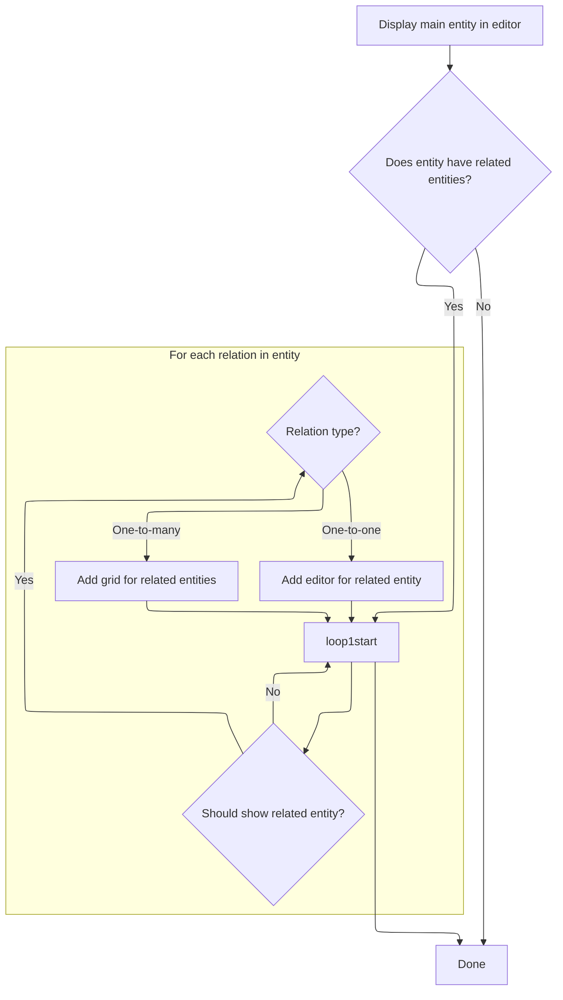

This document describes how the admin interface presents an entity and its related entities for editing and management. The flow receives an entity and its relations as input, and outputs a user interface where the main entity is always editable, and related entities are displayed as editors or grids depending on their relationship type.

# Where is this flow used?

This flow is used multiple times in the codebase as represented in the following diagram:

```mermaid
graph TD;
      26984b7cff22d447b5c1a65310569a9db52312aaa779cd1eea0c26e9396fc312(shopizer/…/modules/ISC_Forms.js::fetchDataReply) --> 625052a5e29738ee73da1c3bae37e6561b541b0cfd716cd77dc2e8819443199e(shopizer/…/modules/ISC_Forms.js::showEntity):::mainFlowStyle

4aff1405ccfef561ef3890bce55dffd81e34bc44844a5af5c8a1272527676c87(shopizer/…/modules/ISC_Forms.js::fetchDataByPK) --> 26984b7cff22d447b5c1a65310569a9db52312aaa779cd1eea0c26e9396fc312(shopizer/…/modules/ISC_Forms.js::fetchDataReply)

e173c4418689507f175bef89043a373a64a0deec51f3b9a269e43034024d56dd(shopizer/…/modules/ISC_Forms.js::isc_EntityEditor_fetchDataByPK) --> 26984b7cff22d447b5c1a65310569a9db52312aaa779cd1eea0c26e9396fc312(shopizer/…/modules/ISC_Forms.js::fetchDataReply)

883b783e62d9d880dd505c43c4d1987052cf58df4cfc2acbbe31a9256ac5addb(shopizer/…/modules/ISC_Forms.js::isc_EntityEditor_fetchDataReply) --> 625052a5e29738ee73da1c3bae37e6561b541b0cfd716cd77dc2e8819443199e(shopizer/…/modules/ISC_Forms.js::showEntity):::mainFlowStyle


classDef mainFlowStyle color:#000000,fill:#7CB9F4
classDef rootsStyle color:#000000,fill:#00FFF4
classDef Style1 color:#000000,fill:#00FFAA
classDef Style2 color:#000000,fill:#FFFF00
classDef Style3 color:#000000,fill:#AA7CB9

%% Swimm:
%% graph TD;
%%       26984b7cff22d447b5c1a65310569a9db52312aaa779cd1eea0c26e9396fc312(<SwmPath>[shopizer/…/modules/ISC_Forms.js](shopizer/sm-shop/src/main/webapp/resources/smart-client/system/modules/ISC_Forms.js)</SwmPath>::<SwmToken path="shopizer/sm-shop/src/main/webapp/resources/smart-client/system/modules/ISC_Forms.js" pos="3672:46:46" line-data=",isc.A.fetchDataByPK=function isc_EntityEditor_fetchDataByPK(_1){if(!this.dataSource)return;var _2=this;this.dataSource.fetchData(_1,function(_3,_4){_2.fetchDataReply(_4)})}">`fetchDataReply`</SwmToken>) --> 625052a5e29738ee73da1c3bae37e6561b541b0cfd716cd77dc2e8819443199e(<SwmPath>[shopizer/…/modules/ISC_Forms.js](shopizer/sm-shop/src/main/webapp/resources/smart-client/system/modules/ISC_Forms.js)</SwmPath>::<SwmToken path="shopizer/sm-shop/src/main/webapp/resources/smart-client/system/modules/ISC_Forms.js" pos="3676:5:5" line-data=",isc.A.showEntity=function isc_EntityEditor_showEntity(){var _1=this.entityTree;if(!this.entities)this.entities=[];if(!this.entityTree)return;this.addEditor(_1);this.topLevelComponent=this.entities[0];if(_1&amp;&amp;_1.relations&amp;&amp;_1.relations.length&gt;0){for(var i=0;i&lt;_1.relations.length;i++){var _3=_1.relations[i];if(this.shouldShowEntity(_3.baseDS)){if(_3.relationArity==&quot;one&quot;){this.addEditor(_3)}else{this.addGrid(_3)}}}}}">`showEntity`</SwmToken>):::mainFlowStyle
%% 
%% 4aff1405ccfef561ef3890bce55dffd81e34bc44844a5af5c8a1272527676c87(<SwmPath>[shopizer/…/modules/ISC_Forms.js](shopizer/sm-shop/src/main/webapp/resources/smart-client/system/modules/ISC_Forms.js)</SwmPath>::<SwmToken path="shopizer/sm-shop/src/main/webapp/resources/smart-client/system/modules/ISC_Forms.js" pos="3672:5:5" line-data=",isc.A.fetchDataByPK=function isc_EntityEditor_fetchDataByPK(_1){if(!this.dataSource)return;var _2=this;this.dataSource.fetchData(_1,function(_3,_4){_2.fetchDataReply(_4)})}">`fetchDataByPK`</SwmToken>) --> 26984b7cff22d447b5c1a65310569a9db52312aaa779cd1eea0c26e9396fc312(<SwmPath>[shopizer/…/modules/ISC_Forms.js](shopizer/sm-shop/src/main/webapp/resources/smart-client/system/modules/ISC_Forms.js)</SwmPath>::<SwmToken path="shopizer/sm-shop/src/main/webapp/resources/smart-client/system/modules/ISC_Forms.js" pos="3672:46:46" line-data=",isc.A.fetchDataByPK=function isc_EntityEditor_fetchDataByPK(_1){if(!this.dataSource)return;var _2=this;this.dataSource.fetchData(_1,function(_3,_4){_2.fetchDataReply(_4)})}">`fetchDataReply`</SwmToken>)
%% 
%% e173c4418689507f175bef89043a373a64a0deec51f3b9a269e43034024d56dd(<SwmPath>[shopizer/…/modules/ISC_Forms.js](shopizer/sm-shop/src/main/webapp/resources/smart-client/system/modules/ISC_Forms.js)</SwmPath>::<SwmToken path="shopizer/sm-shop/src/main/webapp/resources/smart-client/system/modules/ISC_Forms.js" pos="3672:9:9" line-data=",isc.A.fetchDataByPK=function isc_EntityEditor_fetchDataByPK(_1){if(!this.dataSource)return;var _2=this;this.dataSource.fetchData(_1,function(_3,_4){_2.fetchDataReply(_4)})}">`isc_EntityEditor_fetchDataByPK`</SwmToken>) --> 26984b7cff22d447b5c1a65310569a9db52312aaa779cd1eea0c26e9396fc312(<SwmPath>[shopizer/…/modules/ISC_Forms.js](shopizer/sm-shop/src/main/webapp/resources/smart-client/system/modules/ISC_Forms.js)</SwmPath>::<SwmToken path="shopizer/sm-shop/src/main/webapp/resources/smart-client/system/modules/ISC_Forms.js" pos="3672:46:46" line-data=",isc.A.fetchDataByPK=function isc_EntityEditor_fetchDataByPK(_1){if(!this.dataSource)return;var _2=this;this.dataSource.fetchData(_1,function(_3,_4){_2.fetchDataReply(_4)})}">`fetchDataReply`</SwmToken>)
%% 
%% 883b783e62d9d880dd505c43c4d1987052cf58df4cfc2acbbe31a9256ac5addb(<SwmPath>[shopizer/…/modules/ISC_Forms.js](shopizer/sm-shop/src/main/webapp/resources/smart-client/system/modules/ISC_Forms.js)</SwmPath>::<SwmToken path="shopizer/sm-shop/src/main/webapp/resources/smart-client/system/modules/ISC_Forms.js" pos="3673:9:9" line-data=",isc.A.fetchDataReply=function isc_EntityEditor_fetchDataReply(_1){this.clearEntity();this.record=_1[0];this.showEntity()}">`isc_EntityEditor_fetchDataReply`</SwmToken>) --> 625052a5e29738ee73da1c3bae37e6561b541b0cfd716cd77dc2e8819443199e(<SwmPath>[shopizer/…/modules/ISC_Forms.js](shopizer/sm-shop/src/main/webapp/resources/smart-client/system/modules/ISC_Forms.js)</SwmPath>::<SwmToken path="shopizer/sm-shop/src/main/webapp/resources/smart-client/system/modules/ISC_Forms.js" pos="3676:5:5" line-data=",isc.A.showEntity=function isc_EntityEditor_showEntity(){var _1=this.entityTree;if(!this.entities)this.entities=[];if(!this.entityTree)return;this.addEditor(_1);this.topLevelComponent=this.entities[0];if(_1&amp;&amp;_1.relations&amp;&amp;_1.relations.length&gt;0){for(var i=0;i&lt;_1.relations.length;i++){var _3=_1.relations[i];if(this.shouldShowEntity(_3.baseDS)){if(_3.relationArity==&quot;one&quot;){this.addEditor(_3)}else{this.addGrid(_3)}}}}}">`showEntity`</SwmToken>):::mainFlowStyle
%% 
%% 
%% classDef mainFlowStyle color:#000000,fill:#7CB9F4
%% classDef rootsStyle color:#000000,fill:#00FFF4
%% classDef Style1 color:#000000,fill:#00FFAA
%% classDef Style2 color:#000000,fill:#<SwmToken path="shopizer/sm-shop/src/main/webapp/resources/smart-client/system/modules/ISC_Forms.js" pos="3320:326:326" line-data="this.creator.hide()}};isc.A.showCancelButton=true;isc.A.cancelButtonConstructor=isc.IButton;isc.A.cancelButtonDefaults={title:&quot;Cancel&quot;,width:80,autoParent:&quot;buttonLayout&quot;,click:function(){this.creator.hide()}};isc.A.showModeToggleButton=true;isc.A.modeToggleButtonConstructor=isc.IButton;isc.A.modeToggleButtonDefaults={title:isc.ColorPicker.MORE_BUTTON_TITLE,width:80,autoParent:&quot;buttonLayout&quot;,click:function(){this.creator.$56e()}};isc.A.showButtonLayout=true;isc.A.buttonLayoutConstructor=&quot;HLayout&quot;;isc.A.buttonLayoutDefaults={autoParent:&quot;contentLayout&quot;};isc.A.defaultColor=&quot;#808080&quot;;isc.A.colorButtonSize=20;isc.A.colorButtonBaseStyle=&quot;colorChooserCell&quot;;isc.A.colorArray=[&quot;#000000&quot;,&quot;#996100&quot;,&quot;#636300&quot;,&quot;#006300&quot;,&quot;#006366&quot;,&quot;#000080&quot;,&quot;#636399&quot;,&quot;#636363&quot;,&quot;#800000&quot;,&quot;#FF6600&quot;,&quot;#808000&quot;,&quot;#8000FF&quot;,&quot;#008080&quot;,&quot;#0000FF&quot;,&quot;#666699&quot;,&quot;#808080&quot;,&quot;#FF0000&quot;,&quot;#FF9900&quot;,&quot;#99CC00&quot;,&quot;#639966&quot;,&quot;#63CCCC&quot;,&quot;#6366FF&quot;,&quot;#800080&quot;,&quot;#999999&quot;,&quot;#FF00FF&quot;,&quot;#FFCC00&quot;,&quot;#FFFF00&quot;,&quot;#00FF00&quot;,&quot;#00FFFF&quot;,&quot;#00CCFF&quot;,&quot;#996366&quot;,&quot;#C0C0C0&quot;,&quot;#FF99CC&quot;,&quot;#FFCC99&quot;,&quot;#FFFF99&quot;,&quot;#CCFFCC&quot;,&quot;#CCFFFF&quot;,&quot;#99CCFF&quot;,&quot;#CC99FF&quot;,&quot;#FFFFFF&quot;];isc.A.swatchWidth=170;isc.A.swatchHeight=170;isc.A.lumStep=4;isc.A.lumWidth=15;isc.A.supportsTransparency=true;isc.A.opacityText=&quot;Lorem ipsum dolor sit amet, consectetuer adipiscing elit.&quot;;isc.A.swatchImageURL=&quot;[SKIN]ColorPicker/spectrum.png&quot;;isc.A.crosshairImageURL=&quot;[SKIN]ColorPicker/crosshair.png&quot;;isc.A.basicColorLabel=&quot;Basic Colors:&quot;;isc.A.selectedColorLabel=&quot;Selected Color:&quot;;isc.A.opacitySliderLabel=&quot;Opacity:&quot;;isc.A.defaultOpacity=100;isc.A.autoPosition=true;isc.A.autoCenterOnShow=true;isc.A.defaultPickMode=&quot;simple&quot;;isc.A.allowComplexMode=true;isc.A.$56f=true;isc.B.push(isc.A.closeClick=function isc_ColorPicker_closeClick(){this.hide()}">`FFFF00`</SwmToken>
%% classDef Style3 color:#000000,fill:#AA7CB9
```



# Displaying the main entity and its relations

This section governs how the main entity and its relations are presented to the user, ensuring that the primary entity is always editable and that related entities are displayed according to their relationship type.

| Category        | Rule Name                      | Description                                                                                                                                                                                                                                                                                                                                                                                                                                                                                                                                                                                                                                                                                                                                          |
| --------------- | ------------------------------ | ---------------------------------------------------------------------------------------------------------------------------------------------------------------------------------------------------------------------------------------------------------------------------------------------------------------------------------------------------------------------------------------------------------------------------------------------------------------------------------------------------------------------------------------------------------------------------------------------------------------------------------------------------------------------------------------------------------------------------------------------------- |
| Data validation | Relevant relation filtering    | Only relations for which <SwmToken path="shopizer/sm-shop/src/main/webapp/resources/smart-client/system/modules/ISC_Forms.js" pos="3676:114:114" line-data=",isc.A.showEntity=function isc_EntityEditor_showEntity(){var _1=this.entityTree;if(!this.entities)this.entities=[];if(!this.entityTree)return;this.addEditor(_1);this.topLevelComponent=this.entities[0];if(_1&amp;&amp;_1.relations&amp;&amp;_1.relations.length&gt;0){for(var i=0;i&lt;_1.relations.length;i++){var _3=_1.relations[i];if(this.shouldShowEntity(_3.baseDS)){if(_3.relationArity==&quot;one&quot;){this.addEditor(_3)}else{this.addGrid(_3)}}}}}">`shouldShowEntity`</SwmToken> returns true are displayed, ensuring that only relevant entities are shown to the user. |
| Data validation | Entity existence validation    | If the main entity or its relations are missing, no editors or grids are displayed for those entities.                                                                                                                                                                                                                                                                                                                                                                                                                                                                                                                                                                                                                                               |
| Business logic  | Main entity editor display     | The main entity must always be displayed in an editor as the primary interface for user interaction.                                                                                                                                                                                                                                                                                                                                                                                                                                                                                                                                                                                                                                                 |
| Business logic  | Single relation editor display | All related entities with a 'one' relation arity must be displayed in an editor, allowing direct editing of single related entities.                                                                                                                                                                                                                                                                                                                                                                                                                                                                                                                                                                                                                 |
| Business logic  | Multiple relation grid display | All related entities with a relation arity other than 'one' must be displayed in a grid, allowing users to view and manage multiple related entities at once.                                                                                                                                                                                                                                                                                                                                                                                                                                                                                                                                                                                        |

<SwmSnippet path="/shopizer/sm-shop/src/main/webapp/resources/smart-client/system/modules/ISC_Forms.js" line="3676">

---

In <SwmToken path="shopizer/sm-shop/src/main/webapp/resources/smart-client/system/modules/ISC_Forms.js" pos="3676:5:5" line-data=",isc.A.showEntity=function isc_EntityEditor_showEntity(){var _1=this.entityTree;if(!this.entities)this.entities=[];if(!this.entityTree)return;this.addEditor(_1);this.topLevelComponent=this.entities[0];if(_1&amp;&amp;_1.relations&amp;&amp;_1.relations.length&gt;0){for(var i=0;i&lt;_1.relations.length;i++){var _3=_1.relations[i];if(this.shouldShowEntity(_3.baseDS)){if(_3.relationArity==&quot;one&quot;){this.addEditor(_3)}else{this.addGrid(_3)}}}}}">`showEntity`</SwmToken>, we kick things off by making sure the entities array exists and that there's an <SwmToken path="shopizer/sm-shop/src/main/webapp/resources/smart-client/system/modules/ISC_Forms.js" pos="3676:19:19" line-data=",isc.A.showEntity=function isc_EntityEditor_showEntity(){var _1=this.entityTree;if(!this.entities)this.entities=[];if(!this.entityTree)return;this.addEditor(_1);this.topLevelComponent=this.entities[0];if(_1&amp;&amp;_1.relations&amp;&amp;_1.relations.length&gt;0){for(var i=0;i&lt;_1.relations.length;i++){var _3=_1.relations[i];if(this.shouldShowEntity(_3.baseDS)){if(_3.relationArity==&quot;one&quot;){this.addEditor(_3)}else{this.addGrid(_3)}}}}}">`entityTree`</SwmToken> to work with. We immediately call <SwmToken path="shopizer/sm-shop/src/main/webapp/resources/smart-client/system/modules/ISC_Forms.js" pos="3676:46:46" line-data=",isc.A.showEntity=function isc_EntityEditor_showEntity(){var _1=this.entityTree;if(!this.entities)this.entities=[];if(!this.entityTree)return;this.addEditor(_1);this.topLevelComponent=this.entities[0];if(_1&amp;&amp;_1.relations&amp;&amp;_1.relations.length&gt;0){for(var i=0;i&lt;_1.relations.length;i++){var _3=_1.relations[i];if(this.shouldShowEntity(_3.baseDS)){if(_3.relationArity==&quot;one&quot;){this.addEditor(_3)}else{this.addGrid(_3)}}}}}">`addEditor`</SwmToken> for the main <SwmToken path="shopizer/sm-shop/src/main/webapp/resources/smart-client/system/modules/ISC_Forms.js" pos="3676:19:19" line-data=",isc.A.showEntity=function isc_EntityEditor_showEntity(){var _1=this.entityTree;if(!this.entities)this.entities=[];if(!this.entityTree)return;this.addEditor(_1);this.topLevelComponent=this.entities[0];if(_1&amp;&amp;_1.relations&amp;&amp;_1.relations.length&gt;0){for(var i=0;i&lt;_1.relations.length;i++){var _3=_1.relations[i];if(this.shouldShowEntity(_3.baseDS)){if(_3.relationArity==&quot;one&quot;){this.addEditor(_3)}else{this.addGrid(_3)}}}}}">`entityTree`</SwmToken>, which sets up the primary editor UI. This is necessary because the editor is the main interface for interacting with the entity, and subsequent calls to <SwmToken path="shopizer/sm-shop/src/main/webapp/resources/smart-client/system/modules/ISC_Forms.js" pos="3676:46:46" line-data=",isc.A.showEntity=function isc_EntityEditor_showEntity(){var _1=this.entityTree;if(!this.entities)this.entities=[];if(!this.entityTree)return;this.addEditor(_1);this.topLevelComponent=this.entities[0];if(_1&amp;&amp;_1.relations&amp;&amp;_1.relations.length&gt;0){for(var i=0;i&lt;_1.relations.length;i++){var _3=_1.relations[i];if(this.shouldShowEntity(_3.baseDS)){if(_3.relationArity==&quot;one&quot;){this.addEditor(_3)}else{this.addGrid(_3)}}}}}">`addEditor`</SwmToken> or <SwmToken path="shopizer/sm-shop/src/main/webapp/resources/smart-client/system/modules/ISC_Forms.js" pos="3676:144:144" line-data=",isc.A.showEntity=function isc_EntityEditor_showEntity(){var _1=this.entityTree;if(!this.entities)this.entities=[];if(!this.entityTree)return;this.addEditor(_1);this.topLevelComponent=this.entities[0];if(_1&amp;&amp;_1.relations&amp;&amp;_1.relations.length&gt;0){for(var i=0;i&lt;_1.relations.length;i++){var _3=_1.relations[i];if(this.shouldShowEntity(_3.baseDS)){if(_3.relationArity==&quot;one&quot;){this.addEditor(_3)}else{this.addGrid(_3)}}}}}">`addGrid`</SwmToken> for relations depend on this initial setup.

```javascript
,isc.A.showEntity=function isc_EntityEditor_showEntity(){var _1=this.entityTree;if(!this.entities)this.entities=[];if(!this.entityTree)return;this.addEditor(_1);this.topLevelComponent=this.entities[0];if(_1&&_1.relations&&_1.relations.length>0){for(var i=0;i<_1.relations.length;i++){var _3=_1.relations[i];if(this.shouldShowEntity(_3.baseDS)){if(_3.relationArity=="one"){this.addEditor(_3)}else{this.addGrid(_3)}}}}}
```

---

</SwmSnippet>

## Creating and linking a <SwmToken path="shopizer/sm-shop/src/main/webapp/resources/smart-client/system/modules/ISC_Forms.js" pos="3684:99:101" line-data=",isc.A.addEditor=function isc_EntityEditor_addEditor(_1){var _2=this.createAutoChild(&quot;formEntity&quot;,{height:&quot;100%&quot;,width:&quot;100%&quot;,dataSource:_1.baseDS,title:this.getEntityTitle(_1),record:this.record,relation:_1,formProperties:this.getRelatedEditorProperties(_1.baseDS,_1.relatedFieldName)});this.addEntityLink(_2);this.logWarn(&quot;adding linked single-record entity&quot;)}">`single-record`</SwmToken> editor

This section governs the process of creating a form editor for a single entity or relation and ensuring it is properly linked and displayed in the Shopizer admin UI, so that users can view and edit entity details in the appropriate context.

| Category       | Rule Name                   | Description                                                                                                                                                                                                                                                                                        |
| -------------- | --------------------------- | -------------------------------------------------------------------------------------------------------------------------------------------------------------------------------------------------------------------------------------------------------------------------------------------------- |
| Business logic | Entity Editor Creation      | A form editor must be created for each entity or relation that requires editing, using its associated data source and relation information.                                                                                                                                                        |
| Business logic | Entity Linking              | Each newly created editor must be linked to the internal entities collection to ensure it is tracked and managed by the system.                                                                                                                                                                    |
| Business logic | Editor Display Placement    | The display location of the editor must be determined by the current UI layout: if a tabset is present, the editor is shown as a new tab; if a portal is present, the editor is added as a portlet in the appropriate row and offset; otherwise, it is added as a member to the default container. |
| Business logic | Portal Placement Rules      | If the data source specification for the entity or relation includes a specific row number or offset, the editor must be placed accordingly within the portal layout.                                                                                                                              |
| Business logic | Editor Height Customization | If the data source specification includes a user-defined height for the editor, this height must be applied when displaying the editor in the portal layout.                                                                                                                                       |

<SwmSnippet path="/shopizer/sm-shop/src/main/webapp/resources/smart-client/system/modules/ISC_Forms.js" line="3684">

---

<SwmToken path="shopizer/sm-shop/src/main/webapp/resources/smart-client/system/modules/ISC_Forms.js" pos="3684:5:5" line-data=",isc.A.addEditor=function isc_EntityEditor_addEditor(_1){var _2=this.createAutoChild(&quot;formEntity&quot;,{height:&quot;100%&quot;,width:&quot;100%&quot;,dataSource:_1.baseDS,title:this.getEntityTitle(_1),record:this.record,relation:_1,formProperties:this.getRelatedEditorProperties(_1.baseDS,_1.relatedFieldName)});this.addEntityLink(_2);this.logWarn(&quot;adding linked single-record entity&quot;)}">`addEditor`</SwmToken> sets up a form editor for the given entity or relation, using its <SwmToken path="shopizer/sm-shop/src/main/webapp/resources/smart-client/system/modules/ISC_Forms.js" pos="3684:45:45" line-data=",isc.A.addEditor=function isc_EntityEditor_addEditor(_1){var _2=this.createAutoChild(&quot;formEntity&quot;,{height:&quot;100%&quot;,width:&quot;100%&quot;,dataSource:_1.baseDS,title:this.getEntityTitle(_1),record:this.record,relation:_1,formProperties:this.getRelatedEditorProperties(_1.baseDS,_1.relatedFieldName)});this.addEntityLink(_2);this.logWarn(&quot;adding linked single-record entity&quot;)}">`baseDS`</SwmToken> and <SwmToken path="shopizer/sm-shop/src/main/webapp/resources/smart-client/system/modules/ISC_Forms.js" pos="3684:78:78" line-data=",isc.A.addEditor=function isc_EntityEditor_addEditor(_1){var _2=this.createAutoChild(&quot;formEntity&quot;,{height:&quot;100%&quot;,width:&quot;100%&quot;,dataSource:_1.baseDS,title:this.getEntityTitle(_1),record:this.record,relation:_1,formProperties:this.getRelatedEditorProperties(_1.baseDS,_1.relatedFieldName)});this.addEntityLink(_2);this.logWarn(&quot;adding linked single-record entity&quot;)}">`relatedFieldName`</SwmToken> to configure the UI. Right after, it calls <SwmToken path="shopizer/sm-shop/src/main/webapp/resources/smart-client/system/modules/ISC_Forms.js" pos="3684:85:85" line-data=",isc.A.addEditor=function isc_EntityEditor_addEditor(_1){var _2=this.createAutoChild(&quot;formEntity&quot;,{height:&quot;100%&quot;,width:&quot;100%&quot;,dataSource:_1.baseDS,title:this.getEntityTitle(_1),record:this.record,relation:_1,formProperties:this.getRelatedEditorProperties(_1.baseDS,_1.relatedFieldName)});this.addEntityLink(_2);this.logWarn(&quot;adding linked single-record entity&quot;)}">`addEntityLink`</SwmToken> to hook this editor into the internal entities structure and update the UI so the editor is actually usable.

```javascript
,isc.A.addEditor=function isc_EntityEditor_addEditor(_1){var _2=this.createAutoChild("formEntity",{height:"100%",width:"100%",dataSource:_1.baseDS,title:this.getEntityTitle(_1),record:this.record,relation:_1,formProperties:this.getRelatedEditorProperties(_1.baseDS,_1.relatedFieldName)});this.addEntityLink(_2);this.logWarn("adding linked single-record entity")}
```

---

</SwmSnippet>

<SwmSnippet path="/shopizer/sm-shop/src/main/webapp/resources/smart-client/system/modules/ISC_Forms.js" line="3686">

---

<SwmToken path="shopizer/sm-shop/src/main/webapp/resources/smart-client/system/modules/ISC_Forms.js" pos="3686:5:5" line-data=",isc.A.addEntityLink=function isc_EntityEditor_addEntityLink(_1){this.entities.add(_1);if(this.showTabset){this.addEntityTab(_1)}else{var _2=_1.relation,_3=this.getDataSourceSpec(_2.baseDS,_2.relatedFieldName),_4=(_3&amp;&amp;_3.rowNum!=null?_3.rowNum:-1),_5=(_3&amp;&amp;_3.offsetInRow!=null?_3.offsetInRow:-1);if(this.portal){if(_3&amp;&amp;_3.userHeight!=null)_1.$po=_3.userHeight;if(_4!=-1){this.portal.getColumn(0).addPortletToExistingRow(_1,_4,_5)}else{this.portal.getColumn(0).addPortlet(_1)}}">`addEntityLink`</SwmToken> doesn't just link the entity—it adds it to the internal collection, then decides how to display it based on the UI setup. If there's a tabset, it adds a tab; if there's a portal, it figures out row/offset and adds a portlet; otherwise, it just adds the entity as a member. The logic depends on the entity's relation and data source spec.

```javascript
,isc.A.addEntityLink=function isc_EntityEditor_addEntityLink(_1){this.entities.add(_1);if(this.showTabset){this.addEntityTab(_1)}else{var _2=_1.relation,_3=this.getDataSourceSpec(_2.baseDS,_2.relatedFieldName),_4=(_3&&_3.rowNum!=null?_3.rowNum:-1),_5=(_3&&_3.offsetInRow!=null?_3.offsetInRow:-1);if(this.portal){if(_3&&_3.userHeight!=null)_1.$po=_3.userHeight;if(_4!=-1){this.portal.getColumn(0).addPortletToExistingRow(_1,_4,_5)}else{this.portal.getColumn(0).addPortlet(_1)}}
else this.addMember(_1)}}
```

---

</SwmSnippet>

## Handling related entities and collections



<SwmSnippet path="/shopizer/sm-shop/src/main/webapp/resources/smart-client/system/modules/ISC_Forms.js" line="3676">

---

Back in <SwmToken path="shopizer/sm-shop/src/main/webapp/resources/smart-client/system/modules/ISC_Forms.js" pos="3676:5:5" line-data=",isc.A.showEntity=function isc_EntityEditor_showEntity(){var _1=this.entityTree;if(!this.entities)this.entities=[];if(!this.entityTree)return;this.addEditor(_1);this.topLevelComponent=this.entities[0];if(_1&amp;&amp;_1.relations&amp;&amp;_1.relations.length&gt;0){for(var i=0;i&lt;_1.relations.length;i++){var _3=_1.relations[i];if(this.shouldShowEntity(_3.baseDS)){if(_3.relationArity==&quot;one&quot;){this.addEditor(_3)}else{this.addGrid(_3)}}}}}">`showEntity`</SwmToken>, after setting up the main editor, we loop through each relation in <SwmToken path="shopizer/sm-shop/src/main/webapp/resources/smart-client/system/modules/ISC_Forms.js" pos="3676:19:19" line-data=",isc.A.showEntity=function isc_EntityEditor_showEntity(){var _1=this.entityTree;if(!this.entities)this.entities=[];if(!this.entityTree)return;this.addEditor(_1);this.topLevelComponent=this.entities[0];if(_1&amp;&amp;_1.relations&amp;&amp;_1.relations.length&gt;0){for(var i=0;i&lt;_1.relations.length;i++){var _3=_1.relations[i];if(this.shouldShowEntity(_3.baseDS)){if(_3.relationArity==&quot;one&quot;){this.addEditor(_3)}else{this.addGrid(_3)}}}}}">`entityTree`</SwmToken>. If a relation should be shown and its arity isn't 'one', we call <SwmToken path="shopizer/sm-shop/src/main/webapp/resources/smart-client/system/modules/ISC_Forms.js" pos="3676:144:144" line-data=",isc.A.showEntity=function isc_EntityEditor_showEntity(){var _1=this.entityTree;if(!this.entities)this.entities=[];if(!this.entityTree)return;this.addEditor(_1);this.topLevelComponent=this.entities[0];if(_1&amp;&amp;_1.relations&amp;&amp;_1.relations.length&gt;0){for(var i=0;i&lt;_1.relations.length;i++){var _3=_1.relations[i];if(this.shouldShowEntity(_3.baseDS)){if(_3.relationArity==&quot;one&quot;){this.addEditor(_3)}else{this.addGrid(_3)}}}}}">`addGrid`</SwmToken> to handle collections of related entities. This is how multi-record relationships get their own UI component.

```javascript
,isc.A.showEntity=function isc_EntityEditor_showEntity(){var _1=this.entityTree;if(!this.entities)this.entities=[];if(!this.entityTree)return;this.addEditor(_1);this.topLevelComponent=this.entities[0];if(_1&&_1.relations&&_1.relations.length>0){for(var i=0;i<_1.relations.length;i++){var _3=_1.relations[i];if(this.shouldShowEntity(_3.baseDS)){if(_3.relationArity=="one"){this.addEditor(_3)}else{this.addGrid(_3)}}}}}
```

---

</SwmSnippet>

<SwmSnippet path="/shopizer/sm-shop/src/main/webapp/resources/smart-client/system/modules/ISC_Forms.js" line="3685">

---

<SwmToken path="shopizer/sm-shop/src/main/webapp/resources/smart-client/system/modules/ISC_Forms.js" pos="3685:5:5" line-data=",isc.A.addGrid=function isc_EntityEditor_addGrid(_1){var _2=this.createAutoChild(&quot;gridEntity&quot;,{height:&quot;100%&quot;,width:&quot;100%&quot;,dataSource:_1.baseDS,title:this.getEntityTitle(_1),record:this.record,relation:_1,gridProperties:this.getRelatedEditorProperties(_1.baseDS,_1.relatedFieldName)});this.addEntityLink(_2);this.logWarn(&quot;added linked multiple-record entity&quot;)}">`addGrid`</SwmToken> builds a grid component for the given relation, using its <SwmToken path="shopizer/sm-shop/src/main/webapp/resources/smart-client/system/modules/ISC_Forms.js" pos="3685:45:45" line-data=",isc.A.addGrid=function isc_EntityEditor_addGrid(_1){var _2=this.createAutoChild(&quot;gridEntity&quot;,{height:&quot;100%&quot;,width:&quot;100%&quot;,dataSource:_1.baseDS,title:this.getEntityTitle(_1),record:this.record,relation:_1,gridProperties:this.getRelatedEditorProperties(_1.baseDS,_1.relatedFieldName)});this.addEntityLink(_2);this.logWarn(&quot;added linked multiple-record entity&quot;)}">`baseDS`</SwmToken> and <SwmToken path="shopizer/sm-shop/src/main/webapp/resources/smart-client/system/modules/ISC_Forms.js" pos="3685:78:78" line-data=",isc.A.addGrid=function isc_EntityEditor_addGrid(_1){var _2=this.createAutoChild(&quot;gridEntity&quot;,{height:&quot;100%&quot;,width:&quot;100%&quot;,dataSource:_1.baseDS,title:this.getEntityTitle(_1),record:this.record,relation:_1,gridProperties:this.getRelatedEditorProperties(_1.baseDS,_1.relatedFieldName)});this.addEntityLink(_2);this.logWarn(&quot;added linked multiple-record entity&quot;)}">`relatedFieldName`</SwmToken> to configure the UI. It then calls <SwmToken path="shopizer/sm-shop/src/main/webapp/resources/smart-client/system/modules/ISC_Forms.js" pos="3685:85:85" line-data=",isc.A.addGrid=function isc_EntityEditor_addGrid(_1){var _2=this.createAutoChild(&quot;gridEntity&quot;,{height:&quot;100%&quot;,width:&quot;100%&quot;,dataSource:_1.baseDS,title:this.getEntityTitle(_1),record:this.record,relation:_1,gridProperties:this.getRelatedEditorProperties(_1.baseDS,_1.relatedFieldName)});this.addEntityLink(_2);this.logWarn(&quot;added linked multiple-record entity&quot;)}">`addEntityLink`</SwmToken> to hook the grid into the entities structure and update the UI so users can interact with the collection.

```javascript
,isc.A.addGrid=function isc_EntityEditor_addGrid(_1){var _2=this.createAutoChild("gridEntity",{height:"100%",width:"100%",dataSource:_1.baseDS,title:this.getEntityTitle(_1),record:this.record,relation:_1,gridProperties:this.getRelatedEditorProperties(_1.baseDS,_1.relatedFieldName)});this.addEntityLink(_2);this.logWarn("added linked multiple-record entity")}
```

---

</SwmSnippet>

&nbsp;

*This is an* <SwmToken path="shopizer/sm-shop/src/main/webapp/resources/smart-client/system/modules/ISC_Forms.js" pos="1135:51:53" line-data="{this.logWarn(&quot;This form item has more than one icon with the same specified name:&quot;+_2+&quot;. Ignoring this name and using an auto-generated one instead.&quot;);_2=null}else{_1.name=_2;return _1}}">`auto-generated`</SwmToken> *document by Swimm 🌊 and has not yet been verified by a human*

<SwmMeta version="3.0.0" repo-id="Z2l0aHViJTNBJTNBU2hvcGl6ZXIlM0ElM0F1bWFsaW5nYXN3YW1p" repo-name="Shopizer"><sup>Powered by [Swimm](https://app.swimm.io/)</sup></SwmMeta>
