This document describes how category requests containing both a friendly URL and a reference string are processed to display the appropriate category page. The flow supports flexible URL patterns and ensures consistent category display by validating input, retrieving category data, and presenting breadcrumbs, subcategories, parent categories, and manufacturers.

# Routing Category Requests with Reference

This section ensures that category requests containing a reference string are properly routed and handled, allowing for flexible URL patterns and consistent category display behavior.

| Category        | Rule Name                      | Description                                                                                                                                                                    |
| --------------- | ------------------------------ | ------------------------------------------------------------------------------------------------------------------------------------------------------------------------------ |
| Data validation | Required Parameters Validation | If either the friendly URL or reference string is missing from the request, the system must not attempt to display the category and should handle the error appropriately.     |
| Business logic  | Category Reference Routing     | When a category request includes both a friendly URL and a reference string, the system must route the request to the main category display logic.                             |
| Business logic  | Single Category Display Logic  | The system must not duplicate category display logic when handling requests with a reference string; all such requests must be delegated to the main category display handler. |

<SwmSnippet path="/shopizer/sm-shop/src/main/java/com/salesmanager/web/shop/controller/category/ShoppingCategoryController.java" line="111">

---

DisplayCategoryWithReference is just the entry point for category requests that include a reference string. It immediately delegates to <SwmToken path="shopizer/sm-shop/src/main/java/com/salesmanager/web/shop/controller/category/ShoppingCategoryController.java" pos="115:5:5" line-data="		return this.displayCategory(friendlyUrl,ref,model,request,response,locale);">`displayCategory`</SwmToken>, passing all parameters along. This setup lets us handle different URL patterns or routing needs without duplicating the main category display logic.

```java
	public String displayCategoryWithReference(@PathVariable final String friendlyUrl, @PathVariable final String ref, Model model, HttpServletRequest request, HttpServletResponse response, Locale locale) throws Exception {
		
		
		
		return this.displayCategory(friendlyUrl,ref,model,request,response,locale);
	}
```

---

</SwmSnippet>

# Preparing Category Data for Display

```mermaid
%%{init: {"flowchart": {"defaultRenderer": "elk"}} }%%
flowchart TD
    node1["Start: Receive category request"]
    click node1 openCode "shopizer/sm-shop/src/main/java/com/salesmanager/web/shop/controller/category/ShoppingCategoryController.java:136:137"
    node1 --> node2["Find category by URL"]
    click node2 openCode "shopizer/sm-shop/src/main/java/com/salesmanager/web/shop/controller/category/ShoppingCategoryController.java:144:144"
    node2 --> node3{"Is category found?"}
    click node3 openCode "shopizer/sm-shop/src/main/java/com/salesmanager/web/shop/controller/category/ShoppingCategoryController.java:148:153"
    node3 -->|"No"| node4["Show 404 page"]
    click node4 openCode "shopizer/sm-shop/src/main/java/com/salesmanager/web/shop/controller/category/ShoppingCategoryController.java:151:151"
    node3 -->|"Yes"| node5["Populate category for display"]
    click node5 openCode "shopizer/sm-shop/src/main/java/com/salesmanager/web/shop/controller/category/ShoppingCategoryController.java:155:156"
    node5 --> node6["Build breadcrumbs"]
    click node6 openCode "shopizer/sm-shop/src/main/java/com/salesmanager/web/shop/controller/category/ShoppingCategoryController.java:158:160"
    node6 --> node7["Get subcategories by lineage"]
    click node7 openCode "shopizer/sm-shop/src/main/java/com/salesmanager/web/shop/controller/category/ShoppingCategoryController.java:178:178"
    subgraph loop1["For each subcategory"]
        node7 --> node8["Add subcategory ID to list"]
        click node8 openCode "shopizer/sm-shop/src/main/java/com/salesmanager/web/shop/controller/category/ShoppingCategoryController.java:181:183"
    end
    node8 --> node9{"Is cache enabled?"}
    click node9 openCode "shopizer/sm-shop/src/main/java/com/salesmanager/web/shop/controller/category/ShoppingCategoryController.java:207:226"
    node9 -->|"Yes"| node10{"Are subcategories in cache?"}
    click node10 openCode "shopizer/sm-shop/src/main/java/com/salesmanager/web/shop/controller/category/ShoppingCategoryController.java:210:225"
    node10 -->|"Yes"| node11["Load subcategories from cache"]
    click node11 openCode "shopizer/sm-shop/src/main/java/com/salesmanager/web/shop/controller/category/ShoppingCategoryController.java:210:210"
    node10 -->|"No"| node12["Generate subcategories and cache them"]
    click node12 openCode "shopizer/sm-shop/src/main/java/com/salesmanager/web/shop/controller/category/ShoppingCategoryController.java:216:221"
    node9 -->|"No"| node12
    node11 --> node13{"Is parent reference present?"}
    node12 --> node13
    click node13 openCode "shopizer/sm-shop/src/main/java/com/salesmanager/web/shop/controller/category/ShoppingCategoryController.java:233:245"
    node13 -->|"Yes"| node14["Find and populate parent category"]
    click node14 openCode "shopizer/sm-shop/src/main/java/com/salesmanager/web/shop/controller/category/ShoppingCategoryController.java:240:241"
    node13 -->|"No"| node15["Skip parent category"]
    node14 --> node16["Load manufacturers"]
    click node16 openCode "shopizer/sm-shop/src/main/java/com/salesmanager/web/shop/controller/category/ShoppingCategoryController.java:249:251"
    node15 --> node16
    node16 --> node17["Prepare model and return category page"]
    click node17 openCode "shopizer/sm-shop/src/main/java/com/salesmanager/web/shop/controller/category/ShoppingCategoryController.java:251:264"

classDef HeadingStyle fill:#777777,stroke:#333,stroke-width:2px;

%% Swimm:
%% %%{init: {"flowchart": {"defaultRenderer": "elk"}} }%%
%% flowchart TD
%%     node1["Start: Receive category request"]
%%     click node1 openCode "<SwmPath>[shopizer/…/category/ShoppingCategoryController.java](shopizer/sm-shop/src/main/java/com/salesmanager/web/shop/controller/category/ShoppingCategoryController.java)</SwmPath>:136:137"
%%     node1 --> node2["Find category by URL"]
%%     click node2 openCode "<SwmPath>[shopizer/…/category/ShoppingCategoryController.java](shopizer/sm-shop/src/main/java/com/salesmanager/web/shop/controller/category/ShoppingCategoryController.java)</SwmPath>:144:144"
%%     node2 --> node3{"Is category found?"}
%%     click node3 openCode "<SwmPath>[shopizer/…/category/ShoppingCategoryController.java](shopizer/sm-shop/src/main/java/com/salesmanager/web/shop/controller/category/ShoppingCategoryController.java)</SwmPath>:148:153"
%%     node3 -->|"No"| node4["Show 404 page"]
%%     click node4 openCode "<SwmPath>[shopizer/…/category/ShoppingCategoryController.java](shopizer/sm-shop/src/main/java/com/salesmanager/web/shop/controller/category/ShoppingCategoryController.java)</SwmPath>:151:151"
%%     node3 -->|"Yes"| node5["Populate category for display"]
%%     click node5 openCode "<SwmPath>[shopizer/…/category/ShoppingCategoryController.java](shopizer/sm-shop/src/main/java/com/salesmanager/web/shop/controller/category/ShoppingCategoryController.java)</SwmPath>:155:156"
%%     node5 --> node6["Build breadcrumbs"]
%%     click node6 openCode "<SwmPath>[shopizer/…/category/ShoppingCategoryController.java](shopizer/sm-shop/src/main/java/com/salesmanager/web/shop/controller/category/ShoppingCategoryController.java)</SwmPath>:158:160"
%%     node6 --> node7["Get subcategories by lineage"]
%%     click node7 openCode "<SwmPath>[shopizer/…/category/ShoppingCategoryController.java](shopizer/sm-shop/src/main/java/com/salesmanager/web/shop/controller/category/ShoppingCategoryController.java)</SwmPath>:178:178"
%%     subgraph loop1["For each subcategory"]
%%         node7 --> node8["Add subcategory ID to list"]
%%         click node8 openCode "<SwmPath>[shopizer/…/category/ShoppingCategoryController.java](shopizer/sm-shop/src/main/java/com/salesmanager/web/shop/controller/category/ShoppingCategoryController.java)</SwmPath>:181:183"
%%     end
%%     node8 --> node9{"Is cache enabled?"}
%%     click node9 openCode "<SwmPath>[shopizer/…/category/ShoppingCategoryController.java](shopizer/sm-shop/src/main/java/com/salesmanager/web/shop/controller/category/ShoppingCategoryController.java)</SwmPath>:207:226"
%%     node9 -->|"Yes"| node10{"Are subcategories in cache?"}
%%     click node10 openCode "<SwmPath>[shopizer/…/category/ShoppingCategoryController.java](shopizer/sm-shop/src/main/java/com/salesmanager/web/shop/controller/category/ShoppingCategoryController.java)</SwmPath>:210:225"
%%     node10 -->|"Yes"| node11["Load subcategories from cache"]
%%     click node11 openCode "<SwmPath>[shopizer/…/category/ShoppingCategoryController.java](shopizer/sm-shop/src/main/java/com/salesmanager/web/shop/controller/category/ShoppingCategoryController.java)</SwmPath>:210:210"
%%     node10 -->|"No"| node12["Generate subcategories and cache them"]
%%     click node12 openCode "<SwmPath>[shopizer/…/category/ShoppingCategoryController.java](shopizer/sm-shop/src/main/java/com/salesmanager/web/shop/controller/category/ShoppingCategoryController.java)</SwmPath>:216:221"
%%     node9 -->|"No"| node12
%%     node11 --> node13{"Is parent reference present?"}
%%     node12 --> node13
%%     click node13 openCode "<SwmPath>[shopizer/…/category/ShoppingCategoryController.java](shopizer/sm-shop/src/main/java/com/salesmanager/web/shop/controller/category/ShoppingCategoryController.java)</SwmPath>:233:245"
%%     node13 -->|"Yes"| node14["Find and populate parent category"]
%%     click node14 openCode "<SwmPath>[shopizer/…/category/ShoppingCategoryController.java](shopizer/sm-shop/src/main/java/com/salesmanager/web/shop/controller/category/ShoppingCategoryController.java)</SwmPath>:240:241"
%%     node13 -->|"No"| node15["Skip parent category"]
%%     node14 --> node16["Load manufacturers"]
%%     click node16 openCode "<SwmPath>[shopizer/…/category/ShoppingCategoryController.java](shopizer/sm-shop/src/main/java/com/salesmanager/web/shop/controller/category/ShoppingCategoryController.java)</SwmPath>:249:251"
%%     node15 --> node16
%%     node16 --> node17["Prepare model and return category page"]
%%     click node17 openCode "<SwmPath>[shopizer/…/category/ShoppingCategoryController.java](shopizer/sm-shop/src/main/java/com/salesmanager/web/shop/controller/category/ShoppingCategoryController.java)</SwmPath>:251:264"
%% 
%% classDef HeadingStyle fill:#777777,stroke:#333,stroke-width:2px;
```



This section governs how category data is prepared for display in the Shopizer storefront. It ensures that the correct category and related information are retrieved, validated, and presented to the user, including handling missing categories and optimizing subcategory retrieval with caching.

| Category        | Rule Name                   | Description                                                                                                                                     |
| --------------- | --------------------------- | ----------------------------------------------------------------------------------------------------------------------------------------------- |
| Data validation | Category existence check    | If the requested category cannot be found by its friendly URL, the system must return a 404 page and not proceed with further data preparation. |
| Business logic  | Breadcrumb generation       | The category page must display breadcrumbs that reflect the user's navigation path to the current category.                                     |
| Business logic  | Meta information population | Meta information (title, description, keywords, URL) for the category page must be set based on the category's description data.                |
| Business logic  | Subcategory listing         | All subcategories of the current category must be retrieved and displayed, including their product counts.                                      |
| Business logic  | Parent category resolution  | If a parent category reference is provided, the parent category must be identified, retrieved, and displayed alongside the current category.    |
| Business logic  | Manufacturer listing        | The category page must display a list of manufacturers associated with products in the current category and its subcategories.                  |

<SwmSnippet path="/shopizer/sm-shop/src/main/java/com/salesmanager/web/shop/controller/category/ShoppingCategoryController.java" line="136">

---

In <SwmToken path="shopizer/sm-shop/src/main/java/com/salesmanager/web/shop/controller/category/ShoppingCategoryController.java" pos="136:5:5" line-data="	private String displayCategory(final String friendlyUrl, final String ref, Model model, HttpServletRequest request, HttpServletResponse response, Locale locale) throws Exception {">`displayCategory`</SwmToken>, we grab the store and language from request attributes, then fetch the category by its friendly URL. If the category doesn't exist, we return a 404. Otherwise, we build the category proxy, breadcrumb, and meta info, and start preparing for subcategory retrieval and caching. The function assumes store and language are already set in the request, which isn't clear from the signature.

```java
	private String displayCategory(final String friendlyUrl, final String ref, Model model, HttpServletRequest request, HttpServletResponse response, Locale locale) throws Exception {

		MerchantStore store = (MerchantStore)request.getAttribute(Constants.MERCHANT_STORE);
		
		
		
		
		//get category
		Category category = categoryService.getBySeUrl(store, friendlyUrl);
		
		Language language = (Language)request.getAttribute("LANGUAGE");
		
		if(category==null) {
			LOGGER.error("No category found for friendlyUrl " + friendlyUrl);
			//redirect on page not found
			return PageBuilderUtils.build404(store);
			
		}
		
		ReadableCategoryPopulator populator = new ReadableCategoryPopulator();
		ReadableCategory categoryProxy = populator.populate(category, new ReadableCategory(), store, language);

		Breadcrumb breadCrumb = breadcrumbsUtils.buildCategoryBreadcrumb(categoryProxy, store, language, request.getContextPath());
		request.getSession().setAttribute(Constants.BREADCRUMB, breadCrumb);
		request.setAttribute(Constants.BREADCRUMB, breadCrumb);
		
		
		//meta information
		PageInformation pageInformation = new PageInformation();
		pageInformation.setPageDescription(categoryProxy.getDescription().getMetaDescription());
		pageInformation.setPageKeywords(categoryProxy.getDescription().getKeyWords());
		pageInformation.setPageTitle(categoryProxy.getDescription().getTitle());
		pageInformation.setPageUrl(categoryProxy.getDescription().getFriendlyUrl());
		
		//** retrieves category id drill down**//
		String lineage = new StringBuilder().append(category.getLineage()).append(category.getId()).append(Constants.CATEGORY_LINEAGE_DELIMITER).toString();

		
		
		request.setAttribute(Constants.REQUEST_PAGE_INFORMATION, pageInformation);
		
		//TODO add to caching
		List<Category> subCategs = categoryService.listByLineage(store, lineage);
		List<Long> subIds = new ArrayList<Long>();
		if(subCategs!=null && subCategs.size()>0) {
			for(Category c : subCategs) {
				subIds.add(c.getId());
			}
```

---

</SwmSnippet>

<SwmSnippet path="/shopizer/sm-shop/src/main/java/com/salesmanager/web/shop/controller/category/ShoppingCategoryController.java" line="185">

---

After setting up the main category, the function checks if the 'ref' string encodes a parent category. If so, it parses out the parent ID, fetches the parent, and populates a proxy for it. It also handles subcategory caching, populates manufacturers, and adds everything to the model. Finally, it returns the template name for rendering the category page.

```java
		subIds.add(category.getId());


		StringBuilder subCategoriesCacheKey = new StringBuilder();
		subCategoriesCacheKey
		.append(store.getId())
		.append("_")
		.append(category.getId())
		.append("_")
		.append(Constants.SUBCATEGORIES_CACHE_KEY)
		.append("-")
		.append(language.getCode());
		
		StringBuilder subCategoriesMissed = new StringBuilder();
		subCategoriesMissed
		.append(subCategoriesCacheKey.toString())
		.append(Constants.MISSED_CACHE_KEY);
		
		List<BigDecimal> prices = new ArrayList<BigDecimal>();
		List<ReadableCategory> subCategories = null;
		Map<Long,Long> countProductsByCategories = null;

		if(store.isUseCache()) {

			//get from the cache
			subCategories = (List<ReadableCategory>) cache.getFromCache(subCategoriesCacheKey.toString());
			if(subCategories==null) {
				//get from missed cache
				//Boolean missedContent = (Boolean)cache.getFromCache(subCategoriesMissed.toString());

				//if(missedContent==null) {
					countProductsByCategories = getProductsByCategory(store, category, lineage, subCategs);
					subCategories = getSubCategories(store,category,countProductsByCategories,language,locale);
					
					if(subCategories!=null) {
						cache.putInCache(subCategories, subCategoriesCacheKey.toString());
					} else {
						//cache.putInCache(new Boolean(true), subCategoriesCacheKey.toString());
					}
				//}
			}
		} else {
			countProductsByCategories = getProductsByCategory(store, category, lineage, subCategs);
			subCategories = getSubCategories(store,category,countProductsByCategories,language,locale);
		}

		//Parent category
		ReadableCategory parentProxy  = null;
		if(!StringUtils.isBlank(ref) && ref.contains("c")) {
			try {
				//get preceding id from the reference chain
				String categoryChain = ref.substring(ref.indexOf(Constants.REF_SPLITTER)+1);
				int categoryPosition = categoryChain.indexOf(String.valueOf(category.getId()));
				String sCategoryId = categoryChain.substring(categoryPosition++,categoryPosition++);
				Long parentId = Long.parseLong(sCategoryId);
				Category parent = categoryService.getById(parentId);
				parentProxy = populator.populate(parent, new ReadableCategory(), store, language);
			} catch(Exception e) {
				LOGGER.error("Cannot parse category id to Long ",ref );
			}
		}
		
		
		//** List of manufacturers **//
		List<ReadableManufacturer> manufacturerList = getManufacturersByProductAndCategory(store,category,subIds,language);

		model.addAttribute("manufacturers", manufacturerList);
		model.addAttribute("parent", parentProxy);
		model.addAttribute("category", categoryProxy);
		model.addAttribute("subCategories", subCategories);
		
		if(parentProxy!=null) {
			request.setAttribute(Constants.LINK_CODE, parentProxy.getDescription().getFriendlyUrl());
		}
		
		
		/** template **/
		StringBuilder template = new StringBuilder().append(ControllerConstants.Tiles.Category.category).append(".").append(store.getStoreTemplate());

		return template.toString();
	}
```

---

</SwmSnippet>

&nbsp;

*This is an auto-generated document by Swimm 🌊 and has not yet been verified by a human*

<SwmMeta version="3.0.0" repo-id="Z2l0aHViJTNBJTNBU2hvcGl6ZXIlM0ElM0F1bWFsaW5nYXN3YW1p" repo-name="Shopizer"><sup>Powered by [Swimm](https://app.swimm.io/)</sup></SwmMeta>
