This document explains how users can access category pages using friendly URLs, without referencing parent categories. The system prepares and displays all relevant products, subcategories, navigation, and SEO information, localized to the user's language.

# Routing to Category Display

This section governs how category pages are displayed when accessed via a friendly URL, ensuring users can view category-specific content without needing to specify parent category references.

| Category       | Rule Name                    | Description                                                                                                                                                   |
| -------------- | ---------------------------- | ------------------------------------------------------------------------------------------------------------------------------------------------------------- |
| Business logic | Friendly URL Category Access | When a user requests a category page using a friendly URL, the system must display the category corresponding to that URL, regardless of any parent category. |
| Business logic | Category Content Display     | The category page displayed must show all products and information relevant to the category identified by the friendly URL.                                   |
| Business logic | Localized Category Display   | The system must support localization, displaying category information in the language specified by the user's locale.                                         |

<SwmSnippet path="/shopizer/sm-shop/src/main/java/com/salesmanager/web/shop/controller/category/ShoppingCategoryController.java" line="130">

---

DisplayCategoryNoReference is just the entry point when you want to show a category page by its friendly URL, without any parent reference. It immediately delegates to <SwmToken path="shopizer/sm-shop/src/main/java/com/salesmanager/web/shop/controller/category/ShoppingCategoryController.java" pos="132:5:5" line-data="		return this.displayCategory(friendlyUrl,null,model,request,response,locale);">`displayCategory`</SwmToken>, passing 'null' for the 'ref' parameter, so the rest of the logic happens there.

```java
	public String displayCategoryNoReference(@PathVariable final String friendlyUrl, Model model, HttpServletRequest request, HttpServletResponse response, Locale locale) throws Exception {

		return this.displayCategory(friendlyUrl,null,model,request,response,locale);
	}
```

---

</SwmSnippet>

# Preparing Category Data and Navigation

```mermaid
%%{init: {"flowchart": {"defaultRenderer": "elk"}} }%%
flowchart TD
    node1["Start: Display category page"] --> node2{"Is category found?"}
    click node1 openCode "shopizer/sm-shop/src/main/java/com/salesmanager/web/shop/controller/category/ShoppingCategoryController.java:136:144"
    node2 -->|"No"| node3["Show 404 page"]
    click node2 openCode "shopizer/sm-shop/src/main/java/com/salesmanager/web/shop/controller/category/ShoppingCategoryController.java:148:153"
    click node3 openCode "shopizer/sm-shop/src/main/java/com/salesmanager/web/shop/controller/category/ShoppingCategoryController.java:151:151"
    node2 -->|"Yes"| node4["Build readable category, breadcrumb, and meta info"]
    click node4 openCode "shopizer/sm-shop/src/main/java/com/salesmanager/web/shop/controller/category/ShoppingCategoryController.java:155:168"
    node4 --> node5["Get subcategories by lineage"]
    click node5 openCode "shopizer/sm-shop/src/main/java/com/salesmanager/web/shop/controller/category/ShoppingCategoryController.java:170:178"
    subgraph loop1["For each subcategory"]
        node5 --> node6["Add subcategory ID to list"]
        click node6 openCode "shopizer/sm-shop/src/main/java/com/salesmanager/web/shop/controller/category/ShoppingCategoryController.java:181:183"
    end
    node6 --> node7{"Is subcategory data in cache?"}
    click node7 openCode "shopizer/sm-shop/src/main/java/com/salesmanager/web/shop/controller/category/ShoppingCategoryController.java:207:226"
    node7 -->|"Yes"| node8["Load subcategories from cache"]
    click node8 openCode "shopizer/sm-shop/src/main/java/com/salesmanager/web/shop/controller/category/ShoppingCategoryController.java:210:225"
    node7 -->|"No or cache miss"| node9["Generate subcategories and cache them"]
    click node9 openCode "shopizer/sm-shop/src/main/java/com/salesmanager/web/shop/controller/category/ShoppingCategoryController.java:227:229"
    node8 --> node10["Get manufacturers for category"]
    node9 --> node10
    click node10 openCode "shopizer/sm-shop/src/main/java/com/salesmanager/web/shop/controller/category/ShoppingCategoryController.java:249:251"
    node10 --> node11{"Is parent category referenced?"}
    click node11 openCode "shopizer/sm-shop/src/main/java/com/salesmanager/web/shop/controller/category/ShoppingCategoryController.java:233:245"
    node11 -->|"Yes"| node12["Get parent category"]
    click node12 openCode "shopizer/sm-shop/src/main/java/com/salesmanager/web/shop/controller/category/ShoppingCategoryController.java:235:241"
    node11 -->|"No"| node13["Skip parent category"]
    node12 --> node14["Display category page with all data"]
    node13 --> node14
    click node14 openCode "shopizer/sm-shop/src/main/java/com/salesmanager/web/shop/controller/category/ShoppingCategoryController.java:251:264"
classDef HeadingStyle fill:#777777,stroke:#333,stroke-width:2px;

%% Swimm:
%% %%{init: {"flowchart": {"defaultRenderer": "elk"}} }%%
%% flowchart TD
%%     node1["Start: Display category page"] --> node2{"Is category found?"}
%%     click node1 openCode "<SwmPath>[shopizer/…/category/ShoppingCategoryController.java](shopizer/sm-shop/src/main/java/com/salesmanager/web/shop/controller/category/ShoppingCategoryController.java)</SwmPath>:136:144"
%%     node2 -->|"No"| node3["Show 404 page"]
%%     click node2 openCode "<SwmPath>[shopizer/…/category/ShoppingCategoryController.java](shopizer/sm-shop/src/main/java/com/salesmanager/web/shop/controller/category/ShoppingCategoryController.java)</SwmPath>:148:153"
%%     click node3 openCode "<SwmPath>[shopizer/…/category/ShoppingCategoryController.java](shopizer/sm-shop/src/main/java/com/salesmanager/web/shop/controller/category/ShoppingCategoryController.java)</SwmPath>:151:151"
%%     node2 -->|"Yes"| node4["Build readable category, breadcrumb, and meta info"]
%%     click node4 openCode "<SwmPath>[shopizer/…/category/ShoppingCategoryController.java](shopizer/sm-shop/src/main/java/com/salesmanager/web/shop/controller/category/ShoppingCategoryController.java)</SwmPath>:155:168"
%%     node4 --> node5["Get subcategories by lineage"]
%%     click node5 openCode "<SwmPath>[shopizer/…/category/ShoppingCategoryController.java](shopizer/sm-shop/src/main/java/com/salesmanager/web/shop/controller/category/ShoppingCategoryController.java)</SwmPath>:170:178"
%%     subgraph loop1["For each subcategory"]
%%         node5 --> node6["Add subcategory ID to list"]
%%         click node6 openCode "<SwmPath>[shopizer/…/category/ShoppingCategoryController.java](shopizer/sm-shop/src/main/java/com/salesmanager/web/shop/controller/category/ShoppingCategoryController.java)</SwmPath>:181:183"
%%     end
%%     node6 --> node7{"Is subcategory data in cache?"}
%%     click node7 openCode "<SwmPath>[shopizer/…/category/ShoppingCategoryController.java](shopizer/sm-shop/src/main/java/com/salesmanager/web/shop/controller/category/ShoppingCategoryController.java)</SwmPath>:207:226"
%%     node7 -->|"Yes"| node8["Load subcategories from cache"]
%%     click node8 openCode "<SwmPath>[shopizer/…/category/ShoppingCategoryController.java](shopizer/sm-shop/src/main/java/com/salesmanager/web/shop/controller/category/ShoppingCategoryController.java)</SwmPath>:210:225"
%%     node7 -->|"No or cache miss"| node9["Generate subcategories and cache them"]
%%     click node9 openCode "<SwmPath>[shopizer/…/category/ShoppingCategoryController.java](shopizer/sm-shop/src/main/java/com/salesmanager/web/shop/controller/category/ShoppingCategoryController.java)</SwmPath>:227:229"
%%     node8 --> node10["Get manufacturers for category"]
%%     node9 --> node10
%%     click node10 openCode "<SwmPath>[shopizer/…/category/ShoppingCategoryController.java](shopizer/sm-shop/src/main/java/com/salesmanager/web/shop/controller/category/ShoppingCategoryController.java)</SwmPath>:249:251"
%%     node10 --> node11{"Is parent category referenced?"}
%%     click node11 openCode "<SwmPath>[shopizer/…/category/ShoppingCategoryController.java](shopizer/sm-shop/src/main/java/com/salesmanager/web/shop/controller/category/ShoppingCategoryController.java)</SwmPath>:233:245"
%%     node11 -->|"Yes"| node12["Get parent category"]
%%     click node12 openCode "<SwmPath>[shopizer/…/category/ShoppingCategoryController.java](shopizer/sm-shop/src/main/java/com/salesmanager/web/shop/controller/category/ShoppingCategoryController.java)</SwmPath>:235:241"
%%     node11 -->|"No"| node13["Skip parent category"]
%%     node12 --> node14["Display category page with all data"]
%%     node13 --> node14
%%     click node14 openCode "<SwmPath>[shopizer/…/category/ShoppingCategoryController.java](shopizer/sm-shop/src/main/java/com/salesmanager/web/shop/controller/category/ShoppingCategoryController.java)</SwmPath>:251:264"
%% classDef HeadingStyle fill:#777777,stroke:#333,stroke-width:2px;
```



This section ensures that when a user navigates to a category page, all relevant category, navigation, and SEO data are prepared and available for rendering. It governs the rules for what data must be present and how navigation and display logic are handled for categories and their subcategories.

| Category        | Rule Name                 | Description                                                                                                                                                               |
| --------------- | ------------------------- | ------------------------------------------------------------------------------------------------------------------------------------------------------------------------- |
| Data validation | Category existence check  | If the requested category does not exist for the given friendly URL, the system must display a 404 page and not proceed with category data preparation.                   |
| Business logic  | Breadcrumb generation     | Breadcrumb navigation must be generated for every valid category page and stored in both the session and request to support user navigation and SEO.                      |
| Business logic  | Meta information setup    | Meta information (title, description, keywords, URL) must be set for each category page to support SEO and improve search engine rankings.                                |
| Business logic  | Subcategory retrieval     | All subcategories of the current category must be retrieved and displayed, including their product counts, to provide users with a complete view of available options.    |
| Business logic  | Parent category reference | If a parent category reference is provided, the parent category must be identified and its data prepared for display; if not, parent category data is omitted.            |
| Business logic  | Manufacturer listing      | A list of manufacturers associated with the current category and its subcategories must be retrieved and displayed to provide users with filtering and selection options. |

<SwmSnippet path="/shopizer/sm-shop/src/main/java/com/salesmanager/web/shop/controller/category/ShoppingCategoryController.java" line="136">

---

In <SwmToken path="shopizer/sm-shop/src/main/java/com/salesmanager/web/shop/controller/category/ShoppingCategoryController.java" pos="136:5:5" line-data="	private String displayCategory(final String friendlyUrl, final String ref, Model model, HttpServletRequest request, HttpServletResponse response, Locale locale) throws Exception {">`displayCategory`</SwmToken>, we fetch the category by its friendly URL, check if it exists, and then build a readable version for the UI. Breadcrumbs are generated and stored in both session and request for navigation, and meta info for SEO is set up in the request. This sets up everything the frontend needs for navigation and SEO before moving on to subcategory and product logic.

```java
	private String displayCategory(final String friendlyUrl, final String ref, Model model, HttpServletRequest request, HttpServletResponse response, Locale locale) throws Exception {

		MerchantStore store = (MerchantStore)request.getAttribute(Constants.MERCHANT_STORE);
		
		
		
		
		//get category
		Category category = categoryService.getBySeUrl(store, friendlyUrl);
		
		Language language = (Language)request.getAttribute("LANGUAGE");
		
		if(category==null) {
			LOGGER.error("No category found for friendlyUrl " + friendlyUrl);
			//redirect on page not found
			return PageBuilderUtils.build404(store);
			
		}
		
		ReadableCategoryPopulator populator = new ReadableCategoryPopulator();
		ReadableCategory categoryProxy = populator.populate(category, new ReadableCategory(), store, language);

		Breadcrumb breadCrumb = breadcrumbsUtils.buildCategoryBreadcrumb(categoryProxy, store, language, request.getContextPath());
		request.getSession().setAttribute(Constants.BREADCRUMB, breadCrumb);
		request.setAttribute(Constants.BREADCRUMB, breadCrumb);
		
		
		//meta information
		PageInformation pageInformation = new PageInformation();
		pageInformation.setPageDescription(categoryProxy.getDescription().getMetaDescription());
		pageInformation.setPageKeywords(categoryProxy.getDescription().getKeyWords());
		pageInformation.setPageTitle(categoryProxy.getDescription().getTitle());
		pageInformation.setPageUrl(categoryProxy.getDescription().getFriendlyUrl());
		
		//** retrieves category id drill down**//
		String lineage = new StringBuilder().append(category.getLineage()).append(category.getId()).append(Constants.CATEGORY_LINEAGE_DELIMITER).toString();

		
		
		request.setAttribute(Constants.REQUEST_PAGE_INFORMATION, pageInformation);
		
		//TODO add to caching
		List<Category> subCategs = categoryService.listByLineage(store, lineage);
		List<Long> subIds = new ArrayList<Long>();
		if(subCategs!=null && subCategs.size()>0) {
			for(Category c : subCategs) {
				subIds.add(c.getId());
			}
```

---

</SwmSnippet>

<SwmSnippet path="/shopizer/sm-shop/src/main/java/com/salesmanager/web/shop/controller/category/ShoppingCategoryController.java" line="185">

---

After prepping the category and meta info, we build a cache key and try to fetch subcategories and product counts from cache. If not found, we fetch and populate them, then cache the result. If a 'ref' is provided, we try to extract the parent category from it using substring logic. Finally, we add manufacturers, parent, category, and subcategories to the model and return the template name for rendering.

```java
		subIds.add(category.getId());


		StringBuilder subCategoriesCacheKey = new StringBuilder();
		subCategoriesCacheKey
		.append(store.getId())
		.append("_")
		.append(category.getId())
		.append("_")
		.append(Constants.SUBCATEGORIES_CACHE_KEY)
		.append("-")
		.append(language.getCode());
		
		StringBuilder subCategoriesMissed = new StringBuilder();
		subCategoriesMissed
		.append(subCategoriesCacheKey.toString())
		.append(Constants.MISSED_CACHE_KEY);
		
		List<BigDecimal> prices = new ArrayList<BigDecimal>();
		List<ReadableCategory> subCategories = null;
		Map<Long,Long> countProductsByCategories = null;

		if(store.isUseCache()) {

			//get from the cache
			subCategories = (List<ReadableCategory>) cache.getFromCache(subCategoriesCacheKey.toString());
			if(subCategories==null) {
				//get from missed cache
				//Boolean missedContent = (Boolean)cache.getFromCache(subCategoriesMissed.toString());

				//if(missedContent==null) {
					countProductsByCategories = getProductsByCategory(store, category, lineage, subCategs);
					subCategories = getSubCategories(store,category,countProductsByCategories,language,locale);
					
					if(subCategories!=null) {
						cache.putInCache(subCategories, subCategoriesCacheKey.toString());
					} else {
						//cache.putInCache(new Boolean(true), subCategoriesCacheKey.toString());
					}
				//}
			}
		} else {
			countProductsByCategories = getProductsByCategory(store, category, lineage, subCategs);
			subCategories = getSubCategories(store,category,countProductsByCategories,language,locale);
		}

		//Parent category
		ReadableCategory parentProxy  = null;
		if(!StringUtils.isBlank(ref) && ref.contains("c")) {
			try {
				//get preceding id from the reference chain
				String categoryChain = ref.substring(ref.indexOf(Constants.REF_SPLITTER)+1);
				int categoryPosition = categoryChain.indexOf(String.valueOf(category.getId()));
				String sCategoryId = categoryChain.substring(categoryPosition++,categoryPosition++);
				Long parentId = Long.parseLong(sCategoryId);
				Category parent = categoryService.getById(parentId);
				parentProxy = populator.populate(parent, new ReadableCategory(), store, language);
			} catch(Exception e) {
				LOGGER.error("Cannot parse category id to Long ",ref );
			}
		}
		
		
		//** List of manufacturers **//
		List<ReadableManufacturer> manufacturerList = getManufacturersByProductAndCategory(store,category,subIds,language);

		model.addAttribute("manufacturers", manufacturerList);
		model.addAttribute("parent", parentProxy);
		model.addAttribute("category", categoryProxy);
		model.addAttribute("subCategories", subCategories);
		
		if(parentProxy!=null) {
			request.setAttribute(Constants.LINK_CODE, parentProxy.getDescription().getFriendlyUrl());
		}
		
		
		/** template **/
		StringBuilder template = new StringBuilder().append(ControllerConstants.Tiles.Category.category).append(".").append(store.getStoreTemplate());

		return template.toString();
	}
```

---

</SwmSnippet>

&nbsp;

*This is an auto-generated document by Swimm 🌊 and has not yet been verified by a human*

<SwmMeta version="3.0.0" repo-id="Z2l0aHViJTNBJTNBU2hvcGl6ZXIlM0ElM0F1bWFsaW5nYXN3YW1p" repo-name="Shopizer"><sup>Powered by [Swimm](https://app.swimm.io/)</sup></SwmMeta>
