This document describes how category pages are displayed when accessed by their friendly URL, without reference chain dependency. The system prepares and renders all relevant category details, subcategories, breadcrumbs, meta information, and manufacturers, ensuring a localized and SEO-friendly user experience.

# Entry Point: Category by URL

This section governs how category pages are displayed when accessed directly by their friendly URL, ensuring a consistent and centralized handling of category display logic.

| Category       | Rule Name                        | Description                                                                                                                                                               |
| -------------- | -------------------------------- | ------------------------------------------------------------------------------------------------------------------------------------------------------------------------- |
| Business logic | Display category by friendly URL | When a category is accessed by its friendly URL, the system must display the category page corresponding to that URL, showing all relevant category details and products. |
| Business logic | No reference chain dependency    | The category display must not depend on any reference chain; only the friendly URL is used to identify and render the category.                                           |
| Business logic | Locale-based rendering           | The category page must be rendered using the locale provided in the request, ensuring all content is localized appropriately.                                             |

<SwmSnippet path="/shopizer/sm-shop/src/main/java/com/salesmanager/web/shop/controller/category/ShoppingCategoryController.java" line="130">

---

<SwmToken path="shopizer/sm-shop/src/main/java/com/salesmanager/web/shop/controller/category/ShoppingCategoryController.java" pos="130:5:5" line-data="	public String displayCategoryNoReference(@PathVariable final String friendlyUrl, Model model, HttpServletRequest request, HttpServletResponse response, Locale locale) throws Exception {">`displayCategoryNoReference`</SwmToken> kicks off the flow when a category is accessed by its friendly URL without any reference chain. It just delegates to <SwmToken path="shopizer/sm-shop/src/main/java/com/salesmanager/web/shop/controller/category/ShoppingCategoryController.java" pos="132:5:5" line-data="		return this.displayCategory(friendlyUrl,null,model,request,response,locale);">`displayCategory`</SwmToken>, passing 'null' for the reference, so all the actual logic is centralized in one place. This keeps things DRY and makes sure all category display logic is handled consistently.

```java
	public String displayCategoryNoReference(@PathVariable final String friendlyUrl, Model model, HttpServletRequest request, HttpServletResponse response, Locale locale) throws Exception {

		return this.displayCategory(friendlyUrl,null,model,request,response,locale);
	}
```

---

</SwmSnippet>

# Category Data Preparation and Subcategory Handling

```mermaid
%%{init: {"flowchart": {"defaultRenderer": "elk"}} }%%
flowchart TD
  node1["User requests category page (by URL)"] --> node2{"Is category found?"}
  click node1 openCode "shopizer/sm-shop/src/main/java/com/salesmanager/web/shop/controller/category/ShoppingCategoryController.java:136:144"
  node2 -->|"No"| node3["Show 404 page"]
  click node2 openCode "shopizer/sm-shop/src/main/java/com/salesmanager/web/shop/controller/category/ShoppingCategoryController.java:148:153"
  node2 -->|"Yes"| node4["Prepare category, breadcrumbs, and meta info"]
  click node3 openCode "shopizer/sm-shop/src/main/java/com/salesmanager/web/shop/controller/category/ShoppingCategoryController.java:151:151"
  click node4 openCode "shopizer/sm-shop/src/main/java/com/salesmanager/web/shop/controller/category/ShoppingCategoryController.java:155:168"
  node4 --> node5["Get subcategories by lineage"]
  click node5 openCode "shopizer/sm-shop/src/main/java/com/salesmanager/web/shop/controller/category/ShoppingCategoryController.java:170:178"
  subgraph loop1["For each subcategory"]
    node5 --> node6["Add subcategory ID"]
    click node6 openCode "shopizer/sm-shop/src/main/java/com/salesmanager/web/shop/controller/category/ShoppingCategoryController.java:181:183"
  end
  node5 --> node7{"Use cache?"}
  click node7 openCode "shopizer/sm-shop/src/main/java/com/salesmanager/web/shop/controller/category/ShoppingCategoryController.java:207:226"
  node7 -->|"Yes"| node8["Load subcategories from cache"]
  click node8 openCode "shopizer/sm-shop/src/main/java/com/salesmanager/web/shop/controller/category/ShoppingCategoryController.java:210:225"
  node7 -->|"No"| node9["Load subcategories and product counts"]
  click node9 openCode "shopizer/sm-shop/src/main/java/com/salesmanager/web/shop/controller/category/ShoppingCategoryController.java:227:229"
  node8 --> node10["Get manufacturers"]
  node9 --> node10
  click node10 openCode "shopizer/sm-shop/src/main/java/com/salesmanager/web/shop/controller/category/ShoppingCategoryController.java:249:251"
  node10 --> node11{"Parent category reference?"}
  click node11 openCode "shopizer/sm-shop/src/main/java/com/salesmanager/web/shop/controller/category/ShoppingCategoryController.java:233:245"
  node11 -->|"Yes"| node12["Prepare parent category"]
  click node12 openCode "shopizer/sm-shop/src/main/java/com/salesmanager/web/shop/controller/category/ShoppingCategoryController.java:241:241"
  node11 -->|"No"| node13["Show category page"]
  node12 --> node13
  click node13 openCode "shopizer/sm-shop/src/main/java/com/salesmanager/web/shop/controller/category/ShoppingCategoryController.java:262:264"
classDef HeadingStyle fill:#777777,stroke:#333,stroke-width:2px;

%% Swimm:
%% %%{init: {"flowchart": {"defaultRenderer": "elk"}} }%%
%% flowchart TD
%%   node1["User requests category page (by URL)"] --> node2{"Is category found?"}
%%   click node1 openCode "<SwmPath>[shopizer/…/category/ShoppingCategoryController.java](shopizer/sm-shop/src/main/java/com/salesmanager/web/shop/controller/category/ShoppingCategoryController.java)</SwmPath>:136:144"
%%   node2 -->|"No"| node3["Show 404 page"]
%%   click node2 openCode "<SwmPath>[shopizer/…/category/ShoppingCategoryController.java](shopizer/sm-shop/src/main/java/com/salesmanager/web/shop/controller/category/ShoppingCategoryController.java)</SwmPath>:148:153"
%%   node2 -->|"Yes"| node4["Prepare category, breadcrumbs, and meta info"]
%%   click node3 openCode "<SwmPath>[shopizer/…/category/ShoppingCategoryController.java](shopizer/sm-shop/src/main/java/com/salesmanager/web/shop/controller/category/ShoppingCategoryController.java)</SwmPath>:151:151"
%%   click node4 openCode "<SwmPath>[shopizer/…/category/ShoppingCategoryController.java](shopizer/sm-shop/src/main/java/com/salesmanager/web/shop/controller/category/ShoppingCategoryController.java)</SwmPath>:155:168"
%%   node4 --> node5["Get subcategories by lineage"]
%%   click node5 openCode "<SwmPath>[shopizer/…/category/ShoppingCategoryController.java](shopizer/sm-shop/src/main/java/com/salesmanager/web/shop/controller/category/ShoppingCategoryController.java)</SwmPath>:170:178"
%%   subgraph loop1["For each subcategory"]
%%     node5 --> node6["Add subcategory ID"]
%%     click node6 openCode "<SwmPath>[shopizer/…/category/ShoppingCategoryController.java](shopizer/sm-shop/src/main/java/com/salesmanager/web/shop/controller/category/ShoppingCategoryController.java)</SwmPath>:181:183"
%%   end
%%   node5 --> node7{"Use cache?"}
%%   click node7 openCode "<SwmPath>[shopizer/…/category/ShoppingCategoryController.java](shopizer/sm-shop/src/main/java/com/salesmanager/web/shop/controller/category/ShoppingCategoryController.java)</SwmPath>:207:226"
%%   node7 -->|"Yes"| node8["Load subcategories from cache"]
%%   click node8 openCode "<SwmPath>[shopizer/…/category/ShoppingCategoryController.java](shopizer/sm-shop/src/main/java/com/salesmanager/web/shop/controller/category/ShoppingCategoryController.java)</SwmPath>:210:225"
%%   node7 -->|"No"| node9["Load subcategories and product counts"]
%%   click node9 openCode "<SwmPath>[shopizer/…/category/ShoppingCategoryController.java](shopizer/sm-shop/src/main/java/com/salesmanager/web/shop/controller/category/ShoppingCategoryController.java)</SwmPath>:227:229"
%%   node8 --> node10["Get manufacturers"]
%%   node9 --> node10
%%   click node10 openCode "<SwmPath>[shopizer/…/category/ShoppingCategoryController.java](shopizer/sm-shop/src/main/java/com/salesmanager/web/shop/controller/category/ShoppingCategoryController.java)</SwmPath>:249:251"
%%   node10 --> node11{"Parent category reference?"}
%%   click node11 openCode "<SwmPath>[shopizer/…/category/ShoppingCategoryController.java](shopizer/sm-shop/src/main/java/com/salesmanager/web/shop/controller/category/ShoppingCategoryController.java)</SwmPath>:233:245"
%%   node11 -->|"Yes"| node12["Prepare parent category"]
%%   click node12 openCode "<SwmPath>[shopizer/…/category/ShoppingCategoryController.java](shopizer/sm-shop/src/main/java/com/salesmanager/web/shop/controller/category/ShoppingCategoryController.java)</SwmPath>:241:241"
%%   node11 -->|"No"| node13["Show category page"]
%%   node12 --> node13
%%   click node13 openCode "<SwmPath>[shopizer/…/category/ShoppingCategoryController.java](shopizer/sm-shop/src/main/java/com/salesmanager/web/shop/controller/category/ShoppingCategoryController.java)</SwmPath>:262:264"
%% classDef HeadingStyle fill:#777777,stroke:#333,stroke-width:2px;
```



This section governs how category and subcategory data is prepared for display on the category page, ensuring users see accurate, SEO-friendly, and complete information for their browsing context.

| Category        | Rule Name                 | Description                                                                                                                                          |
| --------------- | ------------------------- | ---------------------------------------------------------------------------------------------------------------------------------------------------- |
| Data validation | Category existence check  | If a category matching the requested URL is not found, the system must display a 404 error page and not proceed with further data preparation.       |
| Business logic  | Breadcrumb generation     | Breadcrumbs must be generated for the category page to provide users with navigational context and improve SEO.                                      |
| Business logic  | Meta info setup           | Meta information (title, description, keywords, URL) must be set for the category page to support SEO and accurate page representation.              |
| Business logic  | Subcategory inclusion     | All subcategories of the current category must be retrieved and included in the page model, along with their product counts if available.            |
| Business logic  | Parent category reference | If a parent category reference is provided, the parent category must be retrieved and included in the page model for context.                        |
| Business logic  | Manufacturer inclusion    | A list of manufacturers relevant to the category and its subcategories must be included in the page model to support product filtering and browsing. |

<SwmSnippet path="/shopizer/sm-shop/src/main/java/com/salesmanager/web/shop/controller/category/ShoppingCategoryController.java" line="136">

---

In <SwmToken path="shopizer/sm-shop/src/main/java/com/salesmanager/web/shop/controller/category/ShoppingCategoryController.java" pos="136:5:5" line-data="	private String displayCategory(final String friendlyUrl, final String ref, Model model, HttpServletRequest request, HttpServletResponse response, Locale locale) throws Exception {">`displayCategory`</SwmToken>, we grab the store and language from the request, fetch the category by its URL, and bail out with a 404 if it's missing. Then we prep the category data for the view, build breadcrumbs, and set up meta info for SEO. The lineage string is built to help fetch all subcategories in the next steps.

```java
	private String displayCategory(final String friendlyUrl, final String ref, Model model, HttpServletRequest request, HttpServletResponse response, Locale locale) throws Exception {

		MerchantStore store = (MerchantStore)request.getAttribute(Constants.MERCHANT_STORE);
		
		
		
		
		//get category
		Category category = categoryService.getBySeUrl(store, friendlyUrl);
		
		Language language = (Language)request.getAttribute("LANGUAGE");
		
		if(category==null) {
			LOGGER.error("No category found for friendlyUrl " + friendlyUrl);
			//redirect on page not found
			return PageBuilderUtils.build404(store);
			
		}
		
		ReadableCategoryPopulator populator = new ReadableCategoryPopulator();
		ReadableCategory categoryProxy = populator.populate(category, new ReadableCategory(), store, language);

		Breadcrumb breadCrumb = breadcrumbsUtils.buildCategoryBreadcrumb(categoryProxy, store, language, request.getContextPath());
		request.getSession().setAttribute(Constants.BREADCRUMB, breadCrumb);
		request.setAttribute(Constants.BREADCRUMB, breadCrumb);
		
		
		//meta information
		PageInformation pageInformation = new PageInformation();
		pageInformation.setPageDescription(categoryProxy.getDescription().getMetaDescription());
		pageInformation.setPageKeywords(categoryProxy.getDescription().getKeyWords());
		pageInformation.setPageTitle(categoryProxy.getDescription().getTitle());
		pageInformation.setPageUrl(categoryProxy.getDescription().getFriendlyUrl());
		
		//** retrieves category id drill down**//
		String lineage = new StringBuilder().append(category.getLineage()).append(category.getId()).append(Constants.CATEGORY_LINEAGE_DELIMITER).toString();

		
		
		request.setAttribute(Constants.REQUEST_PAGE_INFORMATION, pageInformation);
		
		//TODO add to caching
		List<Category> subCategs = categoryService.listByLineage(store, lineage);
		List<Long> subIds = new ArrayList<Long>();
		if(subCategs!=null && subCategs.size()>0) {
			for(Category c : subCategs) {
				subIds.add(c.getId());
			}
```

---

</SwmSnippet>

<SwmSnippet path="/shopizer/sm-shop/src/main/java/com/salesmanager/web/shop/controller/category/ShoppingCategoryController.java" line="185">

---

Here we build cache keys for subcategories and check if they're cached. If not, we fetch product counts and then call <SwmToken path="shopizer/sm-shop/src/main/java/com/salesmanager/web/shop/controller/category/ShoppingCategoryController.java" pos="217:5:5" line-data="					subCategories = getSubCategories(store,category,countProductsByCategories,language,locale);">`getSubCategories`</SwmToken> to build the list for the view. This keeps things fast and avoids redundant DB hits. If caching is off, we just fetch everything directly.

```java
		subIds.add(category.getId());


		StringBuilder subCategoriesCacheKey = new StringBuilder();
		subCategoriesCacheKey
		.append(store.getId())
		.append("_")
		.append(category.getId())
		.append("_")
		.append(Constants.SUBCATEGORIES_CACHE_KEY)
		.append("-")
		.append(language.getCode());
		
		StringBuilder subCategoriesMissed = new StringBuilder();
		subCategoriesMissed
		.append(subCategoriesCacheKey.toString())
		.append(Constants.MISSED_CACHE_KEY);
		
		List<BigDecimal> prices = new ArrayList<BigDecimal>();
		List<ReadableCategory> subCategories = null;
		Map<Long,Long> countProductsByCategories = null;

		if(store.isUseCache()) {

			//get from the cache
			subCategories = (List<ReadableCategory>) cache.getFromCache(subCategoriesCacheKey.toString());
			if(subCategories==null) {
				//get from missed cache
				//Boolean missedContent = (Boolean)cache.getFromCache(subCategoriesMissed.toString());

				//if(missedContent==null) {
					countProductsByCategories = getProductsByCategory(store, category, lineage, subCategs);
					subCategories = getSubCategories(store,category,countProductsByCategories,language,locale);
					
					if(subCategories!=null) {
						cache.putInCache(subCategories, subCategoriesCacheKey.toString());
					} else {
						//cache.putInCache(new Boolean(true), subCategoriesCacheKey.toString());
					}
				//}
			}
		} else {
			countProductsByCategories = getProductsByCategory(store, category, lineage, subCategs);
			subCategories = getSubCategories(store,category,countProductsByCategories,language,locale);
		}

```

---

</SwmSnippet>

<SwmSnippet path="/shopizer/sm-shop/src/main/java/com/salesmanager/web/shop/controller/category/ShoppingCategoryController.java" line="367">

---

<SwmToken path="shopizer/sm-shop/src/main/java/com/salesmanager/web/shop/controller/category/ShoppingCategoryController.java" pos="367:8:8" line-data="	private List&lt;ReadableCategory&gt; getSubCategories(MerchantStore store, Category category, Map&lt;Long,Long&gt; productCount, Language language, Locale locale) throws Exception {">`getSubCategories`</SwmToken> fetches subcategories for the given category and language, then uses a populator to turn them into view-friendly objects. If product counts are available, they're set on each readable category. The result is a list ready for the UI or API.

```java
	private List<ReadableCategory> getSubCategories(MerchantStore store, Category category, Map<Long,Long> productCount, Language language, Locale locale) throws Exception {
		
		
		//sub categories
		List<Category> subCategories = categoryService.listByParent(category, language);
		ReadableCategoryPopulator populator = new ReadableCategoryPopulator();
		List<ReadableCategory> subCategoryProxies = new ArrayList<ReadableCategory>();
		
		
		
		for(Category sub : subCategories) {
			ReadableCategory cProxy  = populator.populate(sub, new ReadableCategory(), store, language);
			//com.salesmanager.web.entity.catalog.Category cProxy =  catalogUtils.buildProxyCategory(sub, store, locale);
			if(productCount!=null) {
				Long total = productCount.get(cProxy.getId());
				if(total!=null) {
					cProxy.setProductCount(total.intValue());
				}
			}
			subCategoryProxies.add(cProxy);
		}
```

---

</SwmSnippet>

<SwmSnippet path="/shopizer/sm-shop/src/main/java/com/salesmanager/web/shop/controller/category/ShoppingCategoryController.java" line="231">

---

Back in <SwmToken path="shopizer/sm-shop/src/main/java/com/salesmanager/web/shop/controller/category/ShoppingCategoryController.java" pos="132:5:5" line-data="		return this.displayCategory(friendlyUrl,null,model,request,response,locale);">`displayCategory`</SwmToken>, after getting the subcategories, we attach them, the parent (if any), and manufacturers to the model. This sets up everything the view needs to render the category page, then we return the template name for rendering.

```java
		//Parent category
		ReadableCategory parentProxy  = null;
		if(!StringUtils.isBlank(ref) && ref.contains("c")) {
			try {
				//get preceding id from the reference chain
				String categoryChain = ref.substring(ref.indexOf(Constants.REF_SPLITTER)+1);
				int categoryPosition = categoryChain.indexOf(String.valueOf(category.getId()));
				String sCategoryId = categoryChain.substring(categoryPosition++,categoryPosition++);
				Long parentId = Long.parseLong(sCategoryId);
				Category parent = categoryService.getById(parentId);
				parentProxy = populator.populate(parent, new ReadableCategory(), store, language);
			} catch(Exception e) {
				LOGGER.error("Cannot parse category id to Long ",ref );
			}
		}
		
		
		//** List of manufacturers **//
		List<ReadableManufacturer> manufacturerList = getManufacturersByProductAndCategory(store,category,subIds,language);

		model.addAttribute("manufacturers", manufacturerList);
		model.addAttribute("parent", parentProxy);
		model.addAttribute("category", categoryProxy);
		model.addAttribute("subCategories", subCategories);
		
		if(parentProxy!=null) {
			request.setAttribute(Constants.LINK_CODE, parentProxy.getDescription().getFriendlyUrl());
		}
		
		
		/** template **/
		StringBuilder template = new StringBuilder().append(ControllerConstants.Tiles.Category.category).append(".").append(store.getStoreTemplate());

		return template.toString();
	}
```

---

</SwmSnippet>

&nbsp;

*This is an auto-generated document by Swimm 🌊 and has not yet been verified by a human*

<SwmMeta version="3.0.0" repo-id="Z2l0aHViJTNBJTNBU2hvcGl6ZXIlM0ElM0F1bWFsaW5nYXN3YW1p" repo-name="Shopizer"><sup>Powered by [Swimm](https://app.swimm.io/)</sup></SwmMeta>
