This document outlines how a category page is displayed when accessed through a friendly URL and reference string. The system identifies the correct category, determines navigation context, and prepares all relevant data such as subcategories, manufacturers, and locale-specific content to render a comprehensive category page.

# Routing with Reference for Category Display

This section governs how category pages are displayed when accessed via a friendly URL and a reference string, ensuring users are shown the correct category and navigation context.

| Category       | Rule Name                          | Description                                                                                                                                               |
| -------------- | ---------------------------------- | --------------------------------------------------------------------------------------------------------------------------------------------------------- |
| Business logic | Category Display by Friendly URL   | When a user requests a category page using a friendly URL and a reference string, the system must display the category corresponding to the friendly URL. |
| Business logic | Reference-Based Navigation Context | The reference string provided in the request must be used to determine the navigation context or filtering for the category page.                         |
| Business logic | Locale-Specific Category Display   | The category page must be rendered in the locale specified by the user or browser settings.                                                               |

<SwmSnippet path="/shopizer/sm-shop/src/main/java/com/salesmanager/web/shop/controller/category/ShoppingCategoryController.java" line="111">

---

DisplayCategoryWithReference just forwards the request to <SwmToken path="shopizer/sm-shop/src/main/java/com/salesmanager/web/shop/controller/category/ShoppingCategoryController.java" pos="115:5:5" line-data="		return this.displayCategory(friendlyUrl,ref,model,request,response,locale);">`displayCategory`</SwmToken>, passing along the reference string so the next function can handle category navigation details.

```java
	public String displayCategoryWithReference(@PathVariable final String friendlyUrl, @PathVariable final String ref, Model model, HttpServletRequest request, HttpServletResponse response, Locale locale) throws Exception {
		
		
		
		return this.displayCategory(friendlyUrl,ref,model,request,response,locale);
	}
```

---

</SwmSnippet>

# Category Data Preparation and Manufacturer Lookup

```mermaid
%%{init: {"flowchart": {"defaultRenderer": "elk"}} }%%
flowchart TD
    node1["Lookup category by URL"] --> node2{"Is category found?"}
    click node1 openCode "shopizer/sm-shop/src/main/java/com/salesmanager/web/shop/controller/category/ShoppingCategoryController.java:144:144"
    node2 -->|"No"| node3["Return 404 page"]
    click node2 openCode "shopizer/sm-shop/src/main/java/com/salesmanager/web/shop/controller/category/ShoppingCategoryController.java:148:153"
    node2 -->|"Yes"| node4["Populate readable category"]
    click node4 openCode "shopizer/sm-shop/src/main/java/com/salesmanager/web/shop/controller/category/ShoppingCategoryController.java:155:156"
    node4 --> node5["Build breadcrumb"]
    click node5 openCode "shopizer/sm-shop/src/main/java/com/salesmanager/web/shop/controller/category/ShoppingCategoryController.java:158:160"
    node5 --> node6["Collect subcategory IDs"]
    click node6 openCode "shopizer/sm-shop/src/main/java/com/salesmanager/web/shop/controller/category/ShoppingCategoryController.java:178:185"
    subgraph loop1["For each subcategory"]
        node6 --> node7["Add subcategory ID"]
        click node7 openCode "shopizer/sm-shop/src/main/java/com/salesmanager/web/shop/controller/category/ShoppingCategoryController.java:181:183"
        node7 --> node6
    end
    node6 --> node8{"Is cache enabled?"}
    click node8 openCode "shopizer/sm-shop/src/main/java/com/salesmanager/web/shop/controller/category/ShoppingCategoryController.java:207:226"
    node8 -->|"Yes"| node9["Load subcategories from cache or generate"]
    node8 -->|"No"| node10["Generate subcategories"]
    click node9 openCode "shopizer/sm-shop/src/main/java/com/salesmanager/web/shop/controller/category/ShoppingCategoryController.java:210:225"
    click node10 openCode "shopizer/sm-shop/src/main/java/com/salesmanager/web/shop/controller/category/ShoppingCategoryController.java:227:229"
    node9 --> node11{"Is parent reference provided?"}
    node10 --> node11
    click node11 openCode "shopizer/sm-shop/src/main/java/com/salesmanager/web/shop/controller/category/ShoppingCategoryController.java:233:245"
    node11 -->|"Yes"| node12["Load parent category"]
    node11 -->|"No"| node13["Continue"]
    node12 --> node14["Load manufacturers"]
    node13 --> node14
    click node12 openCode "shopizer/sm-shop/src/main/java/com/salesmanager/web/shop/controller/category/ShoppingCategoryController.java:241:241"
    node14 --> node15["Prepare model and return category page"]
    click node14 openCode "shopizer/sm-shop/src/main/java/com/salesmanager/web/shop/controller/category/ShoppingCategoryController.java:249:251"
    click node15 openCode "shopizer/sm-shop/src/main/java/com/salesmanager/web/shop/controller/category/ShoppingCategoryController.java:251:264"

classDef HeadingStyle fill:#777777,stroke:#333,stroke-width:2px;

%% Swimm:
%% %%{init: {"flowchart": {"defaultRenderer": "elk"}} }%%
%% flowchart TD
%%     node1["Lookup category by URL"] --> node2{"Is category found?"}
%%     click node1 openCode "<SwmPath>[shopizer/…/category/ShoppingCategoryController.java](shopizer/sm-shop/src/main/java/com/salesmanager/web/shop/controller/category/ShoppingCategoryController.java)</SwmPath>:144:144"
%%     node2 -->|"No"| node3["Return 404 page"]
%%     click node2 openCode "<SwmPath>[shopizer/…/category/ShoppingCategoryController.java](shopizer/sm-shop/src/main/java/com/salesmanager/web/shop/controller/category/ShoppingCategoryController.java)</SwmPath>:148:153"
%%     node2 -->|"Yes"| node4["Populate readable category"]
%%     click node4 openCode "<SwmPath>[shopizer/…/category/ShoppingCategoryController.java](shopizer/sm-shop/src/main/java/com/salesmanager/web/shop/controller/category/ShoppingCategoryController.java)</SwmPath>:155:156"
%%     node4 --> node5["Build breadcrumb"]
%%     click node5 openCode "<SwmPath>[shopizer/…/category/ShoppingCategoryController.java](shopizer/sm-shop/src/main/java/com/salesmanager/web/shop/controller/category/ShoppingCategoryController.java)</SwmPath>:158:160"
%%     node5 --> node6["Collect subcategory IDs"]
%%     click node6 openCode "<SwmPath>[shopizer/…/category/ShoppingCategoryController.java](shopizer/sm-shop/src/main/java/com/salesmanager/web/shop/controller/category/ShoppingCategoryController.java)</SwmPath>:178:185"
%%     subgraph loop1["For each subcategory"]
%%         node6 --> node7["Add subcategory ID"]
%%         click node7 openCode "<SwmPath>[shopizer/…/category/ShoppingCategoryController.java](shopizer/sm-shop/src/main/java/com/salesmanager/web/shop/controller/category/ShoppingCategoryController.java)</SwmPath>:181:183"
%%         node7 --> node6
%%     end
%%     node6 --> node8{"Is cache enabled?"}
%%     click node8 openCode "<SwmPath>[shopizer/…/category/ShoppingCategoryController.java](shopizer/sm-shop/src/main/java/com/salesmanager/web/shop/controller/category/ShoppingCategoryController.java)</SwmPath>:207:226"
%%     node8 -->|"Yes"| node9["Load subcategories from cache or generate"]
%%     node8 -->|"No"| node10["Generate subcategories"]
%%     click node9 openCode "<SwmPath>[shopizer/…/category/ShoppingCategoryController.java](shopizer/sm-shop/src/main/java/com/salesmanager/web/shop/controller/category/ShoppingCategoryController.java)</SwmPath>:210:225"
%%     click node10 openCode "<SwmPath>[shopizer/…/category/ShoppingCategoryController.java](shopizer/sm-shop/src/main/java/com/salesmanager/web/shop/controller/category/ShoppingCategoryController.java)</SwmPath>:227:229"
%%     node9 --> node11{"Is parent reference provided?"}
%%     node10 --> node11
%%     click node11 openCode "<SwmPath>[shopizer/…/category/ShoppingCategoryController.java](shopizer/sm-shop/src/main/java/com/salesmanager/web/shop/controller/category/ShoppingCategoryController.java)</SwmPath>:233:245"
%%     node11 -->|"Yes"| node12["Load parent category"]
%%     node11 -->|"No"| node13["Continue"]
%%     node12 --> node14["Load manufacturers"]
%%     node13 --> node14
%%     click node12 openCode "<SwmPath>[shopizer/…/category/ShoppingCategoryController.java](shopizer/sm-shop/src/main/java/com/salesmanager/web/shop/controller/category/ShoppingCategoryController.java)</SwmPath>:241:241"
%%     node14 --> node15["Prepare model and return category page"]
%%     click node14 openCode "<SwmPath>[shopizer/…/category/ShoppingCategoryController.java](shopizer/sm-shop/src/main/java/com/salesmanager/web/shop/controller/category/ShoppingCategoryController.java)</SwmPath>:249:251"
%%     click node15 openCode "<SwmPath>[shopizer/…/category/ShoppingCategoryController.java](shopizer/sm-shop/src/main/java/com/salesmanager/web/shop/controller/category/ShoppingCategoryController.java)</SwmPath>:251:264"
%% 
%% classDef HeadingStyle fill:#777777,stroke:#333,stroke-width:2px;
```



This section governs how category data and manufacturer information are prepared for display on a category page. It ensures that the correct category is shown, relevant subcategories and manufacturers are listed, and all contextual information (breadcrumbs, meta info) is included for a complete user experience.

| Category       | Rule Name                 | Description                                                                                                                          |
| -------------- | ------------------------- | ------------------------------------------------------------------------------------------------------------------------------------ |
| Business logic | Breadcrumb generation     | Breadcrumbs must be generated for every valid category page to provide navigation context to the user.                               |
| Business logic | Meta information setup    | Meta information (title, keywords, description, URL) must be set for each category page to support SEO and page identification.      |
| Business logic | Subcategory ID collection | All subcategories of the current category must be identified and their IDs collected for further data retrieval and display.         |
| Business logic | Parent category inclusion | If a parent category reference is provided, the parent category must be loaded and included in the model for display and navigation. |
| Business logic | Manufacturer listing      | Manufacturers associated with products in the current category and its subcategories must be listed on the category page.            |

<SwmSnippet path="/shopizer/sm-shop/src/main/java/com/salesmanager/web/shop/controller/category/ShoppingCategoryController.java" line="136">

---

In <SwmToken path="shopizer/sm-shop/src/main/java/com/salesmanager/web/shop/controller/category/ShoppingCategoryController.java" pos="136:5:5" line-data="	private String displayCategory(final String friendlyUrl, final String ref, Model model, HttpServletRequest request, HttpServletResponse response, Locale locale) throws Exception {">`displayCategory`</SwmToken>, we grab the merchant store and language from the request, look up the category by its friendly URL, and set up meta info and breadcrumbs. Then we build a lineage string using <SwmToken path="shopizer/sm-shop/src/main/java/com/salesmanager/web/shop/controller/category/ShoppingCategoryController.java" pos="171:35:35" line-data="		String lineage = new StringBuilder().append(category.getLineage()).append(category.getId()).append(Constants.CATEGORY_LINEAGE_DELIMITER).toString();">`CATEGORY_LINEAGE_DELIMITER`</SwmToken> to fetch subcategories, collect their IDs, and prep for caching and product count retrieval. This sets up all the data needed for the category page, including cache key construction and handling request assumptions.

```java
	private String displayCategory(final String friendlyUrl, final String ref, Model model, HttpServletRequest request, HttpServletResponse response, Locale locale) throws Exception {

		MerchantStore store = (MerchantStore)request.getAttribute(Constants.MERCHANT_STORE);
		
		
		
		
		//get category
		Category category = categoryService.getBySeUrl(store, friendlyUrl);
		
		Language language = (Language)request.getAttribute("LANGUAGE");
		
		if(category==null) {
			LOGGER.error("No category found for friendlyUrl " + friendlyUrl);
			//redirect on page not found
			return PageBuilderUtils.build404(store);
			
		}
		
		ReadableCategoryPopulator populator = new ReadableCategoryPopulator();
		ReadableCategory categoryProxy = populator.populate(category, new ReadableCategory(), store, language);

		Breadcrumb breadCrumb = breadcrumbsUtils.buildCategoryBreadcrumb(categoryProxy, store, language, request.getContextPath());
		request.getSession().setAttribute(Constants.BREADCRUMB, breadCrumb);
		request.setAttribute(Constants.BREADCRUMB, breadCrumb);
		
		
		//meta information
		PageInformation pageInformation = new PageInformation();
		pageInformation.setPageDescription(categoryProxy.getDescription().getMetaDescription());
		pageInformation.setPageKeywords(categoryProxy.getDescription().getKeyWords());
		pageInformation.setPageTitle(categoryProxy.getDescription().getTitle());
		pageInformation.setPageUrl(categoryProxy.getDescription().getFriendlyUrl());
		
		//** retrieves category id drill down**//
		String lineage = new StringBuilder().append(category.getLineage()).append(category.getId()).append(Constants.CATEGORY_LINEAGE_DELIMITER).toString();

		
		
		request.setAttribute(Constants.REQUEST_PAGE_INFORMATION, pageInformation);
		
		//TODO add to caching
		List<Category> subCategs = categoryService.listByLineage(store, lineage);
		List<Long> subIds = new ArrayList<Long>();
		if(subCategs!=null && subCategs.size()>0) {
			for(Category c : subCategs) {
				subIds.add(c.getId());
			}
```

---

</SwmSnippet>

<SwmSnippet path="/shopizer/sm-shop/src/main/java/com/salesmanager/web/shop/controller/category/ShoppingCategoryController.java" line="185">

---

After subcategory and parent parsing, we call <SwmToken path="shopizer/sm-shop/src/main/java/com/salesmanager/web/shop/controller/category/ShoppingCategoryController.java" pos="249:10:10" line-data="		List&lt;ReadableManufacturer&gt; manufacturerList = getManufacturersByProductAndCategory(store,category,subIds,language);">`getManufacturersByProductAndCategory`</SwmToken> to get manufacturers linked to products in these categories.

```java
		subIds.add(category.getId());


		StringBuilder subCategoriesCacheKey = new StringBuilder();
		subCategoriesCacheKey
		.append(store.getId())
		.append("_")
		.append(category.getId())
		.append("_")
		.append(Constants.SUBCATEGORIES_CACHE_KEY)
		.append("-")
		.append(language.getCode());
		
		StringBuilder subCategoriesMissed = new StringBuilder();
		subCategoriesMissed
		.append(subCategoriesCacheKey.toString())
		.append(Constants.MISSED_CACHE_KEY);
		
		List<BigDecimal> prices = new ArrayList<BigDecimal>();
		List<ReadableCategory> subCategories = null;
		Map<Long,Long> countProductsByCategories = null;

		if(store.isUseCache()) {

			//get from the cache
			subCategories = (List<ReadableCategory>) cache.getFromCache(subCategoriesCacheKey.toString());
			if(subCategories==null) {
				//get from missed cache
				//Boolean missedContent = (Boolean)cache.getFromCache(subCategoriesMissed.toString());

				//if(missedContent==null) {
					countProductsByCategories = getProductsByCategory(store, category, lineage, subCategs);
					subCategories = getSubCategories(store,category,countProductsByCategories,language,locale);
					
					if(subCategories!=null) {
						cache.putInCache(subCategories, subCategoriesCacheKey.toString());
					} else {
						//cache.putInCache(new Boolean(true), subCategoriesCacheKey.toString());
					}
				//}
			}
		} else {
			countProductsByCategories = getProductsByCategory(store, category, lineage, subCategs);
			subCategories = getSubCategories(store,category,countProductsByCategories,language,locale);
		}

		//Parent category
		ReadableCategory parentProxy  = null;
		if(!StringUtils.isBlank(ref) && ref.contains("c")) {
			try {
				//get preceding id from the reference chain
				String categoryChain = ref.substring(ref.indexOf(Constants.REF_SPLITTER)+1);
				int categoryPosition = categoryChain.indexOf(String.valueOf(category.getId()));
				String sCategoryId = categoryChain.substring(categoryPosition++,categoryPosition++);
				Long parentId = Long.parseLong(sCategoryId);
				Category parent = categoryService.getById(parentId);
				parentProxy = populator.populate(parent, new ReadableCategory(), store, language);
			} catch(Exception e) {
				LOGGER.error("Cannot parse category id to Long ",ref );
			}
		}
		
		
		//** List of manufacturers **//
		List<ReadableManufacturer> manufacturerList = getManufacturersByProductAndCategory(store,category,subIds,language);

```

---

</SwmSnippet>

<SwmSnippet path="/shopizer/sm-shop/src/main/java/com/salesmanager/web/shop/controller/category/ShoppingCategoryController.java" line="268">

---

GetManufacturersByProductAndCategory checks if <SwmToken path="shopizer/sm-shop/src/main/java/com/salesmanager/web/shop/controller/category/ShoppingCategoryController.java" pos="268:25:25" line-data="	private List&lt;ReadableManufacturer&gt; getManufacturersByProductAndCategory(MerchantStore store, Category category, List&lt;Long&gt; subCategoryIds, Language language) throws Exception {">`subCategoryIds`</SwmToken> are present, then builds cache keys using store ID and language. If caching is enabled, it tries to fetch manufacturers from cache; on a miss, it queries the database and may update the cache. This keeps manufacturer lookups fast and context-aware.

```java
	private List<ReadableManufacturer> getManufacturersByProductAndCategory(MerchantStore store, Category category, List<Long> subCategoryIds, Language language) throws Exception {

		List<ReadableManufacturer> manufacturerList = null;
		/** List of manufacturers **/
		if(subCategoryIds!=null && subCategoryIds.size()>0) {
			
			StringBuilder manufacturersKey = new StringBuilder();
			manufacturersKey
			.append(store.getId())
			.append("_")
			.append(Constants.MANUFACTURERS_BY_PRODUCTS_CACHE_KEY)
			.append("-")
			.append(language.getCode());
			
			StringBuilder manufacturersKeyMissed = new StringBuilder();
			manufacturersKeyMissed
			.append(manufacturersKey.toString())
			.append(Constants.MISSED_CACHE_KEY);

			if(store.isUseCache()) {

				//get from the cache
				 
				manufacturerList = (List<ReadableManufacturer>) cache.getFromCache(manufacturersKey.toString());
				

				if(manufacturerList==null) {
					//get from missed cache
					//Boolean missedContent = (Boolean)cache.getFromCache(manufacturersKeyMissed.toString());
					//if(missedContent==null) {
						manufacturerList = this.getManufacturers(store, subCategoryIds, language);
						if(CollectionUtils.isEmpty(manufacturerList)) {
							cache.putInCache(new Boolean(true), manufacturersKeyMissed.toString());
						} else {
							//cache.putInCache(manufacturerList, manufacturersKey.toString());
						}
					//}
				}
			} else {
				manufacturerList  = this.getManufacturers(store, subCategoryIds, language);
			}
		}
		return manufacturerList;
	}
```

---

</SwmSnippet>

<SwmSnippet path="/shopizer/sm-shop/src/main/java/com/salesmanager/web/shop/controller/category/ShoppingCategoryController.java" line="251">

---

Back in <SwmToken path="shopizer/sm-shop/src/main/java/com/salesmanager/web/shop/controller/category/ShoppingCategoryController.java" pos="115:5:5" line-data="		return this.displayCategory(friendlyUrl,ref,model,request,response,locale);">`displayCategory`</SwmToken>, we take the manufacturer list from <SwmToken path="shopizer/sm-shop/src/main/java/com/salesmanager/web/shop/controller/category/ShoppingCategoryController.java" pos="249:10:10" line-data="		List&lt;ReadableManufacturer&gt; manufacturerList = getManufacturersByProductAndCategory(store,category,subIds,language);">`getManufacturersByProductAndCategory`</SwmToken> and add it to the model, along with parent, category, and subcategory data. This sets up everything needed for the category page template to render with the right context.

```java
		model.addAttribute("manufacturers", manufacturerList);
		model.addAttribute("parent", parentProxy);
		model.addAttribute("category", categoryProxy);
		model.addAttribute("subCategories", subCategories);
		
		if(parentProxy!=null) {
			request.setAttribute(Constants.LINK_CODE, parentProxy.getDescription().getFriendlyUrl());
		}
		
		
		/** template **/
		StringBuilder template = new StringBuilder().append(ControllerConstants.Tiles.Category.category).append(".").append(store.getStoreTemplate());

		return template.toString();
	}
```

---

</SwmSnippet>

&nbsp;

*This is an auto-generated document by Swimm 🌊 and has not yet been verified by a human*

<SwmMeta version="3.0.0" repo-id="Z2l0aHViJTNBJTNBU2hvcGl6ZXIlM0ElM0F1bWFsaW5nYXN3YW1p" repo-name="Shopizer"><sup>Powered by [Swimm](https://app.swimm.io/)</sup></SwmMeta>
