This document describes how a category page is displayed with enriched reference information for users. The system prepares the page by building breadcrumbs, collecting subcategories, and gathering manufacturer data. If a parent category reference is provided, the page includes parent category details to support hierarchical navigation.

# Routing with Reference for Category Display

<SwmSnippet path="/shopizer/sm-shop/src/main/java/com/salesmanager/web/shop/controller/category/ShoppingCategoryController.java" line="111">

---

DisplayCategoryWithReference kicks off the flow when a category needs to be shown with some extra reference info (like a parent chain). It doesn't do any logic itself, just passes all arguments to <SwmToken path="shopizer/sm-shop/src/main/java/com/salesmanager/web/shop/controller/category/ShoppingCategoryController.java" pos="115:5:5" line-data="		return this.displayCategory(friendlyUrl,ref,model,request,response,locale);">`displayCategory`</SwmToken>, which handles the actual rendering and data fetching. This setup lets us reuse the main logic and keep the entry points clean.

```java
	public String displayCategoryWithReference(@PathVariable final String friendlyUrl, @PathVariable final String ref, Model model, HttpServletRequest request, HttpServletResponse response, Locale locale) throws Exception {
		
		
		
		return this.displayCategory(friendlyUrl,ref,model,request,response,locale);
	}
```

---

</SwmSnippet>

# Category Data Preparation and Enrichment

```mermaid
%%{init: {"flowchart": {"defaultRenderer": "elk"}} }%%
flowchart TD
    node1["Start: Receive category request"]
    click node1 openCode "shopizer/sm-shop/src/main/java/com/salesmanager/web/shop/controller/category/ShoppingCategoryController.java:136:137"
    node1 --> node2["Find category by SEO URL"]
    click node2 openCode "shopizer/sm-shop/src/main/java/com/salesmanager/web/shop/controller/category/ShoppingCategoryController.java:144:144"
    node2 --> node3{"Category found?"}
    click node3 openCode "shopizer/sm-shop/src/main/java/com/salesmanager/web/shop/controller/category/ShoppingCategoryController.java:148:153"
    node3 -->|"No"| node4["Return 404 page"]
    click node4 openCode "shopizer/sm-shop/src/main/java/com/salesmanager/web/shop/controller/category/ShoppingCategoryController.java:151:151"
    node3 -->|"Yes"| node5["Build breadcrumbs and SEO metadata"]
    click node5 openCode "shopizer/sm-shop/src/main/java/com/salesmanager/web/shop/controller/category/ShoppingCategoryController.java:155:168"
    node5 --> node6["Collect subcategory IDs (including main category)"]
    click node6 openCode "shopizer/sm-shop/src/main/java/com/salesmanager/web/shop/controller/category/ShoppingCategoryController.java:178:185"
    subgraph loop1["For each subcategory"]
      node6 --> node7["Add subcategory ID to list"]
      click node7 openCode "shopizer/sm-shop/src/main/java/com/salesmanager/web/shop/controller/category/ShoppingCategoryController.java:181:183"
      node7 --> node6
    end
    node6 --> node8{"Use cache for subcategories?"}
    click node8 openCode "shopizer/sm-shop/src/main/java/com/salesmanager/web/shop/controller/category/ShoppingCategoryController.java:207:226"
    node8 -->|"Yes"| node9["Load subcategories from cache"]
    click node9 openCode "shopizer/sm-shop/src/main/java/com/salesmanager/web/shop/controller/category/ShoppingCategoryController.java:210:225"
    node8 -->|"No"| node10["Build subcategories and product counts"]
    click node10 openCode "shopizer/sm-shop/src/main/java/com/salesmanager/web/shop/controller/category/ShoppingCategoryController.java:227:229"
    node9 --> node11{"Parent category reference?"}
    node10 --> node11
    click node11 openCode "shopizer/sm-shop/src/main/java/com/salesmanager/web/shop/controller/category/ShoppingCategoryController.java:233:245"
    node11 -->|"Yes"| node12["Build parent category details"]
    click node12 openCode "shopizer/sm-shop/src/main/java/com/salesmanager/web/shop/controller/category/ShoppingCategoryController.java:241:241"
    node11 -->|"No"| node13["Skip parent category"]
    node12 --> node14["Get manufacturers for category and subcategories"]
    node13 --> node14
    click node14 openCode "shopizer/sm-shop/src/main/java/com/salesmanager/web/shop/controller/category/ShoppingCategoryController.java:249:249"
    node14 --> node15["Return category page with all display data"]
    click node15 openCode "shopizer/sm-shop/src/main/java/com/salesmanager/web/shop/controller/category/ShoppingCategoryController.java:264:265"
classDef HeadingStyle fill:#777777,stroke:#333,stroke-width:2px;

%% Swimm:
%% %%{init: {"flowchart": {"defaultRenderer": "elk"}} }%%
%% flowchart TD
%%     node1["Start: Receive category request"]
%%     click node1 openCode "<SwmPath>[shopizer/…/category/ShoppingCategoryController.java](shopizer/sm-shop/src/main/java/com/salesmanager/web/shop/controller/category/ShoppingCategoryController.java)</SwmPath>:136:137"
%%     node1 --> node2["Find category by SEO URL"]
%%     click node2 openCode "<SwmPath>[shopizer/…/category/ShoppingCategoryController.java](shopizer/sm-shop/src/main/java/com/salesmanager/web/shop/controller/category/ShoppingCategoryController.java)</SwmPath>:144:144"
%%     node2 --> node3{"Category found?"}
%%     click node3 openCode "<SwmPath>[shopizer/…/category/ShoppingCategoryController.java](shopizer/sm-shop/src/main/java/com/salesmanager/web/shop/controller/category/ShoppingCategoryController.java)</SwmPath>:148:153"
%%     node3 -->|"No"| node4["Return 404 page"]
%%     click node4 openCode "<SwmPath>[shopizer/…/category/ShoppingCategoryController.java](shopizer/sm-shop/src/main/java/com/salesmanager/web/shop/controller/category/ShoppingCategoryController.java)</SwmPath>:151:151"
%%     node3 -->|"Yes"| node5["Build breadcrumbs and SEO metadata"]
%%     click node5 openCode "<SwmPath>[shopizer/…/category/ShoppingCategoryController.java](shopizer/sm-shop/src/main/java/com/salesmanager/web/shop/controller/category/ShoppingCategoryController.java)</SwmPath>:155:168"
%%     node5 --> node6["Collect subcategory IDs (including main category)"]
%%     click node6 openCode "<SwmPath>[shopizer/…/category/ShoppingCategoryController.java](shopizer/sm-shop/src/main/java/com/salesmanager/web/shop/controller/category/ShoppingCategoryController.java)</SwmPath>:178:185"
%%     subgraph loop1["For each subcategory"]
%%       node6 --> node7["Add subcategory ID to list"]
%%       click node7 openCode "<SwmPath>[shopizer/…/category/ShoppingCategoryController.java](shopizer/sm-shop/src/main/java/com/salesmanager/web/shop/controller/category/ShoppingCategoryController.java)</SwmPath>:181:183"
%%       node7 --> node6
%%     end
%%     node6 --> node8{"Use cache for subcategories?"}
%%     click node8 openCode "<SwmPath>[shopizer/…/category/ShoppingCategoryController.java](shopizer/sm-shop/src/main/java/com/salesmanager/web/shop/controller/category/ShoppingCategoryController.java)</SwmPath>:207:226"
%%     node8 -->|"Yes"| node9["Load subcategories from cache"]
%%     click node9 openCode "<SwmPath>[shopizer/…/category/ShoppingCategoryController.java](shopizer/sm-shop/src/main/java/com/salesmanager/web/shop/controller/category/ShoppingCategoryController.java)</SwmPath>:210:225"
%%     node8 -->|"No"| node10["Build subcategories and product counts"]
%%     click node10 openCode "<SwmPath>[shopizer/…/category/ShoppingCategoryController.java](shopizer/sm-shop/src/main/java/com/salesmanager/web/shop/controller/category/ShoppingCategoryController.java)</SwmPath>:227:229"
%%     node9 --> node11{"Parent category reference?"}
%%     node10 --> node11
%%     click node11 openCode "<SwmPath>[shopizer/…/category/ShoppingCategoryController.java](shopizer/sm-shop/src/main/java/com/salesmanager/web/shop/controller/category/ShoppingCategoryController.java)</SwmPath>:233:245"
%%     node11 -->|"Yes"| node12["Build parent category details"]
%%     click node12 openCode "<SwmPath>[shopizer/…/category/ShoppingCategoryController.java](shopizer/sm-shop/src/main/java/com/salesmanager/web/shop/controller/category/ShoppingCategoryController.java)</SwmPath>:241:241"
%%     node11 -->|"No"| node13["Skip parent category"]
%%     node12 --> node14["Get manufacturers for category and subcategories"]
%%     node13 --> node14
%%     click node14 openCode "<SwmPath>[shopizer/…/category/ShoppingCategoryController.java](shopizer/sm-shop/src/main/java/com/salesmanager/web/shop/controller/category/ShoppingCategoryController.java)</SwmPath>:249:249"
%%     node14 --> node15["Return category page with all display data"]
%%     click node15 openCode "<SwmPath>[shopizer/…/category/ShoppingCategoryController.java](shopizer/sm-shop/src/main/java/com/salesmanager/web/shop/controller/category/ShoppingCategoryController.java)</SwmPath>:264:265"
%% classDef HeadingStyle fill:#777777,stroke:#333,stroke-width:2px;
```



<SwmSnippet path="/shopizer/sm-shop/src/main/java/com/salesmanager/web/shop/controller/category/ShoppingCategoryController.java" line="136">

---

In <SwmToken path="shopizer/sm-shop/src/main/java/com/salesmanager/web/shop/controller/category/ShoppingCategoryController.java" pos="136:5:5" line-data="	private String displayCategory(final String friendlyUrl, final String ref, Model model, HttpServletRequest request, HttpServletResponse response, Locale locale) throws Exception {">`displayCategory`</SwmToken>, we grab the store and language, fetch the category by its URL, and bail out if it's missing. We build a lineage string to query subcategories, set up breadcrumbs, and prep meta info for the page. The lineage string is key for drilling down into the category hierarchy, and caching is set up for subcategories to avoid repeated DB hits.

```java
	private String displayCategory(final String friendlyUrl, final String ref, Model model, HttpServletRequest request, HttpServletResponse response, Locale locale) throws Exception {

		MerchantStore store = (MerchantStore)request.getAttribute(Constants.MERCHANT_STORE);
		
		
		
		
		//get category
		Category category = categoryService.getBySeUrl(store, friendlyUrl);
		
		Language language = (Language)request.getAttribute("LANGUAGE");
		
		if(category==null) {
			LOGGER.error("No category found for friendlyUrl " + friendlyUrl);
			//redirect on page not found
			return PageBuilderUtils.build404(store);
			
		}
		
		ReadableCategoryPopulator populator = new ReadableCategoryPopulator();
		ReadableCategory categoryProxy = populator.populate(category, new ReadableCategory(), store, language);

		Breadcrumb breadCrumb = breadcrumbsUtils.buildCategoryBreadcrumb(categoryProxy, store, language, request.getContextPath());
		request.getSession().setAttribute(Constants.BREADCRUMB, breadCrumb);
		request.setAttribute(Constants.BREADCRUMB, breadCrumb);
		
		
		//meta information
		PageInformation pageInformation = new PageInformation();
		pageInformation.setPageDescription(categoryProxy.getDescription().getMetaDescription());
		pageInformation.setPageKeywords(categoryProxy.getDescription().getKeyWords());
		pageInformation.setPageTitle(categoryProxy.getDescription().getTitle());
		pageInformation.setPageUrl(categoryProxy.getDescription().getFriendlyUrl());
		
		//** retrieves category id drill down**//
		String lineage = new StringBuilder().append(category.getLineage()).append(category.getId()).append(Constants.CATEGORY_LINEAGE_DELIMITER).toString();

		
		
		request.setAttribute(Constants.REQUEST_PAGE_INFORMATION, pageInformation);
		
		//TODO add to caching
		List<Category> subCategs = categoryService.listByLineage(store, lineage);
		List<Long> subIds = new ArrayList<Long>();
		if(subCategs!=null && subCategs.size()>0) {
			for(Category c : subCategs) {
				subIds.add(c.getId());
			}
```

---

</SwmSnippet>

<SwmSnippet path="/shopizer/sm-shop/src/main/java/com/salesmanager/web/shop/controller/category/ShoppingCategoryController.java" line="185">

---

Here we prep the cache keys for subcategories and missed cache, check if caching is enabled, and either fetch subcategories from cache or call <SwmToken path="shopizer/sm-shop/src/main/java/com/salesmanager/web/shop/controller/category/ShoppingCategoryController.java" pos="217:5:5" line-data="					subCategories = getSubCategories(store,category,countProductsByCategories,language,locale);">`getSubCategories`</SwmToken> if they're missing. This keeps things fast for repeat requests and avoids unnecessary service calls.

```java
		subIds.add(category.getId());


		StringBuilder subCategoriesCacheKey = new StringBuilder();
		subCategoriesCacheKey
		.append(store.getId())
		.append("_")
		.append(category.getId())
		.append("_")
		.append(Constants.SUBCATEGORIES_CACHE_KEY)
		.append("-")
		.append(language.getCode());
		
		StringBuilder subCategoriesMissed = new StringBuilder();
		subCategoriesMissed
		.append(subCategoriesCacheKey.toString())
		.append(Constants.MISSED_CACHE_KEY);
		
		List<BigDecimal> prices = new ArrayList<BigDecimal>();
		List<ReadableCategory> subCategories = null;
		Map<Long,Long> countProductsByCategories = null;

		if(store.isUseCache()) {

			//get from the cache
			subCategories = (List<ReadableCategory>) cache.getFromCache(subCategoriesCacheKey.toString());
			if(subCategories==null) {
				//get from missed cache
				//Boolean missedContent = (Boolean)cache.getFromCache(subCategoriesMissed.toString());

				//if(missedContent==null) {
					countProductsByCategories = getProductsByCategory(store, category, lineage, subCategs);
					subCategories = getSubCategories(store,category,countProductsByCategories,language,locale);
					
					if(subCategories!=null) {
						cache.putInCache(subCategories, subCategoriesCacheKey.toString());
					} else {
						//cache.putInCache(new Boolean(true), subCategoriesCacheKey.toString());
					}
				//}
			}
		} else {
			countProductsByCategories = getProductsByCategory(store, category, lineage, subCategs);
			subCategories = getSubCategories(store,category,countProductsByCategories,language,locale);
		}

```

---

</SwmSnippet>

<SwmSnippet path="/shopizer/sm-shop/src/main/java/com/salesmanager/web/shop/controller/category/ShoppingCategoryController.java" line="367">

---

GetSubCategories fetches subcategories for a given category, uses the populator to turn them into DTOs, and sets product counts if available. This keeps the view layer clean and lets us enrich category data before sending it out.

```java
	private List<ReadableCategory> getSubCategories(MerchantStore store, Category category, Map<Long,Long> productCount, Language language, Locale locale) throws Exception {
		
		
		//sub categories
		List<Category> subCategories = categoryService.listByParent(category, language);
		ReadableCategoryPopulator populator = new ReadableCategoryPopulator();
		List<ReadableCategory> subCategoryProxies = new ArrayList<ReadableCategory>();
		
		
		
		for(Category sub : subCategories) {
			ReadableCategory cProxy  = populator.populate(sub, new ReadableCategory(), store, language);
			//com.salesmanager.web.entity.catalog.Category cProxy =  catalogUtils.buildProxyCategory(sub, store, locale);
			if(productCount!=null) {
				Long total = productCount.get(cProxy.getId());
				if(total!=null) {
					cProxy.setProductCount(total.intValue());
				}
			}
			subCategoryProxies.add(cProxy);
		}
```

---

</SwmSnippet>

<SwmSnippet path="/shopizer/sm-shop/src/main/java/com/salesmanager/web/shop/controller/category/ShoppingCategoryController.java" line="231">

---

Back in <SwmToken path="shopizer/sm-shop/src/main/java/com/salesmanager/web/shop/controller/category/ShoppingCategoryController.java" pos="115:5:5" line-data="		return this.displayCategory(friendlyUrl,ref,model,request,response,locale);">`displayCategory`</SwmToken>, after getting subcategories, we parse the 'ref' string to figure out the parent category. If the format is right, we fetch and populate the parent. Next, we call <SwmToken path="shopizer/sm-shop/src/main/java/com/salesmanager/web/shop/controller/category/ShoppingCategoryController.java" pos="249:10:10" line-data="		List&lt;ReadableManufacturer&gt; manufacturerList = getManufacturersByProductAndCategory(store,category,subIds,language);">`getManufacturersByProductAndCategory`</SwmToken> to pull in manufacturer data for the category and its subcategories, which is needed for the view.

```java
		//Parent category
		ReadableCategory parentProxy  = null;
		if(!StringUtils.isBlank(ref) && ref.contains("c")) {
			try {
				//get preceding id from the reference chain
				String categoryChain = ref.substring(ref.indexOf(Constants.REF_SPLITTER)+1);
				int categoryPosition = categoryChain.indexOf(String.valueOf(category.getId()));
				String sCategoryId = categoryChain.substring(categoryPosition++,categoryPosition++);
				Long parentId = Long.parseLong(sCategoryId);
				Category parent = categoryService.getById(parentId);
				parentProxy = populator.populate(parent, new ReadableCategory(), store, language);
			} catch(Exception e) {
				LOGGER.error("Cannot parse category id to Long ",ref );
			}
		}
		
		
		//** List of manufacturers **//
		List<ReadableManufacturer> manufacturerList = getManufacturersByProductAndCategory(store,category,subIds,language);

```

---

</SwmSnippet>

<SwmSnippet path="/shopizer/sm-shop/src/main/java/com/salesmanager/web/shop/controller/category/ShoppingCategoryController.java" line="268">

---

GetManufacturersByProductAndCategory checks if there are subcategory IDs, builds cache keys, and tries to pull manufacturers from cache. If not found, it fetches from the data source and updates the missed cache if empty. This keeps manufacturer data fast to access for category views.

```java
	private List<ReadableManufacturer> getManufacturersByProductAndCategory(MerchantStore store, Category category, List<Long> subCategoryIds, Language language) throws Exception {

		List<ReadableManufacturer> manufacturerList = null;
		/** List of manufacturers **/
		if(subCategoryIds!=null && subCategoryIds.size()>0) {
			
			StringBuilder manufacturersKey = new StringBuilder();
			manufacturersKey
			.append(store.getId())
			.append("_")
			.append(Constants.MANUFACTURERS_BY_PRODUCTS_CACHE_KEY)
			.append("-")
			.append(language.getCode());
			
			StringBuilder manufacturersKeyMissed = new StringBuilder();
			manufacturersKeyMissed
			.append(manufacturersKey.toString())
			.append(Constants.MISSED_CACHE_KEY);

			if(store.isUseCache()) {

				//get from the cache
				 
				manufacturerList = (List<ReadableManufacturer>) cache.getFromCache(manufacturersKey.toString());
				

				if(manufacturerList==null) {
					//get from missed cache
					//Boolean missedContent = (Boolean)cache.getFromCache(manufacturersKeyMissed.toString());
					//if(missedContent==null) {
						manufacturerList = this.getManufacturers(store, subCategoryIds, language);
						if(CollectionUtils.isEmpty(manufacturerList)) {
							cache.putInCache(new Boolean(true), manufacturersKeyMissed.toString());
						} else {
							//cache.putInCache(manufacturerList, manufacturersKey.toString());
						}
					//}
				}
			} else {
				manufacturerList  = this.getManufacturers(store, subCategoryIds, language);
			}
		}
		return manufacturerList;
	}
```

---

</SwmSnippet>

<SwmSnippet path="/shopizer/sm-shop/src/main/java/com/salesmanager/web/shop/controller/category/ShoppingCategoryController.java" line="251">

---

After getting manufacturers, we set all the relevant data (manufacturers, parent, category, subcategories) into the model for the view. If there's a parent, we set a link code for navigation. Finally, we build the template string and return it so the right view gets rendered.

```java
		model.addAttribute("manufacturers", manufacturerList);
		model.addAttribute("parent", parentProxy);
		model.addAttribute("category", categoryProxy);
		model.addAttribute("subCategories", subCategories);
		
		if(parentProxy!=null) {
			request.setAttribute(Constants.LINK_CODE, parentProxy.getDescription().getFriendlyUrl());
		}
		
		
		/** template **/
		StringBuilder template = new StringBuilder().append(ControllerConstants.Tiles.Category.category).append(".").append(store.getStoreTemplate());

		return template.toString();
	}
```

---

</SwmSnippet>

&nbsp;

*This is an auto-generated document by Swimm 🌊 and has not yet been verified by a human*

<SwmMeta version="3.0.0" repo-id="Z2l0aHViJTNBJTNBU2hvcGl6ZXIlM0ElM0F1bWFsaW5nYXN3YW1p" repo-name="Shopizer"><sup>Powered by [Swimm](https://app.swimm.io/)</sup></SwmMeta>
