This document describes the flow for displaying category pages accessed via friendly URLs, with optional reference parameters to support marketing and personalization. The system prepares all necessary data—such as subcategories, breadcrumbs, SEO metadata, and manufacturers—so users receive a complete and navigable category page for shopping.

# Routing with Category Reference

This section governs how category pages are routed and displayed when accessed via URLs containing both a friendly category identifier and an optional reference. It ensures that users can access category pages with or without extra reference data, supporting flexible navigation and marketing use cases.

| Category        | Rule Name                     | Description                                                                                                                                                                             |
| --------------- | ----------------------------- | --------------------------------------------------------------------------------------------------------------------------------------------------------------------------------------- |
| Data validation | Optional Reference Support    | The system must support category URLs both with and without the reference parameter, ensuring backward compatibility and flexible navigation.                                           |
| Business logic  | Friendly URL Category Access  | If a category is accessed via a friendly URL, the system must display the corresponding category page to the user.                                                                      |
| Business logic  | Reference Parameter Influence | If a reference parameter is provided in the URL, the system must use this reference to influence the category page display (e.g., for tracking, personalization, or campaign purposes). |

<SwmSnippet path="/shopizer/sm-shop/src/main/java/com/salesmanager/web/shop/controller/category/ShoppingCategoryController.java" line="111">

---

DisplayCategoryWithReference just forwards the request to <SwmToken path="shopizer/sm-shop/src/main/java/com/salesmanager/web/shop/controller/category/ShoppingCategoryController.java" pos="115:5:5" line-data="		return this.displayCategory(friendlyUrl,ref,model,request,response,locale);">`displayCategory`</SwmToken>, letting us handle category URLs with optional reference data.

```java
	public String displayCategoryWithReference(@PathVariable final String friendlyUrl, @PathVariable final String ref, Model model, HttpServletRequest request, HttpServletResponse response, Locale locale) throws Exception {
		
		
		
		return this.displayCategory(friendlyUrl,ref,model,request,response,locale);
	}
```

---

</SwmSnippet>

# Category Data Preparation and Manufacturer Lookup

```mermaid
%%{init: {"flowchart": {"defaultRenderer": "elk"}} }%%
flowchart TD
    node1["Start: Display category page"] --> node2["Find category by URL"]
    click node1 openCode "shopizer/sm-shop/src/main/java/com/salesmanager/web/shop/controller/category/ShoppingCategoryController.java:136:137"
    click node2 openCode "shopizer/sm-shop/src/main/java/com/salesmanager/web/shop/controller/category/ShoppingCategoryController.java:144:144"
    node2 --> node3{"Category found?"}
    click node3 openCode "shopizer/sm-shop/src/main/java/com/salesmanager/web/shop/controller/category/ShoppingCategoryController.java:148:153"
    node3 -->|"No"| node4["Show 404 page"]
    click node4 openCode "shopizer/sm-shop/src/main/java/com/salesmanager/web/shop/controller/category/ShoppingCategoryController.java:151:151"
    node3 -->|"Yes"| node5["Prepare category, breadcrumbs, SEO metadata"]
    click node5 openCode "shopizer/sm-shop/src/main/java/com/salesmanager/web/shop/controller/category/ShoppingCategoryController.java:155:168"
    node5 --> node6["Get subcategories"]
    click node6 openCode "shopizer/sm-shop/src/main/java/com/salesmanager/web/shop/controller/category/ShoppingCategoryController.java:178:178"
    subgraph loop1["For each subcategory"]
      node6 --> node7["Collect subcategory ID"]
      click node7 openCode "shopizer/sm-shop/src/main/java/com/salesmanager/web/shop/controller/category/ShoppingCategoryController.java:181:183"
    end
    node7 --> node8["Add current category ID"]
    click node8 openCode "shopizer/sm-shop/src/main/java/com/salesmanager/web/shop/controller/category/ShoppingCategoryController.java:185:185"
    node8 --> node9{"Store uses cache?"}
    click node9 openCode "shopizer/sm-shop/src/main/java/com/salesmanager/web/shop/controller/category/ShoppingCategoryController.java:207:226"
    node9 -->|"Yes"| node10["Try loading subcategories from cache"]
    click node10 openCode "shopizer/sm-shop/src/main/java/com/salesmanager/web/shop/controller/category/ShoppingCategoryController.java:210:225"
    node9 -->|"No"| node11["Get subcategories and product counts"]
    click node11 openCode "shopizer/sm-shop/src/main/java/com/salesmanager/web/shop/controller/category/ShoppingCategoryController.java:227:229"
    node10 --> node12{"Parent reference present?"}
    node11 --> node12
    click node12 openCode "shopizer/sm-shop/src/main/java/com/salesmanager/web/shop/controller/category/ShoppingCategoryController.java:233:245"
    node12 -->|"Yes"| node13["Resolve parent category"]
    click node13 openCode "shopizer/sm-shop/src/main/java/com/salesmanager/web/shop/controller/category/ShoppingCategoryController.java:236:241"
    node12 -->|"No"| node14["Skip parent category"]
    node13 --> node15["Get manufacturers"]
    node14 --> node15
    click node15 openCode "shopizer/sm-shop/src/main/java/com/salesmanager/web/shop/controller/category/ShoppingCategoryController.java:249:249"
    node15 --> node16["Set model attributes for view"]
    click node16 openCode "shopizer/sm-shop/src/main/java/com/salesmanager/web/shop/controller/category/ShoppingCategoryController.java:251:254"
    node16 --> node17["Return category page template"]
    click node17 openCode "shopizer/sm-shop/src/main/java/com/salesmanager/web/shop/controller/category/ShoppingCategoryController.java:262:264"

classDef HeadingStyle fill:#777777,stroke:#333,stroke-width:2px;

%% Swimm:
%% %%{init: {"flowchart": {"defaultRenderer": "elk"}} }%%
%% flowchart TD
%%     node1["Start: Display category page"] --> node2["Find category by URL"]
%%     click node1 openCode "<SwmPath>[shopizer/…/category/ShoppingCategoryController.java](shopizer/sm-shop/src/main/java/com/salesmanager/web/shop/controller/category/ShoppingCategoryController.java)</SwmPath>:136:137"
%%     click node2 openCode "<SwmPath>[shopizer/…/category/ShoppingCategoryController.java](shopizer/sm-shop/src/main/java/com/salesmanager/web/shop/controller/category/ShoppingCategoryController.java)</SwmPath>:144:144"
%%     node2 --> node3{"Category found?"}
%%     click node3 openCode "<SwmPath>[shopizer/…/category/ShoppingCategoryController.java](shopizer/sm-shop/src/main/java/com/salesmanager/web/shop/controller/category/ShoppingCategoryController.java)</SwmPath>:148:153"
%%     node3 -->|"No"| node4["Show 404 page"]
%%     click node4 openCode "<SwmPath>[shopizer/…/category/ShoppingCategoryController.java](shopizer/sm-shop/src/main/java/com/salesmanager/web/shop/controller/category/ShoppingCategoryController.java)</SwmPath>:151:151"
%%     node3 -->|"Yes"| node5["Prepare category, breadcrumbs, SEO metadata"]
%%     click node5 openCode "<SwmPath>[shopizer/…/category/ShoppingCategoryController.java](shopizer/sm-shop/src/main/java/com/salesmanager/web/shop/controller/category/ShoppingCategoryController.java)</SwmPath>:155:168"
%%     node5 --> node6["Get subcategories"]
%%     click node6 openCode "<SwmPath>[shopizer/…/category/ShoppingCategoryController.java](shopizer/sm-shop/src/main/java/com/salesmanager/web/shop/controller/category/ShoppingCategoryController.java)</SwmPath>:178:178"
%%     subgraph loop1["For each subcategory"]
%%       node6 --> node7["Collect subcategory ID"]
%%       click node7 openCode "<SwmPath>[shopizer/…/category/ShoppingCategoryController.java](shopizer/sm-shop/src/main/java/com/salesmanager/web/shop/controller/category/ShoppingCategoryController.java)</SwmPath>:181:183"
%%     end
%%     node7 --> node8["Add current category ID"]
%%     click node8 openCode "<SwmPath>[shopizer/…/category/ShoppingCategoryController.java](shopizer/sm-shop/src/main/java/com/salesmanager/web/shop/controller/category/ShoppingCategoryController.java)</SwmPath>:185:185"
%%     node8 --> node9{"Store uses cache?"}
%%     click node9 openCode "<SwmPath>[shopizer/…/category/ShoppingCategoryController.java](shopizer/sm-shop/src/main/java/com/salesmanager/web/shop/controller/category/ShoppingCategoryController.java)</SwmPath>:207:226"
%%     node9 -->|"Yes"| node10["Try loading subcategories from cache"]
%%     click node10 openCode "<SwmPath>[shopizer/…/category/ShoppingCategoryController.java](shopizer/sm-shop/src/main/java/com/salesmanager/web/shop/controller/category/ShoppingCategoryController.java)</SwmPath>:210:225"
%%     node9 -->|"No"| node11["Get subcategories and product counts"]
%%     click node11 openCode "<SwmPath>[shopizer/…/category/ShoppingCategoryController.java](shopizer/sm-shop/src/main/java/com/salesmanager/web/shop/controller/category/ShoppingCategoryController.java)</SwmPath>:227:229"
%%     node10 --> node12{"Parent reference present?"}
%%     node11 --> node12
%%     click node12 openCode "<SwmPath>[shopizer/…/category/ShoppingCategoryController.java](shopizer/sm-shop/src/main/java/com/salesmanager/web/shop/controller/category/ShoppingCategoryController.java)</SwmPath>:233:245"
%%     node12 -->|"Yes"| node13["Resolve parent category"]
%%     click node13 openCode "<SwmPath>[shopizer/…/category/ShoppingCategoryController.java](shopizer/sm-shop/src/main/java/com/salesmanager/web/shop/controller/category/ShoppingCategoryController.java)</SwmPath>:236:241"
%%     node12 -->|"No"| node14["Skip parent category"]
%%     node13 --> node15["Get manufacturers"]
%%     node14 --> node15
%%     click node15 openCode "<SwmPath>[shopizer/…/category/ShoppingCategoryController.java](shopizer/sm-shop/src/main/java/com/salesmanager/web/shop/controller/category/ShoppingCategoryController.java)</SwmPath>:249:249"
%%     node15 --> node16["Set model attributes for view"]
%%     click node16 openCode "<SwmPath>[shopizer/…/category/ShoppingCategoryController.java](shopizer/sm-shop/src/main/java/com/salesmanager/web/shop/controller/category/ShoppingCategoryController.java)</SwmPath>:251:254"
%%     node16 --> node17["Return category page template"]
%%     click node17 openCode "<SwmPath>[shopizer/…/category/ShoppingCategoryController.java](shopizer/sm-shop/src/main/java/com/salesmanager/web/shop/controller/category/ShoppingCategoryController.java)</SwmPath>:262:264"
%% 
%% classDef HeadingStyle fill:#777777,stroke:#333,stroke-width:2px;
```



This section ensures that when a user navigates to a category page, all relevant data (category, subcategories, breadcrumbs, SEO, manufacturers) is gathered and prepared for display, providing a complete and navigable shopping experience.

| Category       | Rule Name                         | Description                                                                                                                                     |
| -------------- | --------------------------------- | ----------------------------------------------------------------------------------------------------------------------------------------------- |
| Business logic | Breadcrumb Generation             | Breadcrumb navigation must be generated for every valid category page to help users understand their location within the store hierarchy.       |
| Business logic | SEO Metadata Setup                | SEO metadata (title, keywords, description, URL) must be set for each category page to optimize search engine visibility.                       |
| Business logic | Subcategory Listing               | All subcategories of the current category must be listed and included in the page model, along with their product counts.                       |
| Business logic | Parent Category Resolution        | If a parent category reference is present, the parent category must be resolved and included in the page model for navigation and context.      |
| Business logic | Relevant Manufacturer Listing     | The list of manufacturers shown must be limited to those associated with products in the current category and its subcategories.                |
| Technical step | Category and Manufacturer Caching | If the store is configured to use caching, category and manufacturer data should be retrieved from cache when available to improve performance. |

<SwmSnippet path="/shopizer/sm-shop/src/main/java/com/salesmanager/web/shop/controller/category/ShoppingCategoryController.java" line="136">

---

In <SwmToken path="shopizer/sm-shop/src/main/java/com/salesmanager/web/shop/controller/category/ShoppingCategoryController.java" pos="136:5:5" line-data="	private String displayCategory(final String friendlyUrl, final String ref, Model model, HttpServletRequest request, HttpServletResponse response, Locale locale) throws Exception {">`displayCategory`</SwmToken>, we grab the store and category info, check if the category exists, and set up the proxy, breadcrumbs, and meta data. This sets up everything needed for rendering and navigation before moving on to subcategory and manufacturer logic.

```java
	private String displayCategory(final String friendlyUrl, final String ref, Model model, HttpServletRequest request, HttpServletResponse response, Locale locale) throws Exception {

		MerchantStore store = (MerchantStore)request.getAttribute(Constants.MERCHANT_STORE);
		
		
		
		
		//get category
		Category category = categoryService.getBySeUrl(store, friendlyUrl);
		
		Language language = (Language)request.getAttribute("LANGUAGE");
		
		if(category==null) {
			LOGGER.error("No category found for friendlyUrl " + friendlyUrl);
			//redirect on page not found
			return PageBuilderUtils.build404(store);
			
		}
		
		ReadableCategoryPopulator populator = new ReadableCategoryPopulator();
		ReadableCategory categoryProxy = populator.populate(category, new ReadableCategory(), store, language);

		Breadcrumb breadCrumb = breadcrumbsUtils.buildCategoryBreadcrumb(categoryProxy, store, language, request.getContextPath());
		request.getSession().setAttribute(Constants.BREADCRUMB, breadCrumb);
		request.setAttribute(Constants.BREADCRUMB, breadCrumb);
		
		
		//meta information
		PageInformation pageInformation = new PageInformation();
		pageInformation.setPageDescription(categoryProxy.getDescription().getMetaDescription());
		pageInformation.setPageKeywords(categoryProxy.getDescription().getKeyWords());
		pageInformation.setPageTitle(categoryProxy.getDescription().getTitle());
		pageInformation.setPageUrl(categoryProxy.getDescription().getFriendlyUrl());
		
		//** retrieves category id drill down**//
		String lineage = new StringBuilder().append(category.getLineage()).append(category.getId()).append(Constants.CATEGORY_LINEAGE_DELIMITER).toString();

		
		
		request.setAttribute(Constants.REQUEST_PAGE_INFORMATION, pageInformation);
		
		//TODO add to caching
		List<Category> subCategs = categoryService.listByLineage(store, lineage);
		List<Long> subIds = new ArrayList<Long>();
		if(subCategs!=null && subCategs.size()>0) {
			for(Category c : subCategs) {
				subIds.add(c.getId());
			}
```

---

</SwmSnippet>

<SwmSnippet path="/shopizer/sm-shop/src/main/java/com/salesmanager/web/shop/controller/category/ShoppingCategoryController.java" line="185">

---

After prepping category and subcategory data, we build cache keys and gather subcategory IDs. This sets up everything needed to fetch manufacturers for all products in the category tree, so we call <SwmToken path="shopizer/sm-shop/src/main/java/com/salesmanager/web/shop/controller/category/ShoppingCategoryController.java" pos="249:10:10" line-data="		List&lt;ReadableManufacturer&gt; manufacturerList = getManufacturersByProductAndCategory(store,category,subIds,language);">`getManufacturersByProductAndCategory`</SwmToken> next to get that list.

```java
		subIds.add(category.getId());


		StringBuilder subCategoriesCacheKey = new StringBuilder();
		subCategoriesCacheKey
		.append(store.getId())
		.append("_")
		.append(category.getId())
		.append("_")
		.append(Constants.SUBCATEGORIES_CACHE_KEY)
		.append("-")
		.append(language.getCode());
		
		StringBuilder subCategoriesMissed = new StringBuilder();
		subCategoriesMissed
		.append(subCategoriesCacheKey.toString())
		.append(Constants.MISSED_CACHE_KEY);
		
		List<BigDecimal> prices = new ArrayList<BigDecimal>();
		List<ReadableCategory> subCategories = null;
		Map<Long,Long> countProductsByCategories = null;

		if(store.isUseCache()) {

			//get from the cache
			subCategories = (List<ReadableCategory>) cache.getFromCache(subCategoriesCacheKey.toString());
			if(subCategories==null) {
				//get from missed cache
				//Boolean missedContent = (Boolean)cache.getFromCache(subCategoriesMissed.toString());

				//if(missedContent==null) {
					countProductsByCategories = getProductsByCategory(store, category, lineage, subCategs);
					subCategories = getSubCategories(store,category,countProductsByCategories,language,locale);
					
					if(subCategories!=null) {
						cache.putInCache(subCategories, subCategoriesCacheKey.toString());
					} else {
						//cache.putInCache(new Boolean(true), subCategoriesCacheKey.toString());
					}
				//}
			}
		} else {
			countProductsByCategories = getProductsByCategory(store, category, lineage, subCategs);
			subCategories = getSubCategories(store,category,countProductsByCategories,language,locale);
		}

		//Parent category
		ReadableCategory parentProxy  = null;
		if(!StringUtils.isBlank(ref) && ref.contains("c")) {
			try {
				//get preceding id from the reference chain
				String categoryChain = ref.substring(ref.indexOf(Constants.REF_SPLITTER)+1);
				int categoryPosition = categoryChain.indexOf(String.valueOf(category.getId()));
				String sCategoryId = categoryChain.substring(categoryPosition++,categoryPosition++);
				Long parentId = Long.parseLong(sCategoryId);
				Category parent = categoryService.getById(parentId);
				parentProxy = populator.populate(parent, new ReadableCategory(), store, language);
			} catch(Exception e) {
				LOGGER.error("Cannot parse category id to Long ",ref );
			}
		}
		
		
		//** List of manufacturers **//
		List<ReadableManufacturer> manufacturerList = getManufacturersByProductAndCategory(store,category,subIds,language);

```

---

</SwmSnippet>

<SwmSnippet path="/shopizer/sm-shop/src/main/java/com/salesmanager/web/shop/controller/category/ShoppingCategoryController.java" line="268">

---

GetManufacturersByProductAndCategory checks if <SwmToken path="shopizer/sm-shop/src/main/java/com/salesmanager/web/shop/controller/category/ShoppingCategoryController.java" pos="268:25:25" line-data="	private List&lt;ReadableManufacturer&gt; getManufacturersByProductAndCategory(MerchantStore store, Category category, List&lt;Long&gt; subCategoryIds, Language language) throws Exception {">`subCategoryIds`</SwmToken> are present, then uses composite cache keys to fetch manufacturers. If not cached, it tries to get them from the source and may update the cache or mark a miss, optimizing repeated lookups and avoiding redundant queries.

```java
	private List<ReadableManufacturer> getManufacturersByProductAndCategory(MerchantStore store, Category category, List<Long> subCategoryIds, Language language) throws Exception {

		List<ReadableManufacturer> manufacturerList = null;
		/** List of manufacturers **/
		if(subCategoryIds!=null && subCategoryIds.size()>0) {
			
			StringBuilder manufacturersKey = new StringBuilder();
			manufacturersKey
			.append(store.getId())
			.append("_")
			.append(Constants.MANUFACTURERS_BY_PRODUCTS_CACHE_KEY)
			.append("-")
			.append(language.getCode());
			
			StringBuilder manufacturersKeyMissed = new StringBuilder();
			manufacturersKeyMissed
			.append(manufacturersKey.toString())
			.append(Constants.MISSED_CACHE_KEY);

			if(store.isUseCache()) {

				//get from the cache
				 
				manufacturerList = (List<ReadableManufacturer>) cache.getFromCache(manufacturersKey.toString());
				

				if(manufacturerList==null) {
					//get from missed cache
					//Boolean missedContent = (Boolean)cache.getFromCache(manufacturersKeyMissed.toString());
					//if(missedContent==null) {
						manufacturerList = this.getManufacturers(store, subCategoryIds, language);
						if(CollectionUtils.isEmpty(manufacturerList)) {
							cache.putInCache(new Boolean(true), manufacturersKeyMissed.toString());
						} else {
							//cache.putInCache(manufacturerList, manufacturersKey.toString());
						}
					//}
				}
			} else {
				manufacturerList  = this.getManufacturers(store, subCategoryIds, language);
			}
		}
		return manufacturerList;
	}
```

---

</SwmSnippet>

<SwmSnippet path="/shopizer/sm-shop/src/main/java/com/salesmanager/web/shop/controller/category/ShoppingCategoryController.java" line="251">

---

Back in <SwmToken path="shopizer/sm-shop/src/main/java/com/salesmanager/web/shop/controller/category/ShoppingCategoryController.java" pos="115:5:5" line-data="		return this.displayCategory(friendlyUrl,ref,model,request,response,locale);">`displayCategory`</SwmToken>, we take the manufacturer list we just got and add it to the model along with category, parent, and subcategory data. This sets up everything for the view template to render the category page with all relevant info.

```java
		model.addAttribute("manufacturers", manufacturerList);
		model.addAttribute("parent", parentProxy);
		model.addAttribute("category", categoryProxy);
		model.addAttribute("subCategories", subCategories);
		
		if(parentProxy!=null) {
			request.setAttribute(Constants.LINK_CODE, parentProxy.getDescription().getFriendlyUrl());
		}
		
		
		/** template **/
		StringBuilder template = new StringBuilder().append(ControllerConstants.Tiles.Category.category).append(".").append(store.getStoreTemplate());

		return template.toString();
	}
```

---

</SwmSnippet>

&nbsp;

*This is an auto-generated document by Swimm 🌊 and has not yet been verified by a human*

<SwmMeta version="3.0.0" repo-id="Z2l0aHViJTNBJTNBU2hvcGl6ZXIlM0ElM0F1bWFsaW5nYXN3YW1p" repo-name="Shopizer"><sup>Powered by [Swimm](https://app.swimm.io/)</sup></SwmMeta>
