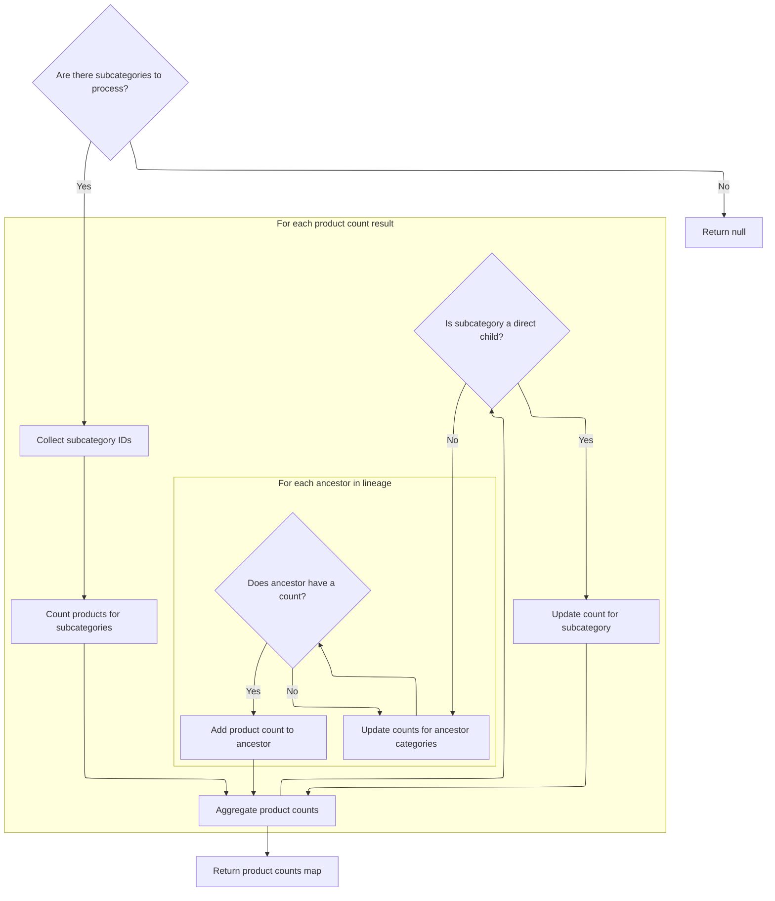

This document describes how category pages are displayed in the storefront. When a user requests a category page, the system resolves the category and its subcategories, sets up breadcrumb navigation and meta information, aggregates product counts, and retrieves manufacturer filters. The flow prepares all necessary data to render a comprehensive category page for the user.

# Where is this flow used?

This flow is used multiple times in the codebase as represented in the following diagram:

```mermaid
graph TD;
      fdcf8e9a7e99a4375cac219cc8b6ff6b3796479590f0fc73d52bbf5b34158b39(shopizer/…/category/ShoppingCategoryController.java::ShoppingCategoryController.displayCategoryWithReference) --> 0223987c253ba7451e3b4b73cf840b2c69aa2c0e36da948f42a4a23316a6b38d(shopizer/…/category/ShoppingCategoryController.java::ShoppingCategoryController.displayCategory)

ca86fa0ec99c1a63701aa9041f7532e45a65bd23b887b02bdbe1205cddee3d58(shopizer/…/category/ShoppingCategoryController.java::ShoppingCategoryController.displayCategoryNoReference) --> 0223987c253ba7451e3b4b73cf840b2c69aa2c0e36da948f42a4a23316a6b38d(shopizer/…/category/ShoppingCategoryController.java::ShoppingCategoryController.displayCategory)


classDef mainFlowStyle color:#000000,fill:#7CB9F4
classDef rootsStyle color:#000000,fill:#00FFF4
classDef Style1 color:#000000,fill:#00FFAA
classDef Style2 color:#000000,fill:#FFFF00
classDef Style3 color:#000000,fill:#AA7CB9

%% Swimm:
%% graph TD;
%%       fdcf8e9a7e99a4375cac219cc8b6ff6b3796479590f0fc73d52bbf5b34158b39(<SwmPath>[shopizer/…/category/ShoppingCategoryController.java](shopizer/sm-shop/src/main/java/com/salesmanager/web/shop/controller/category/ShoppingCategoryController.java)</SwmPath>::ShoppingCategoryController.displayCategoryWithReference) --> 0223987c253ba7451e3b4b73cf840b2c69aa2c0e36da948f42a4a23316a6b38d(<SwmPath>[shopizer/…/category/ShoppingCategoryController.java](shopizer/sm-shop/src/main/java/com/salesmanager/web/shop/controller/category/ShoppingCategoryController.java)</SwmPath>::ShoppingCategoryController.displayCategory)
%% 
%% ca86fa0ec99c1a63701aa9041f7532e45a65bd23b887b02bdbe1205cddee3d58(<SwmPath>[shopizer/…/category/ShoppingCategoryController.java](shopizer/sm-shop/src/main/java/com/salesmanager/web/shop/controller/category/ShoppingCategoryController.java)</SwmPath>::ShoppingCategoryController.displayCategoryNoReference) --> 0223987c253ba7451e3b4b73cf840b2c69aa2c0e36da948f42a4a23316a6b38d(<SwmPath>[shopizer/…/category/ShoppingCategoryController.java](shopizer/sm-shop/src/main/java/com/salesmanager/web/shop/controller/category/ShoppingCategoryController.java)</SwmPath>::ShoppingCategoryController.displayCategory)
%% 
%% 
%% classDef mainFlowStyle color:#000000,fill:#7CB9F4
%% classDef rootsStyle color:#000000,fill:#00FFF4
%% classDef Style1 color:#000000,fill:#00FFAA
%% classDef Style2 color:#000000,fill:#FFFF00
%% classDef Style3 color:#000000,fill:#AA7CB9
```



# Category Page Request Handling

This section governs how category pages are requested and displayed in the Shopizer storefront. It ensures that when a user navigates to a category page, the correct category and its subcategories are resolved, relevant meta and breadcrumb information is set, and product counts for subcategories are shown efficiently, leveraging caching where possible.

| Category       | Rule Name                               | Description                                                                                                                             |
| -------------- | --------------------------------------- | --------------------------------------------------------------------------------------------------------------------------------------- |
| Business logic | Breadcrumb Navigation                   | Breadcrumb navigation must be set for every category page, reflecting the user's current position within the category hierarchy.        |
| Business logic | Meta Information Setup                  | Meta information (title, description, keywords, and URL) must be set for each category page to support SEO and improve discoverability. |
| Business logic | Subcategory Listing with Product Counts | All subcategories of the current category must be retrieved and displayed, including their product counts.                              |

<SwmSnippet path="/shopizer/sm-shop/src/main/java/com/salesmanager/web/shop/controller/category/ShoppingCategoryController.java" line="136">

---

We start by resolving the category, setting up breadcrumbs and meta info, and building the lineage string to fetch all subcategories in one go.

```java
	private String displayCategory(final String friendlyUrl, final String ref, Model model, HttpServletRequest request, HttpServletResponse response, Locale locale) throws Exception {

		MerchantStore store = (MerchantStore)request.getAttribute(Constants.MERCHANT_STORE);
		
		
		
		
		//get category
		Category category = categoryService.getBySeUrl(store, friendlyUrl);
		
		Language language = (Language)request.getAttribute("LANGUAGE");
		
		if(category==null) {
			LOGGER.error("No category found for friendlyUrl " + friendlyUrl);
			//redirect on page not found
			return PageBuilderUtils.build404(store);
			
		}
		
		ReadableCategoryPopulator populator = new ReadableCategoryPopulator();
		ReadableCategory categoryProxy = populator.populate(category, new ReadableCategory(), store, language);

		Breadcrumb breadCrumb = breadcrumbsUtils.buildCategoryBreadcrumb(categoryProxy, store, language, request.getContextPath());
		request.getSession().setAttribute(Constants.BREADCRUMB, breadCrumb);
		request.setAttribute(Constants.BREADCRUMB, breadCrumb);
		
		
		//meta information
		PageInformation pageInformation = new PageInformation();
		pageInformation.setPageDescription(categoryProxy.getDescription().getMetaDescription());
		pageInformation.setPageKeywords(categoryProxy.getDescription().getKeyWords());
		pageInformation.setPageTitle(categoryProxy.getDescription().getTitle());
		pageInformation.setPageUrl(categoryProxy.getDescription().getFriendlyUrl());
		
		//** retrieves category id drill down**//
		String lineage = new StringBuilder().append(category.getLineage()).append(category.getId()).append(Constants.CATEGORY_LINEAGE_DELIMITER).toString();

		
		
		request.setAttribute(Constants.REQUEST_PAGE_INFORMATION, pageInformation);
		
		//TODO add to caching
		List<Category> subCategs = categoryService.listByLineage(store, lineage);
		List<Long> subIds = new ArrayList<Long>();
		if(subCategs!=null && subCategs.size()>0) {
			for(Category c : subCategs) {
				subIds.add(c.getId());
			}
```

---

</SwmSnippet>

<SwmSnippet path="/shopizer/sm-shop/src/main/java/com/salesmanager/web/shop/controller/category/ShoppingCategoryController.java" line="185">

---

Next we check if subcategories and their product counts are in the cache. If not, we call <SwmToken path="shopizer/sm-shop/src/main/java/com/salesmanager/web/shop/controller/category/ShoppingCategoryController.java" pos="216:5:5" line-data="					countProductsByCategories = getProductsByCategory(store, category, lineage, subCategs);">`getProductsByCategory`</SwmToken> to get product counts for all relevant subcategories, then fetch and cache the subcategory data. This avoids repeated DB hits and lets us show product counts alongside subcategories.

```java
		subIds.add(category.getId());


		StringBuilder subCategoriesCacheKey = new StringBuilder();
		subCategoriesCacheKey
		.append(store.getId())
		.append("_")
		.append(category.getId())
		.append("_")
		.append(Constants.SUBCATEGORIES_CACHE_KEY)
		.append("-")
		.append(language.getCode());
		
		StringBuilder subCategoriesMissed = new StringBuilder();
		subCategoriesMissed
		.append(subCategoriesCacheKey.toString())
		.append(Constants.MISSED_CACHE_KEY);
		
		List<BigDecimal> prices = new ArrayList<BigDecimal>();
		List<ReadableCategory> subCategories = null;
		Map<Long,Long> countProductsByCategories = null;

		if(store.isUseCache()) {

			//get from the cache
			subCategories = (List<ReadableCategory>) cache.getFromCache(subCategoriesCacheKey.toString());
			if(subCategories==null) {
				//get from missed cache
				//Boolean missedContent = (Boolean)cache.getFromCache(subCategoriesMissed.toString());

				//if(missedContent==null) {
					countProductsByCategories = getProductsByCategory(store, category, lineage, subCategs);
					subCategories = getSubCategories(store,category,countProductsByCategories,language,locale);
					
					if(subCategories!=null) {
						cache.putInCache(subCategories, subCategoriesCacheKey.toString());
					} else {
						//cache.putInCache(new Boolean(true), subCategoriesCacheKey.toString());
					}
				//}
			}
		} else {
			countProductsByCategories = getProductsByCategory(store, category, lineage, subCategs);
			subCategories = getSubCategories(store,category,countProductsByCategories,language,locale);
		}

```

---

</SwmSnippet>

## Aggregating Product Counts for Subcategories



This section is responsible for calculating and returning the total number of products for each subcategory and its ancestor categories, ensuring that parent categories reflect the sum of products in all their descendant categories.

| Category        | Rule Name                   | Description                                                                                                                                                                                                                      |
| --------------- | --------------------------- | -------------------------------------------------------------------------------------------------------------------------------------------------------------------------------------------------------------------------------- |
| Data validation | No Subcategories, No Counts | If the provided list of subcategories is empty or null, no product counts are calculated and the result is null.                                                                                                                 |
| Business logic  | Subcategory Product Count   | Each subcategory's product count must be calculated and included in the output map, keyed by the subcategory's ID.                                                                                                               |
| Business logic  | Ancestor Aggregation        | For each ancestor category in the lineage, the total product count must include the sum of all products in its descendant subcategories, so that parent categories reflect the total number of products in their entire subtree. |
| Business logic  | Cumulative Ancestor Count   | If an ancestor category already has a product count, the new count from a descendant must be added to the existing value, ensuring cumulative aggregation.                                                                       |

<SwmSnippet path="/shopizer/sm-shop/src/main/java/com/salesmanager/web/shop/controller/category/ShoppingCategoryController.java" line="327">

---

In <SwmToken path="shopizer/sm-shop/src/main/java/com/salesmanager/web/shop/controller/category/ShoppingCategoryController.java" pos="327:10:10" line-data="	private Map&lt;Long,Long&gt; getProductsByCategory(MerchantStore store, Category category, String lineage, List&lt;Category&gt; subCategories) throws Exception {">`getProductsByCategory`</SwmToken>, we bail early if there are no subcategories, otherwise we collect all their IDs to prepare for a bulk product count query.

```java
	private Map<Long,Long> getProductsByCategory(MerchantStore store, Category category, String lineage, List<Category> subCategories) throws Exception {

		if(CollectionUtils.isEmpty(subCategories)) {
			return null;
		}
		List<Long> ids = new ArrayList<Long>();
		if(subCategories!=null && subCategories.size()>0) {
			for(Category c : subCategories) {
				ids.add(c.getId());
			}
```

---

</SwmSnippet>

<SwmSnippet path="/shopizer/sm-shop/src/main/java/com/salesmanager/web/shop/controller/category/ShoppingCategoryController.java" line="339">

---

Here we aggregate product counts for each subcategory, but also sum up counts for all parent categories along the lineage path. This way, parent categories reflect the total number of products in their entire subtree, not just immediate children. The delimiter is used to split the lineage string and walk up the hierarchy.

```java
		List<Object[]> countProductsByCategories = categoryService.countProductsByCategories(store, ids);
		Map<Long, Long> countByCategories = new HashMap<Long,Long>();
		
		for(Object[] counts : countProductsByCategories) {
			Category c = (Category)counts[0];
			if(c.getParent().getId()==category.getId()) {
				countByCategories.put(c.getId(), (Long)counts[1]);
			} else {
				//get lineage
				String lin = c.getLineage();
				String[] categoryPath = lin.split(Constants.CATEGORY_LINEAGE_DELIMITER);
				for(int i=0 ; i<categoryPath.length; i++) {
					String sId = categoryPath[i];
					if(!StringUtils.isBlank(sId)) {
							Long count = countByCategories.get(Long.parseLong(sId));
							if(count!=null) {
								count = count + (Long)counts[1];
								countByCategories.put(Long.parseLong(sId), count);
							}
					}
				}
			}
		}
```

---

</SwmSnippet>

## Parent Category and Manufacturer Lookup

```mermaid
%%{init: {"flowchart": {"defaultRenderer": "elk"}} }%%
flowchart TD
    node1{"Is parent category reference present and valid?"}
    click node1 openCode "shopizer/sm-shop/src/main/java/com/salesmanager/web/shop/controller/category/ShoppingCategoryController.java:233:245"
    node1 -->|"Yes"| node2["Retrieve parent category"]
    click node2 openCode "shopizer/sm-shop/src/main/java/com/salesmanager/web/shop/controller/category/ShoppingCategoryController.java:236:241"
    node2 --> node3{"Is parent category found?"}
    click node3 openCode "shopizer/sm-shop/src/main/java/com/salesmanager/web/shop/controller/category/ShoppingCategoryController.java:241:242"
    node3 -->|"Yes"| node4["Set parent category link in model"]
    click node4 openCode "shopizer/sm-shop/src/main/java/com/salesmanager/web/shop/controller/category/ShoppingCategoryController.java:257:258"
    node3 -->|"No"| node5["Skip parent category link"]
    click node5 openCode "shopizer/sm-shop/src/main/java/com/salesmanager/web/shop/controller/category/ShoppingCategoryController.java:245:246"
    node4 --> node6["Retrieve manufacturers for category and subcategories"]
    node5 --> node6
    click node6 openCode "shopizer/sm-shop/src/main/java/com/salesmanager/web/shop/controller/category/ShoppingCategoryController.java:249:249"
    node6 --> node7["Set up page model attributes (manufacturers, parent, category, subcategories)"]
    click node7 openCode "shopizer/sm-shop/src/main/java/com/salesmanager/web/shop/controller/category/ShoppingCategoryController.java:251:254"
    node7 --> node8["Return category page template"]
    click node8 openCode "shopizer/sm-shop/src/main/java/com/salesmanager/web/shop/controller/category/ShoppingCategoryController.java:262:264"

classDef HeadingStyle fill:#777777,stroke:#333,stroke-width:2px;

%% Swimm:
%% %%{init: {"flowchart": {"defaultRenderer": "elk"}} }%%
%% flowchart TD
%%     node1{"Is parent category reference present and valid?"}
%%     click node1 openCode "<SwmPath>[shopizer/…/category/ShoppingCategoryController.java](shopizer/sm-shop/src/main/java/com/salesmanager/web/shop/controller/category/ShoppingCategoryController.java)</SwmPath>:233:245"
%%     node1 -->|"Yes"| node2["Retrieve parent category"]
%%     click node2 openCode "<SwmPath>[shopizer/…/category/ShoppingCategoryController.java](shopizer/sm-shop/src/main/java/com/salesmanager/web/shop/controller/category/ShoppingCategoryController.java)</SwmPath>:236:241"
%%     node2 --> node3{"Is parent category found?"}
%%     click node3 openCode "<SwmPath>[shopizer/…/category/ShoppingCategoryController.java](shopizer/sm-shop/src/main/java/com/salesmanager/web/shop/controller/category/ShoppingCategoryController.java)</SwmPath>:241:242"
%%     node3 -->|"Yes"| node4["Set parent category link in model"]
%%     click node4 openCode "<SwmPath>[shopizer/…/category/ShoppingCategoryController.java](shopizer/sm-shop/src/main/java/com/salesmanager/web/shop/controller/category/ShoppingCategoryController.java)</SwmPath>:257:258"
%%     node3 -->|"No"| node5["Skip parent category link"]
%%     click node5 openCode "<SwmPath>[shopizer/…/category/ShoppingCategoryController.java](shopizer/sm-shop/src/main/java/com/salesmanager/web/shop/controller/category/ShoppingCategoryController.java)</SwmPath>:245:246"
%%     node4 --> node6["Retrieve manufacturers for category and subcategories"]
%%     node5 --> node6
%%     click node6 openCode "<SwmPath>[shopizer/…/category/ShoppingCategoryController.java](shopizer/sm-shop/src/main/java/com/salesmanager/web/shop/controller/category/ShoppingCategoryController.java)</SwmPath>:249:249"
%%     node6 --> node7["Set up page model attributes (manufacturers, parent, category, subcategories)"]
%%     click node7 openCode "<SwmPath>[shopizer/…/category/ShoppingCategoryController.java](shopizer/sm-shop/src/main/java/com/salesmanager/web/shop/controller/category/ShoppingCategoryController.java)</SwmPath>:251:254"
%%     node7 --> node8["Return category page template"]
%%     click node8 openCode "<SwmPath>[shopizer/…/category/ShoppingCategoryController.java](shopizer/sm-shop/src/main/java/com/salesmanager/web/shop/controller/category/ShoppingCategoryController.java)</SwmPath>:262:264"
%% 
%% classDef HeadingStyle fill:#777777,stroke:#333,stroke-width:2px;
```



<SwmSnippet path="/shopizer/sm-shop/src/main/java/com/salesmanager/web/shop/controller/category/ShoppingCategoryController.java" line="231">

---

Back in <SwmToken path="shopizer/sm-shop/src/main/java/com/salesmanager/web/shop/controller/category/ShoppingCategoryController.java" pos="136:5:5" line-data="	private String displayCategory(final String friendlyUrl, final String ref, Model model, HttpServletRequest request, HttpServletResponse response, Locale locale) throws Exception {">`displayCategory`</SwmToken>, after getting product counts, we try to extract a parent category from the 'ref' string if present, using substring logic. Then we call <SwmToken path="shopizer/sm-shop/src/main/java/com/salesmanager/web/shop/controller/category/ShoppingCategoryController.java" pos="249:10:10" line-data="		List&lt;ReadableManufacturer&gt; manufacturerList = getManufacturersByProductAndCategory(store,category,subIds,language);">`getManufacturersByProductAndCategory`</SwmToken> to fetch manufacturers for the current category and its subcategories, so we can show manufacturer filters on the page.

```java
		//Parent category
		ReadableCategory parentProxy  = null;
		if(!StringUtils.isBlank(ref) && ref.contains("c")) {
			try {
				//get preceding id from the reference chain
				String categoryChain = ref.substring(ref.indexOf(Constants.REF_SPLITTER)+1);
				int categoryPosition = categoryChain.indexOf(String.valueOf(category.getId()));
				String sCategoryId = categoryChain.substring(categoryPosition++,categoryPosition++);
				Long parentId = Long.parseLong(sCategoryId);
				Category parent = categoryService.getById(parentId);
				parentProxy = populator.populate(parent, new ReadableCategory(), store, language);
			} catch(Exception e) {
				LOGGER.error("Cannot parse category id to Long ",ref );
			}
		}
		
		
		//** List of manufacturers **//
		List<ReadableManufacturer> manufacturerList = getManufacturersByProductAndCategory(store,category,subIds,language);

```

---

</SwmSnippet>

<SwmSnippet path="/shopizer/sm-shop/src/main/java/com/salesmanager/web/shop/controller/category/ShoppingCategoryController.java" line="268">

---

<SwmToken path="shopizer/sm-shop/src/main/java/com/salesmanager/web/shop/controller/category/ShoppingCategoryController.java" pos="268:8:8" line-data="	private List&lt;ReadableManufacturer&gt; getManufacturersByProductAndCategory(MerchantStore store, Category category, List&lt;Long&gt; subCategoryIds, Language language) throws Exception {">`getManufacturersByProductAndCategory`</SwmToken> checks if there are subcategory IDs, then tries to load manufacturers from cache using a composite key. If not found, it fetches from the DB and marks the missed cache if the result is empty, so we don't keep querying for the same empty set. The actual cache put for <SwmToken path="shopizer/sm-shop/src/main/java/com/salesmanager/web/shop/controller/category/ShoppingCategoryController.java" pos="270:6:6" line-data="		List&lt;ReadableManufacturer&gt; manufacturerList = null;">`manufacturerList`</SwmToken> is commented out, so only missed cache is updated.

```java
	private List<ReadableManufacturer> getManufacturersByProductAndCategory(MerchantStore store, Category category, List<Long> subCategoryIds, Language language) throws Exception {

		List<ReadableManufacturer> manufacturerList = null;
		/** List of manufacturers **/
		if(subCategoryIds!=null && subCategoryIds.size()>0) {
			
			StringBuilder manufacturersKey = new StringBuilder();
			manufacturersKey
			.append(store.getId())
			.append("_")
			.append(Constants.MANUFACTURERS_BY_PRODUCTS_CACHE_KEY)
			.append("-")
			.append(language.getCode());
			
			StringBuilder manufacturersKeyMissed = new StringBuilder();
			manufacturersKeyMissed
			.append(manufacturersKey.toString())
			.append(Constants.MISSED_CACHE_KEY);

			if(store.isUseCache()) {

				//get from the cache
				 
				manufacturerList = (List<ReadableManufacturer>) cache.getFromCache(manufacturersKey.toString());
				

				if(manufacturerList==null) {
					//get from missed cache
					//Boolean missedContent = (Boolean)cache.getFromCache(manufacturersKeyMissed.toString());
					//if(missedContent==null) {
						manufacturerList = this.getManufacturers(store, subCategoryIds, language);
						if(CollectionUtils.isEmpty(manufacturerList)) {
							cache.putInCache(new Boolean(true), manufacturersKeyMissed.toString());
						} else {
							//cache.putInCache(manufacturerList, manufacturersKey.toString());
						}
					//}
				}
			} else {
				manufacturerList  = this.getManufacturers(store, subCategoryIds, language);
			}
		}
		return manufacturerList;
	}
```

---

</SwmSnippet>

<SwmSnippet path="/shopizer/sm-shop/src/main/java/com/salesmanager/web/shop/controller/category/ShoppingCategoryController.java" line="251">

---

After getting manufacturers in <SwmToken path="shopizer/sm-shop/src/main/java/com/salesmanager/web/shop/controller/category/ShoppingCategoryController.java" pos="136:5:5" line-data="	private String displayCategory(final String friendlyUrl, final String ref, Model model, HttpServletRequest request, HttpServletResponse response, Locale locale) throws Exception {">`displayCategory`</SwmToken>, we add all the relevant objects (manufacturers, parent, category, subcategories) to the model for the view to render. If there's a parent category, we set its friendly URL as a request attribute. Finally, we build the template name and return it for rendering.

```java
		model.addAttribute("manufacturers", manufacturerList);
		model.addAttribute("parent", parentProxy);
		model.addAttribute("category", categoryProxy);
		model.addAttribute("subCategories", subCategories);
		
		if(parentProxy!=null) {
			request.setAttribute(Constants.LINK_CODE, parentProxy.getDescription().getFriendlyUrl());
		}
		
		
		/** template **/
		StringBuilder template = new StringBuilder().append(ControllerConstants.Tiles.Category.category).append(".").append(store.getStoreTemplate());

		return template.toString();
	}
```

---

</SwmSnippet>

&nbsp;

*This is an auto-generated document by Swimm 🌊 and has not yet been verified by a human*

<SwmMeta version="3.0.0" repo-id="Z2l0aHViJTNBJTNBU2hvcGl6ZXIlM0ElM0F1bWFsaW5nYXN3YW1p" repo-name="Shopizer"><sup>Powered by [Swimm](https://app.swimm.io/)</sup></SwmMeta>
