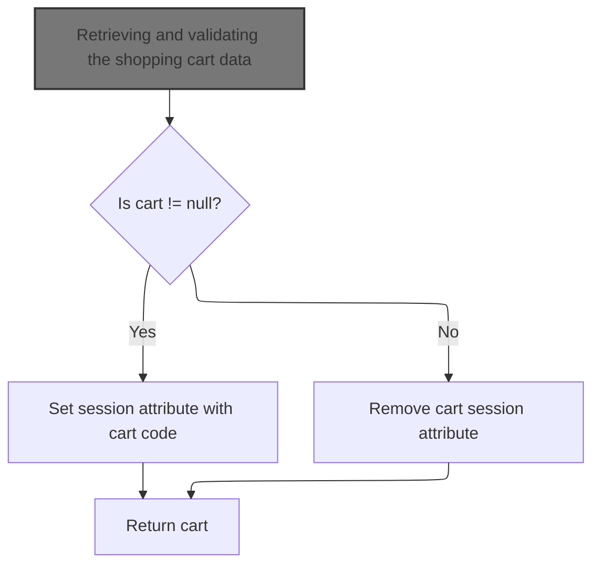
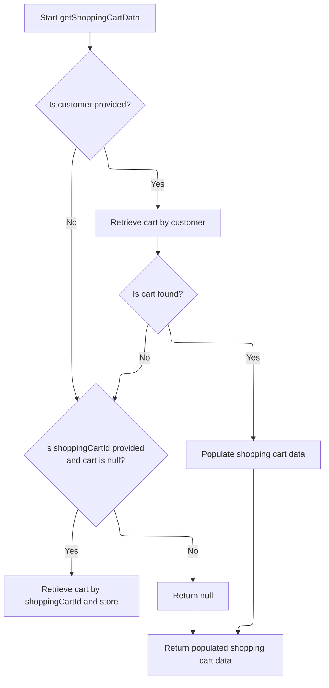

This document describes the flow of displaying the mini cart contents and pricing summary to the user. It covers retrieving and validating the shopping cart data, transforming the cart model into a detailed data object, calculating order totals, updating the session with the cart code, and returning the populated mini cart data for frontend display. This flow ensures the mini cart reflects the current state of the user's shopping cart.

```mermaid
flowchart TD
  node1["Starting the mini cart retrieval process"]:::HeadingStyle
  node2{"Is cart obsolete or null?" ]
  node3["Transforming shopping cart model into data object"]:::HeadingStyle
  node4["Calculating order totals for the cart"]:::HeadingStyle
  node5["Populating cart totals and final details"]:::HeadingStyle
  node6["Updating session and returning the mini cart data"]:::HeadingStyle

  node1 --> node2
  node2 -->|"Yes"| node6
  node2 -->|"No"| node3
  node3 --> node4
  node4 --> node5
  node5 --> node6

  click node1 goToHeading "Starting the mini cart retrieval process"
  click node2 goToHeading "Retrieving and validating the shopping cart data"
  click node3 goToHeading "Transforming shopping cart model into data object"
  click node4 goToHeading "Calculating order totals for the cart"
  click node5 goToHeading "Populating cart totals and final details"
  click node6 goToHeading "Updating session and returning the mini cart data"
classDef HeadingStyle fill:#777777,stroke:#333,stroke-width:2px;
```

# Starting the mini cart retrieval process



This section handles the retrieval and validation of the shopping cart data for the mini cart display in the e-commerce platform.

| Category       | Rule Name             | Description                                                                                                                                             |
| -------------- | --------------------- | ------------------------------------------------------------------------------------------------------------------------------------------------------- |
| Business logic | Cart existence check  | If the shopping cart exists (is not null), the system must set the session attribute with the cart code and return the cart data.                       |
| Business logic | Cart absence handling | If the shopping cart does not exist (is null), the system must remove the cart session attribute to prevent stale or invalid cart data from being used. |

<SwmSnippet path="/shopizer/sm-shop/src/main/java/com/salesmanager/web/shop/controller/shoppingCart/MiniCartController.java" line="43">

---

In <SwmToken path="shopizer/sm-shop/src/main/java/com/salesmanager/web/shop/controller/shoppingCart/MiniCartController.java" pos="43:8:8" line-data="	public @ResponseBody ShoppingCartData displayMiniCart(final String shoppingCartCode, HttpServletRequest request, Model model){">`displayMiniCart`</SwmToken> we start by extracting the merchant store and customer from the request. Then we call the facade to get the shopping cart data. The facade wraps the business logic and service calls, so calling it here keeps the controller clean and focused on HTTP handling.

```java
	public @ResponseBody ShoppingCartData displayMiniCart(final String shoppingCartCode, HttpServletRequest request, Model model){
		
		try {
			MerchantStore merchantStore = (MerchantStore)request.getAttribute(Constants.MERCHANT_STORE);
		    Customer customer = getSessionAttribute(  Constants.CUSTOMER, request );
			ShoppingCartData cart =  shoppingCartFacade.getShoppingCartData(customer,merchantStore,shoppingCartCode);
```

---

</SwmSnippet>

## Retrieving and validating the shopping cart data



This section handles retrieving and validating the shopping cart data for a customer or by cart ID, ensuring the cart is current and properly populated for frontend use.

| Category       | Rule Name                        | Description                                                                                                                                                                                                                                                                                                                                                                                                                      |
| -------------- | -------------------------------- | -------------------------------------------------------------------------------------------------------------------------------------------------------------------------------------------------------------------------------------------------------------------------------------------------------------------------------------------------------------------------------------------------------------------------------- |
| Business logic | Customer cart retrieval priority | If a customer is provided, the system must first attempt to retrieve the shopping cart associated with that customer before any other retrieval method.                                                                                                                                                                                                                                                                          |
| Business logic | Fallback cart retrieval by ID    | If no customer is provided or no cart is found for the customer, and a <SwmToken path="shopizer/sm-shop/src/main/java/com/salesmanager/web/shop/controller/shoppingCart/facade/ShoppingCartFacadeImpl.java" pos="261:5:5" line-data="                                                 final String shoppingCartId )">`shoppingCartId`</SwmToken> is provided, the system must attempt to retrieve the cart by this ID and store. |
| Business logic | Obsolete cart invalidation       | If a retrieved shopping cart is marked as obsolete, it must be deleted and not returned for further use.                                                                                                                                                                                                                                                                                                                         |
| Business logic | Cart data population             | Before returning, the shopping cart model must be converted into a data object enriched with pricing and language information for frontend use.                                                                                                                                                                                                                                                                                  |

<SwmSnippet path="/shopizer/sm-shop/src/main/java/com/salesmanager/web/shop/controller/shoppingCart/facade/ShoppingCartFacadeImpl.java" line="260">

---

The facade tries to get the cart for the customer first, then falls back to fetching by cart code if needed.

```java
    public ShoppingCartData getShoppingCartData( final Customer customer, final MerchantStore store,
                                                 final String shoppingCartId )
        throws Exception
    {

        ShoppingCart cart = null;
        try
        {
            if ( customer != null )
            {
                LOG.info( "Reteriving customer shopping cart..." );

                cart = shoppingCartService.getShoppingCart( customer );

            }

            else
            {
```

---

</SwmSnippet>

<SwmSnippet path="/shopizer/sm-core/src/main/java/com/salesmanager/core/business/shoppingcart/service/ShoppingCartServiceImpl.java" line="68">

---

In <SwmToken path="shopizer/sm-core/src/main/java/com/salesmanager/core/business/shoppingcart/service/ShoppingCartServiceImpl.java" pos="68:5:5" line-data="	public ShoppingCart getShoppingCart(final Customer customer) throws ServiceException {">`getShoppingCart`</SwmToken> the service fetches the cart for the customer, populates it, then checks if it's obsolete. If obsolete, it deletes the cart and returns null. This prevents obsolete carts from being used later.

```java
	public ShoppingCart getShoppingCart(final Customer customer) throws ServiceException {

		try {

			ShoppingCart shoppingCart = shoppingCartDao.getByCustomer(customer);
			populateShoppingCart(shoppingCart);
			if(shoppingCart!=null && shoppingCart.isObsolete()) {
				delete(shoppingCart);
				return null;
			} else {
				return shoppingCart;
			}


		} catch (Exception e) {
			throw new ServiceException(e);
		}

	}
```

---

</SwmSnippet>

<SwmSnippet path="/shopizer/sm-shop/src/main/java/com/salesmanager/web/shop/controller/shoppingCart/facade/ShoppingCartFacadeImpl.java" line="278">

---

After getting the cart model from the service, the facade checks if it's null. If not, it creates a populator to convert the cart model into a data object with pricing and language info. This prepares the data for the frontend.

```java
                if ( StringUtils.isNotBlank( shoppingCartId ) && cart == null )
                {
                    cart = shoppingCartService.getByCode( shoppingCartId, store );
                }

            }
        }
        catch ( ServiceException ex )
        {
            LOG.error( "Error while retriving cart from customer", ex );
        }
        catch( NoResultException nre) {
        	//nothing
        }

        if ( cart == null )
        {
            return null;
        }

        LOG.info( "Cart model found." );

        ShoppingCartDataPopulator shoppingCartDataPopulator = new ShoppingCartDataPopulator();
        shoppingCartDataPopulator.setShoppingCartCalculationService( shoppingCartCalculationService );
        shoppingCartDataPopulator.setPricingService( pricingService );

        Language language = (Language) getKeyValue( Constants.LANGUAGE );
        MerchantStore merchantStore = (MerchantStore) getKeyValue( Constants.MERCHANT_STORE );
        return shoppingCartDataPopulator.populate( cart, merchantStore, language );

    }
```

---

</SwmSnippet>

## Transforming shopping cart model into data object

This section transforms the shopping cart model into a data object that represents the cart's contents and pricing details for display and further processing.

| Category       | Rule Name                 | Description                                                                                                                                                                                                                                                                                                                                                                                                                                             |
| -------------- | ------------------------- | ------------------------------------------------------------------------------------------------------------------------------------------------------------------------------------------------------------------------------------------------------------------------------------------------------------------------------------------------------------------------------------------------------------------------------------------------------- |
| Business logic | Cart item inclusion       | Every product in the shopping cart must be represented as an item in the <SwmToken path="shopizer/sm-shop/src/main/java/com/salesmanager/web/shop/controller/shoppingCart/MiniCartController.java" pos="43:6:6" line-data="	public @ResponseBody ShoppingCartData displayMiniCart(final String shoppingCartCode, HttpServletRequest request, Model model){">`ShoppingCartData`</SwmToken> output, including its product code, name, quantity, and price. |
| Business logic | Quantity aggregation      | The total quantity in the cart must be the sum of quantities of all individual cart items.                                                                                                                                                                                                                                                                                                                                                              |
| Business logic | Price display consistency | Prices displayed for each cart item and subtotal must be formatted according to the merchant store's pricing rules and locale.                                                                                                                                                                                                                                                                                                                          |
| Business logic | Product image inclusion   | If a product has an associated image, the image path must be included in the cart item data for display purposes.                                                                                                                                                                                                                                                                                                                                       |
| Business logic | Attribute mapping         | All attributes associated with a cart item must be included in the cart item data, with option names and values clearly identified.                                                                                                                                                                                                                                                                                                                     |
| Business logic | Order summary calculation | The cart data must include an order summary with calculated totals and pricing information based on the current cart contents and store context.                                                                                                                                                                                                                                                                                                        |

<SwmSnippet path="/shopizer/sm-shop/src/main/java/com/salesmanager/web/populator/shoppingCart/ShoppingCartDataPopulator.java" line="73">

---

In <SwmToken path="shopizer/sm-shop/src/main/java/com/salesmanager/web/populator/shoppingCart/ShoppingCartDataPopulator.java" pos="73:5:5" line-data="    public ShoppingCartData populate(final ShoppingCart shoppingCart,">`populate`</SwmToken> we start converting the shopping cart model into a data object. We map each cart item, including product codes, prices, quantities, and images. We also gather attributes for each item and calculate total quantity.

```java
    public ShoppingCartData populate(final ShoppingCart shoppingCart,
                                     final ShoppingCartData cart, final MerchantStore store, final Language language) {

    	int cartQuantity = 0;
        cart.setCode(shoppingCart.getShoppingCartCode());
        Set<com.salesmanager.core.business.shoppingcart.model.ShoppingCartItem> items = shoppingCart.getLineItems();
        List<ShoppingCartItem> shoppingCartItemsList=Collections.emptyList();
        try{
            if(items!=null) {
                shoppingCartItemsList=new ArrayList<ShoppingCartItem>();
                for(com.salesmanager.core.business.shoppingcart.model.ShoppingCartItem item : items) {

                    ShoppingCartItem shoppingCartItem = new ShoppingCartItem();
                    shoppingCartItem.setCode(cart.getCode());
                    shoppingCartItem.setProductCode(item.getProduct().getSku());
                    shoppingCartItem.setProductVirtual(item.isProductVirtual());

                    shoppingCartItem.setProductId(item.getProductId());
                    shoppingCartItem.setId(item.getId());
                    shoppingCartItem.setName(item.getProduct().getProductDescription().getName());

                    shoppingCartItem.setPrice(pricingService.getDisplayAmount(item.getItemPrice(),store));
                    shoppingCartItem.setQuantity(item.getQuantity());
                    
                    
                    cartQuantity = cartQuantity + item.getQuantity();
                    
                    shoppingCartItem.setProductPrice(item.getItemPrice());
                    shoppingCartItem.setSubTotal(pricingService.getDisplayAmount(item.getSubTotal(), store));
                    ProductImage image = item.getProduct().getProductImage();
                    if(image!=null) {
                        String imagePath = ImageFilePathUtils.buildProductImageFilePath(store, item.getProduct().getSku(), image.getProductImage());
                        shoppingCartItem.setImage(imagePath);
                    }
                    Set<com.salesmanager.core.business.shoppingcart.model.ShoppingCartAttributeItem> attributes = item.getAttributes();
                    if(attributes!=null) {
                        List<ShoppingCartAttribute> cartAttributes = new ArrayList<ShoppingCartAttribute>();
                        for(com.salesmanager.core.business.shoppingcart.model.ShoppingCartAttributeItem attribute : attributes) {
                            ShoppingCartAttribute cartAttribute = new ShoppingCartAttribute();
                            cartAttribute.setId(attribute.getId());
                            cartAttribute.setAttributeId(attribute.getProductAttributeId());
                            cartAttribute.setOptionId(attribute.getProductAttribute().getProductOption().getId());
                            cartAttribute.setOptionValueId(attribute.getProductAttribute().getProductOptionValue().getId());
                            List<ProductOptionDescription> optionDescriptions = attribute.getProductAttribute().getProductOption().getDescriptionsSettoList();
                            List<ProductOptionValueDescription> optionValueDescriptions = attribute.getProductAttribute().getProductOptionValue().getDescriptionsSettoList();
                            if(!CollectionUtils.isEmpty(optionDescriptions) && !CollectionUtils.isEmpty(optionValueDescriptions)) {
                            	cartAttribute.setOptionName(optionDescriptions.get(0).getName());
                            	cartAttribute.setOptionValue(optionValueDescriptions.get(0).getName());
                            	cartAttributes.add(cartAttribute);
                            }
                        }
                        shoppingCartItem.setShoppingCartAttributes(cartAttributes);
                    }
                    shoppingCartItemsList.add(shoppingCartItem);
                }
```

---

</SwmSnippet>

<SwmSnippet path="/shopizer/sm-shop/src/main/java/com/salesmanager/web/populator/shoppingCart/ShoppingCartDataPopulator.java" line="129">

---

After building the cart items list, we prepare an order summary and call the calculation service to get totals and pricing info. This enriches the cart data with calculated values.

```java
            if(CollectionUtils.isNotEmpty(shoppingCartItemsList)){
                cart.setShoppingCartItems(shoppingCartItemsList);
            }

            OrderSummary summary = new OrderSummary();
            List<com.salesmanager.core.business.shoppingcart.model.ShoppingCartItem> productsList = new ArrayList<com.salesmanager.core.business.shoppingcart.model.ShoppingCartItem>();
            productsList.addAll(shoppingCart.getLineItems());
            summary.setProducts(productsList);
            OrderTotalSummary orderSummary = shoppingCartCalculationService.calculate(shoppingCart,store, language );

```

---

</SwmSnippet>

### Calculating order totals for the cart

This section describes the process of calculating order totals for the shopping cart in Shopizer, including input validation, delegation to the order service for calculation, error handling, and updating the cart model with the calculated totals.

<SwmSnippet path="/shopizer/sm-core/src/main/java/com/salesmanager/core/business/shoppingcart/service/ShoppingCartCalculationServiceImpl.java" line="95">

---

In <SwmToken path="shopizer/sm-core/src/main/java/com/salesmanager/core/business/shoppingcart/service/ShoppingCartCalculationServiceImpl.java" pos="95:5:5" line-data="    public OrderTotalSummary calculate( final ShoppingCart cartModel , final MerchantStore store, final Language language ) throws ServiceException">`calculate`</SwmToken> we validate inputs then delegate to the order service to compute the cart totals. The order service handles the detailed calculation logic.

```java
    public OrderTotalSummary calculate( final ShoppingCart cartModel , final MerchantStore store, final Language language ) throws ServiceException
    {

        Validate.notNull(cartModel,"cart cannot be null");
        Validate.notNull(cartModel.getLineItems(),"Cart should have line items.");
        Validate.notNull(store,"MerchantStore cannot be null");
        OrderTotalSummary orderTotalSummary=orderService.calculateShoppingCartTotal( cartModel, store, language );
```

---

</SwmSnippet>

<SwmSnippet path="/shopizer/sm-core/src/main/java/com/salesmanager/core/business/order/service/OrderServiceImpl.java" line="423">

---

In <SwmToken path="shopizer/sm-core/src/main/java/com/salesmanager/core/business/order/service/OrderServiceImpl.java" pos="423:5:5" line-data="    public OrderTotalSummary calculateShoppingCartTotal(">`calculateShoppingCartTotal`</SwmToken> the order service calls a more general calculation method with a null argument to get the totals. It also handles exceptions and logs errors.

```java
    public OrderTotalSummary calculateShoppingCartTotal(
                                                        final ShoppingCart shoppingCart, final MerchantStore store, final Language language)
                                                                        throws ServiceException {
        Validate.notNull(shoppingCart,"Order summary cannot be null");
        Validate.notNull(store,"MerchantStore cannot be null");

        try {
            return caculateShoppingCart(shoppingCart, null, store, language);
        } catch (Exception e) {
            LOGGER.error( "Error while calculating shopping cart total" +e );
            throw new ServiceException(e);
        }
    }
```

---

</SwmSnippet>

<SwmSnippet path="/shopizer/sm-core/src/main/java/com/salesmanager/core/business/shoppingcart/service/ShoppingCartCalculationServiceImpl.java" line="102">

---

After getting the totals from the order service, <SwmToken path="shopizer/sm-shop/src/main/java/com/salesmanager/web/populator/shoppingCart/ShoppingCartDataPopulator.java" pos="137:9:9" line-data="            OrderTotalSummary orderSummary = shoppingCartCalculationService.calculate(shoppingCart,store, language );">`calculate`</SwmToken> updates the cart model with new data and returns the summary.

```java
        updateCartModel(cartModel);
        return orderTotalSummary;


    }
```

---

</SwmSnippet>

### Populating cart totals and final details

```mermaid
%%{init: {"flowchart": {"defaultRenderer": "elk"}} }%%
flowchart TD
    node1{"Are there order totals?"}
    node1 -->|"Yes"| subgraph loop1["For each order total in orderSummary.totals"]
        node2["Transform and add order total to cart totals"]
    end
    node2 --> node6["Next order total or exit loop"]
    node6 --> node2
    node6 -->|"No more totals"| node4["Set subtotal, total, quantity, and cart ID on cart"]
    node1 -->|"No"| node4
    node4 --> node5["Return populated cart"]
classDef HeadingStyle fill:#777777,stroke:#333,stroke-width:2px;
```

<SwmSnippet path="/shopizer/sm-shop/src/main/java/com/salesmanager/web/populator/shoppingCart/ShoppingCartDataPopulator.java" line="139">

---

The populator updates the cart data with calculated totals and pricing after calculation.

```java
            if(CollectionUtils.isNotEmpty(orderSummary.getTotals())) {
            	List<OrderTotal> totals = new ArrayList<OrderTotal>();
            	for(com.salesmanager.core.business.order.model.OrderTotal t : orderSummary.getTotals()) {
            		OrderTotal total = new OrderTotal();
            		total.setCode(t.getOrderTotalCode());
            		total.setValue(t.getValue());
            		totals.add(total);
            	}
```

---

</SwmSnippet>

<SwmSnippet path="/shopizer/sm-shop/src/main/java/com/salesmanager/web/populator/shoppingCart/ShoppingCartDataPopulator.java" line="147">

---

The function returns the populated cart data object with all items, totals, and pricing info ready for the frontend.

```java
            	cart.setTotals(totals);
            }
            
            cart.setSubTotal(pricingService.getDisplayAmount(orderSummary.getSubTotal(), store));
            cart.setTotal(pricingService.getDisplayAmount(orderSummary.getTotal(), store));
            cart.setQuantity(cartQuantity);
            cart.setId(shoppingCart.getId());
        }
        catch(ServiceException ex){
            LOG.error( "Error while converting cart Model to cart Data.."+ex );
            throw new ConversionException( "Unable to create cart data", ex );
        }
        return cart;


    };
```

---

</SwmSnippet>

## Updating session and returning the mini cart data

<SwmSnippet path="/shopizer/sm-shop/src/main/java/com/salesmanager/web/shop/controller/shoppingCart/MiniCartController.java" line="49">

---

After getting the cart data from the facade, we update the session attribute with the cart code if the cart exists. If not, we remove the attribute to avoid stale data. Then we return the cart data.

```java
			if(cart!=null) {
				request.getSession().setAttribute(Constants.SHOPPING_CART, cart.getCode());
			}
			if(cart==null) {
				request.getSession().removeAttribute(Constants.SHOPPING_CART);//make sure there is no cart here
			}
			return cart;
			
			
		} catch(Exception e) {
			LOG.error("Error while getting the shopping cart",e);
		}
		
		return null;

	}
```

---

</SwmSnippet>

&nbsp;

*This is an auto-generated document by Swimm 🌊 and has not yet been verified by a human*

<SwmMeta version="3.0.0" repo-id="Z2l0aHViJTNBJTNBU2hvcGl6ZXIlM0ElM0F1bWFsaW5nYXN3YW1p" repo-name="Shopizer"><sup>Powered by [Swimm](https://app.swimm.io/)</sup></SwmMeta>
