This document describes how product detail pages are displayed when a request includes both a product reference and a friendly URL. The process centralizes business logic to consistently prepare product information, attributes, related products, and reviews, and renders the page using the store's template.

# Delegating Product Display by Reference

This section ensures that product display requests using a reference and friendly URL are routed to a centralized display logic, maintaining clean routing and avoiding duplication of business logic.

| Category        | Rule Name                    | Description                                                                                                                                                 |
| --------------- | ---------------------------- | ----------------------------------------------------------------------------------------------------------------------------------------------------------- |
| Data validation | Required product identifiers | Product display requests must include both a product reference and a friendly URL to be processed.                                                          |
| Business logic  | Centralized display logic    | The product display logic must be centralized to avoid duplication and ensure consistency across different routing methods.                                 |
| Technical step  | Clean routing separation     | The routing for product display by reference must remain clean and not contain business logic, delegating all such logic to the centralized display method. |

<SwmSnippet path="/shopizer/sm-shop/src/main/java/com/salesmanager/web/shop/controller/product/ShopProductController.java" line="115">

---

This wrapper just hands off to <SwmToken path="shopizer/sm-shop/src/main/java/com/salesmanager/web/shop/controller/product/ShopProductController.java" pos="116:3:3" line-data="		return display(ref, friendlyUrl, model, request, response, locale);">`display`</SwmToken> with reordered parameters, keeping routing clean and logic centralized.

```java
	public String displayProductWithReference(@PathVariable final String friendlyUrl, @PathVariable final String ref, Model model, HttpServletRequest request, HttpServletResponse response, Locale locale) throws Exception {
		return display(ref, friendlyUrl, model, request, response, locale);
	}
```

---

</SwmSnippet>

# Preparing Product Data and Related Items

```mermaid
%%{init: {"flowchart": {"defaultRenderer": "elk"}} }%%
flowchart TD
    node1["Lookup product by URL"]
    click node1 openCode "shopizer/sm-shop/src/main/java/com/salesmanager/web/shop/controller/product/ShopProductController.java:142:143"
    node1 --> node2{"Is product found?"}
    click node2 openCode "shopizer/sm-shop/src/main/java/com/salesmanager/web/shop/controller/product/ShopProductController.java:144:146"
    node2 -->|"Not found"| node3["Return 404 page"]
    click node3 openCode "shopizer/sm-shop/src/main/java/com/salesmanager/web/shop/controller/product/ShopProductController.java:145:146"
    node2 -->|"Found"| node4["Prepare product details and meta info"]
    click node4 openCode "shopizer/sm-shop/src/main/java/com/salesmanager/web/shop/controller/product/ShopProductController.java:148:158"
    node4 --> node5["Build breadcrumbs"]
    click node5 openCode "shopizer/sm-shop/src/main/java/com/salesmanager/web/shop/controller/product/ShopProductController.java:162:164"
    node5 --> node6{"Store uses cache?"}
    click node6 openCode "shopizer/sm-shop/src/main/java/com/salesmanager/web/shop/controller/product/ShopProductController.java:184:205"
    node6 -->|"Yes"| node7["Load related products from cache"]
    click node7 openCode "shopizer/sm-shop/src/main/java/com/salesmanager/web/shop/controller/product/ShopProductController.java:187:204"
    node6 -->|"No"| node8["Generate related products"]
    click node8 openCode "shopizer/sm-shop/src/main/java/com/salesmanager/web/shop/controller/product/ShopProductController.java:206:207"
    node7 --> node9
    node8 --> node9
    subgraph loop1["For each product attribute"]
        node9 --> node10{"Is attribute read-only?"}
        click node10 openCode "shopizer/sm-shop/src/main/java/com/salesmanager/web/shop/controller/product/ShopProductController.java:222:234"
        node10 -->|"Read-only"| node11["Add to read-only attributes and prepare display"]
        click node11 openCode "shopizer/sm-shop/src/main/java/com/salesmanager/web/shop/controller/product/ShopProductController.java:223:233"
        node10 -->|"Selectable"| node12["Add to selectable options and prepare display"]
        click node12 openCode "shopizer/sm-shop/src/main/java/com/salesmanager/web/shop/controller/product/ShopProductController.java:235:245"
    end
    node9 --> node13{"Are there reviews?"}
    click node13 openCode "shopizer/sm-shop/src/main/java/com/salesmanager/web/shop/controller/product/ShopProductController.java:286:295"
    node13 -->|"No reviews"| node14["Return product page"]
    click node14 openCode "shopizer/sm-shop/src/main/java/com/salesmanager/web/shop/controller/product/ShopProductController.java:314:316"
    subgraph loop2["For each review"]
        node13 -->|"Has reviews"| node15["Convert review for display"]
        click node15 openCode "shopizer/sm-shop/src/main/java/com/salesmanager/web/shop/controller/product/ShopProductController.java:289:292"
    end
    node15 --> node14
classDef HeadingStyle fill:#777777,stroke:#333,stroke-width:2px;

%% Swimm:
%% %%{init: {"flowchart": {"defaultRenderer": "elk"}} }%%
%% flowchart TD
%%     node1["Lookup product by URL"]
%%     click node1 openCode "<SwmPath>[shopizer/…/product/ShopProductController.java](shopizer/sm-shop/src/main/java/com/salesmanager/web/shop/controller/product/ShopProductController.java)</SwmPath>:142:143"
%%     node1 --> node2{"Is product found?"}
%%     click node2 openCode "<SwmPath>[shopizer/…/product/ShopProductController.java](shopizer/sm-shop/src/main/java/com/salesmanager/web/shop/controller/product/ShopProductController.java)</SwmPath>:144:146"
%%     node2 -->|"Not found"| node3["Return 404 page"]
%%     click node3 openCode "<SwmPath>[shopizer/…/product/ShopProductController.java](shopizer/sm-shop/src/main/java/com/salesmanager/web/shop/controller/product/ShopProductController.java)</SwmPath>:145:146"
%%     node2 -->|"Found"| node4["Prepare product details and meta info"]
%%     click node4 openCode "<SwmPath>[shopizer/…/product/ShopProductController.java](shopizer/sm-shop/src/main/java/com/salesmanager/web/shop/controller/product/ShopProductController.java)</SwmPath>:148:158"
%%     node4 --> node5["Build breadcrumbs"]
%%     click node5 openCode "<SwmPath>[shopizer/…/product/ShopProductController.java](shopizer/sm-shop/src/main/java/com/salesmanager/web/shop/controller/product/ShopProductController.java)</SwmPath>:162:164"
%%     node5 --> node6{"Store uses cache?"}
%%     click node6 openCode "<SwmPath>[shopizer/…/product/ShopProductController.java](shopizer/sm-shop/src/main/java/com/salesmanager/web/shop/controller/product/ShopProductController.java)</SwmPath>:184:205"
%%     node6 -->|"Yes"| node7["Load related products from cache"]
%%     click node7 openCode "<SwmPath>[shopizer/…/product/ShopProductController.java](shopizer/sm-shop/src/main/java/com/salesmanager/web/shop/controller/product/ShopProductController.java)</SwmPath>:187:204"
%%     node6 -->|"No"| node8["Generate related products"]
%%     click node8 openCode "<SwmPath>[shopizer/…/product/ShopProductController.java](shopizer/sm-shop/src/main/java/com/salesmanager/web/shop/controller/product/ShopProductController.java)</SwmPath>:206:207"
%%     node7 --> node9
%%     node8 --> node9
%%     subgraph loop1["For each product attribute"]
%%         node9 --> node10{"Is attribute read-only?"}
%%         click node10 openCode "<SwmPath>[shopizer/…/product/ShopProductController.java](shopizer/sm-shop/src/main/java/com/salesmanager/web/shop/controller/product/ShopProductController.java)</SwmPath>:222:234"
%%         node10 -->|"Read-only"| node11["Add to read-only attributes and prepare display"]
%%         click node11 openCode "<SwmPath>[shopizer/…/product/ShopProductController.java](shopizer/sm-shop/src/main/java/com/salesmanager/web/shop/controller/product/ShopProductController.java)</SwmPath>:223:233"
%%         node10 -->|"Selectable"| node12["Add to selectable options and prepare display"]
%%         click node12 openCode "<SwmPath>[shopizer/…/product/ShopProductController.java](shopizer/sm-shop/src/main/java/com/salesmanager/web/shop/controller/product/ShopProductController.java)</SwmPath>:235:245"
%%     end
%%     node9 --> node13{"Are there reviews?"}
%%     click node13 openCode "<SwmPath>[shopizer/…/product/ShopProductController.java](shopizer/sm-shop/src/main/java/com/salesmanager/web/shop/controller/product/ShopProductController.java)</SwmPath>:286:295"
%%     node13 -->|"No reviews"| node14["Return product page"]
%%     click node14 openCode "<SwmPath>[shopizer/…/product/ShopProductController.java](shopizer/sm-shop/src/main/java/com/salesmanager/web/shop/controller/product/ShopProductController.java)</SwmPath>:314:316"
%%     subgraph loop2["For each review"]
%%         node13 -->|"Has reviews"| node15["Convert review for display"]
%%         click node15 openCode "<SwmPath>[shopizer/…/product/ShopProductController.java](shopizer/sm-shop/src/main/java/com/salesmanager/web/shop/controller/product/ShopProductController.java)</SwmPath>:289:292"
%%     end
%%     node15 --> node14
%% classDef HeadingStyle fill:#777777,stroke:#333,stroke-width:2px;
```



This section governs the preparation of product data and related items for display on the product detail page. It ensures that all relevant product information, relationships, attributes, and reviews are gathered and formatted for the user interface.

| Category       | Rule Name                         | Description                                                                                                                                                                                                    |
| -------------- | --------------------------------- | -------------------------------------------------------------------------------------------------------------------------------------------------------------------------------------------------------------- |
| Business logic | Product meta info setup           | Product meta information (title, description, keywords, URL) must be set for SEO and page display purposes using the product's localized description.                                                          |
| Business logic | Breadcrumb navigation             | Breadcrumb navigation must be built for each product page to help users understand their location within the store and improve navigation.                                                                     |
| Business logic | Related products display          | Related products must be displayed on the product page, using cached data if available, or generated from product relationships if not.                                                                        |
| Business logic | Attribute splitting and display   | Product attributes must be split into read-only attributes for static display and selectable options for user interaction, with each attribute's price, image, and localized description prepared for display. |
| Business logic | Localized review display          | Product reviews must be fetched in the user's language, converted for display, and shown on the product page if available.                                                                                     |
| Business logic | Model population for product page | All prepared product data, attributes, options, related products, and reviews must be added to the model for rendering the product detail page.                                                                |
| Business logic | Store-specific template selection | The product detail page must be rendered using the template specified by the store's configuration.                                                                                                            |

<SwmSnippet path="/shopizer/sm-shop/src/main/java/com/salesmanager/web/shop/controller/product/ShopProductController.java" line="136">

---

In <SwmToken path="shopizer/sm-shop/src/main/java/com/salesmanager/web/shop/controller/product/ShopProductController.java" pos="136:5:5" line-data="	public String display(final String reference, final String friendlyUrl, Model model, HttpServletRequest request, HttpServletResponse response, Locale locale) throws Exception {">`display`</SwmToken>, we grab the store and language, fetch the product by its SEO URL, and bail out with a 404 if it's missing. Next, we use a populator to prep a <SwmToken path="shopizer/sm-shop/src/main/java/com/salesmanager/web/shop/controller/product/ShopProductController.java" pos="151:1:1" line-data="		ReadableProduct productProxy = populator.populate(product, new ReadableProduct(), store, language);">`ReadableProduct`</SwmToken> for the view, set up meta info for SEO, and build breadcrumbs for navigation. Then, we build a cache key for related items and check the cache. If the cache misses, we call <SwmToken path="shopizer/sm-shop/src/main/java/com/salesmanager/web/shop/controller/product/ShopProductController.java" pos="182:6:6" line-data="		List&lt;ReadableProduct&gt; relatedItems = null;">`relatedItems`</SwmToken> to fetch and cache related products, keeping things fast for repeat requests.

```java
	public String display(final String reference, final String friendlyUrl, Model model, HttpServletRequest request, HttpServletResponse response, Locale locale) throws Exception {
		

		MerchantStore store = (MerchantStore)request.getAttribute(Constants.MERCHANT_STORE);
		Language language = (Language)request.getAttribute("LANGUAGE");
		
		Product product = productService.getBySeUrl(store, friendlyUrl, locale);
				
		if(product==null) {
			return PageBuilderUtils.build404(store);
		}
		
		ReadableProductPopulator populator = new ReadableProductPopulator();
		populator.setPricingService(pricingService);
		
		ReadableProduct productProxy = populator.populate(product, new ReadableProduct(), store, language);

		//meta information
		PageInformation pageInformation = new PageInformation();
		pageInformation.setPageDescription(productProxy.getDescription().getMetaDescription());
		pageInformation.setPageKeywords(productProxy.getDescription().getKeyWords());
		pageInformation.setPageTitle(productProxy.getDescription().getTitle());
		pageInformation.setPageUrl(productProxy.getDescription().getFriendlyUrl());
		
		request.setAttribute(Constants.REQUEST_PAGE_INFORMATION, pageInformation);
		
		Breadcrumb breadCrumb = breadcrumbsUtils.buildProductBreadcrumb(reference, productProxy, store, language, request.getContextPath());
		request.getSession().setAttribute(Constants.BREADCRUMB, breadCrumb);
		request.setAttribute(Constants.BREADCRUMB, breadCrumb);
		

		
		StringBuilder relatedItemsCacheKey = new StringBuilder();
		relatedItemsCacheKey
		.append(store.getId())
		.append("_")
		.append(Constants.RELATEDITEMS_CACHE_KEY)
		.append("-")
		.append(language.getCode());
		
		StringBuilder relatedItemsMissed = new StringBuilder();
		relatedItemsMissed
		.append(relatedItemsCacheKey.toString())
		.append(Constants.MISSED_CACHE_KEY);
		
		Map<Long,List<ReadableProduct>> relatedItemsMap = null;
		List<ReadableProduct> relatedItems = null;
		
		if(store.isUseCache()) {

			//get from the cache
			relatedItemsMap = (Map<Long,List<ReadableProduct>>) cache.getFromCache(relatedItemsCacheKey.toString());
			if(relatedItemsMap==null) {
				//get from missed cache
				//Boolean missedContent = (Boolean)cache.getFromCache(relatedItemsMissed.toString());

				//if(missedContent==null) {
					relatedItems = relatedItems(store, product, language);
					if(relatedItems!=null) {
						relatedItemsMap = new HashMap<Long,List<ReadableProduct>>();
						relatedItemsMap.put(product.getId(), relatedItems);
						cache.putInCache(relatedItemsMap, relatedItemsCacheKey.toString());
					} else {
						//cache.putInCache(new Boolean(true), relatedItemsMissed.toString());
					}
				//}
			} else {
				relatedItems = relatedItemsMap.get(product.getId());
			}
		} else {
			relatedItems = relatedItems(store, product, language);
		}
		
```

---

</SwmSnippet>

<SwmSnippet path="/shopizer/sm-shop/src/main/java/com/salesmanager/web/shop/controller/product/ShopProductController.java" line="381">

---

<SwmToken path="shopizer/sm-shop/src/main/java/com/salesmanager/web/shop/controller/product/ShopProductController.java" pos="381:8:8" line-data="	private List&lt;ReadableProduct&gt; relatedItems(MerchantStore store, Product product, Language language) throws Exception {">`relatedItems`</SwmToken> grabs product relationships of type <SwmToken path="shopizer/sm-shop/src/main/java/com/salesmanager/web/shop/controller/product/ShopProductController.java" pos="387:22:22" line-data="		List&lt;ProductRelationship&gt; relatedItems = productRelationshipService.getByType(store, product, ProductRelationshipType.RELATED_ITEM);">`RELATED_ITEM`</SwmToken> for the current product and store, then uses a populator to convert each related product into a <SwmToken path="shopizer/sm-shop/src/main/java/com/salesmanager/web/shop/controller/product/ShopProductController.java" pos="381:5:5" line-data="	private List&lt;ReadableProduct&gt; relatedItems(MerchantStore store, Product product, Language language) throws Exception {">`ReadableProduct`</SwmToken> for the UI. If there are no related items, it returns null. This keeps the related products section focused and ready for display.

```java
	private List<ReadableProduct> relatedItems(MerchantStore store, Product product, Language language) throws Exception {
		
		
		ReadableProductPopulator populator = new ReadableProductPopulator();
		populator.setPricingService(pricingService);
		
		List<ProductRelationship> relatedItems = productRelationshipService.getByType(store, product, ProductRelationshipType.RELATED_ITEM);
		if(relatedItems!=null && relatedItems.size()>0) {
			List<ReadableProduct> items = new ArrayList<ReadableProduct>();
			for(ProductRelationship relationship : relatedItems) {
				Product relatedProduct = relationship.getRelatedProduct();
				ReadableProduct proxyProduct = populator.populate(relatedProduct, new ReadableProduct(), store, language);
				items.add(proxyProduct);
			}
```

---

</SwmSnippet>

<SwmSnippet path="/shopizer/sm-shop/src/main/java/com/salesmanager/web/shop/controller/product/ShopProductController.java" line="209">

---

Back in <SwmToken path="shopizer/sm-shop/src/main/java/com/salesmanager/web/shop/controller/product/ShopProductController.java" pos="116:3:3" line-data="		return display(ref, friendlyUrl, model, request, response, locale);">`display`</SwmToken>, after getting related items, we split product attributes into read-only and selectable maps. Read-only attributes are flagged and grouped for static display, while selectable options are prepped for user interaction. Each attribute gets its price, image, and localized description set up for the UI.

```java
		model.addAttribute("relatedProducts",relatedItems);	
		Set<ProductAttribute> attributes = product.getAttributes();
		
		//split read only and options
		Map<Long,Attribute> readOnlyAttributes = null;
		Map<Long,Attribute> selectableOptions = null;
		
		if(!CollectionUtils.isEmpty(attributes)) {
			for(ProductAttribute attribute : attributes) {
				Attribute attr = null;
				AttributeValue attrValue = new AttributeValue();
				ProductOptionValue optionValue = attribute.getProductOptionValue();
				
				if(attribute.getAttributeDisplayOnly()==true) {//read only attribute
					if(readOnlyAttributes==null) {
						readOnlyAttributes = new TreeMap<Long,Attribute>();
					}
					attr = readOnlyAttributes.get(attribute.getProductOption().getId());
					if(attr==null) {
						attr = createAttribute(attribute, language);
					}
					if(attr!=null) {
						readOnlyAttributes.put(attribute.getProductOption().getId(), attr);
						attr.setReadOnlyValue(attrValue);
					}
				} else {//selectable option
					if(selectableOptions==null) {
						selectableOptions = new TreeMap<Long,Attribute>();
					}
					attr = selectableOptions.get(attribute.getProductOption().getId());
					if(attr==null) {
						attr = createAttribute(attribute, language);
					}
					if(attr!=null) {
						selectableOptions.put(attribute.getProductOption().getId(), attr);
					}
				}
				
				
				
				attrValue.setDefaultAttribute(attribute.getAttributeDefault());
				attrValue.setId(attribute.getId());//id of the attribute
				attrValue.setLanguage(language.getCode());
				if(attribute.getProductAttributePrice()!=null && attribute.getProductAttributePrice().doubleValue()>0) {
					String formatedPrice = pricingService.getDisplayAmount(attribute.getProductAttributePrice(), store);
					attrValue.setPrice(formatedPrice);
				}
				
				if(!StringUtils.isBlank(attribute.getProductOptionValue().getProductOptionValueImage())) {
					attrValue.setImage(ImageFilePathUtils.buildProductPropertyImageFilePath(store, attribute.getProductOptionValue().getProductOptionValueImage()));
				}
				
				List<ProductOptionValueDescription> descriptions = optionValue.getDescriptionsSettoList();
				ProductOptionValueDescription description = null;
				if(descriptions!=null && descriptions.size()>0) {
					description = descriptions.get(0);
					if(descriptions.size()>1) {
						for(ProductOptionValueDescription optionValueDescription : descriptions) {
							if(optionValueDescription.getLanguage().getId().intValue()==language.getId().intValue()) {
								description = optionValueDescription;
								break;
							}
						}
					}
				}
				attrValue.setName(description.getName());
				attrValue.setDescription(description.getDescription());
				List<AttributeValue> attrs = attr.getValues();
				if(attrs==null) {
					attrs = new ArrayList<AttributeValue>();
					attr.setValues(attrs);
				}
				attrs.add(attrValue);
			}
```

---

</SwmSnippet>

<SwmSnippet path="/shopizer/sm-shop/src/main/java/com/salesmanager/web/shop/controller/product/ShopProductController.java" line="285">

---

After splitting attributes, we fetch product reviews for the current language, convert each to a <SwmToken path="shopizer/sm-shop/src/main/java/com/salesmanager/web/shop/controller/product/ShopProductController.java" pos="287:3:3" line-data="			List&lt;ReadableProductReview&gt; revs = new ArrayList&lt;ReadableProductReview&gt;();">`ReadableProductReview`</SwmToken>, and add them to the model. This makes sure reviews are ready for display and match the user's locale.

```java
		List<ProductReview> reviews = productReviewService.getByProduct(product, language);
		if(!CollectionUtils.isEmpty(reviews)) {
			List<ReadableProductReview> revs = new ArrayList<ReadableProductReview>();
			ReadableProductReviewPopulator reviewPopulator = new ReadableProductReviewPopulator();
			for(ProductReview review : reviews) {
				ReadableProductReview rev = new ReadableProductReview();
				reviewPopulator.populate(review, rev, store, language);
				revs.add(rev);
			}
```

---

</SwmSnippet>

<SwmSnippet path="/shopizer/sm-shop/src/main/java/com/salesmanager/web/shop/controller/product/ShopProductController.java" line="294">

---

Finally, we add attributes, options, product data, and reviews to the model, then return the template name based on the store's configuration. This hands off everything needed for the product page to the view layer.

```java
			model.addAttribute("reviews", revs);
		}
		
		List<Attribute> attributesList = null;
		if(readOnlyAttributes!=null) {
			attributesList = new ArrayList<Attribute>(readOnlyAttributes.values());
		}
		
		List<Attribute> optionsList = null;
		if(selectableOptions!=null) {
			optionsList = new ArrayList<Attribute>(selectableOptions.values());
		}
		
		model.addAttribute("attributes", attributesList);
		model.addAttribute("options", optionsList);
			
		model.addAttribute("product", productProxy);

		
		/** template **/
		StringBuilder template = new StringBuilder().append(ControllerConstants.Tiles.Product.product).append(".").append(store.getStoreTemplate());

		return template.toString();
	}
```

---

</SwmSnippet>

&nbsp;

*This is an auto-generated document by Swimm 🌊 and has not yet been verified by a human*

<SwmMeta version="3.0.0" repo-id="Z2l0aHViJTNBJTNBU2hvcGl6ZXIlM0ElM0F1bWFsaW5nYXN3YW1p" repo-name="Shopizer"><sup>Powered by [Swimm](https://app.swimm.io/)</sup></SwmMeta>
