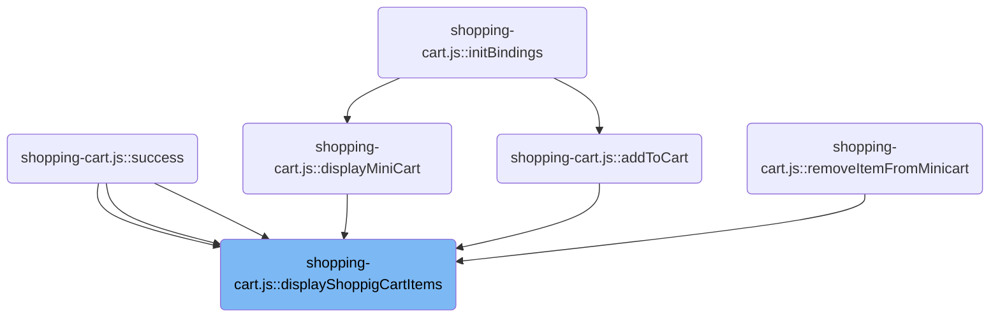
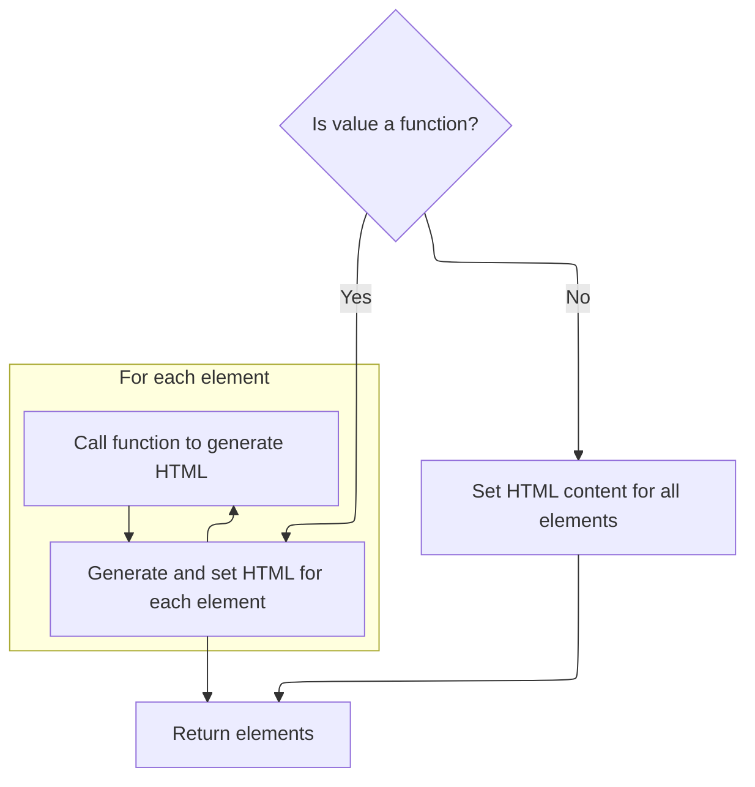
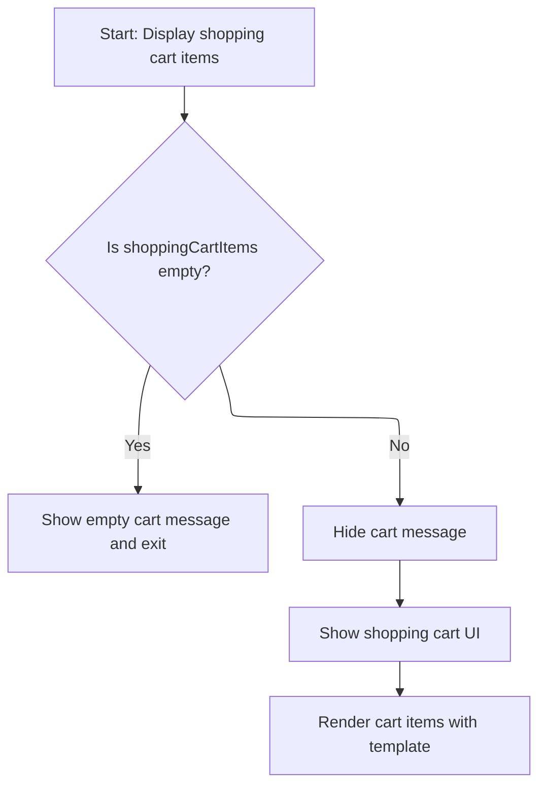

This document describes how shopping cart items are presented to users. The flow receives shopping cart data and a target UI element, prepares the data for display, and updates the interface to show either an empty cart message or the current cart items.

# Where is this flow used?

This flow is used multiple times in the codebase as represented in the following diagram:



# Preparing Cart Data and Template

<SwmSnippet path="/shopizer/sm-shop/src/main/webapp/resources/js/shopping-cart.js" line="331">

---

We prep the cart data and template, and clear the div so it's ready for new cart markup. The next step is to use jQuery's html function to do the clearing.

```javascript
function displayShoppigCartItems(cart, div) {
	
	 
	//set cart contextPath
	cart.contextPath=getContextPath(); 
	var template = Hogan.compile(document.getElementById("miniShoppingCartTemplate").innerHTML);
	
    
	 $(div).html('');
```

---

</SwmSnippet>

## Efficiently Updating Cart DOM

<SwmSnippet path="/shopizer/sm-shop/src/main/webapp/resources/js/bootstrap/jquery.js" line="5829">

---

In `html`, we check if we're getting or setting HTML. If setting, and the value is a simple string, we use innerHTML directly for speed. This is why we call this after prepping the cart template, to quickly clear the div before rendering new content.

```javascript
	html: function( value ) {
		if ( value === undefined ) {
			return this[0] && this[0].nodeType === 1 ?
				this[0].innerHTML.replace(rinlinejQuery, "") :
				null;

		// See if we can take a shortcut and just use innerHTML
		} else if ( typeof value === "string" && !rnoInnerhtml.test( value ) &&
			(jQuery.support.leadingWhitespace || !rleadingWhitespace.test( value )) &&
			!wrapMap[ (rtagName.exec( value ) || ["", ""])[1].toLowerCase() ] ) {

			value = value.replace(rxhtmlTag, "<$1></$2>");

			try {
				for ( var i = 0, l = this.length; i < l; i++ ) {
					// Remove element nodes and prevent memory leaks
					if ( this[i].nodeType === 1 ) {
						jQuery.cleanData( this[i].getElementsByTagName("*") );
						this[i].innerHTML = value;
					}
				}

```

---

</SwmSnippet>

### Cleaning Up Old jQuery Data

See <SwmLink doc-title="Cleaning Up DOM Elements">[Cleaning Up DOM Elements](\.swm\cleaning-up-dom-elements.qc62kj2s.sw.md)</SwmLink>

### Fallbacks and Dynamic HTML Updates



<SwmSnippet path="/shopizer/sm-shop/src/main/webapp/resources/js/bootstrap/jquery.js" line="5851">

---

Back in the `html` function, if innerHTML throws, we fall back to emptying and appending the new content. If the value is a function, we call it for each element to set dynamic HTML. Otherwise, we just empty and append. This keeps the cart update robust after clearing the div.

```javascript
			// If using innerHTML throws an exception, use the fallback method
			} catch(e) {
				this.empty().append( value );
			}

		} else if ( jQuery.isFunction( value ) ) {
			this.each(function(i){
				var self = jQuery( this );

				self.html( value.call(this, i, self.html()) );
			});

		} else {
			this.empty().append( value );
		}

		return this;
	},
```

---

</SwmSnippet>

## Rendering and Displaying Cart Items



<SwmSnippet path="/shopizer/sm-shop/src/main/webapp/resources/js/shopping-cart.js" line="340">

---

After returning from the jQuery html function, in `displayShoppigCartItems` we check if the cart is empty and handle that case. Otherwise, we hide the cart message, show the cart, and render the cart items using the Hogan template. This updates the UI with the latest cart data.

```javascript
	 if(cart.shoppingCartItems==null) {
		 emptyCartLabel();
		 return;
	 }
	 
	 $('#cartMessage').hide();
	 $('#shoppingcart').show();

	 //call template defined in template directory
	 $(div).append(template.render(cart));


}
```

---

</SwmSnippet>

&nbsp;

*This is an auto-generated document by Swimm 🌊 and has not yet been verified by a human*

<SwmMeta version="3.0.0" repo-id="Z2l0aHViJTNBJTNBU2hvcGl6ZXIlM0ElM0F1bWFsaW5nYXN3YW1p" repo-name="Shopizer"><sup>Powered by [Swimm](https://app.swimm.io/)</sup></SwmMeta>
