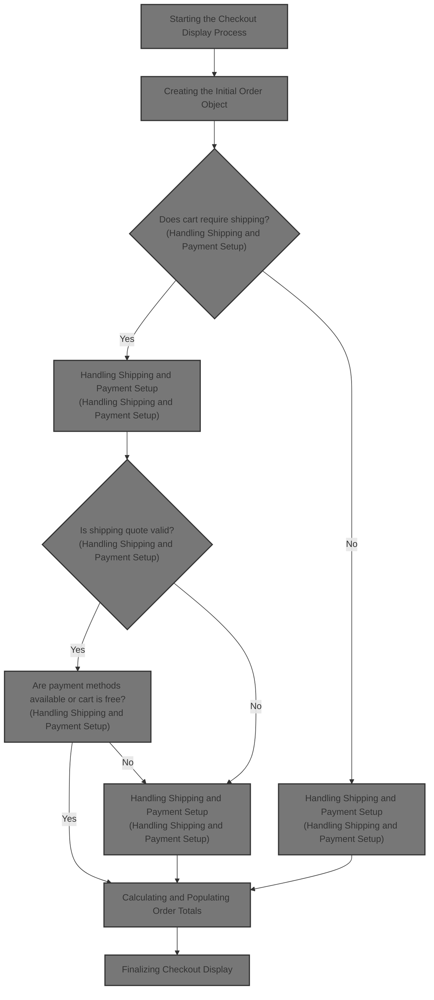
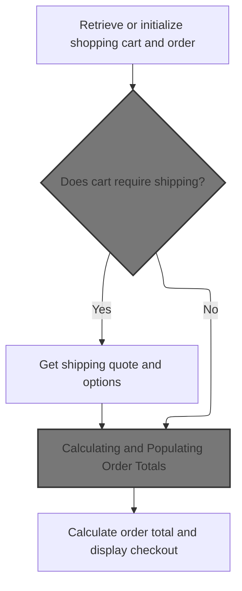
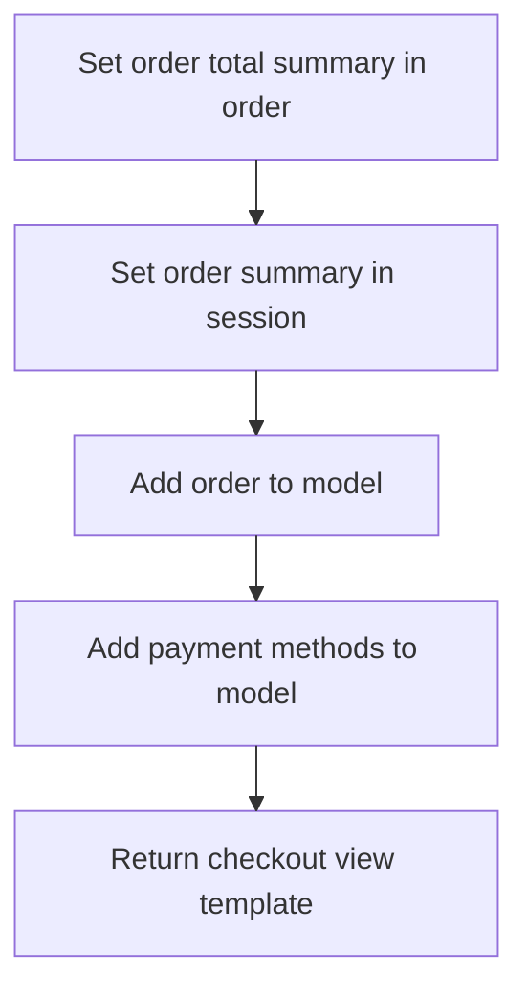

This document describes the flow of displaying the checkout page in the e-commerce platform. It receives user session and cookie data along with shopping cart and customer information as input, and outputs a fully prepared checkout page view. The flow includes retrieving or initializing the shopping cart and order, creating and populating customer and order data, handling shipping and payment setup, calculating order totals, and finalizing the checkout display for the user.



# Starting the Checkout Display Process



This section handles the process of starting the checkout display by retrieving or initializing the shopping cart and order, verifying shipping requirements, and calculating order totals before displaying the checkout page.

| Category        | Rule Name                             | Description                                                                                                                                                                                                                      |
| --------------- | ------------------------------------- | -------------------------------------------------------------------------------------------------------------------------------------------------------------------------------------------------------------------------------- |
| Data validation | Validate cart cookie store code       | If the shopping cart code is not found in the session, check the cookie formatted as 'merchantStoreCode_shoppingCartCode'. If the store code in the cookie does not match the current store, redirect to the shopping cart page. |
| Data validation | Redirect empty cart                   | If the shopping cart is empty (no line items), redirect the user to the shopping cart page to add items before proceeding to checkout.                                                                                           |
| Data validation | Validate cart ownership               | If the shopping cart belongs to a different customer than the logged-in user, redirect to the shopping cart page to prevent unauthorized access.                                                                                 |
| Business logic  | Fetch cart for logged-in customer     | If no shopping cart is found in the session or cookie and the customer is logged in, fetch the shopping cart from the database for that customer and store.                                                                      |
| Business logic  | Initialize anonymous customer billing | If no shopping cart is found and the user is anonymous, create an empty customer profile and copy billing information from an anonymous customer attribute if available.                                                         |
| Business logic  | Retrieve shipping options             | If the cart requires shipping, retrieve shipping quotes and options to present to the customer during checkout.                                                                                                                  |
| Business logic  | Calculate order totals                | Calculate and populate order totals including item prices, taxes, shipping, and discounts before displaying the checkout page.                                                                                                   |

<SwmSnippet path="/shopizer/sm-shop/src/main/java/com/salesmanager/web/shop/controller/order/ShoppingOrderController.java" line="136">

---

In <SwmToken path="shopizer/sm-shop/src/main/java/com/salesmanager/web/shop/controller/order/ShoppingOrderController.java" pos="136:5:5" line-data="	public String displayCheckout(@CookieValue(&quot;cart&quot;) String cookie, Model model, HttpServletRequest request, HttpServletResponse response, Locale locale) throws Exception {">`displayCheckout`</SwmToken> we start by trying to get the shopping cart code from the session. If it's not there, we check a cookie that must be formatted as 'merchantStoreCode_shoppingCartCode'. We split this cookie to verify the store code matches the current store, then get the cart code. If the cart is still not found and the customer is logged in, we fetch the cart from the database. If no cart is found, we redirect to the cart page. For anonymous users, we create an empty customer and copy billing info from an anonymous customer attribute. We call <SwmToken path="shopizer/sm-shop/src/main/java/com/salesmanager/web/shop/controller/order/facade/OrderFacadeImpl.java" pos="87:4:4" line-data="public class OrderFacadeImpl implements OrderFacade {">`OrderFacadeImpl`</SwmToken> next to initialize the order object with this cart and customer info.

```java
	public String displayCheckout(@CookieValue("cart") String cookie, Model model, HttpServletRequest request, HttpServletResponse response, Locale locale) throws Exception {

		Language language = (Language)request.getAttribute("LANGUAGE");
		MerchantStore store = (MerchantStore)request.getAttribute(Constants.MERCHANT_STORE);
		Customer customer = (Customer)request.getSession().getAttribute(Constants.CUSTOMER);

		
		/**
		 * Shopping cart
		 * 
		 * ShoppingCart should be in the HttpSession
		 * Otherwise the cart id is in the cookie
		 * Otherwise the customer is in the session and a cart exist in the DB
		 * Else -> Nothing to display
		 */
		
		//check if an existing order exist
		ShopOrder order = null;
		order = super.getSessionAttribute(Constants.ORDER, request);
	
		//Get the cart from the DB
		String shoppingCartCode  = (String)request.getSession().getAttribute(Constants.SHOPPING_CART);
		com.salesmanager.core.business.shoppingcart.model.ShoppingCart cart = null;
	
	    if(StringUtils.isBlank(shoppingCartCode)) {
				
			if(cookie==null) {//session expired and cookie null, nothing to do
				return "redirect:/shop/cart/shoppingCart.html";
			}
			String merchantCookie[] = cookie.split("_");
			String merchantStoreCode = merchantCookie[0];
			if(!merchantStoreCode.equals(store.getCode())) {
				return "redirect:/shop/cart/shoppingCart.html";
			}
			shoppingCartCode = merchantCookie[1];
	    	
	    } 
	    
	    cart = shoppingCartFacade.getShoppingCartModel(shoppingCartCode, store);
	
	    if(cart==null && customer!=null) {
				cart=shoppingCartFacade.getShoppingCartModel(customer, store);
	    }
	    
	    super.setSessionAttribute(Constants.SHOPPING_CART, cart.getShoppingCartCode(), request);
	
	    if(shoppingCartCode==null && cart==null) {//error
				return "redirect:/shop/cart/shoppingCart.html";
	    }
			
	
	    if(customer!=null) {
			if(cart.getCustomerId()!=customer.getId().longValue()) {
					return "redirect:/shop/shoppingCart.html";
			}
	     } else {
				customer = orderFacade.initEmptyCustomer(store);
				AnonymousCustomer anonymousCustomer = (AnonymousCustomer)request.getAttribute(Constants.ANONYMOUS_CUSTOMER);
				if(anonymousCustomer!=null && anonymousCustomer.getBilling()!=null) {
					Billing billing = customer.getBilling();
					billing.setCity(anonymousCustomer.getBilling().getCity());
					Map<String,Country> countriesMap = countryService.getCountriesMap(language);
					Country anonymousCountry = countriesMap.get(anonymousCustomer.getBilling().getCountry());
					if(anonymousCountry!=null) {
						billing.setCountry(anonymousCountry);
					}
					Map<String,Zone> zonesMap = zoneService.getZones(language);
					Zone anonymousZone = zonesMap.get(anonymousCustomer.getBilling().getZone());
					if(anonymousZone!=null) {
						billing.setZone(anonymousZone);
					}
					if(anonymousCustomer.getBilling().getPostalCode()!=null) {
						billing.setPostalCode(anonymousCustomer.getBilling().getPostalCode());
					}
					customer.setBilling(billing);
				}
	     }
	
	     Set<ShoppingCartItem> items = cart.getLineItems();
	     if(CollectionUtils.isEmpty(items)) {
				return "redirect:/shop/shoppingCart.html";
	     }
		
	     if(order==null) {
			order = orderFacade.initializeOrder(store, customer, cart, language);
		  }

```

---

</SwmSnippet>

## Creating the Initial Order Object

This section describes the process of creating an initial order object in the e-commerce platform, setting its status, ensuring a customer is associated with the order, and converting the customer to a persistable form for further processing.

| Category       | Rule Name                       | Description                                                                                                                   |
| -------------- | ------------------------------- | ----------------------------------------------------------------------------------------------------------------------------- |
| Business logic | Order Initialization            | An order must be created and initialized before any further processing can occur.                                             |
| Business logic | Set Initial Order Status        | The order status must be set to 'ORDERED' when the order is initialized.                                                      |
| Business logic | Default Customer Initialization | If no customer information is provided, an empty customer profile must be initialized to associate with the order.            |
| Business logic | Persistable Customer Conversion | The customer associated with the order must be converted into a persistable form suitable for storage and further processing. |

<SwmSnippet path="/shopizer/sm-shop/src/main/java/com/salesmanager/web/shop/controller/order/facade/OrderFacadeImpl.java" line="128">

---

We create an order, set status, ensure customer exists, then convert customer to a persistable form for further use.

```java
	public ShopOrder initializeOrder(MerchantStore store, Customer customer,
			ShoppingCart shoppingCart, Language language) throws Exception {

		//assert not null shopping cart items
		
		ShopOrder order = new ShopOrder();
		
		OrderStatus orderStatus = OrderStatus.ORDERED;
		order.setOrderStatus(orderStatus);
		
		if(customer==null) {
				customer = this.initEmptyCustomer(store);
		}
		
		PersistableCustomer persistableCustomer = persistableCustomer(customer, store, language);
```

---

</SwmSnippet>

### Transforming Customer Data for Persistence

This section describes the transformation of Customer data into a <SwmToken path="shopizer/sm-shop/src/main/java/com/salesmanager/web/shop/controller/order/facade/OrderFacadeImpl.java" pos="142:1:1" line-data="		PersistableCustomer persistableCustomer = persistableCustomer(customer, store, language);">`PersistableCustomer`</SwmToken> format to prepare it for saving or transfer within the system.

<SwmSnippet path="/shopizer/sm-shop/src/main/java/com/salesmanager/web/shop/controller/order/facade/OrderFacadeImpl.java" line="216">

---

We convert Customer to <SwmToken path="shopizer/sm-shop/src/main/java/com/salesmanager/web/shop/controller/order/facade/OrderFacadeImpl.java" pos="216:3:3" line-data="	private PersistableCustomer persistableCustomer(Customer customer, MerchantStore store, Language language) throws Exception {">`PersistableCustomer`</SwmToken> using a populator to prepare data for saving or transfer.

```java
	private PersistableCustomer persistableCustomer(Customer customer, MerchantStore store, Language language) throws Exception {
		
		PersistableCustomerPopulator customerPopulator = new PersistableCustomerPopulator();
		PersistableCustomer persistableCustomer = customerPopulator.populate(customer, new PersistableCustomer(), store, language);
		return persistableCustomer;
		
	}
```

---

</SwmSnippet>

### Populating Customer Details with Validation and Lookups

```mermaid
%%{init: {"flowchart": {"defaultRenderer": "elk"}} }%%
flowchart TD
    node1["Start populating customer"] --> node2{"Source has ID?"}
    click node1 openCode "shopizer/sm-shop/src/main/java/com/salesmanager/web/populator/customer/CustomerPopulator.java:47:50"
    node2 -->|"Yes"| node3["Set target ID"]
    click node2 openCode "shopizer/sm-shop/src/main/java/com/salesmanager/web/populator/customer/CustomerPopulator.java:58:60"
    node2 -->|"No"| node4
    node4{"Source has encoded password?"}
    click node4 openCode "shopizer/sm-shop/src/main/java/com/salesmanager/web/populator/customer/CustomerPopulator.java:63:66"
    node4 -->|"Yes"| node5["Set password and mark non-anonymous"]
    click node5 openCode "shopizer/sm-shop/src/main/java/com/salesmanager/web/populator/customer/CustomerPopulator.java:63:66"
    node4 -->|"No"| node6
    node6["Set email and username"]
    click node6 openCode "shopizer/sm-shop/src/main/java/com/salesmanager/web/populator/customer/CustomerPopulator.java:68:70"
    node6 --> node7{"Source gender exists and target gender null?"}
    click node7 openCode "shopizer/sm-shop/src/main/java/com/salesmanager/web/populator/customer/CustomerPopulator.java:70:72"
    node7 -->|"Yes"| node8["Set target gender from source"]
    click node8 openCode "shopizer/sm-shop/src/main/java/com/salesmanager/web/populator/customer/CustomerPopulator.java:70:72"
    node7 -->|"No"| node9{"Target gender null?"}
    click node9 openCode "shopizer/sm-shop/src/main/java/com/salesmanager/web/populator/customer/CustomerPopulator.java:73:75"
    node9 -->|"Yes"| node10["Set default gender Male"]
    click node10 openCode "shopizer/sm-shop/src/main/java/com/salesmanager/web/populator/customer/CustomerPopulator.java:73:75"
    node9 -->|"No"| node11
    node11["Get countries map"]
    click node11 openCode "shopizer/sm-shop/src/main/java/com/salesmanager/web/populator/customer/CustomerPopulator.java:77:79"
    node11 --> node12{"Source has billing address?"}
    click node12 openCode "shopizer/sm-shop/src/main/java/com/salesmanager/web/populator/customer/CustomerPopulator.java:81:83"
    node12 -->|"Yes"| node13["Populate billing address with country and zone validation"]
    click node13 openCode "shopizer/sm-shop/src/main/java/com/salesmanager/web/populator/customer/CustomerPopulator.java:82:110"
    node12 -->|"No"| node14
    node14{"Target billing null and source billing exists?"}
    click node14 openCode "shopizer/sm-shop/src/main/java/com/salesmanager/web/populator/customer/CustomerPopulator.java:112:124"
    node14 -->|"Yes"| node15["Set default billing values"]
    click node15 openCode "shopizer/sm-shop/src/main/java/com/salesmanager/web/populator/customer/CustomerPopulator.java:113:123"
    node14 -->|"No"| node16
    node16{"Source has delivery address?"}
    click node16 openCode "shopizer/sm-shop/src/main/java/com/salesmanager/web/populator/customer/CustomerPopulator.java:125:127"
    node16 -->|"Yes"| node17["Populate delivery address with country and zone validation"]
    click node17 openCode "shopizer/sm-shop/src/main/java/com/salesmanager/web/populator/customer/CustomerPopulator.java:128:156"
    node16 -->|"No"| node18
    node18{"Target delivery null and source delivery exists?"}
    click node18 openCode "shopizer/sm-shop/src/main/java/com/salesmanager/web/populator/customer/CustomerPopulator.java:158:170"
    node18 -->|"Yes"| node19["Set default delivery values"]
    click node19 openCode "shopizer/sm-shop/src/main/java/com/salesmanager/web/populator/customer/CustomerPopulator.java:159:169"
    node18 -->|"No"| node20
    node20{"Source has attributes?"}
    click node20 openCode "shopizer/sm-shop/src/main/java/com/salesmanager/web/populator/customer/CustomerPopulator.java:172:174"
    node20 -->|"Yes"| loop1
    node20 -->|"No"| node21
    subgraph loop1["For each customer attribute"]
        node22["Validate and add attribute to target"]
        click node22 openCode "shopizer/sm-shop/src/main/java/com/salesmanager/web/populator/customer/CustomerPopulator.java:174:201"
        node22 --> node22
    end
    node21{"Target default language null?"}
    click node21 openCode "shopizer/sm-shop/src/main/java/com/salesmanager/web/populator/customer/CustomerPopulator.java:204:206"
    node21 -->|"Yes"| node26["Set language from source or store default"]
    click node26 openCode "shopizer/sm-shop/src/main/java/com/salesmanager/web/populator/customer/CustomerPopulator.java:205:211"
    node21 -->|"No"| node27
    node27["Return populated customer"]
    click node27 openCode "shopizer/sm-shop/src/main/java/com/salesmanager/web/populator/customer/CustomerPopulator.java:221:222"
classDef HeadingStyle fill:#777777,stroke:#333,stroke-width:2px;

%% Swimm:
%% %%{init: {"flowchart": {"defaultRenderer": "elk"}} }%%
%% flowchart TD
%%     node1["Start populating customer"] --> node2{"Source has ID?"}
%%     click node1 openCode "<SwmPath>[shopizer/…/customer/CustomerPopulator.java](shopizer/sm-shop/src/main/java/com/salesmanager/web/populator/customer/CustomerPopulator.java)</SwmPath>:47:50"
%%     node2 -->|"Yes"| node3["Set target ID"]
%%     click node2 openCode "<SwmPath>[shopizer/…/customer/CustomerPopulator.java](shopizer/sm-shop/src/main/java/com/salesmanager/web/populator/customer/CustomerPopulator.java)</SwmPath>:58:60"
%%     node2 -->|"No"| node4
%%     node4{"Source has encoded password?"}
%%     click node4 openCode "<SwmPath>[shopizer/…/customer/CustomerPopulator.java](shopizer/sm-shop/src/main/java/com/salesmanager/web/populator/customer/CustomerPopulator.java)</SwmPath>:63:66"
%%     node4 -->|"Yes"| node5["Set password and mark non-anonymous"]
%%     click node5 openCode "<SwmPath>[shopizer/…/customer/CustomerPopulator.java](shopizer/sm-shop/src/main/java/com/salesmanager/web/populator/customer/CustomerPopulator.java)</SwmPath>:63:66"
%%     node4 -->|"No"| node6
%%     node6["Set email and username"]
%%     click node6 openCode "<SwmPath>[shopizer/…/customer/CustomerPopulator.java](shopizer/sm-shop/src/main/java/com/salesmanager/web/populator/customer/CustomerPopulator.java)</SwmPath>:68:70"
%%     node6 --> node7{"Source gender exists and target gender null?"}
%%     click node7 openCode "<SwmPath>[shopizer/…/customer/CustomerPopulator.java](shopizer/sm-shop/src/main/java/com/salesmanager/web/populator/customer/CustomerPopulator.java)</SwmPath>:70:72"
%%     node7 -->|"Yes"| node8["Set target gender from source"]
%%     click node8 openCode "<SwmPath>[shopizer/…/customer/CustomerPopulator.java](shopizer/sm-shop/src/main/java/com/salesmanager/web/populator/customer/CustomerPopulator.java)</SwmPath>:70:72"
%%     node7 -->|"No"| node9{"Target gender null?"}
%%     click node9 openCode "<SwmPath>[shopizer/…/customer/CustomerPopulator.java](shopizer/sm-shop/src/main/java/com/salesmanager/web/populator/customer/CustomerPopulator.java)</SwmPath>:73:75"
%%     node9 -->|"Yes"| node10["Set default gender Male"]
%%     click node10 openCode "<SwmPath>[shopizer/…/customer/CustomerPopulator.java](shopizer/sm-shop/src/main/java/com/salesmanager/web/populator/customer/CustomerPopulator.java)</SwmPath>:73:75"
%%     node9 -->|"No"| node11
%%     node11["Get countries map"]
%%     click node11 openCode "<SwmPath>[shopizer/…/customer/CustomerPopulator.java](shopizer/sm-shop/src/main/java/com/salesmanager/web/populator/customer/CustomerPopulator.java)</SwmPath>:77:79"
%%     node11 --> node12{"Source has billing address?"}
%%     click node12 openCode "<SwmPath>[shopizer/…/customer/CustomerPopulator.java](shopizer/sm-shop/src/main/java/com/salesmanager/web/populator/customer/CustomerPopulator.java)</SwmPath>:81:83"
%%     node12 -->|"Yes"| node13["Populate billing address with country and zone validation"]
%%     click node13 openCode "<SwmPath>[shopizer/…/customer/CustomerPopulator.java](shopizer/sm-shop/src/main/java/com/salesmanager/web/populator/customer/CustomerPopulator.java)</SwmPath>:82:110"
%%     node12 -->|"No"| node14
%%     node14{"Target billing null and source billing exists?"}
%%     click node14 openCode "<SwmPath>[shopizer/…/customer/CustomerPopulator.java](shopizer/sm-shop/src/main/java/com/salesmanager/web/populator/customer/CustomerPopulator.java)</SwmPath>:112:124"
%%     node14 -->|"Yes"| node15["Set default billing values"]
%%     click node15 openCode "<SwmPath>[shopizer/…/customer/CustomerPopulator.java](shopizer/sm-shop/src/main/java/com/salesmanager/web/populator/customer/CustomerPopulator.java)</SwmPath>:113:123"
%%     node14 -->|"No"| node16
%%     node16{"Source has delivery address?"}
%%     click node16 openCode "<SwmPath>[shopizer/…/customer/CustomerPopulator.java](shopizer/sm-shop/src/main/java/com/salesmanager/web/populator/customer/CustomerPopulator.java)</SwmPath>:125:127"
%%     node16 -->|"Yes"| node17["Populate delivery address with country and zone validation"]
%%     click node17 openCode "<SwmPath>[shopizer/…/customer/CustomerPopulator.java](shopizer/sm-shop/src/main/java/com/salesmanager/web/populator/customer/CustomerPopulator.java)</SwmPath>:128:156"
%%     node16 -->|"No"| node18
%%     node18{"Target delivery null and source delivery exists?"}
%%     click node18 openCode "<SwmPath>[shopizer/…/customer/CustomerPopulator.java](shopizer/sm-shop/src/main/java/com/salesmanager/web/populator/customer/CustomerPopulator.java)</SwmPath>:158:170"
%%     node18 -->|"Yes"| node19["Set default delivery values"]
%%     click node19 openCode "<SwmPath>[shopizer/…/customer/CustomerPopulator.java](shopizer/sm-shop/src/main/java/com/salesmanager/web/populator/customer/CustomerPopulator.java)</SwmPath>:159:169"
%%     node18 -->|"No"| node20
%%     node20{"Source has attributes?"}
%%     click node20 openCode "<SwmPath>[shopizer/…/customer/CustomerPopulator.java](shopizer/sm-shop/src/main/java/com/salesmanager/web/populator/customer/CustomerPopulator.java)</SwmPath>:172:174"
%%     node20 -->|"Yes"| loop1
%%     node20 -->|"No"| node21
%%     subgraph loop1["For each customer attribute"]
%%         node22["Validate and add attribute to target"]
%%         click node22 openCode "<SwmPath>[shopizer/…/customer/CustomerPopulator.java](shopizer/sm-shop/src/main/java/com/salesmanager/web/populator/customer/CustomerPopulator.java)</SwmPath>:174:201"
%%         node22 --> node22
%%     end
%%     node21{"Target default language null?"}
%%     click node21 openCode "<SwmPath>[shopizer/…/customer/CustomerPopulator.java](shopizer/sm-shop/src/main/java/com/salesmanager/web/populator/customer/CustomerPopulator.java)</SwmPath>:204:206"
%%     node21 -->|"Yes"| node26["Set language from source or store default"]
%%     click node26 openCode "<SwmPath>[shopizer/…/customer/CustomerPopulator.java](shopizer/sm-shop/src/main/java/com/salesmanager/web/populator/customer/CustomerPopulator.java)</SwmPath>:205:211"
%%     node21 -->|"No"| node27
%%     node27["Return populated customer"]
%%     click node27 openCode "<SwmPath>[shopizer/…/customer/CustomerPopulator.java](shopizer/sm-shop/src/main/java/com/salesmanager/web/populator/customer/CustomerPopulator.java)</SwmPath>:221:222"
%% classDef HeadingStyle fill:#777777,stroke:#333,stroke-width:2px;
```



This section describes the process of populating a Customer object with details from a source object, including validation and lookups for addresses, attributes, and default values.

| Category        | Rule Name                                          | Description                                                                                                                                                                                               |
| --------------- | -------------------------------------------------- | --------------------------------------------------------------------------------------------------------------------------------------------------------------------------------------------------------- |
| Data validation | Validate and set billing address country and zone  | If the source billing address country code is present, it must be validated against the store's country list. If invalid, an exception is thrown. Similarly, the zone code must be validated if present.  |
| Data validation | Validate and set delivery address country and zone | If the source delivery address country code is present, it must be validated against the store's country list. If invalid, an exception is thrown. Similarly, the zone code must be validated if present. |
| Data validation | Validate customer attributes                       | Each customer attribute must be validated to ensure the customer option and option value exist and belong to the current store. If invalid, an exception is thrown.                                       |
| Business logic  | Set customer ID if present                         | If the source customer has a valid ID (non-null and greater than zero), the target customer ID must be set to this value.                                                                                 |
| Business logic  | Set password and anonymity                         | If the source customer has an encoded password, the target customer's password must be set and the customer marked as non-anonymous.                                                                      |
| Business logic  | Set email and username                             | The target customer's email address and username must be set from the source customer details.                                                                                                            |
| Business logic  | Set gender with default                            | If the source customer has a gender and the target gender is null, set the target gender from the source. If the target gender remains null, set it to Male by default.                                   |
| Business logic  | Set default billing if missing                     | If the target billing address is null but the source billing address exists, set default billing values including validated country.                                                                      |
| Business logic  | Set default delivery if missing                    | If the target delivery address is null but the source delivery address exists, set default delivery values including validated country.                                                                   |
| Business logic  | Set default language                               | If the target customer's default language is null, set it from the source language code if valid, otherwise use the store's default language.                                                             |

<SwmSnippet path="/shopizer/sm-shop/src/main/java/com/salesmanager/web/populator/customer/CustomerPopulator.java" line="47">

---

In <SwmToken path="shopizer/sm-shop/src/main/java/com/salesmanager/web/populator/customer/CustomerPopulator.java" pos="47:5:5" line-data="	public Customer populate(PersistableCustomer source, Customer target,">`populate`</SwmToken> we first check that all required services are set. Then we copy billing and delivery addresses from the source, looking up country and zone codes to validate them. If codes are invalid, we throw exceptions. We also validate customer attributes belong to the current store. Finally, we set default gender and language if missing.

```java
	public Customer populate(PersistableCustomer source, Customer target,
			MerchantStore store, Language language) throws ConversionException {

		Validate.notNull(customerOptionService, "Requires to set CustomerOptionService");
		Validate.notNull(customerOptionValueService, "Requires to set CustomerOptionValueService");
		Validate.notNull(zoneService, "Requires to set ZoneService");
		Validate.notNull(countryService, "Requires to set CountryService");
		Validate.notNull(languageService, "Requires to set LanguageService");

		try {
			
			if(source.getId() !=null && source.getId()>0){
			    target.setId( source.getId() );
			}
		    
		    
		    if(!StringUtils.isBlank(source.getEncodedPassword())) {
				target.setPassword(source.getEncodedPassword());
				target.setAnonymous(false);
			}

			target.setEmailAddress(source.getEmailAddress());
			target.setNick(source.getUserName());
			if(source.getGender()!=null && target.getGender()==null) {
				target.setGender( com.salesmanager.core.business.customer.model.CustomerGender.valueOf( source.getGender() ) );
			}
			if(target.getGender()==null) {
				target.setGender( com.salesmanager.core.business.customer.model.CustomerGender.M);
			}

			Map<String,Country> countries = countryService.getCountriesMap(language);
			
			target.setMerchantStore( store );

			Address sourceBilling = source.getBilling();
			if(sourceBilling!=null) {
				Billing billing = new Billing();
				billing.setAddress(sourceBilling.getAddress());
				billing.setCity(sourceBilling.getCity());
				billing.setCompany(sourceBilling.getCompany());
				//billing.setCountry(country);
				billing.setFirstName(sourceBilling.getFirstName());
				billing.setLastName(sourceBilling.getLastName());
				billing.setTelephone(sourceBilling.getPhone());
				billing.setPostalCode(sourceBilling.getPostalCode());
				billing.setState(sourceBilling.getStateProvince());
				Country billingCountry = null;
				if(!StringUtils.isBlank(sourceBilling.getCountry())) {
					billingCountry = countries.get(sourceBilling.getCountry());
					if(billingCountry==null) {
						throw new ConversionException("Unsuported country code " + sourceBilling.getCountry());
					}
					billing.setCountry(billingCountry);
				}
				
				if(billingCountry!=null && !StringUtils.isBlank(sourceBilling.getZone())) {
					Zone zone = zoneService.getByCode(sourceBilling.getZone());
					if(zone==null) {
						throw new ConversionException("Unsuported zone code " + sourceBilling.getZone());
					}
					billing.setZone(zone);
				}
				target.setBilling(billing);

			}
			if(target.getBilling() ==null && source.getBilling()!=null){
			    LOG.info( "Setting default values for billing" );
			    Billing billing = new Billing();
			    Country billingCountry = null;
			    if(StringUtils.isNotBlank( source.getBilling().getCountry() )) {
                    billingCountry = countries.get(source.getBilling().getCountry());
                    if(billingCountry==null) {
                        throw new ConversionException("Unsuported country code " + sourceBilling.getCountry());
                    }
                    billing.setCountry(billingCountry);
                    target.setBilling( billing );
                }
			}
			Address sourceShipping = source.getDelivery();
			if(sourceShipping!=null) {
				Delivery delivery = new Delivery();
				delivery.setAddress(sourceShipping.getAddress());
				delivery.setCity(sourceShipping.getCity());
				delivery.setCompany(sourceShipping.getCompany());
				delivery.setFirstName(sourceShipping.getFirstName());
				delivery.setLastName(sourceShipping.getLastName());
				delivery.setTelephone(sourceShipping.getPhone());
				delivery.setPostalCode(sourceShipping.getPostalCode());
				delivery.setState(sourceShipping.getStateProvince());
				Country deliveryCountry = null;
				
				
				
				if(!StringUtils.isBlank(sourceShipping.getCountry())) {
					deliveryCountry = countries.get(sourceShipping.getCountry());
					if(deliveryCountry==null) {
						throw new ConversionException("Unsuported country code " + sourceShipping.getCountry());
					}
					delivery.setCountry(deliveryCountry);
				}
				
				if(deliveryCountry!=null && !StringUtils.isBlank(sourceShipping.getZone())) {
					Zone zone = zoneService.getByCode(sourceShipping.getZone());
					if(zone==null) {
						throw new ConversionException("Unsuported zone code " + sourceShipping.getZone());
					}
					delivery.setZone(zone);
				}
				target.setDelivery(delivery);
			}
			
			if(target.getDelivery() ==null && source.getDelivery()!=null){
			    LOG.info( "Setting default value for delivery" );
			    Delivery delivery = new Delivery();
			    Country deliveryCountry = null;
                if(StringUtils.isNotBlank( source.getDelivery().getCountry() )) {
                    deliveryCountry = countries.get(source.getDelivery().getCountry());
                    if(deliveryCountry==null) {
                        throw new ConversionException("Unsuported country code " + sourceShipping.getCountry());
                    }
                    delivery.setCountry(deliveryCountry);
                    target.setDelivery( delivery );
                }
			}
			
			if(source.getAttributes()!=null) {
				for(PersistableCustomerAttribute attr : source.getAttributes()) {

					CustomerOption customerOption = customerOptionService.getById(attr.getCustomerOption().getId());
					if(customerOption==null) {
						throw new ConversionException("Customer option id " + attr.getCustomerOption().getId() + " does not exist");
					}
					
					CustomerOptionValue customerOptionValue = customerOptionValueService.getById(attr.getCustomerOptionValue().getId());
					if(customerOptionValue==null) {
						throw new ConversionException("Customer option value id " + attr.getCustomerOptionValue().getId() + " does not exist");
					}
					
					if(customerOption.getMerchantStore().getId().intValue()!=store.getId().intValue()) {
						throw new ConversionException("Invalid customer option id ");
					}
					
					if(customerOptionValue.getMerchantStore().getId().intValue()!=store.getId().intValue()) {
						throw new ConversionException("Invalid customer option value id ");
					}
					
					CustomerAttribute attribute = new CustomerAttribute();
					attribute.setCustomer(target);
					attribute.setCustomerOption(customerOption);
					attribute.setCustomerOptionValue(customerOptionValue);
					attribute.setTextValue(attr.getTextValue());
					
					target.getAttributes().add(attribute);
					
				}
```

---

</SwmSnippet>

<SwmSnippet path="/shopizer/sm-shop/src/main/java/com/salesmanager/web/populator/customer/CustomerPopulator.java" line="204">

---

We return the fully populated and validated Customer object for further use.

```java
			if(target.getDefaultLanguage()==null) {
				Language lang = languageService.getByCode(source.getLanguage());
				if(lang==null) {
					lang = store.getDefaultLanguage();
				}
				
				target.setDefaultLanguage(lang);
			}

		
		} catch (Exception e) {
			throw new ConversionException(e);
		}
		
		
		
		
		return target;
	}
```

---

</SwmSnippet>

### Finalizing Order Initialization with Customer and Cart Items

<SwmSnippet path="/shopizer/sm-shop/src/main/java/com/salesmanager/web/shop/controller/order/facade/OrderFacadeImpl.java" line="143">

---

After getting the persistable customer, we set it on the order. Then we copy the shopping cart items into the order for price calculations. Finally, we return the completed order object.

```java
		order.setCustomer(persistableCustomer);

		//keep list of shopping cart items for core price calculation
		List<ShoppingCartItem> items = new ArrayList<ShoppingCartItem>(shoppingCart.getLineItems());
		order.setShoppingCartItems(items);
		
		return order;
	}
```

---

</SwmSnippet>

## Handling Shipping and Payment Setup

```mermaid
%%{init: {"flowchart": {"defaultRenderer": "elk"}} }%%
flowchart TD
    node1["Check if shipping is required"]
    click node1 openCode "shopizer/sm-shop/src/main/java/com/salesmanager/web/shop/controller/order/ShoppingOrderController.java:223:225"
    node1 -->|"Yes"| node2["Get shipping quote"]
    click node2 openCode "shopizer/sm-shop/src/main/java/com/salesmanager/web/shop/controller/order/ShoppingOrderController.java:228:231"
    node1 -->|"No"| node3["Get countries list"]
    click node3 openCode "shopizer/sm-shop/src/main/java/com/salesmanager/web/shop/controller/order/ShoppingOrderController.java:257:260"
    node2 --> node4{"Is shipping quote valid?"}
    click node4 openCode "shopizer/sm-shop/src/main/java/com/salesmanager/web/shop/controller/order/ShoppingOrderController.java:233:250"
    node4 -->|"Yes"| node5["Set shipping summary and options"]
    click node5 openCode "shopizer/sm-shop/src/main/java/com/salesmanager/web/shop/controller/order/ShoppingOrderController.java:237:249"
    node4 -->|"No"| node6["Show shipping error message"]
    click node6 openCode "shopizer/sm-shop/src/main/java/com/salesmanager/web/shop/controller/order/ShoppingOrderController.java:262:275"
    node5 --> node7
    node6 --> node7
    node3 --> node7
    node7["Get payment methods"]
    click node7 openCode "shopizer/sm-shop/src/main/java/com/salesmanager/web/shop/controller/order/ShoppingOrderController.java:279:280"
    node7 --> node8{"Are payment methods available or cart is free?"}
    click node8 openCode "shopizer/sm-shop/src/main/java/com/salesmanager/web/shop/controller/order/ShoppingOrderController.java:281:285"
    node8 -->|"No"| node9["Show error: No payment methods"]
    click node9 openCode "shopizer/sm-shop/src/main/java/com/salesmanager/web/shop/controller/order/ShoppingOrderController.java:283:285"
    node8 -->|"Yes"| node10["Select default payment method"]

    subgraph loop1["Loop through payment methods"]
        node10 --> node11{"Is payment method default?"}
        click node11 openCode "shopizer/sm-shop/src/main/java/com/salesmanager/web/shop/controller/order/ShoppingOrderController.java:289:293"
        node11 -->|"Yes"| node12["Set as default and exit loop"]
        node11 -->|"No"| node10
    end

    node12 --> node13{"Is default payment selected?"}
    click node12 openCode "shopizer/sm-shop/src/main/java/com/salesmanager/web/shop/controller/order/ShoppingOrderController.java:296:299"
    node13 -->|"No"| node14["Force select first payment method"]
    click node13 openCode "shopizer/sm-shop/src/main/java/com/salesmanager/web/shop/controller/order/ShoppingOrderController.java:296:299"
    node14 --> node15
    click node14 openCode "shopizer/sm-shop/src/main/java/com/salesmanager/web/shop/controller/order/ShoppingOrderController.java:296:299"
    node13 -->|"Yes"| node15["Get shopping cart data"]
    click node15 openCode "shopizer/sm-shop/src/main/java/com/salesmanager/web/shop/controller/order/ShoppingOrderController.java:305:306"
    node15 --> node16["Calculate order total"]
    click node16 openCode "shopizer/sm-shop/src/main/java/com/salesmanager/web/shop/controller/order/ShoppingOrderController.java:310:311"
    node16 --> node17["Display checkout page"]
    click node17 openCode "shopizer/sm-shop/src/main/java/com/salesmanager/web/shop/controller/order/ShoppingOrderController.java:312:313"
classDef HeadingStyle fill:#777777,stroke:#333,stroke-width:2px;

%% Swimm:
%% %%{init: {"flowchart": {"defaultRenderer": "elk"}} }%%
%% flowchart TD
%%     node1["Check if shipping is required"]
%%     click node1 openCode "<SwmPath>[shopizer/…/order/ShoppingOrderController.java](shopizer/sm-shop/src/main/java/com/salesmanager/web/shop/controller/order/ShoppingOrderController.java)</SwmPath>:223:225"
%%     node1 -->|"Yes"| node2["Get shipping quote"]
%%     click node2 openCode "<SwmPath>[shopizer/…/order/ShoppingOrderController.java](shopizer/sm-shop/src/main/java/com/salesmanager/web/shop/controller/order/ShoppingOrderController.java)</SwmPath>:228:231"
%%     node1 -->|"No"| node3["Get countries list"]
%%     click node3 openCode "<SwmPath>[shopizer/…/order/ShoppingOrderController.java](shopizer/sm-shop/src/main/java/com/salesmanager/web/shop/controller/order/ShoppingOrderController.java)</SwmPath>:257:260"
%%     node2 --> node4{"Is shipping quote valid?"}
%%     click node4 openCode "<SwmPath>[shopizer/…/order/ShoppingOrderController.java](shopizer/sm-shop/src/main/java/com/salesmanager/web/shop/controller/order/ShoppingOrderController.java)</SwmPath>:233:250"
%%     node4 -->|"Yes"| node5["Set shipping summary and options"]
%%     click node5 openCode "<SwmPath>[shopizer/…/order/ShoppingOrderController.java](shopizer/sm-shop/src/main/java/com/salesmanager/web/shop/controller/order/ShoppingOrderController.java)</SwmPath>:237:249"
%%     node4 -->|"No"| node6["Show shipping error message"]
%%     click node6 openCode "<SwmPath>[shopizer/…/order/ShoppingOrderController.java](shopizer/sm-shop/src/main/java/com/salesmanager/web/shop/controller/order/ShoppingOrderController.java)</SwmPath>:262:275"
%%     node5 --> node7
%%     node6 --> node7
%%     node3 --> node7
%%     node7["Get payment methods"]
%%     click node7 openCode "<SwmPath>[shopizer/…/order/ShoppingOrderController.java](shopizer/sm-shop/src/main/java/com/salesmanager/web/shop/controller/order/ShoppingOrderController.java)</SwmPath>:279:280"
%%     node7 --> node8{"Are payment methods available or cart is free?"}
%%     click node8 openCode "<SwmPath>[shopizer/…/order/ShoppingOrderController.java](shopizer/sm-shop/src/main/java/com/salesmanager/web/shop/controller/order/ShoppingOrderController.java)</SwmPath>:281:285"
%%     node8 -->|"No"| node9["Show error: No payment methods"]
%%     click node9 openCode "<SwmPath>[shopizer/…/order/ShoppingOrderController.java](shopizer/sm-shop/src/main/java/com/salesmanager/web/shop/controller/order/ShoppingOrderController.java)</SwmPath>:283:285"
%%     node8 -->|"Yes"| node10["Select default payment method"]
%% 
%%     subgraph loop1["Loop through payment methods"]
%%         node10 --> node11{"Is payment method default?"}
%%         click node11 openCode "<SwmPath>[shopizer/…/order/ShoppingOrderController.java](shopizer/sm-shop/src/main/java/com/salesmanager/web/shop/controller/order/ShoppingOrderController.java)</SwmPath>:289:293"
%%         node11 -->|"Yes"| node12["Set as default and exit loop"]
%%         node11 -->|"No"| node10
%%     end
%% 
%%     node12 --> node13{"Is default payment selected?"}
%%     click node12 openCode "<SwmPath>[shopizer/…/order/ShoppingOrderController.java](shopizer/sm-shop/src/main/java/com/salesmanager/web/shop/controller/order/ShoppingOrderController.java)</SwmPath>:296:299"
%%     node13 -->|"No"| node14["Force select first payment method"]
%%     click node13 openCode "<SwmPath>[shopizer/…/order/ShoppingOrderController.java](shopizer/sm-shop/src/main/java/com/salesmanager/web/shop/controller/order/ShoppingOrderController.java)</SwmPath>:296:299"
%%     node14 --> node15
%%     click node14 openCode "<SwmPath>[shopizer/…/order/ShoppingOrderController.java](shopizer/sm-shop/src/main/java/com/salesmanager/web/shop/controller/order/ShoppingOrderController.java)</SwmPath>:296:299"
%%     node13 -->|"Yes"| node15["Get shopping cart data"]
%%     click node15 openCode "<SwmPath>[shopizer/…/order/ShoppingOrderController.java](shopizer/sm-shop/src/main/java/com/salesmanager/web/shop/controller/order/ShoppingOrderController.java)</SwmPath>:305:306"
%%     node15 --> node16["Calculate order total"]
%%     click node16 openCode "<SwmPath>[shopizer/…/order/ShoppingOrderController.java](shopizer/sm-shop/src/main/java/com/salesmanager/web/shop/controller/order/ShoppingOrderController.java)</SwmPath>:310:311"
%%     node16 --> node17["Display checkout page"]
%%     click node17 openCode "<SwmPath>[shopizer/…/order/ShoppingOrderController.java](shopizer/sm-shop/src/main/java/com/salesmanager/web/shop/controller/order/ShoppingOrderController.java)</SwmPath>:312:313"
%% classDef HeadingStyle fill:#777777,stroke:#333,stroke-width:2px;
```



<SwmSnippet path="/shopizer/sm-shop/src/main/java/com/salesmanager/web/shop/controller/order/ShoppingOrderController.java" line="223">

---

After initializing the order, we check if shipping is needed. If yes, we get a shipping quote and add it to the model. We handle errors by logging and adding messages to the model. We also add shipping countries for selection. Then we get payment methods and select a default if none is set, logging errors if none are available.

```java
		boolean freeShoppingCart = shoppingCartService.isFreeShoppingCart(cart);
		boolean requiresShipping = shoppingCartService.requiresShipping(cart);
		
		/** shipping **/
		ShippingQuote quote = null;
		if(requiresShipping) {
			quote = orderFacade.getShippingQuote(customer, cart, order, store, language);
			model.addAttribute("shippingQuote", quote);
		}

		if(quote!=null) {

			if(StringUtils.isBlank(quote.getShippingReturnCode())) {
			
				if(order.getShippingSummary()==null) {
					ShippingSummary summary = orderFacade.getShippingSummary(quote, store, language);
					order.setShippingSummary(summary);
					request.getSession().setAttribute(Constants.SHIPPING_SUMMARY, summary);
				}
				if(order.getSelectedShippingOption()==null) {
					order.setSelectedShippingOption(quote.getSelectedShippingOption());
				}
				
				//save quotes in HttpSession
				List<ShippingOption> options = quote.getShippingOptions();
				request.getSession().setAttribute(Constants.SHIPPING_OPTIONS, options);
			
			}
			
			
			//get shipping countries
			List<Country> shippingCountriesList = orderFacade.getShipToCountry(store, language);
			model.addAttribute("countries", shippingCountriesList);
		} else {
			//get all countries
			List<Country> countries = countryService.getCountries(language);
			model.addAttribute("countries", countries);
		}
		
		if(quote!=null && quote.getShippingReturnCode()!=null && quote.getShippingReturnCode().equals(ShippingQuote.NO_SHIPPING_MODULE_CONFIGURED)) {
			LOGGER.error("Shipping quote error " + quote.getShippingReturnCode());
			model.addAttribute("errorMessages", quote.getShippingReturnCode());
		}
		
		if(quote!=null && !StringUtils.isBlank(quote.getQuoteError())) {
			LOGGER.error("Shipping quote error " + quote.getQuoteError());
			model.addAttribute("errorMessages", quote.getQuoteError());
		}
		
		if(quote!=null && quote.getShippingReturnCode()!=null && quote.getShippingReturnCode().equals(ShippingQuote.NO_SHIPPING_TO_SELECTED_COUNTRY)) {
			LOGGER.error("Shipping quote error " + quote.getShippingReturnCode());
			model.addAttribute("errorMessages", quote.getShippingReturnCode());
		}
		/** end shipping **/

		//get payment methods
		List<PaymentMethod> paymentMethods = paymentService.getAcceptedPaymentMethods(store);

		//not free and no payment methods
		if(CollectionUtils.isEmpty(paymentMethods) && !freeShoppingCart) {
			LOGGER.error("No payment method configured");
			model.addAttribute("errorMessages", "No payments configured");
		}
		
		if(!CollectionUtils.isEmpty(paymentMethods)) {//select default payment method
			PaymentMethod defaultPaymentSelected = null;
			for(PaymentMethod paymentMethod : paymentMethods) {
				if(paymentMethod.isDefaultSelected()) {
					defaultPaymentSelected = paymentMethod;
					break;
				}
			}
```

---

</SwmSnippet>

<SwmSnippet path="/shopizer/sm-shop/src/main/java/com/salesmanager/web/shop/controller/order/ShoppingOrderController.java" line="296">

---

Here we check if any payment method is marked as default. If not, we force the first one to be default selected. Then we call <SwmToken path="shopizer/sm-shop/src/main/java/com/salesmanager/web/shop/controller/shoppingCart/facade/ShoppingCartFacadeImpl.java" pos="51:4:4" line-data="public class ShoppingCartFacadeImpl">`ShoppingCartFacadeImpl`</SwmToken> to get a readable version of the shopping cart for the order summary.

```java
			if(defaultPaymentSelected==null) {//forced default selection
				defaultPaymentSelected = paymentMethods.get(0);
				defaultPaymentSelected.setDefaultSelected(true);
			}
			
			
		}
		
		//readable shopping cart items for order summary box
        ShoppingCartData shoppingCart = shoppingCartFacade.getShoppingCartData(cart);
```

---

</SwmSnippet>

<SwmSnippet path="/shopizer/sm-shop/src/main/java/com/salesmanager/web/shop/controller/shoppingCart/facade/ShoppingCartFacadeImpl.java" line="311">

---

In <SwmToken path="shopizer/sm-shop/src/main/java/com/salesmanager/web/shop/controller/shoppingCart/facade/ShoppingCartFacadeImpl.java" pos="311:5:5" line-data="    public ShoppingCartData getShoppingCartData( final ShoppingCart shoppingCartModel )">`getShoppingCartData`</SwmToken> we create a <SwmToken path="shopizer/sm-shop/src/main/java/com/salesmanager/web/shop/controller/shoppingCart/facade/ShoppingCartFacadeImpl.java" pos="315:1:1" line-data="        ShoppingCartDataPopulator shoppingCartDataPopulator = new ShoppingCartDataPopulator();">`ShoppingCartDataPopulator`</SwmToken>, set calculation and pricing services on it, then get Language and <SwmToken path="shopizer/sm-shop/src/main/java/com/salesmanager/web/shop/controller/shoppingCart/facade/ShoppingCartFacadeImpl.java" pos="319:1:1" line-data="        MerchantStore merchantStore = (MerchantStore) getKeyValue( Constants.MERCHANT_STORE );">`MerchantStore`</SwmToken> from a key-value store. We use the populator to transform the <SwmToken path="shopizer/sm-shop/src/main/java/com/salesmanager/web/shop/controller/shoppingCart/facade/ShoppingCartFacadeImpl.java" pos="311:10:10" line-data="    public ShoppingCartData getShoppingCartData( final ShoppingCart shoppingCartModel )">`ShoppingCart`</SwmToken> model into a <SwmToken path="shopizer/sm-shop/src/main/java/com/salesmanager/web/shop/controller/shoppingCart/facade/ShoppingCartFacadeImpl.java" pos="311:3:3" line-data="    public ShoppingCartData getShoppingCartData( final ShoppingCart shoppingCartModel )">`ShoppingCartData`</SwmToken> object for the UI.

```java
    public ShoppingCartData getShoppingCartData( final ShoppingCart shoppingCartModel )
        throws Exception
    {

        ShoppingCartDataPopulator shoppingCartDataPopulator = new ShoppingCartDataPopulator();
        shoppingCartDataPopulator.setShoppingCartCalculationService( shoppingCartCalculationService );
        shoppingCartDataPopulator.setPricingService( pricingService );
        Language language = (Language) getKeyValue( Constants.LANGUAGE );
        MerchantStore merchantStore = (MerchantStore) getKeyValue( Constants.MERCHANT_STORE );
        return shoppingCartDataPopulator.populate( shoppingCartModel, merchantStore, language );
    }
```

---

</SwmSnippet>

<SwmSnippet path="/shopizer/sm-shop/src/main/java/com/salesmanager/web/shop/controller/order/ShoppingOrderController.java" line="306">

---

After getting the readable shopping cart data, we add it to the model for the UI. Then we call <SwmToken path="shopizer/sm-shop/src/main/java/com/salesmanager/web/shop/controller/order/ShoppingOrderController.java" pos="311:9:9" line-data="		OrderTotalSummary orderTotalSummary = orderFacade.calculateOrderTotal(store, order, language);">`calculateOrderTotal`</SwmToken> to compute the order totals including shipping and taxes.

```java
        model.addAttribute( "cart", shoppingCart );
		


		//order total
		OrderTotalSummary orderTotalSummary = orderFacade.calculateOrderTotal(store, order, language);
```

---

</SwmSnippet>

## Calculating and Populating Order Totals

```mermaid
%%{init: {"flowchart": {"defaultRenderer": "elk"}} }%%
flowchart TD
    node1["Start calculate order total"] --> node2{"Is shipping option selected?"}
    click node1 openCode "shopizer/sm-shop/src/main/java/com/salesmanager/web/shop/controller/order/ShoppingOrderController.java:836:837"
    node2 -->|"No"| node8["Set shopping cart items in order"]
    click node2 openCode "shopizer/sm-shop/src/main/java/com/salesmanager/web/shop/controller/order/ShoppingOrderController.java:853:854"
    node2 -->|"Yes"| node4{"Are shipping options available?"}
    click node4 openCode "shopizer/sm-shop/src/main/java/com/salesmanager/web/shop/controller/order/ShoppingOrderController.java:868:869"
    node4 -->|"No"| node8
    node4 -->|"Yes"| subgraph loop1["For each shipping option"]
        node5{"Does shipping option ID match selected option ID?"}
        click node5 openCode "shopizer/sm-shop/src/main/java/com/salesmanager/web/shop/controller/order/ShoppingOrderController.java:877:880"
        node5 -->|"Yes"| node6["Set quote option to this shipping option"]
        click node6 openCode "shopizer/sm-shop/src/main/java/com/salesmanager/web/shop/controller/order/ShoppingOrderController.java:878:880"
        node5 -->|"No"| node7["Check next shipping option"]
        click node7 openCode "shopizer/sm-shop/src/main/java/com/salesmanager/web/shop/controller/order/ShoppingOrderController.java:877:880"
    end
    node6 --> node17["Is quote option set?"]
    node17 -->|"Yes"| node18["Use matched shipping option"]
    node17 -->|"No"| node19["Use first shipping option as default"]
    node18 --> node8
    node19 --> node8
    node8["Set shopping cart items in order"] --> node9["Calculate order total summary"]
    click node8 openCode "shopizer/sm-shop/src/main/java/com/salesmanager/web/shop/controller/order/ShoppingOrderController.java:903:905"
    click node9 openCode "shopizer/sm-shop/src/main/java/com/salesmanager/web/shop/controller/order/ShoppingOrderController.java:906:907"
    node9 --> subgraph loop2["For each order total"]
        node11{"Is order total code grand total?"}
        click node11 openCode "shopizer/sm-shop/src/main/java/com/salesmanager/web/shop/controller/order/ShoppingOrderController.java:916:920"
        node11 -->|"No"| node12["Add to subtotals"]
        click node12 openCode "shopizer/sm-shop/src/main/java/com/salesmanager/web/shop/controller/order/ShoppingOrderController.java:917:920"
        node11 -->|"Yes"| node13["Set grand total in readable order"]
        click node13 openCode "shopizer/sm-shop/src/main/java/com/salesmanager/web/shop/controller/order/ShoppingOrderController.java:921:924"
    end
    node12 --> node14["Continue processing order totals"]
    click node14 openCode "shopizer/sm-shop/src/main/java/com/salesmanager/web/shop/controller/order/ShoppingOrderController.java:915:925"
    node13 --> node14
    node14 --> node15["Set subtotals in readable order"]
    click node15 openCode "shopizer/sm-shop/src/main/java/com/salesmanager/web/shop/controller/order/ShoppingOrderController.java:928:929"
    node15 --> node16["Return readable order"]
    click node16 openCode "shopizer/sm-shop/src/main/java/com/salesmanager/web/shop/controller/order/ShoppingOrderController.java:935:936"
classDef HeadingStyle fill:#777777,stroke:#333,stroke-width:2px;

%% Swimm:
%% %%{init: {"flowchart": {"defaultRenderer": "elk"}} }%%
%% flowchart TD
%%     node1["Start calculate order total"] --> node2{"Is shipping option selected?"}
%%     click node1 openCode "<SwmPath>[shopizer/…/order/ShoppingOrderController.java](shopizer/sm-shop/src/main/java/com/salesmanager/web/shop/controller/order/ShoppingOrderController.java)</SwmPath>:836:837"
%%     node2 -->|"No"| node8["Set shopping cart items in order"]
%%     click node2 openCode "<SwmPath>[shopizer/…/order/ShoppingOrderController.java](shopizer/sm-shop/src/main/java/com/salesmanager/web/shop/controller/order/ShoppingOrderController.java)</SwmPath>:853:854"
%%     node2 -->|"Yes"| node4{"Are shipping options available?"}
%%     click node4 openCode "<SwmPath>[shopizer/…/order/ShoppingOrderController.java](shopizer/sm-shop/src/main/java/com/salesmanager/web/shop/controller/order/ShoppingOrderController.java)</SwmPath>:868:869"
%%     node4 -->|"No"| node8
%%     node4 -->|"Yes"| subgraph loop1["For each shipping option"]
%%         node5{"Does shipping option ID match selected option ID?"}
%%         click node5 openCode "<SwmPath>[shopizer/…/order/ShoppingOrderController.java](shopizer/sm-shop/src/main/java/com/salesmanager/web/shop/controller/order/ShoppingOrderController.java)</SwmPath>:877:880"
%%         node5 -->|"Yes"| node6["Set quote option to this shipping option"]
%%         click node6 openCode "<SwmPath>[shopizer/…/order/ShoppingOrderController.java](shopizer/sm-shop/src/main/java/com/salesmanager/web/shop/controller/order/ShoppingOrderController.java)</SwmPath>:878:880"
%%         node5 -->|"No"| node7["Check next shipping option"]
%%         click node7 openCode "<SwmPath>[shopizer/…/order/ShoppingOrderController.java](shopizer/sm-shop/src/main/java/com/salesmanager/web/shop/controller/order/ShoppingOrderController.java)</SwmPath>:877:880"
%%     end
%%     node6 --> node17["Is quote option set?"]
%%     node17 -->|"Yes"| node18["Use matched shipping option"]
%%     node17 -->|"No"| node19["Use first shipping option as default"]
%%     node18 --> node8
%%     node19 --> node8
%%     node8["Set shopping cart items in order"] --> node9["Calculate order total summary"]
%%     click node8 openCode "<SwmPath>[shopizer/…/order/ShoppingOrderController.java](shopizer/sm-shop/src/main/java/com/salesmanager/web/shop/controller/order/ShoppingOrderController.java)</SwmPath>:903:905"
%%     click node9 openCode "<SwmPath>[shopizer/…/order/ShoppingOrderController.java](shopizer/sm-shop/src/main/java/com/salesmanager/web/shop/controller/order/ShoppingOrderController.java)</SwmPath>:906:907"
%%     node9 --> subgraph loop2["For each order total"]
%%         node11{"Is order total code grand total?"}
%%         click node11 openCode "<SwmPath>[shopizer/…/order/ShoppingOrderController.java](shopizer/sm-shop/src/main/java/com/salesmanager/web/shop/controller/order/ShoppingOrderController.java)</SwmPath>:916:920"
%%         node11 -->|"No"| node12["Add to subtotals"]
%%         click node12 openCode "<SwmPath>[shopizer/…/order/ShoppingOrderController.java](shopizer/sm-shop/src/main/java/com/salesmanager/web/shop/controller/order/ShoppingOrderController.java)</SwmPath>:917:920"
%%         node11 -->|"Yes"| node13["Set grand total in readable order"]
%%         click node13 openCode "<SwmPath>[shopizer/…/order/ShoppingOrderController.java](shopizer/sm-shop/src/main/java/com/salesmanager/web/shop/controller/order/ShoppingOrderController.java)</SwmPath>:921:924"
%%     end
%%     node12 --> node14["Continue processing order totals"]
%%     click node14 openCode "<SwmPath>[shopizer/…/order/ShoppingOrderController.java](shopizer/sm-shop/src/main/java/com/salesmanager/web/shop/controller/order/ShoppingOrderController.java)</SwmPath>:915:925"
%%     node13 --> node14
%%     node14 --> node15["Set subtotals in readable order"]
%%     click node15 openCode "<SwmPath>[shopizer/…/order/ShoppingOrderController.java](shopizer/sm-shop/src/main/java/com/salesmanager/web/shop/controller/order/ShoppingOrderController.java)</SwmPath>:928:929"
%%     node15 --> node16["Return readable order"]
%%     click node16 openCode "<SwmPath>[shopizer/…/order/ShoppingOrderController.java](shopizer/sm-shop/src/main/java/com/salesmanager/web/shop/controller/order/ShoppingOrderController.java)</SwmPath>:935:936"
%% classDef HeadingStyle fill:#777777,stroke:#333,stroke-width:2px;
```

This section calculates and populates the order totals including shipping options and subtotals for display in the user interface.

| Category       | Rule Name                           | Description                                                                                                                                                                                                                |
| -------------- | ----------------------------------- | -------------------------------------------------------------------------------------------------------------------------------------------------------------------------------------------------------------------------- |
| Business logic | Shipping option selection           | If the order has a selected shipping option, the system must find the matching shipping option from the available shipping options in the session. If no match is found, the first shipping option is used as the default. |
| Business logic | Order total calculation             | The order total calculation must include all shopping cart items and the selected shipping option to produce an accurate total summary.                                                                                    |
| Business logic | Subtotal and grand total separation | The order totals must be separated into subtotals and a grand total for clear presentation in the user interface.                                                                                                          |

<SwmSnippet path="/shopizer/sm-shop/src/main/java/com/salesmanager/web/shop/controller/order/ShoppingOrderController.java" line="836">

---

In <SwmToken path="shopizer/sm-shop/src/main/java/com/salesmanager/web/shop/controller/order/ShoppingOrderController.java" pos="836:8:8" line-data="	public @ResponseBody ReadableShopOrder calculateOrderTotal(@ModelAttribute(value=&quot;order&quot;) ShopOrder order, HttpServletRequest request, HttpServletResponse response, Locale locale) throws Exception {">`calculateOrderTotal`</SwmToken> we get shipping summary and options from the session. If the order has a selected shipping option, we find it in the options list or default to the first. We then set this option in the summary and prepare readable shipping summary objects for the UI.

```java
	public @ResponseBody ReadableShopOrder calculateOrderTotal(@ModelAttribute(value="order") ShopOrder order, HttpServletRequest request, HttpServletResponse response, Locale locale) throws Exception {
		
		Language language = (Language)request.getAttribute("LANGUAGE");
		MerchantStore store = (MerchantStore)request.getAttribute(Constants.MERCHANT_STORE);
		String shoppingCartCode  = getSessionAttribute(Constants.SHOPPING_CART, request);
		
		Validate.notNull(shoppingCartCode,"shoppingCartCode does not exist in the session");
		
		ReadableShopOrder readableOrder = new ReadableShopOrder();
		try {

			//re-generate cart
			com.salesmanager.core.business.shoppingcart.model.ShoppingCart cart = shoppingCartFacade.getShoppingCartModel(shoppingCartCode, store);

			ReadableShopOrderPopulator populator = new ReadableShopOrderPopulator();
			populator.populate(order, readableOrder, store, language);

			if(order.getSelectedShippingOption()!=null) {
						ShippingSummary summary = (ShippingSummary)request.getSession().getAttribute(Constants.SHIPPING_SUMMARY);
						@SuppressWarnings("unchecked")
						List<ShippingOption> options = (List<ShippingOption>)request.getSession().getAttribute(Constants.SHIPPING_OPTIONS);
						
						
						order.setShippingSummary(summary);//for total calculation
						
						
						ReadableShippingSummary readableSummary = new ReadableShippingSummary();
						ReadableShippingSummaryPopulator readableSummaryPopulator = new ReadableShippingSummaryPopulator();
						readableSummaryPopulator.setPricingService(pricingService);
						readableSummaryPopulator.populate(summary, readableSummary, store, language);
						
						
						if(!CollectionUtils.isEmpty(options)) {
						
							//get submitted shipping option
							ShippingOption quoteOption = null;
							ShippingOption selectedOption = order.getSelectedShippingOption();

							
							
							//check if selectedOption exist
							for(ShippingOption shipOption : options) {
								if(!StringUtils.isBlank(shipOption.getOptionId()) && shipOption.getOptionId().equals(selectedOption.getOptionId())) {
									quoteOption = shipOption;
								}
							}
```

---

</SwmSnippet>

<SwmSnippet path="/shopizer/sm-shop/src/main/java/com/salesmanager/web/shop/controller/order/ShoppingOrderController.java" line="883">

---

Continuing in <SwmToken path="shopizer/sm-shop/src/main/java/com/salesmanager/web/shop/controller/order/ShoppingOrderController.java" pos="906:9:9" line-data="			OrderTotalSummary orderTotalSummary = orderFacade.calculateOrderTotal(store, order, language);">`calculateOrderTotal`</SwmToken>, we calculate the order totals using <SwmToken path="shopizer/sm-shop/src/main/java/com/salesmanager/web/shop/controller/order/ShoppingOrderController.java" pos="906:7:7" line-data="			OrderTotalSummary orderTotalSummary = orderFacade.calculateOrderTotal(store, order, language);">`orderFacade`</SwmToken>. We populate readable versions of each total, separating subtotals from the grand total for clear UI presentation.

```java
							if(quoteOption==null) {
								quoteOption = options.get(0);
							}
							
							
							readableSummary.setSelectedShippingOption(quoteOption);
							readableSummary.setShippingOptions(options);
							

							summary.setShippingOption(quoteOption.getOptionId());
							summary.setShipping(quoteOption.getOptionPrice());
						
						}

						
						readableOrder.setShippingSummary(readableSummary);

			}
			
			//set list of shopping cart items for core price calculation
			List<ShoppingCartItem> items = new ArrayList<ShoppingCartItem>(cart.getLineItems());
			order.setShoppingCartItems(items);
			
			OrderTotalSummary orderTotalSummary = orderFacade.calculateOrderTotal(store, order, language);
			super.setSessionAttribute(Constants.ORDER_SUMMARY, orderTotalSummary, request);
			
			
			ReadableOrderTotalPopulator totalPopulator = new ReadableOrderTotalPopulator();
			totalPopulator.setMessages(messages);
			totalPopulator.setPricingService(pricingService);

			List<ReadableOrderTotal> subtotals = new ArrayList<ReadableOrderTotal>();
			for(OrderTotal total : orderTotalSummary.getTotals()) {
				if(!total.getOrderTotalCode().equals("order.total.total")) {
					ReadableOrderTotal t = new ReadableOrderTotal();
					totalPopulator.populate(total, t, store, language);
					subtotals.add(t);
				} else {//grand total
					ReadableOrderTotal ot = new ReadableOrderTotal();
					totalPopulator.populate(total, ot, store, language);
					readableOrder.setGrandTotal(ot.getTotal());
				}
			}
```

---

</SwmSnippet>

<SwmSnippet path="/shopizer/sm-shop/src/main/java/com/salesmanager/web/shop/controller/order/ShoppingOrderController.java" line="928">

---

At the end of <SwmToken path="shopizer/sm-shop/src/main/java/com/salesmanager/web/shop/controller/order/ShoppingOrderController.java" pos="311:9:9" line-data="		OrderTotalSummary orderTotalSummary = orderFacade.calculateOrderTotal(store, order, language);">`calculateOrderTotal`</SwmToken> we return the <SwmToken path="shopizer/sm-shop/src/main/java/com/salesmanager/web/shop/controller/order/ShoppingOrderController.java" pos="836:6:6" line-data="	public @ResponseBody ReadableShopOrder calculateOrderTotal(@ModelAttribute(value=&quot;order&quot;) ShopOrder order, HttpServletRequest request, HttpServletResponse response, Locale locale) throws Exception {">`ReadableShopOrder`</SwmToken> containing all totals and shipping info. If errors occurred, we log them and set an error message in the object for the UI.

```java
			readableOrder.setSubTotals(subtotals);
		
		} catch(Exception e) {
			LOGGER.error("Error while getting shipping quotes",e);
			readableOrder.setErrorMessage(messages.getMessage("message.error", locale));
		}
		
		return readableOrder;
	}
```

---

</SwmSnippet>

## Finalizing Checkout Display



<SwmSnippet path="/shopizer/sm-shop/src/main/java/com/salesmanager/web/shop/controller/order/ShoppingOrderController.java" line="312">

---

After calculating totals, we save the order summary in the session and add it and payment methods to the model. Then we build the template path based on the store's template and return it for rendering.

```java
		order.setOrderTotalSummary(orderTotalSummary);
		//if order summary has to be re-used
		super.setSessionAttribute(Constants.ORDER_SUMMARY, orderTotalSummary, request);

		model.addAttribute("order",order);
		model.addAttribute("paymentMethods", paymentMethods);
		
		/** template **/
		StringBuilder template = new StringBuilder().append(ControllerConstants.Tiles.Checkout.checkout).append(".").append(store.getStoreTemplate());
		return template.toString();

		
	}
```

---

</SwmSnippet>

&nbsp;

*This is an auto-generated document by Swimm 🌊 and has not yet been verified by a human*

<SwmMeta version="3.0.0" repo-id="Z2l0aHViJTNBJTNBU2hvcGl6ZXIlM0ElM0F1bWFsaW5nYXN3YW1p" repo-name="Shopizer"><sup>Powered by [Swimm](https://app.swimm.io/)</sup></SwmMeta>
