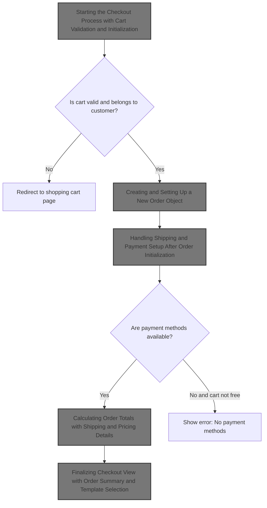
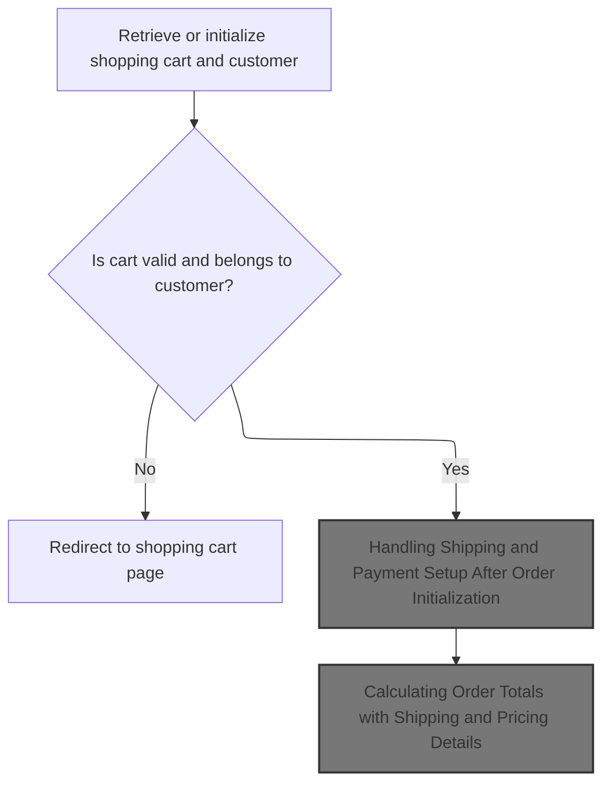
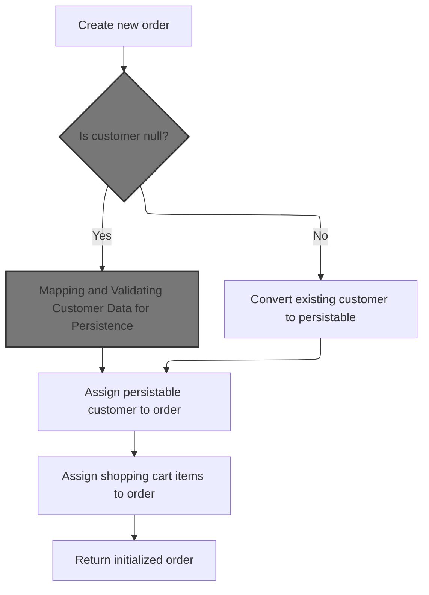

This document describes the flow of displaying the checkout page in the e-commerce platform. It involves validating the shopping cart and customer, initializing the order with customer and cart details, handling shipping and payment options, calculating the total order amount including shipping and taxes, and preparing the checkout view for the user to complete their purchase.



# Starting the Checkout Process with Cart Validation and Initialization



This section manages the start of the checkout process by validating the shopping cart and initializing the order with customer and store details.

| Category        | Rule Name                                 | Description                                                                                                                                                      |
| --------------- | ----------------------------------------- | ---------------------------------------------------------------------------------------------------------------------------------------------------------------- |
| Data validation | Cart Ownership Validation                 | The shopping cart must belong to the current customer to proceed with checkout. If the cart does not belong to the customer, redirect to the shopping cart page. |
| Data validation | Cart Existence Validation                 | If no valid shopping cart is found in the session or cookie, redirect the user to the shopping cart page to create or select a cart.                             |
| Data validation | Empty Cart Check                          | If the shopping cart has no items, redirect the user to the shopping cart page to add items before proceeding to checkout.                                       |
| Business logic  | Anonymous Customer Billing Initialization | For anonymous users, billing information is pre-filled from anonymous customer attributes if available to streamline checkout.                                   |
| Business logic  | Order Initialization                      | If no existing order is found in the session, a new order is initialized with the current store, customer, cart, and language details.                           |

<SwmSnippet path="/shopizer/sm-shop/src/main/java/com/salesmanager/web/shop/controller/order/ShoppingOrderController.java" line="136">

---

In <SwmToken path="shopizer/sm-shop/src/main/java/com/salesmanager/web/shop/controller/order/ShoppingOrderController.java" pos="136:5:5" line-data="	public String displayCheckout(@CookieValue(&quot;cart&quot;) String cookie, Model model, HttpServletRequest request, HttpServletResponse response, Locale locale) throws Exception {">`displayCheckout`</SwmToken>, we start by trying to get the shopping cart from the session or cookie, validating the cart belongs to the current store and customer. If no valid cart is found, it redirects to the cart page. For anonymous users, it fills billing info from an anonymous customer attribute. Then it initializes a new order if none exists, setting up the order with store, customer, cart, and language. We call <SwmToken path="shopizer/sm-shop/src/main/java/com/salesmanager/web/shop/controller/order/facade/OrderFacadeImpl.java" pos="87:4:4" line-data="public class OrderFacadeImpl implements OrderFacade {">`OrderFacadeImpl`</SwmToken> next to actually create and prepare this order object with detailed customer data and totals.

```java
	public String displayCheckout(@CookieValue("cart") String cookie, Model model, HttpServletRequest request, HttpServletResponse response, Locale locale) throws Exception {

		Language language = (Language)request.getAttribute("LANGUAGE");
		MerchantStore store = (MerchantStore)request.getAttribute(Constants.MERCHANT_STORE);
		Customer customer = (Customer)request.getSession().getAttribute(Constants.CUSTOMER);

		
		/**
		 * Shopping cart
		 * 
		 * ShoppingCart should be in the HttpSession
		 * Otherwise the cart id is in the cookie
		 * Otherwise the customer is in the session and a cart exist in the DB
		 * Else -> Nothing to display
		 */
		
		//check if an existing order exist
		ShopOrder order = null;
		order = super.getSessionAttribute(Constants.ORDER, request);
	
		//Get the cart from the DB
		String shoppingCartCode  = (String)request.getSession().getAttribute(Constants.SHOPPING_CART);
		com.salesmanager.core.business.shoppingcart.model.ShoppingCart cart = null;
	
	    if(StringUtils.isBlank(shoppingCartCode)) {
				
			if(cookie==null) {//session expired and cookie null, nothing to do
				return "redirect:/shop/cart/shoppingCart.html";
			}
			String merchantCookie[] = cookie.split("_");
			String merchantStoreCode = merchantCookie[0];
			if(!merchantStoreCode.equals(store.getCode())) {
				return "redirect:/shop/cart/shoppingCart.html";
			}
			shoppingCartCode = merchantCookie[1];
	    	
	    } 
	    
	    cart = shoppingCartFacade.getShoppingCartModel(shoppingCartCode, store);
	
	    if(cart==null && customer!=null) {
				cart=shoppingCartFacade.getShoppingCartModel(customer, store);
	    }
	    
	    super.setSessionAttribute(Constants.SHOPPING_CART, cart.getShoppingCartCode(), request);
	
	    if(shoppingCartCode==null && cart==null) {//error
				return "redirect:/shop/cart/shoppingCart.html";
	    }
			
	
	    if(customer!=null) {
			if(cart.getCustomerId()!=customer.getId().longValue()) {
					return "redirect:/shop/shoppingCart.html";
			}
	     } else {
				customer = orderFacade.initEmptyCustomer(store);
				AnonymousCustomer anonymousCustomer = (AnonymousCustomer)request.getAttribute(Constants.ANONYMOUS_CUSTOMER);
				if(anonymousCustomer!=null && anonymousCustomer.getBilling()!=null) {
					Billing billing = customer.getBilling();
					billing.setCity(anonymousCustomer.getBilling().getCity());
					Map<String,Country> countriesMap = countryService.getCountriesMap(language);
					Country anonymousCountry = countriesMap.get(anonymousCustomer.getBilling().getCountry());
					if(anonymousCountry!=null) {
						billing.setCountry(anonymousCountry);
					}
					Map<String,Zone> zonesMap = zoneService.getZones(language);
					Zone anonymousZone = zonesMap.get(anonymousCustomer.getBilling().getZone());
					if(anonymousZone!=null) {
						billing.setZone(anonymousZone);
					}
					if(anonymousCustomer.getBilling().getPostalCode()!=null) {
						billing.setPostalCode(anonymousCustomer.getBilling().getPostalCode());
					}
					customer.setBilling(billing);
				}
	     }
	
	     Set<ShoppingCartItem> items = cart.getLineItems();
	     if(CollectionUtils.isEmpty(items)) {
				return "redirect:/shop/shoppingCart.html";
	     }
		
	     if(order==null) {
			order = orderFacade.initializeOrder(store, customer, cart, language);
		  }

```

---

</SwmSnippet>

## Creating and Setting Up a New Order Object



This section describes the process of creating and setting up a new order object in the e-commerce platform, ensuring the order is properly initialized with customer and shopping cart data.

| Category       | Rule Name                            | Description                                                                                                                             |
| -------------- | ------------------------------------ | --------------------------------------------------------------------------------------------------------------------------------------- |
| Business logic | Initialize Empty Customer            | If the customer information is null, an empty customer object must be initialized to ensure the order has a valid customer reference.   |
| Business logic | Set Order Status to ORDERED          | The order status must be set to 'ORDERED' upon creation to reflect the current state of the order in the system.                        |
| Business logic | Convert Customer to Persistable Form | Customer data must be converted into a persistable form tailored to the specific store and language before being assigned to the order. |
| Business logic | Assign Shopping Cart Items to Order  | All items in the shopping cart must be assigned to the order to accurately reflect the customer's purchase.                             |

<SwmSnippet path="/shopizer/sm-shop/src/main/java/com/salesmanager/web/shop/controller/order/facade/OrderFacadeImpl.java" line="128">

---

In <SwmToken path="shopizer/sm-shop/src/main/java/com/salesmanager/web/shop/controller/order/facade/OrderFacadeImpl.java" pos="128:5:5" line-data="	public ShopOrder initializeOrder(MerchantStore store, Customer customer,">`initializeOrder`</SwmToken>, we create a new order, set its status to ORDERED, and make sure we have a customer object, initializing an empty one if needed. Then we convert that customer into a persistable form tailored to the store and language. We call <SwmToken path="shopizer/sm-shop/src/main/java/com/salesmanager/web/shop/controller/order/facade/OrderFacadeImpl.java" pos="142:3:3" line-data="		PersistableCustomer persistableCustomer = persistableCustomer(customer, store, language);">`persistableCustomer`</SwmToken> next to handle this conversion, which prepares the customer data for saving with the order.

```java
	public ShopOrder initializeOrder(MerchantStore store, Customer customer,
			ShoppingCart shoppingCart, Language language) throws Exception {

		//assert not null shopping cart items
		
		ShopOrder order = new ShopOrder();
		
		OrderStatus orderStatus = OrderStatus.ORDERED;
		order.setOrderStatus(orderStatus);
		
		if(customer==null) {
				customer = this.initEmptyCustomer(store);
		}
		
		PersistableCustomer persistableCustomer = persistableCustomer(customer, store, language);
```

---

</SwmSnippet>

### Converting Customer to Persistable Form

This section describes the process of converting a Customer object into a <SwmToken path="shopizer/sm-shop/src/main/java/com/salesmanager/web/shop/controller/order/facade/OrderFacadeImpl.java" pos="142:1:1" line-data="		PersistableCustomer persistableCustomer = persistableCustomer(customer, store, language);">`PersistableCustomer`</SwmToken> object, which is a format suitable for persistence in the system. This conversion is essential for saving customer data along with an order.

<SwmSnippet path="/shopizer/sm-shop/src/main/java/com/salesmanager/web/shop/controller/order/facade/OrderFacadeImpl.java" line="216">

---

In <SwmToken path="shopizer/sm-shop/src/main/java/com/salesmanager/web/shop/controller/order/facade/OrderFacadeImpl.java" pos="216:5:5" line-data="	private PersistableCustomer persistableCustomer(Customer customer, MerchantStore store, Language language) throws Exception {">`persistableCustomer`</SwmToken>, we use a populator to convert the Customer object into a <SwmToken path="shopizer/sm-shop/src/main/java/com/salesmanager/web/shop/controller/order/facade/OrderFacadeImpl.java" pos="216:3:3" line-data="	private PersistableCustomer persistableCustomer(Customer customer, MerchantStore store, Language language) throws Exception {">`PersistableCustomer`</SwmToken>, which is a format ready for persistence. This step prepares the customer data for saving with the order. We call <SwmToken path="shopizer/sm-shop/src/main/java/com/salesmanager/web/shop/controller/order/facade/OrderFacadeImpl.java" pos="74:12:12" line-data="import com.salesmanager.web.populator.customer.CustomerPopulator;">`CustomerPopulator`</SwmToken> next because it handles the detailed mapping and validation of customer fields.

```java
	private PersistableCustomer persistableCustomer(Customer customer, MerchantStore store, Language language) throws Exception {
		
		PersistableCustomerPopulator customerPopulator = new PersistableCustomerPopulator();
		PersistableCustomer persistableCustomer = customerPopulator.populate(customer, new PersistableCustomer(), store, language);
		return persistableCustomer;
		
	}
```

---

</SwmSnippet>

### Mapping and Validating Customer Data for Persistence

```mermaid
%%{init: {"flowchart": {"defaultRenderer": "elk"}} }%%
flowchart TD
    node1["Start populating customer"] --> node2{"Is source ID present and > 0?"}
    click node1 openCode "shopizer/sm-shop/src/main/java/com/salesmanager/web/populator/customer/CustomerPopulator.java:47:60"
    node2 -->|"Yes"| node3["Set customer ID"]
    click node2 openCode "shopizer/sm-shop/src/main/java/com/salesmanager/web/populator/customer/CustomerPopulator.java:58:60"
    node2 -->|"No"| node4
    click node3 openCode "shopizer/sm-shop/src/main/java/com/salesmanager/web/populator/customer/CustomerPopulator.java:59:60"
    node3 --> node5{"Is encoded password provided?"}
    click node4 openCode "shopizer/sm-shop/src/main/java/com/salesmanager/web/populator/customer/CustomerPopulator.java:61:63"
    node5 -->|"Yes"| node6["Set password and anonymous flag"]
    click node5 openCode "shopizer/sm-shop/src/main/java/com/salesmanager/web/populator/customer/CustomerPopulator.java:63:66"
    node5 -->|"No"| node7
    click node6 openCode "shopizer/sm-shop/src/main/java/com/salesmanager/web/populator/customer/CustomerPopulator.java:64:66"
    node6 --> node8["Set email and username"]
    click node7 openCode "shopizer/sm-shop/src/main/java/com/salesmanager/web/populator/customer/CustomerPopulator.java:67:70"
    node7 --> node8
    click node8 openCode "shopizer/sm-shop/src/main/java/com/salesmanager/web/populator/customer/CustomerPopulator.java:68:70"
    node8 --> node9{"Is gender provided and target gender null?"}
    click node9 openCode "shopizer/sm-shop/src/main/java/com/salesmanager/web/populator/customer/CustomerPopulator.java:70:73"
    node9 -->|"Yes"| node10["Set gender from source"]
    click node10 openCode "shopizer/sm-shop/src/main/java/com/salesmanager/web/populator/customer/CustomerPopulator.java:71:72"
    node9 -->|"No"| node11["Set default gender Male if target gender null"]
    click node11 openCode "shopizer/sm-shop/src/main/java/com/salesmanager/web/populator/customer/CustomerPopulator.java:73:75"
    node10 --> node12["Validate and set billing address"]
    click node12 openCode "shopizer/sm-shop/src/main/java/com/salesmanager/web/populator/customer/CustomerPopulator.java:77:111"
    node11 --> node12
    node12 --> node13["Validate and set delivery address"]
    click node13 openCode "shopizer/sm-shop/src/main/java/com/salesmanager/web/populator/customer/CustomerPopulator.java:125:156"
    node13 --> node14["Set merchant store"]
    click node14 openCode "shopizer/sm-shop/src/main/java/com/salesmanager/web/populator/customer/CustomerPopulator.java:79:80"
    node14 --> node15[subgraph loop1["For each customer attribute"]
        node15a["Validate customer option and value belong to store"]
        node15a --> node15b["Add attribute to customer"]
        node15b --> node15a
    end]
    click node15a openCode "shopizer/sm-shop/src/main/java/com/salesmanager/web/populator/customer/CustomerPopulator.java:172:200"
    node15b --> node16{"Is default language set?"}
    click node15b openCode "shopizer/sm-shop/src/main/java/com/salesmanager/web/populator/customer/CustomerPopulator.java:204:205"
    node16 -->|"No"| node17["Set default language from source or store"]
    click node17 openCode "shopizer/sm-shop/src/main/java/com/salesmanager/web/populator/customer/CustomerPopulator.java:205:211"
    node16 -->|"Yes"| node18["Return populated customer"]
    click node18 openCode "shopizer/sm-shop/src/main/java/com/salesmanager/web/populator/customer/CustomerPopulator.java:221:222"
    node17 --> node18
classDef HeadingStyle fill:#777777,stroke:#333,stroke-width:2px;

%% Swimm:
%% %%{init: {"flowchart": {"defaultRenderer": "elk"}} }%%
%% flowchart TD
%%     node1["Start populating customer"] --> node2{"Is source ID present and > 0?"}
%%     click node1 openCode "<SwmPath>[shopizer/…/customer/CustomerPopulator.java](shopizer/sm-shop/src/main/java/com/salesmanager/web/populator/customer/CustomerPopulator.java)</SwmPath>:47:60"
%%     node2 -->|"Yes"| node3["Set customer ID"]
%%     click node2 openCode "<SwmPath>[shopizer/…/customer/CustomerPopulator.java](shopizer/sm-shop/src/main/java/com/salesmanager/web/populator/customer/CustomerPopulator.java)</SwmPath>:58:60"
%%     node2 -->|"No"| node4
%%     click node3 openCode "<SwmPath>[shopizer/…/customer/CustomerPopulator.java](shopizer/sm-shop/src/main/java/com/salesmanager/web/populator/customer/CustomerPopulator.java)</SwmPath>:59:60"
%%     node3 --> node5{"Is encoded password provided?"}
%%     click node4 openCode "<SwmPath>[shopizer/…/customer/CustomerPopulator.java](shopizer/sm-shop/src/main/java/com/salesmanager/web/populator/customer/CustomerPopulator.java)</SwmPath>:61:63"
%%     node5 -->|"Yes"| node6["Set password and anonymous flag"]
%%     click node5 openCode "<SwmPath>[shopizer/…/customer/CustomerPopulator.java](shopizer/sm-shop/src/main/java/com/salesmanager/web/populator/customer/CustomerPopulator.java)</SwmPath>:63:66"
%%     node5 -->|"No"| node7
%%     click node6 openCode "<SwmPath>[shopizer/…/customer/CustomerPopulator.java](shopizer/sm-shop/src/main/java/com/salesmanager/web/populator/customer/CustomerPopulator.java)</SwmPath>:64:66"
%%     node6 --> node8["Set email and username"]
%%     click node7 openCode "<SwmPath>[shopizer/…/customer/CustomerPopulator.java](shopizer/sm-shop/src/main/java/com/salesmanager/web/populator/customer/CustomerPopulator.java)</SwmPath>:67:70"
%%     node7 --> node8
%%     click node8 openCode "<SwmPath>[shopizer/…/customer/CustomerPopulator.java](shopizer/sm-shop/src/main/java/com/salesmanager/web/populator/customer/CustomerPopulator.java)</SwmPath>:68:70"
%%     node8 --> node9{"Is gender provided and target gender null?"}
%%     click node9 openCode "<SwmPath>[shopizer/…/customer/CustomerPopulator.java](shopizer/sm-shop/src/main/java/com/salesmanager/web/populator/customer/CustomerPopulator.java)</SwmPath>:70:73"
%%     node9 -->|"Yes"| node10["Set gender from source"]
%%     click node10 openCode "<SwmPath>[shopizer/…/customer/CustomerPopulator.java](shopizer/sm-shop/src/main/java/com/salesmanager/web/populator/customer/CustomerPopulator.java)</SwmPath>:71:72"
%%     node9 -->|"No"| node11["Set default gender Male if target gender null"]
%%     click node11 openCode "<SwmPath>[shopizer/…/customer/CustomerPopulator.java](shopizer/sm-shop/src/main/java/com/salesmanager/web/populator/customer/CustomerPopulator.java)</SwmPath>:73:75"
%%     node10 --> node12["Validate and set billing address"]
%%     click node12 openCode "<SwmPath>[shopizer/…/customer/CustomerPopulator.java](shopizer/sm-shop/src/main/java/com/salesmanager/web/populator/customer/CustomerPopulator.java)</SwmPath>:77:111"
%%     node11 --> node12
%%     node12 --> node13["Validate and set delivery address"]
%%     click node13 openCode "<SwmPath>[shopizer/…/customer/CustomerPopulator.java](shopizer/sm-shop/src/main/java/com/salesmanager/web/populator/customer/CustomerPopulator.java)</SwmPath>:125:156"
%%     node13 --> node14["Set merchant store"]
%%     click node14 openCode "<SwmPath>[shopizer/…/customer/CustomerPopulator.java](shopizer/sm-shop/src/main/java/com/salesmanager/web/populator/customer/CustomerPopulator.java)</SwmPath>:79:80"
%%     node14 --> node15[subgraph loop1["For each customer attribute"]
%%         node15a["Validate customer option and value belong to store"]
%%         node15a --> node15b["Add attribute to customer"]
%%         node15b --> node15a
%%     end]
%%     click node15a openCode "<SwmPath>[shopizer/…/customer/CustomerPopulator.java](shopizer/sm-shop/src/main/java/com/salesmanager/web/populator/customer/CustomerPopulator.java)</SwmPath>:172:200"
%%     node15b --> node16{"Is default language set?"}
%%     click node15b openCode "<SwmPath>[shopizer/…/customer/CustomerPopulator.java](shopizer/sm-shop/src/main/java/com/salesmanager/web/populator/customer/CustomerPopulator.java)</SwmPath>:204:205"
%%     node16 -->|"No"| node17["Set default language from source or store"]
%%     click node17 openCode "<SwmPath>[shopizer/…/customer/CustomerPopulator.java](shopizer/sm-shop/src/main/java/com/salesmanager/web/populator/customer/CustomerPopulator.java)</SwmPath>:205:211"
%%     node16 -->|"Yes"| node18["Return populated customer"]
%%     click node18 openCode "<SwmPath>[shopizer/…/customer/CustomerPopulator.java](shopizer/sm-shop/src/main/java/com/salesmanager/web/populator/customer/CustomerPopulator.java)</SwmPath>:221:222"
%%     node17 --> node18
%% classDef HeadingStyle fill:#777777,stroke:#333,stroke-width:2px;
```

This section handles mapping and validating customer data for persistence, ensuring all customer-related information is accurate, consistent, and valid for the merchant store before saving.

| Category        | Rule Name                     | Description                                                                                                                                   |
| --------------- | ----------------------------- | --------------------------------------------------------------------------------------------------------------------------------------------- |
| Data validation | Country validation            | Billing and delivery country codes must be validated against the store's supported countries; unsupported codes cause an error.               |
| Data validation | Zone validation               | If a zone code is provided for billing or delivery, it must be validated against known zones; unsupported zones cause an error.               |
| Data validation | Customer attribute validation | Each customer attribute must have a valid customer option and option value that belong to the current store; invalid attributes cause errors. |
| Business logic  | Customer ID assignment        | If the source customer ID is present and greater than zero, it must be assigned to the target customer to maintain identity consistency.      |
| Business logic  | Password and anonymity        | If an encoded password is provided, it must be set on the customer and the customer must be marked as non-anonymous.                          |
| Business logic  | Email and username required   | Customer email address and username must be set from the source data to enable communication and login.                                       |
| Business logic  | Gender defaulting             | If gender is provided and target gender is null, set gender from source; otherwise, default gender to Male if target gender is null.          |
| Business logic  | Default billing and delivery  | If billing or delivery address is missing but source data exists, default values must be set with validated country information.              |
| Business logic  | Set default language          | If the customer's default language is not set, it must be assigned from the source language or fallback to the store's default language.      |

<SwmSnippet path="/shopizer/sm-shop/src/main/java/com/salesmanager/web/populator/customer/CustomerPopulator.java" line="47">

---

<SwmToken path="shopizer/sm-shop/src/main/java/com/salesmanager/web/populator/customer/CustomerPopulator.java" pos="47:5:5" line-data="	public Customer populate(PersistableCustomer source, Customer target,">`populate`</SwmToken> maps and validates customer data, ensuring countries, zones, and attributes are valid for the store. It sets defaults and throws errors on invalid data.

```java
	public Customer populate(PersistableCustomer source, Customer target,
			MerchantStore store, Language language) throws ConversionException {

		Validate.notNull(customerOptionService, "Requires to set CustomerOptionService");
		Validate.notNull(customerOptionValueService, "Requires to set CustomerOptionValueService");
		Validate.notNull(zoneService, "Requires to set ZoneService");
		Validate.notNull(countryService, "Requires to set CountryService");
		Validate.notNull(languageService, "Requires to set LanguageService");

		try {
			
			if(source.getId() !=null && source.getId()>0){
			    target.setId( source.getId() );
			}
		    
		    
		    if(!StringUtils.isBlank(source.getEncodedPassword())) {
				target.setPassword(source.getEncodedPassword());
				target.setAnonymous(false);
			}

			target.setEmailAddress(source.getEmailAddress());
			target.setNick(source.getUserName());
			if(source.getGender()!=null && target.getGender()==null) {
				target.setGender( com.salesmanager.core.business.customer.model.CustomerGender.valueOf( source.getGender() ) );
			}
			if(target.getGender()==null) {
				target.setGender( com.salesmanager.core.business.customer.model.CustomerGender.M);
			}

			Map<String,Country> countries = countryService.getCountriesMap(language);
			
			target.setMerchantStore( store );

			Address sourceBilling = source.getBilling();
			if(sourceBilling!=null) {
				Billing billing = new Billing();
				billing.setAddress(sourceBilling.getAddress());
				billing.setCity(sourceBilling.getCity());
				billing.setCompany(sourceBilling.getCompany());
				//billing.setCountry(country);
				billing.setFirstName(sourceBilling.getFirstName());
				billing.setLastName(sourceBilling.getLastName());
				billing.setTelephone(sourceBilling.getPhone());
				billing.setPostalCode(sourceBilling.getPostalCode());
				billing.setState(sourceBilling.getStateProvince());
				Country billingCountry = null;
				if(!StringUtils.isBlank(sourceBilling.getCountry())) {
					billingCountry = countries.get(sourceBilling.getCountry());
					if(billingCountry==null) {
						throw new ConversionException("Unsuported country code " + sourceBilling.getCountry());
					}
					billing.setCountry(billingCountry);
				}
				
				if(billingCountry!=null && !StringUtils.isBlank(sourceBilling.getZone())) {
					Zone zone = zoneService.getByCode(sourceBilling.getZone());
					if(zone==null) {
						throw new ConversionException("Unsuported zone code " + sourceBilling.getZone());
					}
					billing.setZone(zone);
				}
				target.setBilling(billing);

			}
			if(target.getBilling() ==null && source.getBilling()!=null){
			    LOG.info( "Setting default values for billing" );
			    Billing billing = new Billing();
			    Country billingCountry = null;
			    if(StringUtils.isNotBlank( source.getBilling().getCountry() )) {
                    billingCountry = countries.get(source.getBilling().getCountry());
                    if(billingCountry==null) {
                        throw new ConversionException("Unsuported country code " + sourceBilling.getCountry());
                    }
                    billing.setCountry(billingCountry);
                    target.setBilling( billing );
                }
			}
			Address sourceShipping = source.getDelivery();
			if(sourceShipping!=null) {
				Delivery delivery = new Delivery();
				delivery.setAddress(sourceShipping.getAddress());
				delivery.setCity(sourceShipping.getCity());
				delivery.setCompany(sourceShipping.getCompany());
				delivery.setFirstName(sourceShipping.getFirstName());
				delivery.setLastName(sourceShipping.getLastName());
				delivery.setTelephone(sourceShipping.getPhone());
				delivery.setPostalCode(sourceShipping.getPostalCode());
				delivery.setState(sourceShipping.getStateProvince());
				Country deliveryCountry = null;
				
				
				
				if(!StringUtils.isBlank(sourceShipping.getCountry())) {
					deliveryCountry = countries.get(sourceShipping.getCountry());
					if(deliveryCountry==null) {
						throw new ConversionException("Unsuported country code " + sourceShipping.getCountry());
					}
					delivery.setCountry(deliveryCountry);
				}
				
				if(deliveryCountry!=null && !StringUtils.isBlank(sourceShipping.getZone())) {
					Zone zone = zoneService.getByCode(sourceShipping.getZone());
					if(zone==null) {
						throw new ConversionException("Unsuported zone code " + sourceShipping.getZone());
					}
					delivery.setZone(zone);
				}
				target.setDelivery(delivery);
			}
			
			if(target.getDelivery() ==null && source.getDelivery()!=null){
			    LOG.info( "Setting default value for delivery" );
			    Delivery delivery = new Delivery();
			    Country deliveryCountry = null;
                if(StringUtils.isNotBlank( source.getDelivery().getCountry() )) {
                    deliveryCountry = countries.get(source.getDelivery().getCountry());
                    if(deliveryCountry==null) {
                        throw new ConversionException("Unsuported country code " + sourceShipping.getCountry());
                    }
                    delivery.setCountry(deliveryCountry);
                    target.setDelivery( delivery );
                }
			}
			
			if(source.getAttributes()!=null) {
				for(PersistableCustomerAttribute attr : source.getAttributes()) {

					CustomerOption customerOption = customerOptionService.getById(attr.getCustomerOption().getId());
					if(customerOption==null) {
						throw new ConversionException("Customer option id " + attr.getCustomerOption().getId() + " does not exist");
					}
					
					CustomerOptionValue customerOptionValue = customerOptionValueService.getById(attr.getCustomerOptionValue().getId());
					if(customerOptionValue==null) {
						throw new ConversionException("Customer option value id " + attr.getCustomerOptionValue().getId() + " does not exist");
					}
					
					if(customerOption.getMerchantStore().getId().intValue()!=store.getId().intValue()) {
						throw new ConversionException("Invalid customer option id ");
					}
					
					if(customerOptionValue.getMerchantStore().getId().intValue()!=store.getId().intValue()) {
						throw new ConversionException("Invalid customer option value id ");
					}
					
					CustomerAttribute attribute = new CustomerAttribute();
					attribute.setCustomer(target);
					attribute.setCustomerOption(customerOption);
					attribute.setCustomerOptionValue(customerOptionValue);
					attribute.setTextValue(attr.getTextValue());
					
					target.getAttributes().add(attribute);
					
				}
```

---

</SwmSnippet>

<SwmSnippet path="/shopizer/sm-shop/src/main/java/com/salesmanager/web/populator/customer/CustomerPopulator.java" line="204">

---

The populated Customer with validated data and default language is returned for order use.

```java
			if(target.getDefaultLanguage()==null) {
				Language lang = languageService.getByCode(source.getLanguage());
				if(lang==null) {
					lang = store.getDefaultLanguage();
				}
				
				target.setDefaultLanguage(lang);
			}

		
		} catch (Exception e) {
			throw new ConversionException(e);
		}
		
		
		
		
		return target;
	}
```

---

</SwmSnippet>

### Finalizing Order Setup with Customer and Cart Items

<SwmSnippet path="/shopizer/sm-shop/src/main/java/com/salesmanager/web/shop/controller/order/facade/OrderFacadeImpl.java" line="143">

---

After getting the persistable customer, we set it on the order, copy the cart items into the order for price calculations, and then return the fully prepared order object.

```java
		order.setCustomer(persistableCustomer);

		//keep list of shopping cart items for core price calculation
		List<ShoppingCartItem> items = new ArrayList<ShoppingCartItem>(shoppingCart.getLineItems());
		order.setShoppingCartItems(items);
		
		return order;
	}
```

---

</SwmSnippet>

## Handling Shipping and Payment Setup After Order Initialization

```mermaid
%%{init: {"flowchart": {"defaultRenderer": "elk"}} }%%
flowchart TD
    node1["Start checkout preparation"] --> node2{"Does cart require shipping?"}
    click node1 openCode "shopizer/sm-shop/src/main/java/com/salesmanager/web/shop/controller/order/ShoppingOrderController.java:223:224"
    node2 -->|"Yes"| node3["Get shipping quote"]
    click node2 openCode "shopizer/sm-shop/src/main/java/com/salesmanager/web/shop/controller/order/ShoppingOrderController.java:228:231"
    node3 --> node4{"Is shipping quote valid?"}
    click node3 openCode "shopizer/sm-shop/src/main/java/com/salesmanager/web/shop/controller/order/ShoppingOrderController.java:233:235"
    node4 -->|"Yes"| node5["Set shipping summary and options"]
    click node4 openCode "shopizer/sm-shop/src/main/java/com/salesmanager/web/shop/controller/order/ShoppingOrderController.java:237:249"
    node4 -->|"No"| node6["Show shipping error message"]
    click node6 openCode "shopizer/sm-shop/src/main/java/com/salesmanager/web/shop/controller/order/ShoppingOrderController.java:262:275"
    node2 -->|"No"| node7["Get all countries"]
    click node7 openCode "shopizer/sm-shop/src/main/java/com/salesmanager/web/shop/controller/order/ShoppingOrderController.java:257:259"
    node5 --> node8["Get shipping countries"]
    click node8 openCode "shopizer/sm-shop/src/main/java/com/salesmanager/web/shop/controller/order/ShoppingOrderController.java:254:256"
    node6 --> node8
    node7 --> node8
    node8 --> node9["Get accepted payment methods"]
    click node9 openCode "shopizer/sm-shop/src/main/java/com/salesmanager/web/shop/controller/order/ShoppingOrderController.java:279:279"
    node9 --> node10{"Are payment methods available?"}
    click node10 openCode "shopizer/sm-shop/src/main/java/com/salesmanager/web/shop/controller/order/ShoppingOrderController.java:282:282"
    node10 -->|"No and cart not free"| node11["Show error: No payment methods"]
    click node11 openCode "shopizer/sm-shop/src/main/java/com/salesmanager/web/shop/controller/order/ShoppingOrderController.java:283:285"
    node10 -->|"Yes"| node12["Select default payment method"]
    click node12 openCode "shopizer/sm-shop/src/main/java/com/salesmanager/web/shop/controller/order/ShoppingOrderController.java:288:294"
    subgraph loop1["For each payment method"]
        node12 --> node13{"Is payment method default?"}
        click node13 openCode "shopizer/sm-shop/src/main/java/com/salesmanager/web/shop/controller/order/ShoppingOrderController.java:289:293"
        node13 -->|"Yes"| node14["Set as default"]
        click node14 openCode "shopizer/sm-shop/src/main/java/com/salesmanager/web/shop/controller/order/ShoppingOrderController.java:291:292"
        node13 -->|"No"| node12
    end
    node12 --> node15{"Is default payment selected?"}
    click node15 openCode "shopizer/sm-shop/src/main/java/com/salesmanager/web/shop/controller/order/ShoppingOrderController.java:296:299"
    node15 -->|"No"| node16["Force select first payment method"]
    click node16 openCode "shopizer/sm-shop/src/main/java/com/salesmanager/web/shop/controller/order/ShoppingOrderController.java:296:299"
    node15 -->|"Yes"| node17["Prepare shopping cart data"]
    click node17 openCode "shopizer/sm-shop/src/main/java/com/salesmanager/web/shop/controller/order/ShoppingOrderController.java:305:306"
    node16 --> node17
    node17 --> node18["Calculate order total"]
    click node18 openCode "shopizer/sm-shop/src/main/java/com/salesmanager/web/shop/controller/order/ShoppingOrderController.java:310:311"
    node18 --> node19["Display checkout page"]
    click node19 openCode "shopizer/sm-shop/src/main/java/com/salesmanager/web/shop/controller/order/ShoppingOrderController.java:312:312"
classDef HeadingStyle fill:#777777,stroke:#333,stroke-width:2px;

%% Swimm:
%% %%{init: {"flowchart": {"defaultRenderer": "elk"}} }%%
%% flowchart TD
%%     node1["Start checkout preparation"] --> node2{"Does cart require shipping?"}
%%     click node1 openCode "<SwmPath>[shopizer/…/order/ShoppingOrderController.java](shopizer/sm-shop/src/main/java/com/salesmanager/web/shop/controller/order/ShoppingOrderController.java)</SwmPath>:223:224"
%%     node2 -->|"Yes"| node3["Get shipping quote"]
%%     click node2 openCode "<SwmPath>[shopizer/…/order/ShoppingOrderController.java](shopizer/sm-shop/src/main/java/com/salesmanager/web/shop/controller/order/ShoppingOrderController.java)</SwmPath>:228:231"
%%     node3 --> node4{"Is shipping quote valid?"}
%%     click node3 openCode "<SwmPath>[shopizer/…/order/ShoppingOrderController.java](shopizer/sm-shop/src/main/java/com/salesmanager/web/shop/controller/order/ShoppingOrderController.java)</SwmPath>:233:235"
%%     node4 -->|"Yes"| node5["Set shipping summary and options"]
%%     click node4 openCode "<SwmPath>[shopizer/…/order/ShoppingOrderController.java](shopizer/sm-shop/src/main/java/com/salesmanager/web/shop/controller/order/ShoppingOrderController.java)</SwmPath>:237:249"
%%     node4 -->|"No"| node6["Show shipping error message"]
%%     click node6 openCode "<SwmPath>[shopizer/…/order/ShoppingOrderController.java](shopizer/sm-shop/src/main/java/com/salesmanager/web/shop/controller/order/ShoppingOrderController.java)</SwmPath>:262:275"
%%     node2 -->|"No"| node7["Get all countries"]
%%     click node7 openCode "<SwmPath>[shopizer/…/order/ShoppingOrderController.java](shopizer/sm-shop/src/main/java/com/salesmanager/web/shop/controller/order/ShoppingOrderController.java)</SwmPath>:257:259"
%%     node5 --> node8["Get shipping countries"]
%%     click node8 openCode "<SwmPath>[shopizer/…/order/ShoppingOrderController.java](shopizer/sm-shop/src/main/java/com/salesmanager/web/shop/controller/order/ShoppingOrderController.java)</SwmPath>:254:256"
%%     node6 --> node8
%%     node7 --> node8
%%     node8 --> node9["Get accepted payment methods"]
%%     click node9 openCode "<SwmPath>[shopizer/…/order/ShoppingOrderController.java](shopizer/sm-shop/src/main/java/com/salesmanager/web/shop/controller/order/ShoppingOrderController.java)</SwmPath>:279:279"
%%     node9 --> node10{"Are payment methods available?"}
%%     click node10 openCode "<SwmPath>[shopizer/…/order/ShoppingOrderController.java](shopizer/sm-shop/src/main/java/com/salesmanager/web/shop/controller/order/ShoppingOrderController.java)</SwmPath>:282:282"
%%     node10 -->|"No and cart not free"| node11["Show error: No payment methods"]
%%     click node11 openCode "<SwmPath>[shopizer/…/order/ShoppingOrderController.java](shopizer/sm-shop/src/main/java/com/salesmanager/web/shop/controller/order/ShoppingOrderController.java)</SwmPath>:283:285"
%%     node10 -->|"Yes"| node12["Select default payment method"]
%%     click node12 openCode "<SwmPath>[shopizer/…/order/ShoppingOrderController.java](shopizer/sm-shop/src/main/java/com/salesmanager/web/shop/controller/order/ShoppingOrderController.java)</SwmPath>:288:294"
%%     subgraph loop1["For each payment method"]
%%         node12 --> node13{"Is payment method default?"}
%%         click node13 openCode "<SwmPath>[shopizer/…/order/ShoppingOrderController.java](shopizer/sm-shop/src/main/java/com/salesmanager/web/shop/controller/order/ShoppingOrderController.java)</SwmPath>:289:293"
%%         node13 -->|"Yes"| node14["Set as default"]
%%         click node14 openCode "<SwmPath>[shopizer/…/order/ShoppingOrderController.java](shopizer/sm-shop/src/main/java/com/salesmanager/web/shop/controller/order/ShoppingOrderController.java)</SwmPath>:291:292"
%%         node13 -->|"No"| node12
%%     end
%%     node12 --> node15{"Is default payment selected?"}
%%     click node15 openCode "<SwmPath>[shopizer/…/order/ShoppingOrderController.java](shopizer/sm-shop/src/main/java/com/salesmanager/web/shop/controller/order/ShoppingOrderController.java)</SwmPath>:296:299"
%%     node15 -->|"No"| node16["Force select first payment method"]
%%     click node16 openCode "<SwmPath>[shopizer/…/order/ShoppingOrderController.java](shopizer/sm-shop/src/main/java/com/salesmanager/web/shop/controller/order/ShoppingOrderController.java)</SwmPath>:296:299"
%%     node15 -->|"Yes"| node17["Prepare shopping cart data"]
%%     click node17 openCode "<SwmPath>[shopizer/…/order/ShoppingOrderController.java](shopizer/sm-shop/src/main/java/com/salesmanager/web/shop/controller/order/ShoppingOrderController.java)</SwmPath>:305:306"
%%     node16 --> node17
%%     node17 --> node18["Calculate order total"]
%%     click node18 openCode "<SwmPath>[shopizer/…/order/ShoppingOrderController.java](shopizer/sm-shop/src/main/java/com/salesmanager/web/shop/controller/order/ShoppingOrderController.java)</SwmPath>:310:311"
%%     node18 --> node19["Display checkout page"]
%%     click node19 openCode "<SwmPath>[shopizer/…/order/ShoppingOrderController.java](shopizer/sm-shop/src/main/java/com/salesmanager/web/shop/controller/order/ShoppingOrderController.java)</SwmPath>:312:312"
%% classDef HeadingStyle fill:#777777,stroke:#333,stroke-width:2px;
```



<SwmSnippet path="/shopizer/sm-shop/src/main/java/com/salesmanager/web/shop/controller/order/ShoppingOrderController.java" line="223">

---

After order init, we handle shipping quotes and errors, set shipping options, and select a default payment method to ensure checkout readiness.

```java
		boolean freeShoppingCart = shoppingCartService.isFreeShoppingCart(cart);
		boolean requiresShipping = shoppingCartService.requiresShipping(cart);
		
		/** shipping **/
		ShippingQuote quote = null;
		if(requiresShipping) {
			quote = orderFacade.getShippingQuote(customer, cart, order, store, language);
			model.addAttribute("shippingQuote", quote);
		}

		if(quote!=null) {

			if(StringUtils.isBlank(quote.getShippingReturnCode())) {
			
				if(order.getShippingSummary()==null) {
					ShippingSummary summary = orderFacade.getShippingSummary(quote, store, language);
					order.setShippingSummary(summary);
					request.getSession().setAttribute(Constants.SHIPPING_SUMMARY, summary);
				}
				if(order.getSelectedShippingOption()==null) {
					order.setSelectedShippingOption(quote.getSelectedShippingOption());
				}
				
				//save quotes in HttpSession
				List<ShippingOption> options = quote.getShippingOptions();
				request.getSession().setAttribute(Constants.SHIPPING_OPTIONS, options);
			
			}
			
			
			//get shipping countries
			List<Country> shippingCountriesList = orderFacade.getShipToCountry(store, language);
			model.addAttribute("countries", shippingCountriesList);
		} else {
			//get all countries
			List<Country> countries = countryService.getCountries(language);
			model.addAttribute("countries", countries);
		}
		
		if(quote!=null && quote.getShippingReturnCode()!=null && quote.getShippingReturnCode().equals(ShippingQuote.NO_SHIPPING_MODULE_CONFIGURED)) {
			LOGGER.error("Shipping quote error " + quote.getShippingReturnCode());
			model.addAttribute("errorMessages", quote.getShippingReturnCode());
		}
		
		if(quote!=null && !StringUtils.isBlank(quote.getQuoteError())) {
			LOGGER.error("Shipping quote error " + quote.getQuoteError());
			model.addAttribute("errorMessages", quote.getQuoteError());
		}
		
		if(quote!=null && quote.getShippingReturnCode()!=null && quote.getShippingReturnCode().equals(ShippingQuote.NO_SHIPPING_TO_SELECTED_COUNTRY)) {
			LOGGER.error("Shipping quote error " + quote.getShippingReturnCode());
			model.addAttribute("errorMessages", quote.getShippingReturnCode());
		}
		/** end shipping **/

		//get payment methods
		List<PaymentMethod> paymentMethods = paymentService.getAcceptedPaymentMethods(store);

		//not free and no payment methods
		if(CollectionUtils.isEmpty(paymentMethods) && !freeShoppingCart) {
			LOGGER.error("No payment method configured");
			model.addAttribute("errorMessages", "No payments configured");
		}
		
		if(!CollectionUtils.isEmpty(paymentMethods)) {//select default payment method
			PaymentMethod defaultPaymentSelected = null;
			for(PaymentMethod paymentMethod : paymentMethods) {
				if(paymentMethod.isDefaultSelected()) {
					defaultPaymentSelected = paymentMethod;
					break;
				}
			}
```

---

</SwmSnippet>

<SwmSnippet path="/shopizer/sm-shop/src/main/java/com/salesmanager/web/shop/controller/order/ShoppingOrderController.java" line="296">

---

We pick a default payment method if needed, prepare cart data, and call <SwmToken path="shopizer/sm-shop/src/main/java/com/salesmanager/web/shop/controller/order/ShoppingOrderController.java" pos="311:9:9" line-data="		OrderTotalSummary orderTotalSummary = orderFacade.calculateOrderTotal(store, order, language);">`calculateOrderTotal`</SwmToken> to get order totals.

```java
			if(defaultPaymentSelected==null) {//forced default selection
				defaultPaymentSelected = paymentMethods.get(0);
				defaultPaymentSelected.setDefaultSelected(true);
			}
			
			
		}
		
		//readable shopping cart items for order summary box
        ShoppingCartData shoppingCart = shoppingCartFacade.getShoppingCartData(cart);
        model.addAttribute( "cart", shoppingCart );
		


		//order total
		OrderTotalSummary orderTotalSummary = orderFacade.calculateOrderTotal(store, order, language);
```

---

</SwmSnippet>

## Calculating Order Totals with Shipping and Pricing Details

```mermaid
%%{init: {"flowchart": {"defaultRenderer": "elk"}} }%%
flowchart TD
    node1["Start order total calculation"] --> node2["Retrieve shopping cart model"]
    click node1 openCode "shopizer/sm-shop/src/main/java/com/salesmanager/web/shop/controller/order/ShoppingOrderController.java:836:840"
    click node2 openCode "shopizer/sm-shop/src/main/java/com/salesmanager/web/shop/controller/order/ShoppingOrderController.java:848:849"
    node2 --> node3["Populate readable order from order data"]
    click node3 openCode "shopizer/sm-shop/src/main/java/com/salesmanager/web/shop/controller/order/ShoppingOrderController.java:850:852"
    node3 --> node4{"Is shipping option selected?"}
    click node4 openCode "shopizer/sm-shop/src/main/java/com/salesmanager/web/shop/controller/order/ShoppingOrderController.java:853:854"
    node4 -->|"No"| node7["Calculate order total"]
    node4 -->|"Yes"| node5["Get shipping options from session"]
    click node5 openCode "shopizer/sm-shop/src/main/java/com/salesmanager/web/shop/controller/order/ShoppingOrderController.java:856:857"

    subgraph loop1["Find matching shipping option"]
        node5 --> node6{"Does option ID match selected option ID?"}
        click node6 openCode "shopizer/sm-shop/src/main/java/com/salesmanager/web/shop/controller/order/ShoppingOrderController.java:877:880"
        node6 -->|"Yes"| node8["Set selected shipping option"]
        node6 -->|"No"| node17["Check next option or fallback"]
        click node17 openCode "shopizer/sm-shop/src/main/java/com/salesmanager/web/shop/controller/order/ShoppingOrderController.java:883:885"
        node17 --> node6
    end

    node8 --> node9["Set shipping summary and readable shipping summary"]
    click node8 openCode "shopizer/sm-shop/src/main/java/com/salesmanager/web/shop/controller/order/ShoppingOrderController.java:888:899"
    node9 --> node7
    click node9 openCode "shopizer/sm-shop/src/main/java/com/salesmanager/web/shop/controller/order/ShoppingOrderController.java:900:900"
    node7 --> node10["Set order shopping cart items"]
    click node7 openCode "shopizer/sm-shop/src/main/java/com/salesmanager/web/shop/controller/order/ShoppingOrderController.java:903:905"
    node10 --> node11["Calculate order total summary"]
    click node10 openCode "shopizer/sm-shop/src/main/java/com/salesmanager/web/shop/controller/order/ShoppingOrderController.java:906:906"
    node11 --> node12["Store order summary in session"]
    click node11 openCode "shopizer/sm-shop/src/main/java/com/salesmanager/web/shop/controller/order/ShoppingOrderController.java:907:907"
    node12 --> node13["Populate readable order totals"]
    click node12 openCode "shopizer/sm-shop/src/main/java/com/salesmanager/web/shop/controller/order/ShoppingOrderController.java:910:924"

    subgraph loop2["Process each order total"]
        node13 --> node14{"Is order total code order.total.total?"}
        click node14 openCode "shopizer/sm-shop/src/main/java/com/salesmanager/web/shop/controller/order/ShoppingOrderController.java:916:920"
        node14 -->|"No"| node15["Add to subtotals"]
        click node15 openCode "shopizer/sm-shop/src/main/java/com/salesmanager/web/shop/controller/order/ShoppingOrderController.java:917:919"
        node14 -->|"Yes"| node16["Set grand total"]
        click node16 openCode "shopizer/sm-shop/src/main/java/com/salesmanager/web/shop/controller/order/ShoppingOrderController.java:921:923"
        node15 --> node13
    end

    node13 --> node18["Return readable order"]
    click node18 openCode "shopizer/sm-shop/src/main/java/com/salesmanager/web/shop/controller/order/ShoppingOrderController.java:935:936"
classDef HeadingStyle fill:#777777,stroke:#333,stroke-width:2px;

%% Swimm:
%% %%{init: {"flowchart": {"defaultRenderer": "elk"}} }%%
%% flowchart TD
%%     node1["Start order total calculation"] --> node2["Retrieve shopping cart model"]
%%     click node1 openCode "<SwmPath>[shopizer/…/order/ShoppingOrderController.java](shopizer/sm-shop/src/main/java/com/salesmanager/web/shop/controller/order/ShoppingOrderController.java)</SwmPath>:836:840"
%%     click node2 openCode "<SwmPath>[shopizer/…/order/ShoppingOrderController.java](shopizer/sm-shop/src/main/java/com/salesmanager/web/shop/controller/order/ShoppingOrderController.java)</SwmPath>:848:849"
%%     node2 --> node3["Populate readable order from order data"]
%%     click node3 openCode "<SwmPath>[shopizer/…/order/ShoppingOrderController.java](shopizer/sm-shop/src/main/java/com/salesmanager/web/shop/controller/order/ShoppingOrderController.java)</SwmPath>:850:852"
%%     node3 --> node4{"Is shipping option selected?"}
%%     click node4 openCode "<SwmPath>[shopizer/…/order/ShoppingOrderController.java](shopizer/sm-shop/src/main/java/com/salesmanager/web/shop/controller/order/ShoppingOrderController.java)</SwmPath>:853:854"
%%     node4 -->|"No"| node7["Calculate order total"]
%%     node4 -->|"Yes"| node5["Get shipping options from session"]
%%     click node5 openCode "<SwmPath>[shopizer/…/order/ShoppingOrderController.java](shopizer/sm-shop/src/main/java/com/salesmanager/web/shop/controller/order/ShoppingOrderController.java)</SwmPath>:856:857"
%% 
%%     subgraph loop1["Find matching shipping option"]
%%         node5 --> node6{"Does option ID match selected option ID?"}
%%         click node6 openCode "<SwmPath>[shopizer/…/order/ShoppingOrderController.java](shopizer/sm-shop/src/main/java/com/salesmanager/web/shop/controller/order/ShoppingOrderController.java)</SwmPath>:877:880"
%%         node6 -->|"Yes"| node8["Set selected shipping option"]
%%         node6 -->|"No"| node17["Check next option or fallback"]
%%         click node17 openCode "<SwmPath>[shopizer/…/order/ShoppingOrderController.java](shopizer/sm-shop/src/main/java/com/salesmanager/web/shop/controller/order/ShoppingOrderController.java)</SwmPath>:883:885"
%%         node17 --> node6
%%     end
%% 
%%     node8 --> node9["Set shipping summary and readable shipping summary"]
%%     click node8 openCode "<SwmPath>[shopizer/…/order/ShoppingOrderController.java](shopizer/sm-shop/src/main/java/com/salesmanager/web/shop/controller/order/ShoppingOrderController.java)</SwmPath>:888:899"
%%     node9 --> node7
%%     click node9 openCode "<SwmPath>[shopizer/…/order/ShoppingOrderController.java](shopizer/sm-shop/src/main/java/com/salesmanager/web/shop/controller/order/ShoppingOrderController.java)</SwmPath>:900:900"
%%     node7 --> node10["Set order shopping cart items"]
%%     click node7 openCode "<SwmPath>[shopizer/…/order/ShoppingOrderController.java](shopizer/sm-shop/src/main/java/com/salesmanager/web/shop/controller/order/ShoppingOrderController.java)</SwmPath>:903:905"
%%     node10 --> node11["Calculate order total summary"]
%%     click node10 openCode "<SwmPath>[shopizer/…/order/ShoppingOrderController.java](shopizer/sm-shop/src/main/java/com/salesmanager/web/shop/controller/order/ShoppingOrderController.java)</SwmPath>:906:906"
%%     node11 --> node12["Store order summary in session"]
%%     click node11 openCode "<SwmPath>[shopizer/…/order/ShoppingOrderController.java](shopizer/sm-shop/src/main/java/com/salesmanager/web/shop/controller/order/ShoppingOrderController.java)</SwmPath>:907:907"
%%     node12 --> node13["Populate readable order totals"]
%%     click node12 openCode "<SwmPath>[shopizer/…/order/ShoppingOrderController.java](shopizer/sm-shop/src/main/java/com/salesmanager/web/shop/controller/order/ShoppingOrderController.java)</SwmPath>:910:924"
%% 
%%     subgraph loop2["Process each order total"]
%%         node13 --> node14{"Is order total code <SwmToken path="shopizer/sm-shop/src/main/java/com/salesmanager/web/shop/controller/order/ShoppingOrderController.java" pos="916:13:17" line-data="				if(!total.getOrderTotalCode().equals(&quot;order.total.total&quot;)) {">`order.total.total`</SwmToken>?"}
%%         click node14 openCode "<SwmPath>[shopizer/…/order/ShoppingOrderController.java](shopizer/sm-shop/src/main/java/com/salesmanager/web/shop/controller/order/ShoppingOrderController.java)</SwmPath>:916:920"
%%         node14 -->|"No"| node15["Add to subtotals"]
%%         click node15 openCode "<SwmPath>[shopizer/…/order/ShoppingOrderController.java](shopizer/sm-shop/src/main/java/com/salesmanager/web/shop/controller/order/ShoppingOrderController.java)</SwmPath>:917:919"
%%         node14 -->|"Yes"| node16["Set grand total"]
%%         click node16 openCode "<SwmPath>[shopizer/…/order/ShoppingOrderController.java](shopizer/sm-shop/src/main/java/com/salesmanager/web/shop/controller/order/ShoppingOrderController.java)</SwmPath>:921:923"
%%         node15 --> node13
%%     end
%% 
%%     node13 --> node18["Return readable order"]
%%     click node18 openCode "<SwmPath>[shopizer/…/order/ShoppingOrderController.java](shopizer/sm-shop/src/main/java/com/salesmanager/web/shop/controller/order/ShoppingOrderController.java)</SwmPath>:935:936"
%% classDef HeadingStyle fill:#777777,stroke:#333,stroke-width:2px;
```



This section handles the calculation of the total order amount including shipping options and pricing details, ensuring the order summary is accurate and ready for checkout.

| Category       | Rule Name                        | Description                                                                                                                                              |
| -------------- | -------------------------------- | -------------------------------------------------------------------------------------------------------------------------------------------------------- |
| Business logic | Include selected shipping cost   | The order total must include the cost of the selected shipping option if one is chosen by the user.                                                      |
| Business logic | Default shipping option fallback | If no shipping option is selected or the selected option is not found, the system defaults to the first available shipping option for total calculation. |
| Business logic | Aggregate order totals           | The order total calculation must aggregate all item prices, taxes, and shipping costs to produce a grand total.                                          |
| Business logic | Readable order totals            | The order totals must be presented in a readable format, separating subtotals and grand total for user clarity.                                          |
| Technical step | Persist order summary in session | The system must store the calculated order total summary in the user session for consistency across the checkout process.                                |

<SwmSnippet path="/shopizer/sm-shop/src/main/java/com/salesmanager/web/shop/controller/order/ShoppingOrderController.java" line="836">

---

In <SwmToken path="shopizer/sm-shop/src/main/java/com/salesmanager/web/shop/controller/order/ShoppingOrderController.java" pos="836:8:8" line-data="	public @ResponseBody ReadableShopOrder calculateOrderTotal(@ModelAttribute(value=&quot;order&quot;) ShopOrder order, HttpServletRequest request, HttpServletResponse response, Locale locale) throws Exception {">`calculateOrderTotal`</SwmToken>, we get the cart code and regenerate the cart to reflect current items. We populate a readable order object and integrate shipping summary and options from the session for accurate total calculation.

```java
	public @ResponseBody ReadableShopOrder calculateOrderTotal(@ModelAttribute(value="order") ShopOrder order, HttpServletRequest request, HttpServletResponse response, Locale locale) throws Exception {
		
		Language language = (Language)request.getAttribute("LANGUAGE");
		MerchantStore store = (MerchantStore)request.getAttribute(Constants.MERCHANT_STORE);
		String shoppingCartCode  = getSessionAttribute(Constants.SHOPPING_CART, request);
		
		Validate.notNull(shoppingCartCode,"shoppingCartCode does not exist in the session");
		
		ReadableShopOrder readableOrder = new ReadableShopOrder();
		try {

			//re-generate cart
			com.salesmanager.core.business.shoppingcart.model.ShoppingCart cart = shoppingCartFacade.getShoppingCartModel(shoppingCartCode, store);

			ReadableShopOrderPopulator populator = new ReadableShopOrderPopulator();
			populator.populate(order, readableOrder, store, language);

			if(order.getSelectedShippingOption()!=null) {
						ShippingSummary summary = (ShippingSummary)request.getSession().getAttribute(Constants.SHIPPING_SUMMARY);
						@SuppressWarnings("unchecked")
						List<ShippingOption> options = (List<ShippingOption>)request.getSession().getAttribute(Constants.SHIPPING_OPTIONS);
						
						
						order.setShippingSummary(summary);//for total calculation
						
						
						ReadableShippingSummary readableSummary = new ReadableShippingSummary();
						ReadableShippingSummaryPopulator readableSummaryPopulator = new ReadableShippingSummaryPopulator();
						readableSummaryPopulator.setPricingService(pricingService);
						readableSummaryPopulator.populate(summary, readableSummary, store, language);
						
						
						if(!CollectionUtils.isEmpty(options)) {
						
							//get submitted shipping option
							ShippingOption quoteOption = null;
							ShippingOption selectedOption = order.getSelectedShippingOption();

							
							
							//check if selectedOption exist
							for(ShippingOption shipOption : options) {
								if(!StringUtils.isBlank(shipOption.getOptionId()) && shipOption.getOptionId().equals(selectedOption.getOptionId())) {
									quoteOption = shipOption;
								}
							}
```

---

</SwmSnippet>

<SwmSnippet path="/shopizer/sm-shop/src/main/java/com/salesmanager/web/shop/controller/order/ShoppingOrderController.java" line="883">

---

This section picks the shipping option matching the user's selection or defaults to the first. It updates the order with shipping details and calls OrderFacadeImpl.calculateOrderTotal to compute the full order total including shipping.

```java
							if(quoteOption==null) {
								quoteOption = options.get(0);
							}
							
							
							readableSummary.setSelectedShippingOption(quoteOption);
							readableSummary.setShippingOptions(options);
							

							summary.setShippingOption(quoteOption.getOptionId());
							summary.setShipping(quoteOption.getOptionPrice());
						
						}

						
						readableOrder.setShippingSummary(readableSummary);

			}
			
			//set list of shopping cart items for core price calculation
			List<ShoppingCartItem> items = new ArrayList<ShoppingCartItem>(cart.getLineItems());
			order.setShoppingCartItems(items);
			
			OrderTotalSummary orderTotalSummary = orderFacade.calculateOrderTotal(store, order, language);
```

---

</SwmSnippet>

<SwmSnippet path="/shopizer/sm-shop/src/main/java/com/salesmanager/web/shop/controller/order/facade/OrderFacadeImpl.java" line="155">

---

In <SwmToken path="shopizer/sm-shop/src/main/java/com/salesmanager/web/shop/controller/order/facade/OrderFacadeImpl.java" pos="155:5:5" line-data="	public OrderTotalSummary calculateOrderTotal(MerchantStore store,">`calculateOrderTotal`</SwmToken>, we get the full customer model, calculate the order total summary including prices and taxes, update the order with these totals, and return the summary.

```java
	public OrderTotalSummary calculateOrderTotal(MerchantStore store,
			ShopOrder order, Language language) throws Exception {
		

		Customer customer = customerFacade.getCustomerModel(order.getCustomer(), store, language);
		OrderTotalSummary summary = this.calculateOrderTotal(store, customer, order, language);
		this.setOrderTotals(order, summary);
		return summary;
	}
```

---

</SwmSnippet>

<SwmSnippet path="/shopizer/sm-shop/src/main/java/com/salesmanager/web/shop/controller/order/ShoppingOrderController.java" line="907">

---

After getting the order total summary, we save it in the session, convert totals into readable objects for the UI, handle errors by logging and setting error messages, and return the readable order.

```java
			super.setSessionAttribute(Constants.ORDER_SUMMARY, orderTotalSummary, request);
			
			
			ReadableOrderTotalPopulator totalPopulator = new ReadableOrderTotalPopulator();
			totalPopulator.setMessages(messages);
			totalPopulator.setPricingService(pricingService);

			List<ReadableOrderTotal> subtotals = new ArrayList<ReadableOrderTotal>();
			for(OrderTotal total : orderTotalSummary.getTotals()) {
				if(!total.getOrderTotalCode().equals("order.total.total")) {
					ReadableOrderTotal t = new ReadableOrderTotal();
					totalPopulator.populate(total, t, store, language);
					subtotals.add(t);
				} else {//grand total
					ReadableOrderTotal ot = new ReadableOrderTotal();
					totalPopulator.populate(total, ot, store, language);
					readableOrder.setGrandTotal(ot.getTotal());
				}
			}
```

---

</SwmSnippet>

<SwmSnippet path="/shopizer/sm-shop/src/main/java/com/salesmanager/web/shop/controller/order/ShoppingOrderController.java" line="928">

---

The function returns a <SwmToken path="shopizer/sm-shop/src/main/java/com/salesmanager/web/shop/controller/order/ShoppingOrderController.java" pos="836:6:6" line-data="	public @ResponseBody ReadableShopOrder calculateOrderTotal(@ModelAttribute(value=&quot;order&quot;) ShopOrder order, HttpServletRequest request, HttpServletResponse response, Locale locale) throws Exception {">`ReadableShopOrder`</SwmToken> with all calculated totals and any error messages for the checkout page.

```java
			readableOrder.setSubTotals(subtotals);
		
		} catch(Exception e) {
			LOGGER.error("Error while getting shipping quotes",e);
			readableOrder.setErrorMessage(messages.getMessage("message.error", locale));
		}
		
		return readableOrder;
	}
```

---

</SwmSnippet>

## Finalizing Checkout View with Order Summary and Template Selection

<SwmSnippet path="/shopizer/sm-shop/src/main/java/com/salesmanager/web/shop/controller/order/ShoppingOrderController.java" line="312">

---

After calculating totals, we set the summary on the order, save it in the session, add order and payment methods to the model, and build the view template name based on the store's template for rendering.

```java
		order.setOrderTotalSummary(orderTotalSummary);
		//if order summary has to be re-used
		super.setSessionAttribute(Constants.ORDER_SUMMARY, orderTotalSummary, request);

		model.addAttribute("order",order);
		model.addAttribute("paymentMethods", paymentMethods);
		
		/** template **/
		StringBuilder template = new StringBuilder().append(ControllerConstants.Tiles.Checkout.checkout).append(".").append(store.getStoreTemplate());
		return template.toString();

		
	}
```

---

</SwmSnippet>

&nbsp;

*This is an auto-generated document by Swimm 🌊 and has not yet been verified by a human*

<SwmMeta version="3.0.0" repo-id="Z2l0aHViJTNBJTNBU2hvcGl6ZXIlM0ElM0F1bWFsaW5nYXN3YW1p" repo-name="Shopizer"><sup>Powered by [Swimm](https://app.swimm.io/)</sup></SwmMeta>
