This document outlines the flow for preparing and displaying the checkout page. When a user requests the checkout, the system gathers cart and customer information, validates the cart, determines shipping and payment options, and calculates order totals. The checkout page is then rendered with all necessary details for the user to complete their purchase.

# Checkout Request: Cart, Customer, and Shipping Setup

<SwmSnippet path="/shopizer/sm-shop/src/main/java/com/salesmanager/web/shop/controller/order/ShoppingOrderController.java" line="136">

---

In <SwmToken path="shopizer/sm-shop/src/main/java/com/salesmanager/web/shop/controller/order/ShoppingOrderController.java" pos="136:5:5" line-data="	public String displayCheckout(@CookieValue(&quot;cart&quot;) String cookie, Model model, HttpServletRequest request, HttpServletResponse response, Locale locale) throws Exception {">`displayCheckout`</SwmToken>, we kick off by trying to find the user's shopping cart—first from the session, then from a cookie, and finally from the DB if the user is logged in. If we can't find a valid cart, or if the cart doesn't belong to the current customer, we redirect to the cart page. For anonymous users, we build a temporary customer object and fill in billing info from the request if available. If there's no order in the session, we initialize one. We then check if shipping is needed, fetch shipping quotes if required, and handle any errors. Finally, we grab available payment methods and pick a default if needed. If anything critical is missing (cart, payment, etc.), we bail out early with a redirect or error.

```java
	public String displayCheckout(@CookieValue("cart") String cookie, Model model, HttpServletRequest request, HttpServletResponse response, Locale locale) throws Exception {

		Language language = (Language)request.getAttribute("LANGUAGE");
		MerchantStore store = (MerchantStore)request.getAttribute(Constants.MERCHANT_STORE);
		Customer customer = (Customer)request.getSession().getAttribute(Constants.CUSTOMER);

		
		/**
		 * Shopping cart
		 * 
		 * ShoppingCart should be in the HttpSession
		 * Otherwise the cart id is in the cookie
		 * Otherwise the customer is in the session and a cart exist in the DB
		 * Else -> Nothing to display
		 */
		
		//check if an existing order exist
		ShopOrder order = null;
		order = super.getSessionAttribute(Constants.ORDER, request);
	
		//Get the cart from the DB
		String shoppingCartCode  = (String)request.getSession().getAttribute(Constants.SHOPPING_CART);
		com.salesmanager.core.business.shoppingcart.model.ShoppingCart cart = null;
	
	    if(StringUtils.isBlank(shoppingCartCode)) {
				
			if(cookie==null) {//session expired and cookie null, nothing to do
				return "redirect:/shop/cart/shoppingCart.html";
			}
			String merchantCookie[] = cookie.split("_");
			String merchantStoreCode = merchantCookie[0];
			if(!merchantStoreCode.equals(store.getCode())) {
				return "redirect:/shop/cart/shoppingCart.html";
			}
			shoppingCartCode = merchantCookie[1];
	    	
	    } 
	    
	    cart = shoppingCartFacade.getShoppingCartModel(shoppingCartCode, store);
	
	    if(cart==null && customer!=null) {
				cart=shoppingCartFacade.getShoppingCartModel(customer, store);
	    }
	    
	    super.setSessionAttribute(Constants.SHOPPING_CART, cart.getShoppingCartCode(), request);
	
	    if(shoppingCartCode==null && cart==null) {//error
				return "redirect:/shop/cart/shoppingCart.html";
	    }
			
	
	    if(customer!=null) {
			if(cart.getCustomerId()!=customer.getId().longValue()) {
					return "redirect:/shop/shoppingCart.html";
			}
	     } else {
				customer = orderFacade.initEmptyCustomer(store);
				AnonymousCustomer anonymousCustomer = (AnonymousCustomer)request.getAttribute(Constants.ANONYMOUS_CUSTOMER);
				if(anonymousCustomer!=null && anonymousCustomer.getBilling()!=null) {
					Billing billing = customer.getBilling();
					billing.setCity(anonymousCustomer.getBilling().getCity());
					Map<String,Country> countriesMap = countryService.getCountriesMap(language);
					Country anonymousCountry = countriesMap.get(anonymousCustomer.getBilling().getCountry());
					if(anonymousCountry!=null) {
						billing.setCountry(anonymousCountry);
					}
					Map<String,Zone> zonesMap = zoneService.getZones(language);
					Zone anonymousZone = zonesMap.get(anonymousCustomer.getBilling().getZone());
					if(anonymousZone!=null) {
						billing.setZone(anonymousZone);
					}
					if(anonymousCustomer.getBilling().getPostalCode()!=null) {
						billing.setPostalCode(anonymousCustomer.getBilling().getPostalCode());
					}
					customer.setBilling(billing);
				}
	     }
	
	     Set<ShoppingCartItem> items = cart.getLineItems();
	     if(CollectionUtils.isEmpty(items)) {
				return "redirect:/shop/shoppingCart.html";
	     }
		
	     if(order==null) {
			order = orderFacade.initializeOrder(store, customer, cart, language);
		  }

		boolean freeShoppingCart = shoppingCartService.isFreeShoppingCart(cart);
		boolean requiresShipping = shoppingCartService.requiresShipping(cart);
		
		/** shipping **/
		ShippingQuote quote = null;
		if(requiresShipping) {
			quote = orderFacade.getShippingQuote(customer, cart, order, store, language);
			model.addAttribute("shippingQuote", quote);
		}

		if(quote!=null) {

			if(StringUtils.isBlank(quote.getShippingReturnCode())) {
			
				if(order.getShippingSummary()==null) {
					ShippingSummary summary = orderFacade.getShippingSummary(quote, store, language);
					order.setShippingSummary(summary);
					request.getSession().setAttribute(Constants.SHIPPING_SUMMARY, summary);
				}
				if(order.getSelectedShippingOption()==null) {
					order.setSelectedShippingOption(quote.getSelectedShippingOption());
				}
				
				//save quotes in HttpSession
				List<ShippingOption> options = quote.getShippingOptions();
				request.getSession().setAttribute(Constants.SHIPPING_OPTIONS, options);
			
			}
			
			
			//get shipping countries
			List<Country> shippingCountriesList = orderFacade.getShipToCountry(store, language);
			model.addAttribute("countries", shippingCountriesList);
		} else {
			//get all countries
			List<Country> countries = countryService.getCountries(language);
			model.addAttribute("countries", countries);
		}
		
		if(quote!=null && quote.getShippingReturnCode()!=null && quote.getShippingReturnCode().equals(ShippingQuote.NO_SHIPPING_MODULE_CONFIGURED)) {
			LOGGER.error("Shipping quote error " + quote.getShippingReturnCode());
			model.addAttribute("errorMessages", quote.getShippingReturnCode());
		}
		
		if(quote!=null && !StringUtils.isBlank(quote.getQuoteError())) {
			LOGGER.error("Shipping quote error " + quote.getQuoteError());
			model.addAttribute("errorMessages", quote.getQuoteError());
		}
		
		if(quote!=null && quote.getShippingReturnCode()!=null && quote.getShippingReturnCode().equals(ShippingQuote.NO_SHIPPING_TO_SELECTED_COUNTRY)) {
			LOGGER.error("Shipping quote error " + quote.getShippingReturnCode());
			model.addAttribute("errorMessages", quote.getShippingReturnCode());
		}
		/** end shipping **/

		//get payment methods
		List<PaymentMethod> paymentMethods = paymentService.getAcceptedPaymentMethods(store);

		//not free and no payment methods
		if(CollectionUtils.isEmpty(paymentMethods) && !freeShoppingCart) {
			LOGGER.error("No payment method configured");
			model.addAttribute("errorMessages", "No payments configured");
		}
		
		if(!CollectionUtils.isEmpty(paymentMethods)) {//select default payment method
			PaymentMethod defaultPaymentSelected = null;
			for(PaymentMethod paymentMethod : paymentMethods) {
				if(paymentMethod.isDefaultSelected()) {
					defaultPaymentSelected = paymentMethod;
					break;
				}
			}
```

---

</SwmSnippet>

<SwmSnippet path="/shopizer/sm-shop/src/main/java/com/salesmanager/web/shop/controller/order/ShoppingOrderController.java" line="296">

---

We pick a payment method, prep the cart for display, and call <SwmToken path="shopizer/sm-shop/src/main/java/com/salesmanager/web/shop/controller/order/ShoppingOrderController.java" pos="311:9:9" line-data="		OrderTotalSummary orderTotalSummary = orderFacade.calculateOrderTotal(store, order, language);">`calculateOrderTotal`</SwmToken> to get the latest totals for the checkout UI.

```java
			if(defaultPaymentSelected==null) {//forced default selection
				defaultPaymentSelected = paymentMethods.get(0);
				defaultPaymentSelected.setDefaultSelected(true);
			}
			
			
		}
		
		//readable shopping cart items for order summary box
        ShoppingCartData shoppingCart = shoppingCartFacade.getShoppingCartData(cart);
        model.addAttribute( "cart", shoppingCart );
		


		//order total
		OrderTotalSummary orderTotalSummary = orderFacade.calculateOrderTotal(store, order, language);
```

---

</SwmSnippet>

## Order Total Calculation and DTO Mapping

```mermaid
%%{init: {"flowchart": {"defaultRenderer": "elk"}} }%%
flowchart TD
    node1["Start: Receive order and retrieve cart"] --> node2{"Is a shipping option selected?"}
    click node1 openCode "shopizer/sm-shop/src/main/java/com/salesmanager/web/shop/controller/order/ShoppingOrderController.java:836:848"
    node2 -->|"Yes"| node3["Retrieve and set shipping option"]
    click node2 openCode "shopizer/sm-shop/src/main/java/com/salesmanager/web/shop/controller/order/ShoppingOrderController.java:853:900"
    node2 -->|"No"| node4["Continue without shipping option"]
    click node4 openCode "shopizer/sm-shop/src/main/java/com/salesmanager/web/shop/controller/order/ShoppingOrderController.java:900:903"
    node3 --> node5["Set shopping cart items for order"]
    click node3 openCode "shopizer/sm-shop/src/main/java/com/salesmanager/web/shop/controller/order/ShoppingOrderController.java:853:900"
    node4 --> node5
    click node5 openCode "shopizer/sm-shop/src/main/java/com/salesmanager/web/shop/controller/order/ShoppingOrderController.java:903:904"
    node5 --> node6["Calculate order totals"]
    click node6 openCode "shopizer/sm-shop/src/main/java/com/salesmanager/web/shop/controller/order/ShoppingOrderController.java:906:907"
    node6 --> node7["Prepare order totals for display"]
    click node7 openCode "shopizer/sm-shop/src/main/java/com/salesmanager/web/shop/controller/order/ShoppingOrderController.java:910:914"
    
    subgraph loop1["For each order total"]
      node7 --> node8{"Is this the grand total?"}
      click node8 openCode "shopizer/sm-shop/src/main/java/com/salesmanager/web/shop/controller/order/ShoppingOrderController.java:915:925"
      node8 -->|"No"| node9["Add to subtotals"]
      click node9 openCode "shopizer/sm-shop/src/main/java/com/salesmanager/web/shop/controller/order/ShoppingOrderController.java:917:919"
      node8 -->|"Yes"| node10["Set as grand total"]
      click node10 openCode "shopizer/sm-shop/src/main/java/com/salesmanager/web/shop/controller/order/ShoppingOrderController.java:921:923"
      node9 --> node11["After all totals processed"]
      node10 --> node11
    end
    node11["Return readable order summary"]
    click node11 openCode "shopizer/sm-shop/src/main/java/com/salesmanager/web/shop/controller/order/ShoppingOrderController.java:928:935"

classDef HeadingStyle fill:#777777,stroke:#333,stroke-width:2px;

%% Swimm:
%% %%{init: {"flowchart": {"defaultRenderer": "elk"}} }%%
%% flowchart TD
%%     node1["Start: Receive order and retrieve cart"] --> node2{"Is a shipping option selected?"}
%%     click node1 openCode "<SwmPath>[shopizer/…/order/ShoppingOrderController.java](shopizer/sm-shop/src/main/java/com/salesmanager/web/shop/controller/order/ShoppingOrderController.java)</SwmPath>:836:848"
%%     node2 -->|"Yes"| node3["Retrieve and set shipping option"]
%%     click node2 openCode "<SwmPath>[shopizer/…/order/ShoppingOrderController.java](shopizer/sm-shop/src/main/java/com/salesmanager/web/shop/controller/order/ShoppingOrderController.java)</SwmPath>:853:900"
%%     node2 -->|"No"| node4["Continue without shipping option"]
%%     click node4 openCode "<SwmPath>[shopizer/…/order/ShoppingOrderController.java](shopizer/sm-shop/src/main/java/com/salesmanager/web/shop/controller/order/ShoppingOrderController.java)</SwmPath>:900:903"
%%     node3 --> node5["Set shopping cart items for order"]
%%     click node3 openCode "<SwmPath>[shopizer/…/order/ShoppingOrderController.java](shopizer/sm-shop/src/main/java/com/salesmanager/web/shop/controller/order/ShoppingOrderController.java)</SwmPath>:853:900"
%%     node4 --> node5
%%     click node5 openCode "<SwmPath>[shopizer/…/order/ShoppingOrderController.java](shopizer/sm-shop/src/main/java/com/salesmanager/web/shop/controller/order/ShoppingOrderController.java)</SwmPath>:903:904"
%%     node5 --> node6["Calculate order totals"]
%%     click node6 openCode "<SwmPath>[shopizer/…/order/ShoppingOrderController.java](shopizer/sm-shop/src/main/java/com/salesmanager/web/shop/controller/order/ShoppingOrderController.java)</SwmPath>:906:907"
%%     node6 --> node7["Prepare order totals for display"]
%%     click node7 openCode "<SwmPath>[shopizer/…/order/ShoppingOrderController.java](shopizer/sm-shop/src/main/java/com/salesmanager/web/shop/controller/order/ShoppingOrderController.java)</SwmPath>:910:914"
%%     
%%     subgraph loop1["For each order total"]
%%       node7 --> node8{"Is this the grand total?"}
%%       click node8 openCode "<SwmPath>[shopizer/…/order/ShoppingOrderController.java](shopizer/sm-shop/src/main/java/com/salesmanager/web/shop/controller/order/ShoppingOrderController.java)</SwmPath>:915:925"
%%       node8 -->|"No"| node9["Add to subtotals"]
%%       click node9 openCode "<SwmPath>[shopizer/…/order/ShoppingOrderController.java](shopizer/sm-shop/src/main/java/com/salesmanager/web/shop/controller/order/ShoppingOrderController.java)</SwmPath>:917:919"
%%       node8 -->|"Yes"| node10["Set as grand total"]
%%       click node10 openCode "<SwmPath>[shopizer/…/order/ShoppingOrderController.java](shopizer/sm-shop/src/main/java/com/salesmanager/web/shop/controller/order/ShoppingOrderController.java)</SwmPath>:921:923"
%%       node9 --> node11["After all totals processed"]
%%       node10 --> node11
%%     end
%%     node11["Return readable order summary"]
%%     click node11 openCode "<SwmPath>[shopizer/…/order/ShoppingOrderController.java](shopizer/sm-shop/src/main/java/com/salesmanager/web/shop/controller/order/ShoppingOrderController.java)</SwmPath>:928:935"
%% 
%% classDef HeadingStyle fill:#777777,stroke:#333,stroke-width:2px;
```



<SwmSnippet path="/shopizer/sm-shop/src/main/java/com/salesmanager/web/shop/controller/order/ShoppingOrderController.java" line="836">

---

In <SwmToken path="shopizer/sm-shop/src/main/java/com/salesmanager/web/shop/controller/order/ShoppingOrderController.java" pos="836:8:8" line-data="	public @ResponseBody ReadableShopOrder calculateOrderTotal(@ModelAttribute(value=&quot;order&quot;) ShopOrder order, HttpServletRequest request, HttpServletResponse response, Locale locale) throws Exception {">`calculateOrderTotal`</SwmToken>, we start by pulling the cart code from the session, rebuilding the cart, and mapping the order to a readable DTO. If shipping is involved, we grab shipping summary and options from the session, make sure the selected shipping option is valid, and update the order and summary accordingly. This sets up everything needed for a full order summary, not just the total.

```java
	public @ResponseBody ReadableShopOrder calculateOrderTotal(@ModelAttribute(value="order") ShopOrder order, HttpServletRequest request, HttpServletResponse response, Locale locale) throws Exception {
		
		Language language = (Language)request.getAttribute("LANGUAGE");
		MerchantStore store = (MerchantStore)request.getAttribute(Constants.MERCHANT_STORE);
		String shoppingCartCode  = getSessionAttribute(Constants.SHOPPING_CART, request);
		
		Validate.notNull(shoppingCartCode,"shoppingCartCode does not exist in the session");
		
		ReadableShopOrder readableOrder = new ReadableShopOrder();
		try {

			//re-generate cart
			com.salesmanager.core.business.shoppingcart.model.ShoppingCart cart = shoppingCartFacade.getShoppingCartModel(shoppingCartCode, store);

			ReadableShopOrderPopulator populator = new ReadableShopOrderPopulator();
			populator.populate(order, readableOrder, store, language);

			if(order.getSelectedShippingOption()!=null) {
						ShippingSummary summary = (ShippingSummary)request.getSession().getAttribute(Constants.SHIPPING_SUMMARY);
						@SuppressWarnings("unchecked")
						List<ShippingOption> options = (List<ShippingOption>)request.getSession().getAttribute(Constants.SHIPPING_OPTIONS);
						
						
						order.setShippingSummary(summary);//for total calculation
						
						
						ReadableShippingSummary readableSummary = new ReadableShippingSummary();
						ReadableShippingSummaryPopulator readableSummaryPopulator = new ReadableShippingSummaryPopulator();
						readableSummaryPopulator.setPricingService(pricingService);
						readableSummaryPopulator.populate(summary, readableSummary, store, language);
						
						
						if(!CollectionUtils.isEmpty(options)) {
						
							//get submitted shipping option
							ShippingOption quoteOption = null;
							ShippingOption selectedOption = order.getSelectedShippingOption();

							
							
							//check if selectedOption exist
							for(ShippingOption shipOption : options) {
								if(!StringUtils.isBlank(shipOption.getOptionId()) && shipOption.getOptionId().equals(selectedOption.getOptionId())) {
									quoteOption = shipOption;
								}
							}
```

---

</SwmSnippet>

<SwmSnippet path="/shopizer/sm-shop/src/main/java/com/salesmanager/web/shop/controller/order/ShoppingOrderController.java" line="883">

---

After mapping the order, we check if shipping is needed. We grab shipping options from the session, match the selected option by ID (or default to the first), and update both the summary and order with this info. Then we attach the readable summary to the order DTO.

```java
							if(quoteOption==null) {
								quoteOption = options.get(0);
							}
							
							
							readableSummary.setSelectedShippingOption(quoteOption);
							readableSummary.setShippingOptions(options);
							

							summary.setShippingOption(quoteOption.getOptionId());
							summary.setShipping(quoteOption.getOptionPrice());
						
						}

						
						readableOrder.setShippingSummary(readableSummary);

			}
			
			//set list of shopping cart items for core price calculation
			List<ShoppingCartItem> items = new ArrayList<ShoppingCartItem>(cart.getLineItems());
			order.setShoppingCartItems(items);
			
			OrderTotalSummary orderTotalSummary = orderFacade.calculateOrderTotal(store, order, language);
			super.setSessionAttribute(Constants.ORDER_SUMMARY, orderTotalSummary, request);
			
			
			ReadableOrderTotalPopulator totalPopulator = new ReadableOrderTotalPopulator();
			totalPopulator.setMessages(messages);
			totalPopulator.setPricingService(pricingService);

			List<ReadableOrderTotal> subtotals = new ArrayList<ReadableOrderTotal>();
			for(OrderTotal total : orderTotalSummary.getTotals()) {
				if(!total.getOrderTotalCode().equals("order.total.total")) {
					ReadableOrderTotal t = new ReadableOrderTotal();
					totalPopulator.populate(total, t, store, language);
					subtotals.add(t);
				} else {//grand total
					ReadableOrderTotal ot = new ReadableOrderTotal();
					totalPopulator.populate(total, ot, store, language);
					readableOrder.setGrandTotal(ot.getTotal());
				}
			}
```

---

</SwmSnippet>

<SwmSnippet path="/shopizer/sm-shop/src/main/java/com/salesmanager/web/shop/controller/order/ShoppingOrderController.java" line="928">

---

Finally, we set the subtotals and grand total on the readable order DTO and return it. If anything goes wrong, we log the error and set an error message in the DTO. The returned object is ready for the UI or API.

```java
			readableOrder.setSubTotals(subtotals);
		
		} catch(Exception e) {
			LOGGER.error("Error while getting shipping quotes",e);
			readableOrder.setErrorMessage(messages.getMessage("message.error", locale));
		}
		
		return readableOrder;
	}
```

---

</SwmSnippet>

## Checkout Page Model and View Setup

<SwmSnippet path="/shopizer/sm-shop/src/main/java/com/salesmanager/web/shop/controller/order/ShoppingOrderController.java" line="312">

---

Back in <SwmToken path="shopizer/sm-shop/src/main/java/com/salesmanager/web/shop/controller/order/ShoppingOrderController.java" pos="136:5:5" line-data="	public String displayCheckout(@CookieValue(&quot;cart&quot;) String cookie, Model model, HttpServletRequest request, HttpServletResponse response, Locale locale) throws Exception {">`displayCheckout`</SwmToken>, after getting the order total summary from <SwmToken path="shopizer/sm-shop/src/main/java/com/salesmanager/web/shop/controller/order/ShoppingOrderController.java" pos="311:9:9" line-data="		OrderTotalSummary orderTotalSummary = orderFacade.calculateOrderTotal(store, order, language);">`calculateOrderTotal`</SwmToken>, we attach it to the order, store it in the session, and add both the order and payment methods to the model. Then we build the template path for the checkout view and return it.

```java
		order.setOrderTotalSummary(orderTotalSummary);
		//if order summary has to be re-used
		super.setSessionAttribute(Constants.ORDER_SUMMARY, orderTotalSummary, request);

		model.addAttribute("order",order);
		model.addAttribute("paymentMethods", paymentMethods);
		
		/** template **/
		StringBuilder template = new StringBuilder().append(ControllerConstants.Tiles.Checkout.checkout).append(".").append(store.getStoreTemplate());
		return template.toString();

		
	}
```

---

</SwmSnippet>

&nbsp;

*This is an auto-generated document by Swimm 🌊 and has not yet been verified by a human*

<SwmMeta version="3.0.0" repo-id="Z2l0aHViJTNBJTNBU2hvcGl6ZXIlM0ElM0F1bWFsaW5nYXN3YW1p" repo-name="Shopizer"><sup>Powered by [Swimm](https://app.swimm.io/)</sup></SwmMeta>
