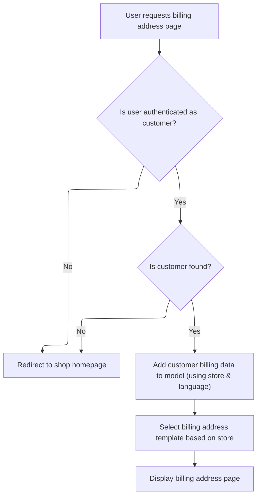

This document describes how authenticated customers can view their billing address page. The system retrieves and displays the billing information using the current store and language context, with a template specific to the store. If authentication fails or the customer is not found, the user is redirected to the shop homepage.

# Displaying the Customer's Billing Address



This section governs the rules for displaying a customer's billing address page, ensuring only authenticated customers can access their billing information, and that the correct store and language context is used for the display. It also ensures that the appropriate template is selected for the store.

| Category        | Rule Name                        | Description                                                                                                      |
| --------------- | -------------------------------- | ---------------------------------------------------------------------------------------------------------------- |
| Data validation | Customer authentication required | Only users who are authenticated and have the customer role are allowed to access the billing address page.      |
| Business logic  | Store and language context       | The billing address page must display customer billing information using the current store and language context. |
| Business logic  | Dynamic template selection       | The billing address page template is selected dynamically based on the store's template configuration.           |

<SwmSnippet path="/shopizer/sm-shop/src/main/java/com/salesmanager/web/shop/controller/customer/CustomerAccountController.java" line="381">

---

<SwmToken path="shopizer/sm-shop/src/main/java/com/salesmanager/web/shop/controller/customer/CustomerAccountController.java" pos="381:5:5" line-data="    public String displayCustomerBillingAddress(Model model, HttpServletRequest request, HttpServletResponse response) throws Exception {">`displayCustomerBillingAddress`</SwmToken> kicks off the flow by grabbing the current store and language from the session, checks if the user is authenticated and has the right role, fetches the customer data, and redirects if the customer isn't found. If everything checks out, it loads the detailed customer entity and adds it to the model for the view. The view template is picked dynamically based on the store's template, so each store can have its own billing address page.

```java
    public String displayCustomerBillingAddress(Model model, HttpServletRequest request, HttpServletResponse response) throws Exception {
        

        MerchantStore store = getSessionAttribute(Constants.MERCHANT_STORE, request);
        Language language = getSessionAttribute(Constants.LANGUAGE, request);
    
		Authentication auth = SecurityContextHolder.getContext().getAuthentication();
		Customer customer = null;
    	if(auth != null &&
        		 request.isUserInRole("AUTH_CUSTOMER")) {
    		customer = customerFacade.getCustomerByUserName(auth.getName(), store);

        }
    	
    	if(customer==null) {
    		return "redirect:/"+Constants.SHOP_URI;
    	}
        
        
        CustomerEntity customerEntity = customerFacade.getCustomerDataByUserName( customer.getNick(), store, language );
        if(customer !=null){
           model.addAttribute( "customer",  customerEntity);
        }
        
        
        /** template **/
        StringBuilder template = new StringBuilder().append(ControllerConstants.Tiles.Customer.Billing).append(".").append(store.getStoreTemplate());

        return template.toString();
        
    }
```

---

</SwmSnippet>

&nbsp;

*This is an auto-generated document by Swimm 🌊 and has not yet been verified by a human*

<SwmMeta version="3.0.0" repo-id="Z2l0aHViJTNBJTNBU2hvcGl6ZXIlM0ElM0F1bWFsaW5nYXN3YW1p" repo-name="Shopizer"><sup>Powered by [Swimm](https://app.swimm.io/)</sup></SwmMeta>
