This document outlines how the landing page is assembled and displayed. When a user requests the landing page, the system gathers language and store context, prepares navigation and SEO information, retrieves featured products, synchronizes the shopping cart, and returns a personalized, localized landing page.

# Preparing Landing Page Context

This section is responsible for assembling all necessary contextual information required to display the landing page to the user, ensuring the page is localized, relevant to the current store, and displays featured products and up-to-date cart information.

| Category       | Rule Name                     | Description                                                                                                                                                                                                                                                                                                                                                                                                                                                   |
| -------------- | ----------------------------- | ------------------------------------------------------------------------------------------------------------------------------------------------------------------------------------------------------------------------------------------------------------------------------------------------------------------------------------------------------------------------------------------------------------------------------------------------------------- |
| Business logic | Language Localization         | The landing page must display content in the language currently set for the user's session.                                                                                                                                                                                                                                                                                                                                                                   |
| Business logic | Store Contextualization       | The landing page must reflect the context of the current merchant store, including branding and store-specific content.                                                                                                                                                                                                                                                                                                                                       |
| Business logic | Home Breadcrumb Consistency   | The breadcrumb navigation must always start with a 'Home' item, labeled according to the current language, and link to the home page URL.                                                                                                                                                                                                                                                                                                                     |
| Business logic | Landing Page Content Presence | If landing page content is available, its description, meta tags, and keywords must be set for the page to support SEO and user information.                                                                                                                                                                                                                                                                                                                  |
| Business logic | Featured Products Display     | The landing page must display a list of featured products, which are determined by the <SwmToken path="shopizer/sm-shop/src/main/java/com/salesmanager/web/shop/controller/LandingController.java" pos="116:19:19" line-data="		List&lt;ProductRelationship&gt; relationships = productRelationshipService.getByType(store, ProductRelationshipType.FEATURED_ITEM, language);">`FEATURED_ITEM`</SwmToken> relationship type for the current store and language. |
| Business logic | Shopping Cart Synchronization | The shopping cart model must be updated and reflect the current state for the user/session when the landing page is displayed.                                                                                                                                                                                                                                                                                                                                |

<SwmSnippet path="/shopizer/sm-shop/src/main/java/com/salesmanager/web/shop/controller/LandingController.java" line="66">

---

We set up context for the landing page: language, store, breadcrumb, page content, and featured products. Next, we call <SwmToken path="shopizer/sm-shop/src/main/java/com/salesmanager/web/populator/shoppingCart/ShoppingCartModelPopulator.java" pos="37:4:4" line-data="public class ShoppingCartModelPopulator">`ShoppingCartModelPopulator`</SwmToken> to make sure the cart is up-to-date for this user/session.

```java
	public String displayLanding(Model model, HttpServletRequest request, HttpServletResponse response, Locale locale) throws Exception {
		
		Language language = (Language)request.getAttribute(Constants.LANGUAGE);
		
		MerchantStore store = (MerchantStore)request.getAttribute(Constants.MERCHANT_STORE);

		request.setAttribute(Constants.LINK_CODE, HOME_LINK_CODE);
		
		Content content = contentService.getByCode(LANDING_PAGE, store, language);
		
		/** Rebuild breadcrumb **/
		BreadcrumbItem item = new BreadcrumbItem();
		item.setItemType(BreadcrumbItemType.HOME);
		item.setLabel(messages.getMessage(Constants.HOME_MENU_KEY, locale));
		item.setUrl(Constants.HOME_URL);

		
		Breadcrumb breadCrumb = new Breadcrumb();
		breadCrumb.setLanguage(language);
		
		List<BreadcrumbItem> items = new ArrayList<BreadcrumbItem>();
		items.add(item);
		
		breadCrumb.setBreadCrumbs(items);
		request.getSession().setAttribute(Constants.BREADCRUMB, breadCrumb);
		request.setAttribute(Constants.BREADCRUMB, breadCrumb);
		/** **/
		
		if(content!=null) {
			
			ContentDescription description = content.getDescription();
			
			
			model.addAttribute("page",description);
			
			
			PageInformation pageInformation = new PageInformation();
			pageInformation.setPageTitle(description.getName());
			pageInformation.setPageDescription(description.getMetatagDescription());
			pageInformation.setPageKeywords(description.getMetatagKeywords());
			
			request.setAttribute(Constants.REQUEST_PAGE_INFORMATION, pageInformation);
			
		}
		
		ReadableProductPopulator populator = new ReadableProductPopulator();
		populator.setPricingService(pricingService);

		
		//featured items
		List<ProductRelationship> relationships = productRelationshipService.getByType(store, ProductRelationshipType.FEATURED_ITEM, language);
		List<ReadableProduct> featuredItems = new ArrayList<ReadableProduct>();
		for(ProductRelationship relationship : relationships) {
			
			Product product = relationship.getRelatedProduct();
			ReadableProduct proxyProduct = populator.populate(product, new ReadableProduct(), store, language);

			featuredItems.add(proxyProduct);
		}

		
```

---

</SwmSnippet>

## Syncing Shopping Cart State

```mermaid
%%{init: {"flowchart": {"defaultRenderer": "elk"}} }%%
flowchart TD
    node1["Start cart population"]
    click node1 openCode "shopizer/sm-shop/src/main/java/com/salesmanager/web/populator/shoppingCart/ShoppingCartModelPopulator.java:85:86"
    node1 --> node2{"Is cart id > 0 and code present?"}
    click node2 openCode "shopizer/sm-shop/src/main/java/com/salesmanager/web/populator/shoppingCart/ShoppingCartModelPopulator.java:91:92"
    node2 -->|"Yes"| node3{"Is cart found in database?"}
    click node3 openCode "shopizer/sm-shop/src/main/java/com/salesmanager/web/populator/shoppingCart/ShoppingCartModelPopulator.java:93:94"
    node3 -->|"Yes"| node4["Use existing cart"]
    click node4 openCode "shopizer/sm-shop/src/main/java/com/salesmanager/web/populator/shoppingCart/ShoppingCartModelPopulator.java:93:94"
    node3 -->|"No"| node5["Create new cart with code and store"]
    click node5 openCode "shopizer/sm-shop/src/main/java/com/salesmanager/web/populator/shoppingCart/ShoppingCartModelPopulator.java:95:97"
    node2 -->|"No"| node5
    node4 --> node6{"Is customer present?"}
    click node6 openCode "shopizer/sm-shop/src/main/java/com/salesmanager/web/populator/shoppingCart/ShoppingCartModelPopulator.java:98:99"
    node5 --> node6
    node6 -->|"Yes"| node7["Set customer id"]
    click node7 openCode "shopizer/sm-shop/src/main/java/com/salesmanager/web/populator/shoppingCart/ShoppingCartModelPopulator.java:100:101"
    node6 -->|"No"| node8["Skip customer"]
    click node8 openCode "shopizer/sm-shop/src/main/java/com/salesmanager/web/populator/shoppingCart/ShoppingCartModelPopulator.java:102:102"
    node7 --> node9["Create cart in database"]
    click node9 openCode "shopizer/sm-shop/src/main/java/com/salesmanager/web/populator/shoppingCart/ShoppingCartModelPopulator.java:102:103"
    node8 --> node9
    node9 --> node10{"Are there items in cart data?"}
    click node10 openCode "shopizer/sm-shop/src/main/java/com/salesmanager/web/populator/shoppingCart/ShoppingCartModelPopulator.java:116:117"
    node10 -->|"Yes"| node11["For each item in cart data"]
    node10 -->|"No"| node18["Return cart"]
    click node18 openCode "shopizer/sm-shop/src/main/java/com/salesmanager/web/populator/shoppingCart/ShoppingCartModelPopulator.java:187:188"
    
    subgraph loop1["For each item in cart data"]
        node11 --> node12{"Does item exist in cart model?"}
        click node12 openCode "shopizer/sm-shop/src/main/java/com/salesmanager/web/populator/shoppingCart/ShoppingCartModelPopulator.java:124:125"
        node12 -->|"Yes"| node13["Update item quantity"]
        click node13 openCode "shopizer/sm-shop/src/main/java/com/salesmanager/web/populator/shoppingCart/ShoppingCartModelPopulator.java:132:132"
        node13 --> node14{"Does item have attributes?"}
        click node14 openCode "shopizer/sm-shop/src/main/java/com/salesmanager/web/populator/shoppingCart/ShoppingCartModelPopulator.java:138:139"
        node14 -->|"Yes"| node15["Update item attributes"]
        click node15 openCode "shopizer/sm-shop/src/main/java/com/salesmanager/web/populator/shoppingCart/ShoppingCartModelPopulator.java:141:152"
        node14 -->|"No"| node16["Remove all item attributes"]
        click node16 openCode "shopizer/sm-shop/src/main/java/com/salesmanager/web/populator/shoppingCart/ShoppingCartModelPopulator.java:156:157"
        node15 --> node17["Add item to updated set"]
        click node17 openCode "shopizer/sm-shop/src/main/java/com/salesmanager/web/populator/shoppingCart/ShoppingCartModelPopulator.java:158:158"
        node16 --> node17
        node12 -->|"No"| node19["Create new item in cart model"]
        click node19 openCode "shopizer/sm-shop/src/main/java/com/salesmanager/web/populator/shoppingCart/ShoppingCartModelPopulator.java:164:165"
        node19 --> node20["Add item to cart"]
        click node20 openCode "shopizer/sm-shop/src/main/java/com/salesmanager/web/populator/shoppingCart/ShoppingCartModelPopulator.java:173:173"
        node20 --> node21["Update cart in database"]
        click node21 openCode "shopizer/sm-shop/src/main/java/com/salesmanager/web/populator/shoppingCart/ShoppingCartModelPopulator.java:174:174"
        node17 --> node22{"Next item?"}
        node21 --> node22
        node22 -->|"Yes"| node11
        node22 -->|"No"| node18
    end

classDef HeadingStyle fill:#777777,stroke:#333,stroke-width:2px;

%% Swimm:
%% %%{init: {"flowchart": {"defaultRenderer": "elk"}} }%%
%% flowchart TD
%%     node1["Start cart population"]
%%     click node1 openCode "<SwmPath>[shopizer/…/shoppingCart/ShoppingCartModelPopulator.java](shopizer/sm-shop/src/main/java/com/salesmanager/web/populator/shoppingCart/ShoppingCartModelPopulator.java)</SwmPath>:85:86"
%%     node1 --> node2{"Is cart id > 0 and code present?"}
%%     click node2 openCode "<SwmPath>[shopizer/…/shoppingCart/ShoppingCartModelPopulator.java](shopizer/sm-shop/src/main/java/com/salesmanager/web/populator/shoppingCart/ShoppingCartModelPopulator.java)</SwmPath>:91:92"
%%     node2 -->|"Yes"| node3{"Is cart found in database?"}
%%     click node3 openCode "<SwmPath>[shopizer/…/shoppingCart/ShoppingCartModelPopulator.java](shopizer/sm-shop/src/main/java/com/salesmanager/web/populator/shoppingCart/ShoppingCartModelPopulator.java)</SwmPath>:93:94"
%%     node3 -->|"Yes"| node4["Use existing cart"]
%%     click node4 openCode "<SwmPath>[shopizer/…/shoppingCart/ShoppingCartModelPopulator.java](shopizer/sm-shop/src/main/java/com/salesmanager/web/populator/shoppingCart/ShoppingCartModelPopulator.java)</SwmPath>:93:94"
%%     node3 -->|"No"| node5["Create new cart with code and store"]
%%     click node5 openCode "<SwmPath>[shopizer/…/shoppingCart/ShoppingCartModelPopulator.java](shopizer/sm-shop/src/main/java/com/salesmanager/web/populator/shoppingCart/ShoppingCartModelPopulator.java)</SwmPath>:95:97"
%%     node2 -->|"No"| node5
%%     node4 --> node6{"Is customer present?"}
%%     click node6 openCode "<SwmPath>[shopizer/…/shoppingCart/ShoppingCartModelPopulator.java](shopizer/sm-shop/src/main/java/com/salesmanager/web/populator/shoppingCart/ShoppingCartModelPopulator.java)</SwmPath>:98:99"
%%     node5 --> node6
%%     node6 -->|"Yes"| node7["Set customer id"]
%%     click node7 openCode "<SwmPath>[shopizer/…/shoppingCart/ShoppingCartModelPopulator.java](shopizer/sm-shop/src/main/java/com/salesmanager/web/populator/shoppingCart/ShoppingCartModelPopulator.java)</SwmPath>:100:101"
%%     node6 -->|"No"| node8["Skip customer"]
%%     click node8 openCode "<SwmPath>[shopizer/…/shoppingCart/ShoppingCartModelPopulator.java](shopizer/sm-shop/src/main/java/com/salesmanager/web/populator/shoppingCart/ShoppingCartModelPopulator.java)</SwmPath>:102:102"
%%     node7 --> node9["Create cart in database"]
%%     click node9 openCode "<SwmPath>[shopizer/…/shoppingCart/ShoppingCartModelPopulator.java](shopizer/sm-shop/src/main/java/com/salesmanager/web/populator/shoppingCart/ShoppingCartModelPopulator.java)</SwmPath>:102:103"
%%     node8 --> node9
%%     node9 --> node10{"Are there items in cart data?"}
%%     click node10 openCode "<SwmPath>[shopizer/…/shoppingCart/ShoppingCartModelPopulator.java](shopizer/sm-shop/src/main/java/com/salesmanager/web/populator/shoppingCart/ShoppingCartModelPopulator.java)</SwmPath>:116:117"
%%     node10 -->|"Yes"| node11["For each item in cart data"]
%%     node10 -->|"No"| node18["Return cart"]
%%     click node18 openCode "<SwmPath>[shopizer/…/shoppingCart/ShoppingCartModelPopulator.java](shopizer/sm-shop/src/main/java/com/salesmanager/web/populator/shoppingCart/ShoppingCartModelPopulator.java)</SwmPath>:187:188"
%%     
%%     subgraph loop1["For each item in cart data"]
%%         node11 --> node12{"Does item exist in cart model?"}
%%         click node12 openCode "<SwmPath>[shopizer/…/shoppingCart/ShoppingCartModelPopulator.java](shopizer/sm-shop/src/main/java/com/salesmanager/web/populator/shoppingCart/ShoppingCartModelPopulator.java)</SwmPath>:124:125"
%%         node12 -->|"Yes"| node13["Update item quantity"]
%%         click node13 openCode "<SwmPath>[shopizer/…/shoppingCart/ShoppingCartModelPopulator.java](shopizer/sm-shop/src/main/java/com/salesmanager/web/populator/shoppingCart/ShoppingCartModelPopulator.java)</SwmPath>:132:132"
%%         node13 --> node14{"Does item have attributes?"}
%%         click node14 openCode "<SwmPath>[shopizer/…/shoppingCart/ShoppingCartModelPopulator.java](shopizer/sm-shop/src/main/java/com/salesmanager/web/populator/shoppingCart/ShoppingCartModelPopulator.java)</SwmPath>:138:139"
%%         node14 -->|"Yes"| node15["Update item attributes"]
%%         click node15 openCode "<SwmPath>[shopizer/…/shoppingCart/ShoppingCartModelPopulator.java](shopizer/sm-shop/src/main/java/com/salesmanager/web/populator/shoppingCart/ShoppingCartModelPopulator.java)</SwmPath>:141:152"
%%         node14 -->|"No"| node16["Remove all item attributes"]
%%         click node16 openCode "<SwmPath>[shopizer/…/shoppingCart/ShoppingCartModelPopulator.java](shopizer/sm-shop/src/main/java/com/salesmanager/web/populator/shoppingCart/ShoppingCartModelPopulator.java)</SwmPath>:156:157"
%%         node15 --> node17["Add item to updated set"]
%%         click node17 openCode "<SwmPath>[shopizer/…/shoppingCart/ShoppingCartModelPopulator.java](shopizer/sm-shop/src/main/java/com/salesmanager/web/populator/shoppingCart/ShoppingCartModelPopulator.java)</SwmPath>:158:158"
%%         node16 --> node17
%%         node12 -->|"No"| node19["Create new item in cart model"]
%%         click node19 openCode "<SwmPath>[shopizer/…/shoppingCart/ShoppingCartModelPopulator.java](shopizer/sm-shop/src/main/java/com/salesmanager/web/populator/shoppingCart/ShoppingCartModelPopulator.java)</SwmPath>:164:165"
%%         node19 --> node20["Add item to cart"]
%%         click node20 openCode "<SwmPath>[shopizer/…/shoppingCart/ShoppingCartModelPopulator.java](shopizer/sm-shop/src/main/java/com/salesmanager/web/populator/shoppingCart/ShoppingCartModelPopulator.java)</SwmPath>:173:173"
%%         node20 --> node21["Update cart in database"]
%%         click node21 openCode "<SwmPath>[shopizer/…/shoppingCart/ShoppingCartModelPopulator.java](shopizer/sm-shop/src/main/java/com/salesmanager/web/populator/shoppingCart/ShoppingCartModelPopulator.java)</SwmPath>:174:174"
%%         node17 --> node22{"Next item?"}
%%         node21 --> node22
%%         node22 -->|"Yes"| node11
%%         node22 -->|"No"| node18
%%     end
%% 
%% classDef HeadingStyle fill:#777777,stroke:#333,stroke-width:2px;
```



This section ensures that the shopping cart model in the backend is synchronized with the incoming cart data from the client. It checks for existing carts, updates or creates them as needed, and processes each cart item to ensure the backend cart matches the client-side cart state.

| Category       | Rule Name                         | Description                                                                                                                                                                                            |
| -------------- | --------------------------------- | ------------------------------------------------------------------------------------------------------------------------------------------------------------------------------------------------------ |
| Business logic | Cart existence check and creation | If the incoming cart id is greater than 0 and a cart code is present, attempt to retrieve the cart from the database using the code. If not found, create a new cart with the provided code and store. |
| Business logic | Customer association              | If customer information is present in the input, associate the customer id with the cart; otherwise, leave the cart unassigned to a customer.                                                          |
| Business logic | Item quantity synchronization     | For each item in the incoming cart data, if the item already exists in the cart model, update its quantity to match the input.                                                                         |
| Business logic | Item attribute synchronization    | For each item in the cart, if attributes are present in the input, update the item's attributes to match; if not, remove all attributes from the item.                                                 |
| Business logic | New item addition                 | If an item from the input does not exist in the cart model, create a new cart item and add it to the cart.                                                                                             |

<SwmSnippet path="/shopizer/sm-shop/src/main/java/com/salesmanager/web/populator/shoppingCart/ShoppingCartModelPopulator.java" line="85">

---

In <SwmToken path="shopizer/sm-shop/src/main/java/com/salesmanager/web/populator/shoppingCart/ShoppingCartModelPopulator.java" pos="85:5:5" line-data="    public ShoppingCart populate(ShoppingCartData shoppingCart,ShoppingCart cartMdel,final MerchantStore store, Language language)">`populate`</SwmToken>, we check if the cart exists (by id/code), fetch or create it, and then loop through incoming items to update quantities and attributes, or add new items if needed. This keeps the cart model in sync with what's coming from the client, so the landing page can show the right cart state.

```java
    public ShoppingCart populate(ShoppingCartData shoppingCart,ShoppingCart cartMdel,final MerchantStore store, Language language)
    {


        // if id >0 get the original from the database, override products
       try{
        if ( shoppingCart.getId() > 0  && StringUtils.isNotBlank( shoppingCart.getCode()))
        {
            cartMdel = shoppingCartService.getByCode( shoppingCart.getCode(), store );
            if(cartMdel==null){
                cartMdel=new ShoppingCart();
                cartMdel.setShoppingCartCode( shoppingCart.getCode() );
                cartMdel.setMerchantStore( store );
                if ( customer != null )
                {
                    cartMdel.setCustomerId( customer.getId() );
                }
                shoppingCartService.create( cartMdel );
            }
        }
        else
        {
            cartMdel.setShoppingCartCode( shoppingCart.getCode() );
            cartMdel.setMerchantStore( store );
            if ( customer != null )
            {
                cartMdel.setCustomerId( customer.getId() );
            }
            shoppingCartService.create( cartMdel );
        }

        List<ShoppingCartItem> items = shoppingCart.getShoppingCartItems();
        Set<com.salesmanager.core.business.shoppingcart.model.ShoppingCartItem> newItems =
            new HashSet<com.salesmanager.core.business.shoppingcart.model.ShoppingCartItem>();
        if ( items != null && items.size() > 0 )
        {
            for ( ShoppingCartItem item : items )
            {

                Set<com.salesmanager.core.business.shoppingcart.model.ShoppingCartItem> cartItems = cartMdel.getLineItems();
                if ( cartItems != null && cartItems.size() > 0 )
                {

                    for ( com.salesmanager.core.business.shoppingcart.model.ShoppingCartItem dbItem : cartItems )
                    {
                        if ( dbItem.getId().longValue() == item.getId() )
                        {
                            dbItem.setQuantity( item.getQuantity() );
                            // compare attributes
                            Set<com.salesmanager.core.business.shoppingcart.model.ShoppingCartAttributeItem> attributes =
                                dbItem.getAttributes();
                            Set<com.salesmanager.core.business.shoppingcart.model.ShoppingCartAttributeItem> newAttributes =
                                new HashSet<com.salesmanager.core.business.shoppingcart.model.ShoppingCartAttributeItem>();
                            List<ShoppingCartAttribute> cartAttributes = item.getShoppingCartAttributes();
                            if ( !CollectionUtils.isEmpty( cartAttributes ) )
                            {
                                for ( ShoppingCartAttribute attribute : cartAttributes )
                                {
                                    for ( com.salesmanager.core.business.shoppingcart.model.ShoppingCartAttributeItem dbAttribute : attributes )
                                    {
                                        if ( dbAttribute.getId().longValue() == attribute.getId() )
                                        {
                                            newAttributes.add( dbAttribute );
                                        }
                                    }
                                }
                                
                                dbItem.setAttributes( newAttributes );
                            }
                            else
                            {
                                dbItem.removeAllAttributes();
                            }
                            newItems.add( dbItem );
                        }
                    }
                }
                else
                {// create new item
                    com.salesmanager.core.business.shoppingcart.model.ShoppingCartItem cartItem =
                        createCartItem( cartMdel, item, store );
                    Set<com.salesmanager.core.business.shoppingcart.model.ShoppingCartItem> lineItems =
                        cartMdel.getLineItems();
                    if ( lineItems == null )
                    {
                        lineItems = new HashSet<com.salesmanager.core.business.shoppingcart.model.ShoppingCartItem>();
                        cartMdel.setLineItems( lineItems );
                    }
                    lineItems.add( cartItem );
                    shoppingCartService.update( cartMdel );
                }
            }// end for
```

---

</SwmSnippet>

<SwmSnippet path="/shopizer/sm-shop/src/main/java/com/salesmanager/web/populator/shoppingCart/ShoppingCartModelPopulator.java" line="176">

---

After syncing items and attributes, we return the updated <SwmToken path="shopizer/sm-shop/src/main/java/com/salesmanager/web/populator/shoppingCart/ShoppingCartModelPopulator.java" pos="85:3:3" line-data="    public ShoppingCart populate(ShoppingCartData shoppingCart,ShoppingCart cartMdel,final MerchantStore store, Language language)">`ShoppingCart`</SwmToken> model. If anything fails, we throw a <SwmToken path="shopizer/sm-shop/src/main/java/com/salesmanager/web/populator/shoppingCart/ShoppingCartModelPopulator.java" pos="180:5:5" line-data="           throw new ConversionException( &quot;Unable to create cart model&quot;, se ); ">`ConversionException`</SwmToken>. The returned cart is ready for use in the controller/view.

```java
            }// end for
        }// end if
       }catch(ServiceException se){
           LOG.error( "Error while converting cart data to cart model.."+se );
           throw new ConversionException( "Unable to create cart model", se ); 
       }
       catch (Exception ex){
           LOG.error( "Error while converting cart data to cart model.."+ex );
           throw new ConversionException( "Unable to create cart model", ex );  
       }

        return cartMdel;
    }
```

---

</SwmSnippet>

## Finalizing Landing Page Response

<SwmSnippet path="/shopizer/sm-shop/src/main/java/com/salesmanager/web/shop/controller/LandingController.java" line="127">

---

We just got the updated cart back from <SwmToken path="shopizer/sm-shop/src/main/java/com/salesmanager/web/populator/shoppingCart/ShoppingCartModelPopulator.java" pos="37:4:4" line-data="public class ShoppingCartModelPopulator">`ShoppingCartModelPopulator`</SwmToken>, so now in <SwmToken path="shopizer/sm-shop/src/main/java/com/salesmanager/web/shop/controller/LandingController.java" pos="66:5:5" line-data="	public String displayLanding(Model model, HttpServletRequest request, HttpServletResponse response, Locale locale) throws Exception {">`displayLanding`</SwmToken> we add the featured products to the model and build the view template name using the store's template. The function returns this name so the right landing page layout is rendered for the store.

```java
		model.addAttribute("featuredItems", featuredItems);
		
		/** template **/
		StringBuilder template = new StringBuilder().append("landing.").append(store.getStoreTemplate());

		return template.toString();
	}
```

---

</SwmSnippet>

&nbsp;

*This is an auto-generated document by Swimm 🌊 and has not yet been verified by a human*

<SwmMeta version="3.0.0" repo-id="Z2l0aHViJTNBJTNBU2hvcGl6ZXIlM0ElM0F1bWFsaW5nYXN3YW1p" repo-name="Shopizer"><sup>Powered by [Swimm](https://app.swimm.io/)</sup></SwmMeta>
