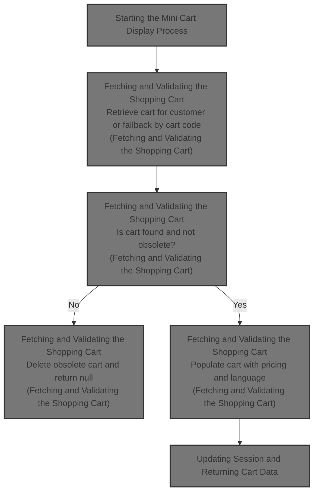
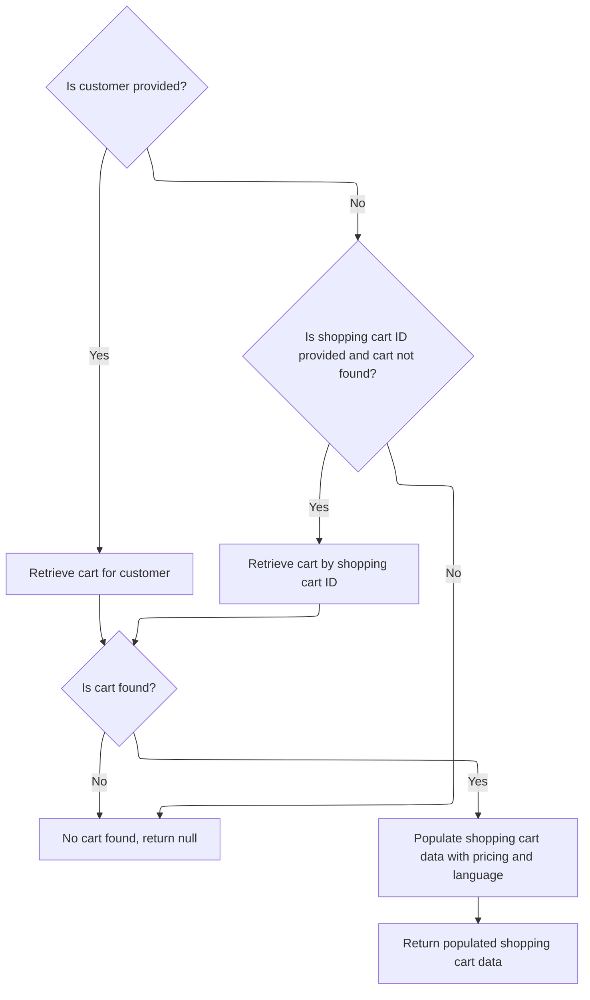

This document describes the process of displaying the mini cart by retrieving the current store and customer information, fetching the relevant shopping cart data, handling obsolete carts, and updating the session to ensure the mini cart reflects the correct and personalized shopping cart.



# Starting the Mini Cart Display Process

This section handles the process of displaying the mini cart by retrieving the store and customer information and then requesting the cart data from the facade, keeping the controller clean.

| Category       | Rule Name                  | Description                                                                                                                               |
| -------------- | -------------------------- | ----------------------------------------------------------------------------------------------------------------------------------------- |
| Business logic | Store Context Retrieval    | The mini cart display must always retrieve the current store context to ensure the cart data is relevant to the correct merchant store.   |
| Business logic | Customer Session Retrieval | The mini cart display must retrieve the current customer session to personalize the cart data for the logged-in user or guest.            |
| Business logic | Cart Data Fetching         | The mini cart data must be fetched using the shopping cart code, customer, and store information to ensure the correct cart is displayed. |

<SwmSnippet path="/shopizer/sm-shop/src/main/java/com/salesmanager/web/shop/controller/shoppingCart/MiniCartController.java" line="43">

---

We get the store and customer info, then ask the facade for the cart data, keeping the controller clean.

```java
	public @ResponseBody ShoppingCartData displayMiniCart(final String shoppingCartCode, HttpServletRequest request, Model model){
		
		try {
			MerchantStore merchantStore = (MerchantStore)request.getAttribute(Constants.MERCHANT_STORE);
		    Customer customer = getSessionAttribute(  Constants.CUSTOMER, request );
			ShoppingCartData cart =  shoppingCartFacade.getShoppingCartData(customer,merchantStore,shoppingCartCode);
```

---

</SwmSnippet>

## Fetching and Validating the Shopping Cart



This section handles fetching and validating the shopping cart for a customer or by shopping cart ID, ensuring the cart is current and populated with necessary pricing and language data before returning it.

| Category       | Rule Name                               | Description                                                                                                                        |
| -------------- | --------------------------------------- | ---------------------------------------------------------------------------------------------------------------------------------- |
| Business logic | Customer cart retrieval                 | If a customer is provided, retrieve the shopping cart associated with that customer.                                               |
| Business logic | Fallback cart retrieval by ID           | If no customer is provided or no cart is found for the customer, and a shopping cart ID is provided, retrieve the cart by that ID. |
| Business logic | Obsolete cart handling                  | If a retrieved shopping cart is marked as obsolete, delete it and return null instead of the cart.                                 |
| Business logic | Return null if no cart found            | If no shopping cart is found by customer or ID, return null to indicate absence of a valid cart.                                   |
| Business logic | Populate cart with pricing and language | Before returning a valid cart, populate it with pricing calculations and language-specific data.                                   |

<SwmSnippet path="/shopizer/sm-shop/src/main/java/com/salesmanager/web/shop/controller/shoppingCart/facade/ShoppingCartFacadeImpl.java" line="260">

---

In this snippet, we check if there's a customer and then call the service to get their cart. This delegation lets the service handle the details of cart retrieval, keeping the facade focused on flow control.

```java
    public ShoppingCartData getShoppingCartData( final Customer customer, final MerchantStore store,
                                                 final String shoppingCartId )
        throws Exception
    {

        ShoppingCart cart = null;
        try
        {
            if ( customer != null )
            {
                LOG.info( "Reteriving customer shopping cart..." );

                cart = shoppingCartService.getShoppingCart( customer );

            }

            else
            {
```

---

</SwmSnippet>

<SwmSnippet path="/shopizer/sm-core/src/main/java/com/salesmanager/core/business/shoppingcart/service/ShoppingCartServiceImpl.java" line="68">

---

Here we retrieve the cart for a customer, fill it with necessary details, then check if it's obsolete. If it is, we delete it and return null; otherwise, we return the cart.

```java
	public ShoppingCart getShoppingCart(final Customer customer) throws ServiceException {

		try {

			ShoppingCart shoppingCart = shoppingCartDao.getByCustomer(customer);
			populateShoppingCart(shoppingCart);
			if(shoppingCart!=null && shoppingCart.isObsolete()) {
				delete(shoppingCart);
				return null;
			} else {
				return shoppingCart;
			}


		} catch (Exception e) {
			throw new ServiceException(e);
		}

	}
```

---

</SwmSnippet>

<SwmSnippet path="/shopizer/sm-shop/src/main/java/com/salesmanager/web/shop/controller/shoppingCart/facade/ShoppingCartFacadeImpl.java" line="278">

---

After getting the cart from the service, if it's null and we have a cart code, we try to get the cart by that code. Then we populate the cart data with pricing and language info before returning it.

```java
                if ( StringUtils.isNotBlank( shoppingCartId ) && cart == null )
                {
                    cart = shoppingCartService.getByCode( shoppingCartId, store );
                }

            }
        }
        catch ( ServiceException ex )
        {
            LOG.error( "Error while retriving cart from customer", ex );
        }
        catch( NoResultException nre) {
        	//nothing
        }

        if ( cart == null )
        {
            return null;
        }

        LOG.info( "Cart model found." );

        ShoppingCartDataPopulator shoppingCartDataPopulator = new ShoppingCartDataPopulator();
        shoppingCartDataPopulator.setShoppingCartCalculationService( shoppingCartCalculationService );
        shoppingCartDataPopulator.setPricingService( pricingService );

        Language language = (Language) getKeyValue( Constants.LANGUAGE );
        MerchantStore merchantStore = (MerchantStore) getKeyValue( Constants.MERCHANT_STORE );
        return shoppingCartDataPopulator.populate( cart, merchantStore, language );

    }
```

---

</SwmSnippet>

## Updating Session and Returning Cart Data

<SwmSnippet path="/shopizer/sm-shop/src/main/java/com/salesmanager/web/shop/controller/shoppingCart/MiniCartController.java" line="49">

---

After getting the cart data, we update the session with the cart code if present, or remove the cart attribute if not. Then we return the cart data to the caller.

```java
			if(cart!=null) {
				request.getSession().setAttribute(Constants.SHOPPING_CART, cart.getCode());
			}
			if(cart==null) {
				request.getSession().removeAttribute(Constants.SHOPPING_CART);//make sure there is no cart here
			}
			return cart;
			
			
		} catch(Exception e) {
			LOG.error("Error while getting the shopping cart",e);
		}
		
		return null;

	}
```

---

</SwmSnippet>

&nbsp;

*This is an auto-generated document by Swimm 🌊 and has not yet been verified by a human*

<SwmMeta version="3.0.0" repo-id="Z2l0aHViJTNBJTNBU2hvcGl6ZXIlM0ElM0F1bWFsaW5nYXN3YW1p" repo-name="Shopizer"><sup>Powered by [Swimm](https://app.swimm.io/)</sup></SwmMeta>
