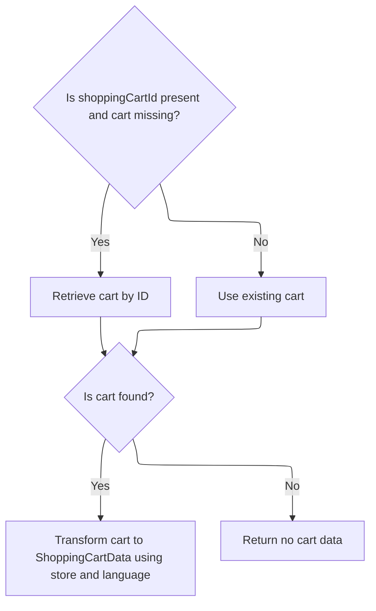
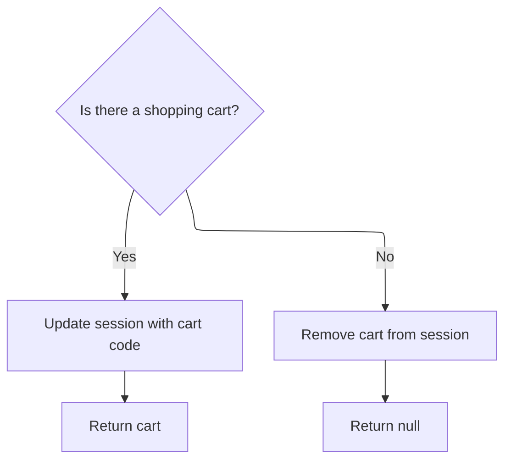

This document describes how the mini cart is displayed for a customer in a store. The flow retrieves the appropriate cart for either a logged-in or anonymous user, transforms the cart data for display, and updates the session to reflect the current cart state. The input is a request with session or cart code, and the output is the mini cart data or null if no cart is available.

# Starting the Mini Cart Retrieval

This section is responsible for initiating the retrieval of mini cart data for a customer in a specific store context, ensuring that the correct cart is fetched and populated for display.

| Category        | Rule Name                  | Description                                                                                                                                                                                                                                                                                                                                                                                                                                            |
| --------------- | -------------------------- | ------------------------------------------------------------------------------------------------------------------------------------------------------------------------------------------------------------------------------------------------------------------------------------------------------------------------------------------------------------------------------------------------------------------------------------------------------ |
| Data validation | Active session requirement | The mini cart must be retrieved for the currently active store and customer session. If either the store or customer is not present, the mini cart cannot be displayed.                                                                                                                                                                                                                                                                                |
| Business logic  | Cart code association      | The mini cart data must reflect the contents associated with the provided <SwmToken path="shopizer/sm-shop/src/main/java/com/salesmanager/web/shop/controller/shoppingCart/MiniCartController.java" pos="43:14:14" line-data="	public @ResponseBody ShoppingCartData displayMiniCart(final String shoppingCartCode, HttpServletRequest request, Model model){">`shoppingCartCode`</SwmToken>, ensuring that the correct cart is displayed for the user. |
| Business logic  | Cart data accuracy         | The mini cart data returned must be up-to-date and accurately reflect the current state of the user's cart, including all items, quantities, and prices.                                                                                                                                                                                                                                                                                               |

<SwmSnippet path="/shopizer/sm-shop/src/main/java/com/salesmanager/web/shop/controller/shoppingCart/MiniCartController.java" line="43">

---

In <SwmToken path="shopizer/sm-shop/src/main/java/com/salesmanager/web/shop/controller/shoppingCart/MiniCartController.java" pos="43:8:8" line-data="	public @ResponseBody ShoppingCartData displayMiniCart(final String shoppingCartCode, HttpServletRequest request, Model model){">`displayMiniCart`</SwmToken>, we grab the store and customer from the request/session, then immediately delegate to <SwmToken path="shopizer/sm-shop/src/main/java/com/salesmanager/web/shop/controller/shoppingCart/MiniCartController.java" pos="48:7:9" line-data="			ShoppingCartData cart =  shoppingCartFacade.getShoppingCartData(customer,merchantStore,shoppingCartCode);">`shoppingCartFacade.getShoppingCartData`</SwmToken>. This hands off all cart lookup and population logic to the facade, so the controller doesn't deal with cart internals. Next, we need to call <SwmToken path="shopizer/sm-shop/src/main/java/com/salesmanager/web/shop/controller/shoppingCart/facade/ShoppingCartFacadeImpl.java" pos="51:4:4" line-data="public class ShoppingCartFacadeImpl">`ShoppingCartFacadeImpl`</SwmToken> because that's where the actual cart retrieval and data population happens.

```java
	public @ResponseBody ShoppingCartData displayMiniCart(final String shoppingCartCode, HttpServletRequest request, Model model){
		
		try {
			MerchantStore merchantStore = (MerchantStore)request.getAttribute(Constants.MERCHANT_STORE);
		    Customer customer = getSessionAttribute(  Constants.CUSTOMER, request );
			ShoppingCartData cart =  shoppingCartFacade.getShoppingCartData(customer,merchantStore,shoppingCartCode);
```

---

</SwmSnippet>

## Delegating Cart Lookup to Facade

This section governs how shopping cart data is retrieved, ensuring that the correct cart is returned for either a logged-in customer or an anonymous session using a cart code. It ensures business continuity by providing the right cart context for checkout and shopping operations.

| Category        | Rule Name                 | Description                                                                                                                             |
| --------------- | ------------------------- | --------------------------------------------------------------------------------------------------------------------------------------- |
| Data validation | Missing Cart Context      | If neither a valid customer nor a valid cart code is provided, the system must not return a shopping cart and should indicate an error. |
| Business logic  | Customer Cart Lookup      | If a customer is logged in, the shopping cart must be retrieved using the customer's account information.                               |
| Business logic  | Anonymous Cart Lookup     | If no customer is logged in, the shopping cart must be retrieved using the provided cart code.                                          |
| Business logic  | Store Context Enforcement | The shopping cart data returned must correspond to the merchant store specified in the request.                                         |

<SwmSnippet path="/shopizer/sm-shop/src/main/java/com/salesmanager/web/shop/controller/shoppingCart/facade/ShoppingCartFacadeImpl.java" line="260">

---

In <SwmToken path="shopizer/sm-shop/src/main/java/com/salesmanager/web/shop/controller/shoppingCart/facade/ShoppingCartFacadeImpl.java" pos="260:5:5" line-data="    public ShoppingCartData getShoppingCartData( final Customer customer, final MerchantStore store,">`getShoppingCartData`</SwmToken>, we first try to get the cart for a logged-in customer using <SwmToken path="shopizer/sm-shop/src/main/java/com/salesmanager/web/shop/controller/shoppingCart/facade/ShoppingCartFacadeImpl.java" pos="272:5:7" line-data="                cart = shoppingCartService.getShoppingCart( customer );">`shoppingCartService.getShoppingCart`</SwmToken>. If there's no customer, we fall back to looking up by cart code. Next, we need to call ShoppingCartServiceImpl to actually fetch the cart entity from persistence.

```java
    public ShoppingCartData getShoppingCartData( final Customer customer, final MerchantStore store,
                                                 final String shoppingCartId )
        throws Exception
    {

        ShoppingCart cart = null;
        try
        {
            if ( customer != null )
            {
                LOG.info( "Reteriving customer shopping cart..." );

                cart = shoppingCartService.getShoppingCart( customer );

            }

            else
            {
```

---

</SwmSnippet>

### Fetching Cart Entity from Service

This section is responsible for retrieving the shopping cart entity for a user, ensuring the correct cart is fetched and returned for further processing or display.

| Category        | Rule Name                         | Description                                                                                                                            |
| --------------- | --------------------------------- | -------------------------------------------------------------------------------------------------------------------------------------- |
| Data validation | Authenticated User Cart Retrieval | A cart entity must be fetched for every authenticated user who initiates a cart retrieval request.                                     |
| Data validation | Cart Privacy Compliance           | Cart retrieval must be performed in compliance with data privacy regulations, ensuring only the requesting user can access their cart. |
| Business logic  | Cart Creation on Absence          | If a cart does not exist for the user, a new empty cart entity must be created and returned.                                           |
| Business logic  | Cart Item Accuracy                | The cart entity returned must include all items currently added by the user, with accurate quantities and prices.                      |

See <SwmLink doc-title="Retrieving and Validating the Shopping Cart">[Retrieving and Validating the Shopping Cart](.swm%5Cretrieving-and-validating-the-shopping-cart.cwmcrfie.sw.md)</SwmLink>

### Populating Cart Data for Response



<SwmSnippet path="/shopizer/sm-shop/src/main/java/com/salesmanager/web/shop/controller/shoppingCart/facade/ShoppingCartFacadeImpl.java" line="278">

---

Back in <SwmToken path="shopizer/sm-shop/src/main/java/com/salesmanager/web/shop/controller/shoppingCart/MiniCartController.java" pos="48:9:9" line-data="			ShoppingCartData cart =  shoppingCartFacade.getShoppingCartData(customer,merchantStore,shoppingCartCode);">`getShoppingCartData`</SwmToken>, after getting the cart from the service, we check if it's null and bail if so. Otherwise, we use <SwmToken path="shopizer/sm-shop/src/main/java/com/salesmanager/web/shop/controller/shoppingCart/facade/ShoppingCartFacadeImpl.java" pos="300:1:1" line-data="        ShoppingCartDataPopulator shoppingCartDataPopulator = new ShoppingCartDataPopulator();">`ShoppingCartDataPopulator`</SwmToken> to convert the cart entity into a UI-friendly DTO, injecting calculation and pricing services for enriched data.

```java
                if ( StringUtils.isNotBlank( shoppingCartId ) && cart == null )
                {
                    cart = shoppingCartService.getByCode( shoppingCartId, store );
                }

            }
        }
        catch ( ServiceException ex )
        {
            LOG.error( "Error while retriving cart from customer", ex );
        }
        catch( NoResultException nre) {
        	//nothing
        }

        if ( cart == null )
        {
            return null;
        }

        LOG.info( "Cart model found." );

        ShoppingCartDataPopulator shoppingCartDataPopulator = new ShoppingCartDataPopulator();
        shoppingCartDataPopulator.setShoppingCartCalculationService( shoppingCartCalculationService );
        shoppingCartDataPopulator.setPricingService( pricingService );

        Language language = (Language) getKeyValue( Constants.LANGUAGE );
        MerchantStore merchantStore = (MerchantStore) getKeyValue( Constants.MERCHANT_STORE );
        return shoppingCartDataPopulator.populate( cart, merchantStore, language );

    }
```

---

</SwmSnippet>

## Finalizing Mini Cart Session State



<SwmSnippet path="/shopizer/sm-shop/src/main/java/com/salesmanager/web/shop/controller/shoppingCart/MiniCartController.java" line="49">

---

Back in <SwmToken path="shopizer/sm-shop/src/main/java/com/salesmanager/web/shop/controller/shoppingCart/MiniCartController.java" pos="43:8:8" line-data="	public @ResponseBody ShoppingCartData displayMiniCart(final String shoppingCartCode, HttpServletRequest request, Model model){">`displayMiniCart`</SwmToken>, after getting the <SwmToken path="shopizer/sm-shop/src/main/java/com/salesmanager/web/shop/controller/shoppingCart/MiniCartController.java" pos="43:6:6" line-data="	public @ResponseBody ShoppingCartData displayMiniCart(final String shoppingCartCode, HttpServletRequest request, Model model){">`ShoppingCartData`</SwmToken> from the facade, we update the session with the cart code if present, or clear it if not. This keeps the user's session cart state in sync with what's actually in the backend.

```java
			if(cart!=null) {
				request.getSession().setAttribute(Constants.SHOPPING_CART, cart.getCode());
			}
			if(cart==null) {
				request.getSession().removeAttribute(Constants.SHOPPING_CART);//make sure there is no cart here
			}
			return cart;
			
			
		} catch(Exception e) {
			LOG.error("Error while getting the shopping cart",e);
		}
		
		return null;

	}
```

---

</SwmSnippet>

&nbsp;

*This is an auto-generated document by Swimm 🌊 and has not yet been verified by a human*

<SwmMeta version="3.0.0" repo-id="Z2l0aHViJTNBJTNBU2hvcGl6ZXIlM0ElM0F1bWFsaW5nYXN3YW1p" repo-name="Shopizer"><sup>Powered by [Swimm](https://app.swimm.io/)</sup></SwmMeta>
