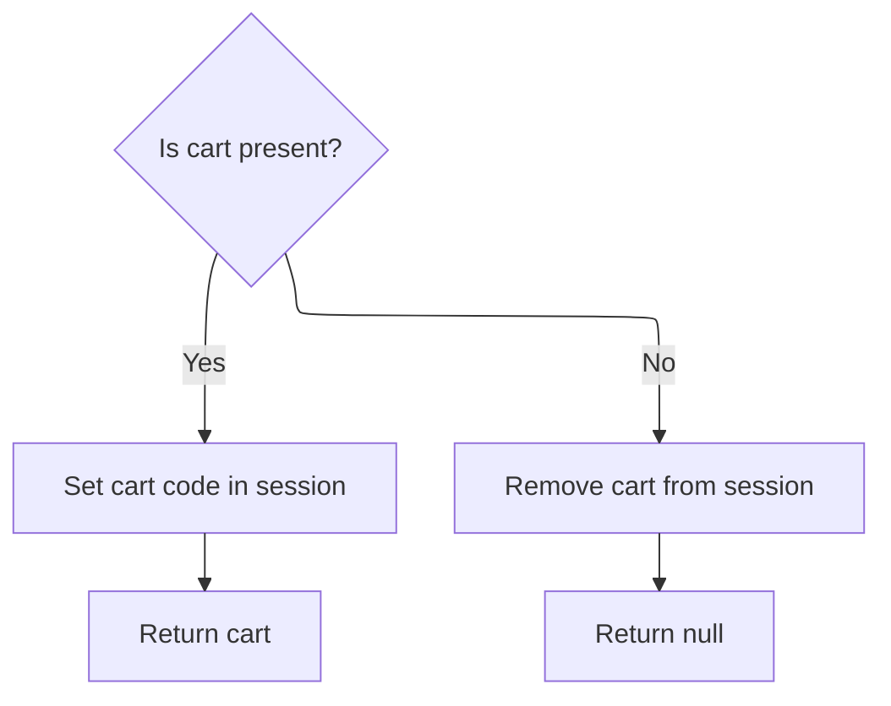

This document describes how the system retrieves and displays the user's mini cart. The flow starts by gathering session data, attempts to find the user's cart, and transforms it for frontend use. The session is updated to match the cart state, and the cart data is returned for display in the mini cart interface.

# Starting the mini cart retrieval

<SwmSnippet path="/shopizer/sm-shop/src/main/java/com/salesmanager/web/shop/controller/shoppingCart/MiniCartController.java" line="43">

---

In <SwmToken path="shopizer/sm-shop/src/main/java/com/salesmanager/web/shop/controller/shoppingCart/MiniCartController.java" pos="43:8:8" line-data="	public @ResponseBody ShoppingCartData displayMiniCart(final String shoppingCartCode, HttpServletRequest request, Model model){">`displayMiniCart`</SwmToken>, we grab the merchant store and customer from the request/session, then immediately call the <SwmToken path="shopizer/sm-shop/src/main/java/com/salesmanager/web/shop/controller/shoppingCart/MiniCartController.java" pos="24:16:16" line-data="import com.salesmanager.web.shop.controller.shoppingCart.facade.ShoppingCartFacade;">`ShoppingCartFacade`</SwmToken> to get the cart data. This keeps the controller thin and pushes all cart retrieval logic to the facade, which is the next step in the flow.

```java
	public @ResponseBody ShoppingCartData displayMiniCart(final String shoppingCartCode, HttpServletRequest request, Model model){
		
		try {
			MerchantStore merchantStore = (MerchantStore)request.getAttribute(Constants.MERCHANT_STORE);
		    Customer customer = getSessionAttribute(  Constants.CUSTOMER, request );
			ShoppingCartData cart =  shoppingCartFacade.getShoppingCartData(customer,merchantStore,shoppingCartCode);
```

---

</SwmSnippet>

## Resolving cart from customer or code

<SwmSnippet path="/shopizer/sm-shop/src/main/java/com/salesmanager/web/shop/controller/shoppingCart/facade/ShoppingCartFacadeImpl.java" line="260">

---

In <SwmToken path="shopizer/sm-shop/src/main/java/com/salesmanager/web/shop/controller/shoppingCart/facade/ShoppingCartFacadeImpl.java" pos="260:5:5" line-data="    public ShoppingCartData getShoppingCartData( final Customer customer, final MerchantStore store,">`getShoppingCartData`</SwmToken>, we first try to get the cart for the customer using the <SwmToken path="shopizer/sm-shop/src/main/java/com/salesmanager/web/shop/controller/shoppingCart/facade/ShoppingCartFacadeImpl.java" pos="36:14:14" line-data="import com.salesmanager.core.business.shoppingcart.service.ShoppingCartService;">`ShoppingCartService`</SwmToken>. If there's no customer, we'll later try by cart code. This step is about figuring out which cart to work with, and that's why we need to call the service next—to actually fetch the cart entity.

```java
    public ShoppingCartData getShoppingCartData( final Customer customer, final MerchantStore store,
                                                 final String shoppingCartId )
        throws Exception
    {

        ShoppingCart cart = null;
        try
        {
            if ( customer != null )
            {
                LOG.info( "Reteriving customer shopping cart..." );

                cart = shoppingCartService.getShoppingCart( customer );

            }

            else
            {
```

---

</SwmSnippet>

### Fetching cart entity from persistence

See <SwmLink doc-title="Retrieving and validating the shopping cart">[Retrieving and validating the shopping cart](.swm%5Cretrieving-and-validating-the-shopping-cart.4kyxsra9.sw.md)</SwmLink>

### Fallback and populating cart data

```mermaid
%%{init: {"flowchart": {"defaultRenderer": "elk"}} }%%
flowchart TD
    node1["Start: Attempt to retrieve shopping cart"] --> node2{"Is cart available?"}
    click node1 openCode "shopizer/sm-shop/src/main/java/com/salesmanager/web/shop/controller/shoppingCart/facade/ShoppingCartFacadeImpl.java:278:281"
    node2 -->|"No"| node3["Retrieve cart by shoppingCartId"]
    click node2 openCode "shopizer/sm-shop/src/main/java/com/salesmanager/web/shop/controller/shoppingCart/facade/ShoppingCartFacadeImpl.java:278:281"
    node2 -->|"Yes"| node4["Proceed with cart"]
    click node3 openCode "shopizer/sm-shop/src/main/java/com/salesmanager/web/shop/controller/shoppingCart/facade/ShoppingCartFacadeImpl.java:280:281"
    click node4 openCode "shopizer/sm-shop/src/main/java/com/salesmanager/web/shop/controller/shoppingCart/facade/ShoppingCartFacadeImpl.java:281:293"
    node3 --> node4
    node4 --> node5{"Is cart found?"}
    click node5 openCode "shopizer/sm-shop/src/main/java/com/salesmanager/web/shop/controller/shoppingCart/facade/ShoppingCartFacadeImpl.java:293:295"
    node5 -->|"No"| node6["Return null"]
    click node6 openCode "shopizer/sm-shop/src/main/java/com/salesmanager/web/shop/controller/shoppingCart/facade/ShoppingCartFacadeImpl.java:295:296"
    node5 -->|"Yes"| node7["Transform cart to ShoppingCartData using populator, store, and language"]
    click node7 openCode "shopizer/sm-shop/src/main/java/com/salesmanager/web/shop/controller/shoppingCart/facade/ShoppingCartFacadeImpl.java:300:306"
    node7 --> node8["Return ShoppingCartData"]
    click node8 openCode "shopizer/sm-shop/src/main/java/com/salesmanager/web/shop/controller/shoppingCart/facade/ShoppingCartFacadeImpl.java:306:307"

classDef HeadingStyle fill:#777777,stroke:#333,stroke-width:2px;

%% Swimm:
%% %%{init: {"flowchart": {"defaultRenderer": "elk"}} }%%
%% flowchart TD
%%     node1["Start: Attempt to retrieve shopping cart"] --> node2{"Is cart available?"}
%%     click node1 openCode "<SwmPath>[shopizer/…/facade/ShoppingCartFacadeImpl.java](shopizer/sm-shop/src/main/java/com/salesmanager/web/shop/controller/shoppingCart/facade/ShoppingCartFacadeImpl.java)</SwmPath>:278:281"
%%     node2 -->|"No"| node3["Retrieve cart by <SwmToken path="shopizer/sm-shop/src/main/java/com/salesmanager/web/shop/controller/shoppingCart/facade/ShoppingCartFacadeImpl.java" pos="261:5:5" line-data="                                                 final String shoppingCartId )">`shoppingCartId`</SwmToken>"]
%%     click node2 openCode "<SwmPath>[shopizer/…/facade/ShoppingCartFacadeImpl.java](shopizer/sm-shop/src/main/java/com/salesmanager/web/shop/controller/shoppingCart/facade/ShoppingCartFacadeImpl.java)</SwmPath>:278:281"
%%     node2 -->|"Yes"| node4["Proceed with cart"]
%%     click node3 openCode "<SwmPath>[shopizer/…/facade/ShoppingCartFacadeImpl.java](shopizer/sm-shop/src/main/java/com/salesmanager/web/shop/controller/shoppingCart/facade/ShoppingCartFacadeImpl.java)</SwmPath>:280:281"
%%     click node4 openCode "<SwmPath>[shopizer/…/facade/ShoppingCartFacadeImpl.java](shopizer/sm-shop/src/main/java/com/salesmanager/web/shop/controller/shoppingCart/facade/ShoppingCartFacadeImpl.java)</SwmPath>:281:293"
%%     node3 --> node4
%%     node4 --> node5{"Is cart found?"}
%%     click node5 openCode "<SwmPath>[shopizer/…/facade/ShoppingCartFacadeImpl.java](shopizer/sm-shop/src/main/java/com/salesmanager/web/shop/controller/shoppingCart/facade/ShoppingCartFacadeImpl.java)</SwmPath>:293:295"
%%     node5 -->|"No"| node6["Return null"]
%%     click node6 openCode "<SwmPath>[shopizer/…/facade/ShoppingCartFacadeImpl.java](shopizer/sm-shop/src/main/java/com/salesmanager/web/shop/controller/shoppingCart/facade/ShoppingCartFacadeImpl.java)</SwmPath>:295:296"
%%     node5 -->|"Yes"| node7["Transform cart to <SwmToken path="shopizer/sm-shop/src/main/java/com/salesmanager/web/shop/controller/shoppingCart/MiniCartController.java" pos="43:6:6" line-data="	public @ResponseBody ShoppingCartData displayMiniCart(final String shoppingCartCode, HttpServletRequest request, Model model){">`ShoppingCartData`</SwmToken> using populator, store, and language"]
%%     click node7 openCode "<SwmPath>[shopizer/…/facade/ShoppingCartFacadeImpl.java](shopizer/sm-shop/src/main/java/com/salesmanager/web/shop/controller/shoppingCart/facade/ShoppingCartFacadeImpl.java)</SwmPath>:300:306"
%%     node7 --> node8["Return <SwmToken path="shopizer/sm-shop/src/main/java/com/salesmanager/web/shop/controller/shoppingCart/MiniCartController.java" pos="43:6:6" line-data="	public @ResponseBody ShoppingCartData displayMiniCart(final String shoppingCartCode, HttpServletRequest request, Model model){">`ShoppingCartData`</SwmToken>"]
%%     click node8 openCode "<SwmPath>[shopizer/…/facade/ShoppingCartFacadeImpl.java](shopizer/sm-shop/src/main/java/com/salesmanager/web/shop/controller/shoppingCart/facade/ShoppingCartFacadeImpl.java)</SwmPath>:306:307"
%% 
%% classDef HeadingStyle fill:#777777,stroke:#333,stroke-width:2px;
```



<SwmSnippet path="/shopizer/sm-shop/src/main/java/com/salesmanager/web/shop/controller/shoppingCart/facade/ShoppingCartFacadeImpl.java" line="278">

---

Back in <SwmToken path="shopizer/sm-shop/src/main/java/com/salesmanager/web/shop/controller/shoppingCart/MiniCartController.java" pos="48:9:9" line-data="			ShoppingCartData cart =  shoppingCartFacade.getShoppingCartData(customer,merchantStore,shoppingCartCode);">`getShoppingCartData`</SwmToken>, after trying to get the cart from the service, if we didn't get one by customer, we try by cart code. If we still don't have a cart, we return null. Otherwise, we use the populator to convert the cart entity into a frontend-friendly data object, injecting calculation and pricing services as needed.

```java
                if ( StringUtils.isNotBlank( shoppingCartId ) && cart == null )
                {
                    cart = shoppingCartService.getByCode( shoppingCartId, store );
                }

            }
        }
        catch ( ServiceException ex )
        {
            LOG.error( "Error while retriving cart from customer", ex );
        }
        catch( NoResultException nre) {
        	//nothing
        }

        if ( cart == null )
        {
            return null;
        }

        LOG.info( "Cart model found." );

        ShoppingCartDataPopulator shoppingCartDataPopulator = new ShoppingCartDataPopulator();
        shoppingCartDataPopulator.setShoppingCartCalculationService( shoppingCartCalculationService );
        shoppingCartDataPopulator.setPricingService( pricingService );

        Language language = (Language) getKeyValue( Constants.LANGUAGE );
        MerchantStore merchantStore = (MerchantStore) getKeyValue( Constants.MERCHANT_STORE );
        return shoppingCartDataPopulator.populate( cart, merchantStore, language );

    }
```

---

</SwmSnippet>

## Updating session and returning cart data



<SwmSnippet path="/shopizer/sm-shop/src/main/java/com/salesmanager/web/shop/controller/shoppingCart/MiniCartController.java" line="49">

---

Back in <SwmToken path="shopizer/sm-shop/src/main/java/com/salesmanager/web/shop/controller/shoppingCart/MiniCartController.java" pos="43:8:8" line-data="	public @ResponseBody ShoppingCartData displayMiniCart(final String shoppingCartCode, HttpServletRequest request, Model model){">`displayMiniCart`</SwmToken>, after getting the cart data from the facade, we update the session with the cart code if there's a cart, or remove it if not. Then we return the cart data to the client. This keeps the session in sync with the actual cart state.

```java
			if(cart!=null) {
				request.getSession().setAttribute(Constants.SHOPPING_CART, cart.getCode());
			}
			if(cart==null) {
				request.getSession().removeAttribute(Constants.SHOPPING_CART);//make sure there is no cart here
			}
			return cart;
			
			
		} catch(Exception e) {
			LOG.error("Error while getting the shopping cart",e);
		}
		
		return null;

	}
```

---

</SwmSnippet>

&nbsp;

*This is an auto-generated document by Swimm 🌊 and has not yet been verified by a human*

<SwmMeta version="3.0.0" repo-id="Z2l0aHViJTNBJTNBU2hvcGl6ZXIlM0ElM0F1bWFsaW5nYXN3YW1p" repo-name="Shopizer"><sup>Powered by [Swimm](https://app.swimm.io/)</sup></SwmMeta>
