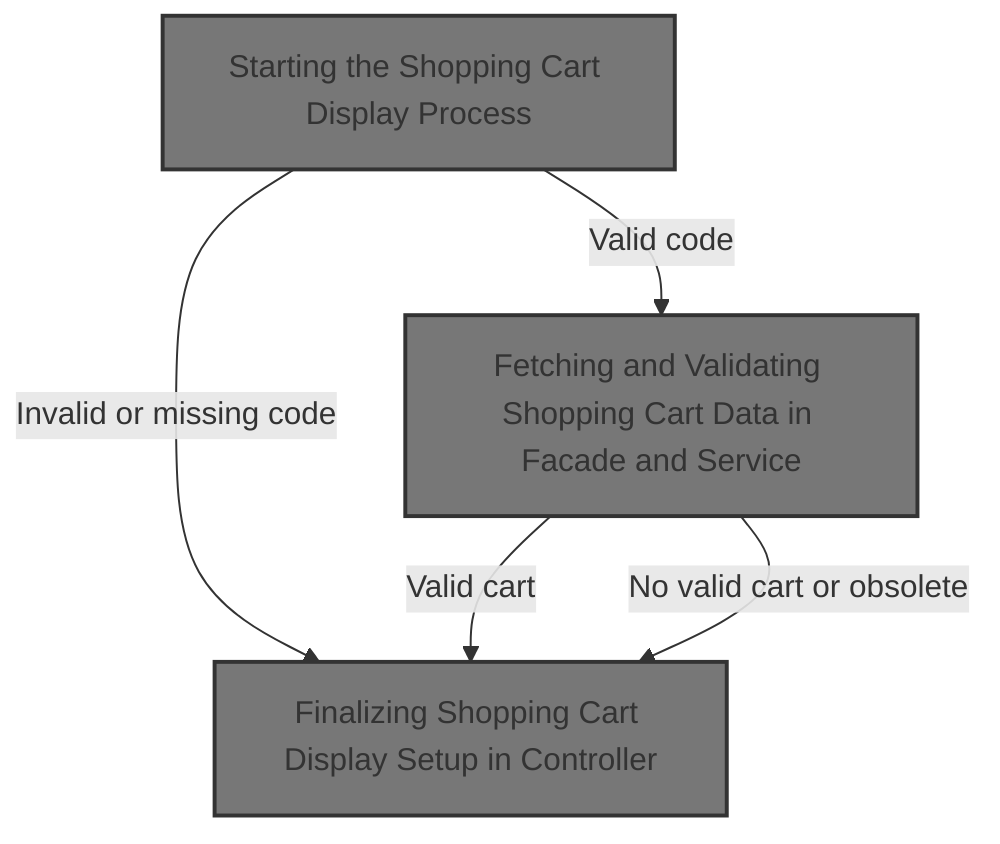
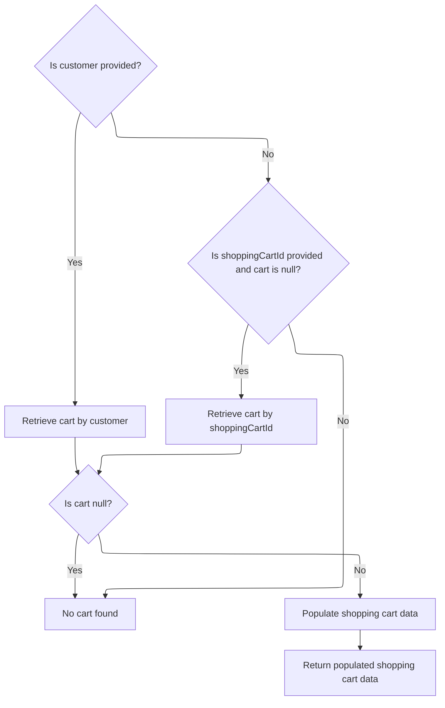

This document explains the flow of displaying the shopping cart to the user in the online store. It validates the shopping cart code, retrieves and verifies the cart data, enriches it with pricing and calculation details, and prepares it for display, ensuring users see an accurate and current view of their cart.



# Starting the Shopping Cart Display Process

This section handles the process of displaying the shopping cart by validating the shopping cart code and retrieving the cart data for the current customer and store.

<SwmSnippet path="/shopizer/sm-shop/src/main/java/com/salesmanager/web/shop/controller/shoppingCart/ShoppingCartController.java" line="267">

---

Here we start by checking if the shopping cart code is present and valid. If not, we redirect to the shop homepage. Then, we call the facade to get the shopping cart data for the current customer and store. This call is essential because it fetches the detailed cart data needed to display the cart contents.

```java
	public String displayShoppingCart(@ModelAttribute String shoppingCartCode, final Model model, HttpServletRequest request, final Locale locale) throws Exception{

			MerchantStore merchantStore = (MerchantStore)request.getAttribute(Constants.MERCHANT_STORE);
			Customer customer = getSessionAttribute(  Constants.CUSTOMER, request );
			
			if(StringUtils.isBlank(shoppingCartCode)) {
				return "redirect:/shop";
			}
			
			ShoppingCartData cart =  shoppingCartFacade.getShoppingCartData(customer,merchantStore,shoppingCartCode);
			if(cart==null) {
				return "redirect:/shop";
			}
			
			
```

---

</SwmSnippet>

## Fetching and Validating Shopping Cart Data in Facade and Service



This section handles fetching and validating shopping cart data by checking customer presence, retrieving the cart by customer or cart ID, validating cart obsolescence, and populating the cart with pricing and calculation details before returning it.

| Category       | Rule Name                     | Description                                                                                                                                                   |
| -------------- | ----------------------------- | ------------------------------------------------------------------------------------------------------------------------------------------------------------- |
| Business logic | Customer cart retrieval       | If a customer is provided, the system must retrieve the shopping cart associated with that customer.                                                          |
| Business logic | Fallback cart retrieval by ID | If no customer is provided or no cart is found for the customer, and a shopping cart ID is provided, the system must attempt to retrieve the cart by this ID. |
| Business logic | Obsolete cart handling        | If a retrieved shopping cart is marked as obsolete, it must be deleted and treated as non-existent (null returned).                                           |
| Business logic | Null cart response            | If no valid shopping cart is found after all retrieval attempts, the system must return null to indicate absence of a cart.                                   |
| Business logic | Cart data population          | Before returning a valid shopping cart, the system must populate it with pricing, calculation, and language-specific details.                                 |

<SwmSnippet path="/shopizer/sm-shop/src/main/java/com/salesmanager/web/shop/controller/shoppingCart/facade/ShoppingCartFacadeImpl.java" line="260">

---

In this snippet, we check if there's a customer logged in. If yes, we ask the service layer to get the customer's shopping cart. This delegation keeps the controller clean and pushes business logic down to the service.

```java
    public ShoppingCartData getShoppingCartData( final Customer customer, final MerchantStore store,
                                                 final String shoppingCartId )
        throws Exception
    {

        ShoppingCart cart = null;
        try
        {
            if ( customer != null )
            {
                LOG.info( "Reteriving customer shopping cart..." );

                cart = shoppingCartService.getShoppingCart( customer );

            }

            else
            {
```

---

</SwmSnippet>

<SwmSnippet path="/shopizer/sm-core/src/main/java/com/salesmanager/core/business/shoppingcart/service/ShoppingCartServiceImpl.java" line="68">

---

Here, the service fetches the cart for the customer and populates it with extra data. Then it checks if the cart is obsolete. If it is, the cart is deleted and null is returned, so the caller knows there's no valid cart.

```java
	public ShoppingCart getShoppingCart(final Customer customer) throws ServiceException {

		try {

			ShoppingCart shoppingCart = shoppingCartDao.getByCustomer(customer);
			populateShoppingCart(shoppingCart);
			if(shoppingCart!=null && shoppingCart.isObsolete()) {
				delete(shoppingCart);
				return null;
			} else {
				return shoppingCart;
			}


		} catch (Exception e) {
			throw new ServiceException(e);
		}

	}
```

---

</SwmSnippet>

<SwmSnippet path="/shopizer/sm-shop/src/main/java/com/salesmanager/web/shop/controller/shoppingCart/facade/ShoppingCartFacadeImpl.java" line="278">

---

We just got back from the service call. If the cart is null, we try to get it by code. If still null, we return null. Otherwise, we populate the cart with pricing and calculation details before returning it.

```java
                if ( StringUtils.isNotBlank( shoppingCartId ) && cart == null )
                {
                    cart = shoppingCartService.getByCode( shoppingCartId, store );
                }

            }
        }
        catch ( ServiceException ex )
        {
            LOG.error( "Error while retriving cart from customer", ex );
        }
        catch( NoResultException nre) {
        	//nothing
        }

        if ( cart == null )
        {
            return null;
        }

        LOG.info( "Cart model found." );

        ShoppingCartDataPopulator shoppingCartDataPopulator = new ShoppingCartDataPopulator();
        shoppingCartDataPopulator.setShoppingCartCalculationService( shoppingCartCalculationService );
        shoppingCartDataPopulator.setPricingService( pricingService );

        Language language = (Language) getKeyValue( Constants.LANGUAGE );
        MerchantStore merchantStore = (MerchantStore) getKeyValue( Constants.MERCHANT_STORE );
        return shoppingCartDataPopulator.populate( cart, merchantStore, language );

    }
```

---

</SwmSnippet>

## Finalizing Shopping Cart Display Setup in Controller

<SwmSnippet path="/shopizer/sm-shop/src/main/java/com/salesmanager/web/shop/controller/shoppingCart/ShoppingCartController.java" line="282">

---

We just got the populated cart data back. Now, we set the page title, store the cart code in the session, add the cart to the model, and determine the view template based on the store's theme.

```java
			//meta information
			PageInformation pageInformation = new PageInformation();
			pageInformation.setPageTitle(messages.getMessage("label.cart.placeorder", locale));
			request.setAttribute(Constants.REQUEST_PAGE_INFORMATION, pageInformation);
			request.getSession().setAttribute(Constants.SHOPPING_CART, cart.getCode());
	        model.addAttribute("cart", cart);

	        /** template **/
	        StringBuilder template =
	            new StringBuilder().append( ControllerConstants.Tiles.ShoppingCart.shoppingCart ).append( "." ).append( merchantStore.getStoreTemplate() );
	        return template.toString();
			


	}
```

---

</SwmSnippet>

&nbsp;

*This is an auto-generated document by Swimm 🌊 and has not yet been verified by a human*

<SwmMeta version="3.0.0" repo-id="Z2l0aHViJTNBJTNBU2hvcGl6ZXIlM0ElM0F1bWFsaW5nYXN3YW1p" repo-name="Shopizer"><sup>Powered by [Swimm](https://app.swimm.io/)</sup></SwmMeta>
