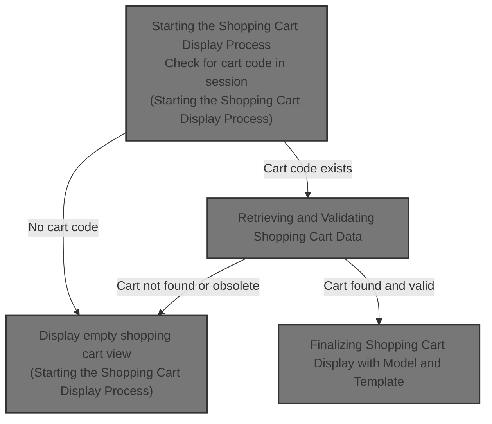

This document describes the flow of displaying the shopping cart to the user. It sets up page information, checks for a cart in the session, retrieves and validates detailed cart data including pricing and calculations, and then renders the cart view with the appropriate template. The flow takes an HTTP request with session data as input and returns a rendered shopping cart page.



# Starting the Shopping Cart Display Process

This section handles the initiation of the shopping cart display process by setting up page information, checking for an existing cart code in the session, and retrieving detailed cart data if a cart exists.

| Category       | Rule Name              | Description                                                                                                                                                               |
| -------------- | ---------------------- | ------------------------------------------------------------------------------------------------------------------------------------------------------------------------- |
| Business logic | Cart existence check   | If there is no cart code present in the user session, the system must display an empty shopping cart view.                                                                |
| Business logic | Retrieve cart data     | When a cart code exists in the session, the system must retrieve detailed shopping cart data associated with the customer and store to display the current cart contents. |
| Business logic | Page information setup | The system must set the page title to 'Place Order' localized to the user's locale before displaying the shopping cart.                                                   |

<SwmSnippet path="/shopizer/sm-shop/src/main/java/com/salesmanager/web/shop/controller/shoppingCart/ShoppingCartController.java" line="229">

---

Here we start by setting up page info and checking if there's a cart code in the session. If none, we return an empty cart view. Otherwise, we call the facade to get detailed cart data to continue the flow.

```java
    public String displayShoppingCart( final Model model, final HttpServletRequest request, final HttpServletResponse response, final Locale locale )
        throws Exception
    {

        LOG.info( "Starting to calculate shopping cart..." );
        
        
		//meta information
		PageInformation pageInformation = new PageInformation();
		pageInformation.setPageTitle(messages.getMessage("label.cart.placeorder", locale));
		request.setAttribute(Constants.REQUEST_PAGE_INFORMATION, pageInformation);
        
        
	    MerchantStore store = (MerchantStore) request.getAttribute(Constants.MERCHANT_STORE);
	    Customer customer = getSessionAttribute(  Constants.CUSTOMER, request );

        /** there must be a cart in the session **/
        String cartCode = (String)request.getSession().getAttribute(Constants.SHOPPING_CART);
        
        if(StringUtils.isBlank(cartCode)) {
        	//display empty cart
            StringBuilder template =
                    new StringBuilder().append( ControllerConstants.Tiles.ShoppingCart.shoppingCart ).append( "." ).append( store.getStoreTemplate() );
                return template.toString();
        }
                
        ShoppingCartData shoppingCart = shoppingCartFacade.getShoppingCartData(customer, store, cartCode);
```

---

</SwmSnippet>

## Retrieving and Validating Shopping Cart Data

```mermaid
%%{init: {"flowchart": {"defaultRenderer": "elk"}} }%%
flowchart TD
    node1{"Is customer provided?"}
    node1 -->|"Yes"| node2["Retrieve cart by customer"]
    node1 -->|"No"| node3{"Is shoppingCartId provided?"}
    node2 --> node4{"Is cart found?"}
    node3 -->|"Yes"| node5["Retrieve cart by shoppingCartId"]
    node3 -->|"No"| node6["Return null"]
    node4 -->|"Yes"| node7["Populate and calculate cart data"]
    node4 -->|"No"| node3
    node5 --> node7
    node7 --> node8["Return populated cart data"]
    node6 --> node8

    click node1 openCode "shopizer/sm-shop/src/main/java/com/salesmanager/web/shop/controller/shoppingCart/facade/ShoppingCartFacadeImpl.java:268:270"
    click node2 openCode "shopizer/sm-shop/src/main/java/com/salesmanager/web/shop/controller/shoppingCart/facade/ShoppingCartFacadeImpl.java:272:273"
    click node3 openCode "shopizer/sm-shop/src/main/java/com/salesmanager/web/shop/controller/shoppingCart/facade/ShoppingCartFacadeImpl.java:278:279"
    click node4 openCode "shopizer/sm-shop/src/main/java/com/salesmanager/web/shop/controller/shoppingCart/facade/ShoppingCartFacadeImpl.java:293:294"
    click node5 openCode "shopizer/sm-shop/src/main/java/com/salesmanager/web/shop/controller/shoppingCart/facade/ShoppingCartFacadeImpl.java:280:281"
    click node7 openCode "shopizer/sm-shop/src/main/java/com/salesmanager/web/shop/controller/shoppingCart/facade/ShoppingCartFacadeImpl.java:300:306"
    click node8 openCode "shopizer/sm-shop/src/main/java/com/salesmanager/web/shop/controller/shoppingCart/facade/ShoppingCartFacadeImpl.java:306:307"
classDef HeadingStyle fill:#777777,stroke:#333,stroke-width:2px;

%% Swimm:
%% %%{init: {"flowchart": {"defaultRenderer": "elk"}} }%%
%% flowchart TD
%%     node1{"Is customer provided?"}
%%     node1 -->|"Yes"| node2["Retrieve cart by customer"]
%%     node1 -->|"No"| node3{"Is <SwmToken path="shopizer/sm-shop/src/main/java/com/salesmanager/web/shop/controller/shoppingCart/facade/ShoppingCartFacadeImpl.java" pos="261:5:5" line-data="                                                 final String shoppingCartId )">`shoppingCartId`</SwmToken> provided?"}
%%     node2 --> node4{"Is cart found?"}
%%     node3 -->|"Yes"| node5["Retrieve cart by <SwmToken path="shopizer/sm-shop/src/main/java/com/salesmanager/web/shop/controller/shoppingCart/facade/ShoppingCartFacadeImpl.java" pos="261:5:5" line-data="                                                 final String shoppingCartId )">`shoppingCartId`</SwmToken>"]
%%     node3 -->|"No"| node6["Return null"]
%%     node4 -->|"Yes"| node7["Populate and calculate cart data"]
%%     node4 -->|"No"| node3
%%     node5 --> node7
%%     node7 --> node8["Return populated cart data"]
%%     node6 --> node8
%% 
%%     click node1 openCode "<SwmPath>[shopizer/…/facade/ShoppingCartFacadeImpl.java](shopizer/sm-shop/src/main/java/com/salesmanager/web/shop/controller/shoppingCart/facade/ShoppingCartFacadeImpl.java)</SwmPath>:268:270"
%%     click node2 openCode "<SwmPath>[shopizer/…/facade/ShoppingCartFacadeImpl.java](shopizer/sm-shop/src/main/java/com/salesmanager/web/shop/controller/shoppingCart/facade/ShoppingCartFacadeImpl.java)</SwmPath>:272:273"
%%     click node3 openCode "<SwmPath>[shopizer/…/facade/ShoppingCartFacadeImpl.java](shopizer/sm-shop/src/main/java/com/salesmanager/web/shop/controller/shoppingCart/facade/ShoppingCartFacadeImpl.java)</SwmPath>:278:279"
%%     click node4 openCode "<SwmPath>[shopizer/…/facade/ShoppingCartFacadeImpl.java](shopizer/sm-shop/src/main/java/com/salesmanager/web/shop/controller/shoppingCart/facade/ShoppingCartFacadeImpl.java)</SwmPath>:293:294"
%%     click node5 openCode "<SwmPath>[shopizer/…/facade/ShoppingCartFacadeImpl.java](shopizer/sm-shop/src/main/java/com/salesmanager/web/shop/controller/shoppingCart/facade/ShoppingCartFacadeImpl.java)</SwmPath>:280:281"
%%     click node7 openCode "<SwmPath>[shopizer/…/facade/ShoppingCartFacadeImpl.java](shopizer/sm-shop/src/main/java/com/salesmanager/web/shop/controller/shoppingCart/facade/ShoppingCartFacadeImpl.java)</SwmPath>:300:306"
%%     click node8 openCode "<SwmPath>[shopizer/…/facade/ShoppingCartFacadeImpl.java](shopizer/sm-shop/src/main/java/com/salesmanager/web/shop/controller/shoppingCart/facade/ShoppingCartFacadeImpl.java)</SwmPath>:306:307"
%% classDef HeadingStyle fill:#777777,stroke:#333,stroke-width:2px;
```



This section handles retrieving and validating shopping cart data based on customer or shopping cart ID inputs, ensuring the cart is current and properly populated before returning it.

| Category       | Rule Name                     | Description                                                                                                                                                                                                                                                                                                                                                                                 |
| -------------- | ----------------------------- | ------------------------------------------------------------------------------------------------------------------------------------------------------------------------------------------------------------------------------------------------------------------------------------------------------------------------------------------------------------------------------------------- |
| Business logic | Customer cart retrieval       | If a customer is provided, retrieve the shopping cart associated with that customer.                                                                                                                                                                                                                                                                                                        |
| Business logic | Fallback cart retrieval by ID | If no customer is provided or no cart is found for the customer, and a <SwmToken path="shopizer/sm-shop/src/main/java/com/salesmanager/web/shop/controller/shoppingCart/facade/ShoppingCartFacadeImpl.java" pos="261:5:5" line-data="                                                 final String shoppingCartId )">`shoppingCartId`</SwmToken> is provided, retrieve the cart by this ID. |
| Business logic | Obsolete cart deletion        | If a retrieved cart is marked as obsolete, delete it and return null instead of returning outdated cart data.                                                                                                                                                                                                                                                                               |
| Business logic | Populate cart data            | Before returning, populate the cart data with pricing, calculation, and language-specific details to ensure accurate display.                                                                                                                                                                                                                                                               |

<SwmSnippet path="/shopizer/sm-shop/src/main/java/com/salesmanager/web/shop/controller/shoppingCart/facade/ShoppingCartFacadeImpl.java" line="260">

---

In this snippet we check if there's a logged-in customer and try to get their cart via the service. If no customer, we plan to get the cart by code next.

```java
    public ShoppingCartData getShoppingCartData( final Customer customer, final MerchantStore store,
                                                 final String shoppingCartId )
        throws Exception
    {

        ShoppingCart cart = null;
        try
        {
            if ( customer != null )
            {
                LOG.info( "Reteriving customer shopping cart..." );

                cart = shoppingCartService.getShoppingCart( customer );

            }

            else
            {
```

---

</SwmSnippet>

<SwmSnippet path="/shopizer/sm-core/src/main/java/com/salesmanager/core/business/shoppingcart/service/ShoppingCartServiceImpl.java" line="68">

---

Here, the service fetches the cart for the customer, populates it, then checks if it's obsolete. If yes, it deletes the cart and returns null instead of returning the old cart.

```java
	public ShoppingCart getShoppingCart(final Customer customer) throws ServiceException {

		try {

			ShoppingCart shoppingCart = shoppingCartDao.getByCustomer(customer);
			populateShoppingCart(shoppingCart);
			if(shoppingCart!=null && shoppingCart.isObsolete()) {
				delete(shoppingCart);
				return null;
			} else {
				return shoppingCart;
			}


		} catch (Exception e) {
			throw new ServiceException(e);
		}

	}
```

---

</SwmSnippet>

<SwmSnippet path="/shopizer/sm-shop/src/main/java/com/salesmanager/web/shop/controller/shoppingCart/facade/ShoppingCartFacadeImpl.java" line="278">

---

We just got back from the service call. If the cart was null, we try to get it by code. Then we populate the cart data with pricing and calculation info before returning it.

```java
                if ( StringUtils.isNotBlank( shoppingCartId ) && cart == null )
                {
                    cart = shoppingCartService.getByCode( shoppingCartId, store );
                }

            }
        }
        catch ( ServiceException ex )
        {
            LOG.error( "Error while retriving cart from customer", ex );
        }
        catch( NoResultException nre) {
        	//nothing
        }

        if ( cart == null )
        {
            return null;
        }

        LOG.info( "Cart model found." );

        ShoppingCartDataPopulator shoppingCartDataPopulator = new ShoppingCartDataPopulator();
        shoppingCartDataPopulator.setShoppingCartCalculationService( shoppingCartCalculationService );
        shoppingCartDataPopulator.setPricingService( pricingService );

        Language language = (Language) getKeyValue( Constants.LANGUAGE );
        MerchantStore merchantStore = (MerchantStore) getKeyValue( Constants.MERCHANT_STORE );
        return shoppingCartDataPopulator.populate( cart, merchantStore, language );

    }
```

---

</SwmSnippet>

## Finalizing Shopping Cart Display with Model and Template

<SwmSnippet path="/shopizer/sm-shop/src/main/java/com/salesmanager/web/shop/controller/shoppingCart/ShoppingCartController.java" line="256">

---

We just got the populated cart data back. Here, we add it to the model for the view and then select the view template based on the store's template before returning it.

```java
        model.addAttribute( "cart", shoppingCart );

        /** template **/
        StringBuilder template =
            new StringBuilder().append( ControllerConstants.Tiles.ShoppingCart.shoppingCart ).append( "." ).append( store.getStoreTemplate() );
        return template.toString();

    }
```

---

</SwmSnippet>

&nbsp;

*This is an auto-generated document by Swimm 🌊 and has not yet been verified by a human*

<SwmMeta version="3.0.0" repo-id="Z2l0aHViJTNBJTNBU2hvcGl6ZXIlM0ElM0F1bWFsaW5nYXN3YW1p" repo-name="Shopizer"><sup>Powered by [Swimm](https://app.swimm.io/)</sup></SwmMeta>
