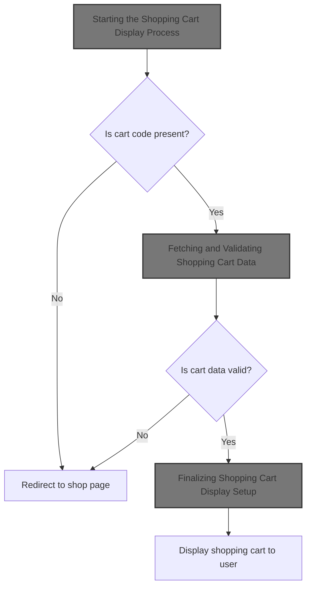

This document describes the process of displaying the shopping cart to the user by validating the cart code, retrieving and populating cart data, updating session and model attributes, and preparing the view template based on the store's theme.



# Starting the Shopping Cart Display Process

This section handles the initiation of the shopping cart display process by validating the shopping cart code and retrieving the shopping cart data for the customer and store.

| Category        | Rule Name                     | Description                                                                                                                                         |
| --------------- | ----------------------------- | --------------------------------------------------------------------------------------------------------------------------------------------------- |
| Data validation | Redirect on Missing Cart Code | If the shopping cart code is missing or blank, the user must be redirected to the main shop page.                                                   |
| Data validation | Redirect on Invalid Cart Data | If the shopping cart data cannot be retrieved for the given customer, store, and cart code, the user must be redirected to the main shop page.      |
| Business logic  | Fetch Cart Data for Display   | The shopping cart data must be fetched using the customer, merchant store, and shopping cart code to provide detailed cart information for display. |

<SwmSnippet path="/shopizer/sm-shop/src/main/java/com/salesmanager/web/shop/controller/shoppingCart/ShoppingCartController.java" line="267">

---

Here we start the shopping cart display by checking if the shopping cart code is present and valid. If not, we redirect to the shop page. Then we call the facade to get the shopping cart data for the customer and store, which is needed to fetch the detailed cart info.

```java
	public String displayShoppingCart(@ModelAttribute String shoppingCartCode, final Model model, HttpServletRequest request, final Locale locale) throws Exception{

			MerchantStore merchantStore = (MerchantStore)request.getAttribute(Constants.MERCHANT_STORE);
			Customer customer = getSessionAttribute(  Constants.CUSTOMER, request );
			
			if(StringUtils.isBlank(shoppingCartCode)) {
				return "redirect:/shop";
			}
			
			ShoppingCartData cart =  shoppingCartFacade.getShoppingCartData(customer,merchantStore,shoppingCartCode);
			if(cart==null) {
				return "redirect:/shop";
			}
			
			
```

---

</SwmSnippet>

## Fetching and Validating Shopping Cart Data

```mermaid
%%{init: {"flowchart": {"defaultRenderer": "elk"}} }%%
flowchart TD
    node1["Start getShoppingCartData"] --> node2{"Is customer provided?"}
    click node1 openCode "shopizer/sm-shop/src/main/java/com/salesmanager/web/shop/controller/shoppingCart/facade/ShoppingCartFacadeImpl.java:260:308"
    node2 -->|"Yes"| node3["Retrieve cart by customer"]
    click node2 openCode "shopizer/sm-shop/src/main/java/com/salesmanager/web/shop/controller/shoppingCart/facade/ShoppingCartFacadeImpl.java:268:274"
    node2 -->|"No"| node4{"Is shoppingCartId provided and cart is null?"}
    click node4 openCode "shopizer/sm-shop/src/main/java/com/salesmanager/web/shop/controller/shoppingCart/facade/ShoppingCartFacadeImpl.java:278:281"
    node4 -->|"Yes"| node5["Retrieve cart by shoppingCartId"]
    click node5 openCode "shopizer/sm-shop/src/main/java/com/salesmanager/web/shop/controller/shoppingCart/facade/ShoppingCartFacadeImpl.java:278:281"
    node4 -->|"No"| node6["Proceed"]
    node3 --> node6
    node5 --> node6
    node6 --> node7{"Is cart found?"}
    click node7 openCode "shopizer/sm-shop/src/main/java/com/salesmanager/web/shop/controller/shoppingCart/facade/ShoppingCartFacadeImpl.java:293:296"
    node7 -->|"No"| node8["Return null"]
    click node8 openCode "shopizer/sm-shop/src/main/java/com/salesmanager/web/shop/controller/shoppingCart/facade/ShoppingCartFacadeImpl.java:293:296"
    node7 -->|"Yes"| node9["Populate shopping cart data"]
    click node9 openCode "shopizer/sm-shop/src/main/java/com/salesmanager/web/shop/controller/shoppingCart/facade/ShoppingCartFacadeImpl.java:300:306"
    node9 --> node10["Return populated cart data"]
    click node10 openCode "shopizer/sm-shop/src/main/java/com/salesmanager/web/shop/controller/shoppingCart/facade/ShoppingCartFacadeImpl.java:306:308"

classDef HeadingStyle fill:#777777,stroke:#333,stroke-width:2px;

%% Swimm:
%% %%{init: {"flowchart": {"defaultRenderer": "elk"}} }%%
%% flowchart TD
%%     node1["Start <SwmToken path="shopizer/sm-shop/src/main/java/com/salesmanager/web/shop/controller/shoppingCart/ShoppingCartController.java" pos="276:9:9" line-data="			ShoppingCartData cart =  shoppingCartFacade.getShoppingCartData(customer,merchantStore,shoppingCartCode);">`getShoppingCartData`</SwmToken>"] --> node2{"Is customer provided?"}
%%     click node1 openCode "<SwmPath>[shopizer/…/facade/ShoppingCartFacadeImpl.java](shopizer/sm-shop/src/main/java/com/salesmanager/web/shop/controller/shoppingCart/facade/ShoppingCartFacadeImpl.java)</SwmPath>:260:308"
%%     node2 -->|"Yes"| node3["Retrieve cart by customer"]
%%     click node2 openCode "<SwmPath>[shopizer/…/facade/ShoppingCartFacadeImpl.java](shopizer/sm-shop/src/main/java/com/salesmanager/web/shop/controller/shoppingCart/facade/ShoppingCartFacadeImpl.java)</SwmPath>:268:274"
%%     node2 -->|"No"| node4{"Is <SwmToken path="shopizer/sm-shop/src/main/java/com/salesmanager/web/shop/controller/shoppingCart/facade/ShoppingCartFacadeImpl.java" pos="261:5:5" line-data="                                                 final String shoppingCartId )">`shoppingCartId`</SwmToken> provided and cart is null?"}
%%     click node4 openCode "<SwmPath>[shopizer/…/facade/ShoppingCartFacadeImpl.java](shopizer/sm-shop/src/main/java/com/salesmanager/web/shop/controller/shoppingCart/facade/ShoppingCartFacadeImpl.java)</SwmPath>:278:281"
%%     node4 -->|"Yes"| node5["Retrieve cart by <SwmToken path="shopizer/sm-shop/src/main/java/com/salesmanager/web/shop/controller/shoppingCart/facade/ShoppingCartFacadeImpl.java" pos="261:5:5" line-data="                                                 final String shoppingCartId )">`shoppingCartId`</SwmToken>"]
%%     click node5 openCode "<SwmPath>[shopizer/…/facade/ShoppingCartFacadeImpl.java](shopizer/sm-shop/src/main/java/com/salesmanager/web/shop/controller/shoppingCart/facade/ShoppingCartFacadeImpl.java)</SwmPath>:278:281"
%%     node4 -->|"No"| node6["Proceed"]
%%     node3 --> node6
%%     node5 --> node6
%%     node6 --> node7{"Is cart found?"}
%%     click node7 openCode "<SwmPath>[shopizer/…/facade/ShoppingCartFacadeImpl.java](shopizer/sm-shop/src/main/java/com/salesmanager/web/shop/controller/shoppingCart/facade/ShoppingCartFacadeImpl.java)</SwmPath>:293:296"
%%     node7 -->|"No"| node8["Return null"]
%%     click node8 openCode "<SwmPath>[shopizer/…/facade/ShoppingCartFacadeImpl.java](shopizer/sm-shop/src/main/java/com/salesmanager/web/shop/controller/shoppingCart/facade/ShoppingCartFacadeImpl.java)</SwmPath>:293:296"
%%     node7 -->|"Yes"| node9["Populate shopping cart data"]
%%     click node9 openCode "<SwmPath>[shopizer/…/facade/ShoppingCartFacadeImpl.java](shopizer/sm-shop/src/main/java/com/salesmanager/web/shop/controller/shoppingCart/facade/ShoppingCartFacadeImpl.java)</SwmPath>:300:306"
%%     node9 --> node10["Return populated cart data"]
%%     click node10 openCode "<SwmPath>[shopizer/…/facade/ShoppingCartFacadeImpl.java](shopizer/sm-shop/src/main/java/com/salesmanager/web/shop/controller/shoppingCart/facade/ShoppingCartFacadeImpl.java)</SwmPath>:306:308"
%% 
%% classDef HeadingStyle fill:#777777,stroke:#333,stroke-width:2px;
```



This section handles fetching and validating shopping cart data for customers or by shopping cart ID, ensuring the cart is current and populated with pricing and calculation details before returning.

| Category       | Rule Name               | Description                                                                                                                                                                                                                                                                                                                                                                                                                                                                                                                                                                                                                                                                          |
| -------------- | ----------------------- | ------------------------------------------------------------------------------------------------------------------------------------------------------------------------------------------------------------------------------------------------------------------------------------------------------------------------------------------------------------------------------------------------------------------------------------------------------------------------------------------------------------------------------------------------------------------------------------------------------------------------------------------------------------------------------------ |
| Business logic | Customer cart priority  | If a customer is provided, the system must retrieve the shopping cart associated with that customer first before attempting other retrieval methods.                                                                                                                                                                                                                                                                                                                                                                                                                                                                                                                                 |
| Business logic | Fallback cart retrieval | If no customer is provided or the customer cart is null, and a <SwmToken path="shopizer/sm-shop/src/main/java/com/salesmanager/web/shop/controller/shoppingCart/facade/ShoppingCartFacadeImpl.java" pos="261:5:5" line-data="                                                 final String shoppingCartId )">`shoppingCartId`</SwmToken> is provided, the system must attempt to retrieve the cart by the <SwmToken path="shopizer/sm-shop/src/main/java/com/salesmanager/web/shop/controller/shoppingCart/facade/ShoppingCartFacadeImpl.java" pos="261:5:5" line-data="                                                 final String shoppingCartId )">`shoppingCartId`</SwmToken>. |
| Business logic | Obsolete cart handling  | If a retrieved shopping cart is marked as obsolete, it must be deleted and treated as if no cart was found (return null).                                                                                                                                                                                                                                                                                                                                                                                                                                                                                                                                                            |
| Business logic | Null cart return        | If no valid shopping cart is found after all retrieval attempts, the system must return null to indicate no cart data is available.                                                                                                                                                                                                                                                                                                                                                                                                                                                                                                                                                  |
| Business logic | Cart data population    | Before returning, the shopping cart data must be populated with pricing, calculation, language, and merchant store details to provide a complete and accurate cart representation.                                                                                                                                                                                                                                                                                                                                                                                                                                                                                                   |

<SwmSnippet path="/shopizer/sm-shop/src/main/java/com/salesmanager/web/shop/controller/shoppingCart/facade/ShoppingCartFacadeImpl.java" line="260">

---

We fetch the cart by customer first to get the right cart for logged-in users.

```java
    public ShoppingCartData getShoppingCartData( final Customer customer, final MerchantStore store,
                                                 final String shoppingCartId )
        throws Exception
    {

        ShoppingCart cart = null;
        try
        {
            if ( customer != null )
            {
                LOG.info( "Reteriving customer shopping cart..." );

                cart = shoppingCartService.getShoppingCart( customer );

            }

            else
            {
```

---

</SwmSnippet>

<SwmSnippet path="/shopizer/sm-core/src/main/java/com/salesmanager/core/business/shoppingcart/service/ShoppingCartServiceImpl.java" line="68">

---

<SwmToken path="shopizer/sm-core/src/main/java/com/salesmanager/core/business/shoppingcart/service/ShoppingCartServiceImpl.java" pos="68:5:5" line-data="	public ShoppingCart getShoppingCart(final Customer customer) throws ServiceException {">`getShoppingCart`</SwmToken> fetches the cart for a customer, fills in extra details, then checks if it's obsolete. If obsolete, it deletes the cart and returns null, otherwise returns the valid cart.

```java
	public ShoppingCart getShoppingCart(final Customer customer) throws ServiceException {

		try {

			ShoppingCart shoppingCart = shoppingCartDao.getByCustomer(customer);
			populateShoppingCart(shoppingCart);
			if(shoppingCart!=null && shoppingCart.isObsolete()) {
				delete(shoppingCart);
				return null;
			} else {
				return shoppingCart;
			}


		} catch (Exception e) {
			throw new ServiceException(e);
		}

	}
```

---

</SwmSnippet>

<SwmSnippet path="/shopizer/sm-shop/src/main/java/com/salesmanager/web/shop/controller/shoppingCart/facade/ShoppingCartFacadeImpl.java" line="278">

---

After returning from the service layer, if the cart is still null and we have a cart code, we try to get the cart by code. Then we populate the cart data with pricing and calculation info before returning it in <SwmToken path="shopizer/sm-shop/src/main/java/com/salesmanager/web/shop/controller/shoppingCart/ShoppingCartController.java" pos="276:9:9" line-data="			ShoppingCartData cart =  shoppingCartFacade.getShoppingCartData(customer,merchantStore,shoppingCartCode);">`getShoppingCartData`</SwmToken>.

```java
                if ( StringUtils.isNotBlank( shoppingCartId ) && cart == null )
                {
                    cart = shoppingCartService.getByCode( shoppingCartId, store );
                }

            }
        }
        catch ( ServiceException ex )
        {
            LOG.error( "Error while retriving cart from customer", ex );
        }
        catch( NoResultException nre) {
        	//nothing
        }

        if ( cart == null )
        {
            return null;
        }

        LOG.info( "Cart model found." );

        ShoppingCartDataPopulator shoppingCartDataPopulator = new ShoppingCartDataPopulator();
        shoppingCartDataPopulator.setShoppingCartCalculationService( shoppingCartCalculationService );
        shoppingCartDataPopulator.setPricingService( pricingService );

        Language language = (Language) getKeyValue( Constants.LANGUAGE );
        MerchantStore merchantStore = (MerchantStore) getKeyValue( Constants.MERCHANT_STORE );
        return shoppingCartDataPopulator.populate( cart, merchantStore, language );

    }
```

---

</SwmSnippet>

## Finalizing Shopping Cart Display Setup

<SwmSnippet path="/shopizer/sm-shop/src/main/java/com/salesmanager/web/shop/controller/shoppingCart/ShoppingCartController.java" line="282">

---

Back in <SwmToken path="shopizer/sm-shop/src/main/java/com/salesmanager/web/shop/controller/shoppingCart/ShoppingCartController.java" pos="267:5:5" line-data="	public String displayShoppingCart(@ModelAttribute String shoppingCartCode, final Model model, HttpServletRequest request, final Locale locale) throws Exception{">`displayShoppingCart`</SwmToken>, after getting the cart data, we set page info, store the cart code in session, add the cart to the model, and return the view template based on the store's theme.

```java
			//meta information
			PageInformation pageInformation = new PageInformation();
			pageInformation.setPageTitle(messages.getMessage("label.cart.placeorder", locale));
			request.setAttribute(Constants.REQUEST_PAGE_INFORMATION, pageInformation);
			request.getSession().setAttribute(Constants.SHOPPING_CART, cart.getCode());
	        model.addAttribute("cart", cart);

	        /** template **/
	        StringBuilder template =
	            new StringBuilder().append( ControllerConstants.Tiles.ShoppingCart.shoppingCart ).append( "." ).append( merchantStore.getStoreTemplate() );
	        return template.toString();
			


	}
```

---

</SwmSnippet>

&nbsp;

*This is an auto-generated document by Swimm 🌊 and has not yet been verified by a human*

<SwmMeta version="3.0.0" repo-id="Z2l0aHViJTNBJTNBU2hvcGl6ZXIlM0ElM0F1bWFsaW5nYXN3YW1p" repo-name="Shopizer"><sup>Powered by [Swimm](https://app.swimm.io/)</sup></SwmMeta>
