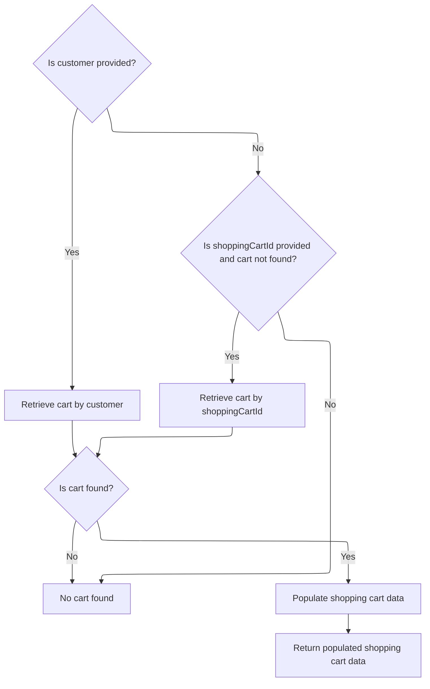

This document explains the flow of displaying the shopping cart to the user. It validates the cart code, retrieves and populates the cart data based on customer or cart ID, and prepares the page information and template for display.

# Starting the shopping cart display process

This section handles the initiation of the shopping cart display process by validating the shopping cart code, retrieving the merchant store and customer information, and fetching the shopping cart data to determine the next step in the user flow.

| Category        | Rule Name                             | Description                                                                                                                                                  |
| --------------- | ------------------------------------- | ------------------------------------------------------------------------------------------------------------------------------------------------------------ |
| Data validation | Shopping cart code validation         | If the shopping cart code is missing or blank, the user must be redirected to the main shop page.                                                            |
| Data validation | Shopping cart data existence check    | If the shopping cart data cannot be found for the given cart code, merchant store, and customer, the user must be redirected to the main shop page.          |
| Business logic  | Merchant store and customer retrieval | The system must retrieve the current merchant store and customer information from the session or request to personalize and validate the shopping cart data. |

<SwmSnippet path="/shopizer/sm-shop/src/main/java/com/salesmanager/web/shop/controller/shoppingCart/ShoppingCartController.java" line="267">

---

Here we start the shopping cart display by checking if the shopping cart code is present and valid. We get the merchant store and customer from the request/session, then call the facade to fetch the shopping cart data. If the cart data is missing, we redirect to the shop page. This sets up the flow to get the cart details next.

```java
	public String displayShoppingCart(@ModelAttribute String shoppingCartCode, final Model model, HttpServletRequest request, final Locale locale) throws Exception{

			MerchantStore merchantStore = (MerchantStore)request.getAttribute(Constants.MERCHANT_STORE);
			Customer customer = getSessionAttribute(  Constants.CUSTOMER, request );
			
			if(StringUtils.isBlank(shoppingCartCode)) {
				return "redirect:/shop";
			}
			
			ShoppingCartData cart =  shoppingCartFacade.getShoppingCartData(customer,merchantStore,shoppingCartCode);
			if(cart==null) {
				return "redirect:/shop";
			}
			
			
```

---

</SwmSnippet>

## Fetching and validating the shopping cart data



This section handles fetching and validating the shopping cart data for a customer or by shopping cart ID, ensuring the cart is current and populated with necessary pricing and calculation details.

| Category       | Rule Name                                   | Description                                                                                                                                                                                                                                                                                                                                                                                                          |
| -------------- | ------------------------------------------- | -------------------------------------------------------------------------------------------------------------------------------------------------------------------------------------------------------------------------------------------------------------------------------------------------------------------------------------------------------------------------------------------------------------------- |
| Business logic | Customer cart retrieval priority            | The system must first attempt to retrieve the shopping cart associated with the provided customer before attempting to retrieve a cart by <SwmToken path="shopizer/sm-shop/src/main/java/com/salesmanager/web/shop/controller/shoppingCart/facade/ShoppingCartFacadeImpl.java" pos="261:5:5" line-data="                                                 final String shoppingCartId )">`shoppingCartId`</SwmToken>. |
| Business logic | Fallback cart retrieval by ID               | If no cart is found for the customer, and a <SwmToken path="shopizer/sm-shop/src/main/java/com/salesmanager/web/shop/controller/shoppingCart/facade/ShoppingCartFacadeImpl.java" pos="261:5:5" line-data="                                                 final String shoppingCartId )">`shoppingCartId`</SwmToken> is provided, the system must attempt to retrieve the cart by this ID.                          |
| Business logic | Obsolete cart invalidation                  | If a retrieved shopping cart is marked as obsolete, it must be deleted and treated as non-existent, returning null instead of the cart.                                                                                                                                                                                                                                                                              |
| Business logic | Populate cart with pricing and calculations | Before returning a valid shopping cart, the system must populate it with pricing and calculation details relevant to the merchant store and language context.                                                                                                                                                                                                                                                        |

<SwmSnippet path="/shopizer/sm-shop/src/main/java/com/salesmanager/web/shop/controller/shoppingCart/facade/ShoppingCartFacadeImpl.java" line="260">

---

We try to get the cart by customer first, then fallback to cart code if needed.

```java
    public ShoppingCartData getShoppingCartData( final Customer customer, final MerchantStore store,
                                                 final String shoppingCartId )
        throws Exception
    {

        ShoppingCart cart = null;
        try
        {
            if ( customer != null )
            {
                LOG.info( "Reteriving customer shopping cart..." );

                cart = shoppingCartService.getShoppingCart( customer );

            }

            else
            {
```

---

</SwmSnippet>

<SwmSnippet path="/shopizer/sm-core/src/main/java/com/salesmanager/core/business/shoppingcart/service/ShoppingCartServiceImpl.java" line="68">

---

In <SwmToken path="shopizer/sm-core/src/main/java/com/salesmanager/core/business/shoppingcart/service/ShoppingCartServiceImpl.java" pos="68:5:5" line-data="	public ShoppingCart getShoppingCart(final Customer customer) throws ServiceException {">`getShoppingCart`</SwmToken> we fetch the cart from the DAO, then populate it with extra data. If the cart is marked obsolete, we delete it and return null to avoid using stale carts. Otherwise, we return the valid cart.

```java
	public ShoppingCart getShoppingCart(final Customer customer) throws ServiceException {

		try {

			ShoppingCart shoppingCart = shoppingCartDao.getByCustomer(customer);
			populateShoppingCart(shoppingCart);
			if(shoppingCart!=null && shoppingCart.isObsolete()) {
				delete(shoppingCart);
				return null;
			} else {
				return shoppingCart;
			}


		} catch (Exception e) {
			throw new ServiceException(e);
		}

	}
```

---

</SwmSnippet>

<SwmSnippet path="/shopizer/sm-shop/src/main/java/com/salesmanager/web/shop/controller/shoppingCart/facade/ShoppingCartFacadeImpl.java" line="278">

---

After returning from <SwmToken path="shopizer/sm-shop/src/main/java/com/salesmanager/web/shop/controller/shoppingCart/facade/ShoppingCartFacadeImpl.java" pos="272:7:7" line-data="                cart = shoppingCartService.getShoppingCart( customer );">`getShoppingCart`</SwmToken> in the service, here in <SwmToken path="shopizer/sm-shop/src/main/java/com/salesmanager/web/shop/controller/shoppingCart/ShoppingCartController.java" pos="276:9:9" line-data="			ShoppingCartData cart =  shoppingCartFacade.getShoppingCartData(customer,merchantStore,shoppingCartCode);">`getShoppingCartData`</SwmToken> we try to get the cart by code if the customer cart was null. If still null, we return null. Otherwise, we populate the cart data with pricing and calculation info, then return it.

```java
                if ( StringUtils.isNotBlank( shoppingCartId ) && cart == null )
                {
                    cart = shoppingCartService.getByCode( shoppingCartId, store );
                }

            }
        }
        catch ( ServiceException ex )
        {
            LOG.error( "Error while retriving cart from customer", ex );
        }
        catch( NoResultException nre) {
        	//nothing
        }

        if ( cart == null )
        {
            return null;
        }

        LOG.info( "Cart model found." );

        ShoppingCartDataPopulator shoppingCartDataPopulator = new ShoppingCartDataPopulator();
        shoppingCartDataPopulator.setShoppingCartCalculationService( shoppingCartCalculationService );
        shoppingCartDataPopulator.setPricingService( pricingService );

        Language language = (Language) getKeyValue( Constants.LANGUAGE );
        MerchantStore merchantStore = (MerchantStore) getKeyValue( Constants.MERCHANT_STORE );
        return shoppingCartDataPopulator.populate( cart, merchantStore, language );

    }
```

---

</SwmSnippet>

## Finalizing the shopping cart display setup

<SwmSnippet path="/shopizer/sm-shop/src/main/java/com/salesmanager/web/shop/controller/shoppingCart/ShoppingCartController.java" line="282">

---

Back in <SwmToken path="shopizer/sm-shop/src/main/java/com/salesmanager/web/shop/controller/shoppingCart/ShoppingCartController.java" pos="267:5:5" line-data="	public String displayShoppingCart(@ModelAttribute String shoppingCartCode, final Model model, HttpServletRequest request, final Locale locale) throws Exception{">`displayShoppingCart`</SwmToken> after getting the cart data, we set page title info, store the cart code in session, add the cart to the model, and return the view template path based on the store's template.

```java
			//meta information
			PageInformation pageInformation = new PageInformation();
			pageInformation.setPageTitle(messages.getMessage("label.cart.placeorder", locale));
			request.setAttribute(Constants.REQUEST_PAGE_INFORMATION, pageInformation);
			request.getSession().setAttribute(Constants.SHOPPING_CART, cart.getCode());
	        model.addAttribute("cart", cart);

	        /** template **/
	        StringBuilder template =
	            new StringBuilder().append( ControllerConstants.Tiles.ShoppingCart.shoppingCart ).append( "." ).append( merchantStore.getStoreTemplate() );
	        return template.toString();
			


	}
```

---

</SwmSnippet>

&nbsp;

*This is an auto-generated document by Swimm 🌊 and has not yet been verified by a human*

<SwmMeta version="3.0.0" repo-id="Z2l0aHViJTNBJTNBU2hvcGl6ZXIlM0ElM0F1bWFsaW5nYXN3YW1p" repo-name="Shopizer"><sup>Powered by [Swimm](https://app.swimm.io/)</sup></SwmMeta>
