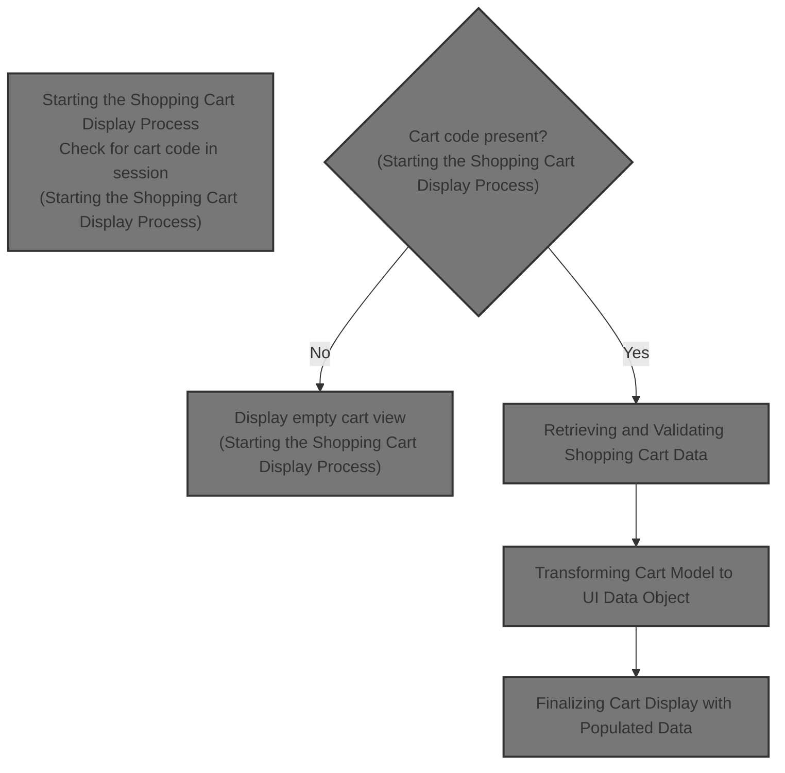
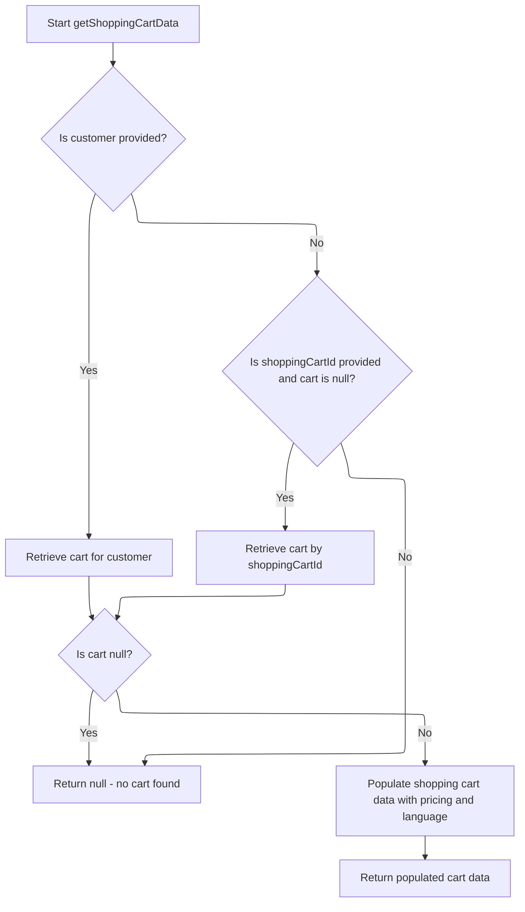
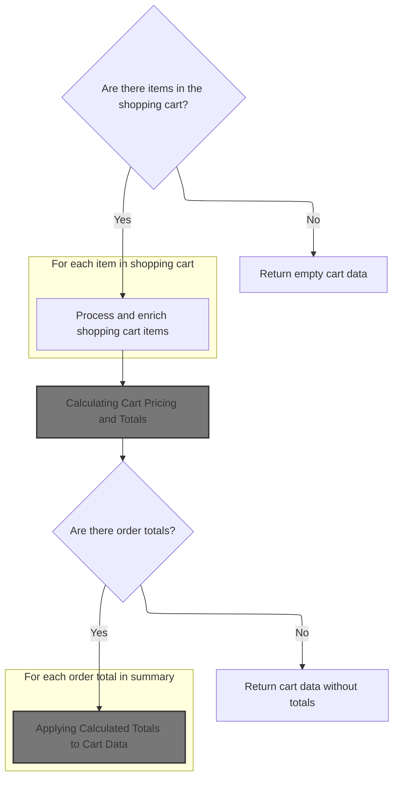
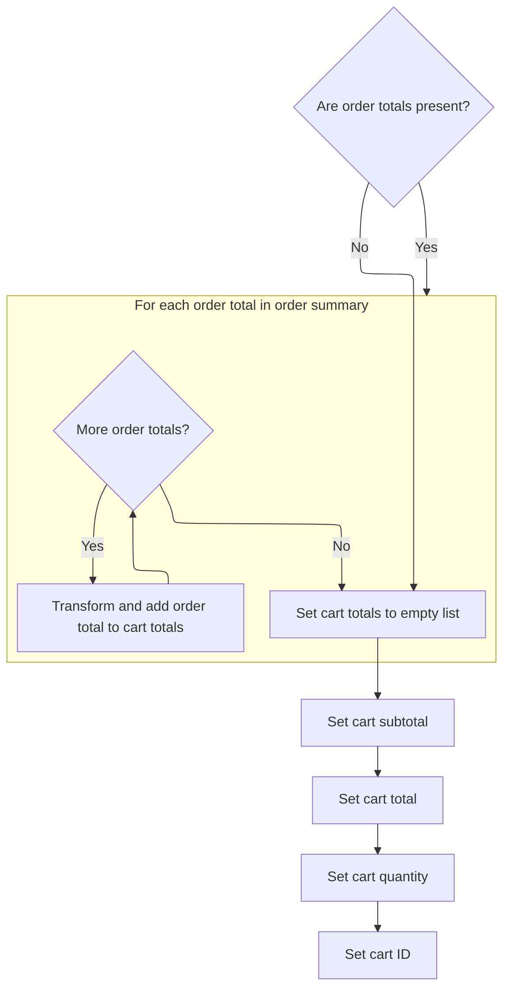
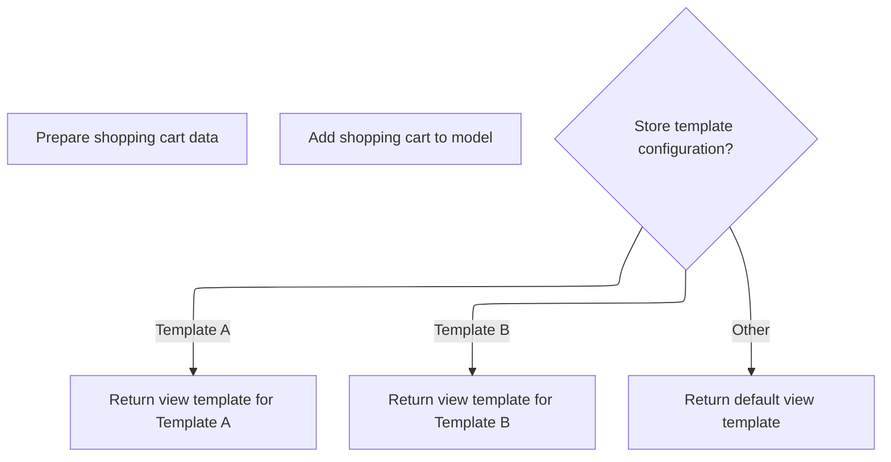

This document describes the flow for displaying the shopping cart in the e-commerce platform. It includes checking for a cart in the user session, retrieving and validating cart data, enriching the cart with product and pricing details, calculating totals, and rendering the cart page with the appropriate template.



# Starting the Shopping Cart Display Process

This section handles the display process of the shopping cart in the e-commerce platform, determining whether to show an empty cart or populate it with detailed cart data.

| Category       | Rule Name               | Description                                                                                                               |
| -------------- | ----------------------- | ------------------------------------------------------------------------------------------------------------------------- |
| Business logic | Empty cart display      | If there is no cart code in the user's session, the system must display an empty shopping cart view.                      |
| Business logic | Populate cart with data | If a cart code exists in the user's session, the system must fetch detailed shopping cart data to populate the cart view. |
| Business logic | Page meta information   | The shopping cart page must include meta information such as the page title to enhance user experience and SEO.           |

<SwmSnippet path="/shopizer/sm-shop/src/main/java/com/salesmanager/web/shop/controller/shoppingCart/ShoppingCartController.java" line="229">

---

We check if there's a cart code; if not, we show an empty cart. If there is, we fetch detailed cart data via ShoppingCartFacadeImpl.getShoppingCartData to fill the cart view.

```java
    public String displayShoppingCart( final Model model, final HttpServletRequest request, final HttpServletResponse response, final Locale locale )
        throws Exception
    {

        LOG.info( "Starting to calculate shopping cart..." );
        
        
		//meta information
		PageInformation pageInformation = new PageInformation();
		pageInformation.setPageTitle(messages.getMessage("label.cart.placeorder", locale));
		request.setAttribute(Constants.REQUEST_PAGE_INFORMATION, pageInformation);
        
        
	    MerchantStore store = (MerchantStore) request.getAttribute(Constants.MERCHANT_STORE);
	    Customer customer = getSessionAttribute(  Constants.CUSTOMER, request );

        /** there must be a cart in the session **/
        String cartCode = (String)request.getSession().getAttribute(Constants.SHOPPING_CART);
        
        if(StringUtils.isBlank(cartCode)) {
        	//display empty cart
            StringBuilder template =
                    new StringBuilder().append( ControllerConstants.Tiles.ShoppingCart.shoppingCart ).append( "." ).append( store.getStoreTemplate() );
                return template.toString();
        }
                
        ShoppingCartData shoppingCart = shoppingCartFacade.getShoppingCartData(customer, store, cartCode);
```

---

</SwmSnippet>

## Retrieving and Validating Shopping Cart Data



This section describes the process of retrieving and validating shopping cart data for a customer or by cart identifier, ensuring the cart is current and enriched with pricing and language details for UI display.

| Category       | Rule Name                     | Description                                                                                                                        |
| -------------- | ----------------------------- | ---------------------------------------------------------------------------------------------------------------------------------- |
| Business logic | Customer cart retrieval       | If a customer is provided, retrieve the shopping cart linked to that customer from the database.                                   |
| Business logic | Fallback cart retrieval by ID | If no customer is provided or no cart is found for the customer, and a shopping cart ID is provided, retrieve the cart by this ID. |
| Business logic | Obsolete cart handling        | If a retrieved cart is marked as obsolete, delete it and do not return it to avoid using invalid or outdated cart data.            |
| Business logic | Null cart return              | If no cart is found by customer or cart ID, return null indicating no valid shopping cart is available.                            |
| Business logic | Cart data enrichment          | Before returning, enrich the shopping cart data with pricing calculations and language settings to prepare it for display.         |

<SwmSnippet path="/shopizer/sm-shop/src/main/java/com/salesmanager/web/shop/controller/shoppingCart/facade/ShoppingCartFacadeImpl.java" line="260">

---

In <SwmToken path="shopizer/sm-shop/src/main/java/com/salesmanager/web/shop/controller/shoppingCart/facade/ShoppingCartFacadeImpl.java" pos="260:5:5" line-data="    public ShoppingCartData getShoppingCartData( final Customer customer, final MerchantStore store,">`getShoppingCartData`</SwmToken> we first try to get the cart linked to the logged-in customer by calling ShoppingCartServiceImpl.getShoppingCart. This fetches the cart from the database and applies business rules. If no customer is present, we try other ways to get the cart.

```java
    public ShoppingCartData getShoppingCartData( final Customer customer, final MerchantStore store,
                                                 final String shoppingCartId )
        throws Exception
    {

        ShoppingCart cart = null;
        try
        {
            if ( customer != null )
            {
                LOG.info( "Reteriving customer shopping cart..." );

                cart = shoppingCartService.getShoppingCart( customer );

            }

            else
            {
```

---

</SwmSnippet>

<SwmSnippet path="/shopizer/sm-core/src/main/java/com/salesmanager/core/business/shoppingcart/service/ShoppingCartServiceImpl.java" line="68">

---

GetShoppingCart fetches the cart from the DAO, enriches it with <SwmToken path="shopizer/sm-core/src/main/java/com/salesmanager/core/business/shoppingcart/service/ShoppingCartServiceImpl.java" pos="73:1:1" line-data="			populateShoppingCart(shoppingCart);">`populateShoppingCart`</SwmToken>, then checks if it's obsolete. If obsolete, it deletes the cart and returns null to avoid using invalid data.

```java
	public ShoppingCart getShoppingCart(final Customer customer) throws ServiceException {

		try {

			ShoppingCart shoppingCart = shoppingCartDao.getByCustomer(customer);
			populateShoppingCart(shoppingCart);
			if(shoppingCart!=null && shoppingCart.isObsolete()) {
				delete(shoppingCart);
				return null;
			} else {
				return shoppingCart;
			}


		} catch (Exception e) {
			throw new ServiceException(e);
		}

	}
```

---

</SwmSnippet>

<SwmSnippet path="/shopizer/sm-shop/src/main/java/com/salesmanager/web/shop/controller/shoppingCart/facade/ShoppingCartFacadeImpl.java" line="278">

---

After trying to get the cart from the customer, if it's still null and we have a cart code, we fetch the cart by code. Then we use ShoppingCartDataPopulator.populate to convert and enrich the cart model into a data object ready for the UI.

```java
                if ( StringUtils.isNotBlank( shoppingCartId ) && cart == null )
                {
                    cart = shoppingCartService.getByCode( shoppingCartId, store );
                }

            }
        }
        catch ( ServiceException ex )
        {
            LOG.error( "Error while retriving cart from customer", ex );
        }
        catch( NoResultException nre) {
        	//nothing
        }

        if ( cart == null )
        {
            return null;
        }

        LOG.info( "Cart model found." );

        ShoppingCartDataPopulator shoppingCartDataPopulator = new ShoppingCartDataPopulator();
        shoppingCartDataPopulator.setShoppingCartCalculationService( shoppingCartCalculationService );
        shoppingCartDataPopulator.setPricingService( pricingService );

        Language language = (Language) getKeyValue( Constants.LANGUAGE );
        MerchantStore merchantStore = (MerchantStore) getKeyValue( Constants.MERCHANT_STORE );
        return shoppingCartDataPopulator.populate( cart, merchantStore, language );

    }
```

---

</SwmSnippet>

## Transforming Cart Model to UI Data Object



This section transforms the shopping cart model into a UI-friendly data object, enriching cart items with product details and calculating pricing totals.

| Category       | Rule Name                      | Description                                                                                                                                  |
| -------------- | ------------------------------ | -------------------------------------------------------------------------------------------------------------------------------------------- |
| Business logic | Empty cart handling            | If the shopping cart contains no items, the system returns an empty cart data object without any item details or totals.                     |
| Business logic | Item detail enrichment         | Each item in the cart must be transformed to include product code, name, price, image, quantity, and attribute options for UI display.       |
| Business logic | Total quantity tracking        | The total quantity of all items in the cart must be calculated and included in the cart data object.                                         |
| Business logic | Order totals calculation       | The system must calculate order totals including taxes, discounts, and other charges based on the cart items and store settings.             |
| Business logic | Conditional totals application | If order totals are available after calculation, they must be applied to the cart data; otherwise, the cart data is returned without totals. |

<SwmSnippet path="/shopizer/sm-shop/src/main/java/com/salesmanager/web/populator/shoppingCart/ShoppingCartDataPopulator.java" line="73">

---

Here we transform each cart item into a UI-friendly object, adding product codes, names, prices, images, and attributes like options and values. We also track total quantity.

```java
    public ShoppingCartData populate(final ShoppingCart shoppingCart,
                                     final ShoppingCartData cart, final MerchantStore store, final Language language) {

    	int cartQuantity = 0;
        cart.setCode(shoppingCart.getShoppingCartCode());
        Set<com.salesmanager.core.business.shoppingcart.model.ShoppingCartItem> items = shoppingCart.getLineItems();
        List<ShoppingCartItem> shoppingCartItemsList=Collections.emptyList();
        try{
            if(items!=null) {
                shoppingCartItemsList=new ArrayList<ShoppingCartItem>();
                for(com.salesmanager.core.business.shoppingcart.model.ShoppingCartItem item : items) {

                    ShoppingCartItem shoppingCartItem = new ShoppingCartItem();
                    shoppingCartItem.setCode(cart.getCode());
                    shoppingCartItem.setProductCode(item.getProduct().getSku());
                    shoppingCartItem.setProductVirtual(item.isProductVirtual());

                    shoppingCartItem.setProductId(item.getProductId());
                    shoppingCartItem.setId(item.getId());
                    shoppingCartItem.setName(item.getProduct().getProductDescription().getName());

                    shoppingCartItem.setPrice(pricingService.getDisplayAmount(item.getItemPrice(),store));
                    shoppingCartItem.setQuantity(item.getQuantity());
                    
                    
                    cartQuantity = cartQuantity + item.getQuantity();
                    
                    shoppingCartItem.setProductPrice(item.getItemPrice());
                    shoppingCartItem.setSubTotal(pricingService.getDisplayAmount(item.getSubTotal(), store));
                    ProductImage image = item.getProduct().getProductImage();
                    if(image!=null) {
                        String imagePath = ImageFilePathUtils.buildProductImageFilePath(store, item.getProduct().getSku(), image.getProductImage());
                        shoppingCartItem.setImage(imagePath);
                    }
                    Set<com.salesmanager.core.business.shoppingcart.model.ShoppingCartAttributeItem> attributes = item.getAttributes();
                    if(attributes!=null) {
                        List<ShoppingCartAttribute> cartAttributes = new ArrayList<ShoppingCartAttribute>();
                        for(com.salesmanager.core.business.shoppingcart.model.ShoppingCartAttributeItem attribute : attributes) {
                            ShoppingCartAttribute cartAttribute = new ShoppingCartAttribute();
                            cartAttribute.setId(attribute.getId());
                            cartAttribute.setAttributeId(attribute.getProductAttributeId());
                            cartAttribute.setOptionId(attribute.getProductAttribute().getProductOption().getId());
                            cartAttribute.setOptionValueId(attribute.getProductAttribute().getProductOptionValue().getId());
                            List<ProductOptionDescription> optionDescriptions = attribute.getProductAttribute().getProductOption().getDescriptionsSettoList();
                            List<ProductOptionValueDescription> optionValueDescriptions = attribute.getProductAttribute().getProductOptionValue().getDescriptionsSettoList();
                            if(!CollectionUtils.isEmpty(optionDescriptions) && !CollectionUtils.isEmpty(optionValueDescriptions)) {
                            	cartAttribute.setOptionName(optionDescriptions.get(0).getName());
                            	cartAttribute.setOptionValue(optionValueDescriptions.get(0).getName());
                            	cartAttributes.add(cartAttribute);
                            }
                        }
                        shoppingCartItem.setShoppingCartAttributes(cartAttributes);
                    }
                    shoppingCartItemsList.add(shoppingCartItem);
                }
```

---

</SwmSnippet>

<SwmSnippet path="/shopizer/sm-shop/src/main/java/com/salesmanager/web/populator/shoppingCart/ShoppingCartDataPopulator.java" line="129">

---

Here we prepare an <SwmToken path="shopizer/sm-shop/src/main/java/com/salesmanager/web/populator/shoppingCart/ShoppingCartDataPopulator.java" pos="133:1:1" line-data="            OrderSummary summary = new OrderSummary();">`OrderSummary`</SwmToken> from the cart items and call the calculation service to compute totals like taxes and discounts, which we'll add to the cart data next.

```java
            if(CollectionUtils.isNotEmpty(shoppingCartItemsList)){
                cart.setShoppingCartItems(shoppingCartItemsList);
            }

            OrderSummary summary = new OrderSummary();
            List<com.salesmanager.core.business.shoppingcart.model.ShoppingCartItem> productsList = new ArrayList<com.salesmanager.core.business.shoppingcart.model.ShoppingCartItem>();
            productsList.addAll(shoppingCart.getLineItems());
            summary.setProducts(productsList);
            OrderTotalSummary orderSummary = shoppingCartCalculationService.calculate(shoppingCart,store, language );

```

---

</SwmSnippet>

### Calculating Cart Pricing and Totals

This section is responsible for calculating the pricing and totals of the shopping cart in the e-commerce platform.

| Category       | Rule Name              | Description                                                                                                 |
| -------------- | ---------------------- | ----------------------------------------------------------------------------------------------------------- |
| Business logic | Item total calculation | The total price of the cart must include the sum of the prices of all items multiplied by their quantities. |
| Business logic | Discount application   | Apply any eligible discounts to the cart total before calculating taxes.                                    |
| Business logic | Tax calculation        | Calculate taxes based on the applicable tax rates after discounts have been applied.                        |
| Business logic | Shipping cost addition | Add shipping costs to the cart total after taxes have been calculated.                                      |
| Business logic | Currency rounding      | The final cart total must be rounded to two decimal places to represent currency accurately.                |

See <SwmLink doc-title="Calculating shopping cart total flow">[Calculating shopping cart total flow](.swm%5Ccalculating-shopping-cart-total-flow.kf38wihi.sw.md)</SwmLink>

### Applying Calculated Totals to Cart Data



<SwmSnippet path="/shopizer/sm-shop/src/main/java/com/salesmanager/web/populator/shoppingCart/ShoppingCartDataPopulator.java" line="139">

---

After calculation returns, we map each internal <SwmToken path="shopizer/sm-shop/src/main/java/com/salesmanager/web/populator/shoppingCart/ShoppingCartDataPopulator.java" pos="140:3:3" line-data="            	List&lt;OrderTotal&gt; totals = new ArrayList&lt;OrderTotal&gt;();">`OrderTotal`</SwmToken> to a UI-friendly object and add the list to the cart data's totals field.

```java
            if(CollectionUtils.isNotEmpty(orderSummary.getTotals())) {
            	List<OrderTotal> totals = new ArrayList<OrderTotal>();
            	for(com.salesmanager.core.business.order.model.OrderTotal t : orderSummary.getTotals()) {
            		OrderTotal total = new OrderTotal();
            		total.setCode(t.getOrderTotalCode());
            		total.setValue(t.getValue());
            		totals.add(total);
            	}
```

---

</SwmSnippet>

<SwmSnippet path="/shopizer/sm-shop/src/main/java/com/salesmanager/web/populator/shoppingCart/ShoppingCartDataPopulator.java" line="147">

---

Finally we return the fully populated <SwmToken path="shopizer/sm-shop/src/main/java/com/salesmanager/web/shop/controller/shoppingCart/ShoppingCartController.java" pos="255:1:1" line-data="        ShoppingCartData shoppingCart = shoppingCartFacade.getShoppingCartData(customer, store, cartCode);">`ShoppingCartData`</SwmToken> object that contains all the enriched cart details ready for display.

```java
            	cart.setTotals(totals);
            }
            
            cart.setSubTotal(pricingService.getDisplayAmount(orderSummary.getSubTotal(), store));
            cart.setTotal(pricingService.getDisplayAmount(orderSummary.getTotal(), store));
            cart.setQuantity(cartQuantity);
            cart.setId(shoppingCart.getId());
        }
        catch(ServiceException ex){
            LOG.error( "Error while converting cart Model to cart Data.."+ex );
            throw new ConversionException( "Unable to create cart data", ex );
        }
        return cart;


    };
```

---

</SwmSnippet>

## Finalizing Cart Display with Populated Data



<SwmSnippet path="/shopizer/sm-shop/src/main/java/com/salesmanager/web/shop/controller/shoppingCart/ShoppingCartController.java" line="256">

---

After getting the populated cart data, we add it to the model and return the view template path based on the store's theme for rendering the cart page.

```java
        model.addAttribute( "cart", shoppingCart );

        /** template **/
        StringBuilder template =
            new StringBuilder().append( ControllerConstants.Tiles.ShoppingCart.shoppingCart ).append( "." ).append( store.getStoreTemplate() );
        return template.toString();

    }
```

---

</SwmSnippet>

&nbsp;

*This is an auto-generated document by Swimm 🌊 and has not yet been verified by a human*

<SwmMeta version="3.0.0" repo-id="Z2l0aHViJTNBJTNBU2hvcGl6ZXIlM0ElM0F1bWFsaW5nYXN3YW1p" repo-name="Shopizer"><sup>Powered by [Swimm](https://app.swimm.io/)</sup></SwmMeta>
