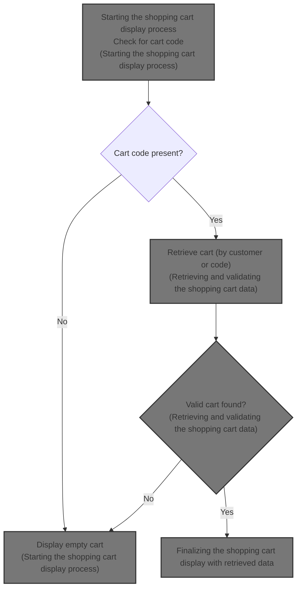

This document explains the flow of displaying the shopping cart to the user. The flow receives an HTTP request containing session data and returns a view showing either an empty cart or the current shopping cart contents with detailed pricing. It handles both guest and logged-in users by retrieving and validating cart data before preparing it for display.



# Starting the shopping cart display process

This section handles the process of displaying the shopping cart to the user, including checking for an existing cart and preparing the cart data for display.

| Category       | Rule Name            | Description                                                                                                                                                        |
| -------------- | -------------------- | ------------------------------------------------------------------------------------------------------------------------------------------------------------------ |
| Business logic | Empty cart display   | If there is no cart code present in the user's session, the system must display an empty shopping cart view.                                                       |
| Business logic | Cart data retrieval  | If a cart code exists in the session, the system must retrieve the shopping cart data associated with the customer and store to display the current cart contents. |
| Business logic | Localized page title | The page title for the shopping cart display must be set to a localized message indicating the cart or place order page.                                           |

<SwmSnippet path="/shopizer/sm-shop/src/main/java/com/salesmanager/web/shop/controller/shoppingCart/ShoppingCartController.java" line="229">

---

Here in <SwmToken path="shopizer/sm-shop/src/main/java/com/salesmanager/web/shop/controller/shoppingCart/ShoppingCartController.java" pos="229:5:5" line-data="    public String displayShoppingCart( final Model model, final HttpServletRequest request, final HttpServletResponse response, final Locale locale )">`displayShoppingCart`</SwmToken>, we start by setting up page info and checking if there's a cart code in the session. If no cart code exists, we return an empty cart view. Otherwise, we call the facade to get the shopping cart data, which handles the retrieval and preparation of the cart details for display.

```java
    public String displayShoppingCart( final Model model, final HttpServletRequest request, final HttpServletResponse response, final Locale locale )
        throws Exception
    {

        LOG.info( "Starting to calculate shopping cart..." );
        
        
		//meta information
		PageInformation pageInformation = new PageInformation();
		pageInformation.setPageTitle(messages.getMessage("label.cart.placeorder", locale));
		request.setAttribute(Constants.REQUEST_PAGE_INFORMATION, pageInformation);
        
        
	    MerchantStore store = (MerchantStore) request.getAttribute(Constants.MERCHANT_STORE);
	    Customer customer = getSessionAttribute(  Constants.CUSTOMER, request );

        /** there must be a cart in the session **/
        String cartCode = (String)request.getSession().getAttribute(Constants.SHOPPING_CART);
        
        if(StringUtils.isBlank(cartCode)) {
        	//display empty cart
            StringBuilder template =
                    new StringBuilder().append( ControllerConstants.Tiles.ShoppingCart.shoppingCart ).append( "." ).append( store.getStoreTemplate() );
                return template.toString();
        }
                
        ShoppingCartData shoppingCart = shoppingCartFacade.getShoppingCartData(customer, store, cartCode);
```

---

</SwmSnippet>

## Retrieving and validating the shopping cart data

```mermaid
%%{init: {"flowchart": {"defaultRenderer": "elk"}} }%%
flowchart TD
    node1["Start getShoppingCartData"] --> node2{"Is customer provided?"}
    click node1 openCode "shopizer/sm-shop/src/main/java/com/salesmanager/web/shop/controller/shoppingCart/facade/ShoppingCartFacadeImpl.java:260:265"
    node2 -->|"Yes"| node3["Retrieve cart by customer"]
    click node2 openCode "shopizer/sm-shop/src/main/java/com/salesmanager/web/shop/controller/shoppingCart/facade/ShoppingCartFacadeImpl.java:268:274"
    node2 -->|"No"| node4{"Is shoppingCartId provided and cart is null?"}
    click node4 openCode "shopizer/sm-shop/src/main/java/com/salesmanager/web/shop/controller/shoppingCart/facade/ShoppingCartFacadeImpl.java:278:281"
    node4 -->|"Yes"| node5["Retrieve cart by shoppingCartId"]
    click node5 openCode "shopizer/sm-shop/src/main/java/com/salesmanager/web/shop/controller/shoppingCart/facade/ShoppingCartFacadeImpl.java:278:281"
    node4 -->|"No"| node6["Skip retrieval"]
    node3 --> node7{"Is cart found?"}
    node5 --> node7
    node6 --> node7
    click node7 openCode "shopizer/sm-shop/src/main/java/com/salesmanager/web/shop/controller/shoppingCart/facade/ShoppingCartFacadeImpl.java:293:296"
    node7 -->|"No"| node8["Return null"]
    node7 -->|"Yes"| node9["Populate shopping cart data"]
    click node9 openCode "shopizer/sm-shop/src/main/java/com/salesmanager/web/shop/controller/shoppingCart/facade/ShoppingCartFacadeImpl.java:300:307"
    node9 --> node10["Return populated shopping cart data"]
    click node10 openCode "shopizer/sm-shop/src/main/java/com/salesmanager/web/shop/controller/shoppingCart/facade/ShoppingCartFacadeImpl.java:306:308"
classDef HeadingStyle fill:#777777,stroke:#333,stroke-width:2px;

%% Swimm:
%% %%{init: {"flowchart": {"defaultRenderer": "elk"}} }%%
%% flowchart TD
%%     node1["Start <SwmToken path="shopizer/sm-shop/src/main/java/com/salesmanager/web/shop/controller/shoppingCart/ShoppingCartController.java" pos="255:9:9" line-data="        ShoppingCartData shoppingCart = shoppingCartFacade.getShoppingCartData(customer, store, cartCode);">`getShoppingCartData`</SwmToken>"] --> node2{"Is customer provided?"}
%%     click node1 openCode "<SwmPath>[shopizer/…/facade/ShoppingCartFacadeImpl.java](shopizer/sm-shop/src/main/java/com/salesmanager/web/shop/controller/shoppingCart/facade/ShoppingCartFacadeImpl.java)</SwmPath>:260:265"
%%     node2 -->|"Yes"| node3["Retrieve cart by customer"]
%%     click node2 openCode "<SwmPath>[shopizer/…/facade/ShoppingCartFacadeImpl.java](shopizer/sm-shop/src/main/java/com/salesmanager/web/shop/controller/shoppingCart/facade/ShoppingCartFacadeImpl.java)</SwmPath>:268:274"
%%     node2 -->|"No"| node4{"Is <SwmToken path="shopizer/sm-shop/src/main/java/com/salesmanager/web/shop/controller/shoppingCart/facade/ShoppingCartFacadeImpl.java" pos="261:5:5" line-data="                                                 final String shoppingCartId )">`shoppingCartId`</SwmToken> provided and cart is null?"}
%%     click node4 openCode "<SwmPath>[shopizer/…/facade/ShoppingCartFacadeImpl.java](shopizer/sm-shop/src/main/java/com/salesmanager/web/shop/controller/shoppingCart/facade/ShoppingCartFacadeImpl.java)</SwmPath>:278:281"
%%     node4 -->|"Yes"| node5["Retrieve cart by <SwmToken path="shopizer/sm-shop/src/main/java/com/salesmanager/web/shop/controller/shoppingCart/facade/ShoppingCartFacadeImpl.java" pos="261:5:5" line-data="                                                 final String shoppingCartId )">`shoppingCartId`</SwmToken>"]
%%     click node5 openCode "<SwmPath>[shopizer/…/facade/ShoppingCartFacadeImpl.java](shopizer/sm-shop/src/main/java/com/salesmanager/web/shop/controller/shoppingCart/facade/ShoppingCartFacadeImpl.java)</SwmPath>:278:281"
%%     node4 -->|"No"| node6["Skip retrieval"]
%%     node3 --> node7{"Is cart found?"}
%%     node5 --> node7
%%     node6 --> node7
%%     click node7 openCode "<SwmPath>[shopizer/…/facade/ShoppingCartFacadeImpl.java](shopizer/sm-shop/src/main/java/com/salesmanager/web/shop/controller/shoppingCart/facade/ShoppingCartFacadeImpl.java)</SwmPath>:293:296"
%%     node7 -->|"No"| node8["Return null"]
%%     node7 -->|"Yes"| node9["Populate shopping cart data"]
%%     click node9 openCode "<SwmPath>[shopizer/…/facade/ShoppingCartFacadeImpl.java](shopizer/sm-shop/src/main/java/com/salesmanager/web/shop/controller/shoppingCart/facade/ShoppingCartFacadeImpl.java)</SwmPath>:300:307"
%%     node9 --> node10["Return populated shopping cart data"]
%%     click node10 openCode "<SwmPath>[shopizer/…/facade/ShoppingCartFacadeImpl.java](shopizer/sm-shop/src/main/java/com/salesmanager/web/shop/controller/shoppingCart/facade/ShoppingCartFacadeImpl.java)</SwmPath>:306:308"
%% classDef HeadingStyle fill:#777777,stroke:#333,stroke-width:2px;
```



This section handles retrieving and validating the shopping cart data for both logged-in and guest users by checking customer presence and shopping cart ID, ensuring the cart is current and returning the populated cart data.

| Category       | Rule Name                     | Description                                                                                                                                     |
| -------------- | ----------------------------- | ----------------------------------------------------------------------------------------------------------------------------------------------- |
| Business logic | Customer cart retrieval       | If a customer is provided, retrieve the shopping cart associated with that customer.                                                            |
| Business logic | Fallback cart retrieval by ID | If no customer is provided or no cart is found for the customer, and a shopping cart ID is provided, retrieve the cart by the shopping cart ID. |
| Business logic | Obsolete cart handling        | If a retrieved shopping cart is marked as obsolete, delete the cart and do not return it.                                                       |
| Business logic | Null cart return              | If no valid shopping cart is found after retrieval attempts, return null to indicate no cart data is available.                                 |
| Business logic | Populate cart data            | If a valid shopping cart is found, populate it into a data transfer object with pricing and calculation details before returning.               |

<SwmSnippet path="/shopizer/sm-shop/src/main/java/com/salesmanager/web/shop/controller/shoppingCart/facade/ShoppingCartFacadeImpl.java" line="260">

---

In <SwmToken path="shopizer/sm-shop/src/main/java/com/salesmanager/web/shop/controller/shoppingCart/facade/ShoppingCartFacadeImpl.java" pos="260:5:5" line-data="    public ShoppingCartData getShoppingCartData( final Customer customer, final MerchantStore store,">`getShoppingCartData`</SwmToken>, we first try to get the cart linked to the customer if available. If no customer, we plan to get the cart by its code next. This method handles both logged-in and guest users by trying both retrieval methods.

```java
    public ShoppingCartData getShoppingCartData( final Customer customer, final MerchantStore store,
                                                 final String shoppingCartId )
        throws Exception
    {

        ShoppingCart cart = null;
        try
        {
            if ( customer != null )
            {
                LOG.info( "Reteriving customer shopping cart..." );

                cart = shoppingCartService.getShoppingCart( customer );

            }

            else
            {
```

---

</SwmSnippet>

<SwmSnippet path="/shopizer/sm-core/src/main/java/com/salesmanager/core/business/shoppingcart/service/ShoppingCartServiceImpl.java" line="68">

---

<SwmToken path="shopizer/sm-core/src/main/java/com/salesmanager/core/business/shoppingcart/service/ShoppingCartServiceImpl.java" pos="68:5:5" line-data="	public ShoppingCart getShoppingCart(final Customer customer) throws ServiceException {">`getShoppingCart`</SwmToken> fetches the cart for a customer, fills it with details, then checks if it's obsolete. If obsolete, it deletes the cart and returns null, otherwise returns the cart. This prevents showing outdated carts.

```java
	public ShoppingCart getShoppingCart(final Customer customer) throws ServiceException {

		try {

			ShoppingCart shoppingCart = shoppingCartDao.getByCustomer(customer);
			populateShoppingCart(shoppingCart);
			if(shoppingCart!=null && shoppingCart.isObsolete()) {
				delete(shoppingCart);
				return null;
			} else {
				return shoppingCart;
			}


		} catch (Exception e) {
			throw new ServiceException(e);
		}

	}
```

---

</SwmSnippet>

<SwmSnippet path="/shopizer/sm-shop/src/main/java/com/salesmanager/web/shop/controller/shoppingCart/facade/ShoppingCartFacadeImpl.java" line="278">

---

After returning from `ShoppingCartServiceImpl.getShoppingCart`, if the cart is null and we have a cart code, we try to get the cart by code. Then we populate the cart into a DTO for the front-end and return it from <SwmToken path="shopizer/sm-shop/src/main/java/com/salesmanager/web/shop/controller/shoppingCart/ShoppingCartController.java" pos="255:9:9" line-data="        ShoppingCartData shoppingCart = shoppingCartFacade.getShoppingCartData(customer, store, cartCode);">`getShoppingCartData`</SwmToken>.

```java
                if ( StringUtils.isNotBlank( shoppingCartId ) && cart == null )
                {
                    cart = shoppingCartService.getByCode( shoppingCartId, store );
                }

            }
        }
        catch ( ServiceException ex )
        {
            LOG.error( "Error while retriving cart from customer", ex );
        }
        catch( NoResultException nre) {
        	//nothing
        }

        if ( cart == null )
        {
            return null;
        }

        LOG.info( "Cart model found." );

        ShoppingCartDataPopulator shoppingCartDataPopulator = new ShoppingCartDataPopulator();
        shoppingCartDataPopulator.setShoppingCartCalculationService( shoppingCartCalculationService );
        shoppingCartDataPopulator.setPricingService( pricingService );

        Language language = (Language) getKeyValue( Constants.LANGUAGE );
        MerchantStore merchantStore = (MerchantStore) getKeyValue( Constants.MERCHANT_STORE );
        return shoppingCartDataPopulator.populate( cart, merchantStore, language );

    }
```

---

</SwmSnippet>

## Finalizing the shopping cart display with retrieved data

<SwmSnippet path="/shopizer/sm-shop/src/main/java/com/salesmanager/web/shop/controller/shoppingCart/ShoppingCartController.java" line="256">

---

Back in <SwmToken path="shopizer/sm-shop/src/main/java/com/salesmanager/web/shop/controller/shoppingCart/ShoppingCartController.java" pos="229:5:5" line-data="    public String displayShoppingCart( final Model model, final HttpServletRequest request, final HttpServletResponse response, final Locale locale )">`displayShoppingCart`</SwmToken>, after getting the cart data from the facade, we add it to the model and return the view template name based on the store template.

```java
        model.addAttribute( "cart", shoppingCart );

        /** template **/
        StringBuilder template =
            new StringBuilder().append( ControllerConstants.Tiles.ShoppingCart.shoppingCart ).append( "." ).append( store.getStoreTemplate() );
        return template.toString();

    }
```

---

</SwmSnippet>

&nbsp;

*This is an auto-generated document by Swimm 🌊 and has not yet been verified by a human*

<SwmMeta version="3.0.0" repo-id="Z2l0aHViJTNBJTNBU2hvcGl6ZXIlM0ElM0F1bWFsaW5nYXN3YW1p" repo-name="Shopizer"><sup>Powered by [Swimm](https://app.swimm.io/)</sup></SwmMeta>
