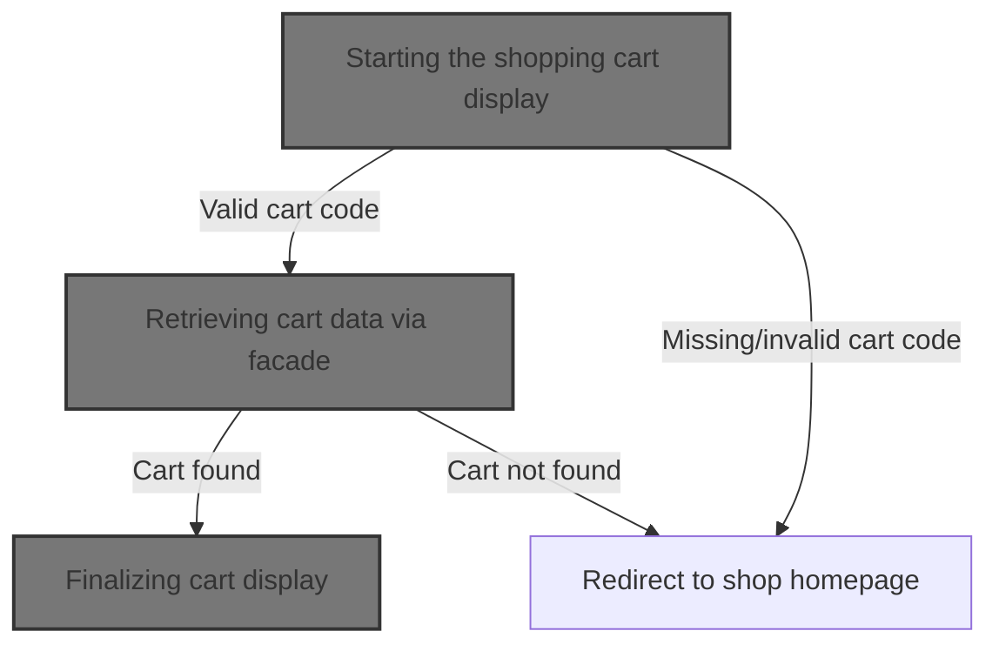
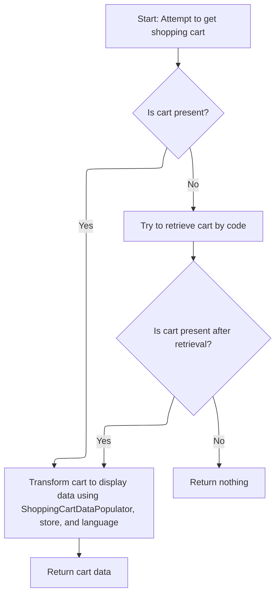
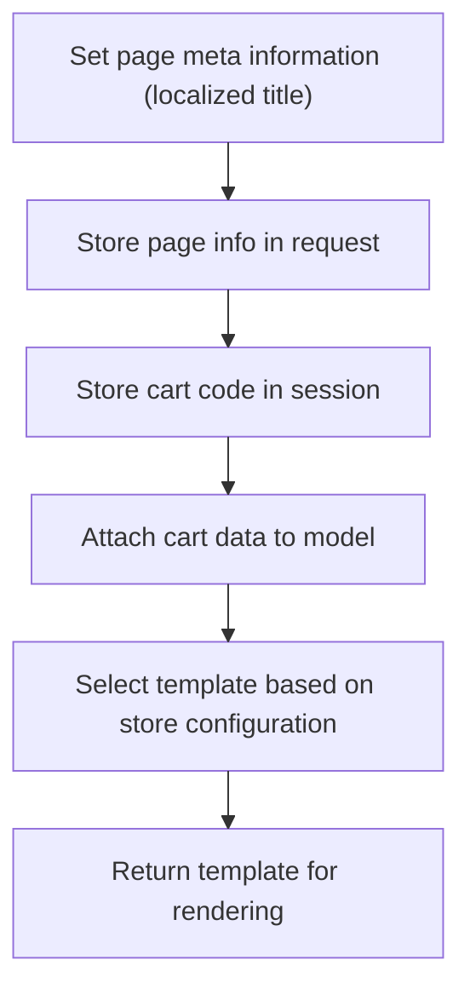

This document describes how the shopping cart is displayed to the user. The flow validates the cart code, retrieves the relevant cart data, and prepares the cart details for presentation. If the cart is not found or accessible, the user is redirected to the shop homepage.



# Starting the shopping cart display

This section governs the initial display of the shopping cart to the user, ensuring that only valid and accessible carts are shown, and handling cases where the cart cannot be found or accessed.

| Category        | Rule Name                  | Description                                                                                                                                                                                                                                                                                                                                                                                                                                                                                        |
| --------------- | -------------------------- | -------------------------------------------------------------------------------------------------------------------------------------------------------------------------------------------------------------------------------------------------------------------------------------------------------------------------------------------------------------------------------------------------------------------------------------------------------------------------------------------------- |
| Data validation | Missing cart code redirect | If the <SwmToken path="shopizer/sm-shop/src/main/java/com/salesmanager/web/shop/controller/shoppingCart/ShoppingCartController.java" pos="267:12:12" line-data="	public String displayShoppingCart(@ModelAttribute String shoppingCartCode, final Model model, HttpServletRequest request, final Locale locale) throws Exception{">`shoppingCartCode`</SwmToken> is missing or blank, the user is redirected to the shop homepage and the shopping cart is not displayed.                           |
| Business logic  | Valid cart display         | The shopping cart is displayed only if a valid <SwmToken path="shopizer/sm-shop/src/main/java/com/salesmanager/web/shop/controller/shoppingCart/ShoppingCartController.java" pos="267:12:12" line-data="	public String displayShoppingCart(@ModelAttribute String shoppingCartCode, final Model model, HttpServletRequest request, final Locale locale) throws Exception{">`shoppingCartCode`</SwmToken> is provided and a corresponding cart is found for the current merchant store and customer. |

<SwmSnippet path="/shopizer/sm-shop/src/main/java/com/salesmanager/web/shop/controller/shoppingCart/ShoppingCartController.java" line="267">

---

In <SwmToken path="shopizer/sm-shop/src/main/java/com/salesmanager/web/shop/controller/shoppingCart/ShoppingCartController.java" pos="267:5:5" line-data="	public String displayShoppingCart(@ModelAttribute String shoppingCartCode, final Model model, HttpServletRequest request, final Locale locale) throws Exception{">`displayShoppingCart`</SwmToken>, we start by validating the <SwmToken path="shopizer/sm-shop/src/main/java/com/salesmanager/web/shop/controller/shoppingCart/ShoppingCartController.java" pos="267:12:12" line-data="	public String displayShoppingCart(@ModelAttribute String shoppingCartCode, final Model model, HttpServletRequest request, final Locale locale) throws Exception{">`shoppingCartCode`</SwmToken> and grabbing the merchant and customer from the request/session. If the code is missing or invalid, we bail out early. Next, we call <SwmToken path="shopizer/sm-shop/src/main/java/com/salesmanager/web/shop/controller/shoppingCart/ShoppingCartController.java" pos="276:7:9" line-data="			ShoppingCartData cart =  shoppingCartFacade.getShoppingCartData(customer,merchantStore,shoppingCartCode);">`shoppingCartFacade.getShoppingCartData`</SwmToken> to fetch the cart details, since that method handles all the logic for finding the cart by customer or code, and returns a unified data object for the rest of the flow.

```java
	public String displayShoppingCart(@ModelAttribute String shoppingCartCode, final Model model, HttpServletRequest request, final Locale locale) throws Exception{

			MerchantStore merchantStore = (MerchantStore)request.getAttribute(Constants.MERCHANT_STORE);
			Customer customer = getSessionAttribute(  Constants.CUSTOMER, request );
			
			if(StringUtils.isBlank(shoppingCartCode)) {
				return "redirect:/shop";
			}
			
			ShoppingCartData cart =  shoppingCartFacade.getShoppingCartData(customer,merchantStore,shoppingCartCode);
			if(cart==null) {
				return "redirect:/shop";
			}
			
			
```

---

</SwmSnippet>

## Retrieving cart data via facade

This section governs how shopping cart data is retrieved for a user, ensuring that the correct cart is returned based on whether a customer is present or not.

| Category       | Rule Name               | Description                                                                                                                                                                                                                                                                                                                                                                                                             |
| -------------- | ----------------------- | ----------------------------------------------------------------------------------------------------------------------------------------------------------------------------------------------------------------------------------------------------------------------------------------------------------------------------------------------------------------------------------------------------------------------- |
| Business logic | Customer Cart Retrieval | If a customer is provided, the system must attempt to retrieve the shopping cart associated with that customer.                                                                                                                                                                                                                                                                                                         |
| Business logic | Fallback Cart Lookup    | If no customer is provided or the customer's cart cannot be found, the system must attempt to retrieve the cart using the provided <SwmToken path="shopizer/sm-shop/src/main/java/com/salesmanager/web/shop/controller/shoppingCart/facade/ShoppingCartFacadeImpl.java" pos="261:5:5" line-data="                                                 final String shoppingCartId )">`shoppingCartId`</SwmToken> and store. |

<SwmSnippet path="/shopizer/sm-shop/src/main/java/com/salesmanager/web/shop/controller/shoppingCart/facade/ShoppingCartFacadeImpl.java" line="260">

---

In <SwmToken path="shopizer/sm-shop/src/main/java/com/salesmanager/web/shop/controller/shoppingCart/facade/ShoppingCartFacadeImpl.java" pos="260:5:5" line-data="    public ShoppingCartData getShoppingCartData( final Customer customer, final MerchantStore store,">`getShoppingCartData`</SwmToken>, we check if there's a customer and try to fetch their cart using <SwmToken path="shopizer/sm-shop/src/main/java/com/salesmanager/web/shop/controller/shoppingCart/facade/ShoppingCartFacadeImpl.java" pos="272:5:7" line-data="                cart = shoppingCartService.getShoppingCart( customer );">`shoppingCartService.getShoppingCart`</SwmToken>. If there's no customer, or the cart isn't found, we'll need to try another lookup method next, which is why we call the service again with the cart code and store.

```java
    public ShoppingCartData getShoppingCartData( final Customer customer, final MerchantStore store,
                                                 final String shoppingCartId )
        throws Exception
    {

        ShoppingCart cart = null;
        try
        {
            if ( customer != null )
            {
                LOG.info( "Reteriving customer shopping cart..." );

                cart = shoppingCartService.getShoppingCart( customer );

            }

            else
            {
```

---

</SwmSnippet>

### Looking up cart by customer

This section is responsible for locating and returning the shopping cart that belongs to a given customer. It ensures that the correct cart is retrieved and that the data returned is accurate and up-to-date.

| Category        | Rule Name                        | Description                                                                                         |
| --------------- | -------------------------------- | --------------------------------------------------------------------------------------------------- |
| Data validation | Customer identification required | A customer must have a valid identifier to retrieve their shopping cart.                            |
| Data validation | Cart access restriction          | A customer can only access their own cart and not the cart of another customer.                     |
| Business logic  | Empty cart for new customer      | If no cart exists for the customer, an empty cart should be returned.                               |
| Business logic  | Complete cart details            | The cart details returned must include all items, their quantities, and prices as currently stored. |

See <SwmLink doc-title="Retrieving and Validating the Shopping Cart">[Retrieving and Validating the Shopping Cart](.swm%5Cretrieving-and-validating-the-shopping-cart.rhidgxf0.sw.md)</SwmLink>

### Fallback and populating cart data



<SwmSnippet path="/shopizer/sm-shop/src/main/java/com/salesmanager/web/shop/controller/shoppingCart/facade/ShoppingCartFacadeImpl.java" line="278">

---

Back in <SwmToken path="shopizer/sm-shop/src/main/java/com/salesmanager/web/shop/controller/shoppingCart/ShoppingCartController.java" pos="276:9:9" line-data="			ShoppingCartData cart =  shoppingCartFacade.getShoppingCartData(customer,merchantStore,shoppingCartCode);">`getShoppingCartData`</SwmToken>, after trying both customer and code-based cart lookups, we either return null if nothing is found, or use <SwmToken path="shopizer/sm-shop/src/main/java/com/salesmanager/web/shop/controller/shoppingCart/facade/ShoppingCartFacadeImpl.java" pos="300:1:1" line-data="        ShoppingCartDataPopulator shoppingCartDataPopulator = new ShoppingCartDataPopulator();">`ShoppingCartDataPopulator`</SwmToken> to convert the cart entity into a data object with pricing and calculation services attached. This prepares the cart for display and further use.

```java
                if ( StringUtils.isNotBlank( shoppingCartId ) && cart == null )
                {
                    cart = shoppingCartService.getByCode( shoppingCartId, store );
                }

            }
        }
        catch ( ServiceException ex )
        {
            LOG.error( "Error while retriving cart from customer", ex );
        }
        catch( NoResultException nre) {
        	//nothing
        }

        if ( cart == null )
        {
            return null;
        }

        LOG.info( "Cart model found." );

        ShoppingCartDataPopulator shoppingCartDataPopulator = new ShoppingCartDataPopulator();
        shoppingCartDataPopulator.setShoppingCartCalculationService( shoppingCartCalculationService );
        shoppingCartDataPopulator.setPricingService( pricingService );

        Language language = (Language) getKeyValue( Constants.LANGUAGE );
        MerchantStore merchantStore = (MerchantStore) getKeyValue( Constants.MERCHANT_STORE );
        return shoppingCartDataPopulator.populate( cart, merchantStore, language );

    }
```

---

</SwmSnippet>

## Finalizing cart display



<SwmSnippet path="/shopizer/sm-shop/src/main/java/com/salesmanager/web/shop/controller/shoppingCart/ShoppingCartController.java" line="282">

---

Back in <SwmToken path="shopizer/sm-shop/src/main/java/com/salesmanager/web/shop/controller/shoppingCart/ShoppingCartController.java" pos="267:5:5" line-data="	public String displayShoppingCart(@ModelAttribute String shoppingCartCode, final Model model, HttpServletRequest request, final Locale locale) throws Exception{">`displayShoppingCart`</SwmToken>, after getting the <SwmToken path="shopizer/sm-shop/src/main/java/com/salesmanager/web/shop/controller/shoppingCart/ShoppingCartController.java" pos="276:1:1" line-data="			ShoppingCartData cart =  shoppingCartFacade.getShoppingCartData(customer,merchantStore,shoppingCartCode);">`ShoppingCartData`</SwmToken> from the facade, we set up page info, stash the cart code in the session, and add the cart data to the model. Then we build the template name using the merchant store's template and return it for rendering.

```java
			//meta information
			PageInformation pageInformation = new PageInformation();
			pageInformation.setPageTitle(messages.getMessage("label.cart.placeorder", locale));
			request.setAttribute(Constants.REQUEST_PAGE_INFORMATION, pageInformation);
			request.getSession().setAttribute(Constants.SHOPPING_CART, cart.getCode());
	        model.addAttribute("cart", cart);

	        /** template **/
	        StringBuilder template =
	            new StringBuilder().append( ControllerConstants.Tiles.ShoppingCart.shoppingCart ).append( "." ).append( merchantStore.getStoreTemplate() );
	        return template.toString();
			


	}
```

---

</SwmSnippet>

&nbsp;

*This is an auto-generated document by Swimm 🌊 and has not yet been verified by a human*

<SwmMeta version="3.0.0" repo-id="Z2l0aHViJTNBJTNBU2hvcGl6ZXIlM0ElM0F1bWFsaW5nYXN3YW1p" repo-name="Shopizer"><sup>Powered by [Swimm](https://app.swimm.io/)</sup></SwmMeta>
