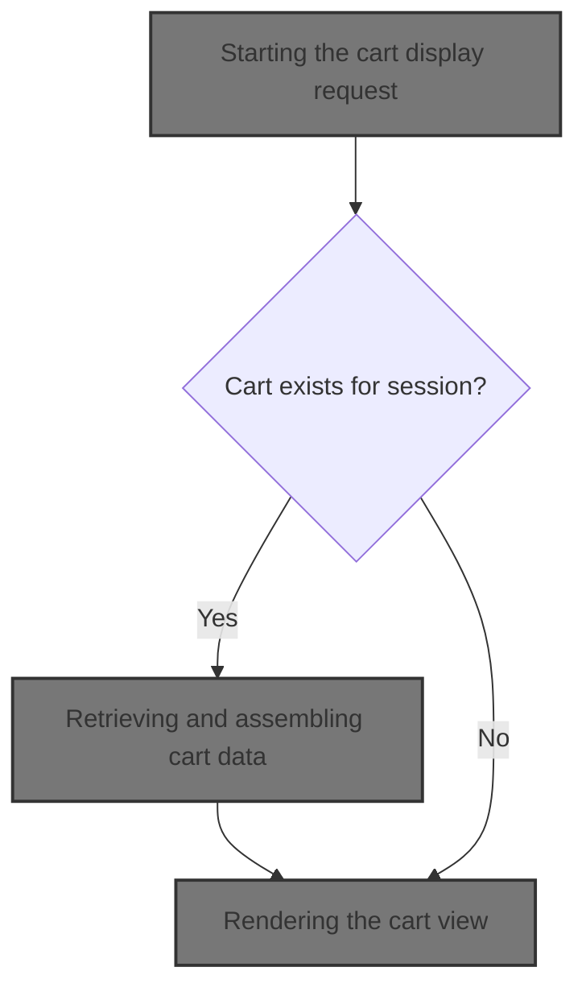
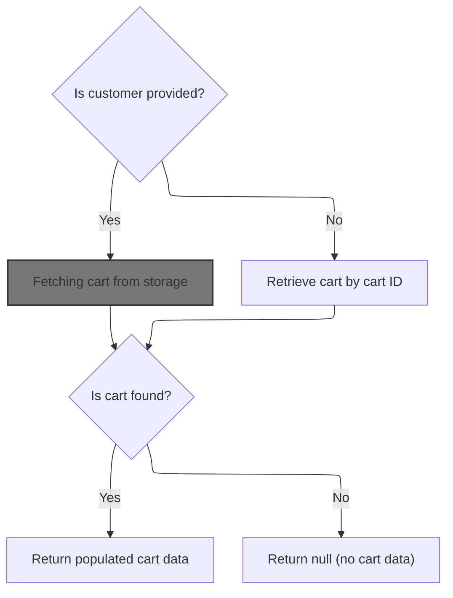
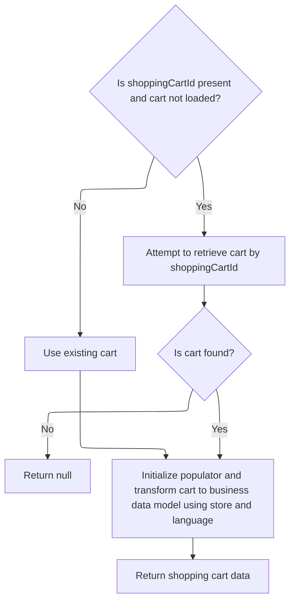

This document describes how the shopping cart is displayed to the user. When a user requests to view their cart, the system checks for an existing cart, retrieves store and customer details, assembles the cart data, and renders a view showing the user's selected products and pricing.



# Starting the cart display request

<SwmSnippet path="/shopizer/sm-shop/src/main/java/com/salesmanager/web/shop/controller/shoppingCart/ShoppingCartController.java" line="229">

---

In <SwmToken path="shopizer/sm-shop/src/main/java/com/salesmanager/web/shop/controller/shoppingCart/ShoppingCartController.java" pos="229:5:5" line-data="    public String displayShoppingCart( final Model model, final HttpServletRequest request, final HttpServletResponse response, final Locale locale )">`displayShoppingCart`</SwmToken>, we kick off the flow by checking if there's a cart code in the session. If not, we bail early and show an empty cart. Otherwise, we grab the store and customer info, set up page meta, and then delegate to <SwmToken path="shopizer/sm-shop/src/main/java/com/salesmanager/web/shop/controller/shoppingCart/facade/ShoppingCartFacadeImpl.java" pos="51:4:4" line-data="public class ShoppingCartFacadeImpl">`ShoppingCartFacadeImpl`</SwmToken> to fetch and prepare the cart data. We need to call the facade next because it handles all the logic for retrieving and assembling the cart, so the controller stays clean.

```java
    public String displayShoppingCart( final Model model, final HttpServletRequest request, final HttpServletResponse response, final Locale locale )
        throws Exception
    {

        LOG.info( "Starting to calculate shopping cart..." );
        
        
		//meta information
		PageInformation pageInformation = new PageInformation();
		pageInformation.setPageTitle(messages.getMessage("label.cart.placeorder", locale));
		request.setAttribute(Constants.REQUEST_PAGE_INFORMATION, pageInformation);
        
        
	    MerchantStore store = (MerchantStore) request.getAttribute(Constants.MERCHANT_STORE);
	    Customer customer = getSessionAttribute(  Constants.CUSTOMER, request );

        /** there must be a cart in the session **/
        String cartCode = (String)request.getSession().getAttribute(Constants.SHOPPING_CART);
        
        if(StringUtils.isBlank(cartCode)) {
        	//display empty cart
            StringBuilder template =
                    new StringBuilder().append( ControllerConstants.Tiles.ShoppingCart.shoppingCart ).append( "." ).append( store.getStoreTemplate() );
                return template.toString();
        }
                
        ShoppingCartData shoppingCart = shoppingCartFacade.getShoppingCartData(customer, store, cartCode);
```

---

</SwmSnippet>

## Retrieving and assembling cart data



<SwmSnippet path="/shopizer/sm-shop/src/main/java/com/salesmanager/web/shop/controller/shoppingCart/facade/ShoppingCartFacadeImpl.java" line="260">

---

In <SwmToken path="shopizer/sm-shop/src/main/java/com/salesmanager/web/shop/controller/shoppingCart/facade/ShoppingCartFacadeImpl.java" pos="260:5:5" line-data="    public ShoppingCartData getShoppingCartData( final Customer customer, final MerchantStore store,">`getShoppingCartData`</SwmToken>, we figure out if we're dealing with a customer or just a cart code, and use <SwmToken path="shopizer/sm-shop/src/main/java/com/salesmanager/web/shop/controller/shoppingCart/facade/ShoppingCartFacadeImpl.java" pos="272:5:5" line-data="                cart = shoppingCartService.getShoppingCart( customer );">`shoppingCartService`</SwmToken> to fetch the cart accordingly. We need to call the service next because that's where the actual cart retrieval from the database happens.

```java
    public ShoppingCartData getShoppingCartData( final Customer customer, final MerchantStore store,
                                                 final String shoppingCartId )
        throws Exception
    {

        ShoppingCart cart = null;
        try
        {
            if ( customer != null )
            {
                LOG.info( "Reteriving customer shopping cart..." );

                cart = shoppingCartService.getShoppingCart( customer );

            }

            else
            {
```

---

</SwmSnippet>

### Fetching cart from storage

See <SwmLink doc-title="Retrieving and validating a customer&#39;s shopping cart">[Retrieving and validating a customer's shopping cart](.swm%5Cretrieving-and-validating-a-customers-shopping-cart.7d0loxcp.sw.md)</SwmLink>

### Preparing cart data for display



<SwmSnippet path="/shopizer/sm-shop/src/main/java/com/salesmanager/web/shop/controller/shoppingCart/facade/ShoppingCartFacadeImpl.java" line="278">

---

Back in <SwmToken path="shopizer/sm-shop/src/main/java/com/salesmanager/web/shop/controller/shoppingCart/ShoppingCartController.java" pos="255:9:9" line-data="        ShoppingCartData shoppingCart = shoppingCartFacade.getShoppingCartData(customer, store, cartCode);">`getShoppingCartData`</SwmToken>, after getting the cart from the service, we check if it's valid, then set up the populator with calculation and pricing services. We call the populator next because it converts the cart model into a UI-friendly data object, handling all the formatting and totals.

```java
                if ( StringUtils.isNotBlank( shoppingCartId ) && cart == null )
                {
                    cart = shoppingCartService.getByCode( shoppingCartId, store );
                }

            }
        }
        catch ( ServiceException ex )
        {
            LOG.error( "Error while retriving cart from customer", ex );
        }
        catch( NoResultException nre) {
        	//nothing
        }

        if ( cart == null )
        {
            return null;
        }

        LOG.info( "Cart model found." );

        ShoppingCartDataPopulator shoppingCartDataPopulator = new ShoppingCartDataPopulator();
        shoppingCartDataPopulator.setShoppingCartCalculationService( shoppingCartCalculationService );
        shoppingCartDataPopulator.setPricingService( pricingService );

        Language language = (Language) getKeyValue( Constants.LANGUAGE );
        MerchantStore merchantStore = (MerchantStore) getKeyValue( Constants.MERCHANT_STORE );
        return shoppingCartDataPopulator.populate( cart, merchantStore, language );

    }
```

---

</SwmSnippet>

## Building display-ready cart data

```mermaid
%%{init: {"flowchart": {"defaultRenderer": "elk"}} }%%
flowchart TD
    node1["Start cart data population"]
    click node1 openCode "shopizer/sm-shop/src/main/java/com/salesmanager/web/populator/shoppingCart/ShoppingCartDataPopulator.java:73:76"
    node1 --> node2{"Are there items in the cart?"}
    click node2 openCode "shopizer/sm-shop/src/main/java/com/salesmanager/web/populator/shoppingCart/ShoppingCartDataPopulator.java:81:82"
    subgraph loop1["For each item in cart"]
        node2 -->|"Yes"| node3["Enrich item with product details and pricing"]
        click node3 openCode "shopizer/sm-shop/src/main/java/com/salesmanager/web/populator/shoppingCart/ShoppingCartDataPopulator.java:83:98"
        node3 --> node4{"Does item have attributes?"}
        click node4 openCode "shopizer/sm-shop/src/main/java/com/salesmanager/web/populator/shoppingCart/ShoppingCartDataPopulator.java:107:108"
        subgraph loop2["For each attribute in item"]
            node4 -->|"Yes"| node5["Enrich attribute with option/value names"]
            click node5 openCode "shopizer/sm-shop/src/main/java/com/salesmanager/web/populator/shoppingCart/ShoppingCartDataPopulator.java:111:122"
            node5 --> node6["Add attribute to item"]
            click node6 openCode "shopizer/sm-shop/src/main/java/com/salesmanager/web/populator/shoppingCart/ShoppingCartDataPopulator.java:121:124"
        end
        node4 -->|"No"| node6
        node6 --> node7["Add item to display list"]
        click node7 openCode "shopizer/sm-shop/src/main/java/com/salesmanager/web/populator/shoppingCart/ShoppingCartDataPopulator.java:126:127"
    end
    node2 -->|"No"| node8["Skip item enrichment"]
    click node8 openCode "shopizer/sm-shop/src/main/java/com/salesmanager/web/populator/shoppingCart/ShoppingCartDataPopulator.java:129:131"
    node7 --> node9["Calculate order summary and totals"]
    click node9 openCode "shopizer/sm-shop/src/main/java/com/salesmanager/web/populator/shoppingCart/ShoppingCartDataPopulator.java:133:137"
    node9 --> node10{"Are there order totals?"}
    click node10 openCode "shopizer/sm-shop/src/main/java/com/salesmanager/web/populator/shoppingCart/ShoppingCartDataPopulator.java:139:140"
    subgraph loop3["For each order total"]
        node10 -->|"Yes"| node11["Enrich total for display"]
        click node11 openCode "shopizer/sm-shop/src/main/java/com/salesmanager/web/populator/shoppingCart/ShoppingCartDataPopulator.java:142:145"
        node11 --> node12["Add total to cart"]
        click node12 openCode "shopizer/sm-shop/src/main/java/com/salesmanager/web/populator/shoppingCart/ShoppingCartDataPopulator.java:145:147"
    end
    node10 -->|"No"| node12
    node12 --> node13["Set cart subtotal, total, quantity, and id"]
    click node13 openCode "shopizer/sm-shop/src/main/java/com/salesmanager/web/populator/shoppingCart/ShoppingCartDataPopulator.java:150:153"
    node13 --> node14["Return enriched cart data"]
    click node14 openCode "shopizer/sm-shop/src/main/java/com/salesmanager/web/populator/shoppingCart/ShoppingCartDataPopulator.java:159:159"

classDef HeadingStyle fill:#777777,stroke:#333,stroke-width:2px;

%% Swimm:
%% %%{init: {"flowchart": {"defaultRenderer": "elk"}} }%%
%% flowchart TD
%%     node1["Start cart data population"]
%%     click node1 openCode "<SwmPath>[shopizer/…/shoppingCart/ShoppingCartDataPopulator.java](shopizer/sm-shop/src/main/java/com/salesmanager/web/populator/shoppingCart/ShoppingCartDataPopulator.java)</SwmPath>:73:76"
%%     node1 --> node2{"Are there items in the cart?"}
%%     click node2 openCode "<SwmPath>[shopizer/…/shoppingCart/ShoppingCartDataPopulator.java](shopizer/sm-shop/src/main/java/com/salesmanager/web/populator/shoppingCart/ShoppingCartDataPopulator.java)</SwmPath>:81:82"
%%     subgraph loop1["For each item in cart"]
%%         node2 -->|"Yes"| node3["Enrich item with product details and pricing"]
%%         click node3 openCode "<SwmPath>[shopizer/…/shoppingCart/ShoppingCartDataPopulator.java](shopizer/sm-shop/src/main/java/com/salesmanager/web/populator/shoppingCart/ShoppingCartDataPopulator.java)</SwmPath>:83:98"
%%         node3 --> node4{"Does item have attributes?"}
%%         click node4 openCode "<SwmPath>[shopizer/…/shoppingCart/ShoppingCartDataPopulator.java](shopizer/sm-shop/src/main/java/com/salesmanager/web/populator/shoppingCart/ShoppingCartDataPopulator.java)</SwmPath>:107:108"
%%         subgraph loop2["For each attribute in item"]
%%             node4 -->|"Yes"| node5["Enrich attribute with option/value names"]
%%             click node5 openCode "<SwmPath>[shopizer/…/shoppingCart/ShoppingCartDataPopulator.java](shopizer/sm-shop/src/main/java/com/salesmanager/web/populator/shoppingCart/ShoppingCartDataPopulator.java)</SwmPath>:111:122"
%%             node5 --> node6["Add attribute to item"]
%%             click node6 openCode "<SwmPath>[shopizer/…/shoppingCart/ShoppingCartDataPopulator.java](shopizer/sm-shop/src/main/java/com/salesmanager/web/populator/shoppingCart/ShoppingCartDataPopulator.java)</SwmPath>:121:124"
%%         end
%%         node4 -->|"No"| node6
%%         node6 --> node7["Add item to display list"]
%%         click node7 openCode "<SwmPath>[shopizer/…/shoppingCart/ShoppingCartDataPopulator.java](shopizer/sm-shop/src/main/java/com/salesmanager/web/populator/shoppingCart/ShoppingCartDataPopulator.java)</SwmPath>:126:127"
%%     end
%%     node2 -->|"No"| node8["Skip item enrichment"]
%%     click node8 openCode "<SwmPath>[shopizer/…/shoppingCart/ShoppingCartDataPopulator.java](shopizer/sm-shop/src/main/java/com/salesmanager/web/populator/shoppingCart/ShoppingCartDataPopulator.java)</SwmPath>:129:131"
%%     node7 --> node9["Calculate order summary and totals"]
%%     click node9 openCode "<SwmPath>[shopizer/…/shoppingCart/ShoppingCartDataPopulator.java](shopizer/sm-shop/src/main/java/com/salesmanager/web/populator/shoppingCart/ShoppingCartDataPopulator.java)</SwmPath>:133:137"
%%     node9 --> node10{"Are there order totals?"}
%%     click node10 openCode "<SwmPath>[shopizer/…/shoppingCart/ShoppingCartDataPopulator.java](shopizer/sm-shop/src/main/java/com/salesmanager/web/populator/shoppingCart/ShoppingCartDataPopulator.java)</SwmPath>:139:140"
%%     subgraph loop3["For each order total"]
%%         node10 -->|"Yes"| node11["Enrich total for display"]
%%         click node11 openCode "<SwmPath>[shopizer/…/shoppingCart/ShoppingCartDataPopulator.java](shopizer/sm-shop/src/main/java/com/salesmanager/web/populator/shoppingCart/ShoppingCartDataPopulator.java)</SwmPath>:142:145"
%%         node11 --> node12["Add total to cart"]
%%         click node12 openCode "<SwmPath>[shopizer/…/shoppingCart/ShoppingCartDataPopulator.java](shopizer/sm-shop/src/main/java/com/salesmanager/web/populator/shoppingCart/ShoppingCartDataPopulator.java)</SwmPath>:145:147"
%%     end
%%     node10 -->|"No"| node12
%%     node12 --> node13["Set cart subtotal, total, quantity, and id"]
%%     click node13 openCode "<SwmPath>[shopizer/…/shoppingCart/ShoppingCartDataPopulator.java](shopizer/sm-shop/src/main/java/com/salesmanager/web/populator/shoppingCart/ShoppingCartDataPopulator.java)</SwmPath>:150:153"
%%     node13 --> node14["Return enriched cart data"]
%%     click node14 openCode "<SwmPath>[shopizer/…/shoppingCart/ShoppingCartDataPopulator.java](shopizer/sm-shop/src/main/java/com/salesmanager/web/populator/shoppingCart/ShoppingCartDataPopulator.java)</SwmPath>:159:159"
%% 
%% classDef HeadingStyle fill:#777777,stroke:#333,stroke-width:2px;
```



<SwmSnippet path="/shopizer/sm-shop/src/main/java/com/salesmanager/web/populator/shoppingCart/ShoppingCartDataPopulator.java" line="73">

---

In <SwmToken path="shopizer/sm-shop/src/main/java/com/salesmanager/web/populator/shoppingCart/ShoppingCartDataPopulator.java" pos="73:5:5" line-data="    public ShoppingCartData populate(final ShoppingCart shoppingCart,">`populate`</SwmToken>, we loop through each cart item, build up <SwmToken path="shopizer/sm-shop/src/main/java/com/salesmanager/web/populator/shoppingCart/ShoppingCartDataPopulator.java" pos="78:15:15" line-data="        Set&lt;com.salesmanager.core.business.shoppingcart.model.ShoppingCartItem&gt; items = shoppingCart.getLineItems();">`ShoppingCartItem`</SwmToken> objects with product info, price, quantity, image, and attributes, and accumulate the total quantity. The function assumes all the nested product and option description data is present and uses <SwmToken path="shopizer/sm-shop/src/main/java/com/salesmanager/web/populator/shoppingCart/ShoppingCartDataPopulator.java" pos="94:5:5" line-data="                    shoppingCartItem.setPrice(pricingService.getDisplayAmount(item.getItemPrice(),store));">`pricingService`</SwmToken> for display amounts. This sets up the core item list for the cart data.

```java
    public ShoppingCartData populate(final ShoppingCart shoppingCart,
                                     final ShoppingCartData cart, final MerchantStore store, final Language language) {

    	int cartQuantity = 0;
        cart.setCode(shoppingCart.getShoppingCartCode());
        Set<com.salesmanager.core.business.shoppingcart.model.ShoppingCartItem> items = shoppingCart.getLineItems();
        List<ShoppingCartItem> shoppingCartItemsList=Collections.emptyList();
        try{
            if(items!=null) {
                shoppingCartItemsList=new ArrayList<ShoppingCartItem>();
                for(com.salesmanager.core.business.shoppingcart.model.ShoppingCartItem item : items) {

                    ShoppingCartItem shoppingCartItem = new ShoppingCartItem();
                    shoppingCartItem.setCode(cart.getCode());
                    shoppingCartItem.setProductCode(item.getProduct().getSku());
                    shoppingCartItem.setProductVirtual(item.isProductVirtual());

                    shoppingCartItem.setProductId(item.getProductId());
                    shoppingCartItem.setId(item.getId());
                    shoppingCartItem.setName(item.getProduct().getProductDescription().getName());

                    shoppingCartItem.setPrice(pricingService.getDisplayAmount(item.getItemPrice(),store));
                    shoppingCartItem.setQuantity(item.getQuantity());
                    
                    
                    cartQuantity = cartQuantity + item.getQuantity();
                    
                    shoppingCartItem.setProductPrice(item.getItemPrice());
                    shoppingCartItem.setSubTotal(pricingService.getDisplayAmount(item.getSubTotal(), store));
                    ProductImage image = item.getProduct().getProductImage();
                    if(image!=null) {
                        String imagePath = ImageFilePathUtils.buildProductImageFilePath(store, item.getProduct().getSku(), image.getProductImage());
                        shoppingCartItem.setImage(imagePath);
                    }
                    Set<com.salesmanager.core.business.shoppingcart.model.ShoppingCartAttributeItem> attributes = item.getAttributes();
                    if(attributes!=null) {
                        List<ShoppingCartAttribute> cartAttributes = new ArrayList<ShoppingCartAttribute>();
                        for(com.salesmanager.core.business.shoppingcart.model.ShoppingCartAttributeItem attribute : attributes) {
                            ShoppingCartAttribute cartAttribute = new ShoppingCartAttribute();
                            cartAttribute.setId(attribute.getId());
                            cartAttribute.setAttributeId(attribute.getProductAttributeId());
                            cartAttribute.setOptionId(attribute.getProductAttribute().getProductOption().getId());
                            cartAttribute.setOptionValueId(attribute.getProductAttribute().getProductOptionValue().getId());
                            List<ProductOptionDescription> optionDescriptions = attribute.getProductAttribute().getProductOption().getDescriptionsSettoList();
                            List<ProductOptionValueDescription> optionValueDescriptions = attribute.getProductAttribute().getProductOptionValue().getDescriptionsSettoList();
                            if(!CollectionUtils.isEmpty(optionDescriptions) && !CollectionUtils.isEmpty(optionValueDescriptions)) {
                            	cartAttribute.setOptionName(optionDescriptions.get(0).getName());
                            	cartAttribute.setOptionValue(optionValueDescriptions.get(0).getName());
                            	cartAttributes.add(cartAttribute);
                            }
                        }
                        shoppingCartItem.setShoppingCartAttributes(cartAttributes);
                    }
                    shoppingCartItemsList.add(shoppingCartItem);
                }
```

---

</SwmSnippet>

<SwmSnippet path="/shopizer/sm-shop/src/main/java/com/salesmanager/web/populator/shoppingCart/ShoppingCartDataPopulator.java" line="129">

---

After building the <SwmToken path="shopizer/sm-shop/src/main/java/com/salesmanager/web/populator/shoppingCart/ShoppingCartDataPopulator.java" pos="134:15:15" line-data="            List&lt;com.salesmanager.core.business.shoppingcart.model.ShoppingCartItem&gt; productsList = new ArrayList&lt;com.salesmanager.core.business.shoppingcart.model.ShoppingCartItem&gt;();">`ShoppingCartItem`</SwmToken> list, we set it on the cart if it's not empty, then create an <SwmToken path="shopizer/sm-shop/src/main/java/com/salesmanager/web/populator/shoppingCart/ShoppingCartDataPopulator.java" pos="133:1:1" line-data="            OrderSummary summary = new OrderSummary();">`OrderSummary`</SwmToken> and use <SwmToken path="shopizer/sm-shop/src/main/java/com/salesmanager/web/populator/shoppingCart/ShoppingCartDataPopulator.java" pos="137:7:7" line-data="            OrderTotalSummary orderSummary = shoppingCartCalculationService.calculate(shoppingCart,store, language );">`shoppingCartCalculationService`</SwmToken> to calculate all the totals. We convert those totals into display objects for the UI.

```java
            if(CollectionUtils.isNotEmpty(shoppingCartItemsList)){
                cart.setShoppingCartItems(shoppingCartItemsList);
            }

            OrderSummary summary = new OrderSummary();
            List<com.salesmanager.core.business.shoppingcart.model.ShoppingCartItem> productsList = new ArrayList<com.salesmanager.core.business.shoppingcart.model.ShoppingCartItem>();
            productsList.addAll(shoppingCart.getLineItems());
            summary.setProducts(productsList);
            OrderTotalSummary orderSummary = shoppingCartCalculationService.calculate(shoppingCart,store, language );

            if(CollectionUtils.isNotEmpty(orderSummary.getTotals())) {
            	List<OrderTotal> totals = new ArrayList<OrderTotal>();
            	for(com.salesmanager.core.business.order.model.OrderTotal t : orderSummary.getTotals()) {
            		OrderTotal total = new OrderTotal();
            		total.setCode(t.getOrderTotalCode());
            		total.setValue(t.getValue());
            		totals.add(total);
            	}
```

---

</SwmSnippet>

<SwmSnippet path="/shopizer/sm-shop/src/main/java/com/salesmanager/web/populator/shoppingCart/ShoppingCartDataPopulator.java" line="147">

---

Finally, we set the calculated totals, subtotal, total, quantity, and cart ID on the <SwmToken path="shopizer/sm-shop/src/main/java/com/salesmanager/web/shop/controller/shoppingCart/ShoppingCartController.java" pos="255:1:1" line-data="        ShoppingCartData shoppingCart = shoppingCartFacade.getShoppingCartData(customer, store, cartCode);">`ShoppingCartData`</SwmToken>, using <SwmToken path="shopizer/sm-shop/src/main/java/com/salesmanager/web/populator/shoppingCart/ShoppingCartDataPopulator.java" pos="150:5:5" line-data="            cart.setSubTotal(pricingService.getDisplayAmount(orderSummary.getSubTotal(), store));">`pricingService`</SwmToken> for display formatting. This is the object the UI uses to show the cart.

```java
            	cart.setTotals(totals);
            }
            
            cart.setSubTotal(pricingService.getDisplayAmount(orderSummary.getSubTotal(), store));
            cart.setTotal(pricingService.getDisplayAmount(orderSummary.getTotal(), store));
            cart.setQuantity(cartQuantity);
            cart.setId(shoppingCart.getId());
        }
        catch(ServiceException ex){
            LOG.error( "Error while converting cart Model to cart Data.."+ex );
            throw new ConversionException( "Unable to create cart data", ex );
        }
        return cart;


    };
```

---

</SwmSnippet>

## Rendering the cart view

<SwmSnippet path="/shopizer/sm-shop/src/main/java/com/salesmanager/web/shop/controller/shoppingCart/ShoppingCartController.java" line="256">

---

After getting <SwmToken path="shopizer/sm-shop/src/main/java/com/salesmanager/web/shop/controller/shoppingCart/ShoppingCartController.java" pos="255:1:1" line-data="        ShoppingCartData shoppingCart = shoppingCartFacade.getShoppingCartData(customer, store, cartCode);">`ShoppingCartData`</SwmToken> back from the facade, we add it to the model so the view template can use it to render the cart. The template name is built using the store's template setting.

```java
        model.addAttribute( "cart", shoppingCart );

        /** template **/
        StringBuilder template =
            new StringBuilder().append( ControllerConstants.Tiles.ShoppingCart.shoppingCart ).append( "." ).append( store.getStoreTemplate() );
        return template.toString();

    }
```

---

</SwmSnippet>

&nbsp;

*This is an auto-generated document by Swimm 🌊 and has not yet been verified by a human*

<SwmMeta version="3.0.0" repo-id="Z2l0aHViJTNBJTNBU2hvcGl6ZXIlM0ElM0F1bWFsaW5nYXN3YW1p" repo-name="Shopizer"><sup>Powered by [Swimm](https://app.swimm.io/)</sup></SwmMeta>
