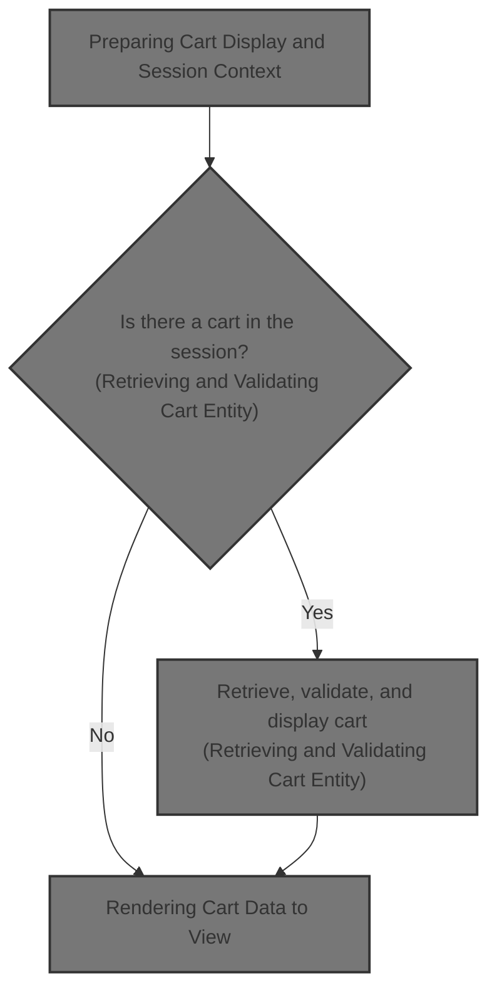
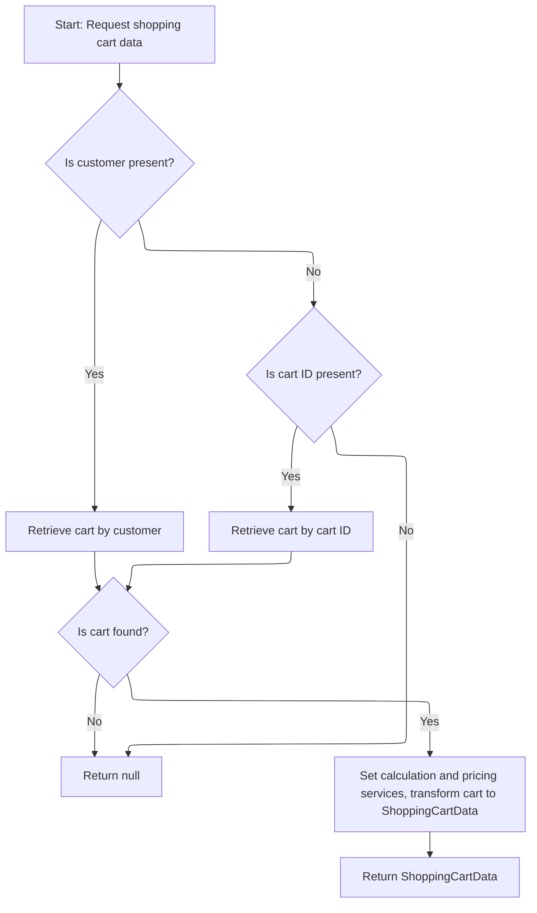

This document describes how the system displays a customer's shopping cart. When a customer requests to view their cart, the system prepares the page with localized meta information, retrieves and validates the cart data, transforms it for display, and renders the cart page. Customers see accurate product, pricing, and attribute details, or an empty cart if no cart exists.



# Preparing Cart Display and Session Context

This section governs how the shopping cart page is prepared for display to the customer, ensuring the correct context and data are presented based on the session state.

| Category       | Rule Name                      | Description                                                                                                                                                        |
| -------------- | ------------------------------ | ------------------------------------------------------------------------------------------------------------------------------------------------------------------ |
| Business logic | Empty Cart Display             | If there is no shopping cart code present in the session, the system must display an empty shopping cart to the customer.                                          |
| Business logic | Localized Page Meta            | The shopping cart page must always display the correct page title and meta information based on the user's locale.                                                 |
| Business logic | Session Context Cart Retrieval | The shopping cart data must be retrieved using the current customer, store, and cart code from the session to ensure the cart reflects the user's current context. |

<SwmSnippet path="/shopizer/sm-shop/src/main/java/com/salesmanager/web/shop/controller/shoppingCart/ShoppingCartController.java" line="229">

---

In <SwmToken path="shopizer/sm-shop/src/main/java/com/salesmanager/web/shop/controller/shoppingCart/ShoppingCartController.java" pos="229:5:5" line-data="    public String displayShoppingCart( final Model model, final HttpServletRequest request, final HttpServletResponse response, final Locale locale )">`displayShoppingCart`</SwmToken>, we set up page meta info, grab the store and customer from the session, and check if there's a cart code. If not, we bail early and show an empty cart. Otherwise, we call the facade to fetch the cart data, since that's where the logic for assembling the cart lives.

```java
    public String displayShoppingCart( final Model model, final HttpServletRequest request, final HttpServletResponse response, final Locale locale )
        throws Exception
    {

        LOG.info( "Starting to calculate shopping cart..." );
        
        
		//meta information
		PageInformation pageInformation = new PageInformation();
		pageInformation.setPageTitle(messages.getMessage("label.cart.placeorder", locale));
		request.setAttribute(Constants.REQUEST_PAGE_INFORMATION, pageInformation);
        
        
	    MerchantStore store = (MerchantStore) request.getAttribute(Constants.MERCHANT_STORE);
	    Customer customer = getSessionAttribute(  Constants.CUSTOMER, request );

        /** there must be a cart in the session **/
        String cartCode = (String)request.getSession().getAttribute(Constants.SHOPPING_CART);
        
        if(StringUtils.isBlank(cartCode)) {
        	//display empty cart
            StringBuilder template =
                    new StringBuilder().append( ControllerConstants.Tiles.ShoppingCart.shoppingCart ).append( "." ).append( store.getStoreTemplate() );
                return template.toString();
        }
                
        ShoppingCartData shoppingCart = shoppingCartFacade.getShoppingCartData(customer, store, cartCode);
```

---

</SwmSnippet>

## Retrieving and Validating Cart Entity



This section governs the retrieval and validation of a shopping cart entity for a user session, ensuring that only valid and non-obsolete carts are returned and transformed for UI consumption.

| Category        | Rule Name                           | Description                                                                                                                                                                                                                                                                                                                                                                                                                  |
| --------------- | ----------------------------------- | ---------------------------------------------------------------------------------------------------------------------------------------------------------------------------------------------------------------------------------------------------------------------------------------------------------------------------------------------------------------------------------------------------------------------------- |
| Data validation | Null Output for Missing Identifiers | If neither a customer nor a valid cart ID is provided, the output must be null, indicating no cart can be retrieved.                                                                                                                                                                                                                                                                                                         |
| Business logic  | Cart Retrieval Priority             | If a customer is present, the cart must be retrieved using the customer identifier. If no customer is present, the cart must be retrieved using the cart ID if provided.                                                                                                                                                                                                                                                     |
| Business logic  | Obsolete Cart Removal               | If the retrieved cart is marked as obsolete, it must be deleted and not returned to the user.                                                                                                                                                                                                                                                                                                                                |
| Business logic  | Cart Data Transformation            | If a valid cart is found, it must be transformed into a <SwmToken path="shopizer/sm-shop/src/main/java/com/salesmanager/web/shop/controller/shoppingCart/ShoppingCartController.java" pos="255:1:1" line-data="        ShoppingCartData shoppingCart = shoppingCartFacade.getShoppingCartData(customer, store, cartCode);">`ShoppingCartData`</SwmToken> object with calculated prices and attributes before being returned. |

<SwmSnippet path="/shopizer/sm-shop/src/main/java/com/salesmanager/web/shop/controller/shoppingCart/facade/ShoppingCartFacadeImpl.java" line="260">

---

In <SwmToken path="shopizer/sm-shop/src/main/java/com/salesmanager/web/shop/controller/shoppingCart/facade/ShoppingCartFacadeImpl.java" pos="260:5:5" line-data="    public ShoppingCartData getShoppingCartData( final Customer customer, final MerchantStore store,">`getShoppingCartData`</SwmToken>, we first try to get the cart for the customer. If that's not possible, we fall back to fetching by cart code. The actual retrieval is handled by the service layer, which applies business rules and fetches from the database.

```java
    public ShoppingCartData getShoppingCartData( final Customer customer, final MerchantStore store,
                                                 final String shoppingCartId )
        throws Exception
    {

        ShoppingCart cart = null;
        try
        {
            if ( customer != null )
            {
                LOG.info( "Reteriving customer shopping cart..." );

                cart = shoppingCartService.getShoppingCart( customer );

            }

            else
            {
```

---

</SwmSnippet>

<SwmSnippet path="/shopizer/sm-core/src/main/java/com/salesmanager/core/business/shoppingcart/service/ShoppingCartServiceImpl.java" line="68">

---

<SwmToken path="shopizer/sm-core/src/main/java/com/salesmanager/core/business/shoppingcart/service/ShoppingCartServiceImpl.java" pos="68:5:5" line-data="	public ShoppingCart getShoppingCart(final Customer customer) throws ServiceException {">`getShoppingCart`</SwmToken> fetches the cart for a customer, populates it, and checks if it's obsolete. If so, it deletes the cart and returns null, otherwise it returns the valid cart. This keeps things clean and avoids using stale carts.

```java
	public ShoppingCart getShoppingCart(final Customer customer) throws ServiceException {

		try {

			ShoppingCart shoppingCart = shoppingCartDao.getByCustomer(customer);
			populateShoppingCart(shoppingCart);
			if(shoppingCart!=null && shoppingCart.isObsolete()) {
				delete(shoppingCart);
				return null;
			} else {
				return shoppingCart;
			}


		} catch (Exception e) {
			throw new ServiceException(e);
		}

	}
```

---

</SwmSnippet>

<SwmSnippet path="/shopizer/sm-shop/src/main/java/com/salesmanager/web/shop/controller/shoppingCart/facade/ShoppingCartFacadeImpl.java" line="278">

---

Back in <SwmToken path="shopizer/sm-shop/src/main/java/com/salesmanager/web/shop/controller/shoppingCart/ShoppingCartController.java" pos="255:9:9" line-data="        ShoppingCartData shoppingCart = shoppingCartFacade.getShoppingCartData(customer, store, cartCode);">`getShoppingCartData`</SwmToken>, after getting the cart entity from the service, we use the populator to map it into a DTO with calculated prices and attributes. This is what the UI actually consumes.

```java
                if ( StringUtils.isNotBlank( shoppingCartId ) && cart == null )
                {
                    cart = shoppingCartService.getByCode( shoppingCartId, store );
                }

            }
        }
        catch ( ServiceException ex )
        {
            LOG.error( "Error while retriving cart from customer", ex );
        }
        catch( NoResultException nre) {
        	//nothing
        }

        if ( cart == null )
        {
            return null;
        }

        LOG.info( "Cart model found." );

        ShoppingCartDataPopulator shoppingCartDataPopulator = new ShoppingCartDataPopulator();
        shoppingCartDataPopulator.setShoppingCartCalculationService( shoppingCartCalculationService );
        shoppingCartDataPopulator.setPricingService( pricingService );

        Language language = (Language) getKeyValue( Constants.LANGUAGE );
        MerchantStore merchantStore = (MerchantStore) getKeyValue( Constants.MERCHANT_STORE );
        return shoppingCartDataPopulator.populate( cart, merchantStore, language );

    }
```

---

</SwmSnippet>

## Mapping Cart Entity to DTO for UI

```mermaid
%%{init: {"flowchart": {"defaultRenderer": "elk"}} }%%
flowchart TD
    node1["Start: Transform internal cart to display cart"]
    click node1 openCode "shopizer/sm-shop/src/main/java/com/salesmanager/web/populator/shoppingCart/ShoppingCartDataPopulator.java:73:77"
    node1 --> node2{"Are there items in the cart?"}
    click node2 openCode "shopizer/sm-shop/src/main/java/com/salesmanager/web/populator/shoppingCart/ShoppingCartDataPopulator.java:78:81"
    node2 -->|"Yes"| node3["Build display items list"]
    click node3 openCode "shopizer/sm-shop/src/main/java/com/salesmanager/web/populator/shoppingCart/ShoppingCartDataPopulator.java:82:127"
    subgraph loop1["For each item in cart"]
        node3 --> node4["Enrich item with product info, price, quantity, image"]
        click node4 openCode "shopizer/sm-shop/src/main/java/com/salesmanager/web/populator/shoppingCart/ShoppingCartDataPopulator.java:85:106"
        node4 --> node5{"Does item have attributes?"}
        click node5 openCode "shopizer/sm-shop/src/main/java/com/salesmanager/web/populator/shoppingCart/ShoppingCartDataPopulator.java:107:108"
        node5 -->|"Yes"| node6["Add attribute details to item"]
        click node6 openCode "shopizer/sm-shop/src/main/java/com/salesmanager/web/populator/shoppingCart/ShoppingCartDataPopulator.java:109:125"
        node5 -->|"No"| node7["Skip attribute details"]
        click node7 openCode "shopizer/sm-shop/src/main/java/com/salesmanager/web/populator/shoppingCart/ShoppingCartDataPopulator.java:126:127"
    end
    node2 -->|"No"| node8["No items to process"]
    click node8 openCode "shopizer/sm-shop/src/main/java/com/salesmanager/web/populator/shoppingCart/ShoppingCartDataPopulator.java:129:131"
    node3 --> node9["Calculate cart totals"]
    click node9 openCode "shopizer/sm-shop/src/main/java/com/salesmanager/web/populator/shoppingCart/ShoppingCartDataPopulator.java:133:137"
    node9 --> node10{"Are there calculated totals?"}
    click node10 openCode "shopizer/sm-shop/src/main/java/com/salesmanager/web/populator/shoppingCart/ShoppingCartDataPopulator.java:139:140"
    node10 -->|"Yes"| node11["Build display totals list"]
    click node11 openCode "shopizer/sm-shop/src/main/java/com/salesmanager/web/populator/shoppingCart/ShoppingCartDataPopulator.java:141:147"
    node10 -->|"No"| node12["Skip totals"]
    click node12 openCode "shopizer/sm-shop/src/main/java/com/salesmanager/web/populator/shoppingCart/ShoppingCartDataPopulator.java:148:148"
    node11 --> node13["Set subtotal, total, quantity, cart id"]
    click node13 openCode "shopizer/sm-shop/src/main/java/com/salesmanager/web/populator/shoppingCart/ShoppingCartDataPopulator.java:150:153"
    node12 --> node13
    node13 --> node14["Return display cart"]
    click node14 openCode "shopizer/sm-shop/src/main/java/com/salesmanager/web/populator/shoppingCart/ShoppingCartDataPopulator.java:159:160"

classDef HeadingStyle fill:#777777,stroke:#333,stroke-width:2px;

%% Swimm:
%% %%{init: {"flowchart": {"defaultRenderer": "elk"}} }%%
%% flowchart TD
%%     node1["Start: Transform internal cart to display cart"]
%%     click node1 openCode "<SwmPath>[shopizer/…/shoppingCart/ShoppingCartDataPopulator.java](shopizer/sm-shop/src/main/java/com/salesmanager/web/populator/shoppingCart/ShoppingCartDataPopulator.java)</SwmPath>:73:77"
%%     node1 --> node2{"Are there items in the cart?"}
%%     click node2 openCode "<SwmPath>[shopizer/…/shoppingCart/ShoppingCartDataPopulator.java](shopizer/sm-shop/src/main/java/com/salesmanager/web/populator/shoppingCart/ShoppingCartDataPopulator.java)</SwmPath>:78:81"
%%     node2 -->|"Yes"| node3["Build display items list"]
%%     click node3 openCode "<SwmPath>[shopizer/…/shoppingCart/ShoppingCartDataPopulator.java](shopizer/sm-shop/src/main/java/com/salesmanager/web/populator/shoppingCart/ShoppingCartDataPopulator.java)</SwmPath>:82:127"
%%     subgraph loop1["For each item in cart"]
%%         node3 --> node4["Enrich item with product info, price, quantity, image"]
%%         click node4 openCode "<SwmPath>[shopizer/…/shoppingCart/ShoppingCartDataPopulator.java](shopizer/sm-shop/src/main/java/com/salesmanager/web/populator/shoppingCart/ShoppingCartDataPopulator.java)</SwmPath>:85:106"
%%         node4 --> node5{"Does item have attributes?"}
%%         click node5 openCode "<SwmPath>[shopizer/…/shoppingCart/ShoppingCartDataPopulator.java](shopizer/sm-shop/src/main/java/com/salesmanager/web/populator/shoppingCart/ShoppingCartDataPopulator.java)</SwmPath>:107:108"
%%         node5 -->|"Yes"| node6["Add attribute details to item"]
%%         click node6 openCode "<SwmPath>[shopizer/…/shoppingCart/ShoppingCartDataPopulator.java](shopizer/sm-shop/src/main/java/com/salesmanager/web/populator/shoppingCart/ShoppingCartDataPopulator.java)</SwmPath>:109:125"
%%         node5 -->|"No"| node7["Skip attribute details"]
%%         click node7 openCode "<SwmPath>[shopizer/…/shoppingCart/ShoppingCartDataPopulator.java](shopizer/sm-shop/src/main/java/com/salesmanager/web/populator/shoppingCart/ShoppingCartDataPopulator.java)</SwmPath>:126:127"
%%     end
%%     node2 -->|"No"| node8["No items to process"]
%%     click node8 openCode "<SwmPath>[shopizer/…/shoppingCart/ShoppingCartDataPopulator.java](shopizer/sm-shop/src/main/java/com/salesmanager/web/populator/shoppingCart/ShoppingCartDataPopulator.java)</SwmPath>:129:131"
%%     node3 --> node9["Calculate cart totals"]
%%     click node9 openCode "<SwmPath>[shopizer/…/shoppingCart/ShoppingCartDataPopulator.java](shopizer/sm-shop/src/main/java/com/salesmanager/web/populator/shoppingCart/ShoppingCartDataPopulator.java)</SwmPath>:133:137"
%%     node9 --> node10{"Are there calculated totals?"}
%%     click node10 openCode "<SwmPath>[shopizer/…/shoppingCart/ShoppingCartDataPopulator.java](shopizer/sm-shop/src/main/java/com/salesmanager/web/populator/shoppingCart/ShoppingCartDataPopulator.java)</SwmPath>:139:140"
%%     node10 -->|"Yes"| node11["Build display totals list"]
%%     click node11 openCode "<SwmPath>[shopizer/…/shoppingCart/ShoppingCartDataPopulator.java](shopizer/sm-shop/src/main/java/com/salesmanager/web/populator/shoppingCart/ShoppingCartDataPopulator.java)</SwmPath>:141:147"
%%     node10 -->|"No"| node12["Skip totals"]
%%     click node12 openCode "<SwmPath>[shopizer/…/shoppingCart/ShoppingCartDataPopulator.java](shopizer/sm-shop/src/main/java/com/salesmanager/web/populator/shoppingCart/ShoppingCartDataPopulator.java)</SwmPath>:148:148"
%%     node11 --> node13["Set subtotal, total, quantity, cart id"]
%%     click node13 openCode "<SwmPath>[shopizer/…/shoppingCart/ShoppingCartDataPopulator.java](shopizer/sm-shop/src/main/java/com/salesmanager/web/populator/shoppingCart/ShoppingCartDataPopulator.java)</SwmPath>:150:153"
%%     node12 --> node13
%%     node13 --> node14["Return display cart"]
%%     click node14 openCode "<SwmPath>[shopizer/…/shoppingCart/ShoppingCartDataPopulator.java](shopizer/sm-shop/src/main/java/com/salesmanager/web/populator/shoppingCart/ShoppingCartDataPopulator.java)</SwmPath>:159:160"
%% 
%% classDef HeadingStyle fill:#777777,stroke:#333,stroke-width:2px;
```



This section governs the transformation of the internal cart entity into a display-ready DTO for the UI, ensuring all relevant product, pricing, and attribute information is accurately mapped and totals are calculated for user presentation.

| Category        | Rule Name                  | Description                                                                                                                                                                                                         |
| --------------- | -------------------------- | ------------------------------------------------------------------------------------------------------------------------------------------------------------------------------------------------------------------- |
| Data validation | Cart identity and quantity | The display cart must always include the cart code, cart ID, and total quantity of items, regardless of whether the cart contains items.                                                                            |
| Business logic  | Cart item mapping          | If the cart contains items, each item must be mapped to a display item including product code, name, price, quantity, and image. If no items are present, the display cart must reflect an empty state.             |
| Business logic  | Attribute display logic    | For each cart item, if product attributes are present, the first available option name and value must be displayed for each attribute. If no attributes exist, attribute details are omitted from the display item. |
| Business logic  | Cart totals calculation    | Cart totals, including subtotal and total, must be calculated and displayed if available. If no totals are calculated, the display cart omits these values.                                                         |

<SwmSnippet path="/shopizer/sm-shop/src/main/java/com/salesmanager/web/populator/shoppingCart/ShoppingCartDataPopulator.java" line="73">

---

In <SwmToken path="shopizer/sm-shop/src/main/java/com/salesmanager/web/populator/shoppingCart/ShoppingCartDataPopulator.java" pos="73:5:5" line-data="    public ShoppingCartData populate(final ShoppingCart shoppingCart,">`populate`</SwmToken>, we loop through cart items and map each one into a DTO, including product codes, names, prices, images, and attributes. We also grab option names and values from the first description in each list, assuming they're present.

```java
    public ShoppingCartData populate(final ShoppingCart shoppingCart,
                                     final ShoppingCartData cart, final MerchantStore store, final Language language) {

    	int cartQuantity = 0;
        cart.setCode(shoppingCart.getShoppingCartCode());
        Set<com.salesmanager.core.business.shoppingcart.model.ShoppingCartItem> items = shoppingCart.getLineItems();
        List<ShoppingCartItem> shoppingCartItemsList=Collections.emptyList();
        try{
            if(items!=null) {
                shoppingCartItemsList=new ArrayList<ShoppingCartItem>();
                for(com.salesmanager.core.business.shoppingcart.model.ShoppingCartItem item : items) {

                    ShoppingCartItem shoppingCartItem = new ShoppingCartItem();
                    shoppingCartItem.setCode(cart.getCode());
                    shoppingCartItem.setProductCode(item.getProduct().getSku());
                    shoppingCartItem.setProductVirtual(item.isProductVirtual());

                    shoppingCartItem.setProductId(item.getProductId());
                    shoppingCartItem.setId(item.getId());
                    shoppingCartItem.setName(item.getProduct().getProductDescription().getName());

                    shoppingCartItem.setPrice(pricingService.getDisplayAmount(item.getItemPrice(),store));
                    shoppingCartItem.setQuantity(item.getQuantity());
                    
                    
                    cartQuantity = cartQuantity + item.getQuantity();
                    
                    shoppingCartItem.setProductPrice(item.getItemPrice());
                    shoppingCartItem.setSubTotal(pricingService.getDisplayAmount(item.getSubTotal(), store));
                    ProductImage image = item.getProduct().getProductImage();
                    if(image!=null) {
                        String imagePath = ImageFilePathUtils.buildProductImageFilePath(store, item.getProduct().getSku(), image.getProductImage());
                        shoppingCartItem.setImage(imagePath);
                    }
                    Set<com.salesmanager.core.business.shoppingcart.model.ShoppingCartAttributeItem> attributes = item.getAttributes();
                    if(attributes!=null) {
                        List<ShoppingCartAttribute> cartAttributes = new ArrayList<ShoppingCartAttribute>();
                        for(com.salesmanager.core.business.shoppingcart.model.ShoppingCartAttributeItem attribute : attributes) {
                            ShoppingCartAttribute cartAttribute = new ShoppingCartAttribute();
                            cartAttribute.setId(attribute.getId());
                            cartAttribute.setAttributeId(attribute.getProductAttributeId());
                            cartAttribute.setOptionId(attribute.getProductAttribute().getProductOption().getId());
                            cartAttribute.setOptionValueId(attribute.getProductAttribute().getProductOptionValue().getId());
                            List<ProductOptionDescription> optionDescriptions = attribute.getProductAttribute().getProductOption().getDescriptionsSettoList();
                            List<ProductOptionValueDescription> optionValueDescriptions = attribute.getProductAttribute().getProductOptionValue().getDescriptionsSettoList();
                            if(!CollectionUtils.isEmpty(optionDescriptions) && !CollectionUtils.isEmpty(optionValueDescriptions)) {
                            	cartAttribute.setOptionName(optionDescriptions.get(0).getName());
                            	cartAttribute.setOptionValue(optionValueDescriptions.get(0).getName());
                            	cartAttributes.add(cartAttribute);
                            }
                        }
                        shoppingCartItem.setShoppingCartAttributes(cartAttributes);
                    }
                    shoppingCartItemsList.add(shoppingCartItem);
                }
```

---

</SwmSnippet>

<SwmSnippet path="/shopizer/sm-shop/src/main/java/com/salesmanager/web/populator/shoppingCart/ShoppingCartDataPopulator.java" line="129">

---

After mapping the cart items, we calculate the order summary and totals, then map those into DTOs and set them on the cart data. Prices are converted for display, and we set the subtotal, total, and quantity.

```java
            if(CollectionUtils.isNotEmpty(shoppingCartItemsList)){
                cart.setShoppingCartItems(shoppingCartItemsList);
            }

            OrderSummary summary = new OrderSummary();
            List<com.salesmanager.core.business.shoppingcart.model.ShoppingCartItem> productsList = new ArrayList<com.salesmanager.core.business.shoppingcart.model.ShoppingCartItem>();
            productsList.addAll(shoppingCart.getLineItems());
            summary.setProducts(productsList);
            OrderTotalSummary orderSummary = shoppingCartCalculationService.calculate(shoppingCart,store, language );

            if(CollectionUtils.isNotEmpty(orderSummary.getTotals())) {
            	List<OrderTotal> totals = new ArrayList<OrderTotal>();
            	for(com.salesmanager.core.business.order.model.OrderTotal t : orderSummary.getTotals()) {
            		OrderTotal total = new OrderTotal();
            		total.setCode(t.getOrderTotalCode());
            		total.setValue(t.getValue());
            		totals.add(total);
            	}
```

---

</SwmSnippet>

<SwmSnippet path="/shopizer/sm-shop/src/main/java/com/salesmanager/web/populator/shoppingCart/ShoppingCartDataPopulator.java" line="147">

---

Finally, we return the <SwmToken path="shopizer/sm-shop/src/main/java/com/salesmanager/web/shop/controller/shoppingCart/ShoppingCartController.java" pos="255:1:1" line-data="        ShoppingCartData shoppingCart = shoppingCartFacade.getShoppingCartData(customer, store, cartCode);">`ShoppingCartData`</SwmToken> DTO with all items, totals, prices, and quantities set, so the UI can render the cart.

```java
            	cart.setTotals(totals);
            }
            
            cart.setSubTotal(pricingService.getDisplayAmount(orderSummary.getSubTotal(), store));
            cart.setTotal(pricingService.getDisplayAmount(orderSummary.getTotal(), store));
            cart.setQuantity(cartQuantity);
            cart.setId(shoppingCart.getId());
        }
        catch(ServiceException ex){
            LOG.error( "Error while converting cart Model to cart Data.."+ex );
            throw new ConversionException( "Unable to create cart data", ex );
        }
        return cart;


    };
```

---

</SwmSnippet>

## Rendering Cart Data to View

<SwmSnippet path="/shopizer/sm-shop/src/main/java/com/salesmanager/web/shop/controller/shoppingCart/ShoppingCartController.java" line="256">

---

Back in <SwmToken path="shopizer/sm-shop/src/main/java/com/salesmanager/web/shop/controller/shoppingCart/ShoppingCartController.java" pos="229:5:5" line-data="    public String displayShoppingCart( final Model model, final HttpServletRequest request, final HttpServletResponse response, final Locale locale )">`displayShoppingCart`</SwmToken>, we add the populated cart DTO to the model and return the template name for rendering. The view gets all cart info from the model.

```java
        model.addAttribute( "cart", shoppingCart );

        /** template **/
        StringBuilder template =
            new StringBuilder().append( ControllerConstants.Tiles.ShoppingCart.shoppingCart ).append( "." ).append( store.getStoreTemplate() );
        return template.toString();

    }
```

---

</SwmSnippet>

&nbsp;

*This is an auto-generated document by Swimm 🌊 and has not yet been verified by a human*

<SwmMeta version="3.0.0" repo-id="Z2l0aHViJTNBJTNBU2hvcGl6ZXIlM0ElM0F1bWFsaW5nYXN3YW1p" repo-name="Shopizer"><sup>Powered by [Swimm](https://app.swimm.io/)</sup></SwmMeta>
