This document describes how admin users can move or add UI components by dragging and dropping them within the admin interface. The flow adapts to the source of the component, applies custom transformation logic if defined, and ensures the component is integrated into the desired location. Immediate feedback is provided by selecting the dropped item and triggering any completion callbacks.

# Where is this flow used?

This flow is used multiple times in the codebase as represented in the following diagram:

```mermaid
graph TD;
      bf12d9fc9f82ac0ae01056324f24cf99b4116fe7205d4ddea1a47f4acaaceeaa(shopizer/…/modules/ISC_DataBinding.js::editModeDrop) --> fba9b8d96428ef2d31ff310ffce1b079ab8a1189d80255bf691364cf41ad99a6(shopizer/…/modules/ISC_DataBinding.js::itemDrop):::mainFlowStyle

bf12d9fc9f82ac0ae01056324f24cf99b4116fe7205d4ddea1a47f4acaaceeaa(shopizer/…/modules/ISC_DataBinding.js::editModeDrop) --> e28ba995537820dd8dead0a7d62a397e20adffecdfe6e621afa9c105fd6fafea(shopizer/…/modules/ISC_DataBinding.js::modifyFormOnDrop)

374fd5926685af6fce28c1d76bf491de745cdecde478016317304478502a7b18(shopizer/…/modules/ISC_DataBinding.js::isc_DynamicForm_editModeDrop) --> fba9b8d96428ef2d31ff310ffce1b079ab8a1189d80255bf691364cf41ad99a6(shopizer/…/modules/ISC_DataBinding.js::itemDrop):::mainFlowStyle

374fd5926685af6fce28c1d76bf491de745cdecde478016317304478502a7b18(shopizer/…/modules/ISC_DataBinding.js::isc_DynamicForm_editModeDrop) --> e28ba995537820dd8dead0a7d62a397e20adffecdfe6e621afa9c105fd6fafea(shopizer/…/modules/ISC_DataBinding.js::modifyFormOnDrop)

e9eec5880d3eb201caf78aa5abebf6b98b027e46514de983f2efa47ae22449b5(shopizer/…/modules/ISC_DataBinding.js::isc_DynamicForm_modifyFormOnDrop) --> fba9b8d96428ef2d31ff310ffce1b079ab8a1189d80255bf691364cf41ad99a6(shopizer/…/modules/ISC_DataBinding.js::itemDrop):::mainFlowStyle

e28ba995537820dd8dead0a7d62a397e20adffecdfe6e621afa9c105fd6fafea(shopizer/…/modules/ISC_DataBinding.js::modifyFormOnDrop) --> fba9b8d96428ef2d31ff310ffce1b079ab8a1189d80255bf691364cf41ad99a6(shopizer/…/modules/ISC_DataBinding.js::itemDrop):::mainFlowStyle


classDef mainFlowStyle color:#000000,fill:#7CB9F4
classDef rootsStyle color:#000000,fill:#00FFF4
classDef Style1 color:#000000,fill:#00FFAA
classDef Style2 color:#000000,fill:#FFFF00
classDef Style3 color:#000000,fill:#AA7CB9

%% Swimm:
%% graph TD;
%%       bf12d9fc9f82ac0ae01056324f24cf99b4116fe7205d4ddea1a47f4acaaceeaa(<SwmPath>[shopizer/…/modules/ISC_DataBinding.js](shopizer/sm-shop/src/main/webapp/resources/smart-client/system/modules/ISC_DataBinding.js)</SwmPath>::<SwmToken path="shopizer/sm-shop/src/main/webapp/resources/smart-client/system/modules/ISC_DataBinding.js" pos="1850:111:111" line-data="this.editNode=_3;if(this.editingOn){this.saveToOriginalValues([&quot;click&quot;,&quot;doubleClick&quot;,&quot;willAcceptDrop&quot;,&quot;clearNoDropIndicator&quot;,&quot;setNoDropCursor&quot;,&quot;canAcceptDrop&quot;,&quot;canDropComponents&quot;,&quot;drop&quot;,&quot;dropMove&quot;,&quot;dropOver&quot;,&quot;setDataSource&quot;]);this.setProperties({click:this.editModeClick,doubleClick:this.editModeDoubleClick,willAcceptDrop:this.editModeWillAcceptDrop,clearNoDropIndicator:this.editModeClearNoDropIndicator,setNoDropIndicator:this.editModeSetNoDropIndicator,canAcceptDrop:true,canDropComponents:true,drop:this.editModeDrop,dropMove:this.editModeDropMove,dropOver:this.editModeDropOver,baseSetDataSource:this.setDataSource,setDataSource:this.editModeSetDataSource})}else{this.restoreFromOriginalValues([&quot;click&quot;,&quot;doubleClick&quot;,&quot;willAcceptDrop&quot;,&quot;clearNoDropIndicator&quot;,&quot;setNoDropCursor&quot;,&quot;canAcceptDrop&quot;,&quot;canDropComponents&quot;,&quot;drop&quot;,&quot;dropMove&quot;,&quot;dropOver&quot;,&quot;setDataSource&quot;])}">`editModeDrop`</SwmToken>) --> fba9b8d96428ef2d31ff310ffce1b079ab8a1189d80255bf691364cf41ad99a6(<SwmPath>[shopizer/…/modules/ISC_DataBinding.js](shopizer/sm-shop/src/main/webapp/resources/smart-client/system/modules/ISC_DataBinding.js)</SwmPath>::<SwmToken path="shopizer/sm-shop/src/main/webapp/resources/smart-client/system/modules/ISC_DataBinding.js" pos="2045:5:5" line-data=",isc.A.itemDrop=function isc_DynamicForm_itemDrop(_1,_2,_3,_4,_5,_6){var _7=_1.getDragData();if(_7==null){_7=isc.EH.dragTarget;if(isc.isA.FormItemProxyCanvas(_7)){this.logInfo(&quot;The dragTarget is a FormItemProxyCanvas for &quot;+_7.formItem,&quot;editModeDragTarget&quot;);_7=_7.formItem}}">`itemDrop`</SwmToken>):::mainFlowStyle
%% 
%% bf12d9fc9f82ac0ae01056324f24cf99b4116fe7205d4ddea1a47f4acaaceeaa(<SwmPath>[shopizer/…/modules/ISC_DataBinding.js](shopizer/sm-shop/src/main/webapp/resources/smart-client/system/modules/ISC_DataBinding.js)</SwmPath>::<SwmToken path="shopizer/sm-shop/src/main/webapp/resources/smart-client/system/modules/ISC_DataBinding.js" pos="1850:111:111" line-data="this.editNode=_3;if(this.editingOn){this.saveToOriginalValues([&quot;click&quot;,&quot;doubleClick&quot;,&quot;willAcceptDrop&quot;,&quot;clearNoDropIndicator&quot;,&quot;setNoDropCursor&quot;,&quot;canAcceptDrop&quot;,&quot;canDropComponents&quot;,&quot;drop&quot;,&quot;dropMove&quot;,&quot;dropOver&quot;,&quot;setDataSource&quot;]);this.setProperties({click:this.editModeClick,doubleClick:this.editModeDoubleClick,willAcceptDrop:this.editModeWillAcceptDrop,clearNoDropIndicator:this.editModeClearNoDropIndicator,setNoDropIndicator:this.editModeSetNoDropIndicator,canAcceptDrop:true,canDropComponents:true,drop:this.editModeDrop,dropMove:this.editModeDropMove,dropOver:this.editModeDropOver,baseSetDataSource:this.setDataSource,setDataSource:this.editModeSetDataSource})}else{this.restoreFromOriginalValues([&quot;click&quot;,&quot;doubleClick&quot;,&quot;willAcceptDrop&quot;,&quot;clearNoDropIndicator&quot;,&quot;setNoDropCursor&quot;,&quot;canAcceptDrop&quot;,&quot;canDropComponents&quot;,&quot;drop&quot;,&quot;dropMove&quot;,&quot;dropOver&quot;,&quot;setDataSource&quot;])}">`editModeDrop`</SwmToken>) --> e28ba995537820dd8dead0a7d62a397e20adffecdfe6e621afa9c105fd6fafea(<SwmPath>[shopizer/…/modules/ISC_DataBinding.js](shopizer/sm-shop/src/main/webapp/resources/smart-client/system/modules/ISC_DataBinding.js)</SwmPath>::<SwmToken path="shopizer/sm-shop/src/main/webapp/resources/smart-client/system/modules/ISC_DataBinding.js" pos="2043:16:16" line-data="var _7=this.items.$8j.duplicate();this.modifyFormOnDrop(_2,_3.top,_3.left,_4,_7)}">`modifyFormOnDrop`</SwmToken>)
%% 
%% 374fd5926685af6fce28c1d76bf491de745cdecde478016317304478502a7b18(<SwmPath>[shopizer/…/modules/ISC_DataBinding.js](shopizer/sm-shop/src/main/webapp/resources/smart-client/system/modules/ISC_DataBinding.js)</SwmPath>::<SwmToken path="shopizer/sm-shop/src/main/webapp/resources/smart-client/system/modules/ISC_DataBinding.js" pos="2037:9:9" line-data=",isc.A.editModeDrop=function isc_DynamicForm_editModeDrop(){var _1=this.ns.EH.getDragTarget().getDragData();if(isc.isAn.Array(_1))_1=_1[0];if((_1&amp;&amp;_1.className==&quot;DataSource&quot;)||this.getItems().length==0)">`isc_DynamicForm_editModeDrop`</SwmToken>) --> fba9b8d96428ef2d31ff310ffce1b079ab8a1189d80255bf691364cf41ad99a6(<SwmPath>[shopizer/…/modules/ISC_DataBinding.js](shopizer/sm-shop/src/main/webapp/resources/smart-client/system/modules/ISC_DataBinding.js)</SwmPath>::<SwmToken path="shopizer/sm-shop/src/main/webapp/resources/smart-client/system/modules/ISC_DataBinding.js" pos="2045:5:5" line-data=",isc.A.itemDrop=function isc_DynamicForm_itemDrop(_1,_2,_3,_4,_5,_6){var _7=_1.getDragData();if(_7==null){_7=isc.EH.dragTarget;if(isc.isA.FormItemProxyCanvas(_7)){this.logInfo(&quot;The dragTarget is a FormItemProxyCanvas for &quot;+_7.formItem,&quot;editModeDragTarget&quot;);_7=_7.formItem}}">`itemDrop`</SwmToken>):::mainFlowStyle
%% 
%% 374fd5926685af6fce28c1d76bf491de745cdecde478016317304478502a7b18(<SwmPath>[shopizer/…/modules/ISC_DataBinding.js](shopizer/sm-shop/src/main/webapp/resources/smart-client/system/modules/ISC_DataBinding.js)</SwmPath>::<SwmToken path="shopizer/sm-shop/src/main/webapp/resources/smart-client/system/modules/ISC_DataBinding.js" pos="2037:9:9" line-data=",isc.A.editModeDrop=function isc_DynamicForm_editModeDrop(){var _1=this.ns.EH.getDragTarget().getDragData();if(isc.isAn.Array(_1))_1=_1[0];if((_1&amp;&amp;_1.className==&quot;DataSource&quot;)||this.getItems().length==0)">`isc_DynamicForm_editModeDrop`</SwmToken>) --> e28ba995537820dd8dead0a7d62a397e20adffecdfe6e621afa9c105fd6fafea(<SwmPath>[shopizer/…/modules/ISC_DataBinding.js](shopizer/sm-shop/src/main/webapp/resources/smart-client/system/modules/ISC_DataBinding.js)</SwmPath>::<SwmToken path="shopizer/sm-shop/src/main/webapp/resources/smart-client/system/modules/ISC_DataBinding.js" pos="2043:16:16" line-data="var _7=this.items.$8j.duplicate();this.modifyFormOnDrop(_2,_3.top,_3.left,_4,_7)}">`modifyFormOnDrop`</SwmToken>)
%% 
%% e9eec5880d3eb201caf78aa5abebf6b98b027e46514de983f2efa47ae22449b5(<SwmPath>[shopizer/…/modules/ISC_DataBinding.js](shopizer/sm-shop/src/main/webapp/resources/smart-client/system/modules/ISC_DataBinding.js)</SwmPath>::<SwmToken path="shopizer/sm-shop/src/main/webapp/resources/smart-client/system/modules/ISC_DataBinding.js" pos="2058:9:9" line-data=",isc.A.modifyFormOnDrop=function isc_DynamicForm_modifyFormOnDrop(_1,_2,_3,_4,_5){if(this.canAddColumns==false)return;var _6=this.ns.EH.getDragTarget().getDragData(),_7,_8,_9,_10=this;if(!_6){_6=this.ns.EH.getDragTarget();if(!isc.isA.FormItemProxyCanvas(_6)){this.logWarn(&quot;In modifyFormOnDrop the drag target was not a FormItemProxyCanvas&quot;);return}">`isc_DynamicForm_modifyFormOnDrop`</SwmToken>) --> fba9b8d96428ef2d31ff310ffce1b079ab8a1189d80255bf691364cf41ad99a6(<SwmPath>[shopizer/…/modules/ISC_DataBinding.js](shopizer/sm-shop/src/main/webapp/resources/smart-client/system/modules/ISC_DataBinding.js)</SwmPath>::<SwmToken path="shopizer/sm-shop/src/main/webapp/resources/smart-client/system/modules/ISC_DataBinding.js" pos="2045:5:5" line-data=",isc.A.itemDrop=function isc_DynamicForm_itemDrop(_1,_2,_3,_4,_5,_6){var _7=_1.getDragData();if(_7==null){_7=isc.EH.dragTarget;if(isc.isA.FormItemProxyCanvas(_7)){this.logInfo(&quot;The dragTarget is a FormItemProxyCanvas for &quot;+_7.formItem,&quot;editModeDragTarget&quot;);_7=_7.formItem}}">`itemDrop`</SwmToken>):::mainFlowStyle
%% 
%% e28ba995537820dd8dead0a7d62a397e20adffecdfe6e621afa9c105fd6fafea(<SwmPath>[shopizer/…/modules/ISC_DataBinding.js](shopizer/sm-shop/src/main/webapp/resources/smart-client/system/modules/ISC_DataBinding.js)</SwmPath>::<SwmToken path="shopizer/sm-shop/src/main/webapp/resources/smart-client/system/modules/ISC_DataBinding.js" pos="2043:16:16" line-data="var _7=this.items.$8j.duplicate();this.modifyFormOnDrop(_2,_3.top,_3.left,_4,_7)}">`modifyFormOnDrop`</SwmToken>) --> fba9b8d96428ef2d31ff310ffce1b079ab8a1189d80255bf691364cf41ad99a6(<SwmPath>[shopizer/…/modules/ISC_DataBinding.js](shopizer/sm-shop/src/main/webapp/resources/smart-client/system/modules/ISC_DataBinding.js)</SwmPath>::<SwmToken path="shopizer/sm-shop/src/main/webapp/resources/smart-client/system/modules/ISC_DataBinding.js" pos="2045:5:5" line-data=",isc.A.itemDrop=function isc_DynamicForm_itemDrop(_1,_2,_3,_4,_5,_6){var _7=_1.getDragData();if(_7==null){_7=isc.EH.dragTarget;if(isc.isA.FormItemProxyCanvas(_7)){this.logInfo(&quot;The dragTarget is a FormItemProxyCanvas for &quot;+_7.formItem,&quot;editModeDragTarget&quot;);_7=_7.formItem}}">`itemDrop`</SwmToken>):::mainFlowStyle
%% 
%% 
%% classDef mainFlowStyle color:#000000,fill:#7CB9F4
%% classDef rootsStyle color:#000000,fill:#00FFF4
%% classDef Style1 color:#000000,fill:#00FFAA
%% classDef Style2 color:#000000,fill:#FFFF00
%% classDef Style3 color:#000000,fill:#AA7CB9
```



# Dropping and Integrating UI Components

```mermaid
%%{init: {"flowchart": {"defaultRenderer": "elk"}} }%%
flowchart TD
    node1["Start item drop"]
    click node1 openCode "shopizer/sm-shop/src/main/webapp/resources/smart-client/system/modules/ISC_DataBinding.js:2045:2051"
    node1 --> node2{"Is drag source a Palette?"}
    click node2 openCode "shopizer/sm-shop/src/main/webapp/resources/smart-client/system/modules/ISC_DataBinding.js:2046:2048"
    node2 -->|"No"| node3{"Is custom itemDropping defined?"}
    click node3 openCode "shopizer/sm-shop/src/main/webapp/resources/smart-client/system/modules/ISC_DataBinding.js:2046:2047"
    node3 -->|"Yes"| node4["Transform item with custom logic"]
    click node4 openCode "shopizer/sm-shop/src/main/webapp/resources/smart-client/system/modules/ISC_DataBinding.js:2046:2047"
    node4 --> node5["Remove item from old location"]
    click node5 openCode "shopizer/sm-shop/src/main/webapp/resources/smart-client/system/modules/ISC_DataBinding.js:2047:2047"
    node3 -->|"No"| node5
    node5 --> node6["Add item to new location"]
    click node6 openCode "shopizer/sm-shop/src/main/webapp/resources/smart-client/system/modules/ISC_DataBinding.js:2047:2047"
    node6 --> node7["Select dropped item and mark as dropped"]
    click node7 openCode "shopizer/sm-shop/src/main/webapp/resources/smart-client/system/modules/ISC_DataBinding.js:2047:2047"
    node2 -->|"Yes"| node8{"Does item need to load data?"}
    click node8 openCode "shopizer/sm-shop/src/main/webapp/resources/smart-client/system/modules/ISC_DataBinding.js:2048:2051"
    node8 -->|"Yes"| node9["Load item data"]
    click node9 openCode "shopizer/sm-shop/src/main/webapp/resources/smart-client/system/modules/ISC_DataBinding.js:2048:2050"
    node9 --> node10{"Is item Button, Canvas, or FormItem?"}
    click node10 openCode "shopizer/sm-shop/src/main/webapp/resources/smart-client/system/modules/ISC_DataBinding.js:2052:2053"
    node10 -->|"Button/Canvas"| node11["Transform item for drop"]
    click node11 openCode "shopizer/sm-shop/src/main/webapp/resources/smart-client/system/modules/ISC_DataBinding.js:2052:2053"
    node11 --> node12["Add item and mark as dropped/loaded"]
    click node12 openCode "shopizer/sm-shop/src/main/webapp/resources/smart-client/system/modules/ISC_DataBinding.js:2053:2057"
    node10 -->|FormItem| node12
    node8 -->|"No"| node10
    node12 --> node13["Select dropped item and provide UI feedback"]
    click node13 openCode "shopizer/sm-shop/src/main/webapp/resources/smart-client/system/modules/ISC_DataBinding.js:2056:2057"

classDef HeadingStyle fill:#777777,stroke:#333,stroke-width:2px;

%% Swimm:
%% %%{init: {"flowchart": {"defaultRenderer": "elk"}} }%%
%% flowchart TD
%%     node1["Start item drop"]
%%     click node1 openCode "<SwmPath>[shopizer/…/modules/ISC_DataBinding.js](shopizer/sm-shop/src/main/webapp/resources/smart-client/system/modules/ISC_DataBinding.js)</SwmPath>:2045:2051"
%%     node1 --> node2{"Is drag source a Palette?"}
%%     click node2 openCode "<SwmPath>[shopizer/…/modules/ISC_DataBinding.js](shopizer/sm-shop/src/main/webapp/resources/smart-client/system/modules/ISC_DataBinding.js)</SwmPath>:2046:2048"
%%     node2 -->|"No"| node3{"Is custom <SwmToken path="shopizer/sm-shop/src/main/webapp/resources/smart-client/system/modules/ISC_DataBinding.js" pos="2046:84:84" line-data="if(!_1.isA(&quot;Palette&quot;)){if(isc.EditContext.$70r)isc.EditContext.$70r.hide();var _8=this.editContext.data,_9=_8.getParent(_7.editNode),_10=_8.getChildren(_9).indexOf(_7.editNode),_11=_7.editNode;if(isc.isA.Function(this.itemDropping)){_11=this.itemDropping(_11,_2,true);if(!_11)return}">`itemDropping`</SwmToken> defined?"}
%%     click node3 openCode "<SwmPath>[shopizer/…/modules/ISC_DataBinding.js](shopizer/sm-shop/src/main/webapp/resources/smart-client/system/modules/ISC_DataBinding.js)</SwmPath>:2046:2047"
%%     node3 -->|"Yes"| node4["Transform item with custom logic"]
%%     click node4 openCode "<SwmPath>[shopizer/…/modules/ISC_DataBinding.js](shopizer/sm-shop/src/main/webapp/resources/smart-client/system/modules/ISC_DataBinding.js)</SwmPath>:2046:2047"
%%     node4 --> node5["Remove item from old location"]
%%     click node5 openCode "<SwmPath>[shopizer/…/modules/ISC_DataBinding.js](shopizer/sm-shop/src/main/webapp/resources/smart-client/system/modules/ISC_DataBinding.js)</SwmPath>:2047:2047"
%%     node3 -->|"No"| node5
%%     node5 --> node6["Add item to new location"]
%%     click node6 openCode "<SwmPath>[shopizer/…/modules/ISC_DataBinding.js](shopizer/sm-shop/src/main/webapp/resources/smart-client/system/modules/ISC_DataBinding.js)</SwmPath>:2047:2047"
%%     node6 --> node7["Select dropped item and mark as dropped"]
%%     click node7 openCode "<SwmPath>[shopizer/…/modules/ISC_DataBinding.js](shopizer/sm-shop/src/main/webapp/resources/smart-client/system/modules/ISC_DataBinding.js)</SwmPath>:2047:2047"
%%     node2 -->|"Yes"| node8{"Does item need to load data?"}
%%     click node8 openCode "<SwmPath>[shopizer/…/modules/ISC_DataBinding.js](shopizer/sm-shop/src/main/webapp/resources/smart-client/system/modules/ISC_DataBinding.js)</SwmPath>:2048:2051"
%%     node8 -->|"Yes"| node9["Load item data"]
%%     click node9 openCode "<SwmPath>[shopizer/…/modules/ISC_DataBinding.js](shopizer/sm-shop/src/main/webapp/resources/smart-client/system/modules/ISC_DataBinding.js)</SwmPath>:2048:2050"
%%     node9 --> node10{"Is item Button, Canvas, or <SwmToken path="shopizer/sm-shop/src/main/webapp/resources/smart-client/system/modules/ISC_DataBinding.js" pos="2052:41:41" line-data=",isc.A.completeItemDrop=function isc_DynamicForm_completeItemDrop(_1,_2,_3,_4,_5,_6){var _7=_1.liveObject,_8;if(!isc.isA.FormItem(_7)){if(isc.isA.Button(_7)||isc.isAn.IButton(_7)){_1=this.editContext.makeEditNode({type:&quot;ButtonItem&quot;,title:_7.title,defaults:_1.defaults})}else if(isc.isA.Canvas(_7)){_8=_1;_1=this.editContext.makeEditNode({type:&quot;CanvasItem&quot;});isc.addProperties(_1.initData,{showTitle:false,startRow:true,endRow:true,width:&quot;*&quot;,colSpan:&quot;*&quot;})}}">`FormItem`</SwmToken>?"}
%%     click node10 openCode "<SwmPath>[shopizer/…/modules/ISC_DataBinding.js](shopizer/sm-shop/src/main/webapp/resources/smart-client/system/modules/ISC_DataBinding.js)</SwmPath>:2052:2053"
%%     node10 -->|"Button/Canvas"| node11["Transform item for drop"]
%%     click node11 openCode "<SwmPath>[shopizer/…/modules/ISC_DataBinding.js](shopizer/sm-shop/src/main/webapp/resources/smart-client/system/modules/ISC_DataBinding.js)</SwmPath>:2052:2053"
%%     node11 --> node12["Add item and mark as dropped/loaded"]
%%     click node12 openCode "<SwmPath>[shopizer/…/modules/ISC_DataBinding.js](shopizer/sm-shop/src/main/webapp/resources/smart-client/system/modules/ISC_DataBinding.js)</SwmPath>:2053:2057"
%%     node10 -->|<SwmToken path="shopizer/sm-shop/src/main/webapp/resources/smart-client/system/modules/ISC_DataBinding.js" pos="2052:41:41" line-data=",isc.A.completeItemDrop=function isc_DynamicForm_completeItemDrop(_1,_2,_3,_4,_5,_6){var _7=_1.liveObject,_8;if(!isc.isA.FormItem(_7)){if(isc.isA.Button(_7)||isc.isAn.IButton(_7)){_1=this.editContext.makeEditNode({type:&quot;ButtonItem&quot;,title:_7.title,defaults:_1.defaults})}else if(isc.isA.Canvas(_7)){_8=_1;_1=this.editContext.makeEditNode({type:&quot;CanvasItem&quot;});isc.addProperties(_1.initData,{showTitle:false,startRow:true,endRow:true,width:&quot;*&quot;,colSpan:&quot;*&quot;})}}">`FormItem`</SwmToken>| node12
%%     node8 -->|"No"| node10
%%     node12 --> node13["Select dropped item and provide UI feedback"]
%%     click node13 openCode "<SwmPath>[shopizer/…/modules/ISC_DataBinding.js](shopizer/sm-shop/src/main/webapp/resources/smart-client/system/modules/ISC_DataBinding.js)</SwmPath>:2056:2057"
%% 
%% classDef HeadingStyle fill:#777777,stroke:#333,stroke-width:<SwmToken path="shopizer/sm-shop/src/main/webapp/resources/smart-client/system/modules/ISC_DataBinding.js" pos="2217:180:180" line-data="isc.defineClass(&quot;EditPane&quot;,&quot;Canvas&quot;,&quot;EditContext&quot;);isc.A=isc.EditPane.getPrototype();isc.B=isc._allFuncs;isc.C=isc.B._maxIndex;isc.D=isc._funcClasses;isc.D[isc.C]=isc.A.Class;isc.A.canAcceptDrop=true;isc.A.contextMenu={autoDraw:false,data:[{title:&quot;Clear&quot;,click:&quot;target.removeAll()&quot;}]};isc.A.editingOn=true;isc.A.persistCoordinates=true;isc.A.canDrag=true;isc.A.dragAppearance=&quot;none&quot;;isc.A.overflow=&quot;hidden&quot;;isc.A.selectedComponents=[];isc.A.canMultiSelect=true;isc.A.outlineBorderStyle=&quot;2px dashed red&quot;;isc.B.push(isc.A.initWidget=function isc_EditPane_initWidget(){this.rootLiveObject=this;this.rootComponent={_constructor:&quot;EditPane&quot;};this.Super(&quot;initWidget&quot;,arguments)}">`2px`</SwmToken>;
```



This section governs the rules for how UI components are dropped and integrated into the Shopizer admin interface, ensuring correct placement, transformation, and feedback based on the drag source and component type.

| Category       | Rule Name                   | Description                                                                                                                                                                                                                                                                                                                                                                                                                                                                                                                                                                                              |
| -------------- | --------------------------- | -------------------------------------------------------------------------------------------------------------------------------------------------------------------------------------------------------------------------------------------------------------------------------------------------------------------------------------------------------------------------------------------------------------------------------------------------------------------------------------------------------------------------------------------------------------------------------------------------------- |
| Business logic | Custom Drop Transformation  | If custom <SwmToken path="shopizer/sm-shop/src/main/webapp/resources/smart-client/system/modules/ISC_DataBinding.js" pos="2046:84:84" line-data="if(!_1.isA(&quot;Palette&quot;)){if(isc.EditContext.$70r)isc.EditContext.$70r.hide();var _8=this.editContext.data,_9=_8.getParent(_7.editNode),_10=_8.getChildren(_9).indexOf(_7.editNode),_11=_7.editNode;if(isc.isA.Function(this.itemDropping)){_11=this.itemDropping(_11,_2,true);if(!_11)return}">`itemDropping`</SwmToken> logic is defined, it must be applied to the item before integration. If the logic returns null, the drop is cancelled. |
| Business logic | Drop Feedback and Selection | Dropped items must be marked as 'dropped' and selected in the UI to provide immediate feedback to the user.                                                                                                                                                                                                                                                                                                                                                                                                                                                                                              |
| Business logic | Drop Completion Callback    | After integration, if a callback is provided, it must be triggered to signal completion of the drop operation.                                                                                                                                                                                                                                                                                                                                                                                                                                                                                           |

<SwmSnippet path="/shopizer/sm-shop/src/main/webapp/resources/smart-client/system/modules/ISC_DataBinding.js" line="2045">

---

ItemDrop kicks off the drop logic by figuring out what was dragged and where it came from. It adapts to different drag sources: if it's a Palette, it might need to load data asynchronously before finalizing the drop; if it's not, it moves the component within the edit context, handling removal and insertion. Calling <SwmToken path="shopizer/sm-shop/src/main/webapp/resources/smart-client/system/modules/ISC_DataBinding.js" pos="2049:8:8" line-data="_15.isLoaded=true;_14.completeItemDrop(_15,_2,_3,_4,_5,_6)">`completeItemDrop`</SwmToken> is necessary to wrap up the drop, especially for Palette items, since it integrates the new or moved component into the UI and triggers selection or callbacks.

```javascript
,isc.A.itemDrop=function isc_DynamicForm_itemDrop(_1,_2,_3,_4,_5,_6){var _7=_1.getDragData();if(_7==null){_7=isc.EH.dragTarget;if(isc.isA.FormItemProxyCanvas(_7)){this.logInfo("The dragTarget is a FormItemProxyCanvas for "+_7.formItem,"editModeDragTarget");_7=_7.formItem}}
if(!_1.isA("Palette")){if(isc.EditContext.$70r)isc.EditContext.$70r.hide();var _8=this.editContext.data,_9=_8.getParent(_7.editNode),_10=_8.getChildren(_9).indexOf(_7.editNode),_11=_7.editNode;if(isc.isA.Function(this.itemDropping)){_11=this.itemDropping(_11,_2,true);if(!_11)return}
this.editContext.removeComponent(_11);if(_9==this.editNode&&_2>_10)_2--;var _12=this.editContext.addNode(_7.editNode,this.editNode,_2);if(_12&&_12.liveObject){isc.EditContext.delayCall("selectCanvasOrFormItem",[_12.liveObject,true],200)}
return _12}else{var _13=_1.transferDragData();if(isc.isAn.Array(_13))_13=_13[0];if(_13.loadData&&!_13.isLoaded){var _14=this;_13.loadData(_13,function(_15){_15=_15||_13
_15.isLoaded=true;_14.completeItemDrop(_15,_2,_3,_4,_5,_6)
_15.dropped=_13.dropped});return}
this.completeItemDrop(_13,_2,_3,_4,_5,_6)}}
```

---

</SwmSnippet>

<SwmSnippet path="/shopizer/sm-shop/src/main/webapp/resources/smart-client/system/modules/ISC_DataBinding.js" line="2052">

---

CompleteItemDrop finalizes the drop by converting the dropped object into an edit node if needed (for Buttons or Canvases), adds it to the edit context, and handles nesting for Canvases. It then triggers selection and edit UI updates, and calls any provided callback to signal completion.

```javascript
,isc.A.completeItemDrop=function isc_DynamicForm_completeItemDrop(_1,_2,_3,_4,_5,_6){var _7=_1.liveObject,_8;if(!isc.isA.FormItem(_7)){if(isc.isA.Button(_7)||isc.isAn.IButton(_7)){_1=this.editContext.makeEditNode({type:"ButtonItem",title:_7.title,defaults:_1.defaults})}else if(isc.isA.Canvas(_7)){_8=_1;_1=this.editContext.makeEditNode({type:"CanvasItem"});isc.addProperties(_1.initData,{showTitle:false,startRow:true,endRow:true,width:"*",colSpan:"*"})}}
_1.dropped=true;if(isc.isA.Function(this.itemDropping)){_1=this.itemDropping(_1,_2,true);if(!_1)return}
var _9=this.editContext.addComponent(_1,this.editNode,_2);if(_9){isc.EditContext.clearSchemaProperties(_9);if(_8){_9=this.editContext.addComponent(_8,_9,0);if(isc.isA.TabSet(_7)){_7.delayCall("showAddTabEditor",[],1000)}}
if(_9.liveObject.dataSource){_9.liveObject.setDataSource(_9.liveObject.dataSource,null,true)}
isc.EditContext.delayCall("selectCanvasOrFormItem",[_1.liveObject,true],200);if(_9.showTitle!=false){_1.liveObject.delayCall("editClick")}}
if(_6)this.fireCallback(_6,"node",[_9])}
```

---

</SwmSnippet>

&nbsp;

*This is an auto-generated document by Swimm 🌊 and has not yet been verified by a human*

<SwmMeta version="3.0.0" repo-id="Z2l0aHViJTNBJTNBU2hvcGl6ZXIlM0ElM0F1bWFsaW5nYXN3YW1p" repo-name="Shopizer"><sup>Powered by [Swimm](https://app.swimm.io/)</sup></SwmMeta>
