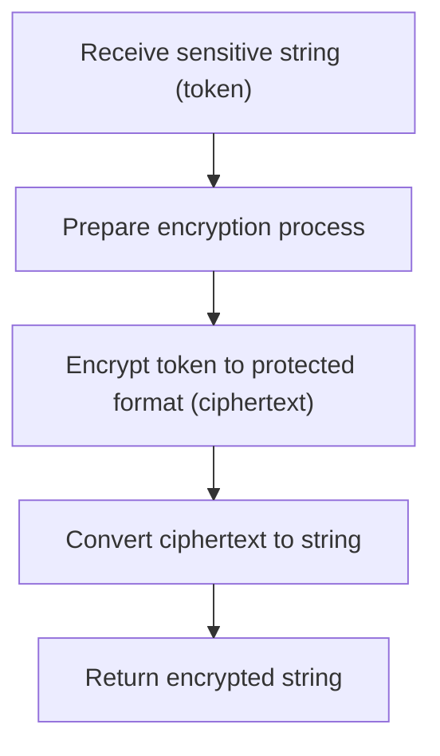
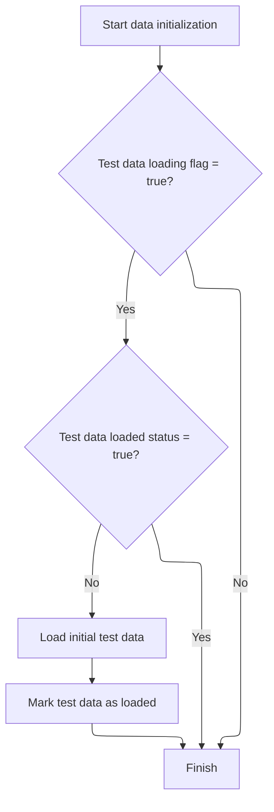

This document describes how sensitive input data, such as tokens, is protected by encrypting it before further use or storage. The flow receives a sensitive string, encrypts it, and returns the encrypted output as a string.

# Encrypting Input Data



<SwmSnippet path="/shopizer/sm-shop/src/main/java/com/salesmanager/web/utils/TokenizeTool.java" line="37">

---

In <SwmToken path="shopizer/sm-shop/src/main/java/com/salesmanager/web/utils/TokenizeTool.java" pos="37:7:7" line-data="	public static String tokenizeString(String token) throws Exception {">`tokenizeString`</SwmToken>, we kick off by setting up the AES cipher and prepping it for encryption using a static key. The function name is misleading—it doesn't tokenize, it encrypts. Next, we need to call <SwmToken path="shopizer/sm-shop/src/main/java/com/salesmanager/web/init/data/InitializationLoader.java" pos="29:4:4" line-data="public class InitializationLoader {">`InitializationLoader`</SwmToken> to make sure the system's environment and dependencies (like keys, configs) are loaded and ready, otherwise the encryption setup could fail or behave unpredictably.

```java
	public static String tokenizeString(String token) throws Exception {
		
		Cipher aes = Cipher.getInstance(CIPHER); 
		aes.init(Cipher.ENCRYPT_MODE, key); 
```

---

</SwmSnippet>

## Checking and Populating the Database

<SwmSnippet path="/shopizer/sm-shop/src/main/java/com/salesmanager/web/init/data/InitializationLoader.java" line="59">

---

In <SwmToken path="shopizer/sm-shop/src/main/java/com/salesmanager/web/init/data/InitializationLoader.java" pos="59:5:5" line-data="	public void init() {">`init`</SwmToken>, we check if the database is empty. If it is, we log it and call InitializationDatabaseImpl.populate to fill it with the required initial data. This sets up the base entities so the rest of the system can work.

```java
	public void init() {
		
		try {
			
			if (initializationDatabase.isEmpty()) {
				LOGGER.info(String.format("%s : Shopizer database is empty, populate it....", "sm-shop"));
		
				 initializationDatabase.populate("sm-shop");
				
				
				
```

---

</SwmSnippet>

### Seeding Core Entities

See <SwmLink doc-title="System Initialization Flow">[System Initialization Flow](.swm%5Csystem-initialization-flow.ahn6uxso.sw.md)</SwmLink>

### Setting Up Security and Permissions

```mermaid
%%{init: {"flowchart": {"defaultRenderer": "elk"}} }%%
flowchart TD
    node1["Create admin groups (SUPERADMIN, ADMIN, ADMIN_CATALOGUE, ADMIN_STORE, ADMIN_ORDER, ADMIN_CONTENT)"] --> node2["Create admin permissions and associate with groups (STORE_ADMIN, SUPERADMIN, ADMIN, AUTH, PRODUCTS, ORDER, CONTENT, STORE, TAX, PAYMENT, CUSTOMER, SHIPPING)"]
    click node1 openCode "shopizer/sm-shop/src/main/java/com/salesmanager/web/init/data/InitializationLoader.java:72:84"
    click node2 openCode "shopizer/sm-shop/src/main/java/com/salesmanager/web/init/data/InitializationLoader.java:85:167"
    node2 --> node3["Create default admin user"]
    click node3 openCode "shopizer/sm-shop/src/main/java/com/salesmanager/web/init/data/InitializationLoader.java:171:171"
    node3 --> node4["Create customer group (CUSTOMER)"]
    click node4 openCode "shopizer/sm-shop/src/main/java/com/salesmanager/web/init/data/InitializationLoader.java:175:178"
    node4 --> node5["Create customer permission and associate with group (AUTH_CUSTOMER)"]
    click node5 openCode "shopizer/sm-shop/src/main/java/com/salesmanager/web/init/data/InitializationLoader.java:180:182"
    node5 --> node6["Load initial data"]
    click node6 openCode "shopizer/sm-shop/src/main/java/com/salesmanager/web/init/data/InitializationLoader.java:184:184"

classDef HeadingStyle fill:#777777,stroke:#333,stroke-width:2px;

%% Swimm:
%% %%{init: {"flowchart": {"defaultRenderer": "elk"}} }%%
%% flowchart TD
%%     node1["Create admin groups (SUPERADMIN, ADMIN, <SwmToken path="shopizer/sm-shop/src/main/java/com/salesmanager/web/init/data/InitializationLoader.java" pos="76:12:12" line-data="				  Group gcatalogue = new Group(&quot;ADMIN_CATALOGUE&quot;);">`ADMIN_CATALOGUE`</SwmToken>, <SwmToken path="shopizer/sm-shop/src/main/java/com/salesmanager/web/init/data/InitializationLoader.java" pos="78:12:12" line-data="				  Group gstore = new Group(&quot;ADMIN_STORE&quot;);">`ADMIN_STORE`</SwmToken>, <SwmToken path="shopizer/sm-shop/src/main/java/com/salesmanager/web/init/data/InitializationLoader.java" pos="80:12:12" line-data="				  Group gorder = new Group(&quot;ADMIN_ORDER&quot;);">`ADMIN_ORDER`</SwmToken>, <SwmToken path="shopizer/sm-shop/src/main/java/com/salesmanager/web/init/data/InitializationLoader.java" pos="82:12:12" line-data="				  Group gcontent = new Group(&quot;ADMIN_CONTENT&quot;);">`ADMIN_CONTENT`</SwmToken>)"] --> node2["Create admin permissions and associate with groups (<SwmToken path="shopizer/sm-shop/src/main/java/com/salesmanager/web/init/data/InitializationLoader.java" pos="92:12:12" line-data="				  Permission storeadmin = new Permission(&quot;STORE_ADMIN&quot;);//Administrator of the store">`STORE_ADMIN`</SwmToken>, SUPERADMIN, ADMIN, AUTH, PRODUCTS, ORDER, CONTENT, STORE, TAX, PAYMENT, CUSTOMER, SHIPPING)"]
%%     click node1 openCode "<SwmPath>[shopizer/…/data/InitializationLoader.java](shopizer/sm-shop/src/main/java/com/salesmanager/web/init/data/InitializationLoader.java)</SwmPath>:72:84"
%%     click node2 openCode "<SwmPath>[shopizer/…/data/InitializationLoader.java](shopizer/sm-shop/src/main/java/com/salesmanager/web/init/data/InitializationLoader.java)</SwmPath>:85:167"
%%     node2 --> node3["Create default admin user"]
%%     click node3 openCode "<SwmPath>[shopizer/…/data/InitializationLoader.java](shopizer/sm-shop/src/main/java/com/salesmanager/web/init/data/InitializationLoader.java)</SwmPath>:171:171"
%%     node3 --> node4["Create customer group (CUSTOMER)"]
%%     click node4 openCode "<SwmPath>[shopizer/…/data/InitializationLoader.java](shopizer/sm-shop/src/main/java/com/salesmanager/web/init/data/InitializationLoader.java)</SwmPath>:175:178"
%%     node4 --> node5["Create customer permission and associate with group (<SwmToken path="shopizer/sm-shop/src/main/java/com/salesmanager/web/init/data/InitializationLoader.java" pos="180:12:12" line-data="				  Permission gcustomerpermission = new Permission(&quot;AUTH_CUSTOMER&quot;);">`AUTH_CUSTOMER`</SwmToken>)"]
%%     click node5 openCode "<SwmPath>[shopizer/…/data/InitializationLoader.java](shopizer/sm-shop/src/main/java/com/salesmanager/web/init/data/InitializationLoader.java)</SwmPath>:180:182"
%%     node5 --> node6["Load initial data"]
%%     click node6 openCode "<SwmPath>[shopizer/…/data/InitializationLoader.java](shopizer/sm-shop/src/main/java/com/salesmanager/web/init/data/InitializationLoader.java)</SwmPath>:184:184"
%% 
%% classDef HeadingStyle fill:#777777,stroke:#333,stroke-width:2px;
```



<SwmSnippet path="/shopizer/sm-shop/src/main/java/com/salesmanager/web/init/data/InitializationLoader.java" line="70">

---

After coming back from InitializationDatabaseImpl.populate, <SwmToken path="shopizer/sm-shop/src/main/java/com/salesmanager/web/init/data/InitializationLoader.java" pos="29:4:4" line-data="public class InitializationLoader {">`InitializationLoader`</SwmToken> sets up all the security groups and permissions, saves them, creates a default admin user, and then calls <SwmToken path="shopizer/sm-shop/src/main/java/com/salesmanager/web/init/data/InitializationLoader.java" pos="184:1:1" line-data="				  loadData();">`loadData`</SwmToken> to finish loading any extra required data. This locks in the system's access control and gets it ready for use.

```java
				 //security groups and permissions

				  Group gsuperadmin = new Group("SUPERADMIN");
				  gsuperadmin.setGroupType(GroupType.ADMIN);
				  Group gadmin = new Group("ADMIN");
				  gadmin.setGroupType(GroupType.ADMIN);
				  Group gcatalogue = new Group("ADMIN_CATALOGUE");
				  gcatalogue.setGroupType(GroupType.ADMIN);
				  Group gstore = new Group("ADMIN_STORE");
				  gstore.setGroupType(GroupType.ADMIN);
				  Group gorder = new Group("ADMIN_ORDER");
				  gorder.setGroupType(GroupType.ADMIN);
				  Group gcontent = new Group("ADMIN_CONTENT");
				  gcontent.setGroupType(GroupType.ADMIN);

				  groupService.create(gsuperadmin);
				  groupService.create(gadmin);
				  groupService.create(gcatalogue);
				  groupService.create(gstore);
				  groupService.create(gorder);
				  groupService.create(gcontent);
				  
				  Permission storeadmin = new Permission("STORE_ADMIN");//Administrator of the store
				  storeadmin.getGroups().add(gsuperadmin);
				  storeadmin.getGroups().add(gadmin);
				  permissionService.create(storeadmin);
				  
				  Permission superadmin = new Permission("SUPERADMIN");
				  superadmin.getGroups().add(gsuperadmin);
				  permissionService.create(superadmin);
				  
				  Permission admin = new Permission("ADMIN");
				  admin.getGroups().add(gsuperadmin);
				  admin.getGroups().add(gadmin);
				  permissionService.create(admin);
				  
				  Permission auth = new Permission("AUTH");//Authenticated
				  auth.getGroups().add(gsuperadmin);
				  auth.getGroups().add(gadmin);
				  auth.getGroups().add(gcatalogue);
				  auth.getGroups().add(gstore);
				  auth.getGroups().add(gorder);
				  permissionService.create(auth);

				  
				  Permission products = new Permission("PRODUCTS");
				  products.getGroups().add(gsuperadmin);
				  products.getGroups().add(gadmin);
				  products.getGroups().add(gcatalogue);
				  permissionService.create(products);

				  
				  Permission order = new Permission("ORDER");
				  order.getGroups().add(gsuperadmin);
				  order.getGroups().add(gorder);
				  order.getGroups().add(gadmin);
				  permissionService.create(order);
				  
				  Permission content = new Permission("CONTENT");
				  content.getGroups().add(gsuperadmin);
				  content.getGroups().add(gadmin);
				  content.getGroups().add(gcontent);
				  permissionService.create(content);
				  
				  
				  
				  Permission pstore = new Permission("STORE");
				  pstore.getGroups().add(gsuperadmin);
				  pstore.getGroups().add(gstore);
				  pstore.getGroups().add(gadmin);
				  permissionService.create(pstore);
				  
				  Permission tax = new Permission("TAX");
				  tax.getGroups().add(gsuperadmin);
				  tax.getGroups().add(gstore);
				  tax.getGroups().add(gadmin);
				  permissionService.create(tax);
				  
				  
				  Permission payment = new Permission("PAYMENT");
				  payment.getGroups().add(gsuperadmin);
				  payment.getGroups().add(gstore);
				  payment.getGroups().add(gadmin);
				  permissionService.create(payment);
				  
				  Permission customer = new Permission("CUSTOMER");
				  customer.getGroups().add(gsuperadmin);
				  customer.getGroups().add(gstore);
				  customer.getGroups().add(gadmin);
				  permissionService.create(customer);
				  
				  
				  Permission shipping = new Permission("SHIPPING");
				  shipping.getGroups().add(gsuperadmin);
				  shipping.getGroups().add(gadmin);
				  shipping.getGroups().add(gstore);
				  
				  permissionService.create(shipping);
				
				
				
				  userDetailsService.createDefaultAdmin();
				  
				  
				  //load customer groups and permissions
				  Group gcustomer = new Group("CUSTOMER");
				  gcustomer.setGroupType(GroupType.CUSTOMER);
				  
				  groupService.create(gcustomer);
				  
				  Permission gcustomerpermission = new Permission("AUTH_CUSTOMER");
				  gcustomerpermission.getGroups().add(gcustomer);
				  permissionService.create(gcustomerpermission);

				  loadData();

			}
			
		} catch (Exception e) {
			LOGGER.error("Error in the init method",e);
		}
		

		
	}
```

---

</SwmSnippet>

## Loading Demo/Test Data



<SwmSnippet path="/shopizer/sm-shop/src/main/java/com/salesmanager/web/init/data/InitializationLoader.java" line="196">

---

<SwmToken path="shopizer/sm-shop/src/main/java/com/salesmanager/web/init/data/InitializationLoader.java" pos="196:5:5" line-data="	private void loadData() throws ServiceException {">`loadData`</SwmToken> checks config to see if test/demo data should be loaded, and if it hasn't already been loaded. If needed, it calls InitStoreData.initInitialData to actually create the demo entities. This keeps the demo setup idempotent and avoids duplicate data.

```java
	private void loadData() throws ServiceException {
		
		String loadTestData = configuration.getProperty(ApplicationConstants.POPULATE_TEST_DATA);
		boolean loadData =  !StringUtils.isBlank(loadTestData) && loadTestData.equals(SystemConstants.CONFIG_VALUE_TRUE);

		
		if(loadData) {
			
			SystemConfiguration configuration = systemConfigurationService.getByKey(ApplicationConstants.TEST_DATA_LOADED);
		
			if(configuration!=null) {
					if(configuration.getKey().equals(ApplicationConstants.TEST_DATA_LOADED)) {
						if(configuration.getValue().equals(SystemConstants.CONFIG_VALUE_TRUE)) {
							return;		
						}
					}		
			}
			
			initData.initInitialData();
			
			configuration = new SystemConfiguration();
			configuration.getAuditSection().setModifiedBy(SystemConstants.SYSTEM_USER);
			configuration.setKey(ApplicationConstants.TEST_DATA_LOADED);
			configuration.setValue(SystemConstants.CONFIG_VALUE_TRUE);
			systemConfigurationService.create(configuration);
			
			
		}
	}
```

---

</SwmSnippet>

## Creating Demo Entities

```mermaid
%%{init: {"flowchart": {"defaultRenderer": "elk"}} }%%
flowchart TD
    node1["Start store data initialization"] --> node2["Setup store context (languages, country, store)"]
    click node1 openCode "shopizer/sm-shop/src/main/java/com/salesmanager/web/init/data/InitStoreData.java:143:146"
    click node2 openCode "shopizer/sm-shop/src/main/java/com/salesmanager/web/init/data/InitStoreData.java:147:154"
    node2 --> node3["Create categories (visible/invisible, hierarchy)"]
    click node3 openCode "shopizer/sm-shop/src/main/java/com/salesmanager/web/init/data/InitStoreData.java:158:319"
    node3 --> node4["Create manufacturers"]
    click node4 openCode "shopizer/sm-shop/src/main/java/com/salesmanager/web/init/data/InitStoreData.java:353:407"
    node4 --> node5["Create products (prices: 39.99, 29.99, etc.; quantity: 100)"]
    click node5 openCode "shopizer/sm-shop/src/main/java/com/salesmanager/web/init/data/InitStoreData.java:412:729"
    node5 --> node6["Set featured products"]
    click node6 openCode "shopizer/sm-shop/src/main/java/com/salesmanager/web/init/data/InitStoreData.java:740:773"
    node6 --> node7["Create demo customer (email: test@shopizer.com, nick: shopizer)"]
    click node7 openCode "shopizer/sm-shop/src/main/java/com/salesmanager/web/init/data/InitStoreData.java:777:823"
    node7 --> node8["Assign customer groups"]
    click node8 openCode "shopizer/sm-shop/src/main/java/com/salesmanager/web/init/data/InitStoreData.java:794:798"
    subgraph loop1["For each group in customer groups"]
        node8 --> node8a{"Is group a customer group?"}
        click node8a openCode "shopizer/sm-shop/src/main/java/com/salesmanager/web/init/data/InitStoreData.java:795:797"
        node8a -->|"Yes"| node8b["Add group to customer"]
        click node8b openCode "shopizer/sm-shop/src/main/java/com/salesmanager/web/init/data/InitStoreData.java:796:797"
        node8a -->|"No"| node8
    end
    node8 --> node9["Create demo order (total: 23.99, tax: 4, subtotal: 19.99)"]
    click node9 openCode "shopizer/sm-shop/src/main/java/com/salesmanager/web/init/data/InitStoreData.java:827:927"
    node9 --> node10["Finish initialization"]
    click node10 openCode "shopizer/sm-shop/src/main/java/com/salesmanager/web/init/data/InitStoreData.java:929:931"
classDef HeadingStyle fill:#777777,stroke:#333,stroke-width:2px;

%% Swimm:
%% %%{init: {"flowchart": {"defaultRenderer": "elk"}} }%%
%% flowchart TD
%%     node1["Start store data initialization"] --> node2["Setup store context (languages, country, store)"]
%%     click node1 openCode "<SwmPath>[shopizer/…/data/InitStoreData.java](shopizer/sm-shop/src/main/java/com/salesmanager/web/init/data/InitStoreData.java)</SwmPath>:143:146"
%%     click node2 openCode "<SwmPath>[shopizer/…/data/InitStoreData.java](shopizer/sm-shop/src/main/java/com/salesmanager/web/init/data/InitStoreData.java)</SwmPath>:147:154"
%%     node2 --> node3["Create categories (visible/invisible, hierarchy)"]
%%     click node3 openCode "<SwmPath>[shopizer/…/data/InitStoreData.java](shopizer/sm-shop/src/main/java/com/salesmanager/web/init/data/InitStoreData.java)</SwmPath>:158:319"
%%     node3 --> node4["Create manufacturers"]
%%     click node4 openCode "<SwmPath>[shopizer/…/data/InitStoreData.java](shopizer/sm-shop/src/main/java/com/salesmanager/web/init/data/InitStoreData.java)</SwmPath>:353:407"
%%     node4 --> node5["Create products (prices: <SwmToken path="shopizer/sm-shop/src/main/java/com/salesmanager/web/init/data/InitStoreData.java" pos="456:9:11" line-data="		    dprice.setProductPriceAmount(new BigDecimal(39.99));">`39.99`</SwmToken>, <SwmToken path="shopizer/sm-shop/src/main/java/com/salesmanager/web/init/data/InitStoreData.java" pos="512:9:11" line-data="		    dprice2.setProductPriceAmount(new BigDecimal(29.99));">`29.99`</SwmToken>, etc.; quantity: 100)"]
%%     click node5 openCode "<SwmPath>[shopizer/…/data/InitStoreData.java](shopizer/sm-shop/src/main/java/com/salesmanager/web/init/data/InitStoreData.java)</SwmPath>:412:729"
%%     node5 --> node6["Set featured products"]
%%     click node6 openCode "<SwmPath>[shopizer/…/data/InitStoreData.java](shopizer/sm-shop/src/main/java/com/salesmanager/web/init/data/InitStoreData.java)</SwmPath>:740:773"
%%     node6 --> node7["Create demo customer (email: test@<SwmToken path="shopizer/sm-shop/src/main/java/com/salesmanager/web/init/data/InitStoreData.java" pos="779:8:10" line-data="			customer.setEmailAddress(&quot;test@shopizer.com&quot;);">`shopizer.com`</SwmToken>, nick: shopizer)"]
%%     click node7 openCode "<SwmPath>[shopizer/…/data/InitStoreData.java](shopizer/sm-shop/src/main/java/com/salesmanager/web/init/data/InitStoreData.java)</SwmPath>:777:823"
%%     node7 --> node8["Assign customer groups"]
%%     click node8 openCode "<SwmPath>[shopizer/…/data/InitStoreData.java](shopizer/sm-shop/src/main/java/com/salesmanager/web/init/data/InitStoreData.java)</SwmPath>:794:798"
%%     subgraph loop1["For each group in customer groups"]
%%         node8 --> node8a{"Is group a customer group?"}
%%         click node8a openCode "<SwmPath>[shopizer/…/data/InitStoreData.java](shopizer/sm-shop/src/main/java/com/salesmanager/web/init/data/InitStoreData.java)</SwmPath>:795:797"
%%         node8a -->|"Yes"| node8b["Add group to customer"]
%%         click node8b openCode "<SwmPath>[shopizer/…/data/InitStoreData.java](shopizer/sm-shop/src/main/java/com/salesmanager/web/init/data/InitStoreData.java)</SwmPath>:796:797"
%%         node8a -->|"No"| node8
%%     end
%%     node8 --> node9["Create demo order (total: <SwmToken path="shopizer/sm-shop/src/main/java/com/salesmanager/web/init/data/InitStoreData.java" pos="861:9:11" line-data="			order.setTotal(new BigDecimal(23.99));">`23.99`</SwmToken>, tax: 4, subtotal: <SwmToken path="shopizer/sm-shop/src/main/java/com/salesmanager/web/init/data/InitStoreData.java" pos="559:9:11" line-data="		    dprice3.setProductPriceAmount(new BigDecimal(19.99));">`19.99`</SwmToken>)"]
%%     click node9 openCode "<SwmPath>[shopizer/…/data/InitStoreData.java](shopizer/sm-shop/src/main/java/com/salesmanager/web/init/data/InitStoreData.java)</SwmPath>:827:927"
%%     node9 --> node10["Finish initialization"]
%%     click node10 openCode "<SwmPath>[shopizer/…/data/InitStoreData.java](shopizer/sm-shop/src/main/java/com/salesmanager/web/init/data/InitStoreData.java)</SwmPath>:929:931"
%% classDef HeadingStyle fill:#777777,stroke:#333,stroke-width:2px;
```



<SwmSnippet path="/shopizer/sm-shop/src/main/java/com/salesmanager/web/init/data/InitStoreData.java" line="140">

---

In <SwmToken path="shopizer/sm-shop/src/main/java/com/salesmanager/web/init/data/InitStoreData.java" pos="140:5:5" line-data="	public void initInitialData() throws ServiceException {">`initInitialData`</SwmToken>, we create a bunch of demo categories, products, manufacturers, and a customer with hardcoded values. We set up parent-child relationships for categories, assign products to categories, upload product images, and mark some products as featured. The customer is created with fixed credentials and assigned to the CUSTOMER group. This is all for a consistent demo setup.

```java
	public void initInitialData() throws ServiceException {
		

		LOGGER.info("Starting the initialization of test data");
		Date date = new Date(System.currentTimeMillis());
		
		//2 languages by default
		Language en = languageService.getByCode("en");
		Language fr = languageService.getByCode("fr");
		
		Country canada = countryService.getByCode("CA");
		Zone zone = zoneService.getByCode("QC");
		
		//create a merchant
		MerchantStore store = merchantService.getMerchantStore(MerchantStore.DEFAULT_STORE);
		ProductType generalType = productTypeService.getProductType(ProductType.GENERAL_TYPE);
		
		
		 Category book = new Category();
		    book.setMerchantStore(store);
		    book.setCode("computerbooks");
		    book.setVisible(true);

		    CategoryDescription bookEnglishDescription = new CategoryDescription();
		    bookEnglishDescription.setName("Computer Books");
		    bookEnglishDescription.setCategory(book);
		    bookEnglishDescription.setLanguage(en);
		    bookEnglishDescription.setSeUrl("computer-books");

		    CategoryDescription bookFrenchDescription = new CategoryDescription();
		    bookFrenchDescription.setName("Livres d'informatique");
		    bookFrenchDescription.setCategory(book);
		    bookFrenchDescription.setLanguage(fr);
		    bookFrenchDescription.setSeUrl("livres-informatiques");

		    List<CategoryDescription> descriptions = new ArrayList<CategoryDescription>();
		    descriptions.add(bookEnglishDescription);
		    descriptions.add(bookFrenchDescription);

		    book.setDescriptions(descriptions);

		    categoryService.create(book);

		    Category novs = new Category();
		    novs.setMerchantStore(store);
		    novs.setCode("novels");
		    novs.setVisible(false);

		    CategoryDescription novsEnglishDescription = new CategoryDescription();
		    novsEnglishDescription.setName("Novels");
		    novsEnglishDescription.setCategory(novs);
		    novsEnglishDescription.setLanguage(en);
		    novsEnglishDescription.setSeUrl("novels");

		    CategoryDescription novsFrenchDescription = new CategoryDescription();
		    novsFrenchDescription.setName("Romans");
		    novsFrenchDescription.setCategory(novs);
		    novsFrenchDescription.setLanguage(fr);
		    novsFrenchDescription.setSeUrl("romans");

		    List<CategoryDescription> descriptions2 = new ArrayList<CategoryDescription>();
		    descriptions2.add(novsEnglishDescription);
		    descriptions2.add(novsFrenchDescription);

		    novs.setDescriptions(descriptions2);

		    categoryService.create(novs);
		    
		    Category tech = new Category();
		    tech.setMerchantStore(store);
		    tech.setCode("tech");

		    CategoryDescription techEnglishDescription = new CategoryDescription();
		    techEnglishDescription.setName("Technology");
		    techEnglishDescription.setCategory(tech);
		    techEnglishDescription.setLanguage(en);
		    techEnglishDescription.setSeUrl("technology");

		    CategoryDescription techFrenchDescription = new CategoryDescription();
		    techFrenchDescription.setName("Technologie");
		    techFrenchDescription.setCategory(tech);
		    techFrenchDescription.setLanguage(fr);
		    techFrenchDescription.setSeUrl("technologie");

		    List<CategoryDescription> descriptions4 = new ArrayList<CategoryDescription>();
		    descriptions4.add(techEnglishDescription);
		    descriptions4.add(techFrenchDescription);

		    tech.setDescriptions(descriptions4);
		    
		    tech.setParent(book);

		    categoryService.create(tech);
		    categoryService.addChild(book, tech);

		    Category web = new Category();
		    web.setMerchantStore(store);
		    web.setCode("web");
		    web.setVisible(true);

		    CategoryDescription webEnglishDescription = new CategoryDescription();
		    webEnglishDescription.setName("Web");
		    webEnglishDescription.setCategory(web);
		    webEnglishDescription.setLanguage(en);
		    webEnglishDescription.setSeUrl("the-web");

		    CategoryDescription webFrenchDescription = new CategoryDescription();
		    webFrenchDescription.setName("Web");
		    webFrenchDescription.setCategory(web);
		    webFrenchDescription.setLanguage(fr);
		    webFrenchDescription.setSeUrl("le-web");

		    List<CategoryDescription> descriptions3 = new ArrayList<CategoryDescription>();
		    descriptions3.add(webEnglishDescription);
		    descriptions3.add(webFrenchDescription);

		    web.setDescriptions(descriptions3);
		    
		    web.setParent(book);

		    categoryService.create(web);
		    categoryService.addChild(book, web);


		    Category fiction = new Category();
		    fiction.setMerchantStore(store);
		    fiction.setCode("fiction");
		    fiction.setVisible(true);

		    CategoryDescription fictionEnglishDescription = new CategoryDescription();
		    fictionEnglishDescription.setName("Fiction");
		    fictionEnglishDescription.setCategory(fiction);
		    fictionEnglishDescription.setLanguage(en);
		    fictionEnglishDescription.setSeUrl("fiction");

		    CategoryDescription fictionFrenchDescription = new CategoryDescription();
		    fictionFrenchDescription.setName("Sc Fiction");
		    fictionFrenchDescription.setCategory(fiction);
		    fictionFrenchDescription.setLanguage(fr);
		    fictionFrenchDescription.setSeUrl("fiction");

		    List<CategoryDescription> fictiondescriptions = new ArrayList<CategoryDescription>();
		    fictiondescriptions.add(fictionEnglishDescription);
		    fictiondescriptions.add(fictionFrenchDescription);

		    fiction.setDescriptions(fictiondescriptions);
		    
		    fiction.setParent(novs);

		    categoryService.create(fiction);
		    categoryService.addChild(novs, fiction);
		    
		    
		    Category business = new Category();
		    business.setMerchantStore(store);
		    business.setCode("business");
		    business.setVisible(true);

		    CategoryDescription businessEnglishDescription = new CategoryDescription();
		    businessEnglishDescription.setName("Business");
		    businessEnglishDescription.setCategory(business);
		    businessEnglishDescription.setLanguage(en);
		    businessEnglishDescription.setSeUrl("business");

		    CategoryDescription businessFrenchDescription = new CategoryDescription();
		    businessFrenchDescription.setName("Affaires");
		    businessFrenchDescription.setCategory(business);
		    businessFrenchDescription.setLanguage(fr);
		    businessFrenchDescription.setSeUrl("affaires");

		    List<CategoryDescription> businessdescriptions = new ArrayList<CategoryDescription>();
		    businessdescriptions.add(businessEnglishDescription);
		    businessdescriptions.add(businessFrenchDescription);

		    business.setDescriptions(businessdescriptions);
		    

		    categoryService.create(business);

		   		    
		    
		    Category cloud = new Category();
		    cloud.setMerchantStore(store);
		    cloud.setCode("cloud");
		    cloud.setVisible(true);

		    CategoryDescription cloudEnglishDescription = new CategoryDescription();
		    cloudEnglishDescription.setName("Cloud computing");
		    cloudEnglishDescription.setCategory(cloud);
		    cloudEnglishDescription.setLanguage(en);
		    cloudEnglishDescription.setSeUrl("cloud-computing");

		    CategoryDescription cloudFrenchDescription = new CategoryDescription();
		    cloudFrenchDescription.setName("Programmation pour le cloud");
		    cloudFrenchDescription.setCategory(cloud);
		    cloudFrenchDescription.setLanguage(fr);
		    cloudFrenchDescription.setSeUrl("programmation-cloud");

		    List<CategoryDescription> clouddescriptions = new ArrayList<CategoryDescription>();
		    clouddescriptions.add(cloudEnglishDescription);
		    clouddescriptions.add(cloudFrenchDescription);

		    cloud.setDescriptions(clouddescriptions);
		    
		    cloud.setParent(tech);

		    categoryService.create(cloud);
		    categoryService.addChild(tech, cloud);

		    // Add products
		    // ProductType generalType = productTypeService.

		    Manufacturer oreilley = new Manufacturer();
		    oreilley.setMerchantStore(store);

		    ManufacturerDescription oreilleyd = new ManufacturerDescription();
		    oreilleyd.setLanguage(en);
		    oreilleyd.setName("O\'Reilley");
		    oreilleyd.setManufacturer(oreilley);
		    oreilley.getDescriptions().add(oreilleyd);

		    manufacturerService.create(oreilley);
		    
		    
		    Manufacturer sams = new Manufacturer();
		    sams.setMerchantStore(store);

		    ManufacturerDescription samsd = new ManufacturerDescription();
		    samsd.setLanguage(en);
		    samsd.setName("Sams");
		    samsd.setManufacturer(sams);
		    sams.getDescriptions().add(samsd);

		    manufacturerService.create(sams);
		    
		    Manufacturer packt = new Manufacturer();
		    packt.setMerchantStore(store);

		    ManufacturerDescription packtd = new ManufacturerDescription();
		    packtd.setLanguage(en);
		    packtd.setName("Packt");
		    packtd.setManufacturer(packt);
		    packt.getDescriptions().add(packtd);

		    manufacturerService.create(packt);

		    Manufacturer manning = new Manufacturer();
		    manning.setMerchantStore(store);

		    ManufacturerDescription manningd = new ManufacturerDescription();
		    manningd.setLanguage(en);
		    manningd.setManufacturer(manning);
		    manningd.setName("Manning");
		    manning.getDescriptions().add(manningd);

		    manufacturerService.create(manning);

		    Manufacturer novells = new Manufacturer();
		    novells.setMerchantStore(store);

		    ManufacturerDescription novellsd = new ManufacturerDescription();
		    novellsd.setLanguage(en);
		    novellsd.setManufacturer(novells);
		    novellsd.setName("Novells publishing");
		    novells.getDescriptions().add(novellsd);

		    manufacturerService.create(novells);

		    
		    // PRODUCT 1

		    Product product = new Product();
		    product.setProductHeight(new BigDecimal(10));
		    product.setProductLength(new BigDecimal(3));
		    product.setProductWidth(new BigDecimal(6));
		    product.setSku("TB12345");
		    product.setManufacturer(manning);
		    product.setType(generalType);
		    product.setMerchantStore(store);
		    product.setProductShipeable(true);

		    // Product description
		    ProductDescription description = new ProductDescription();
		    description.setName("Spring in Action");
		    description.setLanguage(en);
		    description.setSeUrl("Spring-in-Action");
		    description.setProduct(product);

		    product.getDescriptions().add(description);

		    product.getCategories().add(tech);
		    product.getCategories().add(web);


		    productService.create(product);
		    
		    try {
		    	InputStream inStream = this.getClass().getClassLoader().getResourceAsStream("/demo/spring.png");
		    	this.saveFile(inStream, "spring.png", product);
		    } catch(Exception e) {
		    	LOGGER.error("Error while reading demo file spring.png",e);
		    }
		    

		    // Availability
		    ProductAvailability availability = new ProductAvailability();
		    availability.setProductDateAvailable(date);
		    availability.setProductQuantity(100);
		    availability.setRegion("*");
		    availability.setProduct(product);// associate with product

		    productAvailabilityService.create(availability);

		    ProductPrice dprice = new ProductPrice();
		    dprice.setDefaultPrice(true);
		    dprice.setProductPriceAmount(new BigDecimal(39.99));
		    dprice.setProductAvailability(availability);

		    ProductPriceDescription dpd = new ProductPriceDescription();
		    dpd.setName("Base price");
		    dpd.setProductPrice(dprice);
		    dpd.setLanguage(en);

		    dprice.getDescriptions().add(dpd);

		    productPriceService.create(dprice);

		    // PRODUCT 2

		    Product product2 = new Product();
		    product2.setProductHeight(new BigDecimal(4));
		    product2.setProductLength(new BigDecimal(3));
		    product2.setProductWidth(new BigDecimal(1));
		    product2.setSku("TB2468");
		    product2.setManufacturer(packt);
		    product2.setType(generalType);
		    product2.setMerchantStore(store);
		    product2.setProductShipeable(true);

		    // Product description
		    description = new ProductDescription();
		    description.setName("Node Web Development");
		    description.setLanguage(en);
		    description.setProduct(product2);
		    description.setSeUrl("Node-Web-Development");

		    product2.getDescriptions().add(description);

		    product2.getCategories().add(tech);
		    product2.getCategories().add(web);
		    
		    productService.create(product2);
		    
		    try {
		    	InputStream inStream = this.getClass().getClassLoader().getResourceAsStream("/demo/node.jpg");
		    	this.saveFile(inStream, "node.jpg", product2);
		    } catch(Exception e) {
		    	LOGGER.error("Error while reading demo file node.jpg",e);
		    }

		    // Availability
		    ProductAvailability availability2 = new ProductAvailability();
		    availability2.setProductDateAvailable(date);
		    availability2.setProductQuantity(100);
		    availability2.setRegion("*");
		    availability2.setProduct(product2);// associate with product

		    productAvailabilityService.create(availability2);

		    ProductPrice dprice2 = new ProductPrice();
		    dprice2.setDefaultPrice(true);
		    dprice2.setProductPriceAmount(new BigDecimal(29.99));
		    dprice2.setProductAvailability(availability2);

		    dpd = new ProductPriceDescription();
		    dpd.setName("Base price");
		    dpd.setProductPrice(dprice2);
		    dpd.setLanguage(en);

		    dprice2.getDescriptions().add(dpd);

		    productPriceService.create(dprice2);

		    // PRODUCT 3

		    Product product3 = new Product();
		    product3.setProductHeight(new BigDecimal(4));
		    product3.setProductLength(new BigDecimal(3));
		    product3.setProductWidth(new BigDecimal(1));
		    product3.setSku("NB1111");
		    product3.setManufacturer(oreilley);
		    product3.setType(generalType);
		    product3.setMerchantStore(store);
		    product3.setProductShipeable(true);

		    // Product description
		    description = new ProductDescription();
		    description.setName("Programming for PAAS");
		    description.setLanguage(en);
		    description.setProduct(product3);
		    description.setSeUrl("programming-for-paas");

		    product3.getDescriptions().add(description);

		    product3.getCategories().add(cloud);
		    productService.create(product3);

		    // Availability
		    ProductAvailability availability3 = new ProductAvailability();
		    availability3.setProductDateAvailable(date);
		    availability3.setProductQuantity(100);
		    availability3.setRegion("*");
		    availability3.setProduct(product3);// associate with product

		    productAvailabilityService.create(availability3);

		    ProductPrice dprice3 = new ProductPrice();
		    dprice3.setDefaultPrice(true);
		    dprice3.setProductPriceAmount(new BigDecimal(19.99));
		    dprice3.setProductAvailability(availability3);

		    dpd = new ProductPriceDescription();
		    dpd.setName("Base price");
		    dpd.setProductPrice(dprice3);
		    dpd.setLanguage(en);

		    dprice3.getDescriptions().add(dpd);

		    productPriceService.create(dprice3);
		    
		    try {
		    	InputStream inStream = this.getClass().getClassLoader().getResourceAsStream("/demo/paas.JPG");
		    	this.saveFile(inStream, "paas.JPG", product3);
		    } catch(Exception e) {
		    	LOGGER.error("Error while reading demo file paas.jpg",e);
		    }

		    // PRODUCT 4
		    Product product4 = new Product();
		    product4.setProductHeight(new BigDecimal(4));
		    product4.setProductLength(new BigDecimal(3));
		    product4.setProductWidth(new BigDecimal(1));
		    product4.setSku("SF333345");
		    product4.setManufacturer(sams);
		    product4.setType(generalType);
		    product4.setMerchantStore(store);
		    product4.setProductShipeable(true);

		    // Product description
		    description = new ProductDescription();
		    description.setName("Android development");
		    description.setLanguage(en);
		    description.setProduct(product4);
		    description.setSeUrl("android-application-development");

		    product4.getDescriptions().add(description);

		    product4.getCategories().add(tech);
		    productService.create(product4);

		    // Availability
		    ProductAvailability availability4 = new ProductAvailability();
		    availability4.setProductDateAvailable(date);
		    availability4.setProductQuantity(100);
		    availability4.setRegion("*");
		    availability4.setProduct(product4);// associate with product

		    productAvailabilityService.create(availability4);

		    ProductPrice dprice4 = new ProductPrice();
		    dprice4.setDefaultPrice(true);
		    dprice4.setProductPriceAmount(new BigDecimal(18.99));
		    dprice4.setProductAvailability(availability4);

		    dpd = new ProductPriceDescription();
		    dpd.setName("Base price");
		    dpd.setProductPrice(dprice4);
		    dpd.setLanguage(en);

		    dprice4.getDescriptions().add(dpd);

		    productPriceService.create(dprice4);
		    
		    try {
		    	InputStream inStream = this.getClass().getClassLoader().getResourceAsStream("/demo/android.jpg");
		    	this.saveFile(inStream, "android.jpg", product4);
		    } catch(Exception e) {
		    	LOGGER.error("Error while reading demo file android.jpg",e);
		    }

		    // PRODUCT 5
		    Product product5 = new Product();
		    product5.setProductHeight(new BigDecimal(4));
		    product5.setProductLength(new BigDecimal(3));
		    product5.setProductWidth(new BigDecimal(1));
		    product5.setSku("SF333346");
		    product5.setManufacturer(packt);
		    product5.setType(generalType);
		    product5.setMerchantStore(store);
		    product5.setProductShipeable(true);

		    // Product description
		    description = new ProductDescription();
		    description.setName("Android 3.0 Cookbook");
		    description.setLanguage(en);
		    description.setProduct(product5);
		    description.setSeUrl("android-3-cookbook");

		    product5.getDescriptions().add(description);

		    product5.getCategories().add(tech);
		    productService.create(product5);

		    // Availability
		    ProductAvailability availability5 = new ProductAvailability();
		    availability5.setProductDateAvailable(date);
		    availability5.setProductQuantity(100);
		    availability5.setRegion("*");
		    availability5.setProduct(product5);// associate with product

		    productAvailabilityService.create(availability5);

		    ProductPrice dprice5 = new ProductPrice();
		    dprice5.setDefaultPrice(true);
		    dprice5.setProductPriceAmount(new BigDecimal(18.99));
		    dprice5.setProductAvailability(availability5);

		    dpd = new ProductPriceDescription();
		    dpd.setName("Base price");
		    dpd.setProductPrice(dprice5);
		    dpd.setLanguage(en);

		    dprice5.getDescriptions().add(dpd);

		    productPriceService.create(dprice5);
		    
		    try {
		    	InputStream inStream = this.getClass().getClassLoader().getResourceAsStream("/demo/android2.jpg");
		    	this.saveFile(inStream, "android2.jpg", product5);
		    } catch(Exception e) {
		    	LOGGER.error("Error while reading demo file android2.jpg",e);
		    }

		    // PRODUCT 6

		    Product product6 = new Product();
		    product6.setProductHeight(new BigDecimal(4));
		    product6.setProductLength(new BigDecimal(3));
		    product6.setProductWidth(new BigDecimal(1));
		    product6.setSku("LL333444");
		    product6.setManufacturer(novells);
		    product6.setType(generalType);
		    product6.setMerchantStore(store);
		    product6.setProductShipeable(true);

		    // Product description
		    description = new ProductDescription();
		    description.setName("The Big Switch");
		    description.setLanguage(en);
		    description.setProduct(product6);
		    description.setSeUrl("the-big-switch");

		    product6.getDescriptions().add(description);

		    product6.getCategories().add(business);
		    productService.create(product6);

		    // Availability
		    ProductAvailability availability6 = new ProductAvailability();
		    availability6.setProductDateAvailable(date);
		    availability6.setProductQuantity(100);
		    availability6.setRegion("*");
		    availability6.setProduct(product6);// associate with product

		    productAvailabilityService.create(availability6);

		    ProductPrice dprice6 = new ProductPrice();
		    dprice6.setDefaultPrice(true);
		    dprice6.setProductPriceAmount(new BigDecimal(18.99));
		    dprice6.setProductAvailability(availability6);

		    dpd = new ProductPriceDescription();
		    dpd.setName("Base price");
		    dpd.setProductPrice(dprice6);
		    dpd.setLanguage(en);

		    dprice6.getDescriptions().add(dpd);

		    productPriceService.create(dprice6);
		    
		    try {
		    	InputStream inStream = this.getClass().getClassLoader().getResourceAsStream("/demo/google.jpg");
		    	this.saveFile(inStream, "google.jpg", product6);
		    } catch(Exception e) {
		    	LOGGER.error("Error while reading demo file google.jpg",e);
		    }
		    
		    //featured items
		    
			ProductRelationship relationship = new ProductRelationship();
			relationship.setActive(true);
			relationship.setCode(ProductRelationshipType.FEATURED_ITEM.name());
			relationship.setStore(store);
			relationship.setRelatedProduct(product);
			
			productRelationshipService.saveOrUpdate(relationship);
			
			relationship = new ProductRelationship();
			relationship.setActive(true);
			relationship.setCode(ProductRelationshipType.FEATURED_ITEM.name());
			relationship.setStore(store);
			relationship.setRelatedProduct(product6);
			
			productRelationshipService.saveOrUpdate(relationship);
			
			
			relationship = new ProductRelationship();
			relationship.setActive(true);
			relationship.setCode(ProductRelationshipType.FEATURED_ITEM.name());
			relationship.setStore(store);
			relationship.setRelatedProduct(product5);
			
			productRelationshipService.saveOrUpdate(relationship);

			
			relationship = new ProductRelationship();
			relationship.setActive(true);
			relationship.setCode(ProductRelationshipType.FEATURED_ITEM.name());
			relationship.setStore(store);
			relationship.setRelatedProduct(product2);
			
			productRelationshipService.saveOrUpdate(relationship);
			
		    
		    //Create a customer (user name[nick] : shopizer password : password)

		    Customer customer = new Customer();
			customer.setMerchantStore(store);
			customer.setEmailAddress("test@shopizer.com");
			customer.setGender(CustomerGender.M);						
			customer.setAnonymous(false);
			customer.setCompany("CSTI Consulting");
			customer.setDateOfBirth(new Date());

			customer.setDefaultLanguage(en);
			customer.setNick("shopizer");
			
			String password = passwordEncoder.encodePassword("password", null);
			customer.setPassword(password);
			
			List<Group> groups = groupService.listGroup(GroupType.CUSTOMER);
			  

			for(Group group : groups) {
				  if(group.getGroupName().equals(Constants.GROUP_CUSTOMER)) {
					  customer.getGroups().add(group);
				  }
			}
```

---

</SwmSnippet>

<SwmSnippet path="/shopizer/sm-shop/src/main/java/com/salesmanager/web/init/data/InitStoreData.java" line="800">

---

After running <SwmToken path="shopizer/sm-shop/src/main/java/com/salesmanager/web/init/data/InitStoreData.java" pos="75:4:4" line-data="public class InitStoreData implements InitData {">`InitStoreData`</SwmToken>, we end up with demo categories, products, manufacturers, a customer with hardcoded credentials, and a full order (with digital download) all saved in the DB. This gives us a ready-to-use demo environment.

```java
		    Delivery delivery = new Delivery();
		    delivery.setAddress("358 Du Languadoc");
		    delivery.setCity( "Boucherville" );
		    delivery.setCountry(canada);
//		    delivery.setCountryCode(canada.getIsoCode());
		    delivery.setFirstName("Leonardo" );
		    delivery.setLastName("DiCaprio" );
		    delivery.setPostalCode("J4B-8J9" );
		    delivery.setZone(zone);	    
		    
		    Billing billing = new Billing();
		    billing.setAddress("358 Du Languadoc");
		    billing.setCity("Boucherville");
		    billing.setCompany("CSTI Consulting");
		    billing.setCountry(canada);
//		    billing.setCountryCode(canada.getIsoCode());
		    billing.setFirstName("Leonardo" );
		    billing.setLastName("DiCaprio" );
		    billing.setPostalCode("J4B-8J9");
		    billing.setZone(zone);
		    
		    customer.setBilling(billing);
		    customer.setDelivery(delivery);		
			customerService.create(customer);
			
			Currency currency = currencyService.getByCode("CAD");

			OrderStatusHistory orderStatusHistory = new OrderStatusHistory();
			
			//create an order
			
			Order order = new Order();
			order.setDatePurchased(new Date());
			order.setCurrency(currency);
			order.setLastModified(new Date());
			order.setBilling(billing);

			
			order.setLocale(LocaleUtils.getLocale(store));

			order.setCurrencyValue(new BigDecimal(0.98));//compared to based currency (not necessary)
			order.setCustomerId(customer.getId());
			order.setBilling(billing);
			order.setDelivery(delivery);
			order.setCustomerEmailAddress("leo@shopizer.com");
			order.setDelivery(delivery);
			order.setIpAddress("ipAddress" );
			order.setMerchant(store);
			order.setOrderDateFinished(new Date());//committed date
			
			orderStatusHistory.setComments("We received your order");
			orderStatusHistory.setCustomerNotified(1);
			orderStatusHistory.setStatus(OrderStatus.ORDERED);
			orderStatusHistory.setDateAdded(new Date() );
			orderStatusHistory.setOrder(order);
			order.getOrderHistory().add( orderStatusHistory );		
			

			order.setPaymentType(PaymentType.PAYPAL);
			order.setPaymentModuleCode("paypal");
			order.setStatus( OrderStatus.DELIVERED);
			order.setTotal(new BigDecimal(23.99));
			
			
			//OrderProductDownload - Digital download
			OrderProductDownload orderProductDownload = new OrderProductDownload();
			orderProductDownload.setDownloadCount(1);
			orderProductDownload.setMaxdays(31);		
			orderProductDownload.setOrderProductFilename("Your digital file name");
			
			//OrderProductPrice
			OrderProductPrice oproductprice = new OrderProductPrice();
			oproductprice.setDefaultPrice(true);	
			oproductprice.setProductPrice(new BigDecimal(19.99) );
			oproductprice.setProductPriceCode("baseprice" );
			oproductprice.setProductPriceName("Base Price" );
			//oproductprice.setProductPriceSpecialAmount(new BigDecimal(13.99) );	

			
			//OrderProduct
			OrderProduct oproduct = new OrderProduct();
			oproduct.getDownloads().add( orderProductDownload);
			oproduct.setOneTimeCharge( new BigDecimal(19.99) );
			oproduct.setOrder(order);		
			oproduct.setProductName( "Product name" );
			oproduct.setProductQuantity(1);
			oproduct.setSku("TB12345" );		
			oproduct.getPrices().add(oproductprice ) ;
			
			oproductprice.setOrderProduct(oproduct);		
			orderProductDownload.setOrderProduct(oproduct);
			order.getOrderProducts().add(oproduct);

			//OrderTotal
			OrderTotal subtotal = new OrderTotal();	
			subtotal.setModule("summary" );		
			subtotal.setSortOrder(0);
			subtotal.setText("Summary" );
			subtotal.setTitle("Summary" );
			subtotal.setOrderTotalCode("subtotal");
			subtotal.setValue(new BigDecimal(19.99 ) );
			subtotal.setOrder(order);
			
			order.getOrderTotal().add(subtotal);
			
			OrderTotal tax = new OrderTotal();	
			tax.setModule("tax" );		
			tax.setSortOrder(1);
			tax.setText("Tax" );
			tax.setTitle("Tax" );
			tax.setOrderTotalCode("tax");
			tax.setValue(new BigDecimal(4) );
			tax.setOrder(order);
			
			order.getOrderTotal().add(tax);
			
			OrderTotal total = new OrderTotal();	
			total.setModule("total" );		
			total.setSortOrder(2);
			total.setText("Total" );
			total.setTitle("Total" );
			total.setOrderTotalCode("total");
			total.setValue(new BigDecimal(23.99) );
			total.setOrder(order);
			
			order.getOrderTotal().add(total);
			
			orderService.create(order);	
			
			LOGGER.info("Ending the initialization of test data");
		
	}
```

---

</SwmSnippet>

## Returning Encrypted Output

<SwmSnippet path="/shopizer/sm-shop/src/main/java/com/salesmanager/web/utils/TokenizeTool.java" line="41">

---

After coming back from <SwmToken path="shopizer/sm-shop/src/main/java/com/salesmanager/web/init/data/InitializationLoader.java" pos="29:4:4" line-data="public class InitializationLoader {">`InitializationLoader`</SwmToken>, TokenizeTool.tokenizeString finishes by encrypting the input and returning the raw encrypted bytes as a String. This is risky—encrypted bytes aren't guaranteed to be valid characters, so the output could be corrupted or unusable. Encoding (like Base64) should be used instead.

```java
		byte[] ciphertext = aes.doFinal(token.getBytes()); 
		
		return new String(ciphertext);
		
		
	}
```

---

</SwmSnippet>

&nbsp;

*This is an auto-generated document by Swimm 🌊 and has not yet been verified by a human*

<SwmMeta version="3.0.0" repo-id="Z2l0aHViJTNBJTNBU2hvcGl6ZXIlM0ElM0F1bWFsaW5nYXN3YW1p" repo-name="Shopizer"><sup>Powered by [Swimm](https://app.swimm.io/)</sup></SwmMeta>
