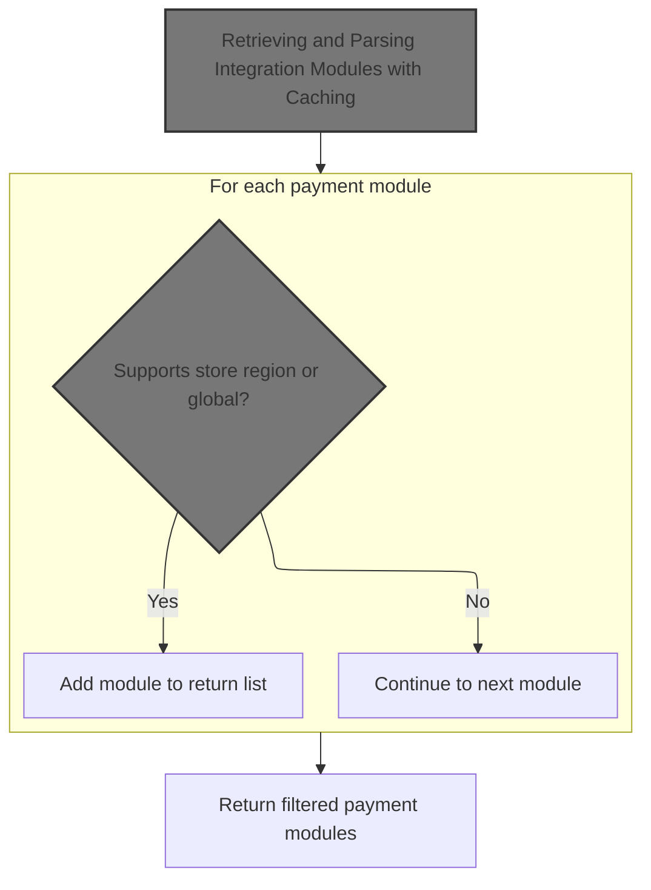
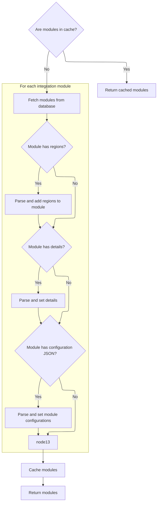

This document describes the flow of retrieving and filtering payment methods based on the merchant store's region. The flow receives the merchant store information as input and returns a filtered list of payment methods applicable to the store's country or globally. Integration modules are retrieved with caching and then filtered by region to ensure customers see relevant payment options during checkout.

# Filtering Payment Methods by Store Region



This section describes the process of filtering payment methods by the store's region to ensure only applicable payment modules are presented for transactions.

| Category        | Rule Name                           | Description                                                                                                                                   |
| --------------- | ----------------------------------- | --------------------------------------------------------------------------------------------------------------------------------------------- |
| Data validation | Exclude unsupported payment modules | If a payment module does not support the store's region or global scope, it must be excluded from the available payment methods.              |
| Business logic  | Region-based payment filtering      | Only payment modules that explicitly support the store's region or are marked as globally applicable should be included in the filtered list. |
| Business logic  | Return filtered payment methods     | The filtering process must return a list of payment modules that are ready to be presented to the customer for checkout.                      |

<SwmSnippet path="/shopizer/sm-core/src/main/java/com/salesmanager/core/business/payments/service/PaymentServiceImpl.java" line="75">

---

We get all payment modules and filter them by the store's country or a wildcard to find applicable payment methods.

```java
	public List<IntegrationModule> getPaymentMethods(MerchantStore store) throws ServiceException {
		
		List<IntegrationModule> modules =  moduleConfigurationService.getIntegrationModules(PAYMENT_MODULES);
```

---

</SwmSnippet>

## Retrieving and Parsing Integration Modules with Caching



This section describes the retrieval and parsing of integration modules with caching to optimize performance and reduce repeated JSON parsing.

| Category       | Rule Name           | Description                                                                                                                    |
| -------------- | ------------------- | ------------------------------------------------------------------------------------------------------------------------------ |
| Business logic | Return modules list | Always return the list of integration modules, either from cache or freshly fetched and parsed, to the caller for further use. |

<SwmSnippet path="/shopizer/sm-core/src/main/java/com/salesmanager/core/business/system/service/ModuleConfigurationServiceImpl.java" line="50">

---

In `getIntegrationModules`, we first check if the modules list is cached using a key built from a fixed prefix plus the module string. If not cached, we fetch the modules from the DAO. Then, for each module, we parse JSON strings for regions, config details, and configurations into Java collections and objects. This parsing prepares the modules for use later without repeated JSON parsing.

```java
	public List<IntegrationModule> getIntegrationModules(String module) {
		
		
		List<IntegrationModule> modules = null;
		try {
			
			//CacheUtils cacheUtils = CacheUtils.getInstance();
			modules = (List<IntegrationModule>) cache.getFromCache("INTEGRATION_M)" + module);
			if(modules==null) {
				modules = integrationModuleDao.getModulesConfiguration(module);
				//set json objects
				for(IntegrationModule mod : modules) {
					
					String regions = mod.getRegions();
					if(regions!=null) {
						Object objRegions=JSONValue.parse(regions); 
						JSONArray arrayRegions=(JSONArray)objRegions;
						Iterator i = arrayRegions.iterator();
						while(i.hasNext()) {
							mod.getRegionsSet().add((String)i.next());
						}
					}
					
					
					String details = mod.getConfigDetails();
					if(details!=null) {
						
						//Map objects = mapper.readValue(config, Map.class);

						Map<String,String> objDetails= (Map<String, String>) JSONValue.parse(details); 
						mod.setDetails(objDetails);

						
					}
					
					
					String configs = mod.getConfiguration();
					if(configs!=null) {
						
						//Map objects = mapper.readValue(config, Map.class);

						Object objConfigs=JSONValue.parse(configs); 
						JSONArray arrayConfigs=(JSONArray)objConfigs;
						
						Map<String,ModuleConfig> moduleConfigs = new HashMap<String,ModuleConfig>();
						
						Iterator i = arrayConfigs.iterator();
						while(i.hasNext()) {
							
							Map values = (Map)i.next();
							String env = (String)values.get("env");
		            		ModuleConfig config = new ModuleConfig();
		            		config.setScheme((String)values.get("scheme"));
		            		config.setHost((String)values.get("host"));
		            		config.setPort((String)values.get("port"));
		            		config.setUri((String)values.get("uri"));
		            		config.setEnv((String)values.get("env"));
		            		if((String)values.get("config1")!=null) {
		            			config.setConfig1((String)values.get("config1"));
		            		}
		            		if((String)values.get("config2")!=null) {
		            			config.setConfig1((String)values.get("config2"));
		            		}
		            		
		            		moduleConfigs.put(env, config);
		            		
		            		
							
						}
						
						mod.setModuleConfigs(moduleConfigs);
						

					}


				}
```

---

</SwmSnippet>

<SwmSnippet path="/shopizer/sm-core/src/main/java/com/salesmanager/core/business/system/service/ModuleConfigurationServiceImpl.java" line="127">

---

After parsing and populating the IntegrationModule fields from JSON, the function caches the processed list using the key 'INTEGRATION_M)' plus the module string. Then it returns this cached or freshly processed list to the caller.

```java
				cache.putInCache(modules, "INTEGRATION_M)" + module);
			}

		} catch (Exception e) {
			LOGGER.error("getIntegrationModules()", e);
		}
		return modules;
		
		
	}
```

---

</SwmSnippet>

## Filtering Modules by Store Country with Assumptions

<SwmSnippet path="/shopizer/sm-core/src/main/java/com/salesmanager/core/business/payments/service/PaymentServiceImpl.java" line="78">

---

After getting the modules from `getIntegrationModules`, we filter them by checking if the store's country ISO code or '\*' is in each module's regions set. We assume the store's country and ISO code are non-null, so no null checks are done here.

```java
		List<IntegrationModule> returnModules = new ArrayList<IntegrationModule>();
		
		for(IntegrationModule module : modules) {
			if(module.getRegionsSet().contains(store.getCountry().getIsoCode())
					|| module.getRegionsSet().contains("*")) {
				
				returnModules.add(module);
			}
		}
```

---

</SwmSnippet>

&nbsp;

*This is an auto-generated document by Swimm 🌊 and has not yet been verified by a human*

<SwmMeta version="3.0.0" repo-id="Z2l0aHViJTNBJTNBU2hvcGl6ZXIlM0ElM0F1bWFsaW5nYXN3YW1p" repo-name="Shopizer"><sup>Powered by [Swimm](https://app.swimm.io/)</sup></SwmMeta>
