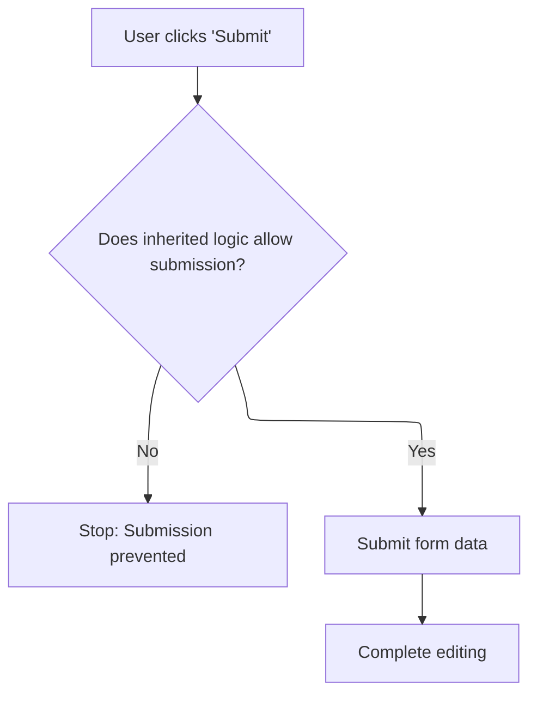

This document describes the process that occurs when a user clicks the 'Submit' button on a form. The system checks if submission is allowed, submits the form data, collects any additional required input through a dialog, and finalizes the form to advance the workflow.

# Handling Submit Button Click and Form Finalization



This section governs the rules for handling form submission via the 'Submit' button, including validation, user input collection, and workflow advancement. It ensures that only valid submissions are processed and that any required additional input is collected before finalizing the form and moving to the next workflow step.

| Category        | Rule Name                                 | Description                                                                                                                                                                                 |
| --------------- | ----------------------------------------- | ------------------------------------------------------------------------------------------------------------------------------------------------------------------------------------------- |
| Data validation | Inherited Submission Permission           | Submission is only allowed if the inherited logic permits it. If not, the submission is prevented and no further actions are taken.                                                         |
| Business logic  | Form Data Submission and Input Collection | When submission is allowed, the form data must be submitted and any required additional user input must be collected via a dialog before finalizing the form.                               |
| Business logic  | Workflow Advancement on Finalization      | After form submission and input collection, the form must be finalized and the workflow process advanced to the next step.                                                                  |
| Business logic  | Dialog Reuse for Input Collection         | If a dialog for additional input is required, it must reuse an existing dialog if available, or create a new one if not, to ensure efficient resource usage and consistent user experience. |

<SwmSnippet path="/shopizer/sm-shop/src/main/webapp/resources/smart-client/system/modules/ISC_Forms.js" line="2647">

---

In <SwmToken path="shopizer/sm-shop/src/main/webapp/resources/smart-client/system/modules/ISC_Forms.js" pos="2647:195:195" line-data=");isc.B._maxIndex=isc.C+3;isc.ClassFactory.defineClass(&quot;RowSpacerItem&quot;,&quot;SpacerItem&quot;);isc.A=isc.RowSpacerItem.getPrototype();isc.A.showTitle=false;isc.A.colSpan=&quot;*&quot;;isc.A.startRow=true;isc.A.endRow=true;isc.A.width=20;isc.A.height=20;isc.ClassFactory.defineClass(&quot;SubmitItem&quot;,&quot;ButtonItem&quot;);isc.A=isc.SubmitItem.getPrototype();isc.A.title=&quot;Submit&quot;;isc.A=isc.SubmitItem.getPrototype();isc.B=isc._allFuncs;isc.C=isc.B._maxIndex;isc.D=isc._funcClasses;isc.D[isc.C]=isc.A.Class;isc.B.push(isc.A.handleClick=function isc_SubmitItem_handleClick(){if(this.Super(&quot;handleClick&quot;,arguments)==false)return false;this.form.submit();this.form.completeEditing()}">`isc_SubmitItem_handleClick`</SwmToken>, we start by delegating to the superclass's <SwmToken path="shopizer/sm-shop/src/main/webapp/resources/smart-client/system/modules/ISC_Forms.js" pos="2647:191:191" line-data=");isc.B._maxIndex=isc.C+3;isc.ClassFactory.defineClass(&quot;RowSpacerItem&quot;,&quot;SpacerItem&quot;);isc.A=isc.RowSpacerItem.getPrototype();isc.A.showTitle=false;isc.A.colSpan=&quot;*&quot;;isc.A.startRow=true;isc.A.endRow=true;isc.A.width=20;isc.A.height=20;isc.ClassFactory.defineClass(&quot;SubmitItem&quot;,&quot;ButtonItem&quot;);isc.A=isc.SubmitItem.getPrototype();isc.A.title=&quot;Submit&quot;;isc.A=isc.SubmitItem.getPrototype();isc.B=isc._allFuncs;isc.C=isc.B._maxIndex;isc.D=isc._funcClasses;isc.D[isc.C]=isc.A.Class;isc.B.push(isc.A.handleClick=function isc_SubmitItem_handleClick(){if(this.Super(&quot;handleClick&quot;,arguments)==false)return false;this.form.submit();this.form.completeEditing()}">`handleClick`</SwmToken> to check if the click should be processed. If it returns false, we bail out early. Otherwise, we move on to submitting the form and prepping for the next step, which is handled by logic in <SwmPath>[shopizer/…/modules/ISC_Containers.js](shopizer/sm-shop/src/main/webapp/resources/smart-client/system/modules/ISC_Containers.js)</SwmPath>. That next call sets up the dialog and form interaction needed for further user input or workflow.

```javascript
);isc.B._maxIndex=isc.C+3;isc.ClassFactory.defineClass("RowSpacerItem","SpacerItem");isc.A=isc.RowSpacerItem.getPrototype();isc.A.showTitle=false;isc.A.colSpan="*";isc.A.startRow=true;isc.A.endRow=true;isc.A.width=20;isc.A.height=20;isc.ClassFactory.defineClass("SubmitItem","ButtonItem");isc.A=isc.SubmitItem.getPrototype();isc.A.title="Submit";isc.A=isc.SubmitItem.getPrototype();isc.B=isc._allFuncs;isc.C=isc.B._maxIndex;isc.D=isc._funcClasses;isc.D[isc.C]=isc.A.Class;isc.B.push(isc.A.handleClick=function isc_SubmitItem_handleClick(){if(this.Super("handleClick",arguments)==false)return false;this.form.submit();this.form.completeEditing()}
```

---

</SwmSnippet>

<SwmSnippet path="/shopizer/sm-shop/src/main/webapp/resources/smart-client/system/modules/ISC_Containers.js" line="367">

---

Isc.askForValue checks if a dialog box for value input already exists and reuses it, or creates a new one if needed. It sets up a <SwmToken path="shopizer/sm-shop/src/main/webapp/resources/smart-client/system/modules/ISC_Containers.js" pos="367:43:43" line-data="isc.askForValue=function(_1,_2,_3){_3=_3||isc.emptyObject;var _4=isc.Dialog.Ask;if(!_4){var _5=isc.DynamicForm.create({numCols:1,padding:3,items:[{name:&quot;message&quot;,type:&quot;blurb&quot;},{name:&quot;value&quot;,showTitle:false,width:&quot;*&quot;}],saveOnEnter:true,submit:function(){this.askDialog.okClick()}});_4=isc.Dialog.Ask=isc.Dialog.create({items:[_5],askForm:_5,canDragReposition:true,isModal:true,bodyProperties:{overflow:&quot;visible&quot;},overflow:&quot;visible&quot;});_5.askDialog=_4;_4.$8a=function(){this.clear();this.returnValue(this.askForm.getValue(&quot;value&quot;))}}">`DynamicForm`</SwmToken> inside the dialog, with a message and value field, and wires up form submission to trigger the dialog's <SwmToken path="shopizer/sm-shop/src/main/webapp/resources/smart-client/system/modules/ISC_Containers.js" pos="367:106:106" line-data="isc.askForValue=function(_1,_2,_3){_3=_3||isc.emptyObject;var _4=isc.Dialog.Ask;if(!_4){var _5=isc.DynamicForm.create({numCols:1,padding:3,items:[{name:&quot;message&quot;,type:&quot;blurb&quot;},{name:&quot;value&quot;,showTitle:false,width:&quot;*&quot;}],saveOnEnter:true,submit:function(){this.askDialog.okClick()}});_4=isc.Dialog.Ask=isc.Dialog.create({items:[_5],askForm:_5,canDragReposition:true,isModal:true,bodyProperties:{overflow:&quot;visible&quot;},overflow:&quot;visible&quot;});_5.askDialog=_4;_4.$8a=function(){this.clear();this.returnValue(this.askForm.getValue(&quot;value&quot;))}}">`okClick`</SwmToken>. The third argument is defaulted to an empty object for safe property access.

```javascript
isc.askForValue=function(_1,_2,_3){_3=_3||isc.emptyObject;var _4=isc.Dialog.Ask;if(!_4){var _5=isc.DynamicForm.create({numCols:1,padding:3,items:[{name:"message",type:"blurb"},{name:"value",showTitle:false,width:"*"}],saveOnEnter:true,submit:function(){this.askDialog.okClick()}});_4=isc.Dialog.Ask=isc.Dialog.create({items:[_5],askForm:_5,canDragReposition:true,isModal:true,bodyProperties:{overflow:"visible"},overflow:"visible"});_5.askDialog=_4;_4.$8a=function(){this.clear();this.returnValue(this.askForm.getValue("value"))}}
```

---

</SwmSnippet>

<SwmSnippet path="/shopizer/sm-shop/src/main/webapp/resources/smart-client/system/modules/ISC_Forms.js" line="2647">

---

Back in <SwmToken path="shopizer/sm-shop/src/main/webapp/resources/smart-client/system/modules/ISC_Forms.js" pos="2647:195:195" line-data=");isc.B._maxIndex=isc.C+3;isc.ClassFactory.defineClass(&quot;RowSpacerItem&quot;,&quot;SpacerItem&quot;);isc.A=isc.RowSpacerItem.getPrototype();isc.A.showTitle=false;isc.A.colSpan=&quot;*&quot;;isc.A.startRow=true;isc.A.endRow=true;isc.A.width=20;isc.A.height=20;isc.ClassFactory.defineClass(&quot;SubmitItem&quot;,&quot;ButtonItem&quot;);isc.A=isc.SubmitItem.getPrototype();isc.A.title=&quot;Submit&quot;;isc.A=isc.SubmitItem.getPrototype();isc.B=isc._allFuncs;isc.C=isc.B._maxIndex;isc.D=isc._funcClasses;isc.D[isc.C]=isc.A.Class;isc.B.push(isc.A.handleClick=function isc_SubmitItem_handleClick(){if(this.Super(&quot;handleClick&quot;,arguments)==false)return false;this.form.submit();this.form.completeEditing()}">`isc_SubmitItem_handleClick`</SwmToken>, after handling dialog/form logic in <SwmPath>[shopizer/…/modules/ISC_Containers.js](shopizer/sm-shop/src/main/webapp/resources/smart-client/system/modules/ISC_Containers.js)</SwmPath>, we finish by calling <SwmToken path="shopizer/sm-shop/src/main/webapp/resources/smart-client/system/modules/ISC_Forms.js" pos="2647:230:230" line-data=");isc.B._maxIndex=isc.C+3;isc.ClassFactory.defineClass(&quot;RowSpacerItem&quot;,&quot;SpacerItem&quot;);isc.A=isc.RowSpacerItem.getPrototype();isc.A.showTitle=false;isc.A.colSpan=&quot;*&quot;;isc.A.startRow=true;isc.A.endRow=true;isc.A.width=20;isc.A.height=20;isc.ClassFactory.defineClass(&quot;SubmitItem&quot;,&quot;ButtonItem&quot;);isc.A=isc.SubmitItem.getPrototype();isc.A.title=&quot;Submit&quot;;isc.A=isc.SubmitItem.getPrototype();isc.B=isc._allFuncs;isc.C=isc.B._maxIndex;isc.D=isc._funcClasses;isc.D[isc.C]=isc.A.Class;isc.B.push(isc.A.handleClick=function isc_SubmitItem_handleClick(){if(this.Super(&quot;handleClick&quot;,arguments)==false)return false;this.form.submit();this.form.completeEditing()}">`completeEditing`</SwmToken> on the form. This hands off the finalized data to the workflow logic, which is implemented in <SwmPath>[shopizer/…/modules/ISC_Workflow.js](shopizer/sm-shop/src/main/webapp/resources/smart-client/system/modules/ISC_Workflow.js)</SwmPath>, so the process can continue.

```javascript
);isc.B._maxIndex=isc.C+3;isc.ClassFactory.defineClass("RowSpacerItem","SpacerItem");isc.A=isc.RowSpacerItem.getPrototype();isc.A.showTitle=false;isc.A.colSpan="*";isc.A.startRow=true;isc.A.endRow=true;isc.A.width=20;isc.A.height=20;isc.ClassFactory.defineClass("SubmitItem","ButtonItem");isc.A=isc.SubmitItem.getPrototype();isc.A.title="Submit";isc.A=isc.SubmitItem.getPrototype();isc.B=isc._allFuncs;isc.C=isc.B._maxIndex;isc.D=isc._funcClasses;isc.D[isc.C]=isc.A.Class;isc.B.push(isc.A.handleClick=function isc_SubmitItem_handleClick(){if(this.Super("handleClick",arguments)==false)return false;this.form.submit();this.form.completeEditing()}
```

---

</SwmSnippet>

<SwmSnippet path="/shopizer/sm-shop/src/main/webapp/resources/smart-client/system/modules/ISC_Workflow.js" line="74">

---

Isc_UserTask_completeEditing checks for an active process, grabs values from either <SwmToken path="shopizer/sm-shop/src/main/webapp/resources/smart-client/system/modules/ISC_Workflow.js" pos="74:28:28" line-data=",isc.A.completeEditing=function isc_UserTask_completeEditing(){if(this.process){var _1;if(this.targetVM){_1=this.targetVM.getValues()}else if(this.targetForm){_1=this.targetForm.getValues()}">`targetVM`</SwmToken> or <SwmToken path="shopizer/sm-shop/src/main/webapp/resources/smart-client/system/modules/ISC_Workflow.js" pos="74:47:47" line-data=",isc.A.completeEditing=function isc_UserTask_completeEditing(){if(this.process){var _1;if(this.targetVM){_1=this.targetVM.getValues()}else if(this.targetForm){_1=this.targetForm.getValues()}">`targetForm`</SwmToken>, updates the process state at <SwmToken path="shopizer/sm-shop/src/main/webapp/resources/smart-client/system/modules/ISC_Workflow.js" pos="75:20:20" line-data="var _2=this.process;delete this.process;_2.state[this.inputField]=_1;_2.start()}}">`inputField`</SwmToken>, removes the process reference, and kicks off the next workflow step by calling start on the process.

```javascript
,isc.A.completeEditing=function isc_UserTask_completeEditing(){if(this.process){var _1;if(this.targetVM){_1=this.targetVM.getValues()}else if(this.targetForm){_1=this.targetForm.getValues()}
var _2=this.process;delete this.process;_2.state[this.inputField]=_1;_2.start()}}
```

---

</SwmSnippet>

&nbsp;

*This is an* <SwmToken path="shopizer/sm-shop/src/main/webapp/resources/smart-client/system/modules/ISC_Forms.js" pos="1135:51:53" line-data="{this.logWarn(&quot;This form item has more than one icon with the same specified name:&quot;+_2+&quot;. Ignoring this name and using an auto-generated one instead.&quot;);_2=null}else{_1.name=_2;return _1}}">`auto-generated`</SwmToken> *document by Swimm 🌊 and has not yet been verified by a human*

<SwmMeta version="3.0.0" repo-id="Z2l0aHViJTNBJTNBU2hvcGl6ZXIlM0ElM0F1bWFsaW5nYXN3YW1p" repo-name="Shopizer"><sup>Powered by [Swimm](https://app.swimm.io/)</sup></SwmMeta>
