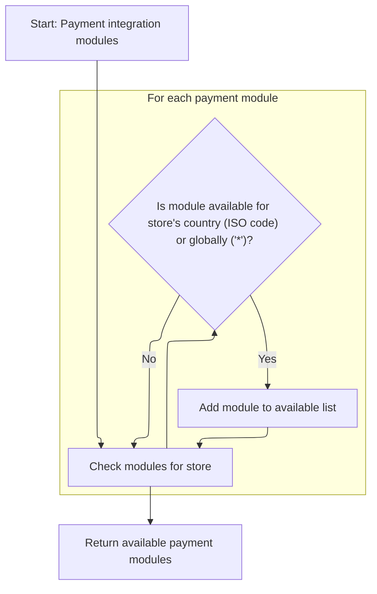

This document describes how the system determines which payment methods are available to a merchant store. By retrieving all configured payment modules and filtering them based on the store's region, the flow ensures that only relevant payment options are presented. The process starts with merchant store information as input and returns a list of payment modules tailored to the store's location.

# Fetching and Preparing Payment Modules

This section is responsible for fetching all payment modules that could be available to a merchant store, as a prerequisite for filtering and preparing payment options based on store-specific criteria.

| Category        | Rule Name                     | Description                                                                                                                         |
| --------------- | ----------------------------- | ----------------------------------------------------------------------------------------------------------------------------------- |
| Data validation | Reflect current configuration | The list of payment modules must reflect the current configuration, including any updates or changes made by administrators.        |
| Business logic  | Retrieve all payment modules  | All payment modules configured in the system must be retrieved before any filtering or selection based on store criteria can occur. |

<SwmSnippet path="/shopizer/sm-core/src/main/java/com/salesmanager/core/business/payments/service/PaymentServiceImpl.java" line="75">

---

In `getPaymentMethods`, we kick off by grabbing all payment modules using the moduleConfigurationService. This is needed because we want to filter them based on the store's region, and we can't filter until we have the full list. The next step is to call ModuleConfigurationServiceImpl to actually fetch those modules, which might involve cache/database work and parsing config data.

```java
	public List<IntegrationModule> getPaymentMethods(MerchantStore store) throws ServiceException {
		
		List<IntegrationModule> modules =  moduleConfigurationService.getIntegrationModules(PAYMENT_MODULES);
```

---

</SwmSnippet>

## Loading and Parsing Module Configurations

```mermaid
%%{init: {"flowchart": {"defaultRenderer": "elk"}} }%%
flowchart TD
    node1["Request integration modules for type"] --> node2{"Is configuration in cache?"}
    click node1 openCode "shopizer/sm-core/src/main/java/com/salesmanager/core/business/system/service/ModuleConfigurationServiceImpl.java:50:53"
    node2 -->|"Yes"| node3["Return cached modules"]
    click node2 openCode "shopizer/sm-core/src/main/java/com/salesmanager/core/business/system/service/ModuleConfigurationServiceImpl.java:57:58"
    click node3 openCode "shopizer/sm-core/src/main/java/com/salesmanager/core/business/system/service/ModuleConfigurationServiceImpl.java:57:58"
    node2 -->|"No"| node4["Retrieve modules from database"]
    click node4 openCode "shopizer/sm-core/src/main/java/com/salesmanager/core/business/system/service/ModuleConfigurationServiceImpl.java:59:59"
    node4 --> node5["Transform modules"]
    click node5 openCode "shopizer/sm-core/src/main/java/com/salesmanager/core/business/system/service/ModuleConfigurationServiceImpl.java:61:126"
    subgraph loop1["For each module"]
      node5 --> node6{"Has regions?"}
      click node6 openCode "shopizer/sm-core/src/main/java/com/salesmanager/core/business/system/service/ModuleConfigurationServiceImpl.java:63:71"
      node6 -->|"Yes"| node7["Parse regions and add to module"]
      click node7 openCode "shopizer/sm-core/src/main/java/com/salesmanager/core/business/system/service/ModuleConfigurationServiceImpl.java:65:70"
      node6 -->|"No"| node8["Skip regions"]
      click node8 openCode "shopizer/sm-core/src/main/java/com/salesmanager/core/business/system/service/ModuleConfigurationServiceImpl.java:71:71"
      node7 --> node9{"Has details?"}
      node8 --> node9
      click node9 openCode "shopizer/sm-core/src/main/java/com/salesmanager/core/business/system/service/ModuleConfigurationServiceImpl.java:74:83"
      node9 -->|"Yes"| node10["Parse details and add to module"]
      click node10 openCode "shopizer/sm-core/src/main/java/com/salesmanager/core/business/system/service/ModuleConfigurationServiceImpl.java:79:80"
      node9 -->|"No"| node11["Skip details"]
      click node11 openCode "shopizer/sm-core/src/main/java/com/salesmanager/core/business/system/service/ModuleConfigurationServiceImpl.java:83:83"
      node10 --> node12{"Has configuration?"}
      node11 --> node12
      click node12 openCode "shopizer/sm-core/src/main/java/com/salesmanager/core/business/system/service/ModuleConfigurationServiceImpl.java:86:123"
      node12 -->|"Yes"| node13["Parse configuration"]
      click node13 openCode "shopizer/sm-core/src/main/java/com/salesmanager/core/business/system/service/ModuleConfigurationServiceImpl.java:91:120"
      node12 -->|"No"| node14["Skip configuration"]
      click node14 openCode "shopizer/sm-core/src/main/java/com/salesmanager/core/business/system/service/ModuleConfigurationServiceImpl.java:123:123"
      subgraph loop2["For each configuration entry"]
        node13 --> node15["Build configuration object"]
        click node15 openCode "shopizer/sm-core/src/main/java/com/salesmanager/core/business/system/service/ModuleConfigurationServiceImpl.java:97:114"
      end
      node15 --> node16["Add configuration objects to module"]
      click node16 openCode "shopizer/sm-core/src/main/java/com/salesmanager/core/business/system/service/ModuleConfigurationServiceImpl.java:120:121"
      node14 --> node16
      node16 --> node5
    end
    node5 --> node18["Update cache with transformed modules"]
    click node18 openCode "shopizer/sm-core/src/main/java/com/salesmanager/core/business/system/service/ModuleConfigurationServiceImpl.java:127:127"
    node18 --> node19["Return modules"]
    click node19 openCode "shopizer/sm-core/src/main/java/com/salesmanager/core/business/system/service/ModuleConfigurationServiceImpl.java:133:136"

classDef HeadingStyle fill:#777777,stroke:#333,stroke-width:2px;
```



This section ensures that integration module configurations are efficiently loaded, parsed, and made available for use, leveraging caching to optimize performance and parsing JSON fields to populate all necessary configuration data.

| Category        | Rule Name                       | Description                                                                                                                                                                             |
| --------------- | ------------------------------- | --------------------------------------------------------------------------------------------------------------------------------------------------------------------------------------- |
| Data validation | Environment config completeness | Each configuration entry for a module must include environment, scheme, host, port, URI, and any additional config fields, ensuring completeness of environment-specific configuration. |
| Business logic  | Cache-first retrieval           | If a module configuration for the requested type exists in cache, it must be returned directly without querying the database.                                                           |
| Business logic  | Database fallback               | If the configuration is not found in cache, it must be retrieved from the database and parsed before being returned.                                                                    |
| Business logic  | Configuration parsing           | Each IntegrationModule must have its regions, configuration details, and environment-specific configurations parsed from JSON and populated into the respective fields.                 |
| Business logic  | Cache update after load         | After parsing and transforming, the resulting list of modules must be updated in the cache for future requests.                                                                         |

<SwmSnippet path="/shopizer/sm-core/src/main/java/com/salesmanager/core/business/system/service/ModuleConfigurationServiceImpl.java" line="50">

---

In `getIntegrationModules`, we first try to pull module configs from cache using a key based on the module type. If not cached, we hit the database, then parse JSON fields for regions, config details, and environment-specific configs, and finally cache the result. This sets up all the data structures needed for filtering and usage later.

```java
	public List<IntegrationModule> getIntegrationModules(String module) {
		
		
		List<IntegrationModule> modules = null;
		try {
			
			//CacheUtils cacheUtils = CacheUtils.getInstance();
			modules = (List<IntegrationModule>) cache.getFromCache("INTEGRATION_M)" + module);
			if(modules==null) {
				modules = integrationModuleDao.getModulesConfiguration(module);
				//set json objects
				for(IntegrationModule mod : modules) {
					
					String regions = mod.getRegions();
					if(regions!=null) {
						Object objRegions=JSONValue.parse(regions); 
						JSONArray arrayRegions=(JSONArray)objRegions;
						Iterator i = arrayRegions.iterator();
						while(i.hasNext()) {
							mod.getRegionsSet().add((String)i.next());
						}
					}
					
					
					String details = mod.getConfigDetails();
					if(details!=null) {
						
						//Map objects = mapper.readValue(config, Map.class);

						Map<String,String> objDetails= (Map<String, String>) JSONValue.parse(details); 
						mod.setDetails(objDetails);

						
					}
					
					
					String configs = mod.getConfiguration();
					if(configs!=null) {
						
						//Map objects = mapper.readValue(config, Map.class);

						Object objConfigs=JSONValue.parse(configs); 
						JSONArray arrayConfigs=(JSONArray)objConfigs;
						
						Map<String,ModuleConfig> moduleConfigs = new HashMap<String,ModuleConfig>();
						
						Iterator i = arrayConfigs.iterator();
						while(i.hasNext()) {
							
							Map values = (Map)i.next();
							String env = (String)values.get("env");
		            		ModuleConfig config = new ModuleConfig();
		            		config.setScheme((String)values.get("scheme"));
		            		config.setHost((String)values.get("host"));
		            		config.setPort((String)values.get("port"));
		            		config.setUri((String)values.get("uri"));
		            		config.setEnv((String)values.get("env"));
		            		if((String)values.get("config1")!=null) {
		            			config.setConfig1((String)values.get("config1"));
		            		}
		            		if((String)values.get("config2")!=null) {
		            			config.setConfig1((String)values.get("config2"));
		            		}
		            		
		            		moduleConfigs.put(env, config);
		            		
		            		
							
						}
						
						mod.setModuleConfigs(moduleConfigs);
						

					}


				}
```

---

</SwmSnippet>

<SwmSnippet path="/shopizer/sm-core/src/main/java/com/salesmanager/core/business/system/service/ModuleConfigurationServiceImpl.java" line="127">

---

After parsing and caching, we return a list of IntegrationModule objects, each with regions, config details, and environment configs populated. This is what the caller will filter and use.

```java
				cache.putInCache(modules, "INTEGRATION_M)" + module);
			}

		} catch (Exception e) {
			LOGGER.error("getIntegrationModules()", e);
		}
		return modules;
		
		
	}
```

---

</SwmSnippet>

## Filtering Modules by Store Region



<SwmSnippet path="/shopizer/sm-core/src/main/java/com/salesmanager/core/business/payments/service/PaymentServiceImpl.java" line="78">

---

Back in `getPaymentMethods`, we take the parsed modules and filter them by checking if the store's country ISO code or the wildcard '\*' is in each module's regions set. Only matching modules are added to the return list, so the final result is tailored to the store's location.

```java
		List<IntegrationModule> returnModules = new ArrayList<IntegrationModule>();
		
		for(IntegrationModule module : modules) {
			if(module.getRegionsSet().contains(store.getCountry().getIsoCode())
					|| module.getRegionsSet().contains("*")) {
				
				returnModules.add(module);
			}
		}
```

---

</SwmSnippet>

&nbsp;

*This is an auto-generated document by Swimm 🌊 and has not yet been verified by a human*

<SwmMeta version="3.0.0" repo-id="Z2l0aHViJTNBJTNBU2hvcGl6ZXIlM0ElM0F1bWFsaW5nYXN3YW1p" repo-name="Shopizer"><sup>Powered by [Swimm](https://app.swimm.io/)</sup></SwmMeta>
