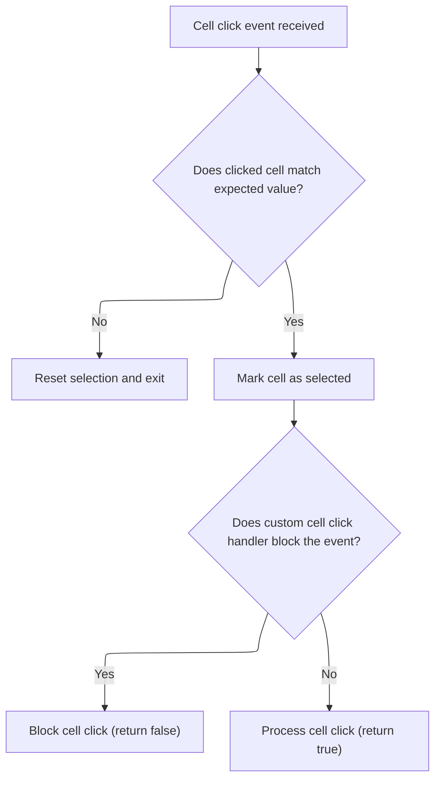

This document describes how calendar grid cell clicks are handled. When a user interacts with a cell in the calendar grid, the system determines if the cell should be selected and then triggers calendar-specific actions such as navigation or event creation. Custom handlers may block or allow further processing.

# Where is this flow used?

This flow is used multiple times in the codebase as represented in the following diagram:

```mermaid
graph TD;
      76adc57a28b996b7ec62c041948c35581f63b2c99cb309a05721c31007763c63(shopizer/…/modules/ISC_Grids.js::$29y) --> f1778b376ed337d2650483726cca6dcb1e24d5126fb78587eb09d5c8fab27486(shopizer/…/modules/ISC_Grids.js::$22n):::mainFlowStyle

4347b58f0f474e04e1d7c567385436fc6f09a3efbbdb349a934cde7ee7ca1f3b(shopizer/…/modules/ISC_Grids.js::click) --> 76adc57a28b996b7ec62c041948c35581f63b2c99cb309a05721c31007763c63(shopizer/…/modules/ISC_Grids.js::$29y)

71c9d230125aa6fb8b673a63d82b97a21e501a3d0226bfd366edee3aff793acd(shopizer/…/modules/ISC_Grids.js::isc_GridRenderer_click) --> 76adc57a28b996b7ec62c041948c35581f63b2c99cb309a05721c31007763c63(shopizer/…/modules/ISC_Grids.js::$29y)

30f54191a5378b293ff76baed077490e0a99a6367084dc7c426521bad5d50b35(shopizer/…/modules/ISC_Grids.js::doubleClick) --> 76adc57a28b996b7ec62c041948c35581f63b2c99cb309a05721c31007763c63(shopizer/…/modules/ISC_Grids.js::$29y)

30f54191a5378b293ff76baed077490e0a99a6367084dc7c426521bad5d50b35(shopizer/…/modules/ISC_Grids.js::doubleClick) --> f1778b376ed337d2650483726cca6dcb1e24d5126fb78587eb09d5c8fab27486(shopizer/…/modules/ISC_Grids.js::$22n):::mainFlowStyle

976a2813b252aa90f765bdf425a00fc8a82a6365c494dce22e6e295bf2a48a42(shopizer/…/modules/ISC_Grids.js::isc_GridRenderer_doubleClick) --> 76adc57a28b996b7ec62c041948c35581f63b2c99cb309a05721c31007763c63(shopizer/…/modules/ISC_Grids.js::$29y)

976a2813b252aa90f765bdf425a00fc8a82a6365c494dce22e6e295bf2a48a42(shopizer/…/modules/ISC_Grids.js::isc_GridRenderer_doubleClick) --> f1778b376ed337d2650483726cca6dcb1e24d5126fb78587eb09d5c8fab27486(shopizer/…/modules/ISC_Grids.js::$22n):::mainFlowStyle

c1c4690fcea743269a2fabd9a3a45e26455cc4241ec3396f06e7bffb8e32b1a4(shopizer/…/modules/ISC_Grids.js::isc_GridRenderer__rowClick) --> f1778b376ed337d2650483726cca6dcb1e24d5126fb78587eb09d5c8fab27486(shopizer/…/modules/ISC_Grids.js::$22n):::mainFlowStyle


classDef mainFlowStyle color:#000000,fill:#7CB9F4
classDef rootsStyle color:#000000,fill:#00FFF4
classDef Style1 color:#000000,fill:#00FFAA
classDef Style2 color:#000000,fill:#FFFF00
classDef Style3 color:#000000,fill:#AA7CB9

%% Swimm:
%% graph TD;
%%       76adc57a28b996b7ec62c041948c35581f63b2c99cb309a05721c31007763c63(<SwmPath>[shopizer/…/modules/ISC_Grids.js](shopizer/sm-shop/src/main/webapp/resources/smart-client/system/modules/ISC_Grids.js)</SwmPath>::<SwmToken path="shopizer/sm-shop/src/main/webapp/resources/smart-client/system/modules/ISC_Grids.js" pos="904:33:34" line-data="if(_5&amp;&amp;_5.isRemoveField){this.grid.removeRecordClick(_1,_2);_3=false}else{_3=this.Super(&quot;$29y&quot;,arguments)}">`$29y`</SwmToken>) --> f1778b376ed337d2650483726cca6dcb1e24d5126fb78587eb09d5c8fab27486(<SwmPath>[shopizer/…/modules/ISC_Grids.js](shopizer/sm-shop/src/main/webapp/resources/smart-client/system/modules/ISC_Grids.js)</SwmPath>::$22n):::mainFlowStyle
%% 
%% 4347b58f0f474e04e1d7c567385436fc6f09a3efbbdb349a934cde7ee7ca1f3b(<SwmPath>[shopizer/…/modules/ISC_Grids.js](shopizer/sm-shop/src/main/webapp/resources/smart-client/system/modules/ISC_Grids.js)</SwmPath>::click) --> 76adc57a28b996b7ec62c041948c35581f63b2c99cb309a05721c31007763c63(<SwmPath>[shopizer/…/modules/ISC_Grids.js](shopizer/sm-shop/src/main/webapp/resources/smart-client/system/modules/ISC_Grids.js)</SwmPath>::<SwmToken path="shopizer/sm-shop/src/main/webapp/resources/smart-client/system/modules/ISC_Grids.js" pos="904:33:34" line-data="if(_5&amp;&amp;_5.isRemoveField){this.grid.removeRecordClick(_1,_2);_3=false}else{_3=this.Super(&quot;$29y&quot;,arguments)}">`$29y`</SwmToken>)
%% 
%% 71c9d230125aa6fb8b673a63d82b97a21e501a3d0226bfd366edee3aff793acd(<SwmPath>[shopizer/…/modules/ISC_Grids.js](shopizer/sm-shop/src/main/webapp/resources/smart-client/system/modules/ISC_Grids.js)</SwmPath>::<SwmToken path="shopizer/sm-shop/src/main/webapp/resources/smart-client/system/modules/ISC_Grids.js" pos="823:9:9" line-data=",isc.A.click=function isc_GridRenderer_click(){if(this.$29p())return;var _1=this.getEventRow(),_2=this.getEventColumn();return this.$29y(_1,_2)}">`isc_GridRenderer_click`</SwmToken>) --> 76adc57a28b996b7ec62c041948c35581f63b2c99cb309a05721c31007763c63(<SwmPath>[shopizer/…/modules/ISC_Grids.js](shopizer/sm-shop/src/main/webapp/resources/smart-client/system/modules/ISC_Grids.js)</SwmPath>::<SwmToken path="shopizer/sm-shop/src/main/webapp/resources/smart-client/system/modules/ISC_Grids.js" pos="904:33:34" line-data="if(_5&amp;&amp;_5.isRemoveField){this.grid.removeRecordClick(_1,_2);_3=false}else{_3=this.Super(&quot;$29y&quot;,arguments)}">`$29y`</SwmToken>)
%% 
%% 30f54191a5378b293ff76baed077490e0a99a6367084dc7c426521bad5d50b35(<SwmPath>[shopizer/…/modules/ISC_Grids.js](shopizer/sm-shop/src/main/webapp/resources/smart-client/system/modules/ISC_Grids.js)</SwmPath>::<SwmToken path="shopizer/sm-shop/src/main/webapp/resources/smart-client/system/modules/ISC_Grids.js" pos="605:74:74" line-data="this.observe(_1,&quot;resized&quot;,&quot;observer.$80d(observed, deltaX, deltaY)&quot;);_1.$29b=_1._redrawWithParent;_1._redrawWithParent=false;_1.$668=_1.bubbleMouseEvents;if(!_1.bubbleMouseEvents){_1.bubbleMouseEvents=[&quot;mouseDown&quot;,&quot;mouseUp&quot;,&quot;click&quot;,&quot;doubleClick&quot;,&quot;contextClick&quot;]}">`doubleClick`</SwmToken>) --> 76adc57a28b996b7ec62c041948c35581f63b2c99cb309a05721c31007763c63(<SwmPath>[shopizer/…/modules/ISC_Grids.js](shopizer/sm-shop/src/main/webapp/resources/smart-client/system/modules/ISC_Grids.js)</SwmPath>::<SwmToken path="shopizer/sm-shop/src/main/webapp/resources/smart-client/system/modules/ISC_Grids.js" pos="904:33:34" line-data="if(_5&amp;&amp;_5.isRemoveField){this.grid.removeRecordClick(_1,_2);_3=false}else{_3=this.Super(&quot;$29y&quot;,arguments)}">`$29y`</SwmToken>)
%% 
%% 30f54191a5378b293ff76baed077490e0a99a6367084dc7c426521bad5d50b35(<SwmPath>[shopizer/…/modules/ISC_Grids.js](shopizer/sm-shop/src/main/webapp/resources/smart-client/system/modules/ISC_Grids.js)</SwmPath>::<SwmToken path="shopizer/sm-shop/src/main/webapp/resources/smart-client/system/modules/ISC_Grids.js" pos="605:74:74" line-data="this.observe(_1,&quot;resized&quot;,&quot;observer.$80d(observed, deltaX, deltaY)&quot;);_1.$29b=_1._redrawWithParent;_1._redrawWithParent=false;_1.$668=_1.bubbleMouseEvents;if(!_1.bubbleMouseEvents){_1.bubbleMouseEvents=[&quot;mouseDown&quot;,&quot;mouseUp&quot;,&quot;click&quot;,&quot;doubleClick&quot;,&quot;contextClick&quot;]}">`doubleClick`</SwmToken>) --> f1778b376ed337d2650483726cca6dcb1e24d5126fb78587eb09d5c8fab27486(<SwmPath>[shopizer/…/modules/ISC_Grids.js](shopizer/sm-shop/src/main/webapp/resources/smart-client/system/modules/ISC_Grids.js)</SwmPath>::$22n):::mainFlowStyle
%% 
%% 976a2813b252aa90f765bdf425a00fc8a82a6365c494dce22e6e295bf2a48a42(<SwmPath>[shopizer/…/modules/ISC_Grids.js](shopizer/sm-shop/src/main/webapp/resources/smart-client/system/modules/ISC_Grids.js)</SwmPath>::<SwmToken path="shopizer/sm-shop/src/main/webapp/resources/smart-client/system/modules/ISC_Grids.js" pos="830:9:9" line-data=",isc.A.doubleClick=function isc_GridRenderer_doubleClick(){if(this.$29p())return;var _1=this.getEventRow(),_2=this.getEventColumn();if(!(_1&gt;=0&amp;&amp;_2&gt;=0))return;if(!this.cellIsEnabled(_1,_2))return false;if(_1!=this.$29z){return this.$29y(_1,_2)}">`isc_GridRenderer_doubleClick`</SwmToken>) --> 76adc57a28b996b7ec62c041948c35581f63b2c99cb309a05721c31007763c63(<SwmPath>[shopizer/…/modules/ISC_Grids.js](shopizer/sm-shop/src/main/webapp/resources/smart-client/system/modules/ISC_Grids.js)</SwmPath>::<SwmToken path="shopizer/sm-shop/src/main/webapp/resources/smart-client/system/modules/ISC_Grids.js" pos="904:33:34" line-data="if(_5&amp;&amp;_5.isRemoveField){this.grid.removeRecordClick(_1,_2);_3=false}else{_3=this.Super(&quot;$29y&quot;,arguments)}">`$29y`</SwmToken>)
%% 
%% 976a2813b252aa90f765bdf425a00fc8a82a6365c494dce22e6e295bf2a48a42(<SwmPath>[shopizer/…/modules/ISC_Grids.js](shopizer/sm-shop/src/main/webapp/resources/smart-client/system/modules/ISC_Grids.js)</SwmPath>::<SwmToken path="shopizer/sm-shop/src/main/webapp/resources/smart-client/system/modules/ISC_Grids.js" pos="830:9:9" line-data=",isc.A.doubleClick=function isc_GridRenderer_doubleClick(){if(this.$29p())return;var _1=this.getEventRow(),_2=this.getEventColumn();if(!(_1&gt;=0&amp;&amp;_2&gt;=0))return;if(!this.cellIsEnabled(_1,_2))return false;if(_1!=this.$29z){return this.$29y(_1,_2)}">`isc_GridRenderer_doubleClick`</SwmToken>) --> f1778b376ed337d2650483726cca6dcb1e24d5126fb78587eb09d5c8fab27486(<SwmPath>[shopizer/…/modules/ISC_Grids.js](shopizer/sm-shop/src/main/webapp/resources/smart-client/system/modules/ISC_Grids.js)</SwmPath>::$22n):::mainFlowStyle
%% 
%% c1c4690fcea743269a2fabd9a3a45e26455cc4241ec3396f06e7bffb8e32b1a4(<SwmPath>[shopizer/…/modules/ISC_Grids.js](shopizer/sm-shop/src/main/webapp/resources/smart-client/system/modules/ISC_Grids.js)</SwmPath>::<SwmToken path="shopizer/sm-shop/src/main/webapp/resources/smart-client/system/modules/ISC_Grids.js" pos="824:9:9" line-data=",isc.A.$29y=function isc_GridRenderer__rowClick(_1,_2){this.$29z=this.$290=null;var _3=this.$29u;if(_3!=null&amp;&amp;_1!=_3){if(isc.EH.getX()==this.$723){_1=this.$29u}else{return}}">`isc_GridRenderer__rowClick`</SwmToken>) --> f1778b376ed337d2650483726cca6dcb1e24d5126fb78587eb09d5c8fab27486(<SwmPath>[shopizer/…/modules/ISC_Grids.js](shopizer/sm-shop/src/main/webapp/resources/smart-client/system/modules/ISC_Grids.js)</SwmPath>::$22n):::mainFlowStyle
%% 
%% 
%% classDef mainFlowStyle color:#000000,fill:#7CB9F4
%% classDef rootsStyle color:#000000,fill:#00FFF4
%% classDef Style1 color:#000000,fill:#00FFAA
%% classDef Style2 color:#000000,fill:#FFFF00
%% classDef Style3 color:#000000,fill:#AA7CB9
```



# Handling Calendar Grid Cell Clicks



<SwmSnippet path="/shopizer/sm-shop/src/main/webapp/resources/smart-client/system/modules/ISC_Grids.js" line="828">

---

$22n checks if the clicked cell is the one we're tracking, updates state, and hands off to <SwmToken path="shopizer/sm-shop/src/main/webapp/resources/smart-client/system/modules/ISC_Grids.js" pos="829:17:17" line-data="this.$290=_3;this.$291=null;return!(this.cellClick&amp;&amp;(this.cellClick(_1,_2,_3)==false))}">`cellClick`</SwmToken> for calendar-specific logic.

```javascript
,isc.A.$22n=function isc_GridRenderer__cellClick(_1,_2,_3){if(this.$29v!=_3){this.$290=null;return}
this.$290=_3;this.$291=null;return!(this.cellClick&&(this.cellClick(_1,_2,_3)==false))}
```

---

</SwmSnippet>

<SwmSnippet path="/shopizer/sm-shop/src/main/webapp/resources/smart-client/system/modules/ISC_Calendar.js" line="296">

---

CellClick in <SwmPath>[shopizer/…/modules/ISC_Calendar.js](shopizer/sm-shop/src/main/webapp/resources/smart-client/system/modules/ISC_Calendar.js)</SwmPath> handles the actual calendar logic after a cell is clicked. It uses dynamic property access to pull out date/event/day info for the clicked cell, then checks if the row is a header. Header clicks trigger navigation and UI updates, while body clicks can trigger event creation. The function also figures out which month/year to use for navigation, especially for days that spill into adjacent months.

```javascript
,isc.A.cellClick=function isc_MonthSchedule_cellClick(_1,_2,_3){var _4=this.creator,_5,_6,_7=this.fields.get(_3).$66b,_8=_1["date"+_7],_9=_1["event"+_7],_10=_4.chosenDate.getMonth()!=_8.getMonth(),_11=false;if(this.rowIsHeader(_2)){if(!(!this.creator.showOtherDays&&_10)){_11=_4.dayHeaderClick(_8,_9,_4,_2,_3)}
if(_11){if(_2==0&&_1["day"+_7]>7){if(_4.month==0){_5=_4.year-1;_6=11}else{_5=_4.year;_6=_4.month-1}}else if(_2==this.data.length-2&&_1["day"+_7]<7){if(_4.month==11){_5=_4.year+1;_6=0}else{_5=_4.year;_6=_4.month+1}}else{_5=_4.year;_6=_4.month}
_4.dateChooser.dateClick(_5,_6,_1["day"+_7]);_4.selectTab(0)}}else{if(!this.colDisabled(_3)&&!(!_4.showOtherDays&&_10)){_11=_4.dayBodyClick(_8,_9,_4,_2,_3);if(_11&&_4.canCreateEvents){_4.$53l(_2,_3)}}}}
```

---

</SwmSnippet>

&nbsp;

*This is an auto-generated document by Swimm 🌊 and has not yet been verified by a human*

<SwmMeta version="3.0.0" repo-id="Z2l0aHViJTNBJTNBU2hvcGl6ZXIlM0ElM0F1bWFsaW5nYXN3YW1p" repo-name="Shopizer"><sup>Powered by [Swimm](https://app.swimm.io/)</sup></SwmMeta>
