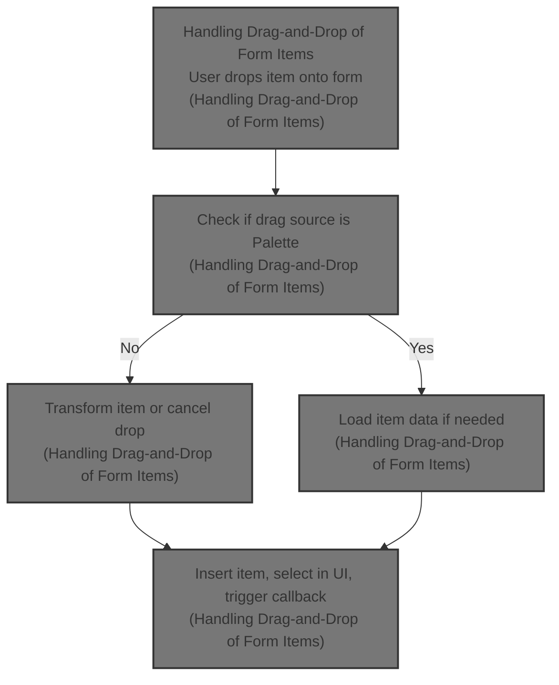
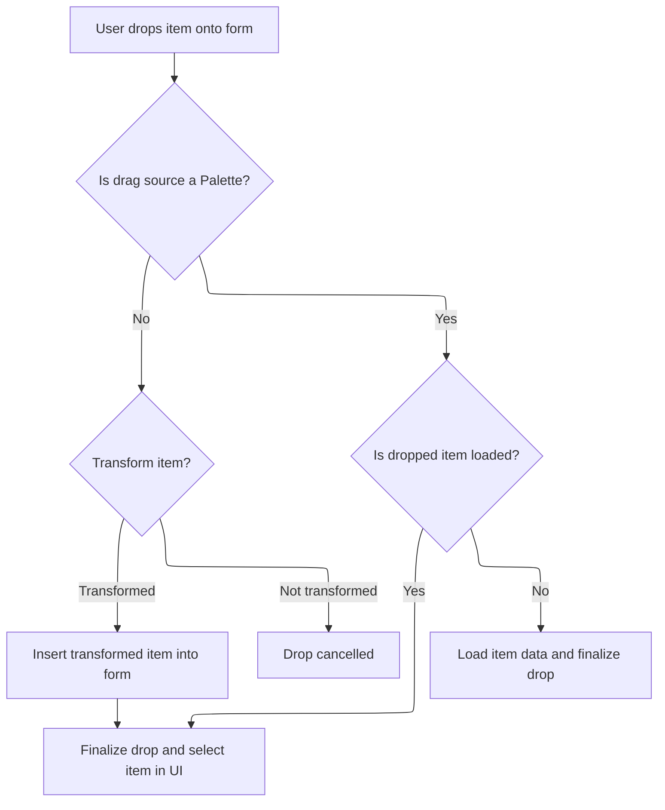

This document describes how form items are handled when a user drags and drops them onto a form in the form builder interface. The flow ensures that items are inserted with the correct data binding and UI structure, and provides user feedback such as selection and callbacks.



# Where is this flow used?

This flow is used multiple times in the codebase as represented in the following diagram:

```mermaid
graph TD;
      bf12d9fc9f82ac0ae01056324f24cf99b4116fe7205d4ddea1a47f4acaaceeaa(shopizer/…/modules/ISC_DataBinding.js::editModeDrop) --> fba9b8d96428ef2d31ff310ffce1b079ab8a1189d80255bf691364cf41ad99a6(shopizer/…/modules/ISC_DataBinding.js::itemDrop):::mainFlowStyle

bf12d9fc9f82ac0ae01056324f24cf99b4116fe7205d4ddea1a47f4acaaceeaa(shopizer/…/modules/ISC_DataBinding.js::editModeDrop) --> e28ba995537820dd8dead0a7d62a397e20adffecdfe6e621afa9c105fd6fafea(shopizer/…/modules/ISC_DataBinding.js::modifyFormOnDrop)

374fd5926685af6fce28c1d76bf491de745cdecde478016317304478502a7b18(shopizer/…/modules/ISC_DataBinding.js::isc_DynamicForm_editModeDrop) --> fba9b8d96428ef2d31ff310ffce1b079ab8a1189d80255bf691364cf41ad99a6(shopizer/…/modules/ISC_DataBinding.js::itemDrop):::mainFlowStyle

374fd5926685af6fce28c1d76bf491de745cdecde478016317304478502a7b18(shopizer/…/modules/ISC_DataBinding.js::isc_DynamicForm_editModeDrop) --> e28ba995537820dd8dead0a7d62a397e20adffecdfe6e621afa9c105fd6fafea(shopizer/…/modules/ISC_DataBinding.js::modifyFormOnDrop)

e9eec5880d3eb201caf78aa5abebf6b98b027e46514de983f2efa47ae22449b5(shopizer/…/modules/ISC_DataBinding.js::isc_DynamicForm_modifyFormOnDrop) --> fba9b8d96428ef2d31ff310ffce1b079ab8a1189d80255bf691364cf41ad99a6(shopizer/…/modules/ISC_DataBinding.js::itemDrop):::mainFlowStyle

e28ba995537820dd8dead0a7d62a397e20adffecdfe6e621afa9c105fd6fafea(shopizer/…/modules/ISC_DataBinding.js::modifyFormOnDrop) --> fba9b8d96428ef2d31ff310ffce1b079ab8a1189d80255bf691364cf41ad99a6(shopizer/…/modules/ISC_DataBinding.js::itemDrop):::mainFlowStyle


classDef mainFlowStyle color:#000000,fill:#7CB9F4
classDef rootsStyle color:#000000,fill:#00FFF4
classDef Style1 color:#000000,fill:#00FFAA
classDef Style2 color:#000000,fill:#FFFF00
classDef Style3 color:#000000,fill:#AA7CB9

%% Swimm:
%% graph TD;
%%       bf12d9fc9f82ac0ae01056324f24cf99b4116fe7205d4ddea1a47f4acaaceeaa(<SwmPath>[shopizer/…/modules/ISC_DataBinding.js](shopizer/sm-shop/src/main/webapp/resources/smart-client/system/modules/ISC_DataBinding.js)</SwmPath>::<SwmToken path="shopizer/sm-shop/src/main/webapp/resources/smart-client/system/modules/ISC_DataBinding.js" pos="1850:111:111" line-data="this.editNode=_3;if(this.editingOn){this.saveToOriginalValues([&quot;click&quot;,&quot;doubleClick&quot;,&quot;willAcceptDrop&quot;,&quot;clearNoDropIndicator&quot;,&quot;setNoDropCursor&quot;,&quot;canAcceptDrop&quot;,&quot;canDropComponents&quot;,&quot;drop&quot;,&quot;dropMove&quot;,&quot;dropOver&quot;,&quot;setDataSource&quot;]);this.setProperties({click:this.editModeClick,doubleClick:this.editModeDoubleClick,willAcceptDrop:this.editModeWillAcceptDrop,clearNoDropIndicator:this.editModeClearNoDropIndicator,setNoDropIndicator:this.editModeSetNoDropIndicator,canAcceptDrop:true,canDropComponents:true,drop:this.editModeDrop,dropMove:this.editModeDropMove,dropOver:this.editModeDropOver,baseSetDataSource:this.setDataSource,setDataSource:this.editModeSetDataSource})}else{this.restoreFromOriginalValues([&quot;click&quot;,&quot;doubleClick&quot;,&quot;willAcceptDrop&quot;,&quot;clearNoDropIndicator&quot;,&quot;setNoDropCursor&quot;,&quot;canAcceptDrop&quot;,&quot;canDropComponents&quot;,&quot;drop&quot;,&quot;dropMove&quot;,&quot;dropOver&quot;,&quot;setDataSource&quot;])}">`editModeDrop`</SwmToken>) --> fba9b8d96428ef2d31ff310ffce1b079ab8a1189d80255bf691364cf41ad99a6(<SwmPath>[shopizer/…/modules/ISC_DataBinding.js](shopizer/sm-shop/src/main/webapp/resources/smart-client/system/modules/ISC_DataBinding.js)</SwmPath>::<SwmToken path="shopizer/sm-shop/src/main/webapp/resources/smart-client/system/modules/ISC_DataBinding.js" pos="2045:5:5" line-data=",isc.A.itemDrop=function isc_DynamicForm_itemDrop(_1,_2,_3,_4,_5,_6){var _7=_1.getDragData();if(_7==null){_7=isc.EH.dragTarget;if(isc.isA.FormItemProxyCanvas(_7)){this.logInfo(&quot;The dragTarget is a FormItemProxyCanvas for &quot;+_7.formItem,&quot;editModeDragTarget&quot;);_7=_7.formItem}}">`itemDrop`</SwmToken>):::mainFlowStyle
%% 
%% bf12d9fc9f82ac0ae01056324f24cf99b4116fe7205d4ddea1a47f4acaaceeaa(<SwmPath>[shopizer/…/modules/ISC_DataBinding.js](shopizer/sm-shop/src/main/webapp/resources/smart-client/system/modules/ISC_DataBinding.js)</SwmPath>::<SwmToken path="shopizer/sm-shop/src/main/webapp/resources/smart-client/system/modules/ISC_DataBinding.js" pos="1850:111:111" line-data="this.editNode=_3;if(this.editingOn){this.saveToOriginalValues([&quot;click&quot;,&quot;doubleClick&quot;,&quot;willAcceptDrop&quot;,&quot;clearNoDropIndicator&quot;,&quot;setNoDropCursor&quot;,&quot;canAcceptDrop&quot;,&quot;canDropComponents&quot;,&quot;drop&quot;,&quot;dropMove&quot;,&quot;dropOver&quot;,&quot;setDataSource&quot;]);this.setProperties({click:this.editModeClick,doubleClick:this.editModeDoubleClick,willAcceptDrop:this.editModeWillAcceptDrop,clearNoDropIndicator:this.editModeClearNoDropIndicator,setNoDropIndicator:this.editModeSetNoDropIndicator,canAcceptDrop:true,canDropComponents:true,drop:this.editModeDrop,dropMove:this.editModeDropMove,dropOver:this.editModeDropOver,baseSetDataSource:this.setDataSource,setDataSource:this.editModeSetDataSource})}else{this.restoreFromOriginalValues([&quot;click&quot;,&quot;doubleClick&quot;,&quot;willAcceptDrop&quot;,&quot;clearNoDropIndicator&quot;,&quot;setNoDropCursor&quot;,&quot;canAcceptDrop&quot;,&quot;canDropComponents&quot;,&quot;drop&quot;,&quot;dropMove&quot;,&quot;dropOver&quot;,&quot;setDataSource&quot;])}">`editModeDrop`</SwmToken>) --> e28ba995537820dd8dead0a7d62a397e20adffecdfe6e621afa9c105fd6fafea(<SwmPath>[shopizer/…/modules/ISC_DataBinding.js](shopizer/sm-shop/src/main/webapp/resources/smart-client/system/modules/ISC_DataBinding.js)</SwmPath>::<SwmToken path="shopizer/sm-shop/src/main/webapp/resources/smart-client/system/modules/ISC_DataBinding.js" pos="2043:16:16" line-data="var _7=this.items.$8j.duplicate();this.modifyFormOnDrop(_2,_3.top,_3.left,_4,_7)}">`modifyFormOnDrop`</SwmToken>)
%% 
%% 374fd5926685af6fce28c1d76bf491de745cdecde478016317304478502a7b18(<SwmPath>[shopizer/…/modules/ISC_DataBinding.js](shopizer/sm-shop/src/main/webapp/resources/smart-client/system/modules/ISC_DataBinding.js)</SwmPath>::<SwmToken path="shopizer/sm-shop/src/main/webapp/resources/smart-client/system/modules/ISC_DataBinding.js" pos="2037:9:9" line-data=",isc.A.editModeDrop=function isc_DynamicForm_editModeDrop(){var _1=this.ns.EH.getDragTarget().getDragData();if(isc.isAn.Array(_1))_1=_1[0];if((_1&amp;&amp;_1.className==&quot;DataSource&quot;)||this.getItems().length==0)">`isc_DynamicForm_editModeDrop`</SwmToken>) --> fba9b8d96428ef2d31ff310ffce1b079ab8a1189d80255bf691364cf41ad99a6(<SwmPath>[shopizer/…/modules/ISC_DataBinding.js](shopizer/sm-shop/src/main/webapp/resources/smart-client/system/modules/ISC_DataBinding.js)</SwmPath>::<SwmToken path="shopizer/sm-shop/src/main/webapp/resources/smart-client/system/modules/ISC_DataBinding.js" pos="2045:5:5" line-data=",isc.A.itemDrop=function isc_DynamicForm_itemDrop(_1,_2,_3,_4,_5,_6){var _7=_1.getDragData();if(_7==null){_7=isc.EH.dragTarget;if(isc.isA.FormItemProxyCanvas(_7)){this.logInfo(&quot;The dragTarget is a FormItemProxyCanvas for &quot;+_7.formItem,&quot;editModeDragTarget&quot;);_7=_7.formItem}}">`itemDrop`</SwmToken>):::mainFlowStyle
%% 
%% 374fd5926685af6fce28c1d76bf491de745cdecde478016317304478502a7b18(<SwmPath>[shopizer/…/modules/ISC_DataBinding.js](shopizer/sm-shop/src/main/webapp/resources/smart-client/system/modules/ISC_DataBinding.js)</SwmPath>::<SwmToken path="shopizer/sm-shop/src/main/webapp/resources/smart-client/system/modules/ISC_DataBinding.js" pos="2037:9:9" line-data=",isc.A.editModeDrop=function isc_DynamicForm_editModeDrop(){var _1=this.ns.EH.getDragTarget().getDragData();if(isc.isAn.Array(_1))_1=_1[0];if((_1&amp;&amp;_1.className==&quot;DataSource&quot;)||this.getItems().length==0)">`isc_DynamicForm_editModeDrop`</SwmToken>) --> e28ba995537820dd8dead0a7d62a397e20adffecdfe6e621afa9c105fd6fafea(<SwmPath>[shopizer/…/modules/ISC_DataBinding.js](shopizer/sm-shop/src/main/webapp/resources/smart-client/system/modules/ISC_DataBinding.js)</SwmPath>::<SwmToken path="shopizer/sm-shop/src/main/webapp/resources/smart-client/system/modules/ISC_DataBinding.js" pos="2043:16:16" line-data="var _7=this.items.$8j.duplicate();this.modifyFormOnDrop(_2,_3.top,_3.left,_4,_7)}">`modifyFormOnDrop`</SwmToken>)
%% 
%% e9eec5880d3eb201caf78aa5abebf6b98b027e46514de983f2efa47ae22449b5(<SwmPath>[shopizer/…/modules/ISC_DataBinding.js](shopizer/sm-shop/src/main/webapp/resources/smart-client/system/modules/ISC_DataBinding.js)</SwmPath>::<SwmToken path="shopizer/sm-shop/src/main/webapp/resources/smart-client/system/modules/ISC_DataBinding.js" pos="2058:9:9" line-data=",isc.A.modifyFormOnDrop=function isc_DynamicForm_modifyFormOnDrop(_1,_2,_3,_4,_5){if(this.canAddColumns==false)return;var _6=this.ns.EH.getDragTarget().getDragData(),_7,_8,_9,_10=this;if(!_6){_6=this.ns.EH.getDragTarget();if(!isc.isA.FormItemProxyCanvas(_6)){this.logWarn(&quot;In modifyFormOnDrop the drag target was not a FormItemProxyCanvas&quot;);return}">`isc_DynamicForm_modifyFormOnDrop`</SwmToken>) --> fba9b8d96428ef2d31ff310ffce1b079ab8a1189d80255bf691364cf41ad99a6(<SwmPath>[shopizer/…/modules/ISC_DataBinding.js](shopizer/sm-shop/src/main/webapp/resources/smart-client/system/modules/ISC_DataBinding.js)</SwmPath>::<SwmToken path="shopizer/sm-shop/src/main/webapp/resources/smart-client/system/modules/ISC_DataBinding.js" pos="2045:5:5" line-data=",isc.A.itemDrop=function isc_DynamicForm_itemDrop(_1,_2,_3,_4,_5,_6){var _7=_1.getDragData();if(_7==null){_7=isc.EH.dragTarget;if(isc.isA.FormItemProxyCanvas(_7)){this.logInfo(&quot;The dragTarget is a FormItemProxyCanvas for &quot;+_7.formItem,&quot;editModeDragTarget&quot;);_7=_7.formItem}}">`itemDrop`</SwmToken>):::mainFlowStyle
%% 
%% e28ba995537820dd8dead0a7d62a397e20adffecdfe6e621afa9c105fd6fafea(<SwmPath>[shopizer/…/modules/ISC_DataBinding.js](shopizer/sm-shop/src/main/webapp/resources/smart-client/system/modules/ISC_DataBinding.js)</SwmPath>::<SwmToken path="shopizer/sm-shop/src/main/webapp/resources/smart-client/system/modules/ISC_DataBinding.js" pos="2043:16:16" line-data="var _7=this.items.$8j.duplicate();this.modifyFormOnDrop(_2,_3.top,_3.left,_4,_7)}">`modifyFormOnDrop`</SwmToken>) --> fba9b8d96428ef2d31ff310ffce1b079ab8a1189d80255bf691364cf41ad99a6(<SwmPath>[shopizer/…/modules/ISC_DataBinding.js](shopizer/sm-shop/src/main/webapp/resources/smart-client/system/modules/ISC_DataBinding.js)</SwmPath>::<SwmToken path="shopizer/sm-shop/src/main/webapp/resources/smart-client/system/modules/ISC_DataBinding.js" pos="2045:5:5" line-data=",isc.A.itemDrop=function isc_DynamicForm_itemDrop(_1,_2,_3,_4,_5,_6){var _7=_1.getDragData();if(_7==null){_7=isc.EH.dragTarget;if(isc.isA.FormItemProxyCanvas(_7)){this.logInfo(&quot;The dragTarget is a FormItemProxyCanvas for &quot;+_7.formItem,&quot;editModeDragTarget&quot;);_7=_7.formItem}}">`itemDrop`</SwmToken>):::mainFlowStyle
%% 
%% 
%% classDef mainFlowStyle color:#000000,fill:#7CB9F4
%% classDef rootsStyle color:#000000,fill:#00FFF4
%% classDef Style1 color:#000000,fill:#00FFAA
%% classDef Style2 color:#000000,fill:#FFFF00
%% classDef Style3 color:#000000,fill:#AA7CB9
```



# Handling Drag-and-Drop of Form Items



This section governs how form items are handled when dropped onto a form, ensuring correct data binding, UI structure, and user feedback. It supports custom logic for transforming items and loading data, and manages selection and callbacks after the drop.

| Category        | Rule Name                         | Description                                                                                                                                                                    |
| --------------- | --------------------------------- | ------------------------------------------------------------------------------------------------------------------------------------------------------------------------------ |
| Data validation | Palette item data loading         | If the dropped item is from the Palette and is not loaded, its data must be loaded before it is inserted into the form.                                                        |
| Data validation | Drop cancellation on invalid item | If the dropped item cannot be transformed or is invalid, the drop is cancelled and no changes are made to the form.                                                            |
| Business logic  | Data source alignment             | If the dropped item's data source does not match the form's, the form's data binding must be updated and the item wrapped in a new container to maintain correct data context. |
| Business logic  | Custom drop intervention          | Custom logic may intervene before an item is inserted; if the custom logic cancels the drop, the item is not added to the form.                                                |
| Business logic  | Post-drop selection and callback  | After a successful drop, the dropped item must be selected in the UI and any provided callback must be triggered.                                                              |

<SwmSnippet path="/shopizer/sm-shop/src/main/webapp/resources/smart-client/system/modules/ISC_DataBinding.js" line="2045">

---

In <SwmToken path="shopizer/sm-shop/src/main/webapp/resources/smart-client/system/modules/ISC_DataBinding.js" pos="2045:5:5" line-data=",isc.A.itemDrop=function isc_DynamicForm_itemDrop(_1,_2,_3,_4,_5,_6){var _7=_1.getDragData();if(_7==null){_7=isc.EH.dragTarget;if(isc.isA.FormItemProxyCanvas(_7)){this.logInfo(&quot;The dragTarget is a FormItemProxyCanvas for &quot;+_7.formItem,&quot;editModeDragTarget&quot;);_7=_7.formItem}}">`itemDrop`</SwmToken>, we grab the drag data, handle proxy cases, and use <SwmToken path="shopizer/sm-shop/src/main/webapp/resources/smart-client/system/modules/ISC_DataBinding.js" pos="2046:84:84" line-data="if(!_1.isA(&quot;Palette&quot;)){if(isc.EditContext.$70r)isc.EditContext.$70r.hide();var _8=this.editContext.data,_9=_8.getParent(_7.editNode),_10=_8.getChildren(_9).indexOf(_7.editNode),_11=_7.editNode;if(isc.isA.Function(this.itemDropping)){_11=this.itemDropping(_11,_2,true);if(!_11)return}">`itemDropping`</SwmToken> to allow custom logic to intervene before moving nodes in the edit context.

```javascript
,isc.A.itemDrop=function isc_DynamicForm_itemDrop(_1,_2,_3,_4,_5,_6){var _7=_1.getDragData();if(_7==null){_7=isc.EH.dragTarget;if(isc.isA.FormItemProxyCanvas(_7)){this.logInfo("The dragTarget is a FormItemProxyCanvas for "+_7.formItem,"editModeDragTarget");_7=_7.formItem}}
if(!_1.isA("Palette")){if(isc.EditContext.$70r)isc.EditContext.$70r.hide();var _8=this.editContext.data,_9=_8.getParent(_7.editNode),_10=_8.getChildren(_9).indexOf(_7.editNode),_11=_7.editNode;if(isc.isA.Function(this.itemDropping)){_11=this.itemDropping(_11,_2,true);if(!_11)return}
```

---

</SwmSnippet>

<SwmSnippet path="/shopizer/sm-shop/src/main/webapp/resources/smart-client/system/modules/ISC_DataBinding.js" line="2094">

---

<SwmToken path="shopizer/sm-shop/src/main/webapp/resources/smart-client/system/modules/ISC_DataBinding.js" pos="2094:5:5" line-data=",isc.A.itemDropping=function isc_DynamicForm_itemDropping(_1,_2,_3){var _4=_1.liveObject,_5=isc.EditContext.getSchemaInfo(_1);if(!_5.dataSource)return _1;if(!this.dataSource){this.setDataSource(_5.dataSource);this.serviceNamespace=_5.serviceNamespace;this.serviceName=_5.serviceName;return _1}">`itemDropping`</SwmToken> checks if the dropped item's <SwmToken path="shopizer/sm-shop/src/main/webapp/resources/smart-client/system/modules/ISC_DataBinding.js" pos="2094:42:42" line-data=",isc.A.itemDropping=function isc_DynamicForm_itemDropping(_1,_2,_3){var _4=_1.liveObject,_5=isc.EditContext.getSchemaInfo(_1);if(!_5.dataSource)return _1;if(!this.dataSource){this.setDataSource(_5.dataSource);this.serviceNamespace=_5.serviceNamespace;this.serviceName=_5.serviceName;return _1}">`dataSource`</SwmToken> matches the form's. If not, it updates the form's data binding and wraps the item in a new <SwmToken path="shopizer/sm-shop/src/main/webapp/resources/smart-client/system/modules/ISC_DataBinding.js" pos="2096:14:14" line-data="var _6=this.editContext.makeEditNode({className:&quot;CanvasItem&quot;,defaults:{cellStyle:&quot;nestedFormContainer&quot;}});isc.addProperties(_6.initData,{showTitle:false,colSpan:2});_6.dropped=true;this.editContext.addComponent(_6,this.editNode,_2);var _7=this.editContext.makeEditNode({className:&quot;DynamicForm&quot;,defaults:{numCols:2,canDropItems:false,dataSource:_5.dataSource,serviceNamespace:_5.serviceNamespace,serviceName:_5.serviceName,doNotUseDefaultBinding:true}});_7.dropped=true;this.editContext.addComponent(_7,_6,0);var _8=this.editContext.addComponent(_1,_7,0);isc.EditContext.clearSchemaProperties(_8)}">`CanvasItem`</SwmToken> and <SwmToken path="shopizer/sm-shop/src/main/webapp/resources/smart-client/system/modules/ISC_DataBinding.js" pos="2096:83:83" line-data="var _6=this.editContext.makeEditNode({className:&quot;CanvasItem&quot;,defaults:{cellStyle:&quot;nestedFormContainer&quot;}});isc.addProperties(_6.initData,{showTitle:false,colSpan:2});_6.dropped=true;this.editContext.addComponent(_6,this.editNode,_2);var _7=this.editContext.makeEditNode({className:&quot;DynamicForm&quot;,defaults:{numCols:2,canDropItems:false,dataSource:_5.dataSource,serviceNamespace:_5.serviceNamespace,serviceName:_5.serviceName,doNotUseDefaultBinding:true}});_7.dropped=true;this.editContext.addComponent(_7,_6,0);var _8=this.editContext.addComponent(_1,_7,0);isc.EditContext.clearSchemaProperties(_8)}">`DynamicForm`</SwmToken>, so the dropped item gets its own container and data context. This keeps the UI structure and data binding correct after a drop.

```javascript
,isc.A.itemDropping=function isc_DynamicForm_itemDropping(_1,_2,_3){var _4=_1.liveObject,_5=isc.EditContext.getSchemaInfo(_1);if(!_5.dataSource)return _1;if(!this.dataSource){this.setDataSource(_5.dataSource);this.serviceNamespace=_5.serviceNamespace;this.serviceName=_5.serviceName;return _1}
if(_5.dataSource==isc.DataSource.getDataSource(this.dataSource).ID&&_5.serviceNamespace==this.serviceNamespace&&_5.serviceName==this.serviceName){return _1}
var _6=this.editContext.makeEditNode({className:"CanvasItem",defaults:{cellStyle:"nestedFormContainer"}});isc.addProperties(_6.initData,{showTitle:false,colSpan:2});_6.dropped=true;this.editContext.addComponent(_6,this.editNode,_2);var _7=this.editContext.makeEditNode({className:"DynamicForm",defaults:{numCols:2,canDropItems:false,dataSource:_5.dataSource,serviceNamespace:_5.serviceNamespace,serviceName:_5.serviceName,doNotUseDefaultBinding:true}});_7.dropped=true;this.editContext.addComponent(_7,_6,0);var _8=this.editContext.addComponent(_1,_7,0);isc.EditContext.clearSchemaProperties(_8)}
```

---

</SwmSnippet>

<SwmSnippet path="/shopizer/sm-shop/src/main/webapp/resources/smart-client/system/modules/ISC_DataBinding.js" line="2047">

---

Back in <SwmToken path="shopizer/sm-shop/src/main/webapp/resources/smart-client/system/modules/ISC_DataBinding.js" pos="2045:5:5" line-data=",isc.A.itemDrop=function isc_DynamicForm_itemDrop(_1,_2,_3,_4,_5,_6){var _7=_1.getDragData();if(_7==null){_7=isc.EH.dragTarget;if(isc.isA.FormItemProxyCanvas(_7)){this.logInfo(&quot;The dragTarget is a FormItemProxyCanvas for &quot;+_7.formItem,&quot;editModeDragTarget&quot;);_7=_7.formItem}}">`itemDrop`</SwmToken>, after <SwmToken path="shopizer/sm-shop/src/main/webapp/resources/smart-client/system/modules/ISC_DataBinding.js" pos="2046:84:84" line-data="if(!_1.isA(&quot;Palette&quot;)){if(isc.EditContext.$70r)isc.EditContext.$70r.hide();var _8=this.editContext.data,_9=_8.getParent(_7.editNode),_10=_8.getChildren(_9).indexOf(_7.editNode),_11=_7.editNode;if(isc.isA.Function(this.itemDropping)){_11=this.itemDropping(_11,_2,true);if(!_11)return}">`itemDropping`</SwmToken>, we finalize the drop by calling <SwmToken path="shopizer/sm-shop/src/main/webapp/resources/smart-client/system/modules/ISC_DataBinding.js" pos="2049:8:8" line-data="_15.isLoaded=true;_14.completeItemDrop(_15,_2,_3,_4,_5,_6)">`completeItemDrop`</SwmToken>, which handles UI updates and callbacks, especially for Palette items.

```javascript
this.editContext.removeComponent(_11);if(_9==this.editNode&&_2>_10)_2--;var _12=this.editContext.addNode(_7.editNode,this.editNode,_2);if(_12&&_12.liveObject){isc.EditContext.delayCall("selectCanvasOrFormItem",[_12.liveObject,true],200)}
return _12}else{var _13=_1.transferDragData();if(isc.isAn.Array(_13))_13=_13[0];if(_13.loadData&&!_13.isLoaded){var _14=this;_13.loadData(_13,function(_15){_15=_15||_13
_15.isLoaded=true;_14.completeItemDrop(_15,_2,_3,_4,_5,_6)
_15.dropped=_13.dropped});return}
this.completeItemDrop(_13,_2,_3,_4,_5,_6)}}
```

---

</SwmSnippet>

<SwmSnippet path="/shopizer/sm-shop/src/main/webapp/resources/smart-client/system/modules/ISC_DataBinding.js" line="2052">

---

<SwmToken path="shopizer/sm-shop/src/main/webapp/resources/smart-client/system/modules/ISC_DataBinding.js" pos="2052:5:5" line-data=",isc.A.completeItemDrop=function isc_DynamicForm_completeItemDrop(_1,_2,_3,_4,_5,_6){var _7=_1.liveObject,_8;if(!isc.isA.FormItem(_7)){if(isc.isA.Button(_7)||isc.isAn.IButton(_7)){_1=this.editContext.makeEditNode({type:&quot;ButtonItem&quot;,title:_7.title,defaults:_1.defaults})}else if(isc.isA.Canvas(_7)){_8=_1;_1=this.editContext.makeEditNode({type:&quot;CanvasItem&quot;});isc.addProperties(_1.initData,{showTitle:false,startRow:true,endRow:true,width:&quot;*&quot;,colSpan:&quot;*&quot;})}}">`completeItemDrop`</SwmToken> checks the type of the dropped item's <SwmToken path="shopizer/sm-shop/src/main/webapp/resources/smart-client/system/modules/ISC_DataBinding.js" pos="2052:30:30" line-data=",isc.A.completeItemDrop=function isc_DynamicForm_completeItemDrop(_1,_2,_3,_4,_5,_6){var _7=_1.liveObject,_8;if(!isc.isA.FormItem(_7)){if(isc.isA.Button(_7)||isc.isAn.IButton(_7)){_1=this.editContext.makeEditNode({type:&quot;ButtonItem&quot;,title:_7.title,defaults:_1.defaults})}else if(isc.isA.Canvas(_7)){_8=_1;_1=this.editContext.makeEditNode({type:&quot;CanvasItem&quot;});isc.addProperties(_1.initData,{showTitle:false,startRow:true,endRow:true,width:&quot;*&quot;,colSpan:&quot;*&quot;})}}">`liveObject`</SwmToken> and creates the right edit node (<SwmToken path="shopizer/sm-shop/src/main/webapp/resources/smart-client/system/modules/ISC_DataBinding.js" pos="2052:80:80" line-data=",isc.A.completeItemDrop=function isc_DynamicForm_completeItemDrop(_1,_2,_3,_4,_5,_6){var _7=_1.liveObject,_8;if(!isc.isA.FormItem(_7)){if(isc.isA.Button(_7)||isc.isAn.IButton(_7)){_1=this.editContext.makeEditNode({type:&quot;ButtonItem&quot;,title:_7.title,defaults:_1.defaults})}else if(isc.isA.Canvas(_7)){_8=_1;_1=this.editContext.makeEditNode({type:&quot;CanvasItem&quot;});isc.addProperties(_1.initData,{showTitle:false,startRow:true,endRow:true,width:&quot;*&quot;,colSpan:&quot;*&quot;})}}">`ButtonItem`</SwmToken>, <SwmToken path="shopizer/sm-shop/src/main/webapp/resources/smart-client/system/modules/ISC_DataBinding.js" pos="2052:127:127" line-data=",isc.A.completeItemDrop=function isc_DynamicForm_completeItemDrop(_1,_2,_3,_4,_5,_6){var _7=_1.liveObject,_8;if(!isc.isA.FormItem(_7)){if(isc.isA.Button(_7)||isc.isAn.IButton(_7)){_1=this.editContext.makeEditNode({type:&quot;ButtonItem&quot;,title:_7.title,defaults:_1.defaults})}else if(isc.isA.Canvas(_7)){_8=_1;_1=this.editContext.makeEditNode({type:&quot;CanvasItem&quot;});isc.addProperties(_1.initData,{showTitle:false,startRow:true,endRow:true,width:&quot;*&quot;,colSpan:&quot;*&quot;})}}">`CanvasItem`</SwmToken>, etc.), then adds it to the edit context. If it's a Canvas, it nests it; if it's a <SwmToken path="shopizer/sm-shop/src/main/webapp/resources/smart-client/system/modules/ISC_DataBinding.js" pos="2054:59:59" line-data="var _9=this.editContext.addComponent(_1,this.editNode,_2);if(_9){isc.EditContext.clearSchemaProperties(_9);if(_8){_9=this.editContext.addComponent(_8,_9,0);if(isc.isA.TabSet(_7)){_7.delayCall(&quot;showAddTabEditor&quot;,[],1000)}}">`TabSet`</SwmToken>, it schedules the tab editor. It also resets data binding, triggers UI selection, and fires any provided callback. Calling <SwmToken path="shopizer/sm-shop/src/main/webapp/resources/smart-client/system/modules/ISC_DataBinding.js" pos="2053:16:16" line-data="_1.dropped=true;if(isc.isA.Function(this.itemDropping)){_1=this.itemDropping(_1,_2,true);if(!_1)return}">`itemDropping`</SwmToken> here lets custom logic modify or cancel the drop before finalizing.

```javascript
,isc.A.completeItemDrop=function isc_DynamicForm_completeItemDrop(_1,_2,_3,_4,_5,_6){var _7=_1.liveObject,_8;if(!isc.isA.FormItem(_7)){if(isc.isA.Button(_7)||isc.isAn.IButton(_7)){_1=this.editContext.makeEditNode({type:"ButtonItem",title:_7.title,defaults:_1.defaults})}else if(isc.isA.Canvas(_7)){_8=_1;_1=this.editContext.makeEditNode({type:"CanvasItem"});isc.addProperties(_1.initData,{showTitle:false,startRow:true,endRow:true,width:"*",colSpan:"*"})}}
_1.dropped=true;if(isc.isA.Function(this.itemDropping)){_1=this.itemDropping(_1,_2,true);if(!_1)return}
var _9=this.editContext.addComponent(_1,this.editNode,_2);if(_9){isc.EditContext.clearSchemaProperties(_9);if(_8){_9=this.editContext.addComponent(_8,_9,0);if(isc.isA.TabSet(_7)){_7.delayCall("showAddTabEditor",[],1000)}}
if(_9.liveObject.dataSource){_9.liveObject.setDataSource(_9.liveObject.dataSource,null,true)}
isc.EditContext.delayCall("selectCanvasOrFormItem",[_1.liveObject,true],200);if(_9.showTitle!=false){_1.liveObject.delayCall("editClick")}}
if(_6)this.fireCallback(_6,"node",[_9])}
```

---

</SwmSnippet>

&nbsp;

*This is an auto-generated document by Swimm 🌊 and has not yet been verified by a human*

<SwmMeta version="3.0.0" repo-id="Z2l0aHViJTNBJTNBU2hvcGl6ZXIlM0ElM0F1bWFsaW5nYXN3YW1p" repo-name="Shopizer"><sup>Powered by [Swimm](https://app.swimm.io/)</sup></SwmMeta>
