This document describes how users can drag and drop UI components into the form editor. Dropped items are validated, customized, loaded if necessary, and integrated into the form according to business and schema rules. After integration, the item is selected and relevant callbacks are triggered.

# Where is this flow used?

This flow is used multiple times in the codebase as represented in the following diagram:

```mermaid
graph TD;
      bf12d9fc9f82ac0ae01056324f24cf99b4116fe7205d4ddea1a47f4acaaceeaa(shopizer/…/modules/ISC_DataBinding.js::editModeDrop) --> fba9b8d96428ef2d31ff310ffce1b079ab8a1189d80255bf691364cf41ad99a6(shopizer/…/modules/ISC_DataBinding.js::itemDrop):::mainFlowStyle

bf12d9fc9f82ac0ae01056324f24cf99b4116fe7205d4ddea1a47f4acaaceeaa(shopizer/…/modules/ISC_DataBinding.js::editModeDrop) --> e28ba995537820dd8dead0a7d62a397e20adffecdfe6e621afa9c105fd6fafea(shopizer/…/modules/ISC_DataBinding.js::modifyFormOnDrop)

374fd5926685af6fce28c1d76bf491de745cdecde478016317304478502a7b18(shopizer/…/modules/ISC_DataBinding.js::isc_DynamicForm_editModeDrop) --> fba9b8d96428ef2d31ff310ffce1b079ab8a1189d80255bf691364cf41ad99a6(shopizer/…/modules/ISC_DataBinding.js::itemDrop):::mainFlowStyle

374fd5926685af6fce28c1d76bf491de745cdecde478016317304478502a7b18(shopizer/…/modules/ISC_DataBinding.js::isc_DynamicForm_editModeDrop) --> e28ba995537820dd8dead0a7d62a397e20adffecdfe6e621afa9c105fd6fafea(shopizer/…/modules/ISC_DataBinding.js::modifyFormOnDrop)

e9eec5880d3eb201caf78aa5abebf6b98b027e46514de983f2efa47ae22449b5(shopizer/…/modules/ISC_DataBinding.js::isc_DynamicForm_modifyFormOnDrop) --> fba9b8d96428ef2d31ff310ffce1b079ab8a1189d80255bf691364cf41ad99a6(shopizer/…/modules/ISC_DataBinding.js::itemDrop):::mainFlowStyle

e28ba995537820dd8dead0a7d62a397e20adffecdfe6e621afa9c105fd6fafea(shopizer/…/modules/ISC_DataBinding.js::modifyFormOnDrop) --> fba9b8d96428ef2d31ff310ffce1b079ab8a1189d80255bf691364cf41ad99a6(shopizer/…/modules/ISC_DataBinding.js::itemDrop):::mainFlowStyle


classDef mainFlowStyle color:#000000,fill:#7CB9F4
classDef rootsStyle color:#000000,fill:#00FFF4
classDef Style1 color:#000000,fill:#00FFAA
classDef Style2 color:#000000,fill:#FFFF00
classDef Style3 color:#000000,fill:#AA7CB9

%% Swimm:
%% graph TD;
%%       bf12d9fc9f82ac0ae01056324f24cf99b4116fe7205d4ddea1a47f4acaaceeaa(<SwmPath>[shopizer/…/modules/ISC_DataBinding.js](shopizer/sm-shop/src/main/webapp/resources/smart-client/system/modules/ISC_DataBinding.js)</SwmPath>::<SwmToken path="shopizer/sm-shop/src/main/webapp/resources/smart-client/system/modules/ISC_DataBinding.js" pos="1850:111:111" line-data="this.editNode=_3;if(this.editingOn){this.saveToOriginalValues([&quot;click&quot;,&quot;doubleClick&quot;,&quot;willAcceptDrop&quot;,&quot;clearNoDropIndicator&quot;,&quot;setNoDropCursor&quot;,&quot;canAcceptDrop&quot;,&quot;canDropComponents&quot;,&quot;drop&quot;,&quot;dropMove&quot;,&quot;dropOver&quot;,&quot;setDataSource&quot;]);this.setProperties({click:this.editModeClick,doubleClick:this.editModeDoubleClick,willAcceptDrop:this.editModeWillAcceptDrop,clearNoDropIndicator:this.editModeClearNoDropIndicator,setNoDropIndicator:this.editModeSetNoDropIndicator,canAcceptDrop:true,canDropComponents:true,drop:this.editModeDrop,dropMove:this.editModeDropMove,dropOver:this.editModeDropOver,baseSetDataSource:this.setDataSource,setDataSource:this.editModeSetDataSource})}else{this.restoreFromOriginalValues([&quot;click&quot;,&quot;doubleClick&quot;,&quot;willAcceptDrop&quot;,&quot;clearNoDropIndicator&quot;,&quot;setNoDropCursor&quot;,&quot;canAcceptDrop&quot;,&quot;canDropComponents&quot;,&quot;drop&quot;,&quot;dropMove&quot;,&quot;dropOver&quot;,&quot;setDataSource&quot;])}">`editModeDrop`</SwmToken>) --> fba9b8d96428ef2d31ff310ffce1b079ab8a1189d80255bf691364cf41ad99a6(<SwmPath>[shopizer/…/modules/ISC_DataBinding.js](shopizer/sm-shop/src/main/webapp/resources/smart-client/system/modules/ISC_DataBinding.js)</SwmPath>::<SwmToken path="shopizer/sm-shop/src/main/webapp/resources/smart-client/system/modules/ISC_DataBinding.js" pos="2045:5:5" line-data=",isc.A.itemDrop=function isc_DynamicForm_itemDrop(_1,_2,_3,_4,_5,_6){var _7=_1.getDragData();if(_7==null){_7=isc.EH.dragTarget;if(isc.isA.FormItemProxyCanvas(_7)){this.logInfo(&quot;The dragTarget is a FormItemProxyCanvas for &quot;+_7.formItem,&quot;editModeDragTarget&quot;);_7=_7.formItem}}">`itemDrop`</SwmToken>):::mainFlowStyle
%% 
%% bf12d9fc9f82ac0ae01056324f24cf99b4116fe7205d4ddea1a47f4acaaceeaa(<SwmPath>[shopizer/…/modules/ISC_DataBinding.js](shopizer/sm-shop/src/main/webapp/resources/smart-client/system/modules/ISC_DataBinding.js)</SwmPath>::<SwmToken path="shopizer/sm-shop/src/main/webapp/resources/smart-client/system/modules/ISC_DataBinding.js" pos="1850:111:111" line-data="this.editNode=_3;if(this.editingOn){this.saveToOriginalValues([&quot;click&quot;,&quot;doubleClick&quot;,&quot;willAcceptDrop&quot;,&quot;clearNoDropIndicator&quot;,&quot;setNoDropCursor&quot;,&quot;canAcceptDrop&quot;,&quot;canDropComponents&quot;,&quot;drop&quot;,&quot;dropMove&quot;,&quot;dropOver&quot;,&quot;setDataSource&quot;]);this.setProperties({click:this.editModeClick,doubleClick:this.editModeDoubleClick,willAcceptDrop:this.editModeWillAcceptDrop,clearNoDropIndicator:this.editModeClearNoDropIndicator,setNoDropIndicator:this.editModeSetNoDropIndicator,canAcceptDrop:true,canDropComponents:true,drop:this.editModeDrop,dropMove:this.editModeDropMove,dropOver:this.editModeDropOver,baseSetDataSource:this.setDataSource,setDataSource:this.editModeSetDataSource})}else{this.restoreFromOriginalValues([&quot;click&quot;,&quot;doubleClick&quot;,&quot;willAcceptDrop&quot;,&quot;clearNoDropIndicator&quot;,&quot;setNoDropCursor&quot;,&quot;canAcceptDrop&quot;,&quot;canDropComponents&quot;,&quot;drop&quot;,&quot;dropMove&quot;,&quot;dropOver&quot;,&quot;setDataSource&quot;])}">`editModeDrop`</SwmToken>) --> e28ba995537820dd8dead0a7d62a397e20adffecdfe6e621afa9c105fd6fafea(<SwmPath>[shopizer/…/modules/ISC_DataBinding.js](shopizer/sm-shop/src/main/webapp/resources/smart-client/system/modules/ISC_DataBinding.js)</SwmPath>::<SwmToken path="shopizer/sm-shop/src/main/webapp/resources/smart-client/system/modules/ISC_DataBinding.js" pos="2043:16:16" line-data="var _7=this.items.$8j.duplicate();this.modifyFormOnDrop(_2,_3.top,_3.left,_4,_7)}">`modifyFormOnDrop`</SwmToken>)
%% 
%% 374fd5926685af6fce28c1d76bf491de745cdecde478016317304478502a7b18(<SwmPath>[shopizer/…/modules/ISC_DataBinding.js](shopizer/sm-shop/src/main/webapp/resources/smart-client/system/modules/ISC_DataBinding.js)</SwmPath>::<SwmToken path="shopizer/sm-shop/src/main/webapp/resources/smart-client/system/modules/ISC_DataBinding.js" pos="2037:9:9" line-data=",isc.A.editModeDrop=function isc_DynamicForm_editModeDrop(){var _1=this.ns.EH.getDragTarget().getDragData();if(isc.isAn.Array(_1))_1=_1[0];if((_1&amp;&amp;_1.className==&quot;DataSource&quot;)||this.getItems().length==0)">`isc_DynamicForm_editModeDrop`</SwmToken>) --> fba9b8d96428ef2d31ff310ffce1b079ab8a1189d80255bf691364cf41ad99a6(<SwmPath>[shopizer/…/modules/ISC_DataBinding.js](shopizer/sm-shop/src/main/webapp/resources/smart-client/system/modules/ISC_DataBinding.js)</SwmPath>::<SwmToken path="shopizer/sm-shop/src/main/webapp/resources/smart-client/system/modules/ISC_DataBinding.js" pos="2045:5:5" line-data=",isc.A.itemDrop=function isc_DynamicForm_itemDrop(_1,_2,_3,_4,_5,_6){var _7=_1.getDragData();if(_7==null){_7=isc.EH.dragTarget;if(isc.isA.FormItemProxyCanvas(_7)){this.logInfo(&quot;The dragTarget is a FormItemProxyCanvas for &quot;+_7.formItem,&quot;editModeDragTarget&quot;);_7=_7.formItem}}">`itemDrop`</SwmToken>):::mainFlowStyle
%% 
%% 374fd5926685af6fce28c1d76bf491de745cdecde478016317304478502a7b18(<SwmPath>[shopizer/…/modules/ISC_DataBinding.js](shopizer/sm-shop/src/main/webapp/resources/smart-client/system/modules/ISC_DataBinding.js)</SwmPath>::<SwmToken path="shopizer/sm-shop/src/main/webapp/resources/smart-client/system/modules/ISC_DataBinding.js" pos="2037:9:9" line-data=",isc.A.editModeDrop=function isc_DynamicForm_editModeDrop(){var _1=this.ns.EH.getDragTarget().getDragData();if(isc.isAn.Array(_1))_1=_1[0];if((_1&amp;&amp;_1.className==&quot;DataSource&quot;)||this.getItems().length==0)">`isc_DynamicForm_editModeDrop`</SwmToken>) --> e28ba995537820dd8dead0a7d62a397e20adffecdfe6e621afa9c105fd6fafea(<SwmPath>[shopizer/…/modules/ISC_DataBinding.js](shopizer/sm-shop/src/main/webapp/resources/smart-client/system/modules/ISC_DataBinding.js)</SwmPath>::<SwmToken path="shopizer/sm-shop/src/main/webapp/resources/smart-client/system/modules/ISC_DataBinding.js" pos="2043:16:16" line-data="var _7=this.items.$8j.duplicate();this.modifyFormOnDrop(_2,_3.top,_3.left,_4,_7)}">`modifyFormOnDrop`</SwmToken>)
%% 
%% e9eec5880d3eb201caf78aa5abebf6b98b027e46514de983f2efa47ae22449b5(<SwmPath>[shopizer/…/modules/ISC_DataBinding.js](shopizer/sm-shop/src/main/webapp/resources/smart-client/system/modules/ISC_DataBinding.js)</SwmPath>::<SwmToken path="shopizer/sm-shop/src/main/webapp/resources/smart-client/system/modules/ISC_DataBinding.js" pos="2058:9:9" line-data=",isc.A.modifyFormOnDrop=function isc_DynamicForm_modifyFormOnDrop(_1,_2,_3,_4,_5){if(this.canAddColumns==false)return;var _6=this.ns.EH.getDragTarget().getDragData(),_7,_8,_9,_10=this;if(!_6){_6=this.ns.EH.getDragTarget();if(!isc.isA.FormItemProxyCanvas(_6)){this.logWarn(&quot;In modifyFormOnDrop the drag target was not a FormItemProxyCanvas&quot;);return}">`isc_DynamicForm_modifyFormOnDrop`</SwmToken>) --> fba9b8d96428ef2d31ff310ffce1b079ab8a1189d80255bf691364cf41ad99a6(<SwmPath>[shopizer/…/modules/ISC_DataBinding.js](shopizer/sm-shop/src/main/webapp/resources/smart-client/system/modules/ISC_DataBinding.js)</SwmPath>::<SwmToken path="shopizer/sm-shop/src/main/webapp/resources/smart-client/system/modules/ISC_DataBinding.js" pos="2045:5:5" line-data=",isc.A.itemDrop=function isc_DynamicForm_itemDrop(_1,_2,_3,_4,_5,_6){var _7=_1.getDragData();if(_7==null){_7=isc.EH.dragTarget;if(isc.isA.FormItemProxyCanvas(_7)){this.logInfo(&quot;The dragTarget is a FormItemProxyCanvas for &quot;+_7.formItem,&quot;editModeDragTarget&quot;);_7=_7.formItem}}">`itemDrop`</SwmToken>):::mainFlowStyle
%% 
%% e28ba995537820dd8dead0a7d62a397e20adffecdfe6e621afa9c105fd6fafea(<SwmPath>[shopizer/…/modules/ISC_DataBinding.js](shopizer/sm-shop/src/main/webapp/resources/smart-client/system/modules/ISC_DataBinding.js)</SwmPath>::<SwmToken path="shopizer/sm-shop/src/main/webapp/resources/smart-client/system/modules/ISC_DataBinding.js" pos="2043:16:16" line-data="var _7=this.items.$8j.duplicate();this.modifyFormOnDrop(_2,_3.top,_3.left,_4,_7)}">`modifyFormOnDrop`</SwmToken>) --> fba9b8d96428ef2d31ff310ffce1b079ab8a1189d80255bf691364cf41ad99a6(<SwmPath>[shopizer/…/modules/ISC_DataBinding.js](shopizer/sm-shop/src/main/webapp/resources/smart-client/system/modules/ISC_DataBinding.js)</SwmPath>::<SwmToken path="shopizer/sm-shop/src/main/webapp/resources/smart-client/system/modules/ISC_DataBinding.js" pos="2045:5:5" line-data=",isc.A.itemDrop=function isc_DynamicForm_itemDrop(_1,_2,_3,_4,_5,_6){var _7=_1.getDragData();if(_7==null){_7=isc.EH.dragTarget;if(isc.isA.FormItemProxyCanvas(_7)){this.logInfo(&quot;The dragTarget is a FormItemProxyCanvas for &quot;+_7.formItem,&quot;editModeDragTarget&quot;);_7=_7.formItem}}">`itemDrop`</SwmToken>):::mainFlowStyle
%% 
%% 
%% classDef mainFlowStyle color:#000000,fill:#7CB9F4
%% classDef rootsStyle color:#000000,fill:#00FFF4
%% classDef Style1 color:#000000,fill:#00FFAA
%% classDef Style2 color:#000000,fill:#FFFF00
%% classDef Style3 color:#000000,fill:#AA7CB9
```



# Handling Drag-and-Drop of UI Components

```mermaid
%%{init: {"flowchart": {"defaultRenderer": "elk"}} }%%
flowchart TD
  node1["User drops item into form editor"] --> node2{"Is drag data available?"}
  click node1 openCode "shopizer/sm-shop/src/main/webapp/resources/smart-client/system/modules/ISC_DataBinding.js:2045:2045"
  node2 -->|"No"| node3["Use dragged form item as source"]
  click node2 openCode "shopizer/sm-shop/src/main/webapp/resources/smart-client/system/modules/ISC_DataBinding.js:2045:2046"
  node2 -->|"Yes"| node4{"Is source a Palette (template)?"}
  click node3 openCode "shopizer/sm-shop/src/main/webapp/resources/smart-client/system/modules/ISC_DataBinding.js:2045:2046"
  node4 -->|"No"| node5["Move existing item to new position"]
  click node4 openCode "shopizer/sm-shop/src/main/webapp/resources/smart-client/system/modules/ISC_DataBinding.js:2046:2047"
  node4 -->|"Yes"| node5
  click node5 openCode "shopizer/sm-shop/src/main/webapp/resources/smart-client/system/modules/ISC_DataBinding.js:2047:2048"
  node5 --> node6{"Should item be customized before drop?"}
  click node6 openCode "shopizer/sm-shop/src/main/webapp/resources/smart-client/system/modules/ISC_DataBinding.js:2046:2048"
  node6 -->|"Yes"| node7["Customize item"]
  click node7 openCode "shopizer/sm-shop/src/main/webapp/resources/smart-client/system/modules/ISC_DataBinding.js:2046:2048"
  node7 --> node8{"Did customization succeed?"}
  click node8 openCode "shopizer/sm-shop/src/main/webapp/resources/smart-client/system/modules/ISC_DataBinding.js:2046:2048"
  node8 -->|"No"| node13["Drop aborted"]
  click node13 openCode "shopizer/sm-shop/src/main/webapp/resources/smart-client/system/modules/ISC_DataBinding.js:2046:2048"
  node8 -->|"Yes"| node9{"Does item require loading?"}
  node6 -->|"No"| node9
  click node9 openCode "shopizer/sm-shop/src/main/webapp/resources/smart-client/system/modules/ISC_DataBinding.js:2048:2051"
  node9 -->|"Yes"| node10["Load item and complete drop"]
  click node10 openCode "shopizer/sm-shop/src/main/webapp/resources/smart-client/system/modules/ISC_DataBinding.js:2048:2051"
  node10 --> node12["Item is integrated into form"]
  click node12 openCode "shopizer/sm-shop/src/main/webapp/resources/smart-client/system/modules/ISC_DataBinding.js:2048:2051"
  node9 -->|"No"| node11["Complete item drop"]
  click node11 openCode "shopizer/sm-shop/src/main/webapp/resources/smart-client/system/modules/ISC_DataBinding.js:2048:2051"
  node11 --> node12
classDef HeadingStyle fill:#777777,stroke:#333,stroke-width:2px;

%% Swimm:
%% %%{init: {"flowchart": {"defaultRenderer": "elk"}} }%%
%% flowchart TD
%%   node1["User drops item into form editor"] --> node2{"Is drag data available?"}
%%   click node1 openCode "<SwmPath>[shopizer/…/modules/ISC_DataBinding.js](shopizer/sm-shop/src/main/webapp/resources/smart-client/system/modules/ISC_DataBinding.js)</SwmPath>:2045:2045"
%%   node2 -->|"No"| node3["Use dragged form item as source"]
%%   click node2 openCode "<SwmPath>[shopizer/…/modules/ISC_DataBinding.js](shopizer/sm-shop/src/main/webapp/resources/smart-client/system/modules/ISC_DataBinding.js)</SwmPath>:2045:2046"
%%   node2 -->|"Yes"| node4{"Is source a Palette (template)?"}
%%   click node3 openCode "<SwmPath>[shopizer/…/modules/ISC_DataBinding.js](shopizer/sm-shop/src/main/webapp/resources/smart-client/system/modules/ISC_DataBinding.js)</SwmPath>:2045:2046"
%%   node4 -->|"No"| node5["Move existing item to new position"]
%%   click node4 openCode "<SwmPath>[shopizer/…/modules/ISC_DataBinding.js](shopizer/sm-shop/src/main/webapp/resources/smart-client/system/modules/ISC_DataBinding.js)</SwmPath>:2046:2047"
%%   node4 -->|"Yes"| node5
%%   click node5 openCode "<SwmPath>[shopizer/…/modules/ISC_DataBinding.js](shopizer/sm-shop/src/main/webapp/resources/smart-client/system/modules/ISC_DataBinding.js)</SwmPath>:2047:2048"
%%   node5 --> node6{"Should item be customized before drop?"}
%%   click node6 openCode "<SwmPath>[shopizer/…/modules/ISC_DataBinding.js](shopizer/sm-shop/src/main/webapp/resources/smart-client/system/modules/ISC_DataBinding.js)</SwmPath>:2046:2048"
%%   node6 -->|"Yes"| node7["Customize item"]
%%   click node7 openCode "<SwmPath>[shopizer/…/modules/ISC_DataBinding.js](shopizer/sm-shop/src/main/webapp/resources/smart-client/system/modules/ISC_DataBinding.js)</SwmPath>:2046:2048"
%%   node7 --> node8{"Did customization succeed?"}
%%   click node8 openCode "<SwmPath>[shopizer/…/modules/ISC_DataBinding.js](shopizer/sm-shop/src/main/webapp/resources/smart-client/system/modules/ISC_DataBinding.js)</SwmPath>:2046:2048"
%%   node8 -->|"No"| node13["Drop aborted"]
%%   click node13 openCode "<SwmPath>[shopizer/…/modules/ISC_DataBinding.js](shopizer/sm-shop/src/main/webapp/resources/smart-client/system/modules/ISC_DataBinding.js)</SwmPath>:2046:2048"
%%   node8 -->|"Yes"| node9{"Does item require loading?"}
%%   node6 -->|"No"| node9
%%   click node9 openCode "<SwmPath>[shopizer/…/modules/ISC_DataBinding.js](shopizer/sm-shop/src/main/webapp/resources/smart-client/system/modules/ISC_DataBinding.js)</SwmPath>:2048:2051"
%%   node9 -->|"Yes"| node10["Load item and complete drop"]
%%   click node10 openCode "<SwmPath>[shopizer/…/modules/ISC_DataBinding.js](shopizer/sm-shop/src/main/webapp/resources/smart-client/system/modules/ISC_DataBinding.js)</SwmPath>:2048:2051"
%%   node10 --> node12["Item is integrated into form"]
%%   click node12 openCode "<SwmPath>[shopizer/…/modules/ISC_DataBinding.js](shopizer/sm-shop/src/main/webapp/resources/smart-client/system/modules/ISC_DataBinding.js)</SwmPath>:2048:2051"
%%   node9 -->|"No"| node11["Complete item drop"]
%%   click node11 openCode "<SwmPath>[shopizer/…/modules/ISC_DataBinding.js](shopizer/sm-shop/src/main/webapp/resources/smart-client/system/modules/ISC_DataBinding.js)</SwmPath>:2048:2051"
%%   node11 --> node12
%% classDef HeadingStyle fill:#777777,stroke:#333,stroke-width:<SwmToken path="shopizer/sm-shop/src/main/webapp/resources/smart-client/system/modules/ISC_DataBinding.js" pos="2217:180:180" line-data="isc.defineClass(&quot;EditPane&quot;,&quot;Canvas&quot;,&quot;EditContext&quot;);isc.A=isc.EditPane.getPrototype();isc.B=isc._allFuncs;isc.C=isc.B._maxIndex;isc.D=isc._funcClasses;isc.D[isc.C]=isc.A.Class;isc.A.canAcceptDrop=true;isc.A.contextMenu={autoDraw:false,data:[{title:&quot;Clear&quot;,click:&quot;target.removeAll()&quot;}]};isc.A.editingOn=true;isc.A.persistCoordinates=true;isc.A.canDrag=true;isc.A.dragAppearance=&quot;none&quot;;isc.A.overflow=&quot;hidden&quot;;isc.A.selectedComponents=[];isc.A.canMultiSelect=true;isc.A.outlineBorderStyle=&quot;2px dashed red&quot;;isc.B.push(isc.A.initWidget=function isc_EditPane_initWidget(){this.rootLiveObject=this;this.rootComponent={_constructor:&quot;EditPane&quot;};this.Super(&quot;initWidget&quot;,arguments)}">`2px`</SwmToken>;
```



This section governs how UI components are handled when users drag and drop them into the form editor, ensuring that items are validated, customized, and integrated according to business and schema rules.

| Category        | Rule Name                        | Description                                                                                                                                                                                                                                                                                                                                                                                                                                                                                                                                                                                                                                                                                                                                                                                                                                                                                                                                                                                                                                                                                                                                                                                                                                                                                                                                                                                                                                                                                                                                                                                                                                                                            |
| --------------- | -------------------------------- | -------------------------------------------------------------------------------------------------------------------------------------------------------------------------------------------------------------------------------------------------------------------------------------------------------------------------------------------------------------------------------------------------------------------------------------------------------------------------------------------------------------------------------------------------------------------------------------------------------------------------------------------------------------------------------------------------------------------------------------------------------------------------------------------------------------------------------------------------------------------------------------------------------------------------------------------------------------------------------------------------------------------------------------------------------------------------------------------------------------------------------------------------------------------------------------------------------------------------------------------------------------------------------------------------------------------------------------------------------------------------------------------------------------------------------------------------------------------------------------------------------------------------------------------------------------------------------------------------------------------------------------------------------------------------------------- |
| Data validation | Pre-Drop Customization           | If the dropped item requires customization before being added to the form, the system must allow for customization and only proceed if customization succeeds.                                                                                                                                                                                                                                                                                                                                                                                                                                                                                                                                                                                                                                                                                                                                                                                                                                                                                                                                                                                                                                                                                                                                                                                                                                                                                                                                                                                                                                                                                                                         |
| Data validation | Load Before Drop                 | If the dropped item requires loading (such as items from a Palette), the system must load the item data before completing the drop operation.                                                                                                                                                                                                                                                                                                                                                                                                                                                                                                                                                                                                                                                                                                                                                                                                                                                                                                                                                                                                                                                                                                                                                                                                                                                                                                                                                                                                                                                                                                                                          |
| Data validation | Schema Compatibility Wrapping    | When integrating a dropped item, the system must check the schema compatibility and, if necessary, wrap the item in a <SwmToken path="shopizer/sm-shop/src/main/webapp/resources/smart-client/system/modules/ISC_DataBinding.js" pos="2052:127:127" line-data=",isc.A.completeItemDrop=function isc_DynamicForm_completeItemDrop(_1,_2,_3,_4,_5,_6){var _7=_1.liveObject,_8;if(!isc.isA.FormItem(_7)){if(isc.isA.Button(_7)\|\|isc.isAn.IButton(_7)){_1=this.editContext.makeEditNode({type:&quot;ButtonItem&quot;,title:_7.title,defaults:_1.defaults})}else if(isc.isA.Canvas(_7)){_8=_1;_1=this.editContext.makeEditNode({type:&quot;CanvasItem&quot;});isc.addProperties(_1.initData,{showTitle:false,startRow:true,endRow:true,width:&quot;*&quot;,colSpan:&quot;*&quot;})}}">`CanvasItem`</SwmToken> and <SwmToken path="shopizer/sm-shop/src/main/webapp/resources/smart-client/system/modules/ISC_DataBinding.js" pos="2096:83:83" line-data="var _6=this.editContext.makeEditNode({className:&quot;CanvasItem&quot;,defaults:{cellStyle:&quot;nestedFormContainer&quot;}});isc.addProperties(_6.initData,{showTitle:false,colSpan:2});_6.dropped=true;this.editContext.addComponent(_6,this.editNode,_2);var _7=this.editContext.makeEditNode({className:&quot;DynamicForm&quot;,defaults:{numCols:2,canDropItems:false,dataSource:_5.dataSource,serviceNamespace:_5.serviceNamespace,serviceName:_5.serviceName,doNotUseDefaultBinding:true}});_7.dropped=true;this.editContext.addComponent(_7,_6,0);var _8=this.editContext.addComponent(_1,_7,0);isc.EditContext.clearSchemaProperties(_8)}">`DynamicForm`</SwmToken> to ensure proper context and data source alignment. |
| Data validation | Singular Field Replacement       | When adding a new node to the form, if the parent field does not allow multiple children, any existing child must be removed before the new node is added.                                                                                                                                                                                                                                                                                                                                                                                                                                                                                                                                                                                                                                                                                                                                                                                                                                                                                                                                                                                                                                                                                                                                                                                                                                                                                                                                                                                                                                                                                                                             |
| Business logic  | Move Existing Item               | If the source of the drag is not a Palette (template), the system must move the existing item to the new position in the form editor.                                                                                                                                                                                                                                                                                                                                                                                                                                                                                                                                                                                                                                                                                                                                                                                                                                                                                                                                                                                                                                                                                                                                                                                                                                                                                                                                                                                                                                                                                                                                                  |
| Business logic  | Post-Drop Selection and Callback | After a successful drop, the system must select the newly added item in the UI and trigger any relevant callbacks or edit actions.                                                                                                                                                                                                                                                                                                                                                                                                                                                                                                                                                                                                                                                                                                                                                                                                                                                                                                                                                                                                                                                                                                                                                                                                                                                                                                                                                                                                                                                                                                                                                     |

<SwmSnippet path="/shopizer/sm-shop/src/main/webapp/resources/smart-client/system/modules/ISC_DataBinding.js" line="2045">

---

In <SwmToken path="shopizer/sm-shop/src/main/webapp/resources/smart-client/system/modules/ISC_DataBinding.js" pos="2045:5:5" line-data=",isc.A.itemDrop=function isc_DynamicForm_itemDrop(_1,_2,_3,_4,_5,_6){var _7=_1.getDragData();if(_7==null){_7=isc.EH.dragTarget;if(isc.isA.FormItemProxyCanvas(_7)){this.logInfo(&quot;The dragTarget is a FormItemProxyCanvas for &quot;+_7.formItem,&quot;editModeDragTarget&quot;);_7=_7.formItem}}">`itemDrop`</SwmToken>, we kick things off by grabbing the drag data and normalizing it (e.g., unwrapping <SwmToken path="shopizer/sm-shop/src/main/webapp/resources/smart-client/system/modules/ISC_DataBinding.js" pos="2045:55:55" line-data=",isc.A.itemDrop=function isc_DynamicForm_itemDrop(_1,_2,_3,_4,_5,_6){var _7=_1.getDragData();if(_7==null){_7=isc.EH.dragTarget;if(isc.isA.FormItemProxyCanvas(_7)){this.logInfo(&quot;The dragTarget is a FormItemProxyCanvas for &quot;+_7.formItem,&quot;editModeDragTarget&quot;);_7=_7.formItem}}">`FormItemProxyCanvas`</SwmToken> if needed). If the source isn't a Palette, we prep for a move by figuring out the parent/child relationship and current position in the edit context. We call <SwmToken path="shopizer/sm-shop/src/main/webapp/resources/smart-client/system/modules/ISC_DataBinding.js" pos="2046:84:84" line-data="if(!_1.isA(&quot;Palette&quot;)){if(isc.EditContext.$70r)isc.EditContext.$70r.hide();var _8=this.editContext.data,_9=_8.getParent(_7.editNode),_10=_8.getChildren(_9).indexOf(_7.editNode),_11=_7.editNode;if(isc.isA.Function(this.itemDropping)){_11=this.itemDropping(_11,_2,true);if(!_11)return}">`itemDropping`</SwmToken> next to let any custom logic adjust or wrap the node before we actually move it—this is where the system can enforce schema or layout rules before the node is added back in.

```javascript
,isc.A.itemDrop=function isc_DynamicForm_itemDrop(_1,_2,_3,_4,_5,_6){var _7=_1.getDragData();if(_7==null){_7=isc.EH.dragTarget;if(isc.isA.FormItemProxyCanvas(_7)){this.logInfo("The dragTarget is a FormItemProxyCanvas for "+_7.formItem,"editModeDragTarget");_7=_7.formItem}}
if(!_1.isA("Palette")){if(isc.EditContext.$70r)isc.EditContext.$70r.hide();var _8=this.editContext.data,_9=_8.getParent(_7.editNode),_10=_8.getChildren(_9).indexOf(_7.editNode),_11=_7.editNode;if(isc.isA.Function(this.itemDropping)){_11=this.itemDropping(_11,_2,true);if(!_11)return}
```

---

</SwmSnippet>

<SwmSnippet path="/shopizer/sm-shop/src/main/webapp/resources/smart-client/system/modules/ISC_DataBinding.js" line="2094">

---

<SwmToken path="shopizer/sm-shop/src/main/webapp/resources/smart-client/system/modules/ISC_DataBinding.js" pos="2094:5:5" line-data=",isc.A.itemDropping=function isc_DynamicForm_itemDropping(_1,_2,_3){var _4=_1.liveObject,_5=isc.EditContext.getSchemaInfo(_1);if(!_5.dataSource)return _1;if(!this.dataSource){this.setDataSource(_5.dataSource);this.serviceNamespace=_5.serviceNamespace;this.serviceName=_5.serviceName;return _1}">`itemDropping`</SwmToken> checks the dropped item's schema and, if it doesn't match the current form, wraps it in a <SwmToken path="shopizer/sm-shop/src/main/webapp/resources/smart-client/system/modules/ISC_DataBinding.js" pos="2096:14:14" line-data="var _6=this.editContext.makeEditNode({className:&quot;CanvasItem&quot;,defaults:{cellStyle:&quot;nestedFormContainer&quot;}});isc.addProperties(_6.initData,{showTitle:false,colSpan:2});_6.dropped=true;this.editContext.addComponent(_6,this.editNode,_2);var _7=this.editContext.makeEditNode({className:&quot;DynamicForm&quot;,defaults:{numCols:2,canDropItems:false,dataSource:_5.dataSource,serviceNamespace:_5.serviceNamespace,serviceName:_5.serviceName,doNotUseDefaultBinding:true}});_7.dropped=true;this.editContext.addComponent(_7,_6,0);var _8=this.editContext.addComponent(_1,_7,0);isc.EditContext.clearSchemaProperties(_8)}">`CanvasItem`</SwmToken> and a new <SwmToken path="shopizer/sm-shop/src/main/webapp/resources/smart-client/system/modules/ISC_DataBinding.js" pos="2096:83:83" line-data="var _6=this.editContext.makeEditNode({className:&quot;CanvasItem&quot;,defaults:{cellStyle:&quot;nestedFormContainer&quot;}});isc.addProperties(_6.initData,{showTitle:false,colSpan:2});_6.dropped=true;this.editContext.addComponent(_6,this.editNode,_2);var _7=this.editContext.makeEditNode({className:&quot;DynamicForm&quot;,defaults:{numCols:2,canDropItems:false,dataSource:_5.dataSource,serviceNamespace:_5.serviceNamespace,serviceName:_5.serviceName,doNotUseDefaultBinding:true}});_7.dropped=true;this.editContext.addComponent(_7,_6,0);var _8=this.editContext.addComponent(_1,_7,0);isc.EditContext.clearSchemaProperties(_8)}">`DynamicForm`</SwmToken> with the right data source and service info. This way, the dropped item gets its own context and doesn't mess with the existing form's structure.

```javascript
,isc.A.itemDropping=function isc_DynamicForm_itemDropping(_1,_2,_3){var _4=_1.liveObject,_5=isc.EditContext.getSchemaInfo(_1);if(!_5.dataSource)return _1;if(!this.dataSource){this.setDataSource(_5.dataSource);this.serviceNamespace=_5.serviceNamespace;this.serviceName=_5.serviceName;return _1}
if(_5.dataSource==isc.DataSource.getDataSource(this.dataSource).ID&&_5.serviceNamespace==this.serviceNamespace&&_5.serviceName==this.serviceName){return _1}
var _6=this.editContext.makeEditNode({className:"CanvasItem",defaults:{cellStyle:"nestedFormContainer"}});isc.addProperties(_6.initData,{showTitle:false,colSpan:2});_6.dropped=true;this.editContext.addComponent(_6,this.editNode,_2);var _7=this.editContext.makeEditNode({className:"DynamicForm",defaults:{numCols:2,canDropItems:false,dataSource:_5.dataSource,serviceNamespace:_5.serviceNamespace,serviceName:_5.serviceName,doNotUseDefaultBinding:true}});_7.dropped=true;this.editContext.addComponent(_7,_6,0);var _8=this.editContext.addComponent(_1,_7,0);isc.EditContext.clearSchemaProperties(_8)}
```

---

</SwmSnippet>

<SwmSnippet path="/shopizer/sm-shop/src/main/webapp/resources/smart-client/system/modules/ISC_DataBinding.js" line="2047">

---

Back in <SwmToken path="shopizer/sm-shop/src/main/webapp/resources/smart-client/system/modules/ISC_DataBinding.js" pos="2045:5:5" line-data=",isc.A.itemDrop=function isc_DynamicForm_itemDrop(_1,_2,_3,_4,_5,_6){var _7=_1.getDragData();if(_7==null){_7=isc.EH.dragTarget;if(isc.isA.FormItemProxyCanvas(_7)){this.logInfo(&quot;The dragTarget is a FormItemProxyCanvas for &quot;+_7.formItem,&quot;editModeDragTarget&quot;);_7=_7.formItem}}">`itemDrop`</SwmToken>, after <SwmToken path="shopizer/sm-shop/src/main/webapp/resources/smart-client/system/modules/ISC_DataBinding.js" pos="2046:84:84" line-data="if(!_1.isA(&quot;Palette&quot;)){if(isc.EditContext.$70r)isc.EditContext.$70r.hide();var _8=this.editContext.data,_9=_8.getParent(_7.editNode),_10=_8.getChildren(_9).indexOf(_7.editNode),_11=_7.editNode;if(isc.isA.Function(this.itemDropping)){_11=this.itemDropping(_11,_2,true);if(!_11)return}">`itemDropping`</SwmToken> returns, we remove the node from its old spot and use <SwmToken path="shopizer/sm-shop/src/main/webapp/resources/smart-client/system/modules/ISC_DataBinding.js" pos="2047:31:31" line-data="this.editContext.removeComponent(_11);if(_9==this.editNode&amp;&amp;_2&gt;_10)_2--;var _12=this.editContext.addNode(_7.editNode,this.editNode,_2);if(_12&amp;&amp;_12.liveObject){isc.EditContext.delayCall(&quot;selectCanvasOrFormItem&quot;,[_12.liveObject,true],200)}">`addNode`</SwmToken> to insert it at the new position in the edit context. This keeps the component tree consistent and puts the dropped item exactly where the user wants it.

```javascript
this.editContext.removeComponent(_11);if(_9==this.editNode&&_2>_10)_2--;var _12=this.editContext.addNode(_7.editNode,this.editNode,_2);if(_12&&_12.liveObject){isc.EditContext.delayCall("selectCanvasOrFormItem",[_12.liveObject,true],200)}
```

---

</SwmSnippet>

<SwmSnippet path="/shopizer/sm-shop/src/main/webapp/resources/smart-client/system/modules/ISC_DataBinding.js" line="2172">

---

<SwmToken path="shopizer/sm-shop/src/main/webapp/resources/smart-client/system/modules/ISC_DataBinding.js" pos="2172:21:21" line-data=");isc.B._maxIndex=isc.C+16;isc.EditContext.addInterfaceMethods({addNode:function(_1,_2,_3,_4,_5){var _6=this.getEditNodeTree();if(_2==null)_2=this.getDefaultParent(_1);var _7=this.getLiveObject(_2);this.logInfo(&quot;addComponent will add newNode of type: &quot;+_1.type+&quot; to: &quot;+this.echoLeaf(_7),&quot;editing&quot;);if(_7.wrapChildNode){_2=_7.wrapChildNode(this,_1,_2,_3);if(!_2)return;_7=this.getLiveObject(_2)}">`addNode`</SwmToken> checks the parent's schema to find the right spot for the new node, removes any conflicting child if needed, adds the new node to both the data model and the edit tree, and triggers any relevant callbacks. This keeps the UI and data in sync and avoids schema violations.

```javascript
);isc.B._maxIndex=isc.C+16;isc.EditContext.addInterfaceMethods({addNode:function(_1,_2,_3,_4,_5){var _6=this.getEditNodeTree();if(_2==null)_2=this.getDefaultParent(_1);var _7=this.getLiveObject(_2);this.logInfo("addComponent will add newNode of type: "+_1.type+" to: "+this.echoLeaf(_7),"editing");if(_7.wrapChildNode){_2=_7.wrapChildNode(this,_1,_2,_3);if(!_2)return;_7=this.getLiveObject(_2)}
var _8=_4||isc.DS.getObjectField(_7,_1.type);var _9=isc.DS.getSchemaField(_7,_8);if(!_9){this.logWarn("can't addComponent: can't find a field in parent: "+_7+" for a new child of type: "+_1.type+", parent property:"+_8+", newNode is: "+this.echo(_1));return}
if(!_9.multiple){var _10=isc.DS.getChildObject(_7,_1.type,_4);if(_10){var _11=_6.getChildren(_2).find("ID",isc.DS.getAutoId(_10));this.logWarn("destroying existing child: "+this.echoLeaf(_10)+" in singular field: "+_8);_6.remove(_11);if(isc.isA.Class(_10)&&!isc.isA.DataSource(_10))_10.destroy()}}
var _12;if(_1.generatedType){_12=isc.addProperties({},_1.initData);this.addChildData(_12,_6.getChildren(_1))}else{_12=_1.liveObject}
if(!_5){var _13=isc.DS.addChildObject(_7,_1.type,_12,_3,_4);if(!_13){this.logWarn("addChildObject failed, returning");return}}
if(!_1.liveObject)_1.liveObject=isc.DS.getChildObject(_7,_1.type,isc.DS.getAutoId(_1.initData),_4);this.logDebug("for new node: "+this.echoLeaf(_1)+" liveObject is now: "+this.echoLeaf(_1.liveObject),"editing");if(_1.liveObject==null){this.logWarn("wasn't able to retrieve live object after adding node of type: "+_1.type+" to liveParent: "+_7+", does liveParent have an appropriate getter() method?")}
_6.add(_1,_2,_3);_6.openFolder(_1);this.logInfo("added node "+this.echoLeaf(_1)+" to EditTree at path: "+_6.getPath(_1)+" with live object: "+this.echoLeaf(_1.liveObject),"editing");if(this.nodeAdded)this.nodeAdded(_1);if(_1.liveObject.addedToEditContext)_1.liveObject.addedToEditContext(this,_1,_2,_3);return _1},addComponent:function(_1,_2,_3,_4,_5){return this.addNode(_1,_2,_3,_4,_5)},nodeAdded:function(_1){},getDefaultParent:isc.ClassFactory.TARGET_IMPLEMENTS,addFromPaletteNode:function(_1,_2){var _3=this.makeEditNode(_1,_2);return this.addNode(_3,_2)},makeEditNode:function(_1){var _2=this.getDefaultPalette();return _2.makeEditNode(_1)},getDefaultPalette:function(){if(this.defaultPalette)return this.defaultPalette;return(this.defaultPalette=isc.HiddenPalette.create())},getLiveObject:function(_1){var _2=this.getEditNodeTree();var _3=_2.getParent(_1);if(_3==null)return _1.liveObject;var _4=_3.liveObject;var _5=isc.DS.getChildObject(_4,_1.type,isc.DS.getAutoId(_1));if(_5)_1.liveObject=_5;return _1.liveObject},requestLiveObject:function(_1,_2,_3){var _4=this;if(_1.loadData&&!_1.isLoaded){_1.loadData(_1,function(_6){_6=_6||_1
```

---

</SwmSnippet>

<SwmSnippet path="/shopizer/sm-shop/src/main/webapp/resources/smart-client/system/modules/ISC_DataBinding.js" line="2048">

---

After <SwmToken path="shopizer/sm-shop/src/main/webapp/resources/smart-client/system/modules/ISC_DataBinding.js" pos="2047:31:31" line-data="this.editContext.removeComponent(_11);if(_9==this.editNode&amp;&amp;_2&gt;_10)_2--;var _12=this.editContext.addNode(_7.editNode,this.editNode,_2);if(_12&amp;&amp;_12.liveObject){isc.EditContext.delayCall(&quot;selectCanvasOrFormItem&quot;,[_12.liveObject,true],200)}">`addNode`</SwmToken>, <SwmToken path="shopizer/sm-shop/src/main/webapp/resources/smart-client/system/modules/ISC_DataBinding.js" pos="2045:5:5" line-data=",isc.A.itemDrop=function isc_DynamicForm_itemDrop(_1,_2,_3,_4,_5,_6){var _7=_1.getDragData();if(_7==null){_7=isc.EH.dragTarget;if(isc.isA.FormItemProxyCanvas(_7)){this.logInfo(&quot;The dragTarget is a FormItemProxyCanvas for &quot;+_7.formItem,&quot;editModeDragTarget&quot;);_7=_7.formItem}}">`itemDrop`</SwmToken> checks if the dropped data needs to be loaded (for Palette sources). If so, it loads the data asynchronously and only then calls <SwmToken path="shopizer/sm-shop/src/main/webapp/resources/smart-client/system/modules/ISC_DataBinding.js" pos="2049:8:8" line-data="_15.isLoaded=true;_14.completeItemDrop(_15,_2,_3,_4,_5,_6)">`completeItemDrop`</SwmToken> to finish the process. This way, we don't add half-baked components to the UI.

```javascript
return _12}else{var _13=_1.transferDragData();if(isc.isAn.Array(_13))_13=_13[0];if(_13.loadData&&!_13.isLoaded){var _14=this;_13.loadData(_13,function(_15){_15=_15||_13
_15.isLoaded=true;_14.completeItemDrop(_15,_2,_3,_4,_5,_6)
_15.dropped=_13.dropped});return}
this.completeItemDrop(_13,_2,_3,_4,_5,_6)}}
```

---

</SwmSnippet>

<SwmSnippet path="/shopizer/sm-shop/src/main/webapp/resources/smart-client/system/modules/ISC_DataBinding.js" line="2052">

---

<SwmToken path="shopizer/sm-shop/src/main/webapp/resources/smart-client/system/modules/ISC_DataBinding.js" pos="2052:5:5" line-data=",isc.A.completeItemDrop=function isc_DynamicForm_completeItemDrop(_1,_2,_3,_4,_5,_6){var _7=_1.liveObject,_8;if(!isc.isA.FormItem(_7)){if(isc.isA.Button(_7)||isc.isAn.IButton(_7)){_1=this.editContext.makeEditNode({type:&quot;ButtonItem&quot;,title:_7.title,defaults:_1.defaults})}else if(isc.isA.Canvas(_7)){_8=_1;_1=this.editContext.makeEditNode({type:&quot;CanvasItem&quot;});isc.addProperties(_1.initData,{showTitle:false,startRow:true,endRow:true,width:&quot;*&quot;,colSpan:&quot;*&quot;})}}">`completeItemDrop`</SwmToken> checks what kind of object was dropped and creates the right edit node for it (<SwmToken path="shopizer/sm-shop/src/main/webapp/resources/smart-client/system/modules/ISC_DataBinding.js" pos="2052:80:80" line-data=",isc.A.completeItemDrop=function isc_DynamicForm_completeItemDrop(_1,_2,_3,_4,_5,_6){var _7=_1.liveObject,_8;if(!isc.isA.FormItem(_7)){if(isc.isA.Button(_7)||isc.isAn.IButton(_7)){_1=this.editContext.makeEditNode({type:&quot;ButtonItem&quot;,title:_7.title,defaults:_1.defaults})}else if(isc.isA.Canvas(_7)){_8=_1;_1=this.editContext.makeEditNode({type:&quot;CanvasItem&quot;});isc.addProperties(_1.initData,{showTitle:false,startRow:true,endRow:true,width:&quot;*&quot;,colSpan:&quot;*&quot;})}}">`ButtonItem`</SwmToken>, <SwmToken path="shopizer/sm-shop/src/main/webapp/resources/smart-client/system/modules/ISC_DataBinding.js" pos="2052:127:127" line-data=",isc.A.completeItemDrop=function isc_DynamicForm_completeItemDrop(_1,_2,_3,_4,_5,_6){var _7=_1.liveObject,_8;if(!isc.isA.FormItem(_7)){if(isc.isA.Button(_7)||isc.isAn.IButton(_7)){_1=this.editContext.makeEditNode({type:&quot;ButtonItem&quot;,title:_7.title,defaults:_1.defaults})}else if(isc.isA.Canvas(_7)){_8=_1;_1=this.editContext.makeEditNode({type:&quot;CanvasItem&quot;});isc.addProperties(_1.initData,{showTitle:false,startRow:true,endRow:true,width:&quot;*&quot;,colSpan:&quot;*&quot;})}}">`CanvasItem`</SwmToken>, etc.). It calls <SwmToken path="shopizer/sm-shop/src/main/webapp/resources/smart-client/system/modules/ISC_DataBinding.js" pos="2053:16:16" line-data="_1.dropped=true;if(isc.isA.Function(this.itemDropping)){_1=this.itemDropping(_1,_2,true);if(!_1)return}">`itemDropping`</SwmToken> again for any last-minute adjustments, adds the node to the edit context, clears schema props, and handles special cases like <SwmToken path="shopizer/sm-shop/src/main/webapp/resources/smart-client/system/modules/ISC_DataBinding.js" pos="2054:59:59" line-data="var _9=this.editContext.addComponent(_1,this.editNode,_2);if(_9){isc.EditContext.clearSchemaProperties(_9);if(_8){_9=this.editContext.addComponent(_8,_9,0);if(isc.isA.TabSet(_7)){_7.delayCall(&quot;showAddTabEditor&quot;,[],1000)}}">`TabSet`</SwmToken> or <SwmToken path="shopizer/sm-shop/src/main/webapp/resources/smart-client/system/modules/ISC_DataBinding.js" pos="2055:6:6" line-data="if(_9.liveObject.dataSource){_9.liveObject.setDataSource(_9.liveObject.dataSource,null,true)}">`dataSource`</SwmToken> resets. If there's a callback, it fires it at the end.

```javascript
,isc.A.completeItemDrop=function isc_DynamicForm_completeItemDrop(_1,_2,_3,_4,_5,_6){var _7=_1.liveObject,_8;if(!isc.isA.FormItem(_7)){if(isc.isA.Button(_7)||isc.isAn.IButton(_7)){_1=this.editContext.makeEditNode({type:"ButtonItem",title:_7.title,defaults:_1.defaults})}else if(isc.isA.Canvas(_7)){_8=_1;_1=this.editContext.makeEditNode({type:"CanvasItem"});isc.addProperties(_1.initData,{showTitle:false,startRow:true,endRow:true,width:"*",colSpan:"*"})}}
_1.dropped=true;if(isc.isA.Function(this.itemDropping)){_1=this.itemDropping(_1,_2,true);if(!_1)return}
var _9=this.editContext.addComponent(_1,this.editNode,_2);if(_9){isc.EditContext.clearSchemaProperties(_9);if(_8){_9=this.editContext.addComponent(_8,_9,0);if(isc.isA.TabSet(_7)){_7.delayCall("showAddTabEditor",[],1000)}}
if(_9.liveObject.dataSource){_9.liveObject.setDataSource(_9.liveObject.dataSource,null,true)}
isc.EditContext.delayCall("selectCanvasOrFormItem",[_1.liveObject,true],200);if(_9.showTitle!=false){_1.liveObject.delayCall("editClick")}}
if(_6)this.fireCallback(_6,"node",[_9])}
```

---

</SwmSnippet>

&nbsp;

*This is an auto-generated document by Swimm 🌊 and has not yet been verified by a human*

<SwmMeta version="3.0.0" repo-id="Z2l0aHViJTNBJTNBU2hvcGl6ZXIlM0ElM0F1bWFsaW5nYXN3YW1p" repo-name="Shopizer"><sup>Powered by [Swimm](https://app.swimm.io/)</sup></SwmMeta>
