This document describes the flow for initiating a PayPal Express Checkout payment for a customer's order. The process gathers and validates order and cart details, prepares the transaction for PayPal, and generates a redirect URL for the customer. If validation fails, error messages are returned.

# Starting the Payment Request

This section governs the initiation of a payment request, ensuring that all required order and cart information is present and valid before proceeding to payment integration, specifically handling PayPal Express Checkout initiation.

| Category        | Rule Name                      | Description                                                                                                                                                                           |
| --------------- | ------------------------------ | ------------------------------------------------------------------------------------------------------------------------------------------------------------------------------------- |
| Data validation | Mandatory Cart Code            | If the shopping cart code is missing from the session, the payment request cannot proceed and must be aborted.                                                                        |
| Data validation | Order Validation Requirement   | The order must be validated before any payment process can begin. If validation fails, all error messages must be returned to the user and payment cannot proceed.                    |
| Business logic  | Cart Items Attachment          | All items in the shopping cart must be attached to the order before payment initiation.                                                                                               |
| Business logic  | PayPal Configuration Retrieval | If PayPal Express Checkout is selected as the payment method, the system must retrieve the payment configuration and integration module for PayPal before initiating the transaction. |
| Business logic  | Order Summary Requirement      | An order summary must be present before initiating the payment transaction. If not present, it must be calculated and stored in the session.                                          |
| Business logic  | Shipping Summary Attachment    | If a shipping summary exists in the session, it must be attached to the order before payment initiation.                                                                              |
| Business logic  | PayPal Transaction Initiation  | If the payment action is 'init' and the payment method is PayPal, the system must initiate a PayPal transaction and obtain a transaction token for redirect.                          |

<SwmSnippet path="/shopizer/sm-shop/src/main/java/com/salesmanager/web/shop/controller/order/ShoppingOrderPaymentController.java" line="124">

---

In <SwmToken path="shopizer/sm-shop/src/main/java/com/salesmanager/web/shop/controller/order/ShoppingOrderPaymentController.java" pos="124:8:8" line-data="	public @ResponseBody String paymentAction(@Valid @ModelAttribute(value=&quot;order&quot;) ShopOrder order, @PathVariable String action, @PathVariable String paymentmethod, Device device, HttpServletRequest request, HttpServletResponse response, Locale locale) throws Exception {">`paymentAction`</SwmToken>, we kick things off by pulling the language, store, and shopping cart code from the request/session. If the cart code is missing, we bail out immediately. We grab the cart and its items, attach them to the order, and then validate the order. If validation fails, we pack the errors into the <SwmToken path="shopizer/sm-shop/src/main/java/com/salesmanager/web/shop/controller/order/ShoppingOrderPaymentController.java" pos="133:1:1" line-data="		AjaxResponse ajaxResponse = new AjaxResponse();">`AjaxResponse`</SwmToken> and return right away. This sets up all the Shopizer-specific objects and checks that the order is ready for payment, relying on a bunch of session state and domain objects that aren't obvious from the method signature.

```java
	public @ResponseBody String paymentAction(@Valid @ModelAttribute(value="order") ShopOrder order, @PathVariable String action, @PathVariable String paymentmethod, Device device, HttpServletRequest request, HttpServletResponse response, Locale locale) throws Exception {
		
		
		
		Language language = (Language)request.getAttribute("LANGUAGE");
		MerchantStore store = (MerchantStore)request.getAttribute(Constants.MERCHANT_STORE);
		String shoppingCartCode  = getSessionAttribute(Constants.SHOPPING_CART, request);
		
		Validate.notNull(shoppingCartCode,"shoppingCartCode does not exist in the session");
		AjaxResponse ajaxResponse = new AjaxResponse();

		try {
			
			com.salesmanager.core.business.shoppingcart.model.ShoppingCart cart = shoppingCartFacade.getShoppingCartModel(shoppingCartCode, store);
			
			Set<ShoppingCartItem> items = cart.getLineItems();
			List<ShoppingCartItem> cartItems = new ArrayList<ShoppingCartItem>(items);
			order.setShoppingCartItems(cartItems);
			
			//validate order first
			Map<String,String> messages = new TreeMap<String,String>();
			orderFacade.validateOrder(order, new BeanPropertyBindingResult(order,"order"), messages, store, locale);
			
			if(CollectionUtils.isNotEmpty(messages.values())) {
				for(String key : messages.keySet()) {
					String value = messages.get(key);
					ajaxResponse.addValidationMessage(key, value);
				}
```

---

</SwmSnippet>

<SwmSnippet path="/shopizer/sm-shop/src/main/java/com/salesmanager/web/shop/controller/order/ShoppingOrderPaymentController.java" line="152">

---

After validating the order, we check if we're doing a PayPal Express Checkout init. If so, we grab the payment config and module, make sure we have an order summary, and then call into the PayPal integration to start the transaction. This is where we prep everything PayPal needs and get back a transaction token for the redirect.

```java
				ajaxResponse.setStatus(AjaxResponse.RESPONSE_STATUS_VALIDATION_FAILED);
				return ajaxResponse.toJSONString();
			}
			
			
			IntegrationConfiguration config = paymentService.getPaymentConfiguration(order.getPaymentModule(), store);
			IntegrationModule integrationModule = paymentService.getPaymentMethodByCode(store, order.getPaymentModule());

			
			//OrderTotalSummary orderTotalSummary = orderFacade.calculateOrderTotal(store, order, language);
			OrderTotalSummary orderTotalSummary = super.getSessionAttribute(Constants.ORDER_SUMMARY, request);
			if(orderTotalSummary==null) {
				orderTotalSummary = orderFacade.calculateOrderTotal(store, order, language);
				super.setSessionAttribute(Constants.ORDER_SUMMARY, orderTotalSummary, request);
			}
			
			ShippingSummary summary = (ShippingSummary)request.getSession().getAttribute("SHIPPING_SUMMARY");

			if(summary!=null) {
				order.setShippingSummary(summary);
			}


			
			if(action.equals(INIT_ACTION)) {
				if(paymentmethod.equals("PAYPAL")) {
					try {
						

					
						PaymentModule module = paymentService.getPaymentModule("paypal-express-checkout");
						PayPalExpressCheckoutPayment p = (PayPalExpressCheckoutPayment)module;
						PaypalPayment payment = new PaypalPayment();
						payment.setCurrency(store.getCurrency());
						Transaction transaction = p.initPaypalTransaction(store, cartItems, orderTotalSummary, payment, config, integrationModule);
```

---

</SwmSnippet>

## Building the PayPal Transaction

```mermaid
%%{init: {"flowchart": {"defaultRenderer": "elk"}} }%%
flowchart TD
  node1["Start PayPal transaction initialization"]
  click node1 openCode "shopizer/sm-core/src/main/java/com/salesmanager/core/modules/integration/payment/impl/PayPalExpressCheckoutPayment.java:148:155"
  node1 --> node2{"Payment action type?"}
  click node2 openCode "shopizer/sm-core/src/main/java/com/salesmanager/core/modules/integration/payment/impl/PayPalExpressCheckoutPayment.java:159:163"
  node2 -->|"Sale"| node3["Set payment action to Sale"]
  click node3 openCode "shopizer/sm-core/src/main/java/com/salesmanager/core/modules/integration/payment/impl/PayPalExpressCheckoutPayment.java:160:160"
  node2 -->|"Authorization"| node4["Set payment action to Authorization"]
  click node4 openCode "shopizer/sm-core/src/main/java/com/salesmanager/core/modules/integration/payment/impl/PayPalExpressCheckoutPayment.java:162:162"
  node3 --> node5
  node4 --> node5

  subgraph loop1["For each item in the shopping cart"]
    node5 --> node6["Add item details to PayPal line items"]
    click node6 openCode "shopizer/sm-core/src/main/java/com/salesmanager/core/modules/integration/payment/impl/PayPalExpressCheckoutPayment.java:168:182"
  end
  node6 --> node7

  subgraph loop2["For each total in order summary"]
    node7 --> node8["Extract shipping, handling, and accumulate tax"]
    click node8 openCode "shopizer/sm-core/src/main/java/com/salesmanager/core/modules/integration/payment/impl/PayPalExpressCheckoutPayment.java:187:212"
  end
  node8 --> node9["Set payment details (item total, order total, tax, shipping, handling)"]
  click node9 openCode "shopizer/sm-core/src/main/java/com/salesmanager/core/modules/integration/payment/impl/PayPalExpressCheckoutPayment.java:214:234"
  node9 --> node10["Build return and cancel URLs"]
  click node10 openCode "shopizer/sm-core/src/main/java/com/salesmanager/core/modules/integration/payment/impl/PayPalExpressCheckoutPayment.java:238:247"
  node10 --> node11{"PayPal environment?"}
  click node11 openCode "shopizer/sm-core/src/main/java/com/salesmanager/core/modules/integration/payment/impl/PayPalExpressCheckoutPayment.java:263:266"
  node11 -->|"Production"| node12["Set environment to Production"]
  click node12 openCode "shopizer/sm-core/src/main/java/com/salesmanager/core/modules/integration/payment/impl/PayPalExpressCheckoutPayment.java:265:265"
  node11 -->|"Sandbox"| node13["Set environment to Sandbox"]
  click node13 openCode "shopizer/sm-core/src/main/java/com/salesmanager/core/modules/integration/payment/impl/PayPalExpressCheckoutPayment.java:262:262"
  node12 --> node14
  node13 --> node14
  node14["Send request to PayPal"]
  click node14 openCode "shopizer/sm-core/src/main/java/com/salesmanager/core/modules/integration/payment/impl/PayPalExpressCheckoutPayment.java:274:275"
  node14 --> node15{"PayPal response Success?"}
  click node15 openCode "shopizer/sm-core/src/main/java/com/salesmanager/core/modules/integration/payment/impl/PayPalExpressCheckoutPayment.java:281:284"
  node15 -->|"Yes"| node16["Create and return transaction with PayPal details"]
  click node16 openCode "shopizer/sm-core/src/main/java/com/salesmanager/core/modules/integration/payment/impl/PayPalExpressCheckoutPayment.java:286:296"
  node15 -->|"No"| node17["Fail and report error"]
  click node17 openCode "shopizer/sm-core/src/main/java/com/salesmanager/core/modules/integration/payment/impl/PayPalExpressCheckoutPayment.java:282:284"

classDef HeadingStyle fill:#777777,stroke:#333,stroke-width:2px;

%% Swimm:
%% %%{init: {"flowchart": {"defaultRenderer": "elk"}} }%%
%% flowchart TD
%%   node1["Start PayPal transaction initialization"]
%%   click node1 openCode "<SwmPath>[shopizer/…/impl/PayPalExpressCheckoutPayment.java](shopizer/sm-core/src/main/java/com/salesmanager/core/modules/integration/payment/impl/PayPalExpressCheckoutPayment.java)</SwmPath>:148:155"
%%   node1 --> node2{"Payment action type?"}
%%   click node2 openCode "<SwmPath>[shopizer/…/impl/PayPalExpressCheckoutPayment.java](shopizer/sm-core/src/main/java/com/salesmanager/core/modules/integration/payment/impl/PayPalExpressCheckoutPayment.java)</SwmPath>:159:163"
%%   node2 -->|"Sale"| node3["Set payment action to Sale"]
%%   click node3 openCode "<SwmPath>[shopizer/…/impl/PayPalExpressCheckoutPayment.java](shopizer/sm-core/src/main/java/com/salesmanager/core/modules/integration/payment/impl/PayPalExpressCheckoutPayment.java)</SwmPath>:160:160"
%%   node2 -->|"Authorization"| node4["Set payment action to Authorization"]
%%   click node4 openCode "<SwmPath>[shopizer/…/impl/PayPalExpressCheckoutPayment.java](shopizer/sm-core/src/main/java/com/salesmanager/core/modules/integration/payment/impl/PayPalExpressCheckoutPayment.java)</SwmPath>:162:162"
%%   node3 --> node5
%%   node4 --> node5
%% 
%%   subgraph loop1["For each item in the shopping cart"]
%%     node5 --> node6["Add item details to PayPal line items"]
%%     click node6 openCode "<SwmPath>[shopizer/…/impl/PayPalExpressCheckoutPayment.java](shopizer/sm-core/src/main/java/com/salesmanager/core/modules/integration/payment/impl/PayPalExpressCheckoutPayment.java)</SwmPath>:168:182"
%%   end
%%   node6 --> node7
%% 
%%   subgraph loop2["For each total in order summary"]
%%     node7 --> node8["Extract shipping, handling, and accumulate tax"]
%%     click node8 openCode "<SwmPath>[shopizer/…/impl/PayPalExpressCheckoutPayment.java](shopizer/sm-core/src/main/java/com/salesmanager/core/modules/integration/payment/impl/PayPalExpressCheckoutPayment.java)</SwmPath>:187:212"
%%   end
%%   node8 --> node9["Set payment details (item total, order total, tax, shipping, handling)"]
%%   click node9 openCode "<SwmPath>[shopizer/…/impl/PayPalExpressCheckoutPayment.java](shopizer/sm-core/src/main/java/com/salesmanager/core/modules/integration/payment/impl/PayPalExpressCheckoutPayment.java)</SwmPath>:214:234"
%%   node9 --> node10["Build return and cancel URLs"]
%%   click node10 openCode "<SwmPath>[shopizer/…/impl/PayPalExpressCheckoutPayment.java](shopizer/sm-core/src/main/java/com/salesmanager/core/modules/integration/payment/impl/PayPalExpressCheckoutPayment.java)</SwmPath>:238:247"
%%   node10 --> node11{"PayPal environment?"}
%%   click node11 openCode "<SwmPath>[shopizer/…/impl/PayPalExpressCheckoutPayment.java](shopizer/sm-core/src/main/java/com/salesmanager/core/modules/integration/payment/impl/PayPalExpressCheckoutPayment.java)</SwmPath>:263:266"
%%   node11 -->|"Production"| node12["Set environment to Production"]
%%   click node12 openCode "<SwmPath>[shopizer/…/impl/PayPalExpressCheckoutPayment.java](shopizer/sm-core/src/main/java/com/salesmanager/core/modules/integration/payment/impl/PayPalExpressCheckoutPayment.java)</SwmPath>:265:265"
%%   node11 -->|"Sandbox"| node13["Set environment to Sandbox"]
%%   click node13 openCode "<SwmPath>[shopizer/…/impl/PayPalExpressCheckoutPayment.java](shopizer/sm-core/src/main/java/com/salesmanager/core/modules/integration/payment/impl/PayPalExpressCheckoutPayment.java)</SwmPath>:262:262"
%%   node12 --> node14
%%   node13 --> node14
%%   node14["Send request to PayPal"]
%%   click node14 openCode "<SwmPath>[shopizer/…/impl/PayPalExpressCheckoutPayment.java](shopizer/sm-core/src/main/java/com/salesmanager/core/modules/integration/payment/impl/PayPalExpressCheckoutPayment.java)</SwmPath>:274:275"
%%   node14 --> node15{"PayPal response Success?"}
%%   click node15 openCode "<SwmPath>[shopizer/…/impl/PayPalExpressCheckoutPayment.java](shopizer/sm-core/src/main/java/com/salesmanager/core/modules/integration/payment/impl/PayPalExpressCheckoutPayment.java)</SwmPath>:281:284"
%%   node15 -->|"Yes"| node16["Create and return transaction with PayPal details"]
%%   click node16 openCode "<SwmPath>[shopizer/…/impl/PayPalExpressCheckoutPayment.java](shopizer/sm-core/src/main/java/com/salesmanager/core/modules/integration/payment/impl/PayPalExpressCheckoutPayment.java)</SwmPath>:286:296"
%%   node15 -->|"No"| node17["Fail and report error"]
%%   click node17 openCode "<SwmPath>[shopizer/…/impl/PayPalExpressCheckoutPayment.java](shopizer/sm-core/src/main/java/com/salesmanager/core/modules/integration/payment/impl/PayPalExpressCheckoutPayment.java)</SwmPath>:282:284"
%% 
%% classDef HeadingStyle fill:#777777,stroke:#333,stroke-width:2px;
```



This section governs the creation of a PayPal Express Checkout transaction, ensuring that all relevant cart, order, and payment details are correctly mapped and validated before initiating the transaction with PayPal.

| Category        | Rule Name                    | Description                                                                                                                                                                              |
| --------------- | ---------------------------- | ---------------------------------------------------------------------------------------------------------------------------------------------------------------------------------------- |
| Data validation | Currency consistency         | The currency for all amounts in the PayPal transaction must match the store's configured currency to prevent payment mismatches and errors.                                              |
| Business logic  | Payment action selection     | The payment action for the PayPal transaction must be set to either 'Sale' or 'Authorization', based on the integration configuration provided for the merchant store.                   |
| Business logic  | Line item mapping            | Each shopping cart item must be represented as a PayPal line item, including product name, price, and quantity, to ensure accurate order breakdown for the customer and PayPal.          |
| Business logic  | Order total breakdown        | Shipping, handling, and tax amounts must be extracted from the order summary and set individually in the PayPal transaction, so the breakdown matches what the customer saw in the cart. |
| Business logic  | Environment selection        | The PayPal environment (Sandbox or Production) must be selected based on the integration configuration, ensuring that test transactions do not affect live accounts and vice versa.      |
| Business logic  | Redirect URL construction    | Return and cancel URLs for PayPal checkout must be constructed using the store's domain and context path, so customers are redirected correctly after PayPal interaction.                |
| Business logic  | Transaction detail inclusion | The transaction object returned must include the PayPal token and correlation ID, allowing the order to be tracked and completed in subsequent steps.                                    |

<SwmSnippet path="/shopizer/sm-core/src/main/java/com/salesmanager/core/modules/integration/payment/impl/PayPalExpressCheckoutPayment.java" line="148">

---

In <SwmToken path="shopizer/sm-core/src/main/java/com/salesmanager/core/modules/integration/payment/impl/PayPalExpressCheckoutPayment.java" pos="148:5:5" line-data="	public Transaction initPaypalTransaction(MerchantStore store,">`initPaypalTransaction`</SwmToken>, we set up the PayPal payment action (SALE or AUTH) based on the integration config, then build the PayPal line items from the shopping cart items, mapping each product's name, price, and quantity into PayPal's expected format.

```java
	public Transaction initPaypalTransaction(MerchantStore store,
			List<ShoppingCartItem> items, OrderTotalSummary summary, Payment payment,
			IntegrationConfiguration configuration, IntegrationModule module)
			throws IntegrationException {
		
		

		try {
			
			
			PaymentDetailsType paymentDetails = new PaymentDetailsType();
			if(configuration.getIntegrationKeys().get("transaction").equalsIgnoreCase(TransactionType.AUTHORIZECAPTURE.name())) {
				paymentDetails.setPaymentAction(urn.ebay.apis.eBLBaseComponents.PaymentActionCodeType.SALE);
			} else {
				paymentDetails.setPaymentAction(urn.ebay.apis.eBLBaseComponents.PaymentActionCodeType.AUTHORIZATION);
			}
			

			List<PaymentDetailsItemType> lineItems = new ArrayList<PaymentDetailsItemType>();
			
			for(ShoppingCartItem cartItem : items) {
			
				PaymentDetailsItemType item = new PaymentDetailsItemType();
				BasicAmountType amt = new BasicAmountType();
				amt.setCurrencyID(urn.ebay.apis.eBLBaseComponents.CurrencyCodeType.fromValue(payment.getCurrency().getCode()));
				amt.setValue(pricingService.getStringAmount(cartItem.getFinalPrice().getFinalPrice(), store));
				//itemsTotal = itemsTotal.add(cartItem.getSubTotal());
				int itemQuantity = cartItem.getQuantity();
				item.setQuantity(itemQuantity);
				item.setName(cartItem.getProduct().getProductDescription().getName());
				item.setAmount(amt);
				//System.out.println(pricingService.getStringAmount(cartItem.getSubTotal(), store));
				lineItems.add(item);
			
			}
```

---

</SwmSnippet>

<SwmSnippet path="/shopizer/sm-core/src/main/java/com/salesmanager/core/modules/integration/payment/impl/PayPalExpressCheckoutPayment.java" line="185">

---

After building the line items, we loop through the order totals to pull out shipping, handling, and tax. Each gets set on the PayPal payment details so the breakdown matches what the user saw in the cart.

```java
			List<OrderTotal> orderTotals = summary.getTotals();
			BigDecimal tax = null;
			for(OrderTotal total : orderTotals) {
				
				if(total.getModule().equals(Constants.OT_SHIPPING_MODULE_CODE)) {
					BasicAmountType shipping = new BasicAmountType();
					shipping.setCurrencyID(urn.ebay.apis.eBLBaseComponents.CurrencyCodeType.fromValue(store.getCurrency().getCode()));
					shipping.setValue(pricingService.getStringAmount(total.getValue(), store));
					//System.out.println(pricingService.getStringAmount(total.getValue(), store));
					paymentDetails.setShippingTotal(shipping);
				}
				
				if(total.getModule().equals(Constants.OT_HANDLING_MODULE_CODE)) {
					BasicAmountType handling = new BasicAmountType();
					handling.setCurrencyID(urn.ebay.apis.eBLBaseComponents.CurrencyCodeType.fromValue(store.getCurrency().getCode()));
					handling.setValue(pricingService.getStringAmount(total.getValue(), store));
					//System.out.println(pricingService.getStringAmount(total.getValue(), store));
					paymentDetails.setHandlingTotal(handling);
				}
				
				if(total.getModule().equals(Constants.OT_TAX_MODULE_CODE)) {
					if(tax==null) {
						tax = new BigDecimal("0");
					}
					tax = tax.add(total.getValue());
				}
				
			}
```

---

</SwmSnippet>

<SwmSnippet path="/shopizer/sm-core/src/main/java/com/salesmanager/core/modules/integration/payment/impl/PayPalExpressCheckoutPayment.java" line="214">

---

After setting all the totals, we build the item and order totals, set up the PayPal return/cancel URLs, and configure the PayPal API client with the right credentials and environment. We send the SetExpressCheckout request, grab the token and correlation ID, and pack them into a Transaction object, which we return for the controller to use.

```java
			if(tax!=null) {
				BasicAmountType taxAmnt = new BasicAmountType();
				taxAmnt.setCurrencyID(urn.ebay.apis.eBLBaseComponents.CurrencyCodeType.fromValue(store.getCurrency().getCode()));
				taxAmnt.setValue(pricingService.getStringAmount(tax, store));
				//System.out.println(pricingService.getStringAmount(tax, store));
				paymentDetails.setTaxTotal(taxAmnt);
			}
			
			

			BasicAmountType itemTotal = new BasicAmountType();
			itemTotal.setCurrencyID(urn.ebay.apis.eBLBaseComponents.CurrencyCodeType.fromValue(store.getCurrency().getCode()));
			itemTotal.setValue(pricingService.getStringAmount(summary.getSubTotal(), store));
			paymentDetails.setItemTotal(itemTotal);
			
			paymentDetails.setPaymentDetailsItem(lineItems);
			BasicAmountType orderTotal = new BasicAmountType();
			orderTotal.setCurrencyID(urn.ebay.apis.eBLBaseComponents.CurrencyCodeType.fromValue(store.getCurrency().getCode()));
			orderTotal.setValue(pricingService.getStringAmount(summary.getTotal(), store));
			//System.out.println(pricingService.getStringAmount(itemsTotal, store));
			paymentDetails.setOrderTotal(orderTotal);
			List<PaymentDetailsType> paymentDetailsList = new ArrayList<PaymentDetailsType>();
			paymentDetailsList.add(paymentDetails);
			
			StringBuilder RETURN_URL = new StringBuilder().append(
					coreConfiguration.getProperty("ORDER_SCHEME", "http")).append("://")
					.append(store.getDomainName()).append("/")
					.append(coreConfiguration.getProperty("CONTEXT_PATH", "sm-shop"));
					


			SetExpressCheckoutRequestDetailsType setExpressCheckoutRequestDetails = new SetExpressCheckoutRequestDetailsType();
			String returnUrl = RETURN_URL.toString() + new StringBuilder().append(Constants.SHOP_URI).append("/paypal/checkout").append(coreConfiguration.getProperty("URL_EXTENSION", ".html")).append("/success").toString();
			String cancelUrl = RETURN_URL.toString() + new StringBuilder().append(Constants.SHOP_URI).append("/paypal/checkout").append(coreConfiguration.getProperty("URL_EXTENSION", ".html")).append("/cancel").toString();
			
			setExpressCheckoutRequestDetails.setReturnURL(returnUrl);
			setExpressCheckoutRequestDetails.setCancelURL(cancelUrl);

			
			setExpressCheckoutRequestDetails.setPaymentDetails(paymentDetailsList);

			SetExpressCheckoutRequestType setExpressCheckoutRequest = new SetExpressCheckoutRequestType(setExpressCheckoutRequestDetails);
			setExpressCheckoutRequest.setVersion("104.0");

			SetExpressCheckoutReq setExpressCheckoutReq = new SetExpressCheckoutReq();
			setExpressCheckoutReq.setSetExpressCheckoutRequest(setExpressCheckoutRequest);

			
			String mode = "sandbox";
			String env = configuration.getEnvironment();
			if(Constants.PRODUCTION_ENVIRONMENT.equals(env)) {
				mode = "production";
			}

			Map<String,String> configurationMap = new HashMap<String,String>();
			configurationMap.put("mode", mode);
			configurationMap.put("acct1.UserName", configuration.getIntegrationKeys().get("username"));
			configurationMap.put("acct1.Password", configuration.getIntegrationKeys().get("api"));
			configurationMap.put("acct1.Signature", configuration.getIntegrationKeys().get("signature"));
			
			PayPalAPIInterfaceServiceService service = new PayPalAPIInterfaceServiceService(configurationMap);
			SetExpressCheckoutResponseType setExpressCheckoutResponse = service.setExpressCheckout(setExpressCheckoutReq);
			
			String token = setExpressCheckoutResponse.getToken();
			String correlationID = setExpressCheckoutResponse.getCorrelationID();
			String ack = setExpressCheckoutResponse.getAck().getValue();
			
			if(!"Success".equals(ack)) {
				LOGGER.error("Wrong value from init transaction " + ack);
				throw new IntegrationException("Wrong paypal ack from init transaction " + ack);
			}
			
			Transaction transaction = new Transaction();
			transaction.setAmount(summary.getTotal());
			//transaction.setOrder(order);
			transaction.setTransactionDate(new Date());
			transaction.setTransactionType(TransactionType.INIT);
			transaction.setPaymentType(PaymentType.PAYPAL);
			transaction.getTransactionDetails().put("TOKEN", token);
			transaction.getTransactionDetails().put("CORRELATION", correlationID);
			

			return transaction;
			
			//redirect user to 
			//https://www.sandbox.paypal.com/cgi-bin/webscr?cmd=_express-checkout&token=EC-5LL13394G30048922
			
		} catch(Exception e) {
			e.printStackTrace();
			throw new IntegrationException(e);
		}
		
		
	}
```

---

</SwmSnippet>

## Finishing and Redirecting to PayPal

```mermaid
%%{init: {"flowchart": {"defaultRenderer": "elk"}} }%%
flowchart TD
  node1["Start payment action"] --> node2{"Is device type known?"}
  click node1 openCode "shopizer/sm-shop/src/main/java/com/salesmanager/web/shop/controller/order/ShoppingOrderPaymentController.java:187:243"
  node2 -->|"Yes"| node3{"Device type?"}
  node2 -->|"No"| node4["Use regular PayPal checkout URL"]
  click node2 openCode "shopizer/sm-shop/src/main/java/com/salesmanager/web/shop/controller/order/ShoppingOrderPaymentController.java:197:209"
  node3 -->|"Desktop/Tablet"| node4["Use regular PayPal checkout URL"]
  node3 -->|"Mobile"| node5["Use mobile PayPal checkout URL"]
  click node3 openCode "shopizer/sm-shop/src/main/java/com/salesmanager/web/shop/controller/order/ShoppingOrderPaymentController.java:198:206"
  node4 --> node6{"Environment?"}
  node5 --> node6
  click node4 openCode "shopizer/sm-shop/src/main/java/com/salesmanager/web/shop/controller/order/ShoppingOrderPaymentController.java:209:211"
  click node5 openCode "shopizer/sm-shop/src/main/java/com/salesmanager/web/shop/controller/order/ShoppingOrderPaymentController.java:205:211"
  node6 -->|"Production"| node7["Build production PayPal URL with transaction token"]
  node6 -->|"Sandbox"| node8["Build sandbox PayPal URL with transaction token"]
  click node6 openCode "shopizer/sm-shop/src/main/java/com/salesmanager/web/shop/controller/order/ShoppingOrderPaymentController.java:215:221"
  click node7 openCode "shopizer/sm-shop/src/main/java/com/salesmanager/web/shop/controller/order/ShoppingOrderPaymentController.java:216:217"
  click node8 openCode "shopizer/sm-shop/src/main/java/com/salesmanager/web/shop/controller/order/ShoppingOrderPaymentController.java:219:220"
  node7 --> node9["Store transaction and order in session"]
  node8 --> node9
  click node9 openCode "shopizer/sm-shop/src/main/java/com/salesmanager/web/shop/controller/order/ShoppingOrderPaymentController.java:224:225"
  node9 --> node10["Return response with PayPal redirect URL"]
  click node10 openCode "shopizer/sm-shop/src/main/java/com/salesmanager/web/shop/controller/order/ShoppingOrderPaymentController.java:225:242"
classDef HeadingStyle fill:#777777,stroke:#333,stroke-width:2px;

%% Swimm:
%% %%{init: {"flowchart": {"defaultRenderer": "elk"}} }%%
%% flowchart TD
%%   node1["Start payment action"] --> node2{"Is device type known?"}
%%   click node1 openCode "<SwmPath>[shopizer/…/order/ShoppingOrderPaymentController.java](shopizer/sm-shop/src/main/java/com/salesmanager/web/shop/controller/order/ShoppingOrderPaymentController.java)</SwmPath>:187:243"
%%   node2 -->|"Yes"| node3{"Device type?"}
%%   node2 -->|"No"| node4["Use regular PayPal checkout URL"]
%%   click node2 openCode "<SwmPath>[shopizer/…/order/ShoppingOrderPaymentController.java](shopizer/sm-shop/src/main/java/com/salesmanager/web/shop/controller/order/ShoppingOrderPaymentController.java)</SwmPath>:197:209"
%%   node3 -->|"Desktop/Tablet"| node4["Use regular PayPal checkout URL"]
%%   node3 -->|"Mobile"| node5["Use mobile PayPal checkout URL"]
%%   click node3 openCode "<SwmPath>[shopizer/…/order/ShoppingOrderPaymentController.java](shopizer/sm-shop/src/main/java/com/salesmanager/web/shop/controller/order/ShoppingOrderPaymentController.java)</SwmPath>:198:206"
%%   node4 --> node6{"Environment?"}
%%   node5 --> node6
%%   click node4 openCode "<SwmPath>[shopizer/…/order/ShoppingOrderPaymentController.java](shopizer/sm-shop/src/main/java/com/salesmanager/web/shop/controller/order/ShoppingOrderPaymentController.java)</SwmPath>:209:211"
%%   click node5 openCode "<SwmPath>[shopizer/…/order/ShoppingOrderPaymentController.java](shopizer/sm-shop/src/main/java/com/salesmanager/web/shop/controller/order/ShoppingOrderPaymentController.java)</SwmPath>:205:211"
%%   node6 -->|"Production"| node7["Build production PayPal URL with transaction token"]
%%   node6 -->|"Sandbox"| node8["Build sandbox PayPal URL with transaction token"]
%%   click node6 openCode "<SwmPath>[shopizer/…/order/ShoppingOrderPaymentController.java](shopizer/sm-shop/src/main/java/com/salesmanager/web/shop/controller/order/ShoppingOrderPaymentController.java)</SwmPath>:215:221"
%%   click node7 openCode "<SwmPath>[shopizer/…/order/ShoppingOrderPaymentController.java](shopizer/sm-shop/src/main/java/com/salesmanager/web/shop/controller/order/ShoppingOrderPaymentController.java)</SwmPath>:216:217"
%%   click node8 openCode "<SwmPath>[shopizer/…/order/ShoppingOrderPaymentController.java](shopizer/sm-shop/src/main/java/com/salesmanager/web/shop/controller/order/ShoppingOrderPaymentController.java)</SwmPath>:219:220"
%%   node7 --> node9["Store transaction and order in session"]
%%   node8 --> node9
%%   click node9 openCode "<SwmPath>[shopizer/…/order/ShoppingOrderPaymentController.java](shopizer/sm-shop/src/main/java/com/salesmanager/web/shop/controller/order/ShoppingOrderPaymentController.java)</SwmPath>:224:225"
%%   node9 --> node10["Return response with PayPal redirect URL"]
%%   click node10 openCode "<SwmPath>[shopizer/…/order/ShoppingOrderPaymentController.java](shopizer/sm-shop/src/main/java/com/salesmanager/web/shop/controller/order/ShoppingOrderPaymentController.java)</SwmPath>:225:242"
%% classDef HeadingStyle fill:#777777,stroke:#333,stroke-width:2px;
```



<SwmSnippet path="/shopizer/sm-shop/src/main/java/com/salesmanager/web/shop/controller/order/ShoppingOrderPaymentController.java" line="187">

---

Back in <SwmToken path="shopizer/sm-shop/src/main/java/com/salesmanager/web/shop/controller/order/ShoppingOrderPaymentController.java" pos="124:8:8" line-data="	public @ResponseBody String paymentAction(@Valid @ModelAttribute(value=&quot;order&quot;) ShopOrder order, @PathVariable String action, @PathVariable String paymentmethod, Device device, HttpServletRequest request, HttpServletResponse response, Locale locale) throws Exception {">`paymentAction`</SwmToken>, after getting the Transaction from the PayPal integration, we save it and the order in the session, then build the PayPal redirect URL. The URL changes based on device type and environment, and we send it back in the <SwmToken path="shopizer/sm-shop/src/main/java/com/salesmanager/web/shop/controller/order/ShoppingOrderPaymentController.java" pos="225:5:5" line-data="						ajaxResponse.setStatus(AjaxResponse.RESPONSE_OPERATION_COMPLETED);">`AjaxResponse`</SwmToken> so the client can redirect the user to PayPal.

```java
						transactionService.create(transaction);
						
						super.setSessionAttribute(Constants.INIT_TRANSACTION_KEY, transaction, request);
						
						//https://www.paypal.com/cgi-bin/webscr?cmd=_express-checkout-mobile&token=tokenValueReturnedFromSetExpressCheckoutCall
						//For Desktop use
						//https://www.paypal.com/cgi-bin/webscr?cmd=_express-checkout&token=tokenValueReturnedFromSetExpressCheckoutCall
						
						StringBuilder urlAppender = new StringBuilder();
						
						if(device!=null) {
							if(device.isNormal()) {
								urlAppender.append(coreConfiguration.getProperty("PAYPAL_EXPRESSCHECKOUT_REGULAR"));
							}
							if(device.isTablet()) {
								urlAppender.append(coreConfiguration.getProperty("PAYPAL_EXPRESSCHECKOUT_REGULAR"));
							}
							if(device.isMobile()) {
								urlAppender.append(coreConfiguration.getProperty("PAYPAL_EXPRESSCHECKOUT_MOBILE"));
							}
						} else {
							urlAppender.append(coreConfiguration.getProperty("PAYPAL_EXPRESSCHECKOUT_REGULAR"));
						}
						
						urlAppender.append(transaction.getTransactionDetails().get("TOKEN"));
						
						
						
						if(config.getEnvironment().equals(com.salesmanager.core.constants.Constants.PRODUCTION_ENVIRONMENT)) {
							StringBuilder url = new StringBuilder().append(coreConfiguration.getProperty("PAYPAL_EXPRESSCHECKOUT_PRODUCTION")).append(urlAppender.toString());
							ajaxResponse.addEntry("url", url.toString());
						} else {
							StringBuilder url = new StringBuilder().append(coreConfiguration.getProperty("PAYPAL_EXPRESSCHECKOUT_SANDBOX")).append(urlAppender.toString());
							ajaxResponse.addEntry("url", url.toString());
						}

						//keep order in session when user comes back from pp
						super.setSessionAttribute(Constants.ORDER, order, request);
						ajaxResponse.setStatus(AjaxResponse.RESPONSE_OPERATION_COMPLETED);
					
					} catch(Exception e) {
						ajaxResponse.setStatus(AjaxResponse.RESPONSE_STATUS_FAIURE);
					}
							
					
				}
			}
		
		} catch(Exception e) {
			LOGGER.error("Error while performing payment action " + action + " for payment method " + paymentmethod ,e);
			ajaxResponse.setErrorMessage(e);
			ajaxResponse.setStatus(AjaxResponse.RESPONSE_STATUS_FAIURE);

		}
		
		return ajaxResponse.toJSONString();
	}
```

---

</SwmSnippet>

&nbsp;

*This is an auto-generated document by Swimm 🌊 and has not yet been verified by a human*

<SwmMeta version="3.0.0" repo-id="Z2l0aHViJTNBJTNBU2hvcGl6ZXIlM0ElM0F1bWFsaW5nYXN3YW1p" repo-name="Shopizer"><sup>Powered by [Swimm](https://app.swimm.io/)</sup></SwmMeta>
