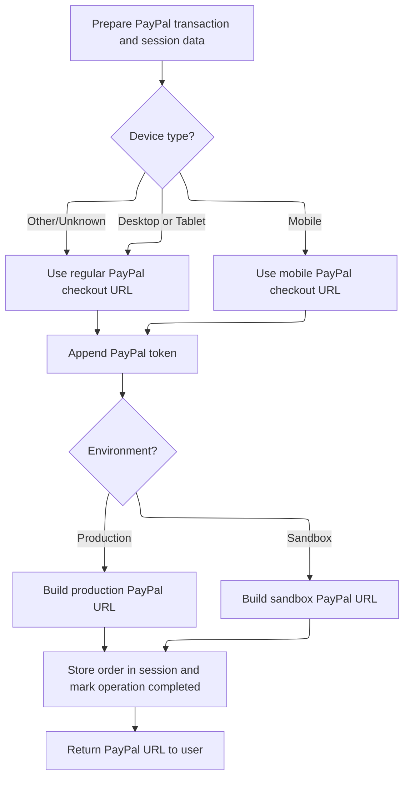

This document outlines the flow for validating a customer's order and cart, preparing payment details, and initiating a PayPal Express Checkout transaction. The customer is redirected to PayPal to complete payment, or receives validation errors if any issues are found.

# Starting the payment process

This section governs the rules for starting the payment process, including validating the shopping cart and order, handling validation errors, and initiating payment transactions with external providers such as PayPal.

| Category        | Rule Name                   | Description                                                                                                                                                               |
| --------------- | --------------------------- | ------------------------------------------------------------------------------------------------------------------------------------------------------------------------- |
| Data validation | Cart Session Validation     | If the shopping cart code is missing from the session, the payment process must not proceed and an error must be returned.                                                |
| Data validation | Order and Cart Validation   | If any validation errors are found in the order or cart, the payment process must stop immediately and all validation errors must be returned to the client.              |
| Business logic  | PayPal Payment Initiation   | If the payment action is 'INIT' and the payment method is 'PAYPAL', the system must initiate a PayPal Express Checkout transaction using the current order and cart data. |
| Business logic  | Order Total Calculation     | If an order total summary does not exist in the session, it must be calculated and stored before initiating payment.                                                      |
| Business logic  | Shipping Summary Attachment | If a shipping summary exists in the session, it must be attached to the order before payment initiation.                                                                  |

<SwmSnippet path="/shopizer/sm-shop/src/main/java/com/salesmanager/web/shop/controller/order/ShoppingOrderPaymentController.java" line="124">

---

We start by validating the cart and order, and bail out early if anything's wrong, returning validation errors to the client.

```java
	public @ResponseBody String paymentAction(@Valid @ModelAttribute(value="order") ShopOrder order, @PathVariable String action, @PathVariable String paymentmethod, Device device, HttpServletRequest request, HttpServletResponse response, Locale locale) throws Exception {
		
		
		
		Language language = (Language)request.getAttribute("LANGUAGE");
		MerchantStore store = (MerchantStore)request.getAttribute(Constants.MERCHANT_STORE);
		String shoppingCartCode  = getSessionAttribute(Constants.SHOPPING_CART, request);
		
		Validate.notNull(shoppingCartCode,"shoppingCartCode does not exist in the session");
		AjaxResponse ajaxResponse = new AjaxResponse();

		try {
			
			com.salesmanager.core.business.shoppingcart.model.ShoppingCart cart = shoppingCartFacade.getShoppingCartModel(shoppingCartCode, store);
			
			Set<ShoppingCartItem> items = cart.getLineItems();
			List<ShoppingCartItem> cartItems = new ArrayList<ShoppingCartItem>(items);
			order.setShoppingCartItems(cartItems);
			
			//validate order first
			Map<String,String> messages = new TreeMap<String,String>();
			orderFacade.validateOrder(order, new BeanPropertyBindingResult(order,"order"), messages, store, locale);
			
			if(CollectionUtils.isNotEmpty(messages.values())) {
				for(String key : messages.keySet()) {
					String value = messages.get(key);
					ajaxResponse.addValidationMessage(key, value);
				}
```

---

</SwmSnippet>

<SwmSnippet path="/shopizer/sm-shop/src/main/java/com/salesmanager/web/shop/controller/order/ShoppingOrderPaymentController.java" line="152">

---

Next, we check if we're supposed to start a PayPal payment (INIT action and PAYPAL method). We fetch payment config, integration module, and order totals, then call <SwmToken path="shopizer/sm-shop/src/main/java/com/salesmanager/web/shop/controller/order/ShoppingOrderPaymentController.java" pos="183:1:1" line-data="						PayPalExpressCheckoutPayment p = (PayPalExpressCheckoutPayment)module;">`PayPalExpressCheckoutPayment`</SwmToken> to kick off the PayPal transaction. This hands off the <SwmPath>[shopizer/…/common/cart/](shopizer/sm-shop/src/main/webapp/pages/shop/common/cart/)</SwmPath> data to the PayPal integration.

```java
				ajaxResponse.setStatus(AjaxResponse.RESPONSE_STATUS_VALIDATION_FAILED);
				return ajaxResponse.toJSONString();
			}
			
			
			IntegrationConfiguration config = paymentService.getPaymentConfiguration(order.getPaymentModule(), store);
			IntegrationModule integrationModule = paymentService.getPaymentMethodByCode(store, order.getPaymentModule());

			
			//OrderTotalSummary orderTotalSummary = orderFacade.calculateOrderTotal(store, order, language);
			OrderTotalSummary orderTotalSummary = super.getSessionAttribute(Constants.ORDER_SUMMARY, request);
			if(orderTotalSummary==null) {
				orderTotalSummary = orderFacade.calculateOrderTotal(store, order, language);
				super.setSessionAttribute(Constants.ORDER_SUMMARY, orderTotalSummary, request);
			}
			
			ShippingSummary summary = (ShippingSummary)request.getSession().getAttribute("SHIPPING_SUMMARY");

			if(summary!=null) {
				order.setShippingSummary(summary);
			}


			
			if(action.equals(INIT_ACTION)) {
				if(paymentmethod.equals("PAYPAL")) {
					try {
						

					
						PaymentModule module = paymentService.getPaymentModule("paypal-express-checkout");
						PayPalExpressCheckoutPayment p = (PayPalExpressCheckoutPayment)module;
						PaypalPayment payment = new PaypalPayment();
						payment.setCurrency(store.getCurrency());
						Transaction transaction = p.initPaypalTransaction(store, cartItems, orderTotalSummary, payment, config, integrationModule);
```

---

</SwmSnippet>

## Preparing PayPal transaction details

```mermaid
%%{init: {"flowchart": {"defaultRenderer": "elk"}} }%%
flowchart TD
    node1["Start PayPal Express Checkout transaction"] --> node2{"Payment action type?"}
    click node1 openCode "shopizer/sm-core/src/main/java/com/salesmanager/core/modules/integration/payment/impl/PayPalExpressCheckoutPayment.java:148:155"
    node2 -->|"Sale"| node3["Set payment action to Sale"]
    click node2 openCode "shopizer/sm-core/src/main/java/com/salesmanager/core/modules/integration/payment/impl/PayPalExpressCheckoutPayment.java:159:161"
    node2 -->|"Authorization"| node4["Set payment action to Authorization"]
    click node4 openCode "shopizer/sm-core/src/main/java/com/salesmanager/core/modules/integration/payment/impl/PayPalExpressCheckoutPayment.java:162:163"
    node3 --> node5["Prepare cart item details"]
    node4 --> node5
    subgraph loop1["For each cart item"]
        node5 --> node6["Add item details to PayPal request"]
        click node6 openCode "shopizer/sm-core/src/main/java/com/salesmanager/core/modules/integration/payment/impl/PayPalExpressCheckoutPayment.java:168:182"
    end
    node6 --> node7["Process order totals"]
    subgraph loop2["For each order total"]
        node7 --> node8{"Total type?"}
        click node8 openCode "shopizer/sm-core/src/main/java/com/salesmanager/core/modules/integration/payment/impl/PayPalExpressCheckoutPayment.java:187:212"
        node8 -->|"Shipping"| node9["Set shipping amount"]
        click node9 openCode "shopizer/sm-core/src/main/java/com/salesmanager/core/modules/integration/payment/impl/PayPalExpressCheckoutPayment.java:190:194"
        node8 -->|"Handling"| node10["Set handling amount"]
        click node10 openCode "shopizer/sm-core/src/main/java/com/salesmanager/core/modules/integration/payment/impl/PayPalExpressCheckoutPayment.java:198:202"
        node8 -->|"Tax"| node11["Add to tax total"]
        click node11 openCode "shopizer/sm-core/src/main/java/com/salesmanager/core/modules/integration/payment/impl/PayPalExpressCheckoutPayment.java:206:210"
    end
    node11 --> node12{"Is tax present?"}
    click node12 openCode "shopizer/sm-core/src/main/java/com/salesmanager/core/modules/integration/payment/impl/PayPalExpressCheckoutPayment.java:214:220"
    node12 -->|"Yes"| node13["Set tax amount"]
    click node13 openCode "shopizer/sm-core/src/main/java/com/salesmanager/core/modules/integration/payment/impl/PayPalExpressCheckoutPayment.java:215:219"
    node12 -->|"No"| node14["Continue"]
    node13 --> node15["Set item and order totals"]
    click node15 openCode "shopizer/sm-core/src/main/java/com/salesmanager/core/modules/integration/payment/impl/PayPalExpressCheckoutPayment.java:224:234"
    node14 --> node15
    node15 --> node16["Set PayPal return/cancel URLs (customer redirected after payment/cancel)"]
    click node16 openCode "shopizer/sm-core/src/main/java/com/salesmanager/core/modules/integration/payment/impl/PayPalExpressCheckoutPayment.java:238:250"
    node16 -->|"Prepare PayPal request"| node17{"PayPal environment?"}
    click node17 openCode "shopizer/sm-core/src/main/java/com/salesmanager/core/modules/integration/payment/impl/PayPalExpressCheckoutPayment.java:262:266"
    node17 -->|"Production"| node18["Set mode to production"]
    click node18 openCode "shopizer/sm-core/src/main/java/com/salesmanager/core/modules/integration/payment/impl/PayPalExpressCheckoutPayment.java:265:266"
    node17 -->|"Sandbox"| node19["Set mode to sandbox"]
    click node19 openCode "shopizer/sm-core/src/main/java/com/salesmanager/core/modules/integration/payment/impl/PayPalExpressCheckoutPayment.java:262:263"
    node18 --> node20["Send request to PayPal"]
    node19 --> node20
    click node20 openCode "shopizer/sm-core/src/main/java/com/salesmanager/core/modules/integration/payment/impl/PayPalExpressCheckoutPayment.java:274:275"
    node20 --> node21{"PayPal response success?"}
    click node21 openCode "shopizer/sm-core/src/main/java/com/salesmanager/core/modules/integration/payment/impl/PayPalExpressCheckoutPayment.java:281:284"
    node21 -->|"Yes"| node22["Create transaction with token and correlation ID"]
    click node22 openCode "shopizer/sm-core/src/main/java/com/salesmanager/core/modules/integration/payment/impl/PayPalExpressCheckoutPayment.java:286:293"
    node21 -->|"No"| node23["Throw integration exception"]
    click node23 openCode "shopizer/sm-core/src/main/java/com/salesmanager/core/modules/integration/payment/impl/PayPalExpressCheckoutPayment.java:283:284"
    node22 --> node24["Return transaction"]
    click node24 openCode "shopizer/sm-core/src/main/java/com/salesmanager/core/modules/integration/payment/impl/PayPalExpressCheckoutPayment.java:296:297"

classDef HeadingStyle fill:#777777,stroke:#333,stroke-width:2px;

%% Swimm:
%% %%{init: {"flowchart": {"defaultRenderer": "elk"}} }%%
%% flowchart TD
%%     node1["Start PayPal Express Checkout transaction"] --> node2{"Payment action type?"}
%%     click node1 openCode "<SwmPath>[shopizer/…/impl/PayPalExpressCheckoutPayment.java](shopizer/sm-core/src/main/java/com/salesmanager/core/modules/integration/payment/impl/PayPalExpressCheckoutPayment.java)</SwmPath>:148:155"
%%     node2 -->|"Sale"| node3["Set payment action to Sale"]
%%     click node2 openCode "<SwmPath>[shopizer/…/impl/PayPalExpressCheckoutPayment.java](shopizer/sm-core/src/main/java/com/salesmanager/core/modules/integration/payment/impl/PayPalExpressCheckoutPayment.java)</SwmPath>:159:161"
%%     node2 -->|"Authorization"| node4["Set payment action to Authorization"]
%%     click node4 openCode "<SwmPath>[shopizer/…/impl/PayPalExpressCheckoutPayment.java](shopizer/sm-core/src/main/java/com/salesmanager/core/modules/integration/payment/impl/PayPalExpressCheckoutPayment.java)</SwmPath>:162:163"
%%     node3 --> node5["Prepare cart item details"]
%%     node4 --> node5
%%     subgraph loop1["For each cart item"]
%%         node5 --> node6["Add item details to PayPal request"]
%%         click node6 openCode "<SwmPath>[shopizer/…/impl/PayPalExpressCheckoutPayment.java](shopizer/sm-core/src/main/java/com/salesmanager/core/modules/integration/payment/impl/PayPalExpressCheckoutPayment.java)</SwmPath>:168:182"
%%     end
%%     node6 --> node7["Process order totals"]
%%     subgraph loop2["For each order total"]
%%         node7 --> node8{"Total type?"}
%%         click node8 openCode "<SwmPath>[shopizer/…/impl/PayPalExpressCheckoutPayment.java](shopizer/sm-core/src/main/java/com/salesmanager/core/modules/integration/payment/impl/PayPalExpressCheckoutPayment.java)</SwmPath>:187:212"
%%         node8 -->|"Shipping"| node9["Set shipping amount"]
%%         click node9 openCode "<SwmPath>[shopizer/…/impl/PayPalExpressCheckoutPayment.java](shopizer/sm-core/src/main/java/com/salesmanager/core/modules/integration/payment/impl/PayPalExpressCheckoutPayment.java)</SwmPath>:190:194"
%%         node8 -->|"Handling"| node10["Set handling amount"]
%%         click node10 openCode "<SwmPath>[shopizer/…/impl/PayPalExpressCheckoutPayment.java](shopizer/sm-core/src/main/java/com/salesmanager/core/modules/integration/payment/impl/PayPalExpressCheckoutPayment.java)</SwmPath>:198:202"
%%         node8 -->|"Tax"| node11["Add to tax total"]
%%         click node11 openCode "<SwmPath>[shopizer/…/impl/PayPalExpressCheckoutPayment.java](shopizer/sm-core/src/main/java/com/salesmanager/core/modules/integration/payment/impl/PayPalExpressCheckoutPayment.java)</SwmPath>:206:210"
%%     end
%%     node11 --> node12{"Is tax present?"}
%%     click node12 openCode "<SwmPath>[shopizer/…/impl/PayPalExpressCheckoutPayment.java](shopizer/sm-core/src/main/java/com/salesmanager/core/modules/integration/payment/impl/PayPalExpressCheckoutPayment.java)</SwmPath>:214:220"
%%     node12 -->|"Yes"| node13["Set tax amount"]
%%     click node13 openCode "<SwmPath>[shopizer/…/impl/PayPalExpressCheckoutPayment.java](shopizer/sm-core/src/main/java/com/salesmanager/core/modules/integration/payment/impl/PayPalExpressCheckoutPayment.java)</SwmPath>:215:219"
%%     node12 -->|"No"| node14["Continue"]
%%     node13 --> node15["Set item and order totals"]
%%     click node15 openCode "<SwmPath>[shopizer/…/impl/PayPalExpressCheckoutPayment.java](shopizer/sm-core/src/main/java/com/salesmanager/core/modules/integration/payment/impl/PayPalExpressCheckoutPayment.java)</SwmPath>:224:234"
%%     node14 --> node15
%%     node15 --> node16["Set PayPal return/cancel URLs (customer redirected after payment/cancel)"]
%%     click node16 openCode "<SwmPath>[shopizer/…/impl/PayPalExpressCheckoutPayment.java](shopizer/sm-core/src/main/java/com/salesmanager/core/modules/integration/payment/impl/PayPalExpressCheckoutPayment.java)</SwmPath>:238:250"
%%     node16 -->|"Prepare PayPal request"| node17{"PayPal environment?"}
%%     click node17 openCode "<SwmPath>[shopizer/…/impl/PayPalExpressCheckoutPayment.java](shopizer/sm-core/src/main/java/com/salesmanager/core/modules/integration/payment/impl/PayPalExpressCheckoutPayment.java)</SwmPath>:262:266"
%%     node17 -->|"Production"| node18["Set mode to production"]
%%     click node18 openCode "<SwmPath>[shopizer/…/impl/PayPalExpressCheckoutPayment.java](shopizer/sm-core/src/main/java/com/salesmanager/core/modules/integration/payment/impl/PayPalExpressCheckoutPayment.java)</SwmPath>:265:266"
%%     node17 -->|"Sandbox"| node19["Set mode to sandbox"]
%%     click node19 openCode "<SwmPath>[shopizer/…/impl/PayPalExpressCheckoutPayment.java](shopizer/sm-core/src/main/java/com/salesmanager/core/modules/integration/payment/impl/PayPalExpressCheckoutPayment.java)</SwmPath>:262:263"
%%     node18 --> node20["Send request to PayPal"]
%%     node19 --> node20
%%     click node20 openCode "<SwmPath>[shopizer/…/impl/PayPalExpressCheckoutPayment.java](shopizer/sm-core/src/main/java/com/salesmanager/core/modules/integration/payment/impl/PayPalExpressCheckoutPayment.java)</SwmPath>:274:275"
%%     node20 --> node21{"PayPal response success?"}
%%     click node21 openCode "<SwmPath>[shopizer/…/impl/PayPalExpressCheckoutPayment.java](shopizer/sm-core/src/main/java/com/salesmanager/core/modules/integration/payment/impl/PayPalExpressCheckoutPayment.java)</SwmPath>:281:284"
%%     node21 -->|"Yes"| node22["Create transaction with token and correlation ID"]
%%     click node22 openCode "<SwmPath>[shopizer/…/impl/PayPalExpressCheckoutPayment.java](shopizer/sm-core/src/main/java/com/salesmanager/core/modules/integration/payment/impl/PayPalExpressCheckoutPayment.java)</SwmPath>:286:293"
%%     node21 -->|"No"| node23["Throw integration exception"]
%%     click node23 openCode "<SwmPath>[shopizer/…/impl/PayPalExpressCheckoutPayment.java](shopizer/sm-core/src/main/java/com/salesmanager/core/modules/integration/payment/impl/PayPalExpressCheckoutPayment.java)</SwmPath>:283:284"
%%     node22 --> node24["Return transaction"]
%%     click node24 openCode "<SwmPath>[shopizer/…/impl/PayPalExpressCheckoutPayment.java](shopizer/sm-core/src/main/java/com/salesmanager/core/modules/integration/payment/impl/PayPalExpressCheckoutPayment.java)</SwmPath>:296:297"
%% 
%% classDef HeadingStyle fill:#777777,stroke:#333,stroke-width:2px;
```



This section is responsible for assembling all necessary information to start a PayPal Express Checkout transaction, ensuring that the payment action, cart items, order totals, and PayPal environment are correctly set up before sending the request to PayPal.

| Category        | Rule Name                | Description                                                                                                                                                    |
| --------------- | ------------------------ | -------------------------------------------------------------------------------------------------------------------------------------------------------------- |
| Data validation | API credential provision | API credentials (username, password, signature) must be provided to PayPal for authentication before processing the transaction.                               |
| Business logic  | Payment action selection | The payment action for the PayPal transaction must be set to either 'Sale' or 'Authorization', based on the merchant's configuration.                          |
| Business logic  | Cart item inclusion      | Each item in the shopping cart must be included in the PayPal transaction request, with its name, quantity, and price accurately represented.                  |
| Business logic  | Order total breakdown    | Order totals for shipping, handling, and tax must be extracted from the order summary and included in the PayPal transaction request.                          |
| Business logic  | Tax inclusion            | If tax is present in the order summary, the total tax amount must be included in the PayPal transaction request.                                               |
| Business logic  | Total calculation        | The item total and order total must be set in the PayPal transaction request, reflecting the sum of all cart items and the final amount to be charged.         |
| Business logic  | Redirect URL setup       | Return and cancel URLs must be provided to PayPal, so customers are redirected appropriately after payment success or cancellation.                            |
| Business logic  | Environment selection    | The PayPal environment (sandbox or production) must be set according to the merchant's configuration, ensuring transactions are processed in the correct mode. |

<SwmSnippet path="/shopizer/sm-core/src/main/java/com/salesmanager/core/modules/integration/payment/impl/PayPalExpressCheckoutPayment.java" line="148">

---

In <SwmToken path="shopizer/sm-core/src/main/java/com/salesmanager/core/modules/integration/payment/impl/PayPalExpressCheckoutPayment.java" pos="148:5:5" line-data="	public Transaction initPaypalTransaction(MerchantStore store,">`initPaypalTransaction`</SwmToken>, we set up the PayPal payment action (SALE or AUTHORIZATION) based on config, then build a list of line items from the shopping cart, including quantity, name, and price for each. This prepares the detailed breakdown PayPal needs for the transaction.

```java
	public Transaction initPaypalTransaction(MerchantStore store,
			List<ShoppingCartItem> items, OrderTotalSummary summary, Payment payment,
			IntegrationConfiguration configuration, IntegrationModule module)
			throws IntegrationException {
		
		

		try {
			
			
			PaymentDetailsType paymentDetails = new PaymentDetailsType();
			if(configuration.getIntegrationKeys().get("transaction").equalsIgnoreCase(TransactionType.AUTHORIZECAPTURE.name())) {
				paymentDetails.setPaymentAction(urn.ebay.apis.eBLBaseComponents.PaymentActionCodeType.SALE);
			} else {
				paymentDetails.setPaymentAction(urn.ebay.apis.eBLBaseComponents.PaymentActionCodeType.AUTHORIZATION);
			}
			

			List<PaymentDetailsItemType> lineItems = new ArrayList<PaymentDetailsItemType>();
			
			for(ShoppingCartItem cartItem : items) {
			
				PaymentDetailsItemType item = new PaymentDetailsItemType();
				BasicAmountType amt = new BasicAmountType();
				amt.setCurrencyID(urn.ebay.apis.eBLBaseComponents.CurrencyCodeType.fromValue(payment.getCurrency().getCode()));
				amt.setValue(pricingService.getStringAmount(cartItem.getFinalPrice().getFinalPrice(), store));
				//itemsTotal = itemsTotal.add(cartItem.getSubTotal());
				int itemQuantity = cartItem.getQuantity();
				item.setQuantity(itemQuantity);
				item.setName(cartItem.getProduct().getProductDescription().getName());
				item.setAmount(amt);
				//System.out.println(pricingService.getStringAmount(cartItem.getSubTotal(), store));
				lineItems.add(item);
			
			}
```

---

</SwmSnippet>

<SwmSnippet path="/shopizer/sm-core/src/main/java/com/salesmanager/core/modules/integration/payment/impl/PayPalExpressCheckoutPayment.java" line="185">

---

We pull out shipping, handling, and tax from the order summary and format them for PayPal's API.

```java
			List<OrderTotal> orderTotals = summary.getTotals();
			BigDecimal tax = null;
			for(OrderTotal total : orderTotals) {
				
				if(total.getModule().equals(Constants.OT_SHIPPING_MODULE_CODE)) {
					BasicAmountType shipping = new BasicAmountType();
					shipping.setCurrencyID(urn.ebay.apis.eBLBaseComponents.CurrencyCodeType.fromValue(store.getCurrency().getCode()));
					shipping.setValue(pricingService.getStringAmount(total.getValue(), store));
					//System.out.println(pricingService.getStringAmount(total.getValue(), store));
					paymentDetails.setShippingTotal(shipping);
				}
				
				if(total.getModule().equals(Constants.OT_HANDLING_MODULE_CODE)) {
					BasicAmountType handling = new BasicAmountType();
					handling.setCurrencyID(urn.ebay.apis.eBLBaseComponents.CurrencyCodeType.fromValue(store.getCurrency().getCode()));
					handling.setValue(pricingService.getStringAmount(total.getValue(), store));
					//System.out.println(pricingService.getStringAmount(total.getValue(), store));
					paymentDetails.setHandlingTotal(handling);
				}
				
				if(total.getModule().equals(Constants.OT_TAX_MODULE_CODE)) {
					if(tax==null) {
						tax = new BigDecimal("0");
					}
					tax = tax.add(total.getValue());
				}
				
			}
```

---

</SwmSnippet>

<SwmSnippet path="/shopizer/sm-core/src/main/java/com/salesmanager/core/modules/integration/payment/impl/PayPalExpressCheckoutPayment.java" line="214">

---

Finally, we set item and order totals, build the PayPal return/cancel URLs, configure API credentials, and call PayPal's SetExpressCheckout. If successful, we create a Transaction object with the token and details, ready for the next step in the payment flow.

```java
			if(tax!=null) {
				BasicAmountType taxAmnt = new BasicAmountType();
				taxAmnt.setCurrencyID(urn.ebay.apis.eBLBaseComponents.CurrencyCodeType.fromValue(store.getCurrency().getCode()));
				taxAmnt.setValue(pricingService.getStringAmount(tax, store));
				//System.out.println(pricingService.getStringAmount(tax, store));
				paymentDetails.setTaxTotal(taxAmnt);
			}
			
			

			BasicAmountType itemTotal = new BasicAmountType();
			itemTotal.setCurrencyID(urn.ebay.apis.eBLBaseComponents.CurrencyCodeType.fromValue(store.getCurrency().getCode()));
			itemTotal.setValue(pricingService.getStringAmount(summary.getSubTotal(), store));
			paymentDetails.setItemTotal(itemTotal);
			
			paymentDetails.setPaymentDetailsItem(lineItems);
			BasicAmountType orderTotal = new BasicAmountType();
			orderTotal.setCurrencyID(urn.ebay.apis.eBLBaseComponents.CurrencyCodeType.fromValue(store.getCurrency().getCode()));
			orderTotal.setValue(pricingService.getStringAmount(summary.getTotal(), store));
			//System.out.println(pricingService.getStringAmount(itemsTotal, store));
			paymentDetails.setOrderTotal(orderTotal);
			List<PaymentDetailsType> paymentDetailsList = new ArrayList<PaymentDetailsType>();
			paymentDetailsList.add(paymentDetails);
			
			StringBuilder RETURN_URL = new StringBuilder().append(
					coreConfiguration.getProperty("ORDER_SCHEME", "http")).append("://")
					.append(store.getDomainName()).append("/")
					.append(coreConfiguration.getProperty("CONTEXT_PATH", "sm-shop"));
					


			SetExpressCheckoutRequestDetailsType setExpressCheckoutRequestDetails = new SetExpressCheckoutRequestDetailsType();
			String returnUrl = RETURN_URL.toString() + new StringBuilder().append(Constants.SHOP_URI).append("/paypal/checkout").append(coreConfiguration.getProperty("URL_EXTENSION", ".html")).append("/success").toString();
			String cancelUrl = RETURN_URL.toString() + new StringBuilder().append(Constants.SHOP_URI).append("/paypal/checkout").append(coreConfiguration.getProperty("URL_EXTENSION", ".html")).append("/cancel").toString();
			
			setExpressCheckoutRequestDetails.setReturnURL(returnUrl);
			setExpressCheckoutRequestDetails.setCancelURL(cancelUrl);

			
			setExpressCheckoutRequestDetails.setPaymentDetails(paymentDetailsList);

			SetExpressCheckoutRequestType setExpressCheckoutRequest = new SetExpressCheckoutRequestType(setExpressCheckoutRequestDetails);
			setExpressCheckoutRequest.setVersion("104.0");

			SetExpressCheckoutReq setExpressCheckoutReq = new SetExpressCheckoutReq();
			setExpressCheckoutReq.setSetExpressCheckoutRequest(setExpressCheckoutRequest);

			
			String mode = "sandbox";
			String env = configuration.getEnvironment();
			if(Constants.PRODUCTION_ENVIRONMENT.equals(env)) {
				mode = "production";
			}

			Map<String,String> configurationMap = new HashMap<String,String>();
			configurationMap.put("mode", mode);
			configurationMap.put("acct1.UserName", configuration.getIntegrationKeys().get("username"));
			configurationMap.put("acct1.Password", configuration.getIntegrationKeys().get("api"));
			configurationMap.put("acct1.Signature", configuration.getIntegrationKeys().get("signature"));
			
			PayPalAPIInterfaceServiceService service = new PayPalAPIInterfaceServiceService(configurationMap);
			SetExpressCheckoutResponseType setExpressCheckoutResponse = service.setExpressCheckout(setExpressCheckoutReq);
			
			String token = setExpressCheckoutResponse.getToken();
			String correlationID = setExpressCheckoutResponse.getCorrelationID();
			String ack = setExpressCheckoutResponse.getAck().getValue();
			
			if(!"Success".equals(ack)) {
				LOGGER.error("Wrong value from init transaction " + ack);
				throw new IntegrationException("Wrong paypal ack from init transaction " + ack);
			}
			
			Transaction transaction = new Transaction();
			transaction.setAmount(summary.getTotal());
			//transaction.setOrder(order);
			transaction.setTransactionDate(new Date());
			transaction.setTransactionType(TransactionType.INIT);
			transaction.setPaymentType(PaymentType.PAYPAL);
			transaction.getTransactionDetails().put("TOKEN", token);
			transaction.getTransactionDetails().put("CORRELATION", correlationID);
			

			return transaction;
			
			//redirect user to 
			//https://www.sandbox.paypal.com/cgi-bin/webscr?cmd=_express-checkout&token=EC-5LL13394G30048922
			
		} catch(Exception e) {
			e.printStackTrace();
			throw new IntegrationException(e);
		}
		
		
	}
```

---

</SwmSnippet>

## Redirecting to PayPal and finalizing session



<SwmSnippet path="/shopizer/sm-shop/src/main/java/com/salesmanager/web/shop/controller/order/ShoppingOrderPaymentController.java" line="187">

---

Back in <SwmToken path="shopizer/sm-shop/src/main/java/com/salesmanager/web/shop/controller/order/ShoppingOrderPaymentController.java" pos="124:8:8" line-data="	public @ResponseBody String paymentAction(@Valid @ModelAttribute(value=&quot;order&quot;) ShopOrder order, @PathVariable String action, @PathVariable String paymentmethod, Device device, HttpServletRequest request, HttpServletResponse response, Locale locale) throws Exception {">`paymentAction`</SwmToken>, after getting the Transaction from <SwmToken path="shopizer/sm-shop/src/main/java/com/salesmanager/web/shop/controller/order/ShoppingOrderPaymentController.java" pos="183:1:1" line-data="						PayPalExpressCheckoutPayment p = (PayPalExpressCheckoutPayment)module;">`PayPalExpressCheckoutPayment`</SwmToken>, we save it and the order in the session, build the PayPal redirect URL based on device and environment, and return it in the <SwmToken path="shopizer/sm-shop/src/main/java/com/salesmanager/web/shop/controller/order/ShoppingOrderPaymentController.java" pos="225:5:5" line-data="						ajaxResponse.setStatus(AjaxResponse.RESPONSE_OPERATION_COMPLETED);">`AjaxResponse`</SwmToken> for the client to use.

```java
						transactionService.create(transaction);
						
						super.setSessionAttribute(Constants.INIT_TRANSACTION_KEY, transaction, request);
						
						//https://www.paypal.com/cgi-bin/webscr?cmd=_express-checkout-mobile&token=tokenValueReturnedFromSetExpressCheckoutCall
						//For Desktop use
						//https://www.paypal.com/cgi-bin/webscr?cmd=_express-checkout&token=tokenValueReturnedFromSetExpressCheckoutCall
						
						StringBuilder urlAppender = new StringBuilder();
						
						if(device!=null) {
							if(device.isNormal()) {
								urlAppender.append(coreConfiguration.getProperty("PAYPAL_EXPRESSCHECKOUT_REGULAR"));
							}
							if(device.isTablet()) {
								urlAppender.append(coreConfiguration.getProperty("PAYPAL_EXPRESSCHECKOUT_REGULAR"));
							}
							if(device.isMobile()) {
								urlAppender.append(coreConfiguration.getProperty("PAYPAL_EXPRESSCHECKOUT_MOBILE"));
							}
						} else {
							urlAppender.append(coreConfiguration.getProperty("PAYPAL_EXPRESSCHECKOUT_REGULAR"));
						}
						
						urlAppender.append(transaction.getTransactionDetails().get("TOKEN"));
						
						
						
						if(config.getEnvironment().equals(com.salesmanager.core.constants.Constants.PRODUCTION_ENVIRONMENT)) {
							StringBuilder url = new StringBuilder().append(coreConfiguration.getProperty("PAYPAL_EXPRESSCHECKOUT_PRODUCTION")).append(urlAppender.toString());
							ajaxResponse.addEntry("url", url.toString());
						} else {
							StringBuilder url = new StringBuilder().append(coreConfiguration.getProperty("PAYPAL_EXPRESSCHECKOUT_SANDBOX")).append(urlAppender.toString());
							ajaxResponse.addEntry("url", url.toString());
						}

						//keep order in session when user comes back from pp
						super.setSessionAttribute(Constants.ORDER, order, request);
						ajaxResponse.setStatus(AjaxResponse.RESPONSE_OPERATION_COMPLETED);
					
					} catch(Exception e) {
						ajaxResponse.setStatus(AjaxResponse.RESPONSE_STATUS_FAIURE);
					}
							
					
				}
			}
		
		} catch(Exception e) {
			LOGGER.error("Error while performing payment action " + action + " for payment method " + paymentmethod ,e);
			ajaxResponse.setErrorMessage(e);
			ajaxResponse.setStatus(AjaxResponse.RESPONSE_STATUS_FAIURE);

		}
		
		return ajaxResponse.toJSONString();
	}
```

---

</SwmSnippet>

&nbsp;

*This is an auto-generated document by Swimm 🌊 and has not yet been verified by a human*

<SwmMeta version="3.0.0" repo-id="Z2l0aHViJTNBJTNBU2hvcGl6ZXIlM0ElM0F1bWFsaW5nYXN3YW1p" repo-name="Shopizer"><sup>Powered by [Swimm](https://app.swimm.io/)</sup></SwmMeta>
