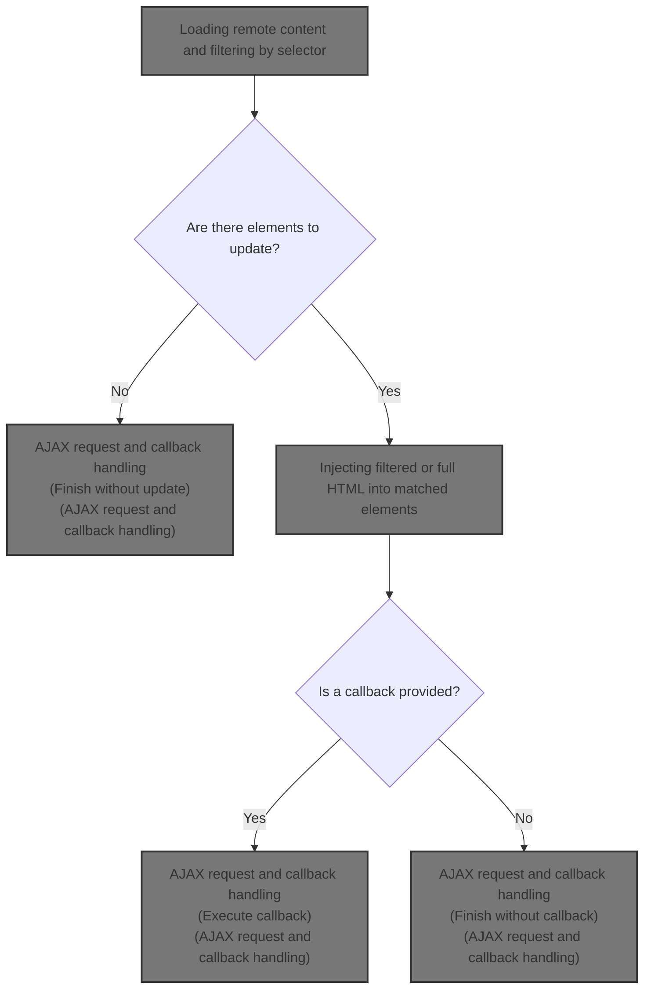
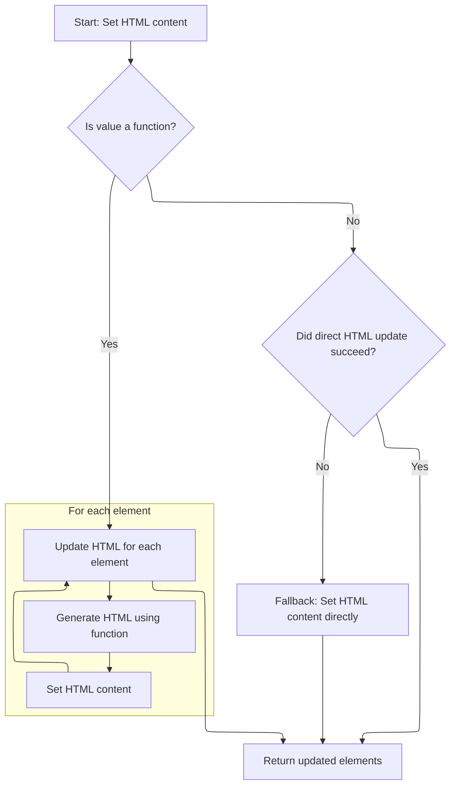
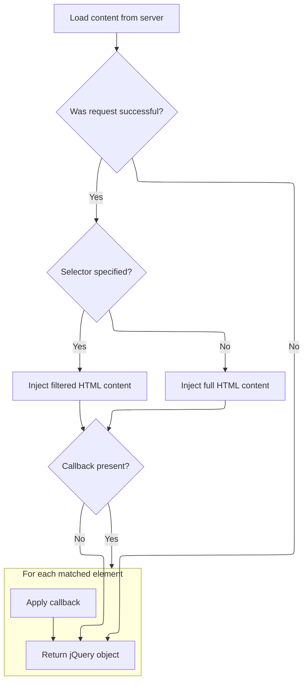

This document describes how remote HTML content is dynamically loaded and injected into page elements, enabling flexible UI updates in response to user actions or system events. The flow supports both full and filtered content injection, and allows for callback execution after the update.



# Loading remote content and filtering by selector

```mermaid
%%{init: {"flowchart": {"defaultRenderer": "elk"}} }%%
flowchart TD
  node1["Receive request to load content from remote URL"] --> node2{"Are there elements to update?"}
  click node1 openCode "shopizer/sm-shop/src/main/webapp/resources/js/bootstrap/jquery.js:6973:6980"
  node2 -->|"Yes"| node3["AJAX request and callback handling"]
  click node2 openCode "shopizer/sm-shop/src/main/webapp/resources/js/bootstrap/jquery.js:6981:7008"
  node2 -->|"No"| node6["Finish without updating page"]
  click node6 openCode "shopizer/sm-shop/src/main/webapp/resources/js/bootstrap/jquery.js:6978:6980"
  node3 --> node4{"Is a selector provided?"}
  
  node4 -->|"Yes"| node5["Manipulating the DOM and fragment creation"]
  
  node4 -->|"No"| node5["Manipulating the DOM and fragment creation"]
  
  node5 --> node6["Run callback if provided and finish"]
  click node6 openCode "shopizer/sm-shop/src/main/webapp/resources/js/bootstrap/jquery.js:7040:7042"

classDef HeadingStyle fill:#777777,stroke:#333,stroke-width:2px;
click node3 goToHeading "AJAX request and callback handling"
node3:::HeadingStyle
click node4 goToHeading "Injecting filtered or full HTML into matched elements"
node4:::HeadingStyle
click node5 goToHeading "Appending loaded content to DOM elements"
node5:::HeadingStyle
click node5 goToHeading "Setting inner HTML and cleaning up old data"
node5:::HeadingStyle
click node5 goToHeading "Manipulating the DOM and fragment creation"
node5:::HeadingStyle

%% Swimm:
%% %%{init: {"flowchart": {"defaultRenderer": "elk"}} }%%
%% flowchart TD
%%   node1["Receive request to load content from remote URL"] --> node2{"Are there elements to update?"}
%%   click node1 openCode "<SwmPath>[shopizer/…/bootstrap/jquery.js](shopizer/sm-shop/src/main/webapp/resources/js/bootstrap/jquery.js)</SwmPath>:6973:6980"
%%   node2 -->|"Yes"| node3["AJAX request and callback handling"]
%%   click node2 openCode "<SwmPath>[shopizer/…/bootstrap/jquery.js](shopizer/sm-shop/src/main/webapp/resources/js/bootstrap/jquery.js)</SwmPath>:6981:7008"
%%   node2 -->|"No"| node6["Finish without updating page"]
%%   click node6 openCode "<SwmPath>[shopizer/…/bootstrap/jquery.js](shopizer/sm-shop/src/main/webapp/resources/js/bootstrap/jquery.js)</SwmPath>:6978:6980"
%%   node3 --> node4{"Is a selector provided?"}
%%   
%%   node4 -->|"Yes"| node5["Manipulating the DOM and fragment creation"]
%%   
%%   node4 -->|"No"| node5["Manipulating the DOM and fragment creation"]
%%   
%%   node5 --> node6["Run callback if provided and finish"]
%%   click node6 openCode "<SwmPath>[shopizer/…/bootstrap/jquery.js](shopizer/sm-shop/src/main/webapp/resources/js/bootstrap/jquery.js)</SwmPath>:7040:7042"
%% 
%% classDef HeadingStyle fill:#777777,stroke:#333,stroke-width:<SwmToken path="shopizer/sm-shop/src/main/webapp/resources/js/bootstrap/jquery.js" pos="1470:10:10" line-data="		div.style.width = &quot;2px&quot;;">`2px`</SwmToken>;
%% click node3 goToHeading "AJAX request and callback handling"
%% node3:::HeadingStyle
%% click node4 goToHeading "Injecting filtered or full HTML into matched elements"
%% node4:::HeadingStyle
%% click node5 goToHeading "Appending loaded content to DOM elements"
%% node5:::HeadingStyle
%% click node5 goToHeading "Setting inner HTML and cleaning up old data"
%% node5:::HeadingStyle
%% click node5 goToHeading "Manipulating the DOM and fragment creation"
%% node5:::HeadingStyle
```



This section governs how remote HTML content is loaded and injected into page elements, including optional filtering by selector and handling of callbacks after content injection.

| Category        | Rule Name                          | Description                                                                                                                                                                          |
| --------------- | ---------------------------------- | ------------------------------------------------------------------------------------------------------------------------------------------------------------------------------------ |
| Data validation | Skip update when no elements       | If no DOM elements are matched for update, the content loading process is skipped and no changes are made to the page.                                                               |
| Business logic  | Selector-based filtering           | If the remote URL contains a space, the substring after the space is treated as a selector for filtering the loaded HTML content before injection.                                   |
| Business logic  | Request method selection           | The request method is determined by the type of parameters provided: if parameters are an object, a POST request is used; otherwise, a GET request is used.                          |
| Business logic  | Conditional content injection      | After loading the remote content, if a selector is provided, only the HTML matching the selector is injected into the target elements; otherwise, the full HTML content is injected. |
| Business logic  | Callback execution after injection | If a callback function is provided, it is executed after the content is injected into the DOM elements.                                                                              |

<SwmSnippet path="/shopizer/sm-shop/src/main/webapp/resources/js/bootstrap/jquery.js" line="6973">

---

In <SwmToken path="shopizer/sm-shop/src/main/webapp/resources/js/bootstrap/jquery.js" pos="6973:1:1" line-data="	load: function( url, params, callback ) {">`load`</SwmToken>, we start by checking if the URL contains a space, which signals that a selector is included. The function splits the URL and stores the selector for later filtering. It then decides on GET or POST based on the params type, and sets up the AJAX call. We need to call append next because, after loading the HTML, we want to inject it into the matched elements, possibly filtering by the selector if provided.

```javascript
	load: function( url, params, callback ) {
		if ( typeof url !== "string" && _load ) {
			return _load.apply( this, arguments );

		// Don't do a request if no elements are being requested
		} else if ( !this.length ) {
			return this;
		}

		var off = url.indexOf( " " );
		if ( off >= 0 ) {
			var selector = url.slice( off, url.length );
			url = url.slice( 0, off );
		}

		// Default to a GET request
		var type = "GET";

		// If the second parameter was provided
		if ( params ) {
			// If it's a function
			if ( jQuery.isFunction( params ) ) {
				// We assume that it's the callback
				callback = params;
				params = undefined;

			// Otherwise, build a param string
			} else if ( typeof params === "object" ) {
				params = jQuery.param( params, jQuery.ajaxSettings.traditional );
				type = "POST";
			}
		}

		var self = this;

		// Request the remote document
		jQuery.ajax({
			url: url,
			type: type,
			dataType: "html",
			data: params,
			// Complete callback (responseText is used internally)
			complete: function( jqXHR, status, responseText ) {
				// Store the response as specified by the jqXHR object
				responseText = jqXHR.responseText;
				// If successful, inject the HTML into all the matched elements
				if ( jqXHR.isResolved() ) {
					// #4825: Get the actual response in case
					// a dataFilter is present in ajaxSettings
					jqXHR.done(function( r ) {
						responseText = r;
					});
					// See if a selector was specified
					self.html( selector ?
						// Create a dummy div to hold the results
						jQuery("<div>")
							// inject the contents of the document in, removing the scripts
							// to avoid any 'Permission Denied' errors in IE
							.append(responseText.replace(rscript, ""))
```

---

</SwmSnippet>

## Appending loaded content to DOM elements

This section governs how new content is dynamically added to the web page by appending it to existing DOM elements, ensuring that the user interface updates in response to user actions or system events.

| Category        | Rule Name                  | Description                                                                                                                                                                                                                                                |
| --------------- | -------------------------- | ---------------------------------------------------------------------------------------------------------------------------------------------------------------------------------------------------------------------------------------------------------- |
| Data validation | Valid DOM Node Requirement | Only elements that are valid DOM nodes (<SwmToken path="shopizer/sm-shop/src/main/webapp/resources/js/bootstrap/jquery.js" pos="5748:7:7" line-data="			if ( this.nodeType === 1 ) {">`nodeType`</SwmToken> === 1) can have new content appended as children. |
| Business logic  | Append as Last Child       | Appended content must be inserted as the last child of the target DOM element, ensuring new content appears at the end of the element's content.                                                                                                           |

<SwmSnippet path="/shopizer/sm-shop/src/main/webapp/resources/js/bootstrap/jquery.js" line="5746">

---

<SwmToken path="shopizer/sm-shop/src/main/webapp/resources/js/bootstrap/jquery.js" pos="5746:1:1" line-data="	append: function() {">`append`</SwmToken> hands off to <SwmToken path="shopizer/sm-shop/src/main/webapp/resources/js/bootstrap/jquery.js" pos="5747:5:5" line-data="		return this.domManip(arguments, true, function( elem ) {">`domManip`</SwmToken>, which does the heavy lifting for DOM insertion.

```javascript
	append: function() {
		return this.domManip(arguments, true, function( elem ) {
			if ( this.nodeType === 1 ) {
				this.appendChild( elem );
			}
		});
	},
```

---

</SwmSnippet>

## Manipulating the DOM and fragment creation

```mermaid
%%{init: {"flowchart": {"defaultRenderer": "elk"}} }%%
flowchart TD
  node1["Start DOM manipulation"] --> node2{"Special cloning for checked elements needed?"}
  click node1 openCode "shopizer/sm-shop/src/main/webapp/resources/js/bootstrap/jquery.js:5908:5914"
  node2 -->|"Yes"| node3["Apply special cloning for checked elements"]
  click node2 openCode "shopizer/sm-shop/src/main/webapp/resources/js/bootstrap/jquery.js:5914:5918"
  node3 --> node15["Return collection"]
  click node3 openCode "shopizer/sm-shop/src/main/webapp/resources/js/bootstrap/jquery.js:5915:5918"
  node2 -->|"No"| node4{"Is value a function?"}
  click node4 openCode "shopizer/sm-shop/src/main/webapp/resources/js/bootstrap/jquery.js:5920:5926"
  subgraph loop1["For each element in collection"]
    node4 -->|"Yes"| node5["Generate dynamic content"]
    click node5 openCode "shopizer/sm-shop/src/main/webapp/resources/js/bootstrap/jquery.js:5921:5925"
    node5 --> node15["Return collection"]
    node4 -->|"No"| node6{"Is parent a document fragment?"}
    click node6 openCode "shopizer/sm-shop/src/main/webapp/resources/js/bootstrap/jquery.js:5928:5937"
    node6 -->|"Yes"| node7["Use parent fragment"]
    click node7 openCode "shopizer/sm-shop/src/main/webapp/resources/js/bootstrap/jquery.js:5932:5934"
    node6 -->|"No"| node8["Build new fragment"]
    click node8 openCode "shopizer/sm-shop/src/main/webapp/resources/js/bootstrap/jquery.js:5936:5937"
    node7 --> node9["Prepare fragment for manipulation"]
    node8 --> node9
    click node9 openCode "shopizer/sm-shop/src/main/webapp/resources/js/bootstrap/jquery.js:5939:5948"
    node9 --> node10{"Is element a table row?"}
    click node10 openCode "shopizer/sm-shop/src/main/webapp/resources/js/bootstrap/jquery.js:5948:5954"
    node10 -->|"Yes"| node11["Manipulate as table row"]
    click node11 openCode "shopizer/sm-shop/src/main/webapp/resources/js/bootstrap/jquery.js:5952:5954"
    node10 -->|"No"| node12["Manipulate as regular element"]
    click node12 openCode "shopizer/sm-shop/src/main/webapp/resources/js/bootstrap/jquery.js:5954:5958"
    node11 --> node13["Clone or use fragment"]
    node12 --> node13
    click node13 openCode "shopizer/sm-shop/src/main/webapp/resources/js/bootstrap/jquery.js:5962:5964"
    node13 --> node14{"Are there scripts to execute?"}
    click node14 openCode "shopizer/sm-shop/src/main/webapp/resources/js/bootstrap/jquery.js:5969:5971"
    node14 -->|"Yes"| node16["Execute scripts"]
    click node16 openCode "shopizer/sm-shop/src/main/webapp/resources/js/bootstrap/jquery.js:5970:5971"
    node14 -->|"No"| node15["Return collection"]
    node16 --> node15["Return collection"]
    click node15 openCode "shopizer/sm-shop/src/main/webapp/resources/js/bootstrap/jquery.js:5974:5975"
  end
classDef HeadingStyle fill:#777777,stroke:#333,stroke-width:2px;

%% Swimm:
%% %%{init: {"flowchart": {"defaultRenderer": "elk"}} }%%
%% flowchart TD
%%   node1["Start DOM manipulation"] --> node2{"Special cloning for checked elements needed?"}
%%   click node1 openCode "<SwmPath>[shopizer/…/bootstrap/jquery.js](shopizer/sm-shop/src/main/webapp/resources/js/bootstrap/jquery.js)</SwmPath>:5908:5914"
%%   node2 -->|"Yes"| node3["Apply special cloning for checked elements"]
%%   click node2 openCode "<SwmPath>[shopizer/…/bootstrap/jquery.js](shopizer/sm-shop/src/main/webapp/resources/js/bootstrap/jquery.js)</SwmPath>:5914:5918"
%%   node3 --> node15["Return collection"]
%%   click node3 openCode "<SwmPath>[shopizer/…/bootstrap/jquery.js](shopizer/sm-shop/src/main/webapp/resources/js/bootstrap/jquery.js)</SwmPath>:5915:5918"
%%   node2 -->|"No"| node4{"Is value a function?"}
%%   click node4 openCode "<SwmPath>[shopizer/…/bootstrap/jquery.js](shopizer/sm-shop/src/main/webapp/resources/js/bootstrap/jquery.js)</SwmPath>:5920:5926"
%%   subgraph loop1["For each element in collection"]
%%     node4 -->|"Yes"| node5["Generate dynamic content"]
%%     click node5 openCode "<SwmPath>[shopizer/…/bootstrap/jquery.js](shopizer/sm-shop/src/main/webapp/resources/js/bootstrap/jquery.js)</SwmPath>:5921:5925"
%%     node5 --> node15["Return collection"]
%%     node4 -->|"No"| node6{"Is parent a document fragment?"}
%%     click node6 openCode "<SwmPath>[shopizer/…/bootstrap/jquery.js](shopizer/sm-shop/src/main/webapp/resources/js/bootstrap/jquery.js)</SwmPath>:5928:5937"
%%     node6 -->|"Yes"| node7["Use parent fragment"]
%%     click node7 openCode "<SwmPath>[shopizer/…/bootstrap/jquery.js](shopizer/sm-shop/src/main/webapp/resources/js/bootstrap/jquery.js)</SwmPath>:5932:5934"
%%     node6 -->|"No"| node8["Build new fragment"]
%%     click node8 openCode "<SwmPath>[shopizer/…/bootstrap/jquery.js](shopizer/sm-shop/src/main/webapp/resources/js/bootstrap/jquery.js)</SwmPath>:5936:5937"
%%     node7 --> node9["Prepare fragment for manipulation"]
%%     node8 --> node9
%%     click node9 openCode "<SwmPath>[shopizer/…/bootstrap/jquery.js](shopizer/sm-shop/src/main/webapp/resources/js/bootstrap/jquery.js)</SwmPath>:5939:5948"
%%     node9 --> node10{"Is element a table row?"}
%%     click node10 openCode "<SwmPath>[shopizer/…/bootstrap/jquery.js](shopizer/sm-shop/src/main/webapp/resources/js/bootstrap/jquery.js)</SwmPath>:5948:5954"
%%     node10 -->|"Yes"| node11["Manipulate as table row"]
%%     click node11 openCode "<SwmPath>[shopizer/…/bootstrap/jquery.js](shopizer/sm-shop/src/main/webapp/resources/js/bootstrap/jquery.js)</SwmPath>:5952:5954"
%%     node10 -->|"No"| node12["Manipulate as regular element"]
%%     click node12 openCode "<SwmPath>[shopizer/…/bootstrap/jquery.js](shopizer/sm-shop/src/main/webapp/resources/js/bootstrap/jquery.js)</SwmPath>:5954:5958"
%%     node11 --> node13["Clone or use fragment"]
%%     node12 --> node13
%%     click node13 openCode "<SwmPath>[shopizer/…/bootstrap/jquery.js](shopizer/sm-shop/src/main/webapp/resources/js/bootstrap/jquery.js)</SwmPath>:5962:5964"
%%     node13 --> node14{"Are there scripts to execute?"}
%%     click node14 openCode "<SwmPath>[shopizer/…/bootstrap/jquery.js](shopizer/sm-shop/src/main/webapp/resources/js/bootstrap/jquery.js)</SwmPath>:5969:5971"
%%     node14 -->|"Yes"| node16["Execute scripts"]
%%     click node16 openCode "<SwmPath>[shopizer/…/bootstrap/jquery.js](shopizer/sm-shop/src/main/webapp/resources/js/bootstrap/jquery.js)</SwmPath>:5970:5971"
%%     node14 -->|"No"| node15["Return collection"]
%%     node16 --> node15["Return collection"]
%%     click node15 openCode "<SwmPath>[shopizer/…/bootstrap/jquery.js](shopizer/sm-shop/src/main/webapp/resources/js/bootstrap/jquery.js)</SwmPath>:5974:5975"
%%   end
%% classDef HeadingStyle fill:#777777,stroke:#333,stroke-width:<SwmToken path="shopizer/sm-shop/src/main/webapp/resources/js/bootstrap/jquery.js" pos="1470:10:10" line-data="		div.style.width = &quot;2px&quot;;">`2px`</SwmToken>;
```



This section governs how new HTML content is inserted into the DOM, ensuring that dynamic content, fragments, and scripts are handled correctly and efficiently, while maintaining browser compatibility and supporting method chaining.

| Category       | Rule Name                        | Description                                                                                                                                                                                                                                                                                                         |
| -------------- | -------------------------------- | ------------------------------------------------------------------------------------------------------------------------------------------------------------------------------------------------------------------------------------------------------------------------------------------------------------------- |
| Business logic | Checked Element Preservation     | If the content to be inserted contains checked elements and the browser does not support cloning checked states, a special handling process must be applied to ensure checked states are preserved.                                                                                                                 |
| Business logic | Dynamic Content Generation       | If the value to be inserted is a function, the function must be called for each element in the collection, allowing for dynamic content generation based on the element's context or index.                                                                                                                         |
| Business logic | Fragment Reuse                   | If the parent node is a document fragment and matches the collection length, the existing fragment must be reused instead of creating a new one.                                                                                                                                                                    |
| Business logic | Fragment Caching Eligibility     | Only small HTML strings (less than 512 characters) associated with the main document and not containing certain elements or attributes are eligible for fragment caching.                                                                                                                                           |
| Business logic | Table Row Handling               | When inserting table rows, the content must be handled as a table row to ensure correct DOM structure and rendering.                                                                                                                                                                                                |
| Business logic | Script Execution After Insertion | If the fragment contains scripts, those scripts must be executed after insertion to ensure dynamic behaviors are applied.                                                                                                                                                                                           |
| Business logic | Chaining Support                 | After all manipulations, the method must return the <SwmToken path="shopizer/sm-shop/src/main/webapp/resources/js/bootstrap/jquery.js" pos="5837:2:2" line-data="			(jQuery.support.leadingWhitespace \|\| !rleadingWhitespace.test( value )) &amp;&amp;">`jQuery`</SwmToken> object to allow further method chaining. |

<SwmSnippet path="/shopizer/sm-shop/src/main/webapp/resources/js/bootstrap/jquery.js" line="5908">

---

In <SwmToken path="shopizer/sm-shop/src/main/webapp/resources/js/bootstrap/jquery.js" pos="5908:1:1" line-data="	domManip: function( args, table, callback ) {">`domManip`</SwmToken>, we check if the value is a function and handle it per element. If not, we move on to fragment creation. <SwmToken path="shopizer/sm-shop/src/main/webapp/resources/js/bootstrap/jquery.js" pos="5936:7:7" line-data="				results = jQuery.buildFragment( args, this, scripts );">`buildFragment`</SwmToken> is called next to generate a document fragment from the input, handling caching and browser quirks, so we can safely insert the content.

```javascript
	domManip: function( args, table, callback ) {
		var results, first, fragment, parent,
			value = args[0],
			scripts = [];

		// We can't cloneNode fragments that contain checked, in WebKit
		if ( !jQuery.support.checkClone && arguments.length === 3 && typeof value === "string" && rchecked.test( value ) ) {
			return this.each(function() {
				jQuery(this).domManip( args, table, callback, true );
			});
		}

		if ( jQuery.isFunction(value) ) {
			return this.each(function(i) {
				var self = jQuery(this);
				args[0] = value.call(this, i, table ? self.html() : undefined);
				self.domManip( args, table, callback );
			});
		}

		if ( this[0] ) {
			parent = value && value.parentNode;

			// If we're in a fragment, just use that instead of building a new one
			if ( jQuery.support.parentNode && parent && parent.nodeType === 11 && parent.childNodes.length === this.length ) {
				results = { fragment: parent };

			} else {
				results = jQuery.buildFragment( args, this, scripts );
			}

```

---

</SwmSnippet>

<SwmSnippet path="/shopizer/sm-shop/src/main/webapp/resources/js/bootstrap/jquery.js" line="6071">

---

<SwmToken path="shopizer/sm-shop/src/main/webapp/resources/js/bootstrap/jquery.js" pos="6071:2:2" line-data="jQuery.buildFragment = function( args, nodes, scripts ) {">`buildFragment`</SwmToken> figures out the right document context, checks if the input is a small, cacheable HTML string, and either reuses a cached fragment or creates a new one. It handles browser quirks using feature flags and regexes, then cleans and returns the fragment for DOM insertion.

```javascript
jQuery.buildFragment = function( args, nodes, scripts ) {
	var fragment, cacheable, cacheresults, doc,
	first = args[ 0 ];

	// nodes may contain either an explicit document object,
	// a jQuery collection or context object.
	// If nodes[0] contains a valid object to assign to doc
	if ( nodes && nodes[0] ) {
		doc = nodes[0].ownerDocument || nodes[0];
	}

	// Ensure that an attr object doesn't incorrectly stand in as a document object
	// Chrome and Firefox seem to allow this to occur and will throw exception
	// Fixes #8950
	if ( !doc.createDocumentFragment ) {
		doc = document;
	}

	// Only cache "small" (1/2 KB) HTML strings that are associated with the main document
	// Cloning options loses the selected state, so don't cache them
	// IE 6 doesn't like it when you put <object> or <embed> elements in a fragment
	// Also, WebKit does not clone 'checked' attributes on cloneNode, so don't cache
	// Lastly, IE6,7,8 will not correctly reuse cached fragments that were created from unknown elems #10501
	if ( args.length === 1 && typeof first === "string" && first.length < 512 && doc === document &&
		first.charAt(0) === "<" && !rnocache.test( first ) &&
		(jQuery.support.checkClone || !rchecked.test( first )) &&
		(jQuery.support.html5Clone || !rnoshimcache.test( first )) ) {

		cacheable = true;

		cacheresults = jQuery.fragments[ first ];
		if ( cacheresults && cacheresults !== 1 ) {
			fragment = cacheresults;
		}
	}

	if ( !fragment ) {
		fragment = doc.createDocumentFragment();
		jQuery.clean( args, doc, fragment, scripts );
	}

	if ( cacheable ) {
		jQuery.fragments[ first ] = cacheresults ? fragment : 1;
	}

	return { fragment: fragment, cacheable: cacheable };
};
```

---

</SwmSnippet>

<SwmSnippet path="/shopizer/sm-shop/src/main/webapp/resources/js/bootstrap/jquery.js" line="5939">

---

DomManip inserts the fragment into each element, cloning as needed to avoid leaks.

```javascript
			fragment = results.fragment;

			if ( fragment.childNodes.length === 1 ) {
				first = fragment = fragment.firstChild;
			} else {
				first = fragment.firstChild;
			}

			if ( first ) {
				table = table && jQuery.nodeName( first, "tr" );

				for ( var i = 0, l = this.length, lastIndex = l - 1; i < l; i++ ) {
					callback.call(
						table ?
							root(this[i], first) :
							this[i],
						// Make sure that we do not leak memory by inadvertently discarding
						// the original fragment (which might have attached data) instead of
						// using it; in addition, use the original fragment object for the last
						// item instead of first because it can end up being emptied incorrectly
						// in certain situations (Bug #8070).
						// Fragments from the fragment cache must always be cloned and never used
						// in place.
						results.cacheable || ( l > 1 && i < lastIndex ) ?
							jQuery.clone( fragment, true, true ) :
							fragment
					);
				}
```

---

</SwmSnippet>

<SwmSnippet path="/shopizer/sm-shop/src/main/webapp/resources/js/bootstrap/jquery.js" line="5969">

---

After inserting the fragment and running any scripts, <SwmToken path="shopizer/sm-shop/src/main/webapp/resources/js/bootstrap/jquery.js" pos="5747:5:5" line-data="		return this.domManip(arguments, true, function( elem ) {">`domManip`</SwmToken> returns the <SwmToken path="shopizer/sm-shop/src/main/webapp/resources/js/bootstrap/jquery.js" pos="5970:1:1" line-data="				jQuery.each( scripts, evalScript );">`jQuery`</SwmToken> object so you can keep chaining methods.

```javascript
			if ( scripts.length ) {
				jQuery.each( scripts, evalScript );
			}
		}

		return this;
	}
```

---

</SwmSnippet>

## Injecting filtered or full HTML into matched elements

<SwmSnippet path="/shopizer/sm-shop/src/main/webapp/resources/js/bootstrap/jquery.js" line="7026">

---

After returning from append, load uses html to inject the loaded content. If a selector was specified, it wraps the HTML in a dummy div, strips scripts, and finds the matching elements before injecting. If not, it just injects the whole response.

```javascript
					self.html( selector ?
						// Create a dummy div to hold the results
						jQuery("<div>")
							// inject the contents of the document in, removing the scripts
							// to avoid any 'Permission Denied' errors in IE
							.append(responseText.replace(rscript, ""))

							// Locate the specified elements
							.find(selector) :

						// If not, just inject the full result
						responseText );
```

---

</SwmSnippet>

## Setting inner HTML and cleaning up old data

This section ensures that when the inner HTML of an element is set, any previously attached data or event handlers on child elements are removed to prevent memory leaks and unintended behaviors.

<SwmSnippet path="/shopizer/sm-shop/src/main/webapp/resources/js/bootstrap/jquery.js" line="5829">

---

In html, before setting new <SwmToken path="shopizer/sm-shop/src/main/webapp/resources/js/bootstrap/jquery.js" pos="5832:6:6" line-data="				this[0].innerHTML.replace(rinlinejQuery, &quot;&quot;) :">`innerHTML`</SwmToken>, we call <SwmToken path="shopizer/sm-shop/src/main/webapp/resources/js/bootstrap/jquery.js" pos="5846:3:3" line-data="						jQuery.cleanData( this[i].getElementsByTagName(&quot;*&quot;) );">`cleanData`</SwmToken> on all child elements to clear out any attached events or data. This keeps things tidy and avoids leaks.

```javascript
	html: function( value ) {
		if ( value === undefined ) {
			return this[0] && this[0].nodeType === 1 ?
				this[0].innerHTML.replace(rinlinejQuery, "") :
				null;

		// See if we can take a shortcut and just use innerHTML
		} else if ( typeof value === "string" && !rnoInnerhtml.test( value ) &&
			(jQuery.support.leadingWhitespace || !rleadingWhitespace.test( value )) &&
			!wrapMap[ (rtagName.exec( value ) || ["", ""])[1].toLowerCase() ] ) {

			value = value.replace(rxhtmlTag, "<$1></$2>");

			try {
				for ( var i = 0, l = this.length; i < l; i++ ) {
					// Remove element nodes and prevent memory leaks
					if ( this[i].nodeType === 1 ) {
						jQuery.cleanData( this[i].getElementsByTagName("*") );
						this[i].innerHTML = value;
					}
				}

```

---

</SwmSnippet>

### Removing event handlers and data from child elements

This section governs the removal of event handlers and associated data from child elements within the application. The main product role is to ensure that when elements are removed or updated, any attached event handlers and stored data are also cleared to prevent unintended behavior and memory leaks.

| Category       | Rule Name                         | Description                                                                                                                                                                                       |
| -------------- | --------------------------------- | ------------------------------------------------------------------------------------------------------------------------------------------------------------------------------------------------- |
| Business logic | Remove event handlers on deletion | All event handlers attached to child elements must be removed when those elements are deleted or replaced, to prevent unintended actions from occurring after the elements are no longer present. |
| Business logic | Clear element data on removal     | Any data stored on child elements, such as custom attributes or metadata, must be cleared when those elements are removed from the application to avoid data leakage or corruption.               |

See <SwmLink doc-title="Cleaning Up DOM Elements and Calendar Events">[Cleaning Up DOM Elements and Calendar Events](.swm%5Ccleaning-up-dom-elements-and-calendar-events.6vk9xu7p.sw.md)</SwmLink>

### Fallbacks and chaining after HTML update



<SwmSnippet path="/shopizer/sm-shop/src/main/webapp/resources/js/bootstrap/jquery.js" line="5851">

---

After <SwmToken path="shopizer/sm-shop/src/main/webapp/resources/js/bootstrap/jquery.js" pos="5846:3:3" line-data="						jQuery.cleanData( this[i].getElementsByTagName(&quot;*&quot;) );">`cleanData`</SwmToken>, html tries to set <SwmToken path="shopizer/sm-shop/src/main/webapp/resources/js/bootstrap/jquery.js" pos="5851:7:7" line-data="			// If using innerHTML throws an exception, use the fallback method">`innerHTML`</SwmToken>. If that fails, it empties the element and appends the value. It also supports function values and always returns the <SwmToken path="shopizer/sm-shop/src/main/webapp/resources/js/bootstrap/jquery.js" pos="5856:9:9" line-data="		} else if ( jQuery.isFunction( value ) ) {">`jQuery`</SwmToken> object for chaining.

```javascript
			// If using innerHTML throws an exception, use the fallback method
			} catch(e) {
				this.empty().append( value );
			}

		} else if ( jQuery.isFunction( value ) ) {
			this.each(function(i){
				var self = jQuery( this );

				self.html( value.call(this, i, self.html()) );
			});

		} else {
			this.empty().append( value );
		}

		return this;
	},
```

---

</SwmSnippet>

## AJAX request and callback handling



<SwmSnippet path="/shopizer/sm-shop/src/main/webapp/resources/js/bootstrap/jquery.js" line="7009">

---

After html updates the DOM, load relies on ajax to fetch the remote content and trigger the callback once the response is processed and injected.

```javascript
		jQuery.ajax({
			url: url,
			type: type,
			dataType: "html",
			data: params,
			// Complete callback (responseText is used internally)
			complete: function( jqXHR, status, responseText ) {
				// Store the response as specified by the jqXHR object
				responseText = jqXHR.responseText;
				// If successful, inject the HTML into all the matched elements
				if ( jqXHR.isResolved() ) {
					// #4825: Get the actual response in case
					// a dataFilter is present in ajaxSettings
					jqXHR.done(function( r ) {
						responseText = r;
					});
					// See if a selector was specified
					self.html( selector ?
						// Create a dummy div to hold the results
						jQuery("<div>")
							// inject the contents of the document in, removing the scripts
							// to avoid any 'Permission Denied' errors in IE
							.append(responseText.replace(rscript, ""))

							// Locate the specified elements
							.find(selector) :

						// If not, just inject the full result
						responseText );
				}

				if ( callback ) {
					self.each( callback, [ responseText, status, jqXHR ] );
				}
			}
		});

		return this;
	},
```

---

</SwmSnippet>

# AJAX request setup and state management

```mermaid
%%{init: {"flowchart": {"defaultRenderer": "elk"}} }%%
flowchart TD
  node1["Start AJAX request"] --> node2{"Is input a URL or options object?"}
  click node1 openCode "shopizer/sm-shop/src/main/webapp/resources/js/bootstrap/jquery.js:7198:7200"
  node2 -->|"Options object"| node3["Use options object"]
  click node2 openCode "shopizer/sm-shop/src/main/webapp/resources/js/bootstrap/jquery.js:7201:7204"
  node2 -->|"URL"| node3
  node3 --> node4["Configure request (headers, callbacks, options)"]
  click node3 openCode "shopizer/sm-shop/src/main/webapp/resources/js/bootstrap/jquery.js:7205:7531"
  subgraph loop1["For each header and callback type"]
    node4 --> node5["Set request header"]
    click node5 openCode "shopizer/sm-shop/src/main/webapp/resources/js/bootstrap/jquery.js:7527:7531"
    node5 --> node6["Install callback (success, error, complete)"]
    click node6 openCode "shopizer/sm-shop/src/main/webapp/resources/js/bootstrap/jquery.js:7541:7543"
    node6 --> node4
  end
  node4 --> node7{"Should request be aborted before sending?"}
  click node7 openCode "shopizer/sm-shop/src/main/webapp/resources/js/bootstrap/jquery.js:7533:7538"
  node7 -->|"Yes"| node8["Abort request"]
  click node8 openCode "shopizer/sm-shop/src/main/webapp/resources/js/bootstrap/jquery.js:7535:7536"
  node7 -->|"No"| node9{"Is transport available?"}
  click node9 openCode "shopizer/sm-shop/src/main/webapp/resources/js/bootstrap/jquery.js:7545:7549"
  node9 -->|"No"| node10["Fail with 'No Transport'"]
  click node10 openCode "shopizer/sm-shop/src/main/webapp/resources/js/bootstrap/jquery.js:7550:7551"
  node9 -->|"Yes"| node11["Send request"]
  click node11 openCode "shopizer/sm-shop/src/main/webapp/resources/js/bootstrap/jquery.js:7552:7576"
  node11 --> node12{"Did request succeed?"}
  click node12 openCode "shopizer/sm-shop/src/main/webapp/resources/js/bootstrap/jquery.js:7301:7409"
  node12 -->|"Success"| node13["Trigger success callbacks"]
  click node13 openCode "shopizer/sm-shop/src/main/webapp/resources/js/bootstrap/jquery.js:7384:7385"
  node12 -->|"Error"| node14["Trigger error callbacks"]
  click node14 openCode "shopizer/sm-shop/src/main/webapp/resources/js/bootstrap/jquery.js:7386:7387"
  node13 --> node15["Trigger complete callbacks"]
  click node15 openCode "shopizer/sm-shop/src/main/webapp/resources/js/bootstrap/jquery.js:7399:7401"
  node14 --> node15
  node10 --> node15
  node8 --> node15
  node15 --> node16["Return jqXHR object"]
  click node16 openCode "shopizer/sm-shop/src/main/webapp/resources/js/bootstrap/jquery.js:7578:7579"

classDef HeadingStyle fill:#777777,stroke:#333,stroke-width:2px;

%% Swimm:
%% %%{init: {"flowchart": {"defaultRenderer": "elk"}} }%%
%% flowchart TD
%%   node1["Start AJAX request"] --> node2{"Is input a URL or options object?"}
%%   click node1 openCode "<SwmPath>[shopizer/…/bootstrap/jquery.js](shopizer/sm-shop/src/main/webapp/resources/js/bootstrap/jquery.js)</SwmPath>:7198:7200"
%%   node2 -->|"Options object"| node3["Use options object"]
%%   click node2 openCode "<SwmPath>[shopizer/…/bootstrap/jquery.js](shopizer/sm-shop/src/main/webapp/resources/js/bootstrap/jquery.js)</SwmPath>:7201:7204"
%%   node2 -->|"URL"| node3
%%   node3 --> node4["Configure request (headers, callbacks, options)"]
%%   click node3 openCode "<SwmPath>[shopizer/…/bootstrap/jquery.js](shopizer/sm-shop/src/main/webapp/resources/js/bootstrap/jquery.js)</SwmPath>:7205:7531"
%%   subgraph loop1["For each header and callback type"]
%%     node4 --> node5["Set request header"]
%%     click node5 openCode "<SwmPath>[shopizer/…/bootstrap/jquery.js](shopizer/sm-shop/src/main/webapp/resources/js/bootstrap/jquery.js)</SwmPath>:7527:7531"
%%     node5 --> node6["Install callback (success, error, complete)"]
%%     click node6 openCode "<SwmPath>[shopizer/…/bootstrap/jquery.js](shopizer/sm-shop/src/main/webapp/resources/js/bootstrap/jquery.js)</SwmPath>:7541:7543"
%%     node6 --> node4
%%   end
%%   node4 --> node7{"Should request be aborted before sending?"}
%%   click node7 openCode "<SwmPath>[shopizer/…/bootstrap/jquery.js](shopizer/sm-shop/src/main/webapp/resources/js/bootstrap/jquery.js)</SwmPath>:7533:7538"
%%   node7 -->|"Yes"| node8["Abort request"]
%%   click node8 openCode "<SwmPath>[shopizer/…/bootstrap/jquery.js](shopizer/sm-shop/src/main/webapp/resources/js/bootstrap/jquery.js)</SwmPath>:7535:7536"
%%   node7 -->|"No"| node9{"Is transport available?"}
%%   click node9 openCode "<SwmPath>[shopizer/…/bootstrap/jquery.js](shopizer/sm-shop/src/main/webapp/resources/js/bootstrap/jquery.js)</SwmPath>:7545:7549"
%%   node9 -->|"No"| node10["Fail with 'No Transport'"]
%%   click node10 openCode "<SwmPath>[shopizer/…/bootstrap/jquery.js](shopizer/sm-shop/src/main/webapp/resources/js/bootstrap/jquery.js)</SwmPath>:7550:7551"
%%   node9 -->|"Yes"| node11["Send request"]
%%   click node11 openCode "<SwmPath>[shopizer/…/bootstrap/jquery.js](shopizer/sm-shop/src/main/webapp/resources/js/bootstrap/jquery.js)</SwmPath>:7552:7576"
%%   node11 --> node12{"Did request succeed?"}
%%   click node12 openCode "<SwmPath>[shopizer/…/bootstrap/jquery.js](shopizer/sm-shop/src/main/webapp/resources/js/bootstrap/jquery.js)</SwmPath>:7301:7409"
%%   node12 -->|"Success"| node13["Trigger success callbacks"]
%%   click node13 openCode "<SwmPath>[shopizer/…/bootstrap/jquery.js](shopizer/sm-shop/src/main/webapp/resources/js/bootstrap/jquery.js)</SwmPath>:7384:7385"
%%   node12 -->|"Error"| node14["Trigger error callbacks"]
%%   click node14 openCode "<SwmPath>[shopizer/…/bootstrap/jquery.js](shopizer/sm-shop/src/main/webapp/resources/js/bootstrap/jquery.js)</SwmPath>:7386:7387"
%%   node13 --> node15["Trigger complete callbacks"]
%%   click node15 openCode "<SwmPath>[shopizer/…/bootstrap/jquery.js](shopizer/sm-shop/src/main/webapp/resources/js/bootstrap/jquery.js)</SwmPath>:7399:7401"
%%   node14 --> node15
%%   node10 --> node15
%%   node8 --> node15
%%   node15 --> node16["Return <SwmToken path="shopizer/sm-shop/src/main/webapp/resources/js/bootstrap/jquery.js" pos="7015:7:7" line-data="			complete: function( jqXHR, status, responseText ) {">`jqXHR`</SwmToken> object"]
%%   click node16 openCode "<SwmPath>[shopizer/…/bootstrap/jquery.js](shopizer/sm-shop/src/main/webapp/resources/js/bootstrap/jquery.js)</SwmPath>:7578:7579"
%% 
%% classDef HeadingStyle fill:#777777,stroke:#333,stroke-width:<SwmToken path="shopizer/sm-shop/src/main/webapp/resources/js/bootstrap/jquery.js" pos="1470:10:10" line-data="		div.style.width = &quot;2px&quot;;">`2px`</SwmToken>;
```



This section governs the rules for initializing, configuring, and managing AJAX requests, ensuring consistent behavior for request setup, state management, and event handling throughout the Shopizer application.

| Category        | Rule Name                      | Description                                                                                                                                                                                                                                                                                                                                                                                                                                                                                                                                                                                                                                                                                                                                                                                                                                                                                                                |
| --------------- | ------------------------------ | -------------------------------------------------------------------------------------------------------------------------------------------------------------------------------------------------------------------------------------------------------------------------------------------------------------------------------------------------------------------------------------------------------------------------------------------------------------------------------------------------------------------------------------------------------------------------------------------------------------------------------------------------------------------------------------------------------------------------------------------------------------------------------------------------------------------------------------------------------------------------------------------------------------------------- |
| Data validation | Pre-send cancellation          | Before sending the request, the <SwmToken path="shopizer/sm-shop/src/main/webapp/resources/js/bootstrap/jquery.js" pos="7533:7:7" line-data="		if ( s.beforeSend &amp;&amp; ( s.beforeSend.call( callbackContext, jqXHR, s ) === false \|\| state === 2 ) ) {">`beforeSend`</SwmToken> callback may cancel the request if it returns false.                                                                                                                                                                                                                                                                                                                                                                                                                                                                                                                                                                                  |
| Business logic  | Legacy signature normalization | If the input to the AJAX function is an object, treat it as the options object and ignore the URL parameter.                                                                                                                                                                                                                                                                                                                                                                                                                                                                                                                                                                                                                                                                                                                                                                                                               |
| Business logic  | Header configuration           | All AJAX requests must be configured with the appropriate headers, including <SwmToken path="shopizer/sm-shop/src/main/webapp/resources/js/bootstrap/jquery.js" pos="7505:7:9" line-data="			jqXHR.setRequestHeader( &quot;Content-Type&quot;, s.contentType );">`Content-Type`</SwmToken> and Accept, based on the request type and expected response format.                                                                                                                                                                                                                                                                                                                                                                                                                                                                                                                                                                |
| Business logic  | Callback triggering            | Success, error, and complete callbacks must be triggered according to the outcome of the request.                                                                                                                                                                                                                                                                                                                                                                                                                                                                                                                                                                                                                                                                                                                                                                                                                          |
| Business logic  | Chained callback support       | The <SwmToken path="shopizer/sm-shop/src/main/webapp/resources/js/bootstrap/jquery.js" pos="7015:7:7" line-data="			complete: function( jqXHR, status, responseText ) {">`jqXHR`</SwmToken> object returned from the AJAX request must support chaining of success, error, and complete callbacks.                                                                                                                                                                                                                                                                                                                                                                                                                                                                                                                                                                                                                            |
| Business logic  | Anti-cache enforcement         | If the cache option is set to false, an <SwmToken path="shopizer/sm-shop/src/main/webapp/resources/js/bootstrap/jquery.js" pos="7488:13:15" line-data="			// Get ifModifiedKey before adding the anti-cache parameter">`anti-cache`</SwmToken> parameter must be added to the request URL to prevent cached responses.                                                                                                                                                                                                                                                                                                                                                                                                                                                                                                                                                                                                        |
| Business logic  | Conditional request support    | If the <SwmToken path="shopizer/sm-shop/src/main/webapp/resources/js/bootstrap/jquery.js" pos="7224:3:3" line-data="			// ifModified key">`ifModified`</SwmToken> option is enabled, the request must include <SwmToken path="shopizer/sm-shop/src/main/webapp/resources/js/bootstrap/jquery.js" pos="7337:7:11" line-data="				// Set the If-Modified-Since and/or If-None-Match header, if in ifModified mode.">`If-Modified-Since`</SwmToken> <SwmToken path="shopizer/sm-shop/src/main/webapp/resources/js/bootstrap/jquery.js" pos="7337:13:15" line-data="				// Set the If-Modified-Since and/or If-None-Match header, if in ifModified mode.">`and/or`</SwmToken> <SwmToken path="shopizer/sm-shop/src/main/webapp/resources/js/bootstrap/jquery.js" pos="7337:17:21" line-data="				// Set the If-Modified-Since and/or If-None-Match header, if in ifModified mode.">`If-None-Match`</SwmToken> headers based on cached values. |

<SwmSnippet path="/shopizer/sm-shop/src/main/webapp/resources/js/bootstrap/jquery.js" line="7198">

---

In ajax, we set up the options object, normalize arguments, and build a fake <SwmToken path="shopizer/sm-shop/src/main/webapp/resources/js/bootstrap/jquery.js" pos="7238:5:5" line-data="			// The jqXHR state">`jqXHR`</SwmToken> object to manage request state, headers, and callbacks. This lets us handle both legacy and modern signatures and provides a consistent API.

```javascript
	ajax: function( url, options ) {

		// If url is an object, simulate pre-1.5 signature
		if ( typeof url === "object" ) {
			options = url;
			url = undefined;
		}

		// Force options to be an object
		options = options || {};

		var // Create the final options object
			s = jQuery.ajaxSetup( {}, options ),
			// Callbacks context
			callbackContext = s.context || s,
			// Context for global events
			// It's the callbackContext if one was provided in the options
			// and if it's a DOM node or a jQuery collection
			globalEventContext = callbackContext !== s &&
				( callbackContext.nodeType || callbackContext instanceof jQuery ) ?
						jQuery( callbackContext ) : jQuery.event,
			// Deferreds
			deferred = jQuery.Deferred(),
			completeDeferred = jQuery.Callbacks( "once memory" ),
			// Status-dependent callbacks
			statusCode = s.statusCode || {},
			// ifModified key
			ifModifiedKey,
			// Headers (they are sent all at once)
			requestHeaders = {},
			requestHeadersNames = {},
			// Response headers
			responseHeadersString,
			responseHeaders,
			// transport
			transport,
			// timeout handle
			timeoutTimer,
			// Cross-domain detection vars
			parts,
			// The jqXHR state
			state = 0,
			// To know if global events are to be dispatched
			fireGlobals,
			// Loop variable
			i,
			// Fake xhr
			jqXHR = {

				readyState: 0,

				// Caches the header
				setRequestHeader: function( name, value ) {
					if ( !state ) {
						var lname = name.toLowerCase();
						name = requestHeadersNames[ lname ] = requestHeadersNames[ lname ] || name;
						requestHeaders[ name ] = value;
					}
					return this;
				},

				// Raw string
				getAllResponseHeaders: function() {
					return state === 2 ? responseHeadersString : null;
				},

				// Builds headers hashtable if needed
				getResponseHeader: function( key ) {
					var match;
					if ( state === 2 ) {
						if ( !responseHeaders ) {
							responseHeaders = {};
							while( ( match = rheaders.exec( responseHeadersString ) ) ) {
								responseHeaders[ match[1].toLowerCase() ] = match[ 2 ];
							}
```

---

</SwmSnippet>

<SwmSnippet path="/shopizer/sm-shop/src/main/webapp/resources/js/bootstrap/jquery.js" line="7274">

---

Ajax sets up done to manage completion, response parsing, and event firing.

```javascript
						match = responseHeaders[ key.toLowerCase() ];
					}
					return match === undefined ? null : match;
				},

				// Overrides response content-type header
				overrideMimeType: function( type ) {
					if ( !state ) {
						s.mimeType = type;
					}
					return this;
				},

				// Cancel the request
				abort: function( statusText ) {
					statusText = statusText || "abort";
					if ( transport ) {
						transport.abort( statusText );
					}
					done( 0, statusText );
					return this;
				}
			};

		// Callback for when everything is done
		// It is defined here because jslint complains if it is declared
		// at the end of the function (which would be more logical and readable)
		function done( status, nativeStatusText, responses, headers ) {

			// Called once
			if ( state === 2 ) {
				return;
			}

			// State is "done" now
			state = 2;

			// Clear timeout if it exists
			if ( timeoutTimer ) {
				clearTimeout( timeoutTimer );
			}

			// Dereference transport for early garbage collection
			// (no matter how long the jqXHR object will be used)
			transport = undefined;

			// Cache response headers
			responseHeadersString = headers || "";

			// Set readyState
			jqXHR.readyState = status > 0 ? 4 : 0;

			var isSuccess,
				success,
				error,
				statusText = nativeStatusText,
				response = responses ? ajaxHandleResponses( s, jqXHR, responses ) : undefined,
				lastModified,
				etag;

			// If successful, handle type chaining
			if ( status >= 200 && status < 300 || status === 304 ) {

				// Set the If-Modified-Since and/or If-None-Match header, if in ifModified mode.
				if ( s.ifModified ) {

					if ( ( lastModified = jqXHR.getResponseHeader( "Last-Modified" ) ) ) {
						jQuery.lastModified[ ifModifiedKey ] = lastModified;
					}
					if ( ( etag = jqXHR.getResponseHeader( "Etag" ) ) ) {
						jQuery.etag[ ifModifiedKey ] = etag;
					}
				}

				// If not modified
				if ( status === 304 ) {

					statusText = "notmodified";
					isSuccess = true;

				// If we have data
				} else {

					try {
						success = ajaxConvert( s, response );
						statusText = "success";
						isSuccess = true;
					} catch(e) {
						// We have a parsererror
						statusText = "parsererror";
						error = e;
					}
				}
			} else {
				// We extract error from statusText
				// then normalize statusText and status for non-aborts
				error = statusText;
				if ( !statusText || status ) {
					statusText = "error";
					if ( status < 0 ) {
						status = 0;
					}
				}
			}

			// Set data for the fake xhr object
			jqXHR.status = status;
			jqXHR.statusText = "" + ( nativeStatusText || statusText );

			// Success/Error
			if ( isSuccess ) {
				deferred.resolveWith( callbackContext, [ success, statusText, jqXHR ] );
			} else {
				deferred.rejectWith( callbackContext, [ jqXHR, statusText, error ] );
			}

			// Status-dependent callbacks
			jqXHR.statusCode( statusCode );
			statusCode = undefined;

			if ( fireGlobals ) {
				globalEventContext.trigger( "ajax" + ( isSuccess ? "Success" : "Error" ),
						[ jqXHR, s, isSuccess ? success : error ] );
			}

			// Complete
			completeDeferred.fireWith( callbackContext, [ jqXHR, statusText ] );

			if ( fireGlobals ) {
				globalEventContext.trigger( "ajaxComplete", [ jqXHR, s ] );
				// Handle the global AJAX counter
				if ( !( --jQuery.active ) ) {
					jQuery.event.trigger( "ajaxStop" );
				}
			}
		}

		// Attach deferreds
		deferred.promise( jqXHR );
		jqXHR.success = jqXHR.done;
		jqXHR.error = jqXHR.fail;
		jqXHR.complete = completeDeferred.add;

		// Status-dependent callbacks
		jqXHR.statusCode = function( map ) {
			if ( map ) {
				var tmp;
				if ( state < 2 ) {
					for ( tmp in map ) {
						statusCode[ tmp ] = [ statusCode[tmp], map[tmp] ];
					}
```

---

</SwmSnippet>

<SwmSnippet path="/shopizer/sm-shop/src/main/webapp/resources/js/bootstrap/jquery.js" line="7426">

---

After setting up callbacks, ajax parses the URL to detect <SwmToken path="shopizer/sm-shop/src/main/webapp/resources/js/bootstrap/jquery.js" pos="7441:9:11" line-data="		// Determine if a cross-domain request is in order">`cross-domain`</SwmToken> requests, serializes data, applies anti-caching, and runs prefilters to pick the right transport. This sets up the request for sending.

```javascript
					tmp = map[ jqXHR.status ];
					jqXHR.then( tmp, tmp );
				}
			}
			return this;
		};

		// Remove hash character (#7531: and string promotion)
		// Add protocol if not provided (#5866: IE7 issue with protocol-less urls)
		// We also use the url parameter if available
		s.url = ( ( url || s.url ) + "" ).replace( rhash, "" ).replace( rprotocol, ajaxLocParts[ 1 ] + "//" );

		// Extract dataTypes list
		s.dataTypes = jQuery.trim( s.dataType || "*" ).toLowerCase().split( rspacesAjax );

		// Determine if a cross-domain request is in order
		if ( s.crossDomain == null ) {
			parts = rurl.exec( s.url.toLowerCase() );
			s.crossDomain = !!( parts &&
				( parts[ 1 ] != ajaxLocParts[ 1 ] || parts[ 2 ] != ajaxLocParts[ 2 ] ||
					( parts[ 3 ] || ( parts[ 1 ] === "http:" ? 80 : 443 ) ) !=
						( ajaxLocParts[ 3 ] || ( ajaxLocParts[ 1 ] === "http:" ? 80 : 443 ) ) )
			);
		}

		// Convert data if not already a string
		if ( s.data && s.processData && typeof s.data !== "string" ) {
			s.data = jQuery.param( s.data, s.traditional );
		}

		// Apply prefilters
		inspectPrefiltersOrTransports( prefilters, s, options, jqXHR );

		// If request was aborted inside a prefiler, stop there
		if ( state === 2 ) {
			return false;
		}

		// We can fire global events as of now if asked to
		fireGlobals = s.global;

		// Uppercase the type
		s.type = s.type.toUpperCase();

		// Determine if request has content
		s.hasContent = !rnoContent.test( s.type );

		// Watch for a new set of requests
		if ( fireGlobals && jQuery.active++ === 0 ) {
			jQuery.event.trigger( "ajaxStart" );
		}

		// More options handling for requests with no content
		if ( !s.hasContent ) {

			// If data is available, append data to url
			if ( s.data ) {
				s.url += ( rquery.test( s.url ) ? "&" : "?" ) + s.data;
				// #9682: remove data so that it's not used in an eventual retry
				delete s.data;
			}

			// Get ifModifiedKey before adding the anti-cache parameter
			ifModifiedKey = s.url;

			// Add anti-cache in url if needed
			if ( s.cache === false ) {

				var ts = jQuery.now(),
					// try replacing _= if it is there
					ret = s.url.replace( rts, "$1_=" + ts );

				// if nothing was replaced, add timestamp to the end
				s.url = ret + ( ( ret === s.url ) ? ( rquery.test( s.url ) ? "&" : "?" ) + "_=" + ts : "" );
			}
		}

		// Set the correct header, if data is being sent
		if ( s.data && s.hasContent && s.contentType !== false || options.contentType ) {
			jqXHR.setRequestHeader( "Content-Type", s.contentType );
		}

		// Set the If-Modified-Since and/or If-None-Match header, if in ifModified mode.
		if ( s.ifModified ) {
			ifModifiedKey = ifModifiedKey || s.url;
			if ( jQuery.lastModified[ ifModifiedKey ] ) {
				jqXHR.setRequestHeader( "If-Modified-Since", jQuery.lastModified[ ifModifiedKey ] );
			}
			if ( jQuery.etag[ ifModifiedKey ] ) {
				jqXHR.setRequestHeader( "If-None-Match", jQuery.etag[ ifModifiedKey ] );
			}
		}

		// Set the Accepts header for the server, depending on the dataType
		jqXHR.setRequestHeader(
			"Accept",
			s.dataTypes[ 0 ] && s.accepts[ s.dataTypes[0] ] ?
				s.accepts[ s.dataTypes[0] ] + ( s.dataTypes[ 0 ] !== "*" ? ", " + allTypes + "; q=0.01" : "" ) :
				s.accepts[ "*" ]
		);

		// Check for headers option
		for ( i in s.headers ) {
			jqXHR.setRequestHeader( i, s.headers[ i ] );
		}
```

---

</SwmSnippet>

<SwmSnippet path="/shopizer/sm-shop/src/main/webapp/resources/js/bootstrap/jquery.js" line="7532">

---

Before sending, ajax calls <SwmToken path="shopizer/sm-shop/src/main/webapp/resources/js/bootstrap/jquery.js" pos="7533:7:7" line-data="		if ( s.beforeSend &amp;&amp; ( s.beforeSend.call( callbackContext, jqXHR, s ) === false || state === 2 ) ) {">`beforeSend`</SwmToken> for any last-minute changes or cancellation. Then it attaches success, error, and complete callbacks to the <SwmToken path="shopizer/sm-shop/src/main/webapp/resources/js/bootstrap/jquery.js" pos="7533:23:23" line-data="		if ( s.beforeSend &amp;&amp; ( s.beforeSend.call( callbackContext, jqXHR, s ) === false || state === 2 ) ) {">`jqXHR`</SwmToken> object.

```javascript
		// Allow custom headers/mimetypes and early abort
		if ( s.beforeSend && ( s.beforeSend.call( callbackContext, jqXHR, s ) === false || state === 2 ) ) {
				// Abort if not done already
				jqXHR.abort();
				return false;

		}

		// Install callbacks on deferreds
		for ( i in { success: 1, error: 1, complete: 1 } ) {
			jqXHR[ i ]( s[ i ] );
		}
```

---

</SwmSnippet>

<SwmSnippet path="/shopizer/sm-shop/src/main/webapp/resources/js/bootstrap/jquery.js" line="7545">

---

After picking the transport and sending the request, ajax returns the <SwmToken path="shopizer/sm-shop/src/main/webapp/resources/js/bootstrap/jquery.js" pos="7546:17:17" line-data="		transport = inspectPrefiltersOrTransports( transports, s, options, jqXHR );">`jqXHR`</SwmToken> object so you can chain methods and handle events.

```javascript
		// Get transport
		transport = inspectPrefiltersOrTransports( transports, s, options, jqXHR );

		// If no transport, we auto-abort
		if ( !transport ) {
			done( -1, "No Transport" );
		} else {
			jqXHR.readyState = 1;
			// Send global event
			if ( fireGlobals ) {
				globalEventContext.trigger( "ajaxSend", [ jqXHR, s ] );
			}
			// Timeout
			if ( s.async && s.timeout > 0 ) {
				timeoutTimer = setTimeout( function(){
					jqXHR.abort( "timeout" );
				}, s.timeout );
			}

			try {
				state = 1;
				transport.send( requestHeaders, done );
			} catch (e) {
				// Propagate exception as error if not done
				if ( state < 2 ) {
					done( -1, e );
				// Simply rethrow otherwise
				} else {
					throw e;
				}
			}
		}

		return jqXHR;
	},
```

---

</SwmSnippet>

&nbsp;

*This is an auto-generated document by Swimm 🌊 and has not yet been verified by a human*

<SwmMeta version="3.0.0" repo-id="Z2l0aHViJTNBJTNBU2hvcGl6ZXIlM0ElM0F1bWFsaW5nYXN3YW1p" repo-name="Shopizer"><sup>Powered by [Swimm](https://app.swimm.io/)</sup></SwmMeta>
