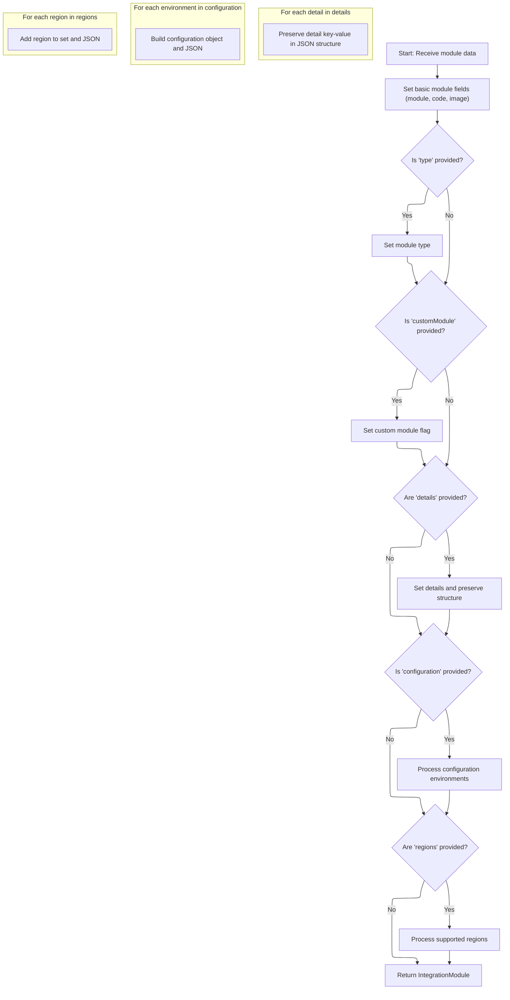

This document describes how integration module configurations are loaded and transformed into structured module objects. The flow starts by reading a configuration file containing module definitions. Each definition is converted into an object that preserves both structured fields and the original JSON format for details, configuration, and regions. This enables flexible use of integration modules within the system.

# Loading and Parsing Integration Module Configurations

<SwmSnippet path="/shopizer/sm-core/src/main/java/com/salesmanager/core/utils/reference/IntegrationModulesLoader.java" line="25">

---

In `loadIntegrationModules`, we kick off by grabbing the JSON config file from the classpath and parsing it into an array of maps using Jackson. Each map is assumed to represent a module's config. We then loop through these maps and call `loadModule` for each, which is where the actual conversion to IntegrationModule happens. Calling `loadModule` is necessary because it transforms the raw map data into the domain objects we actually use.

```java
	public List<IntegrationModule> loadIntegrationModules(String jsonFilePath) throws Exception {
		
		
		List<IntegrationModule> modules = new ArrayList<IntegrationModule>();
		
		ObjectMapper mapper = new ObjectMapper();
		
		try {
			
            InputStream in =
                this.getClass().getClassLoader().getResourceAsStream(jsonFilePath);
			
            
            @SuppressWarnings("rawtypes")
			Map[] objects = mapper.readValue(in, Map[].class);
            
            for(int i = 0; i < objects.length; i++) {
            	
            	modules.add(this.loadModule(objects[i]));
            }
            
            return modules;

```

---

</SwmSnippet>

## Transforming Raw Config Data into Module Objects



<SwmSnippet path="/shopizer/sm-core/src/main/java/com/salesmanager/core/utils/reference/IntegrationModulesLoader.java" line="61">

---

In `loadModule`, we start by pulling out basic fields from the map and handling type conversion for 'customModule'. Then, we manually serialize the 'details' map to a JSON string, making sure the structure matches the original input. This sets up the IntegrationModule with both direct fields and a preserved JSON structure for details.

```java
	public IntegrationModule loadModule(Map object) throws Exception {
		
			ObjectMapper mapper = new ObjectMapper();
	    	IntegrationModule module = new IntegrationModule();
	    	module.setModule((String)object.get("module"));
	    	module.setCode((String)object.get("code"));
	    	module.setImage((String)object.get("image"));
	    	
	    	if(object.get("type")!=null) {
	    		module.setType((String)object.get("type"));
	    	}
	    	
	    	if(object.get("customModule")!=null) {
	    		Object o = object.get("customModule");
	    		Boolean b = false;
	    		if(o instanceof Boolean) {
	    			b = (Boolean)object.get("customModule");
	    		} else {
	    			try {
	    				b = new Boolean((String)object.get("customModule"));
	    			} catch(Exception e) {
	    				LOGGER.error("Cannot cast " + o.getClass() + " tp a boolean value");
	    			}
	    		}
	    		module.setCustomModule(b);
	    	}
	    	//module.setRegions(regions)
	    	if(object.get("details")!=null) {
	    		
	    		Map<String,String> details = (Map<String,String>)object.get("details");
	    		module.setDetails(details);
	    		
	    		//maintain the original json structure
	    		StringBuilder detailsStructure = new StringBuilder();
	    		int count = 0;
	    		detailsStructure.append("{");
	    		for(String key : details.keySet()) {
	    			String jsonKeyString = mapper.writeValueAsString(key);
	    			detailsStructure.append(jsonKeyString);
	    			detailsStructure.append(":");
	    			String jsonValueString = mapper.writeValueAsString(details.get(key));
	    			detailsStructure.append(jsonValueString);
	        		if(count<(details.size()-1)) {
	        			detailsStructure.append(",");
	        		}
	        		count++;
	    		}
```

---

</SwmSnippet>

<SwmSnippet path="/shopizer/sm-core/src/main/java/com/salesmanager/core/utils/reference/IntegrationModulesLoader.java" line="108">

---

After setting up details, we move on to the 'configuration' list. For each config entry, we build a ModuleConfig object, serialize it to JSON, and add it to both a JSON array string and a map keyed by environment. This way, the IntegrationModule can provide config data as both a JSON blob and a lookup map.

```java
	    		detailsStructure.append("}");
	    		module.setConfigDetails(detailsStructure.toString());
	    		
	    	}
	    	
	    	
	    	List confs = (List)object.get("configuration");
	    	
	    	//convert to json
	    	
	    	
	    	
	    	if(confs!=null) {
	    		StringBuilder configString = new StringBuilder();
	    		configString.append("[");
	    		Map<String,ModuleConfig> moduleConfigs = new HashMap<String,ModuleConfig>();
	        	int count=0;
	    		for(Object oo : confs) {
	        		
	        		Map values = (Map)oo;
	        		
	        		String env = (String)values.get("env");
	        		
	        		ModuleConfig config = new ModuleConfig();
	        		config.setScheme((String)values.get("scheme"));
	        		config.setHost((String)values.get("host"));
	        		config.setPort((String)values.get("port"));
	        		config.setUri((String)values.get("uri"));
	        		config.setEnv((String)values.get("env"));
	        		if((String)values.get("config1")!=null) {
	        			config.setConfig1((String)values.get("config1"));
	        		}
	        		if((String)values.get("config2")!=null) {
	        			config.setConfig2((String)values.get("config2"));
	        		}
	        		
	        		String jsonConfigString = mapper.writeValueAsString(config);
	        		configString.append(jsonConfigString);
	        		
	        		moduleConfigs.put(env, config);
	        		
	        		if(count<(confs.size()-1)) {
	        			configString.append(",");
	        		}
	        		count++;
	        		
	        		
	        	}
```

---

</SwmSnippet>

<SwmSnippet path="/shopizer/sm-core/src/main/java/com/salesmanager/core/utils/reference/IntegrationModulesLoader.java" line="156">

---

After handling configuration, we process the 'regions' list. Each region string is added to a set for quick lookup and also serialized into a JSON array string. This keeps both the original JSON format and a fast-access set for internal use.

```java
	        	configString.append("]");
	        	module.setConfiguration(configString.toString());
	        	module.setModuleConfigs(moduleConfigs);
	    	}
	    	
	    	List<String> regions = (List<String>)object.get("regions");
	    	if(regions!=null) {
	    		
	
	    		StringBuilder configString = new StringBuilder();
	    		configString.append("[");
	    		int count=0;
	    		for(String region : regions) {
	    			
	    			module.getRegionsSet().add(region);
	    			String jsonConfigString = mapper.writeValueAsString(region);
	    			configString.append(jsonConfigString);
	    			
	        		if(count<(regions.size()-1)) {
	        			configString.append(",");
	        		}
	        		count++;
	
	    		}
```

---

</SwmSnippet>

<SwmSnippet path="/shopizer/sm-core/src/main/java/com/salesmanager/core/utils/reference/IntegrationModulesLoader.java" line="180">

---

Finally, we return the IntegrationModule with all fields set, including manually serialized JSON strings for details, configuration, and regions, plus structured objects and sets for internal use. This makes the module usable for both JSON-based consumers and internal logic.

```java
	    		configString.append("]");
	    		module.setRegions(configString.toString());
	
	    	}
	    	
	    	return module;
    	
		
	}
```

---

</SwmSnippet>

## Error Handling and Returning the Module List

<SwmSnippet path="/shopizer/sm-core/src/main/java/com/salesmanager/core/utils/reference/IntegrationModulesLoader.java" line="48">

---

Back in `loadIntegrationModules`, after calling `loadModule` for each map, we catch any exceptions and wrap them in a ServiceException. This means if anything goes wrong during module loading, the caller gets an error and no modules are returned.

```java
  		} catch (Exception e) {
  			throw new ServiceException(e);
  		}
  		
  		

		
	
	
	
	}
```

---

</SwmSnippet>

&nbsp;

*This is an auto-generated document by Swimm 🌊 and has not yet been verified by a human*

<SwmMeta version="3.0.0" repo-id="Z2l0aHViJTNBJTNBU2hvcGl6ZXIlM0ElM0F1bWFsaW5nYXN3YW1p" repo-name="Shopizer"><sup>Powered by [Swimm](https://app.swimm.io/)</sup></SwmMeta>
