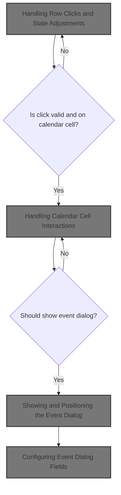
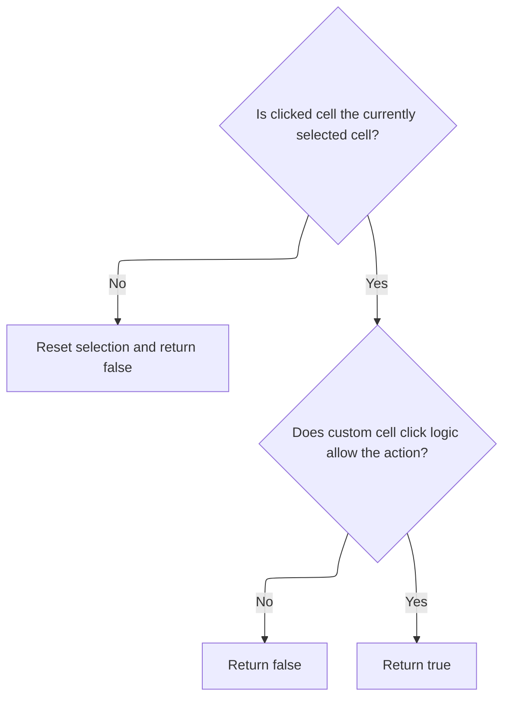
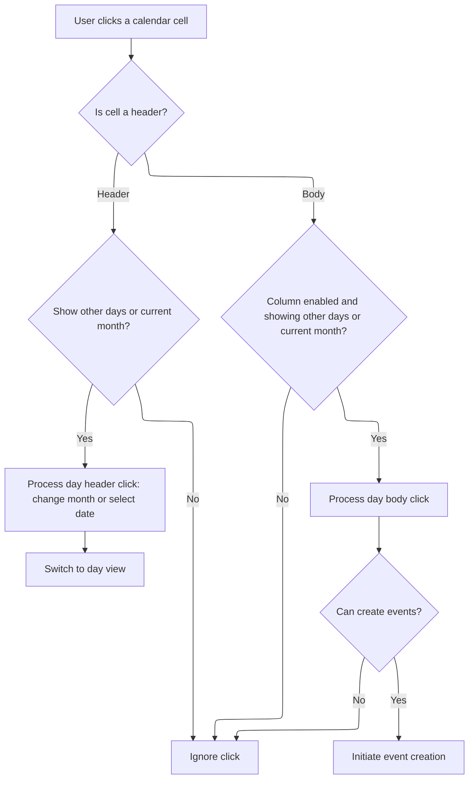

This document describes how user interactions with grid and calendar cells are managed in the UI. When a user clicks a cell, the system validates the action, updates selection state, and may show an event dialog for creating or editing events.



# Where is this flow used?

This flow is used multiple times in the codebase as represented in the following diagram:

```mermaid
graph TD;
      4347b58f0f474e04e1d7c567385436fc6f09a3efbbdb349a934cde7ee7ca1f3b(shopizer/…/modules/ISC_Grids.js::click) --> 76adc57a28b996b7ec62c041948c35581f63b2c99cb309a05721c31007763c63(shopizer/…/modules/ISC_Grids.js::$29y):::mainFlowStyle

71c9d230125aa6fb8b673a63d82b97a21e501a3d0226bfd366edee3aff793acd(shopizer/…/modules/ISC_Grids.js::isc_GridRenderer_click) --> 76adc57a28b996b7ec62c041948c35581f63b2c99cb309a05721c31007763c63(shopizer/…/modules/ISC_Grids.js::$29y):::mainFlowStyle

30f54191a5378b293ff76baed077490e0a99a6367084dc7c426521bad5d50b35(shopizer/…/modules/ISC_Grids.js::doubleClick) --> 76adc57a28b996b7ec62c041948c35581f63b2c99cb309a05721c31007763c63(shopizer/…/modules/ISC_Grids.js::$29y):::mainFlowStyle

976a2813b252aa90f765bdf425a00fc8a82a6365c494dce22e6e295bf2a48a42(shopizer/…/modules/ISC_Grids.js::isc_GridRenderer_doubleClick) --> 76adc57a28b996b7ec62c041948c35581f63b2c99cb309a05721c31007763c63(shopizer/…/modules/ISC_Grids.js::$29y):::mainFlowStyle


classDef mainFlowStyle color:#000000,fill:#7CB9F4
classDef rootsStyle color:#000000,fill:#00FFF4
classDef Style1 color:#000000,fill:#00FFAA
classDef Style2 color:#000000,fill:#FFFF00
classDef Style3 color:#000000,fill:#AA7CB9

%% Swimm:
%% graph TD;
%%       4347b58f0f474e04e1d7c567385436fc6f09a3efbbdb349a934cde7ee7ca1f3b(<SwmPath>[shopizer/…/modules/ISC_Grids.js](shopizer/sm-shop/src/main/webapp/resources/smart-client/system/modules/ISC_Grids.js)</SwmPath>::click) --> 76adc57a28b996b7ec62c041948c35581f63b2c99cb309a05721c31007763c63(<SwmPath>[shopizer/…/modules/ISC_Grids.js](shopizer/sm-shop/src/main/webapp/resources/smart-client/system/modules/ISC_Grids.js)</SwmPath>::<SwmToken path="shopizer/sm-shop/src/main/webapp/resources/smart-client/system/modules/ISC_Grids.js" pos="904:33:34" line-data="if(_5&amp;&amp;_5.isRemoveField){this.grid.removeRecordClick(_1,_2);_3=false}else{_3=this.Super(&quot;$29y&quot;,arguments)}">`$29y`</SwmToken>):::mainFlowStyle
%% 
%% 71c9d230125aa6fb8b673a63d82b97a21e501a3d0226bfd366edee3aff793acd(<SwmPath>[shopizer/…/modules/ISC_Grids.js](shopizer/sm-shop/src/main/webapp/resources/smart-client/system/modules/ISC_Grids.js)</SwmPath>::<SwmToken path="shopizer/sm-shop/src/main/webapp/resources/smart-client/system/modules/ISC_Grids.js" pos="823:9:9" line-data=",isc.A.click=function isc_GridRenderer_click(){if(this.$29p())return;var _1=this.getEventRow(),_2=this.getEventColumn();return this.$29y(_1,_2)}">`isc_GridRenderer_click`</SwmToken>) --> 76adc57a28b996b7ec62c041948c35581f63b2c99cb309a05721c31007763c63(<SwmPath>[shopizer/…/modules/ISC_Grids.js](shopizer/sm-shop/src/main/webapp/resources/smart-client/system/modules/ISC_Grids.js)</SwmPath>::<SwmToken path="shopizer/sm-shop/src/main/webapp/resources/smart-client/system/modules/ISC_Grids.js" pos="904:33:34" line-data="if(_5&amp;&amp;_5.isRemoveField){this.grid.removeRecordClick(_1,_2);_3=false}else{_3=this.Super(&quot;$29y&quot;,arguments)}">`$29y`</SwmToken>):::mainFlowStyle
%% 
%% 30f54191a5378b293ff76baed077490e0a99a6367084dc7c426521bad5d50b35(<SwmPath>[shopizer/…/modules/ISC_Grids.js](shopizer/sm-shop/src/main/webapp/resources/smart-client/system/modules/ISC_Grids.js)</SwmPath>::<SwmToken path="shopizer/sm-shop/src/main/webapp/resources/smart-client/system/modules/ISC_Grids.js" pos="605:74:74" line-data="this.observe(_1,&quot;resized&quot;,&quot;observer.$80d(observed, deltaX, deltaY)&quot;);_1.$29b=_1._redrawWithParent;_1._redrawWithParent=false;_1.$668=_1.bubbleMouseEvents;if(!_1.bubbleMouseEvents){_1.bubbleMouseEvents=[&quot;mouseDown&quot;,&quot;mouseUp&quot;,&quot;click&quot;,&quot;doubleClick&quot;,&quot;contextClick&quot;]}">`doubleClick`</SwmToken>) --> 76adc57a28b996b7ec62c041948c35581f63b2c99cb309a05721c31007763c63(<SwmPath>[shopizer/…/modules/ISC_Grids.js](shopizer/sm-shop/src/main/webapp/resources/smart-client/system/modules/ISC_Grids.js)</SwmPath>::<SwmToken path="shopizer/sm-shop/src/main/webapp/resources/smart-client/system/modules/ISC_Grids.js" pos="904:33:34" line-data="if(_5&amp;&amp;_5.isRemoveField){this.grid.removeRecordClick(_1,_2);_3=false}else{_3=this.Super(&quot;$29y&quot;,arguments)}">`$29y`</SwmToken>):::mainFlowStyle
%% 
%% 976a2813b252aa90f765bdf425a00fc8a82a6365c494dce22e6e295bf2a48a42(<SwmPath>[shopizer/…/modules/ISC_Grids.js](shopizer/sm-shop/src/main/webapp/resources/smart-client/system/modules/ISC_Grids.js)</SwmPath>::<SwmToken path="shopizer/sm-shop/src/main/webapp/resources/smart-client/system/modules/ISC_Grids.js" pos="830:9:9" line-data=",isc.A.doubleClick=function isc_GridRenderer_doubleClick(){if(this.$29p())return;var _1=this.getEventRow(),_2=this.getEventColumn();if(!(_1&gt;=0&amp;&amp;_2&gt;=0))return;if(!this.cellIsEnabled(_1,_2))return false;if(_1!=this.$29z){return this.$29y(_1,_2)}">`isc_GridRenderer_doubleClick`</SwmToken>) --> 76adc57a28b996b7ec62c041948c35581f63b2c99cb309a05721c31007763c63(<SwmPath>[shopizer/…/modules/ISC_Grids.js](shopizer/sm-shop/src/main/webapp/resources/smart-client/system/modules/ISC_Grids.js)</SwmPath>::<SwmToken path="shopizer/sm-shop/src/main/webapp/resources/smart-client/system/modules/ISC_Grids.js" pos="904:33:34" line-data="if(_5&amp;&amp;_5.isRemoveField){this.grid.removeRecordClick(_1,_2);_3=false}else{_3=this.Super(&quot;$29y&quot;,arguments)}">`$29y`</SwmToken>):::mainFlowStyle
%% 
%% 
%% classDef mainFlowStyle color:#000000,fill:#7CB9F4
%% classDef rootsStyle color:#000000,fill:#00FFF4
%% classDef Style1 color:#000000,fill:#00FFAA
%% classDef Style2 color:#000000,fill:#FFFF00
%% classDef Style3 color:#000000,fill:#AA7CB9
```



# Handling Row Clicks and State Adjustments

```mermaid
%%{init: {"flowchart": {"defaultRenderer": "elk"}} }%%
flowchart TD
  node1["User clicks a grid row"]
  click node1 openCode "shopizer/sm-shop/src/main/webapp/resources/smart-client/system/modules/ISC_Grids.js:824:827"
  node1 --> node2{"Is clicked row different from previous?"}
  click node2 openCode "shopizer/sm-shop/src/main/webapp/resources/smart-client/system/modules/ISC_Grids.js:824:827"
  node2 -->|"No"| node10["Do nothing"]
  click node10 openCode "shopizer/sm-shop/src/main/webapp/resources/smart-client/system/modules/ISC_Grids.js:824:827"
  node2 -->|"Yes"| node3{"Is X/Y coordinate as expected?"}
  click node3 openCode "shopizer/sm-shop/src/main/webapp/resources/smart-client/system/modules/ISC_Grids.js:824:827"
  node3 -->|"No"| node10
  node3 -->|"Yes"| node4{"Are row and column indices valid?"}
  click node4 openCode "shopizer/sm-shop/src/main/webapp/resources/smart-client/system/modules/ISC_Grids.js:826:827"
  node4 -->|"No"| node10
  node4 -->|"Yes"| node5{"Is cell enabled?"}
  click node5 openCode "shopizer/sm-shop/src/main/webapp/resources/smart-client/system/modules/ISC_Grids.js:826:827"
  node5 -->|"No"| node11["Return false"]
  click node11 openCode "shopizer/sm-shop/src/main/webapp/resources/smart-client/system/modules/ISC_Grids.js:826:827"
  node5 -->|"Yes"| node6{"Does cell pass custom validation?"}
  click node6 openCode "shopizer/sm-shop/src/main/webapp/resources/smart-client/system/modules/ISC_Grids.js:826:827"
  node6 -->|"No"| node12["Return false"]
  click node12 openCode "shopizer/sm-shop/src/main/webapp/resources/smart-client/system/modules/ISC_Grids.js:826:827"
  node6 -->|"Yes"| node7{"Does rowClick handler allow?"}
  click node7 openCode "shopizer/sm-shop/src/main/webapp/resources/smart-client/system/modules/ISC_Grids.js:826:827"
  node7 -->|"No"| node13["Return false"]
  click node13 openCode "shopizer/sm-shop/src/main/webapp/resources/smart-client/system/modules/ISC_Grids.js:826:827"
  node7 -->|"Yes"| node8["Trigger row click action"]
  click node8 openCode "shopizer/sm-shop/src/main/webapp/resources/smart-client/system/modules/ISC_Grids.js:826:827"
  node8 --> node9["Reset previous row selection"]
  click node9 openCode "shopizer/sm-shop/src/main/webapp/resources/smart-client/system/modules/ISC_Grids.js:826:827"
  node9 --> node14["Return result"]
  click node14 openCode "shopizer/sm-shop/src/main/webapp/resources/smart-client/system/modules/ISC_Grids.js:826:827"

classDef HeadingStyle fill:#777777,stroke:#333,stroke-width:2px;

%% Swimm:
%% %%{init: {"flowchart": {"defaultRenderer": "elk"}} }%%
%% flowchart TD
%%   node1["User clicks a grid row"]
%%   click node1 openCode "<SwmPath>[shopizer/…/modules/ISC_Grids.js](shopizer/sm-shop/src/main/webapp/resources/smart-client/system/modules/ISC_Grids.js)</SwmPath>:824:827"
%%   node1 --> node2{"Is clicked row different from previous?"}
%%   click node2 openCode "<SwmPath>[shopizer/…/modules/ISC_Grids.js](shopizer/sm-shop/src/main/webapp/resources/smart-client/system/modules/ISC_Grids.js)</SwmPath>:824:827"
%%   node2 -->|"No"| node10["Do nothing"]
%%   click node10 openCode "<SwmPath>[shopizer/…/modules/ISC_Grids.js](shopizer/sm-shop/src/main/webapp/resources/smart-client/system/modules/ISC_Grids.js)</SwmPath>:824:827"
%%   node2 -->|"Yes"| node3{"Is X/Y coordinate as expected?"}
%%   click node3 openCode "<SwmPath>[shopizer/…/modules/ISC_Grids.js](shopizer/sm-shop/src/main/webapp/resources/smart-client/system/modules/ISC_Grids.js)</SwmPath>:824:827"
%%   node3 -->|"No"| node10
%%   node3 -->|"Yes"| node4{"Are row and column indices valid?"}
%%   click node4 openCode "<SwmPath>[shopizer/…/modules/ISC_Grids.js](shopizer/sm-shop/src/main/webapp/resources/smart-client/system/modules/ISC_Grids.js)</SwmPath>:826:827"
%%   node4 -->|"No"| node10
%%   node4 -->|"Yes"| node5{"Is cell enabled?"}
%%   click node5 openCode "<SwmPath>[shopizer/…/modules/ISC_Grids.js](shopizer/sm-shop/src/main/webapp/resources/smart-client/system/modules/ISC_Grids.js)</SwmPath>:826:827"
%%   node5 -->|"No"| node11["Return false"]
%%   click node11 openCode "<SwmPath>[shopizer/…/modules/ISC_Grids.js](shopizer/sm-shop/src/main/webapp/resources/smart-client/system/modules/ISC_Grids.js)</SwmPath>:826:827"
%%   node5 -->|"Yes"| node6{"Does cell pass custom validation?"}
%%   click node6 openCode "<SwmPath>[shopizer/…/modules/ISC_Grids.js](shopizer/sm-shop/src/main/webapp/resources/smart-client/system/modules/ISC_Grids.js)</SwmPath>:826:827"
%%   node6 -->|"No"| node12["Return false"]
%%   click node12 openCode "<SwmPath>[shopizer/…/modules/ISC_Grids.js](shopizer/sm-shop/src/main/webapp/resources/smart-client/system/modules/ISC_Grids.js)</SwmPath>:826:827"
%%   node6 -->|"Yes"| node7{"Does <SwmToken path="shopizer/sm-shop/src/main/webapp/resources/smart-client/system/modules/ISC_Grids.js" pos="826:74:74" line-data="if(!(_1&gt;=0&amp;&amp;_2&gt;=0))return;if(!this.cellIsEnabled(_1,_2))return false;this.$29z=_1;var _4=this.getCellRecord(_1,_2),_5;if(!this.$22n(_4,_1,_2))_5=false;if(this.rowClick&amp;&amp;(this.rowClick(_4,_1,_2)==false))">`rowClick`</SwmToken> handler allow?"}
%%   click node7 openCode "<SwmPath>[shopizer/…/modules/ISC_Grids.js](shopizer/sm-shop/src/main/webapp/resources/smart-client/system/modules/ISC_Grids.js)</SwmPath>:826:827"
%%   node7 -->|"No"| node13["Return false"]
%%   click node13 openCode "<SwmPath>[shopizer/…/modules/ISC_Grids.js](shopizer/sm-shop/src/main/webapp/resources/smart-client/system/modules/ISC_Grids.js)</SwmPath>:826:827"
%%   node7 -->|"Yes"| node8["Trigger row click action"]
%%   click node8 openCode "<SwmPath>[shopizer/…/modules/ISC_Grids.js](shopizer/sm-shop/src/main/webapp/resources/smart-client/system/modules/ISC_Grids.js)</SwmPath>:826:827"
%%   node8 --> node9["Reset previous row selection"]
%%   click node9 openCode "<SwmPath>[shopizer/…/modules/ISC_Grids.js](shopizer/sm-shop/src/main/webapp/resources/smart-client/system/modules/ISC_Grids.js)</SwmPath>:826:827"
%%   node9 --> node14["Return result"]
%%   click node14 openCode "<SwmPath>[shopizer/…/modules/ISC_Grids.js](shopizer/sm-shop/src/main/webapp/resources/smart-client/system/modules/ISC_Grids.js)</SwmPath>:826:827"
%% 
%% classDef HeadingStyle fill:#777777,stroke:#333,stroke-width:2px;
```



<SwmSnippet path="/shopizer/sm-shop/src/main/webapp/resources/smart-client/system/modules/ISC_Grids.js" line="824">

---

Isc_GridRenderer__rowClick starts by adjusting indices based on internal state, validates them, checks cell enablement, and then calls $22n to handle cell-specific logic before invoking row click handlers and returning the result.

```javascript
,isc.A.$29y=function isc_GridRenderer__rowClick(_1,_2){this.$29z=this.$290=null;var _3=this.$29u;if(_3!=null&&_1!=_3){if(isc.EH.getX()==this.$723){_1=this.$29u}else{return}}
if(isc.EH.getY()==this.$724){_2=this.$29v}
if(!(_1>=0&&_2>=0))return;if(!this.cellIsEnabled(_1,_2))return false;this.$29z=_1;var _4=this.getCellRecord(_1,_2),_5;if(!this.$22n(_4,_1,_2))_5=false;if(this.rowClick&&(this.rowClick(_4,_1,_2)==false))
_5=false;this.$29u=null;return _5}
```

---

</SwmSnippet>

# Processing Cell Clicks and Validating State



<SwmSnippet path="/shopizer/sm-shop/src/main/webapp/resources/smart-client/system/modules/ISC_Grids.js" line="828">

---

Isc_GridRenderer__cellClick handles the cell click logic by checking if the column index matches the expected internal state. If it doesn't, it resets some state and exits. If it matches, it updates state and runs the <SwmToken path="shopizer/sm-shop/src/main/webapp/resources/smart-client/system/modules/ISC_Grids.js" pos="829:17:17" line-data="this.$290=_3;this.$291=null;return!(this.cellClick&amp;&amp;(this.cellClick(_1,_2,_3)==false))}">`cellClick`</SwmToken> callback, returning false if the callback says so. This sets up the next step, which is to pass control to the calendar module for further UI handling.

```javascript
,isc.A.$22n=function isc_GridRenderer__cellClick(_1,_2,_3){if(this.$29v!=_3){this.$290=null;return}
this.$290=_3;this.$291=null;return!(this.cellClick&&(this.cellClick(_1,_2,_3)==false))}
```

---

</SwmSnippet>

# Handling Calendar Cell Interactions



<SwmSnippet path="/shopizer/sm-shop/src/main/webapp/resources/smart-client/system/modules/ISC_Calendar.js" line="296">

---

Isc_MonthSchedule_cellClick manages calendar cell interactions by branching logic for header vs. body rows, checking if the clicked date is in the current month, and calling creator methods for day header/body clicks, date selection, and tab switching. It uses dynamic property names and constants for week/month boundaries, then moves to event creation if needed.

```javascript
,isc.A.cellClick=function isc_MonthSchedule_cellClick(_1,_2,_3){var _4=this.creator,_5,_6,_7=this.fields.get(_3).$66b,_8=_1["date"+_7],_9=_1["event"+_7],_10=_4.chosenDate.getMonth()!=_8.getMonth(),_11=false;if(this.rowIsHeader(_2)){if(!(!this.creator.showOtherDays&&_10)){_11=_4.dayHeaderClick(_8,_9,_4,_2,_3)}
if(_11){if(_2==0&&_1["day"+_7]>7){if(_4.month==0){_5=_4.year-1;_6=11}else{_5=_4.year;_6=_4.month-1}}else if(_2==this.data.length-2&&_1["day"+_7]<7){if(_4.month==11){_5=_4.year+1;_6=0}else{_5=_4.year;_6=_4.month+1}}else{_5=_4.year;_6=_4.month}
_4.dateChooser.dateClick(_5,_6,_1["day"+_7]);_4.selectTab(0)}}else{if(!this.colDisabled(_3)&&!(!_4.showOtherDays&&_10)){_11=_4.dayBodyClick(_8,_9,_4,_2,_3);if(_11&&_4.canCreateEvents){_4.$53l(_2,_3)}}}}
```

---

</SwmSnippet>

# Showing and Positioning the Event Dialog

```mermaid
%%{init: {"flowchart": {"defaultRenderer": "elk"}} }%%
flowchart TD
  node1["User requests event dialog"] --> node2{"Is editing an existing event?"}
  click node1 openCode "shopizer/sm-shop/src/main/webapp/resources/smart-client/system/modules/ISC_Calendar.js:181:184"
  node2 -->|"Create new event"| node3["Prepare dialog for new event"]
  click node2 openCode "shopizer/sm-shop/src/main/webapp/resources/smart-client/system/modules/ISC_Calendar.js:181:183"
  node2 -->|"Edit existing event"| node4["Prepare dialog for editing event"]
  click node3 openCode "shopizer/sm-shop/src/main/webapp/resources/smart-client/system/modules/ISC_Calendar.js:181:183"
  click node4 openCode "shopizer/sm-shop/src/main/webapp/resources/smart-client/system/modules/ISC_Calendar.js:183:183"
  node3 --> node5{"Is calendar in month view?"}
  click node5 openCode "shopizer/sm-shop/src/main/webapp/resources/smart-client/system/modules/ISC_Calendar.js:181:181"
  node5 -->|"Yes"| node6["Adjust event time for month view"]
  click node6 openCode "shopizer/sm-shop/src/main/webapp/resources/smart-client/system/modules/ISC_Calendar.js:181:181"
  node5 -->|"No"| node7["Set default event time"]
  click node7 openCode "shopizer/sm-shop/src/main/webapp/resources/smart-client/system/modules/ISC_Calendar.js:181:181"
  node6 --> node8{"Is this a multi-day event?"}
  node7 --> node8
  click node8 openCode "shopizer/sm-shop/src/main/webapp/resources/smart-client/system/modules/ISC_Calendar.js:182:182"
  node8 -->|"Yes"| node9["Set end date for event"]
  click node9 openCode "shopizer/sm-shop/src/main/webapp/resources/smart-client/system/modules/ISC_Calendar.js:182:182"
  node8 -->|"No"| node10["Skip end date"]
  click node10 openCode "shopizer/sm-shop/src/main/webapp/resources/smart-client/system/modules/ISC_Calendar.js:181:182"
  node9 --> node11["Position and show dialog near selected cell"]
  node10 --> node11
  node4 --> node11["Position and show dialog near selected cell"]
  click node11 openCode "shopizer/sm-shop/src/main/webapp/resources/smart-client/system/modules/ISC_Calendar.js:184:184"
classDef HeadingStyle fill:#777777,stroke:#333,stroke-width:2px;

%% Swimm:
%% %%{init: {"flowchart": {"defaultRenderer": "elk"}} }%%
%% flowchart TD
%%   node1["User requests event dialog"] --> node2{"Is editing an existing event?"}
%%   click node1 openCode "<SwmPath>[shopizer/…/modules/ISC_Calendar.js](shopizer/sm-shop/src/main/webapp/resources/smart-client/system/modules/ISC_Calendar.js)</SwmPath>:181:184"
%%   node2 -->|"Create new event"| node3["Prepare dialog for new event"]
%%   click node2 openCode "<SwmPath>[shopizer/…/modules/ISC_Calendar.js](shopizer/sm-shop/src/main/webapp/resources/smart-client/system/modules/ISC_Calendar.js)</SwmPath>:181:183"
%%   node2 -->|"Edit existing event"| node4["Prepare dialog for editing event"]
%%   click node3 openCode "<SwmPath>[shopizer/…/modules/ISC_Calendar.js](shopizer/sm-shop/src/main/webapp/resources/smart-client/system/modules/ISC_Calendar.js)</SwmPath>:181:183"
%%   click node4 openCode "<SwmPath>[shopizer/…/modules/ISC_Calendar.js](shopizer/sm-shop/src/main/webapp/resources/smart-client/system/modules/ISC_Calendar.js)</SwmPath>:183:183"
%%   node3 --> node5{"Is calendar in month view?"}
%%   click node5 openCode "<SwmPath>[shopizer/…/modules/ISC_Calendar.js](shopizer/sm-shop/src/main/webapp/resources/smart-client/system/modules/ISC_Calendar.js)</SwmPath>:181:181"
%%   node5 -->|"Yes"| node6["Adjust event time for month view"]
%%   click node6 openCode "<SwmPath>[shopizer/…/modules/ISC_Calendar.js](shopizer/sm-shop/src/main/webapp/resources/smart-client/system/modules/ISC_Calendar.js)</SwmPath>:181:181"
%%   node5 -->|"No"| node7["Set default event time"]
%%   click node7 openCode "<SwmPath>[shopizer/…/modules/ISC_Calendar.js](shopizer/sm-shop/src/main/webapp/resources/smart-client/system/modules/ISC_Calendar.js)</SwmPath>:181:181"
%%   node6 --> node8{"Is this a multi-day event?"}
%%   node7 --> node8
%%   click node8 openCode "<SwmPath>[shopizer/…/modules/ISC_Calendar.js](shopizer/sm-shop/src/main/webapp/resources/smart-client/system/modules/ISC_Calendar.js)</SwmPath>:182:182"
%%   node8 -->|"Yes"| node9["Set end date for event"]
%%   click node9 openCode "<SwmPath>[shopizer/…/modules/ISC_Calendar.js](shopizer/sm-shop/src/main/webapp/resources/smart-client/system/modules/ISC_Calendar.js)</SwmPath>:182:182"
%%   node8 -->|"No"| node10["Skip end date"]
%%   click node10 openCode "<SwmPath>[shopizer/…/modules/ISC_Calendar.js](shopizer/sm-shop/src/main/webapp/resources/smart-client/system/modules/ISC_Calendar.js)</SwmPath>:181:182"
%%   node9 --> node11["Position and show dialog near selected cell"]
%%   node10 --> node11
%%   node4 --> node11["Position and show dialog near selected cell"]
%%   click node11 openCode "<SwmPath>[shopizer/…/modules/ISC_Calendar.js](shopizer/sm-shop/src/main/webapp/resources/smart-client/system/modules/ISC_Calendar.js)</SwmPath>:184:184"
%% classDef HeadingStyle fill:#777777,stroke:#333,stroke-width:2px;
```



<SwmSnippet path="/shopizer/sm-shop/src/main/webapp/resources/smart-client/system/modules/ISC_Calendar.js" line="181">

---

Isc_Calendar__showEventDialog sets up and displays the event dialog, configuring fields and dates based on whether it's a new or existing event. It adjusts the start time for month view, calculates end dates if needed, and positions the dialog near the selected cell. The dialog is moved off-screen first to avoid flicker, then shown and brought to the front.

```javascript
,isc.A.$53l=function isc_Calendar__showEventDialog(_1,_2,_3,_4){if(!_4){this.eventDialog.event=null;if(this.eventEditorLayout)this.eventEditorLayout.event=null;this.eventDialog.items[0].createFields(false);var _5,_6;_5=this.$53m(_1,_2);if(this.monthViewSelected()){var _7=new Date();_7=_7.getHours();if(_7>22)_7-=1;_5.setHours(_7)}
if(_3&&_3>1){_6=this.$53m(_1+_3,_2)}
this.eventDialog.setDate(_5,_6)}else{this.eventDialog.eventWindow=_4;this.eventDialog.items[0].createFields(true);this.eventDialog.setEvent(_4.event)}
this.eventDialog.moveTo(0,-10000);this.eventDialog.show();var _8=this.getSelectedView().getCellPageRect(_1,_2);this.eventDialog.placeNear(_8[0],_8[1]);isc.Timer.setTimeout(this.ID+".eventDialog.bringToFront()")}
```

---

</SwmSnippet>

# Configuring Event Dialog Fields

<SwmSnippet path="/shopizer/sm-shop/src/main/webapp/resources/smart-client/system/modules/ISC_Calendar.js" line="157">

---

In <SwmToken path="shopizer/sm-shop/src/main/webapp/resources/smart-client/system/modules/ISC_Calendar.js" pos="157:103:103" line-data="return _13},setCustomValues:function(_37){if(!this.calendar.eventDialogFields)return;var _11=this.$642;var _12=this.calendar.eventDialogFields;for(var i=0;i&lt;_12.length;i++){var _14=_12[i];if(_14.name&amp;&amp;!_11.contains(_14.name)){this.setValue(_14.name,_37[_14.name])}}},createFields:function(_37){var _15=_37?&quot;staticText&quot;:&quot;text&quot;;var _3=this.calendar;var _16=[{name:_3.nameField,title:_3.eventNameFieldTitle,type:_15,width:250},{name:&quot;save&quot;,title:_3.saveButtonTitle,type:&quot;SubmitItem&quot;,endRow:false},{name:&quot;details&quot;,title:_3.detailsButtonTitle,type:&quot;button&quot;,startRow:false,click:function(_25,_38){_25.calendar.$53j(_25.calendar.eventDialog.event)}}];if(_37)_16.removeAt(1);var _17=isc.DataSource.create({addGlobalId:false,fields:_16});this.setDataSource(_17);this.setFields(isc.shallowClone(this.calendar.eventDialogFields))},submit:function(){var _3=this.calendar,_18=_3.eventDialog.event,_19=_3.eventDialog.currentStart,_20=_3.eventDialog.currentEnd;if(!this.validate())return;if(_18){_3.updateEvent(_18,_19,_20,this.getItem(this.calendar.nameField).getValue(),_18[_3.descriptionField],this.getCustomValues(),true);_3.eventDialog.hide()}else{_3.addEvent(_19,_20,this.getItem(this.calendar.nameField).getValue(),&quot;&quot;,this.getCustomValues(),true);_3.eventDialog.hide()}}})],setDate:function(_37,_38){if(!_38){if(_37.getHours()==23&amp;&amp;_37.getMinutes()==30){_38=new Date(_37.getFullYear(),_37.getMonth(),_37.getDate()+1)}else{_38=new Date(_37.getFullYear(),_37.getMonth(),_37.getDate(),_37.getHours()+1,_37.getMinutes())}}">`createFields`</SwmToken>, the function sets up the event dialog fields, choosing field types based on the input, and clones the dialog field definitions. When setting the date, if the end date isn't provided and the start time is 23:30, it rolls over to the next day at midnight; otherwise, it adds one hour. This is a custom rule for event timing.

```javascript
return _13},setCustomValues:function(_37){if(!this.calendar.eventDialogFields)return;var _11=this.$642;var _12=this.calendar.eventDialogFields;for(var i=0;i<_12.length;i++){var _14=_12[i];if(_14.name&&!_11.contains(_14.name)){this.setValue(_14.name,_37[_14.name])}}},createFields:function(_37){var _15=_37?"staticText":"text";var _3=this.calendar;var _16=[{name:_3.nameField,title:_3.eventNameFieldTitle,type:_15,width:250},{name:"save",title:_3.saveButtonTitle,type:"SubmitItem",endRow:false},{name:"details",title:_3.detailsButtonTitle,type:"button",startRow:false,click:function(_25,_38){_25.calendar.$53j(_25.calendar.eventDialog.event)}}];if(_37)_16.removeAt(1);var _17=isc.DataSource.create({addGlobalId:false,fields:_16});this.setDataSource(_17);this.setFields(isc.shallowClone(this.calendar.eventDialogFields))},submit:function(){var _3=this.calendar,_18=_3.eventDialog.event,_19=_3.eventDialog.currentStart,_20=_3.eventDialog.currentEnd;if(!this.validate())return;if(_18){_3.updateEvent(_18,_19,_20,this.getItem(this.calendar.nameField).getValue(),_18[_3.descriptionField],this.getCustomValues(),true);_3.eventDialog.hide()}else{_3.addEvent(_19,_20,this.getItem(this.calendar.nameField).getValue(),"",this.getCustomValues(),true);_3.eventDialog.hide()}}})],setDate:function(_37,_38){if(!_38){if(_37.getHours()==23&&_37.getMinutes()==30){_38=new Date(_37.getFullYear(),_37.getMonth(),_37.getDate()+1)}else{_38=new Date(_37.getFullYear(),_37.getMonth(),_37.getDate(),_37.getHours()+1,_37.getMinutes())}}
```

---

</SwmSnippet>

<SwmSnippet path="/shopizer/sm-shop/src/main/webapp/resources/smart-client/system/modules/ISC_Calendar.js" line="157">

---

When setting the event date, if the end date isn't given and the start time is 23:30, the function returns a new date at midnight the next day. Otherwise, it returns a date one hour later. This is a hardcoded rule to avoid awkward event end times.

```javascript
return _13},setCustomValues:function(_37){if(!this.calendar.eventDialogFields)return;var _11=this.$642;var _12=this.calendar.eventDialogFields;for(var i=0;i<_12.length;i++){var _14=_12[i];if(_14.name&&!_11.contains(_14.name)){this.setValue(_14.name,_37[_14.name])}}},createFields:function(_37){var _15=_37?"staticText":"text";var _3=this.calendar;var _16=[{name:_3.nameField,title:_3.eventNameFieldTitle,type:_15,width:250},{name:"save",title:_3.saveButtonTitle,type:"SubmitItem",endRow:false},{name:"details",title:_3.detailsButtonTitle,type:"button",startRow:false,click:function(_25,_38){_25.calendar.$53j(_25.calendar.eventDialog.event)}}];if(_37)_16.removeAt(1);var _17=isc.DataSource.create({addGlobalId:false,fields:_16});this.setDataSource(_17);this.setFields(isc.shallowClone(this.calendar.eventDialogFields))},submit:function(){var _3=this.calendar,_18=_3.eventDialog.event,_19=_3.eventDialog.currentStart,_20=_3.eventDialog.currentEnd;if(!this.validate())return;if(_18){_3.updateEvent(_18,_19,_20,this.getItem(this.calendar.nameField).getValue(),_18[_3.descriptionField],this.getCustomValues(),true);_3.eventDialog.hide()}else{_3.addEvent(_19,_20,this.getItem(this.calendar.nameField).getValue(),"",this.getCustomValues(),true);_3.eventDialog.hide()}}})],setDate:function(_37,_38){if(!_38){if(_37.getHours()==23&&_37.getMinutes()==30){_38=new Date(_37.getFullYear(),_37.getMonth(),_37.getDate()+1)}else{_38=new Date(_37.getFullYear(),_37.getMonth(),_37.getDate(),_37.getHours()+1,_37.getMinutes())}}
```

---

</SwmSnippet>

&nbsp;

*This is an auto-generated document by Swimm 🌊 and has not yet been verified by a human*

<SwmMeta version="3.0.0" repo-id="Z2l0aHViJTNBJTNBU2hvcGl6ZXIlM0ElM0F1bWFsaW5nYXN3YW1p" repo-name="Shopizer"><sup>Powered by [Swimm](https://app.swimm.io/)</sup></SwmMeta>
